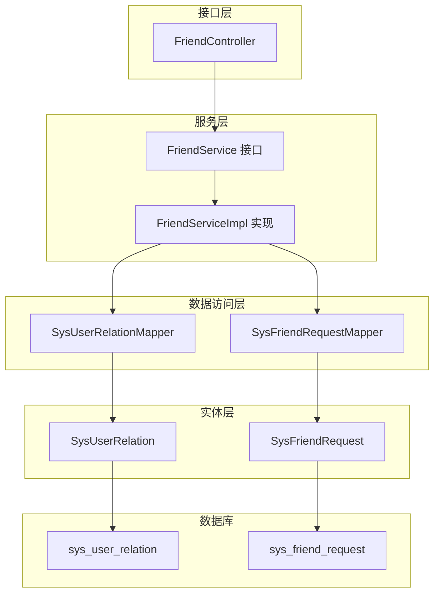
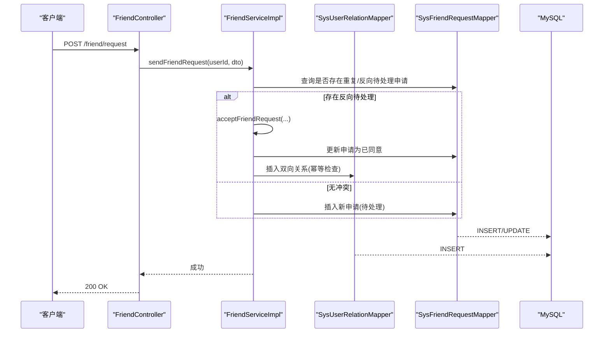
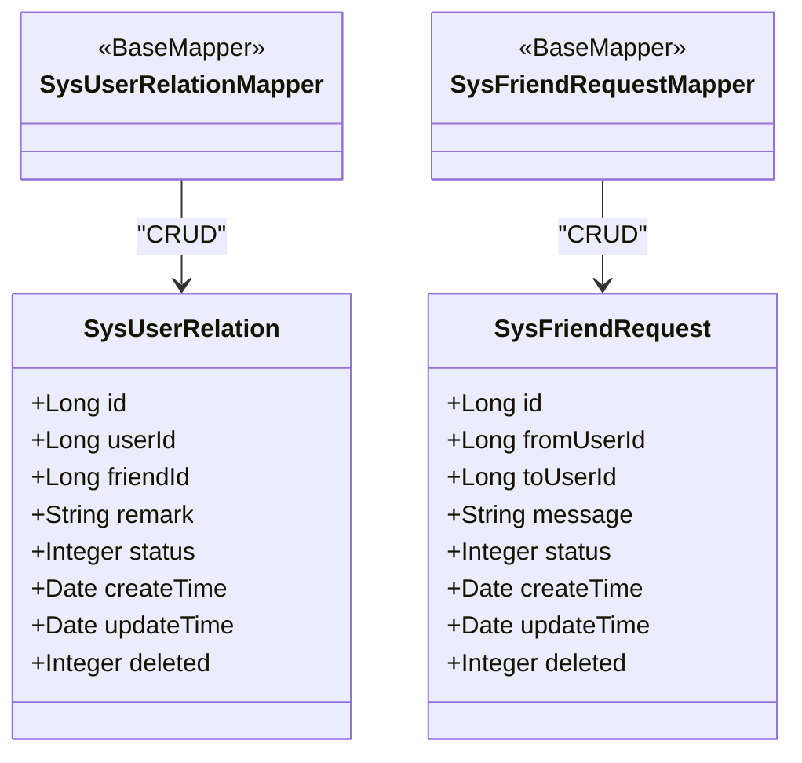
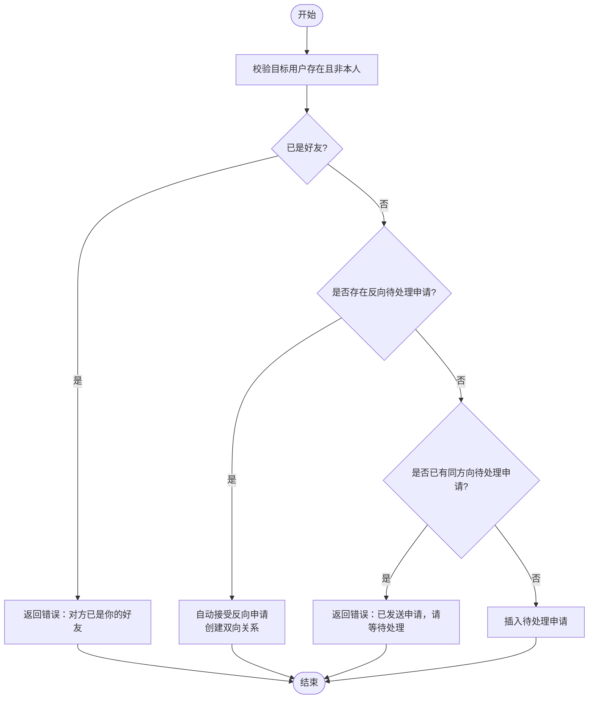
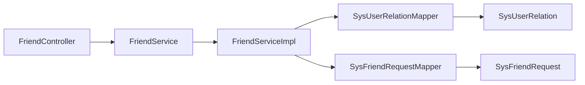

# 好友关系模块设计

<cite>
**本文引用的文件列表**
- [001_add_user_profile_and_friend_tables.sql](file://linkx-server/migrations/001_add_user_profile_and_friend_tables.sql)
- [SysUserRelation.java](file://linkx-server/src/main/java/com/linkx/server/entity/SysUserRelation.java)
- [SysFriendRequest.java](file://linkx-server/src/main/java/com/linkx/server/entity/SysFriendRequest.java)
- [SysUserRelationMapper.java](file://linkx-server/src/main/java/com/linkx/server/mapper/SysUserRelationMapper.java)
- [SysFriendRequestMapper.java](file://linkx-server/src/main/java/com/linkx/server/mapper/SysFriendRequestMapper.java)
- [FriendController.java](file://linkx-server/src/main/java/com/linkx/server/controller/FriendController.java)
- [FriendService.java](file://linkx-server/src/main/java/com/linkx/server/service/FriendService.java)
- [FriendServiceImpl.java](file://linkx-server/src/main/java/com/linkx/server/service/impl/FriendServiceImpl.java)
- [SendFriendRequestDTO.java](file://linkx-server/src/main/java/com/linkx/server/controller/dto/SendFriendRequestDTO.java)
- [FriendItemVO.java](file://linkx-server/src/main/java/com/linkx/server/controller/vo/FriendItemVO.java)
- [FriendRequestVO.java](file://linkx-server/src/main/java/com/linkx/server/controller/vo/FriendRequestVO.java)
</cite>

## 目录
1. [引言](#引言)
2. [项目结构](#项目结构)
3. [核心组件](#核心组件)
4. [架构总览](#架构总览)
5. [详细组件分析](#详细组件分析)
6. [依赖分析](#依赖分析)
7. [性能与索引优化](#性能与索引优化)
8. [事务、一致性与并发控制](#事务一致性与并发控制)
9. [故障排查指南](#故障排查指南)
10. [结论](#结论)

## 引言
本设计文档聚焦 LinkX 好友关系模块的数据库设计与实现，围绕以下目标展开：
- 详细说明 sys_user_relation 表的好友关系存储结构，包括双向好友关系的实现策略、备注管理与状态控制。
- 解释 sys_friend_request 表的好友申请流程设计，涵盖申请状态流转、验证消息存储与处理逻辑。
- 分析查询优化策略、索引设计与性能调优方案。
- 覆盖增删改查操作、数据一致性保证与并发访问处理。

## 项目结构
后端采用分层架构：Controller 暴露 HTTP API，Service 封装业务逻辑，Mapper 负责数据访问，Entity 映射数据库表，迁移脚本定义表结构与索引。

图表来源
- [FriendController.java:1-96](file://linkx-server/src/main/java/com/linkx/server/controller/FriendController.java#L1-L96)
- [FriendService.java:1-28](file://linkx-server/src/main/java/com/linkx/server/service/FriendService.java#L1-L28)
- [FriendServiceImpl.java:1-333](file://linkx-server/src/main/java/com/linkx/server/service/impl/FriendServiceImpl.java#L1-L333)
- [SysUserRelationMapper.java:1-21](file://linkx-server/src/main/java/com/linkx/server/mapper/SysUserRelationMapper.java#L1-L21)
- [SysFriendRequestMapper.java:1-10](file://linkx-server/src/main/java/com/linkx/server/mapper/SysFriendRequestMapper.java#L1-L10)
- [SysUserRelation.java:1-71](file://linkx-server/src/main/java/com/linkx/server/entity/SysUserRelation.java#L1-L71)
- [SysFriendRequest.java:1-55](file://linkx-server/src/main/java/com/linkx/server/entity/SysFriendRequest.java#L1-L55)
- [001_add_user_profile_and_friend_tables.sql:51-79](file://linkx-server/migrations/001_add_user_profile_and_friend_tables.sql#L51-L79)

章节来源
- [FriendController.java:1-96](file://linkx-server/src/main/java/com/linkx/server/controller/FriendController.java#L1-L96)
- [FriendServiceImpl.java:1-333](file://linkx-server/src/main/java/com/linkx/server/service/impl/FriendServiceImpl.java#L1-L333)
- [001_add_user_profile_and_friend_tables.sql:51-79](file://linkx-server/migrations/001_add_user_profile_and_friend_tables.sql#L51-L79)

## 核心组件
- 实体模型
  - SysUserRelation：表示用户 A 对 B 的单向好友关系记录，包含备注 remark、状态 status（1=正常，2=拉黑）、时间戳与逻辑删除字段。
  - SysFriendRequest：表示好友申请记录，包含申请人 fromUserId、被申请人 toUserId、验证消息 message、状态 status（0=待处理，1=已同意，2=已拒绝）。
- Mapper 接口
  - SysUserRelationMapper、SysFriendRequestMapper：基于 MyBatis-Flex 的通用 BaseMapper，提供基础 CRUD 能力。
- 控制器与服务
  - FriendController：对外暴露搜索用户、发送申请、查看收/发申请、接受/拒绝申请、列出好友、删除好友等接口。
  - FriendServiceImpl：实现完整业务流程，含幂等性校验、双向关系创建、批量用户信息聚合等。

章节来源
- [SysUserRelation.java:1-71](file://linkx-server/src/main/java/com/linkx/server/entity/SysUserRelation.java#L1-L71)
- [SysFriendRequest.java:1-55](file://linkx-server/src/main/java/com/linkx/server/entity/SysFriendRequest.java#L1-L55)
- [SysUserRelationMapper.java:1-21](file://linkx-server/src/main/java/com/linkx/server/mapper/SysUserRelationMapper.java#L1-L21)
- [SysFriendRequestMapper.java:1-10](file://linkx-server/src/main/java/com/linkx/server/mapper/SysFriendRequestMapper.java#L1-L10)
- [FriendController.java:1-96](file://linkx-server/src/main/java/com/linkx/server/controller/FriendController.java#L1-L96)
- [FriendServiceImpl.java:1-333](file://linkx-server/src/main/java/com/linkx/server/service/impl/FriendServiceImpl.java#L1-L333)

## 架构总览
从请求到落库的关键路径如下：

图表来源
- [FriendController.java:34-41](file://linkx-server/src/main/java/com/linkx/server/controller/FriendController.java#L34-L41)
- [FriendServiceImpl.java:92-138](file://linkx-server/src/main/java/com/linkx/server/service/impl/FriendServiceImpl.java#L92-L138)
- [SysFriendRequestMapper.java:1-10](file://linkx-server/src/main/java/com/linkx/server/mapper/SysFriendRequestMapper.java#L1-L10)
- [SysUserRelationMapper.java:1-21](file://linkx-server/src/main/java/com/linkx/server/mapper/SysUserRelationMapper.java#L1-L21)

## 详细组件分析

### 数据模型与表结构
- sys_user_relation
  - 主键 id（雪花算法）
  - user_id：发起方/所属用户
  - friend_id：被添加为“好友”的用户
  - remark：好友备注（可为空）
  - status：1=正常，2=拉黑
  - create_time/update_time：时间戳
  - deleted：逻辑删除标记
  - 唯一约束 uk_user_friend(user_id, friend_id) 防止重复单向关系
  - 索引 idx_user_id、idx_friend_id 用于按用户维度快速检索
- sys_friend_request
  - 主键 id（雪花算法）
  - from_user_id：申请人
  - to_user_id：被申请人
  - message：验证消息
  - status：0=待处理，1=已同意，2=已拒绝
  - create_time/update_time：时间戳
  - deleted：逻辑删除标记
  - 复合索引 idx_to_user_status(to_user_id, status) 加速“我收到的待处理申请”查询
  - 索引 idx_from_user(from_user_id) 加速“我发出的申请”查询

章节来源
- [001_add_user_profile_and_friend_tables.sql:51-79](file://linkx-server/migrations/001_add_user_profile_and_friend_tables.sql#L51-L79)
- [SysUserRelation.java:28-71](file://linkx-server/src/main/java/com/linkx/server/entity/SysUserRelation.java#L28-L71)
- [SysFriendRequest.java:16-55](file://linkx-server/src/main/java/com/linkx/server/entity/SysFriendRequest.java#L16-L55)

#### 类图（实体与 Mapper）

图表来源
- [SysUserRelation.java:1-71](file://linkx-server/src/main/java/com/linkx/server/entity/SysUserRelation.java#L1-L71)
- [SysFriendRequest.java:1-55](file://linkx-server/src/main/java/com/linkx/server/entity/SysFriendRequest.java#L1-L55)
- [SysUserRelationMapper.java:1-21](file://linkx-server/src/main/java/com/linkx/server/mapper/SysUserRelationMapper.java#L1-L21)
- [SysFriendRequestMapper.java:1-10](file://linkx-server/src/main/java/com/linkx/server/mapper/SysFriendRequestMapper.java#L1-L10)

### 双向好友关系实现策略
- 单向建模：每条记录代表“user_id 将 friend_id 视为好友”，通过唯一键 (user_id, friend_id) 确保单向关系不重复。
- 双向构建：当申请被接受时，在事务内分别插入两条单向关系（A→B 与 B→A），并通过 isFriend 幂等检查避免重复插入。
- 拉黑与删除：
  - 拉黑：将对应单向关系 status 置为 2；查询好友列表时仅返回 status=1。
  - 删除好友：同时移除 A→B 与 B→A 两条单向关系。

章节来源
- [FriendServiceImpl.java:262-282](file://linkx-server/src/main/java/com/linkx/server/service/impl/FriendServiceImpl.java#L262-L282)
- [FriendServiceImpl.java:236-243](file://linkx-server/src/main/java/com/linkx/server/service/impl/FriendServiceImpl.java#L236-L243)
- [FriendServiceImpl.java:195-201](file://linkx-server/src/main/java/com/linkx/server/service/impl/FriendServiceImpl.java#L195-L201)

### 好友申请流程设计
- 发送申请
  - 校验目标用户存在且非本人，若已是好友则拒绝。
  - 检测是否存在反向待处理申请：若存在，直接走“接受”流程并返回成功（幂等合并）。
  - 检测是否已有同方向待处理申请：若有，提示等待对方处理。
  - 否则插入一条待处理申请记录。
- 查看申请
  - 接收到的申请：按 to_user_id 查询并按时间倒序。
  - 发出的申请：按 from_user_id 查询并按时间倒序。
- 接受/拒绝申请
  - 权限校验：仅被申请人可处理。
  - 状态机：待处理 → 已同意/已拒绝。
  - 接受后：在事务中更新申请状态并创建双向好友关系。

图表来源
- [FriendServiceImpl.java:92-138](file://linkx-server/src/main/java/com/linkx/server/service/impl/FriendServiceImpl.java#L92-L138)

章节来源
- [FriendServiceImpl.java:92-138](file://linkx-server/src/main/java/com/linkx/server/service/impl/FriendServiceImpl.java#L92-L138)
- [FriendServiceImpl.java:161-176](file://linkx-server/src/main/java/com/linkx/server/service/impl/FriendServiceImpl.java#L161-L176)
- [FriendServiceImpl.java:179-192](file://linkx-server/src/main/java/com/linkx/server/service/impl/FriendServiceImpl.java#L179-L192)

### 好友列表与备注管理
- 好友列表
  - 查询当前用户的单向关系（status=1），获取 friendId 集合后批量加载用户信息，再组装 VO。
- 备注管理
  - 备注存储在单向关系中，即“我对某人的备注”。
  - 展示时以 friendId 为键取备注值，便于一次关联填充。

章节来源
- [FriendServiceImpl.java:195-233](file://linkx-server/src/main/java/com/linkx/server/service/impl/FriendServiceImpl.java#L195-L233)
- [FriendItemVO.java:1-23](file://linkx-server/src/main/java/com/linkx/server/controller/vo/FriendItemVO.java#L1-L23)

### 删除好友
- 先校验双方是否为好友（任一方向不存在或状态异常均视为非好友）。
- 在事务内删除 A→B 与 B→A 两条单向关系。

章节来源
- [FriendServiceImpl.java:236-243](file://linkx-server/src/main/java/com/linkx/server/service/impl/FriendServiceImpl.java#L236-L243)

## 依赖分析
- 控制器依赖 Service 接口，实现由 Spring 注入。
- Service 依赖三个 Mapper：用户、好友关系、好友申请。
- 实体与表结构一一对应，Mapper 继承 BaseMapper 提供通用方法。

图表来源
- [FriendController.java:1-96](file://linkx-server/src/main/java/com/linkx/server/controller/FriendController.java#L1-L96)
- [FriendService.java:1-28](file://linkx-server/src/main/java/com/linkx/server/service/FriendService.java#L1-L28)
- [FriendServiceImpl.java:1-333](file://linkx-server/src/main/java/com/linkx/server/service/impl/FriendServiceImpl.java#L1-L333)
- [SysUserRelationMapper.java:1-21](file://linkx-server/src/main/java/com/linkx/server/mapper/SysUserRelationMapper.java#L1-L21)
- [SysFriendRequestMapper.java:1-10](file://linkx-server/src/main/java/com/linkx/server/mapper/SysFriendRequestMapper.java#L1-L10)
- [SysUserRelation.java:1-71](file://linkx-server/src/main/java/com/linkx/server/entity/SysUserRelation.java#L1-L71)
- [SysFriendRequest.java:1-55](file://linkx-server/src/main/java/com/linkx/server/entity/SysFriendRequest.java#L1-L55)

## 性能与索引优化
- 关键查询与索引匹配
  - 好友列表：WHERE user_id=? AND status=1 ORDER BY create_time DESC
    - 命中索引 idx_user_id，建议联合索引 (user_id, status, create_time) 进一步优化排序与过滤。
  - 接收到的待处理申请：WHERE to_user_id=? AND status=0
    - 命中复合索引 idx_to_user_status，无需额外调整。
  - 发出的申请：WHERE from_user_id=?
    - 命中索引 idx_from_user。
  - 双向关系去重：UNIQUE KEY uk_user_friend(user_id, friend_id) 保障写入幂等与唯一性。
- 批量加载优化
  - 好友列表与申请列表均采用 IN 批量加载用户信息，减少 N+1 查询。
- 分页与限流
  - 用户搜索限制返回条数，避免大结果集。
  - 建议在高频接口增加分页参数与缓存策略（如 Redis 缓存热点用户资料）。

章节来源
- [001_add_user_profile_and_friend_tables.sql:51-79](file://linkx-server/migrations/001_add_user_profile_and_friend_tables.sql#L51-L79)
- [FriendServiceImpl.java:195-233](file://linkx-server/src/main/java/com/linkx/server/service/impl/FriendServiceImpl.java#L195-L233)
- [FriendServiceImpl.java:141-158](file://linkx-server/src/main/java/com/linkx/server/service/impl/FriendServiceImpl.java#L141-L158)
- [FriendServiceImpl.java:40-81](file://linkx-server/src/main/java/com/linkx/server/service/impl/FriendServiceImpl.java#L40-L81)

## 事务、一致性与并发控制
- 事务边界
  - 接受申请：在同一事务内更新申请状态并插入双向关系，保证原子性。
  - 删除好友：在同一事务内删除两条单向关系，避免半删导致的状态不一致。
- 幂等与并发安全
  - 发送申请前检查反向待处理申请，若存在则自动接受，避免重复申请。
  - 同一方向重复申请会被拦截。
  - 双向关系创建前使用 isFriend 判断，结合唯一键 uk_user_friend 防止并发下重复插入。
- 数据一致性
  - 删除好友需同时清理两个方向的单向关系，避免“单向残留”。
  - 拉黑与删除的区别：拉黑保留记录但改变状态；删除物理移除记录（逻辑删除由框架统一处理）。

章节来源
- [FriendServiceImpl.java:161-176](file://linkx-server/src/main/java/com/linkx/server/service/impl/FriendServiceImpl.java#L161-L176)
- [FriendServiceImpl.java:236-243](file://linkx-server/src/main/java/com/linkx/server/service/impl/FriendServiceImpl.java#L236-L243)
- [FriendServiceImpl.java:262-282](file://linkx-server/src/main/java/com/linkx/server/service/impl/FriendServiceImpl.java#L262-L282)
- [001_add_user_profile_and_friend_tables.sql:61](file://linkx-server/migrations/001_add_user_profile_and_friend_tables.sql#L61-L61)

## 故障排查指南
- 常见错误码与场景
  - 无效的申请 ID：传入的请求 ID 无法解析为数字。
  - 无权处理该好友申请：当前用户不是被申请人。
  - 该申请已处理：申请状态非待处理。
  - 用户不存在：根据用户名未找到目标用户。
  - 不能添加自己为好友：fromUserId 与 toUserId 相同。
  - 对方已是你的好友：已存在有效单向关系。
  - 已发送好友申请，请等待对方处理：同方向存在待处理申请。
  - 对方不是你的好友：删除时不存在有效单向关系。
- 定位步骤
  - 核对 Controller 入参与解析逻辑，确认 requestId 类型转换。
  - 检查 Service 中的权限校验与状态机分支。
  - 查看数据库唯一键冲突与索引命中情况。
  - 关注事务回滚日志，确认是否在插入双向关系时发生异常。

章节来源
- [FriendController.java:88-94](file://linkx-server/src/main/java/com/linkx/server/controller/FriendController.java#L88-L94)
- [FriendServiceImpl.java:161-192](file://linkx-server/src/main/java/com/linkx/server/service/impl/FriendServiceImpl.java#L161-L192)
- [FriendServiceImpl.java:92-138](file://linkx-server/src/main/java/com/linkx/server/service/impl/FriendServiceImpl.java#L92-L138)
- [FriendServiceImpl.java:236-243](file://linkx-server/src/main/java/com/linkx/server/service/impl/FriendServiceImpl.java#L236-L243)

## 结论
- 数据模型以单向关系建模，通过唯一键与幂等检查实现高效的双向关系维护。
- 申请流程具备完善的幂等与状态机控制，支持反向申请自动合并，提升用户体验。
- 索引设计贴合主要查询路径，配合批量加载与事务边界，兼顾性能与一致性。
- 后续可在高频查询处引入缓存、在好友列表接口增加分页，进一步提升扩展性与稳定性。