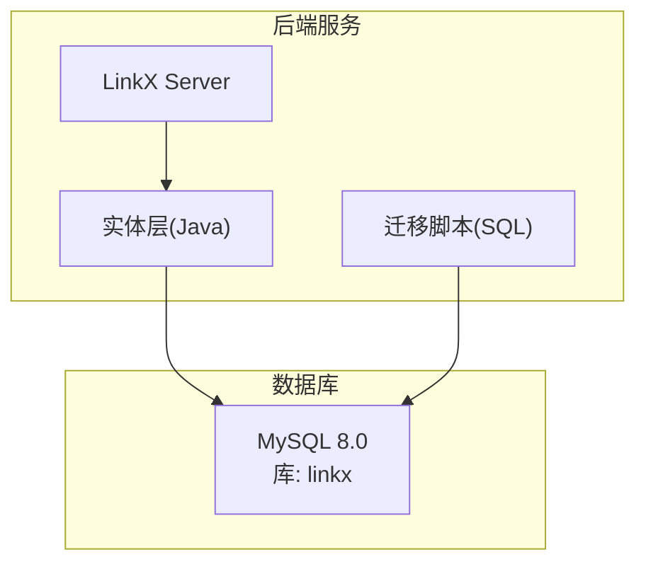
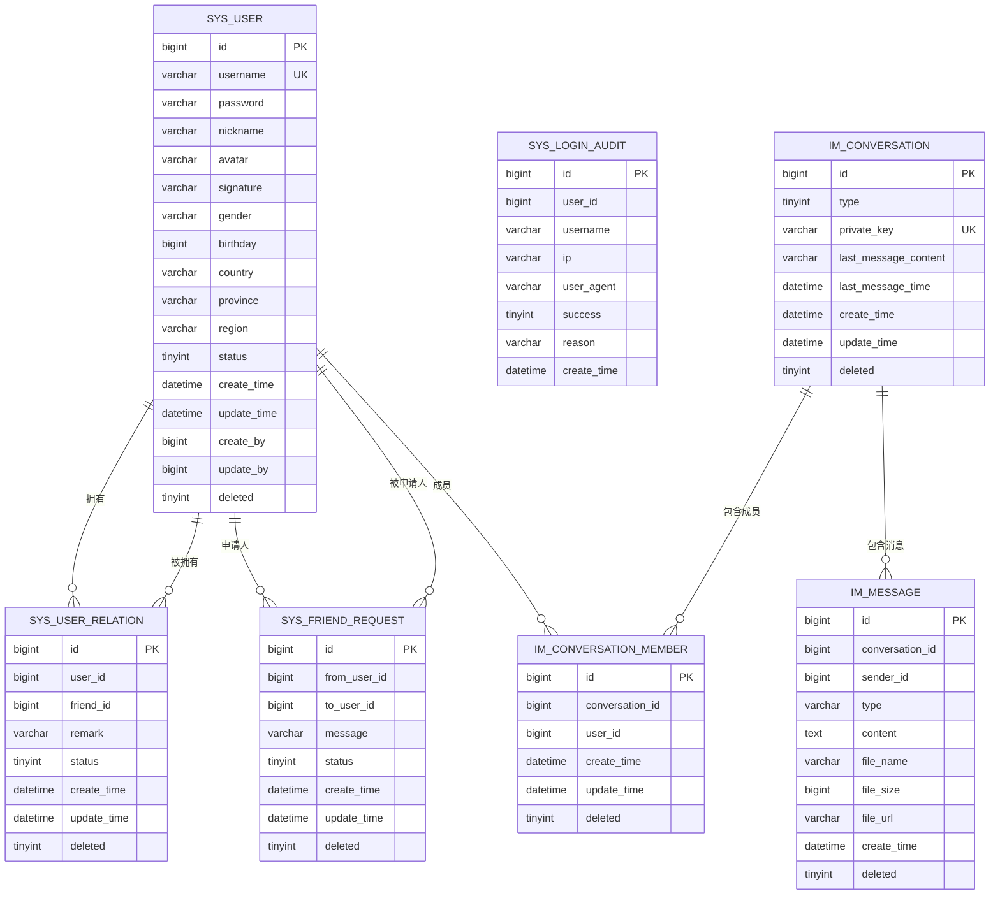
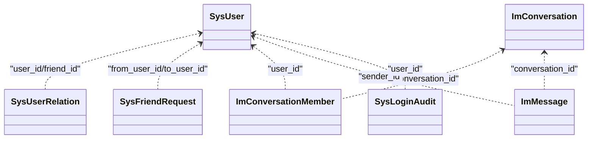

# 数据库架构

<cite>
**本文引用的文件**   
- [init.sql](file://linkx-server/init.sql)
- [001_add_user_profile_and_friend_tables.sql](file://linkx-server/migrations/001_add_user_profile_and_friend_tables.sql)
- [002_add_im_tables.sql](file://linkx-server/migrations/002_add_im_tables.sql)
- [application.yml](file://linkx-server/src/main/resources/application.yml)
- [SysUser.java](file://linkx-server/src/main/java/com/linkx/server/entity/SysUser.java)
- [SysFriendRequest.java](file://linkx-server/src/main/java/com/linkx/server/entity/SysFriendRequest.java)
- [SysUserRelation.java](file://linkx-server/src/main/java/com/linkx/server/entity/SysUserRelation.java)
- [ImConversation.java](file://linkx-server/src/main/java/com/linkx/server/entity/ImConversation.java)
- [ImConversationMember.java](file://linkx-server/src/main/java/com/linkx/server/entity/ImConversationMember.java)
- [ImMessage.java](file://linkx-server/src/main/java/com/linkx/server/entity/ImMessage.java)
</cite>

## 目录
1. [引言](#引言)
2. [项目结构](#项目结构)
3. [核心组件](#核心组件)
4. [架构总览](#架构总览)
5. [详细组件分析](#详细组件分析)
6. [依赖关系分析](#依赖关系分析)
7. [性能考虑](#性能考虑)
8. [故障排查指南](#故障排查指南)
9. [结论](#结论)
10. [附录](#附录)

## 引言
本文件为 LinkX 项目的数据库架构设计文档，聚焦于基于 MySQL 8.0 的数据库设计方案。内容覆盖用户管理模块、即时通讯（IM）模块、好友关系模块的数据表结构、字段定义、数据类型选择、索引与约束、表间关系模型、数据完整性保证与业务规则约束；同时给出命名规范、字符集配置、存储引擎选择与性能优化策略，并提供完整的 ER 图与建表语句说明路径。

## 项目结构
数据库相关脚本与实体映射集中在后端服务中：
- 初始化与迁移脚本位于 linkx-server 目录下，包含库创建、表结构与增量升级。
- Java 实体类通过 MyBatis-Flex 注解映射到对应表，体现 ORM 层与数据库结构的对齐。

图表来源
- [init.sql:1-131](file://linkx-server/init.sql#L1-L131)
- [application.yml:11-15](file://linkx-server/src/main/resources/application.yml#L11-L15)

章节来源
- [init.sql:1-131](file://linkx-server/init.sql#L1-L131)
- [application.yml:11-15](file://linkx-server/src/main/resources/application.yml#L11-L15)

## 核心组件
- 用户管理模块：系统用户表、登录审计表
- 好友关系模块：好友关系表、好友申请表
- 即时通讯模块：会话表、会话成员表、消息表

上述模块均使用统一的逻辑删除标记与时间戳字段，主键采用雪花算法生成，统一字符集与排序规则，便于扩展与维护。

章节来源
- [init.sql:9-131](file://linkx-server/init.sql#L9-L131)
- [001_add_user_profile_and_friend_tables.sql:50-79](file://linkx-server/migrations/001_add_user_profile_and_friend_tables.sql#L50-L79)
- [002_add_im_tables.sql:6-44](file://linkx-server/migrations/002_add_im_tables.sql#L6-L44)

## 架构总览
下图展示了各表之间的核心关系：用户与好友关系、申请流程，以及 IM 会话与消息的归属关系。

图表来源
- [init.sql:9-131](file://linkx-server/init.sql#L9-L131)
- [001_add_user_profile_and_friend_tables.sql:50-79](file://linkx-server/migrations/001_add_user_profile_and_friend_tables.sql#L50-L79)
- [002_add_im_tables.sql:6-44](file://linkx-server/migrations/002_add_im_tables.sql#L6-L44)

## 详细组件分析

### 用户管理模块
- 系统用户表
  - 用途：存储用户账号、认证信息、基础资料与状态等。
  - 关键字段：主键、用户名唯一、密码加密、昵称、头像、签名、性别、生日、国家/省/区、状态、审计字段、逻辑删除。
  - 索引：用户名唯一索引。
  - 约束与规则：用户名全局唯一；密码需加密存储；状态控制账号可用性与功能访问。
  - 参考实现：[SysUser.java](file://linkx-server/src/main/java/com/linkx/server/entity/SysUser.java)

- 登录审计表
  - 用途：记录登录成功/失败事件，用于安全审计与风控。
  - 关键字段：用户ID、用户名、客户端IP、User-Agent、结果标志、原因、时间。
  - 索引：用户名、创建时间。
  - 参考实现：[SysLoginAudit.java](file://linkx-server/src/main/java/com/linkx/server/entity/SysLoginAudit.java)

章节来源
- [init.sql:9-29](file://linkx-server/init.sql#L9-L29)
- [init.sql:118-131](file://linkx-server/init.sql#L118-L131)
- [SysUser.java:34-96](file://linkx-server/src/main/java/com/linkx/server/entity/SysUser.java#L34-L96)
- [SysLoginAudit.java:15-34](file://linkx-server/src/main/java/com/linkx/server/entity/SysLoginAudit.java#L15-L34)

### 好友关系模块
- 好友关系表
  - 用途：维护用户之间的好友关系与备注、状态。
  - 关键字段：用户ID、好友ID、备注、状态、时间、逻辑删除。
  - 索引：用户ID、好友ID、联合唯一索引(user_id, friend_id)。
  - 约束与规则：同一用户对之间仅允许一条有效关系；状态支持正常/拉黑。
  - 参考实现：[SysUserRelation.java](file://linkx-server/src/main/java/com/linkx/server/entity/SysUserRelation.java)

- 好友申请表
  - 用途：处理好友申请流程，包括验证信息与状态流转。
  - 关键字段：申请人ID、被申请人ID、验证信息、状态、时间、逻辑删除。
  - 索引：被申请人+状态复合索引、申请人ID。
  - 约束与规则：状态机：待处理→已同意/已拒绝；避免重复申请。
  - 参考实现：[SysFriendRequest.java](file://linkx-server/src/main/java/com/linkx/server/entity/SysFriendRequest.java)

章节来源
- [init.sql:34-64](file://linkx-server/init.sql#L34-L64)
- [001_add_user_profile_and_friend_tables.sql:50-79](file://linkx-server/migrations/001_add_user_profile_and_friend_tables.sql#L50-L79)
- [SysUserRelation.java:35-70](file://linkx-server/src/main/java/com/linkx/server/entity/SysUserRelation.java#L35-L70)
- [SysFriendRequest.java:19-54](file://linkx-server/src/main/java/com/linkx/server/entity/SysFriendRequest.java#L19-L54)

### 即时通讯模块
- 会话表
  - 用途：表示单聊或群聊会话，缓存最后消息预览与时间，提升列表加载性能。
  - 关键字段：类型、单聊唯一键、最后消息内容与时间、时间戳、逻辑删除。
  - 索引：单聊唯一键。
  - 约束与规则：单聊会话通过 minUserId_maxUserId 生成唯一键，确保会话唯一性。
  - 参考实现：[ImConversation.java](file://linkx-server/src/main/java/com/linkx/server/entity/ImConversation.java)

- 会话成员表
  - 用途：记录会话中的成员及其加入时间。
  - 关键字段：会话ID、用户ID、时间、逻辑删除。
  - 索引：会话+用户联合唯一索引、用户ID。
  - 约束与规则：同一用户在会话中仅能存在一次。
  - 参考实现：[ImConversationMember.java](file://linkx-server/src/main/java/com/linkx/server/entity/ImConversationMember.java)

- 消息表
  - 用途：存储会话中的所有消息，支持文本、图片、文件等多类型。
  - 关键字段：会话ID、发送者ID、类型、内容、文件名、文件大小、文件URL、时间、逻辑删除。
  - 索引：会话ID+创建时间复合索引，利于分页查询最近消息。
  - 约束与规则：按会话维度组织消息；大对象建议存外部存储，表中保留URL与元信息。
  - 参考实现：[ImMessage.java](file://linkx-server/src/main/java/com/linkx/server/entity/ImMessage.java)

章节来源
- [init.sql:69-113](file://linkx-server/init.sql#L69-L113)
- [002_add_im_tables.sql:6-44](file://linkx-server/migrations/002_add_im_tables.sql#L6-L44)
- [ImConversation.java:16-47](file://linkx-server/src/main/java/com/linkx/server/entity/ImConversation.java#L16-L47)
- [ImConversationMember.java:16-41](file://linkx-server/src/main/java/com/linkx/server/entity/ImConversationMember.java#L16-L41)
- [ImMessage.java:16-51](file://linkx-server/src/main/java/com/linkx/server/entity/ImMessage.java#L16-L51)

## 依赖关系分析
- 外键约束策略
  - 当前设计未使用数据库级外键约束，而是通过应用层校验与唯一索引保障一致性。
  - 优点：高并发写入时减少锁竞争，提升吞吐；适合分布式场景。
  - 风险：需在业务层严格保证引用完整性，避免脏数据。

- 逻辑删除与软删除
  - 所有核心表包含 deleted 字段，配合框架全局配置进行逻辑删除过滤。
  - 影响：查询需自动附加 deleted=0 条件；历史数据可恢复与分析。

- 时间戳与审计
  - 统一使用 create_time/update_time，部分表由数据库默认值维护，部分由框架注解注入。
  - 审计表独立记录登录行为，便于安全分析与合规审计。

图表来源
- [init.sql:9-131](file://linkx-server/init.sql#L9-L131)
- [001_add_user_profile_and_friend_tables.sql:50-79](file://linkx-server/migrations/001_add_user_profile_and_friend_tables.sql#L50-L79)
- [002_add_im_tables.sql:6-44](file://linkx-server/migrations/002_add_im_tables.sql#L6-L44)

章节来源
- [application.yml:23-27](file://linkx-server/src/main/resources/application.yml#L23-L27)
- [init.sql:9-131](file://linkx-server/init.sql#L9-L131)

## 性能考虑
- 索引设计
  - 高频查询列建立合适索引：如消息表的会话+时间复合索引，好友关系的用户/好友索引，会话成员的用户索引。
  - 唯一索引保障业务唯一性：用户名、单聊会话键、会话成员唯一性。

- 分表与归档
  - 消息表为热点写表，建议按会话或时间维度进行水平拆分或归档冷数据至历史库。
  - 会话表缓存最后消息预览与时间，减少跨表聚合开销。

- 读写分离与缓存
  - 读多写少场景可引入只读副本；热点会话与用户资料可使用 Redis 缓存。
  - 登录审计表为追加型日志表，可异步落盘与定期清理。

- 连接与字符集
  - 连接参数启用 UTF-8 编码与时区设置，避免乱码与时间偏差。
  - 全库统一 utf8mb4 与 unicode_ci 排序规则，兼容表情与多语言。

章节来源
- [application.yml:11-15](file://linkx-server/src/main/resources/application.yml#L11-L15)
- [init.sql:1-4](file://linkx-server/init.sql#L1-L4)
- [init.sql:28-113](file://linkx-server/init.sql#L28-L113)

## 故障排查指南
- 中文乱码
  - 检查数据库与连接字符串是否统一使用 utf8mb4 与正确 collation。
  - 确认 JDBC URL 的 useUnicode 与 characterEncoding 参数。

- 时间异常
  - 确认 serverTimezone 设置为 Asia/Shanghai，避免前后端时间不一致。

- 重复数据
  - 检查唯一索引是否生效：用户名、单聊会话键、会话成员组合键。
  - 业务层在插入前做幂等校验，避免并发导致重复。

- 逻辑删除问题
  - 确认框架全局逻辑删除列配置是否正确，查询是否自动附加 deleted=0。

章节来源
- [application.yml:11-15](file://linkx-server/src/main/resources/application.yml#L11-L15)
- [application.yml:23-27](file://linkx-server/src/main/resources/application.yml#L23-L27)
- [init.sql:1-4](file://linkx-server/init.sql#L1-L4)

## 结论
LinkX 的数据库设计以简洁、可扩展和高性能为目标：
- 采用统一命名规范、字符集与逻辑删除，降低运维复杂度。
- 通过合理索引与冗余字段（如最后消息预览）提升关键路径性能。
- 不依赖数据库外键，将一致性交由应用层保障，适配高并发与分布式场景。
- 提供完善的审计与迁移机制，便于安全合规与版本演进。

## 附录

### 命名规范
- 库名：小写下划线分隔，如 linkx。
- 表名前缀：sys_（系统）、im_（即时通讯）。
- 字段名：小写下划线分隔，语义清晰，避免歧义。
- 索引命名：uk_（唯一）、idx_（普通），后接业务含义。

### 字符集与排序规则
- 库与表统一使用 utf8mb4 与 utf8mb4_unicode_ci，支持表情与多语言。

### 存储引擎
- 全部表使用 InnoDB，支持事务、行级锁与崩溃恢复。

### 建表语句说明路径
- 初始化建库与建表：[init.sql](file://linkx-server/init.sql)
- 用户资料与好友关系迁移：[001_add_user_profile_and_friend_tables.sql](file://linkx-server/migrations/001_add_user_profile_and_friend_tables.sql)
- IM 模块迁移：[002_add_im_tables.sql](file://linkx-server/migrations/002_add_im_tables.sql)