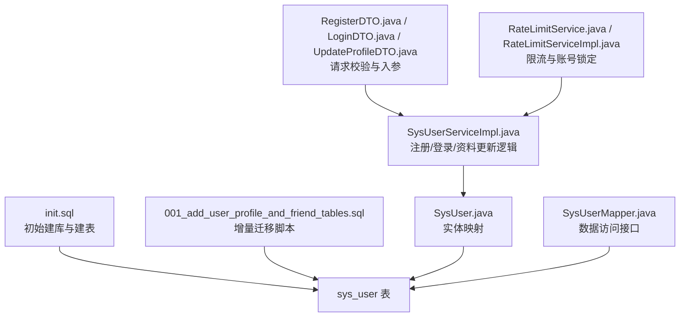
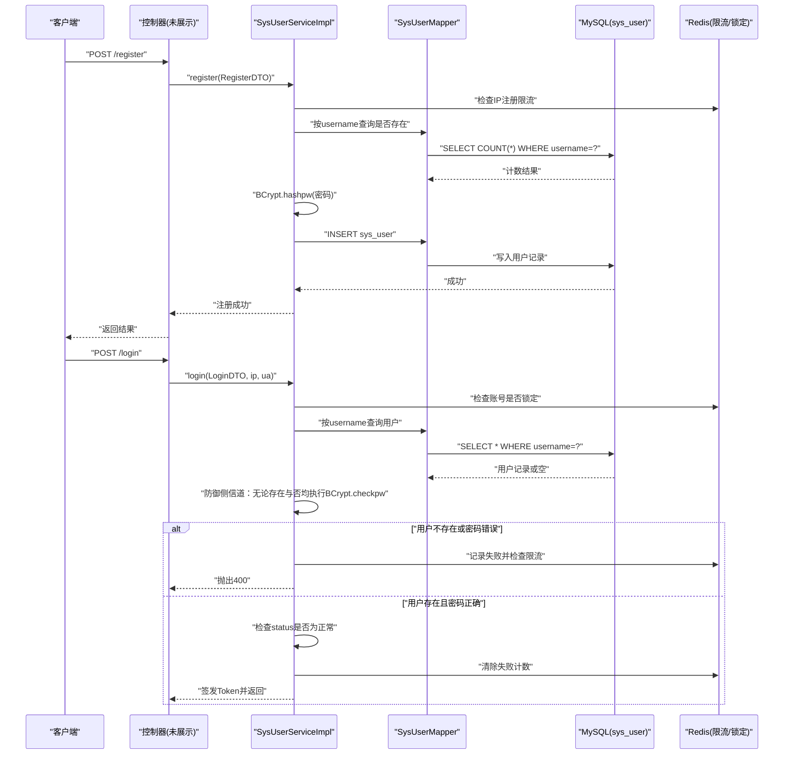
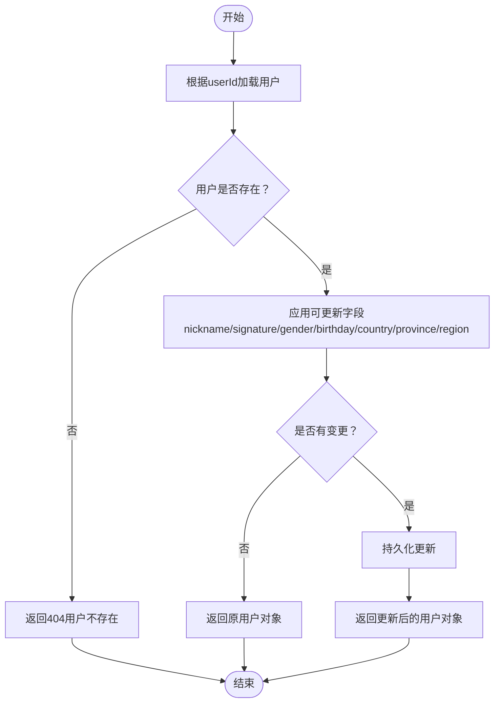
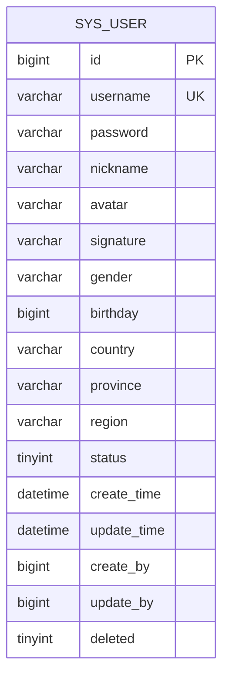
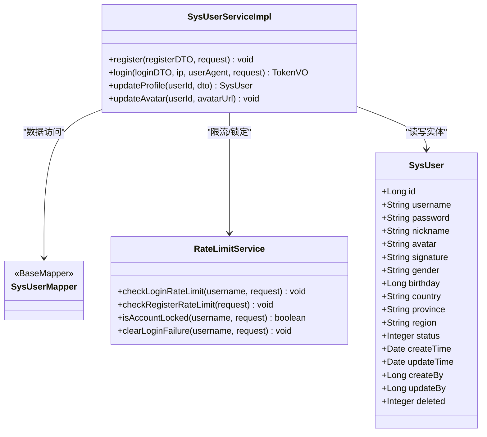

# 用户管理模块设计

<cite>
**本文引用的文件列表**
- [SysUser.java](file://linkx-server/src/main/java/com/linkx/server/entity/SysUser.java)
- [init.sql](file://linkx-server/init.sql)
- [001_add_user_profile_and_friend_tables.sql](file://linkx-server/migrations/001_add_user_profile_and_friend_tables.sql)
- [RegisterDTO.java](file://linkx-server/src/main/java/com/linkx/server/controller/dto/RegisterDTO.java)
- [LoginDTO.java](file://linkx-server/src/main/java/com/linkx/server/controller/dto/LoginDTO.java)
- [UpdateProfileDTO.java](file://linkx-server/src/main/java/com/linkx/server/controller/dto/UpdateProfileDTO.java)
- [SysUserServiceImpl.java](file://linkx-server/src/main/java/com/linkx/server/service/impl/SysUserServiceImpl.java)
- [RateLimitService.java](file://linkx-server/src/main/java/com/linkx/server/service/RateLimitService.java)
- [RateLimitServiceImpl.java](file://linkx-server/src/main/java/com/linkx/server/service/impl/RateLimitServiceImpl.java)
- [SysUserMapper.java](file://linkx-server/src/main/java/com/linkx/server/mapper/SysUserMapper.java)
</cite>

## 目录
1. [引言](#引言)
2. [项目结构](#项目结构)
3. [核心组件](#核心组件)
4. [架构总览](#架构总览)
5. [详细组件分析](#详细组件分析)
6. [依赖关系分析](#依赖关系分析)
7. [性能与索引优化](#性能与索引优化)
8. [故障排查指南](#故障排查指南)
9. [结论](#结论)
10. [附录：建表语句与字段说明](#附录：建表语句与字段说明)

## 引言
本设计文档聚焦 LinkX 用户管理模块的数据库设计，围绕 sys_user 表的用户基本信息、认证信息、个人资料扩展字段（性别、生日、国家、省份、地区）进行详细说明；阐述用户状态管理、密码加密存储策略与账户安全机制；给出索引优化策略、查询性能考虑与数据完整性约束；并提供完整的建表语句、字段说明与业务规则定义。

## 项目结构
与用户管理相关的后端代码主要位于 linkx-server 模块中，包括实体映射、SQL 初始化脚本、迁移脚本、控制器 DTO、服务实现与限流安全能力等。下图展示与用户管理相关的关键文件及其职责。

图表来源
- [init.sql:9-29](file://linkx-server/init.sql#L9-L29)
- [001_add_user_profile_and_friend_tables.sql:7-48](file://linkx-server/migrations/001_add_user_profile_and_friend_tables.sql#L7-L48)
- [SysUser.java:38-96](file://linkx-server/src/main/java/com/linkx/server/entity/SysUser.java#L38-L96)
- [SysUserMapper.java:18-21](file://linkx-server/src/main/java/com/linkx/server/mapper/SysUserMapper.java#L18-L21)
- [SysUserServiceImpl.java:34-99](file://linkx-server/src/main/java/com/linkx/server/service/impl/SysUserServiceImpl.java#L34-L99)
- [RegisterDTO.java:8-27](file://linkx-server/src/main/java/com/linkx/server/controller/dto/RegisterDTO.java#L8-L27)
- [LoginDTO.java:8-22](file://linkx-server/src/main/java/com/linkx/server/controller/dto/LoginDTO.java#L8-L22)
- [UpdateProfileDTO.java:10-53](file://linkx-server/src/main/java/com/linkx/server/controller/dto/UpdateProfileDTO.java#L10-L53)
- [RateLimitService.java:5-46](file://linkx-server/src/main/java/com/linkx/server/service/RateLimitService.java#L5-L46)
- [RateLimitServiceImpl.java:13-131](file://linkx-server/src/main/java/com/linkx/server/service/impl/RateLimitServiceImpl.java#L13-L131)

章节来源
- [init.sql:1-131](file://linkx-server/init.sql#L1-L131)
- [001_add_user_profile_and_friend_tables.sql:1-80](file://linkx-server/migrations/001_add_user_profile_and_friend_tables.sql#L1-L80)
- [SysUser.java:1-97](file://linkx-server/src/main/java/com/linkx/server/entity/SysUser.java#L1-L97)
- [SysUserMapper.java:1-22](file://linkx-server/src/main/java/com/linkx/server/mapper/SysUserMapper.java#L1-L22)
- [SysUserServiceImpl.java:1-175](file://linkx-server/src/main/java/com/linkx/server/service/impl/SysUserServiceImpl.java#L1-L175)
- [RegisterDTO.java:1-28](file://linkx-server/src/main/java/com/linkx/server/controller/dto/RegisterDTO.java#L1-L28)
- [LoginDTO.java:1-23](file://linkx-server/src/main/java/com/linkx/server/controller/dto/LoginDTO.java#L1-L23)
- [UpdateProfileDTO.java:1-54](file://linkx-server/src/main/java/com/linkx/server/controller/dto/UpdateProfileDTO.java#L1-L54)
- [RateLimitService.java:1-47](file://linkx-server/src/main/java/com/linkx/server/service/RateLimitService.java#L1-L47)
- [RateLimitServiceImpl.java:1-132](file://linkx-server/src/main/java/com/linkx/server/service/impl/RateLimitServiceImpl.java#L1-L132)

## 核心组件
- 实体层：SysUser 对应 sys_user 表，包含主键、账号、密码哈希、昵称、头像、签名、性别、生日、国家、省份、地区、状态、审计时间戳与逻辑删除标记。
- 数据访问层：SysUserMapper 继承 MyBatis-Flex BaseMapper，提供基础 CRUD 与链式查询能力。
- 服务层：SysUserServiceImpl 实现注册、登录、资料更新、头像更新等业务逻辑，集成 BCrypt 密码处理、限流与审计。
- 请求校验层：RegisterDTO、LoginDTO、UpdateProfileDTO 使用 Jakarta Validation 对输入进行格式与长度校验。
- 安全与限流：RateLimitService 及实现类基于 Redis 实现 IP 与用户名维度的登录/注册限流与账号锁定。

章节来源
- [SysUser.java:38-96](file://linkx-server/src/main/java/com/linkx/server/entity/SysUser.java#L38-L96)
- [SysUserMapper.java:18-21](file://linkx-server/src/main/java/com/linkx/server/mapper/SysUserMapper.java#L18-L21)
- [SysUserServiceImpl.java:34-99](file://linkx-server/src/main/java/com/linkx/server/service/impl/SysUserServiceImpl.java#L34-L99)
- [RegisterDTO.java:8-27](file://linkx-server/src/main/java/com/linkx/server/controller/dto/RegisterDTO.java#L8-L27)
- [LoginDTO.java:8-22](file://linkx-server/src/main/java/com/linkx/server/controller/dto/LoginDTO.java#L8-L22)
- [UpdateProfileDTO.java:10-53](file://linkx-server/src/main/java/com/linkx/server/controller/dto/UpdateProfileDTO.java#L10-L53)
- [RateLimitService.java:5-46](file://linkx-server/src/main/java/com/linkx/server/service/RateLimitService.java#L5-L46)
- [RateLimitServiceImpl.java:13-131](file://linkx-server/src/main/java/com/linkx/server/service/impl/RateLimitServiceImpl.java#L13-L131)

## 架构总览
下图展示了用户注册与登录流程中与数据库和安全组件的交互关系。

图表来源
- [SysUserServiceImpl.java:34-99](file://linkx-server/src/main/java/com/linkx/server/service/impl/SysUserServiceImpl.java#L34-L99)
- [SysUserMapper.java:18-21](file://linkx-server/src/main/java/com/linkx/server/mapper/SysUserMapper.java#L18-L21)
- [RateLimitServiceImpl.java:37-66](file://linkx-server/src/main/java/com/linkx/server/service/impl/RateLimitServiceImpl.java#L37-L66)

## 详细组件分析

### 表结构与字段设计（sys_user）
- 主键 id：BIGINT，雪花算法生成，全局唯一。
- 登录账号 username：VARCHAR(64)，唯一索引 uk_username，用于登录与检索。
- 密码 password：VARCHAR(255)，存储 BCrypt 哈希值，禁止明文。
- 昵称 nickname：VARCHAR(64)，界面展示名。
- 头像 avatar：VARCHAR(255)，默认值为占位资源路径。
- 个性签名 signature：VARCHAR(255)，可为空。
- 性别 gender：VARCHAR(8)，取值“男”或“女”，允许为空。
- 生日 birthday：BIGINT，毫秒时间戳，便于统一时区处理与计算。
- 国家 country：VARCHAR(64)。
- 省份 province：VARCHAR(64)。
- 地区 region：VARCHAR(64)。
- 状态 status：TINYINT，1=正常，0=停用。
- 创建时间 create_time：DATETIME，默认 CURRENT_TIMESTAMP。
- 更新时间 update_time：DATETIME，ON UPDATE CURRENT_TIMESTAMP。
- 创建人 create_by：BIGINT，审计字段。
- 更新人 update_by：BIGINT，审计字段。
- 逻辑删除 deleted：TINYINT(1)，0=未删除，1=已删除，配合框架自动过滤。

数据类型选择依据
- 字符串类型采用 VARCHAR 并限制最大长度，兼顾可读性与存储效率。
- 性别采用短字符串而非枚举，避免跨库枚举差异带来的维护成本。
- 生日采用 BIGINT 毫秒时间戳，简化跨时区与前端展示计算。
- 状态采用 TINYINT 节省空间，便于后续扩展更多状态码。
- 逻辑删除采用 TINYINT(1) 作为布尔标志，配合框架注解自动过滤。

章节来源
- [init.sql:9-29](file://linkx-server/init.sql#L9-L29)
- [SysUser.java:44-96](file://linkx-server/src/main/java/com/linkx/server/entity/SysUser.java#L44-L96)
- [001_add_user_profile_and_friend_tables.sql:7-48](file://linkx-server/migrations/001_add_user_profile_and_friend_tables.sql#L7-L48)

### 用户状态管理
- 状态字段 status：1 表示正常，0 表示停用。
- 登录流程在验证密码通过后，会检查 status 是否为正常，否则拒绝登录并记录审计日志。
- 停用状态可用于风控、合规或运营场景下的临时封禁。

章节来源
- [SysUserServiceImpl.java:89-93](file://linkx-server/src/main/java/com/linkx/server/service/impl/SysUserServiceImpl.java#L89-L93)
- [init.sql:21](file://linkx-server/init.sql#L21)

### 密码加密存储策略
- 注册时对明文密码使用 BCrypt 进行加盐哈希后存储。
- 登录时使用 BCrypt.checkpw 比对哈希值。
- 为防御时间侧信道攻击，即使用户不存在也会执行一次假校验，保持响应时间一致。

章节来源
- [SysUserServiceImpl.java:46-80](file://linkx-server/src/main/java/com/linkx/server/service/impl/SysUserServiceImpl.java#L46-L80)

### 账户安全机制
- 登录限流：同时限制 IP 与用户名维度，超过阈值触发账号锁定，锁定期间直接拒绝登录。
- 注册限流：基于 IP 的每分钟注册次数限制，防止批量注册。
- 登录审计：记录成功与失败的登录事件，包含用户ID、用户名、IP、UA、结果与原因。
- 输入校验：用户名与密码通过正则与长度校验，确保符合安全基线。

章节来源
- [RateLimitService.java:14-46](file://linkx-server/src/main/java/com/linkx/server/service/RateLimitService.java#L14-L46)
- [RateLimitServiceImpl.java:37-109](file://linkx-server/src/main/java/com/linkx/server/service/impl/RateLimitServiceImpl.java#L37-L109)
- [RegisterDTO.java:11-19](file://linkx-server/src/main/java/com/linkx/server/controller/dto/RegisterDTO.java#L11-L19)
- [LoginDTO.java:11-18](file://linkx-server/src/main/java/com/linkx/server/controller/dto/LoginDTO.java#L11-L18)

### 个人资料更新流程
- 支持更新昵称、签名、性别、生日、国家、省份、地区等字段。
- 仅当字段非空且满足长度/格式校验时才更新，空字符串会被置为 NULL。
- 更新成功后返回最新用户对象。

图表来源
- [SysUserServiceImpl.java:101-152](file://linkx-server/src/main/java/com/linkx/server/service/impl/SysUserServiceImpl.java#L101-L152)
- [UpdateProfileDTO.java:10-53](file://linkx-server/src/main/java/com/linkx/server/controller/dto/UpdateProfileDTO.java#L10-L53)

章节来源
- [SysUserServiceImpl.java:101-152](file://linkx-server/src/main/java/com/linkx/server/service/impl/SysUserServiceImpl.java#L101-L152)
- [UpdateProfileDTO.java:10-53](file://linkx-server/src/main/java/com/linkx/server/controller/dto/UpdateProfileDTO.java#L10-L53)

### 数据模型图（ER）

图表来源
- [init.sql:9-29](file://linkx-server/init.sql#L9-L29)
- [SysUser.java:44-96](file://linkx-server/src/main/java/com/linkx/server/entity/SysUser.java#L44-L96)

## 依赖关系分析
- SysUserServiceImpl 依赖：
  - SysUserMapper：数据访问
  - RateLimitService：限流与锁定
  - TokenService：令牌签发（不在本文范围）
  - LoginAuditService：登录审计（不在本文范围）
  - FileStorageService：头像存储（不在本文范围）
- SysUserMapper 依赖 MyBatis-Flex BaseMapper，提供链式查询与基础 CRUD。
- 限流实现依赖 Redis，通过 StringRedisTemplate 操作计数与过期时间。

图表来源
- [SysUserServiceImpl.java:23-32](file://linkx-server/src/main/java/com/linkx/server/service/impl/SysUserServiceImpl.java#L23-L32)
- [SysUserMapper.java:18-21](file://linkx-server/src/main/java/com/linkx/server/mapper/SysUserMapper.java#L18-L21)
- [RateLimitService.java:5-46](file://linkx-server/src/main/java/com/linkx/server/service/RateLimitService.java#L5-L46)
- [SysUser.java:38-96](file://linkx-server/src/main/java/com/linkx/server/entity/SysUser.java#L38-L96)

章节来源
- [SysUserServiceImpl.java:1-175](file://linkx-server/src/main/java/com/linkx/server/service/impl/SysUserServiceImpl.java#L1-L175)
- [SysUserMapper.java:1-22](file://linkx-server/src/main/java/com/linkx/server/mapper/SysUserMapper.java#L1-L22)
- [RateLimitService.java:1-47](file://linkx-server/src/main/java/com/linkx/server/service/RateLimitService.java#L1-L47)
- [SysUser.java:1-97](file://linkx-server/src/main/java/com/linkx/server/entity/SysUser.java#L1-L97)

## 性能与索引优化
- 现有索引
  - 主键 id：快速定位单条记录。
  - 唯一索引 uk_username：保证账号唯一并加速按用户名查询（登录、注册查重）。
- 建议补充索引（按常见查询场景）
  - idx_status：若频繁按状态筛选（如正常用户列表），可在 status 上建立普通索引。
  - idx_country_province_region：若需按国家/省份/地区组合筛选，可建立联合索引 (country, province, region)。
  - idx_create_time：若需要按注册时间排序或分页，建议在 create_time 上建立索引。
- 查询性能考虑
  - 登录与注册走 username 唯一索引，性能稳定。
  - 个人资料更新为按主键更新，开销低。
  - 头像更新涉及旧文件删除，应异步或忽略异常，避免阻塞主流程。
- 数据完整性约束
  - 唯一性：username 唯一。
  - 非空约束：id、username、password、nickname、status、create_time、update_time、deleted。
  - 默认值：status=1，create_time/update_time 由数据库维护，deleted=0。
  - 逻辑删除：框架层面自动过滤 deleted=1 的记录，避免物理删除导致的数据不一致。

章节来源
- [init.sql:27-29](file://linkx-server/init.sql#L27-L29)
- [SysUserServiceImpl.java:154-173](file://linkx-server/src/main/java/com/linkx/server/service/impl/SysUserServiceImpl.java#L154-L173)

## 故障排查指南
- 注册失败
  - 可能原因：用户名重复、输入校验失败、注册限流触发。
  - 排查要点：检查 username 唯一性、校验规则、Redis 注册限流计数。
- 登录失败
  - 可能原因：用户名或密码错误、账号被停用、账号锁定、IP 限流。
  - 排查要点：确认 BCrypt 校验结果、status 状态、Redis 锁定与失败计数、审计日志。
- 资料更新无效
  - 可能原因：字段为空或未变更、参数校验失败。
  - 排查要点：确认传入字段非空且满足长度/格式要求，观察 updated 标志与最终 SQL 执行。
- 头像更新异常
  - 可能原因：旧头像删除失败、存储系统不可用。
  - 排查要点：关注删除异常捕获逻辑，确保新头像写入不受影响。

章节来源
- [SysUserServiceImpl.java:34-99](file://linkx-server/src/main/java/com/linkx/server/service/impl/SysUserServiceImpl.java#L34-L99)
- [SysUserServiceImpl.java:101-152](file://linkx-server/src/main/java/com/linkx/server/service/impl/SysUserServiceImpl.java#L101-L152)
- [SysUserServiceImpl.java:154-173](file://linkx-server/src/main/java/com/linkx/server/service/impl/SysUserServiceImpl.java#L154-L173)
- [RateLimitServiceImpl.java:37-109](file://linkx-server/src/main/java/com/linkx/server/service/impl/RateLimitServiceImpl.java#L37-L109)

## 结论
sys_user 表以简洁而实用的字段设计覆盖用户基本信息、认证信息与个人资料扩展需求；结合 BCrypt 密码哈希、严格的输入校验、多维限流与账号锁定机制，形成较为完善的安全体系；通过合理的主键与唯一索引保障核心查询性能，并在必要时可扩展状态与地域相关索引以满足更复杂的筛选场景。整体设计兼顾安全性、可用性与可维护性。

## 附录：建表语句与字段说明

### 完整建表语句（sys_user）
参考路径
- [init.sql:9-29](file://linkx-server/init.sql#L9-L29)

### 字段说明与业务规则
- id：主键，BIGINT，雪花算法生成，全局唯一。
- username：登录账号，VARCHAR(64)，必填，唯一，字母数字下划线组成，长度 4-32。
- password：BCrypt 哈希，VARCHAR(255)，必填，禁止明文。
- nickname：昵称，VARCHAR(64)，必填，长度 1-64。
- avatar：头像 URL，VARCHAR(255)，可选，默认占位资源。
- signature：个性签名，VARCHAR(255)，可选。
- gender：性别，VARCHAR(8)，可选，取值“男”或“女”。
- birthday：生日，BIGINT，毫秒时间戳，可选。
- country：国家，VARCHAR(64)，可选。
- province：省份，VARCHAR(64)，可选。
- region：地区，VARCHAR(64)，可选。
- status：状态，TINYINT，必填，1=正常，0=停用。
- create_time：创建时间，DATETIME，默认当前时间。
- update_time：更新时间，DATETIME，默认当前时间，自动更新。
- create_by：创建人，BIGINT，可选。
- update_by：更新人，BIGINT，可选。
- deleted：逻辑删除，TINYINT(1)，必填，0=未删除，1=已删除。

章节来源
- [init.sql:9-29](file://linkx-server/init.sql#L9-L29)
- [SysUser.java:44-96](file://linkx-server/src/main/java/com/linkx/server/entity/SysUser.java#L44-L96)
- [RegisterDTO.java:11-23](file://linkx-server/src/main/java/com/linkx/server/controller/dto/RegisterDTO.java#L11-L23)
- [LoginDTO.java:11-18](file://linkx-server/src/main/java/com/linkx/server/controller/dto/LoginDTO.java#L11-L18)
- [UpdateProfileDTO.java:16-52](file://linkx-server/src/main/java/com/linkx/server/controller/dto/UpdateProfileDTO.java#L16-L52)