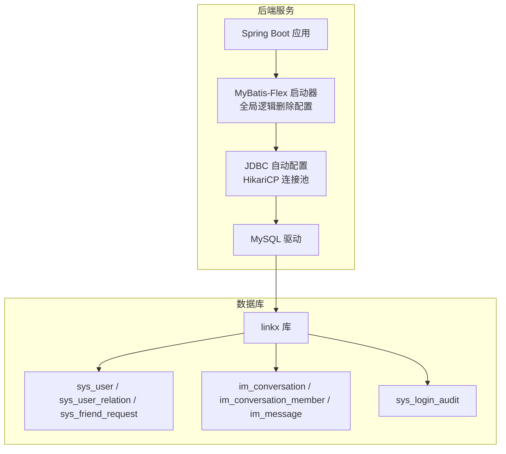
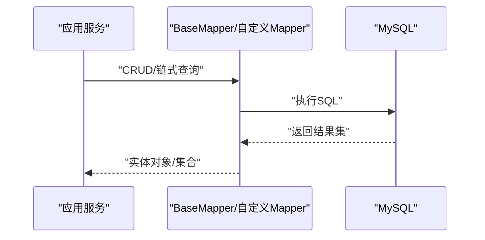
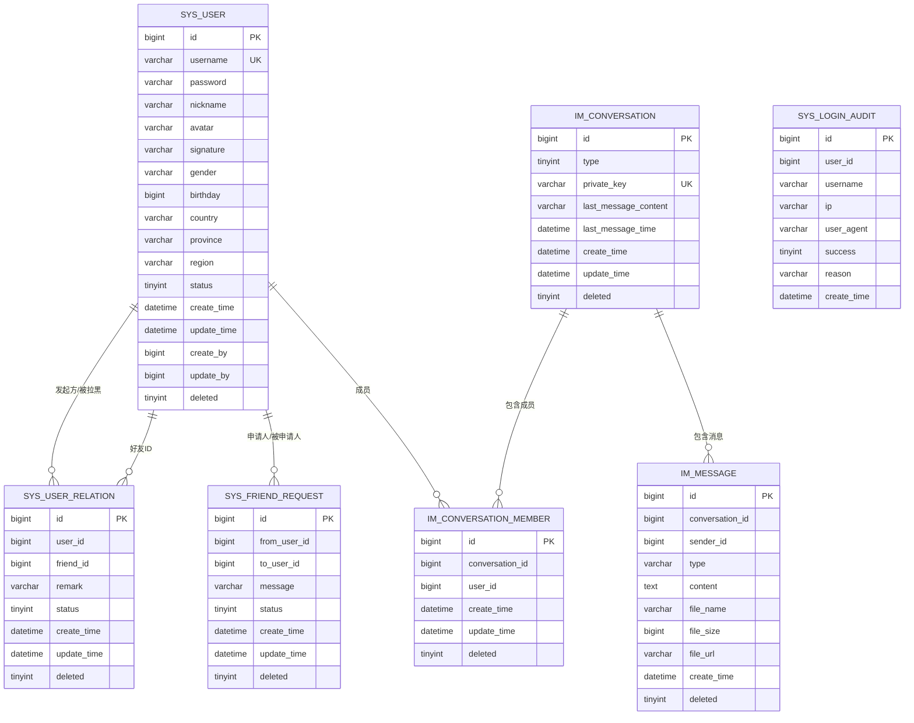
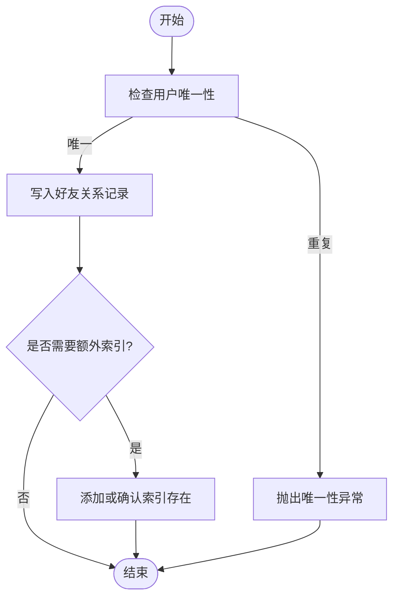
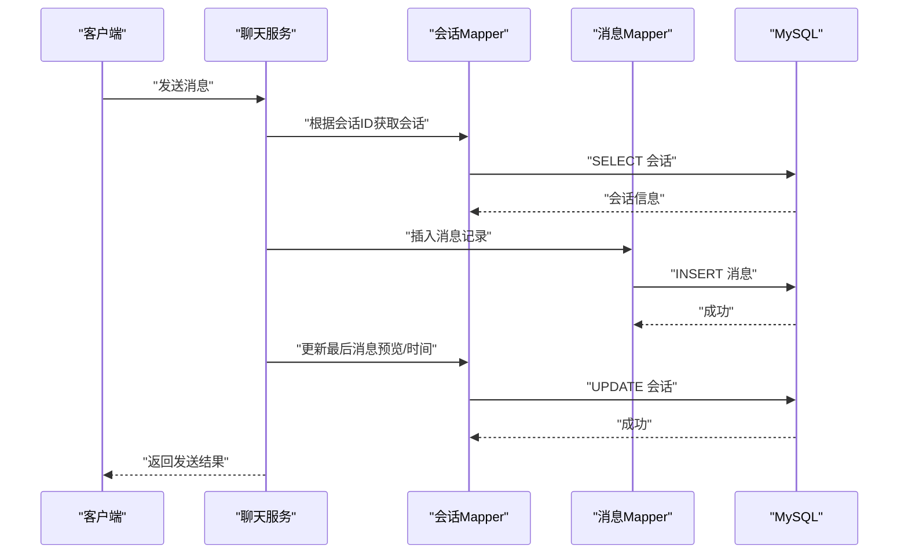
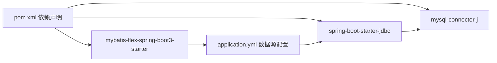

# 数据库设计

<cite>
**本文引用的文件**
- [SysUser.java](file://linkx-server/src/main/java/com/linkx/server/entity/SysUser.java)
- [SysUserRelation.java](file://linkx-server/src/main/java/com/linkx/server/entity/SysUserRelation.java)
- [SysFriendRequest.java](file://linkx-server/src/main/java/com/linkx/server/entity/SysFriendRequest.java)
- [ImConversation.java](file://linkx-server/src/main/java/com/linkx/server/entity/ImConversation.java)
- [ImConversationMember.java](file://linkx-server/src/main/java/com/linkx/server/entity/ImConversationMember.java)
- [ImMessage.java](file://linkx-server/src/main/java/com/linkx/server/entity/ImMessage.java)
- [SysUserMapper.java](file://linkx-server/src/main/java/com/linkx/server/mapper/SysUserMapper.java)
- [SysUserRelationMapper.java](file://linkx-server/src/main/java/com/linkx/server/mapper/SysUserRelationMapper.java)
- [ImConversationMapper.java](file://linkx-server/src/main/java/com/linkx/server/mapper/ImConversationMapper.java)
- [ImMessageMapper.java](file://linkx-server/src/main/java/com/linkx/server/mapper/ImMessageMapper.java)
- [init.sql](file://linkx-server/init.sql)
- [001_add_user_profile_and_friend_tables.sql](file://linkx-server/migrations/001_add_user_profile_and_friend_tables.sql)
- [002_add_im_tables.sql](file://linkx-server/migrations/002_add_im_tables.sql)
- [application.yml](file://linkx-server/src/main/resources/application.yml)
- [pom.xml](file://linkx-server/pom.xml)
</cite>

## 目录
1. [引言](#引言)
2. [项目结构](#项目结构)
3. [核心组件](#核心组件)
4. [架构总览](#架构总览)
5. [详细组件分析](#详细组件分析)
6. [依赖关系分析](#依赖关系分析)
7. [性能考虑](#性能考虑)
8. [故障排查指南](#故障排查指南)
9. [结论](#结论)
10. [附录](#附录)

## 引言
本文件面向 LinkX 项目的数据库设计与数据访问层实现，聚焦基于 MyBatis-Flex ORM 的实体映射、关联关系与完整性约束，覆盖用户表、消息表、会话表、好友关系表等核心表结构及索引优化策略。同时说明数据迁移管理机制、版本控制与回滚策略，并提供查询性能优化、事务管理、连接池配置以及备份恢复方案建议，帮助数据库开发者快速理解模型并指导性能调优。

## 项目结构
后端采用单体架构，数据访问层由 MyBatis-Flex 驱动，实体类位于 entity 包，Mapper 接口位于 mapper 包；数据库初始化脚本位于 init.sql，增量迁移脚本位于 migrations 目录；应用配置在 application.yml，依赖声明在 pom.xml。

图表来源
- [application.yml:11-27](file://linkx-server/src/main/resources/application.yml#L11-L27)
- [pom.xml:45-63](file://linkx-server/pom.xml#L45-L63)

章节来源
- [application.yml:1-54](file://linkx-server/src/main/resources/application.yml#L1-L54)
- [pom.xml:1-168](file://linkx-server/pom.xml#L1-L168)

## 核心组件
本节梳理核心实体与映射关系，说明主键策略、时间字段默认值、逻辑删除与唯一性约束。

- 系统用户 SysUser
  - 主键：雪花算法生成
  - 唯一索引：登录账号
  - 逻辑删除：deleted 字段
  - 审计字段：create_time/update_time、create_by/update_by
- 好友关系 SysUserRelation
  - 主键：雪花算法生成
  - 唯一约束：(user_id, friend_id)
  - 索引：user_id、friend_id
  - 逻辑删除：deleted
- 好友申请 SysFriendRequest
  - 主键：雪花算法生成
  - 索引：to_user_id+status、from_user_id
  - 逻辑删除：deleted
- IM 会话 ImConversation
  - 主键：雪花算法生成
  - 唯一键：private_key（单聊）
  - 逻辑删除：deleted
- IM 会话成员 ImConversationMember
  - 主键：雪花算法生成
  - 唯一约束：(conversation_id, user_id)
  - 索引：user_id
  - 逻辑删除：deleted
- IM 消息 ImMessage
  - 主键：雪花算法生成
  - 复合索引：(conversation_id, create_time)
  - 逻辑删除：deleted

章节来源
- [SysUser.java:34-96](file://linkx-server/src/main/java/com/linkx/server/entity/SysUser.java#L34-L96)
- [SysUserRelation.java:35-70](file://linkx-server/src/main/java/com/linkx/server/entity/SysUserRelation.java#L35-L70)
- [SysFriendRequest.java:19-54](file://linkx-server/src/main/java/com/linkx/server/entity/SysFriendRequest.java#L19-L54)
- [ImConversation.java:16-47](file://linkx-server/src/main/java/com/linkx/server/entity/ImConversation.java#L16-L47)
- [ImConversationMember.java:16-40](file://linkx-server/src/main/java/com/linkx/server/entity/ImConversationMember.java#L16-L40)
- [ImMessage.java:16-51](file://linkx-server/src/main/java/com/linkx/server/entity/ImMessage.java#L16-L51)

## 架构总览
从 ORM 到数据库的整体链路如下：Spring Boot 通过 JDBC 自动配置创建连接池，MyBatis-Flex 提供 BaseMapper 与链式查询能力，实体注解完成表/列映射与全局逻辑删除策略。

图表来源
- [SysUserMapper.java:17-21](file://linkx-server/src/main/java/com/linkx/server/mapper/SysUserMapper.java#L17-L21)
- [SysUserRelationMapper.java:17-20](file://linkx-server/src/main/java/com/linkx/server/mapper/SysUserRelationMapper.java#L17-L20)
- [ImConversationMapper.java:7-9](file://linkx-server/src/main/java/com/linkx/server/mapper/ImConversationMapper.java#L7-L9)
- [ImMessageMapper.java:7-9](file://linkx-server/src/main/java/com/linkx/server/mapper/ImMessageMapper.java#L7-L9)
- [application.yml:11-27](file://linkx-server/src/main/resources/application.yml#L11-L27)

## 详细组件分析

### 实体关系图（ERD）

图表来源
- [init.sql:9-131](file://linkx-server/init.sql#L9-L131)

章节来源
- [init.sql:1-131](file://linkx-server/init.sql#L1-L131)

### 用户模块（用户、好友关系、好友申请）
- 用户表
  - 唯一性：登录账号唯一
  - 逻辑删除：全局启用 deleted 过滤
- 好友关系表
  - 唯一性：同一用户对之间仅一条关系记录
  - 索引：按 user_id、friend_id 查询友好
- 好友申请表
  - 索引：to_user_id+status 用于“待处理列表”高效筛选
  - 状态机：待处理/已同意/已拒绝

图表来源
- [001_add_user_profile_and_friend_tables.sql:51-64](file://linkx-server/migrations/001_add_user_profile_and_friend_tables.sql#L51-L64)
- [001_add_user_profile_and_friend_tables.sql:67-79](file://linkx-server/migrations/001_add_user_profile_and_friend_tables.sql#L67-L79)

章节来源
- [001_add_user_profile_and_friend_tables.sql:1-80](file://linkx-server/migrations/001_add_user_profile_and_friend_tables.sql#L1-L80)

### IM 模块（会话、成员、消息）
- 会话表
  - 单聊使用 private_key 保证唯一
  - 维护最后消息预览与时间，便于列表展示
- 会话成员表
  - 唯一性：同一会话中同一用户仅一条成员记录
  - 索引：user_id 支持“我的会话”反向查找
- 消息表
  - 复合索引 (conversation_id, create_time) 支撑分页加载历史消息

图表来源
- [ImConversationMapper.java:7-9](file://linkx-server/src/main/java/com/linkx/server/mapper/ImConversationMapper.java#L7-L9)
- [ImMessageMapper.java:7-9](file://linkx-server/src/main/java/com/linkx/server/mapper/ImMessageMapper.java#L7-L9)
- [002_add_im_tables.sql:6-44](file://linkx-server/migrations/002_add_im_tables.sql#L6-L44)

章节来源
- [002_add_im_tables.sql:1-45](file://linkx-server/migrations/002_add_im_tables.sql#L1-L45)

### 数据迁移管理与版本控制
- 初始化脚本
  - init.sql 提供完整建库建表语句，适合首次部署
- 增量迁移
  - migrations/001_*.sql：为已有库补充用户资料字段、创建好友相关表
  - migrations/002_*.sql：创建 IM 会话、成员、消息表
  - 均使用 IF NOT EXISTS 与条件判断，具备幂等可重复执行特性
- 版本控制与回滚
  - 以文件名前缀作为版本号，按顺序执行
  - 回滚策略：编写对应反向脚本（DROP/ALTER），在目标环境谨慎执行；建议在预发布验证后在生产窗口期执行

章节来源
- [init.sql:1-131](file://linkx-server/init.sql#L1-L131)
- [001_add_user_profile_and_friend_tables.sql:1-80](file://linkx-server/migrations/001_add_user_profile_and_friend_tables.sql#L1-L80)
- [002_add_im_tables.sql:1-45](file://linkx-server/migrations/002_add_im_tables.sql#L1-L45)

## 依赖关系分析
ORM 与数据库驱动依赖关系如下：

图表来源
- [pom.xml:45-63](file://linkx-server/pom.xml#L45-L63)
- [application.yml:11-27](file://linkx-server/src/main/resources/application.yml#L11-L27)

章节来源
- [pom.xml:1-168](file://linkx-server/pom.xml#L1-L168)
- [application.yml:1-54](file://linkx-server/src/main/resources/application.yml#L1-L54)

## 性能考虑
- 索引策略
  - 用户表：登录账号唯一索引已定义
  - 好友关系：联合唯一 + 双向索引，满足常见查询
  - 好友申请：to_user_id+status 复合索引提升“待处理列表”效率
  - 会话成员：(conversation_id, user_id) 唯一 + user_id 索引
  - 消息：(conversation_id, create_time) 复合索引支撑分页
- 查询优化
  - 优先使用覆盖索引减少回表
  - 避免 SELECT *，按需选择字段
  - 对大表分页使用“延迟关联”或游标分页
- 连接池与事务
  - 使用 Spring Boot 内置 HikariCP，合理设置最大连接数、空闲超时
  - 写多读少场景适当增大连接池上限；长事务需避免
- 缓存与热点
  - 会话最后消息预览字段降低频繁聚合计算
  - 热点会话可引入 Redis 缓存，注意一致性策略
- 存储与归档
  - 消息表随增长需定期归档冷数据至历史库或对象存储
  - 文件内容走 MinIO，数据库仅存元数据

[本节为通用性能建议，不直接分析具体文件]

## 故障排查指南
- 连接失败
  - 检查 application.yml 中的数据库 URL、用户名、密码与环境变量注入
  - 确认 MySQL 端口与网络可达
- 唯一性冲突
  - 登录账号、好友关系、会话成员、会话 private_key 均有唯一约束，出现重复将抛异常
- 逻辑删除未生效
  - 确认全局 logic-delete-column 配置正确，且查询使用框架提供的链式 API
- 迁移幂等问题
  - 确保迁移脚本使用 IF NOT EXISTS 与列存在性判断，避免重复执行报错

章节来源
- [application.yml:11-27](file://linkx-server/src/main/resources/application.yml#L11-L27)
- [001_add_user_profile_and_friend_tables.sql:10-48](file://linkx-server/migrations/001_add_user_profile_and_friend_tables.sql#L10-L48)
- [002_add_im_tables.sql:6-29](file://linkx-server/migrations/002_add_im_tables.sql#L6-L29)

## 结论
LinkX 的数据模型围绕用户、好友关系与 IM 会话/消息展开，结合 MyBatis-Flex 的注解映射与全局逻辑删除，提供了清晰一致的 ORM 抽象。通过合理的索引设计与幂等迁移脚本，系统在可扩展性与可维护性方面具备良好的基础。后续可在连接池参数、缓存策略与冷热数据分层上持续优化，以满足高并发与海量消息场景。

[本节为总结性内容，不直接分析具体文件]

## 附录

### 关键实体类与 Mapper 一览
- 实体类
  - SysUser、SysUserRelation、SysFriendRequest、ImConversation、ImConversationMember、ImMessage
- Mapper 接口
  - SysUserMapper、SysUserRelationMapper、ImConversationMapper、ImMessageMapper

章节来源
- [SysUser.java:34-96](file://linkx-server/src/main/java/com/linkx/server/entity/SysUser.java#L34-L96)
- [SysUserRelation.java:35-70](file://linkx-server/src/main/java/com/linkx/server/entity/SysUserRelation.java#L35-L70)
- [SysFriendRequest.java:19-54](file://linkx-server/src/main/java/com/linkx/server/entity/SysFriendRequest.java#L19-L54)
- [ImConversation.java:16-47](file://linkx-server/src/main/java/com/linkx/server/entity/ImConversation.java#L16-L47)
- [ImConversationMember.java:16-40](file://linkx-server/src/main/java/com/linkx/server/entity/ImConversationMember.java#L16-L40)
- [ImMessage.java:16-51](file://linkx-server/src/main/java/com/linkx/server/entity/ImMessage.java#L16-L51)
- [SysUserMapper.java:17-21](file://linkx-server/src/main/java/com/linkx/server/mapper/SysUserMapper.java#L17-L21)
- [SysUserRelationMapper.java:17-20](file://linkx-server/src/main/java/com/linkx/server/mapper/SysUserRelationMapper.java#L17-L20)
- [ImConversationMapper.java:7-9](file://linkx-server/src/main/java/com/linkx/server/mapper/ImConversationMapper.java#L7-L9)
- [ImMessageMapper.java:7-9](file://linkx-server/src/main/java/com/linkx/server/mapper/ImMessageMapper.java#L7-L9)

### 数据完整性与约束要点
- 主键：全部使用雪花算法生成，避免分布式冲突
- 唯一性：登录账号、好友关系、会话成员、会话 private_key 均受约束保护
- 逻辑删除：全局启用 deleted 字段，统一过滤软删除记录
- 时间字段：默认 CURRENT_TIMESTAMP，部分字段支持 ON UPDATE

章节来源
- [init.sql:9-131](file://linkx-server/init.sql#L9-L131)
- [application.yml:23-27](file://linkx-server/src/main/resources/application.yml#L23-L27)

### 连接池与事务建议
- 连接池
  - 使用 Spring Boot 自动配置的 HikariCP，依据 QPS 与平均响应时间调整最大连接数
- 事务
  - 跨表写操作（如发消息+更新会话预览）应置于同一事务
  - 避免长事务与在大事务内调用外部 IO

章节来源
- [application.yml:11-27](file://linkx-server/src/main/resources/application.yml#L11-L27)
- [pom.xml:52-63](file://linkx-server/pom.xml#L52-L63)

### 备份与恢复方案
- 全量备份
  - 使用 mysqldump 或企业级备份工具定时导出
- 增量备份
  - 开启 binlog，基于时间点恢复
- 恢复演练
  - 在预发布环境定期演练恢复流程，验证 RPO/RTO 指标

[本节为通用运维建议，不直接分析具体文件]