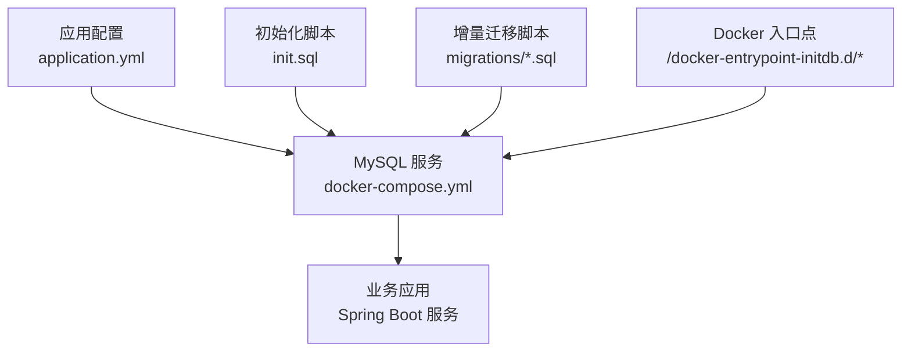
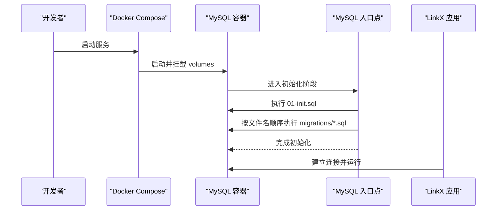
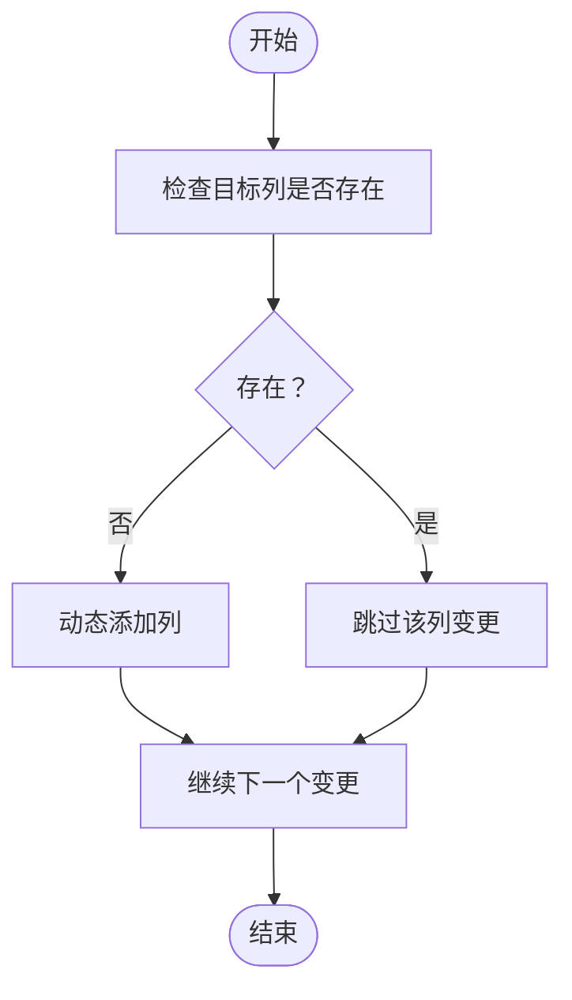
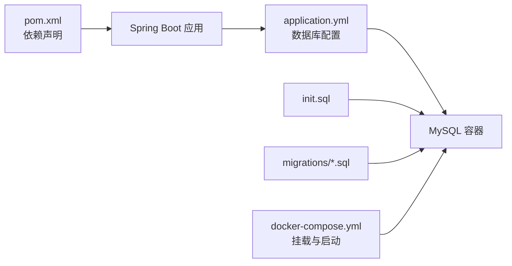

# 数据迁移

<cite>
**本文引用的文件**   
- [001_add_user_profile_and_friend_tables.sql](file://linkx-server/migrations/001_add_user_profile_and_friend_tables.sql)
- [002_add_im_tables.sql](file://linkx-server/migrations/002_add_im_tables.sql)
- [init.sql](file://linkx-server/init.sql)
- [docker-compose.yml](file://linkx-server/docker-compose.yml)
- [application.yml](file://linkx-server/src/main/resources/application.yml)
- [pom.xml](file://linkx-server/pom.xml)
</cite>

## 目录
1. [简介](#简介)
2. [项目结构](#项目结构)
3. [核心组件](#核心组件)
4. [架构总览](#架构总览)
5. [详细组件分析](#详细组件分析)
6. [依赖关系分析](#依赖关系分析)
7. [性能与一致性考虑](#性能与一致性考虑)
8. [故障排查指南](#故障排查指南)
9. [结论](#结论)
10. [附录](#附录)

## 简介
本文件为 LinkX 项目的数据迁移管理文档，聚焦于基于 SQL 脚本的版本控制策略、执行顺序控制、增量更新与回滚机制、数据一致性保障、多环境差异策略、脚本编写规范、验证方法、错误处理与恢复流程。当前仓库采用“初始化脚本 + 可重复执行的增量迁移脚本”的组合方式，并通过 Docker Compose 的入口点机制在容器启动时自动执行。

## 项目结构
与数据迁移相关的核心位置如下：
- 数据库初始化脚本：linkx-server/init.sql
- 增量迁移脚本目录：linkx-server/migrations（按数字前缀排序）
- 容器编排与自动执行：linkx-server/docker-compose.yml
- 应用配置（数据库连接等）：linkx-server/src/main/resources/application.yml
- 构建与依赖：linkx-server/pom.xml

图表来源
- [docker-compose.yml:1-48](file://linkx-server/docker-compose.yml#L1-L48)
- [application.yml:11-15](file://linkx-server/src/main/resources/application.yml#L11-L15)

章节来源
- [docker-compose.yml:1-48](file://linkx-server/docker-compose.yml#L1-L48)
- [application.yml:11-15](file://linkx-server/src/main/resources/application.yml#L11-L15)

## 核心组件
- 初始化脚本 init.sql：用于首次创建数据库与基础表结构，包含用户、好友关系、IM 会话与消息、登录审计等核心表定义。
- 增量迁移脚本 migrations：以数字前缀命名，描述对现有库结构的增量变更；脚本具备幂等性，支持重复执行。
- Docker Compose 挂载：将 init.sql 与 migrations 目录映射到 MySQL 容器的 /docker-entrypoint-initdb.d 路径，实现容器启动时的自动执行。
- 应用配置 application.yml：提供数据库连接信息，确保应用能访问已迁移完成的数据库。

章节来源
- [init.sql:1-131](file://linkx-server/init.sql#L1-L131)
- [001_add_user_profile_and_friend_tables.sql:1-80](file://linkx-server/migrations/001_add_user_profile_and_friend_tables.sql#L1-L80)
- [002_add_im_tables.sql:1-45](file://linkx-server/migrations/002_add_im_tables.sql#L1-L45)
- [docker-compose.yml:16-19](file://linkx-server/docker-compose.yml#L16-L19)
- [application.yml:11-15](file://linkx-server/src/main/resources/application.yml#L11-L15)

## 架构总览
下图展示了从容器启动到数据库结构就绪的整体流程：

图表来源
- [docker-compose.yml:16-19](file://linkx-server/docker-compose.yml#L16-L19)
- [init.sql:1-131](file://linkx-server/init.sql#L1-L131)
- [001_add_user_profile_and_friend_tables.sql:1-80](file://linkx-server/migrations/001_add_user_profile_and_friend_tables.sql#L1-L80)
- [002_add_im_tables.sql:1-45](file://linkx-server/migrations/002_add_im_tables.sql#L1-L45)

## 详细组件分析

### 迁移文件命名规范与版本控制
- 命名规则：使用三位数字前缀加下划线描述，如 001_xxx.sql、002_xxx.sql。该前缀决定执行顺序，保证迁移按语义递增执行。
- 版本号管理：通过文件名前缀体现版本演进，新增迁移应取最大序号+1，避免重名或乱序。
- 执行顺序控制：Docker 入口点会按文件名字典序执行，因此必须保持严格递增且无跳号。

章节来源
- [001_add_user_profile_and_friend_tables.sql:1-80](file://linkx-server/migrations/001_add_user_profile_and_friend_tables.sql#L1-L80)
- [002_add_im_tables.sql:1-45](file://linkx-server/migrations/002_add_im_tables.sql#L1-L45)
- [docker-compose.yml:16-19](file://linkx-server/docker-compose.yml#L16-L19)

### 增量更新与幂等性设计
- 幂等性原则：所有增量脚本需支持重复执行而不改变最终状态。
- 列级幂等：通过查询 information_schema.COLUMNS 判断列是否存在，不存在则动态添加，存在则跳过。
- 表级幂等：使用 CREATE TABLE IF NOT EXISTS 避免重复建表。
- 示例说明：
  - 用户资料字段扩展：在 sys_user 中按需增加 gender、birthday、country、province、region 等列，若已存在则跳过。
  - IM 模块表：im_conversation、im_conversation_member、im_message 均使用 IF NOT EXISTS 保护。

图表来源
- [001_add_user_profile_and_friend_tables.sql:10-16](file://linkx-server/migrations/001_add_user_profile_and_friend_tables.sql#L10-L16)
- [001_add_user_profile_and_friend_tables.sql:18-24](file://linkx-server/migrations/001_add_user_profile_and_friend_tables.sql#L18-L24)
- [001_add_user_profile_and_friend_tables.sql:26-32](file://linkx-server/migrations/001_add_user_profile_and_friend_tables.sql#L26-L32)
- [001_add_user_profile_and_friend_tables.sql:34-40](file://linkx-server/migrations/001_add_user_profile_and_friend_tables.sql#L34-L40)
- [001_add_user_profile_and_friend_tables.sql:42-48](file://linkx-server/migrations/001_add_user_profile_and_friend_tables.sql#L42-L48)
- [002_add_im_tables.sql:6-17](file://linkx-server/migrations/002_add_im_tables.sql#L6-L17)
- [002_add_im_tables.sql:19-29](file://linkx-server/migrations/002_add_im_tables.sql#L19-L29)
- [002_add_im_tables.sql:31-44](file://linkx-server/migrations/002_add_im_tables.sql#L31-L44)

章节来源
- [001_add_user_profile_and_friend_tables.sql:1-80](file://linkx-server/migrations/001_add_user_profile_and_friend_tables.sql#L1-L80)
- [002_add_im_tables.sql:1-45](file://linkx-server/migrations/002_add_im_tables.sql#L1-L45)

### 回滚机制与数据修复
- 现状：当前仓库未提供显式的回滚脚本或自动化回滚工具。
- 建议方案：
  - 为每个正向迁移准备对应的反向脚本（例如 001_rollback.sql），记录删除列、索引或表的语句。
  - 在生产环境回滚前，先进行全量备份与沙箱验证。
  - 回滚后再次执行正向迁移，确保状态一致。
- 数据修复：
  - 针对历史数据不一致问题，编写一次性修复脚本，并在测试环境充分验证后再上线。
  - 修复脚本同样遵循幂等性原则，避免重复执行造成副作用。

章节来源
- [001_add_user_profile_and_friend_tables.sql:1-80](file://linkx-server/migrations/001_add_user_profile_and_friend_tables.sql#L1-L80)
- [002_add_im_tables.sql:1-45](file://linkx-server/migrations/002_add_im_tables.sql#L1-L45)

### 数据一致性保证
- 事务边界：建议在复杂变更中使用事务包裹多条 DDL/DML，确保原子性。
- 约束与索引：
  - 唯一键：如 uk_private_key、uk_user_friend、uk_conv_user 等，防止重复数据。
  - 索引：为高频查询字段建立合适索引，提升性能与一致性校验效率。
- 逻辑删除：统一使用 deleted 字段标记删除，便于审计与恢复。
- 默认值与时间戳：create_time/update_time 使用 CURRENT_TIMESTAMP，保证时间一致性。

章节来源
- [init.sql:9-29](file://linkx-server/init.sql#L9-L29)
- [init.sql:34-47](file://linkx-server/init.sql#L34-L47)
- [init.sql:52-64](file://linkx-server/init.sql#L52-L64)
- [init.sql:69-80](file://linkx-server/init.sql#L69-L80)
- [init.sql:85-95](file://linkx-server/init.sql#L85-L95)
- [init.sql:100-113](file://linkx-server/init.sql#L100-L113)
- [002_add_im_tables.sql:6-17](file://linkx-server/migrations/002_add_im_tables.sql#L6-L17)
- [002_add_im_tables.sql:19-29](file://linkx-server/migrations/002_add_im_tables.sql#L19-L29)
- [002_add_im_tables.sql:31-44](file://linkx-server/migrations/002_add_im_tables.sql#L31-L44)

### 开发、测试与生产环境的迁移策略差异
- 开发环境：
  - 使用 Docker Compose 本地一键拉起 MySQL、Redis、MinIO。
  - 每次重建容器都会重新执行初始化与迁移脚本，适合快速迭代。
- 测试环境：
  - 建议使用独立数据库实例，保留历史数据快照，以便回归验证。
  - 可在 CI 中执行迁移脚本并运行集成测试，确保兼容性。
- 生产环境：
  - 禁止直接重建容器导致数据丢失。
  - 迁移前进行全量备份，灰度发布并监控关键指标。
  - 如需回滚，优先执行反向脚本并验证数据一致性。

章节来源
- [docker-compose.yml:1-48](file://linkx-server/docker-compose.yml#L1-L48)
- [application.yml:11-15](file://linkx-server/src/main/resources/application.yml#L11-L15)

### 迁移脚本编写规范
- 文件命名：三位数字前缀 + 下划线 + 简短英文描述，如 003_add_index_for_messages.sql。
- 幂等性：所有变更需支持重复执行，不产生副作用。
- 注释清晰：在文件头部说明适用场景、前置条件与注意事项。
- 最小化变更：一次迁移只解决一个明确的问题，便于定位与回滚。
- 字符集与排序规则：统一使用 utf8mb4 与 utf8mb4_unicode_ci。
- 索引与约束：新增索引前先评估查询模式，避免过度索引影响写入性能。

章节来源
- [001_add_user_profile_and_friend_tables.sql:1-80](file://linkx-server/migrations/001_add_user_profile_and_friend_tables.sql#L1-L80)
- [002_add_im_tables.sql:1-45](file://linkx-server/migrations/002_add_im_tables.sql#L1-L45)

### 数据验证方法
- 结构验证：
  - 检查目标表是否存在、列是否齐全、索引与唯一键是否符合预期。
  - 使用 information_schema 查询元数据进行断言。
- 数据完整性：
  - 校验外键关联、非空字段、枚举值范围。
  - 对关键字段进行抽样比对，确保迁移前后数据一致。
- 性能基线：
  - 对比迁移前后的慢查询日志与执行计划，确保新增索引有效且无退化。

章节来源
- [001_add_user_profile_and_friend_tables.sql:10-16](file://linkx-server/migrations/001_add_user_profile_and_friend_tables.sql#L10-L16)
- [002_add_im_tables.sql:6-17](file://linkx-server/migrations/002_add_im_tables.sql#L6-L17)

### 错误处理机制
- 脚本内错误处理：
  - 使用条件判断与动态 SQL 避免重复操作失败。
  - 对可能失败的 DDL 包裹在事务中，失败即整体回滚。
- 容器层错误处理：
  - Docker 入口点在遇到错误时会终止初始化流程，便于快速发现异常。
- 应用层错误处理：
  - 应用启动失败时应记录详细日志，包括数据库连接与迁移相关错误。

章节来源
- [001_add_user_profile_and_friend_tables.sql:10-16](file://linkx-server/migrations/001_add_user_profile_and_friend_tables.sql#L10-L16)
- [docker-compose.yml:16-19](file://linkx-server/docker-compose.yml#L16-L19)

### 数据库备份与恢复流程
- 备份：
  - 使用 mysqldump 对 linkx 数据库进行全量导出，包含结构与数据。
  - 定期备份并保留多个时间点副本，便于回滚与恢复。
- 恢复：
  - 停止应用，导入备份文件，确认数据完整。
  - 重新执行必要的迁移脚本，确保结构最新。
- 验证：
  - 启动应用并进行冒烟测试，确认关键功能正常。

章节来源
- [init.sql:1-131](file://linkx-server/init.sql#L1-L131)
- [docker-compose.yml:16-19](file://linkx-server/docker-compose.yml#L16-L19)

### 迁移失败处理与数据修复方案
- 失败定位：
  - 查看 MySQL 容器日志，定位具体失败的脚本与行号。
  - 检查应用日志中的数据库连接与初始化错误。
- 处理步骤：
  - 修正脚本后，在测试环境复现并验证。
  - 在生产环境执行修复脚本，必要时配合反向脚本回滚。
- 数据修复：
  - 编写一次性修复脚本，确保幂等性与可重复执行。
  - 修复后进行数据一致性校验与性能回归测试。

章节来源
- [001_add_user_profile_and_friend_tables.sql:1-80](file://linkx-server/migrations/001_add_user_profile_and_friend_tables.sql#L1-L80)
- [002_add_im_tables.sql:1-45](file://linkx-server/migrations/002_add_im_tables.sql#L1-L45)

## 依赖关系分析
- 应用依赖：
  - Spring Boot 应用通过 application.yml 配置 MySQL 连接，驱动由 pom.xml 引入。
- 容器依赖：
  - docker-compose.yml 负责启动 MySQL、Redis、MinIO，并将初始化与迁移脚本挂载至入口点目录。
- 迁移依赖：
  - 增量迁移脚本依赖 init.sql 的基础表结构，确保后续变更有稳定的基线。

图表来源
- [pom.xml:45-56](file://linkx-server/pom.xml#L45-L56)
- [application.yml:11-15](file://linkx-server/src/main/resources/application.yml#L11-L15)
- [docker-compose.yml:16-19](file://linkx-server/docker-compose.yml#L16-L19)
- [init.sql:1-131](file://linkx-server/init.sql#L1-L131)
- [001_add_user_profile_and_friend_tables.sql:1-80](file://linkx-server/migrations/001_add_user_profile_and_friend_tables.sql#L1-L80)
- [002_add_im_tables.sql:1-45](file://linkx-server/migrations/002_add_im_tables.sql#L1-L45)

章节来源
- [pom.xml:45-56](file://linkx-server/pom.xml#L45-L56)
- [application.yml:11-15](file://linkx-server/src/main/resources/application.yml#L11-L15)
- [docker-compose.yml:16-19](file://linkx-server/docker-compose.yml#L16-L19)

## 性能与一致性考虑
- 索引优化：
  - 为高频查询字段建立复合索引，如 im_message 的 (conversation_id, create_time)。
  - 避免冗余索引，定期审查慢查询日志。
- 大表变更：
  - 在线 DDL 需谨慎，尽量在低峰期执行，并使用 pt-online-schema-change 等工具降低锁表风险。
- 事务与批处理：
  - 批量插入或更新时使用事务与分批提交，减少锁竞争与内存占用。
- 监控与告警：
  - 监控数据库连接池、慢查询、锁等待与磁盘 IO，及时发现问题。

章节来源
- [init.sql:100-113](file://linkx-server/init.sql#L100-L113)
- [002_add_im_tables.sql:31-44](file://linkx-server/migrations/002_add_im_tables.sql#L31-L44)

## 故障排查指南
- 常见问题：
  - 容器无法启动：检查 MySQL 密码、端口冲突与卷权限。
  - 迁移失败：查看 MySQL 日志与应用日志，定位具体脚本与错误原因。
  - 应用连接失败：核对 application.yml 中的数据库地址、用户名与密码。
- 排查步骤：
  - 进入容器查看日志：docker logs linkx-mysql
  - 检查挂载目录是否正确：docker inspect linkx-mysql
  - 手动执行迁移脚本：在测试环境复现并验证修复方案。
- 恢复策略：
  - 使用最近一次成功备份恢复数据。
  - 重新执行迁移脚本，确保结构一致。
  - 重启应用并观察日志，确认恢复正常。

章节来源
- [docker-compose.yml:16-19](file://linkx-server/docker-compose.yml#L16-L19)
- [application.yml:11-15](file://linkx-server/src/main/resources/application.yml#L11-L15)

## 结论
LinkX 的数据迁移采用“初始化脚本 + 可重复执行的增量迁移脚本”的模式，结合 Docker Compose 的入口点机制，实现了便捷的一键初始化与增量升级。为确保生产稳定性，建议补充反向回滚脚本、完善数据验证与监控体系，并制定严格的发布与回滚流程。

## 附录
- 术语解释：
  - 幂等性：多次执行同一操作结果一致且不产生副作用。
  - 入口点：容器启动时自动执行的初始化脚本集合。
- 参考路径：
  - 初始化脚本：[init.sql](file://linkx-server/init.sql)
  - 增量迁移：[migrations](file://linkx-server/migrations)
  - 容器编排：[docker-compose.yml](file://linkx-server/docker-compose.yml)
  - 应用配置：[application.yml](file://linkx-server/src/main/resources/application.yml)
  - 构建依赖：[pom.xml](file://linkx-server/pom.xml)