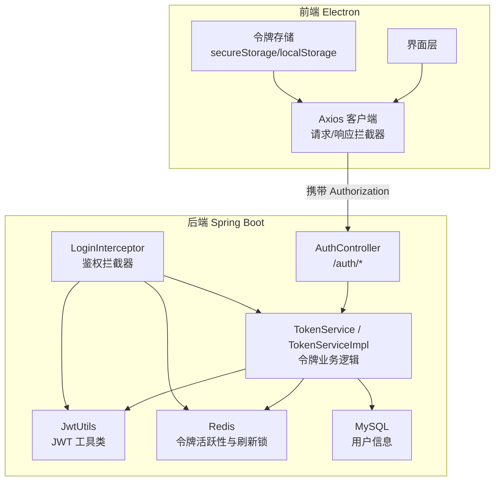
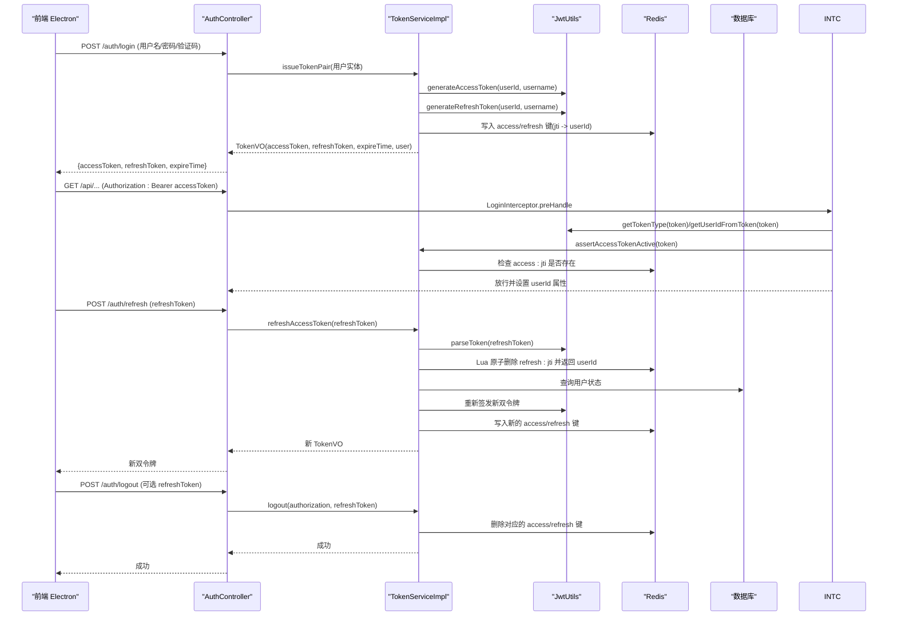
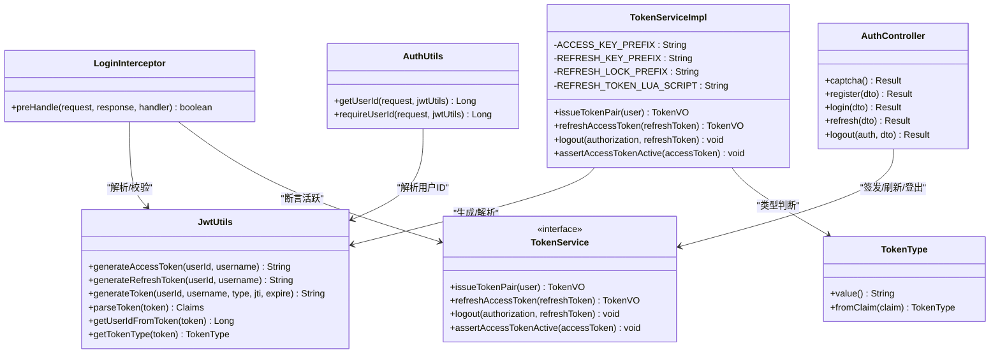

# JWT 认证机制

<cite>
**本文引用的文件列表**
- [JwtUtils.java](file://linkx-server/src/main/java/com/linkx/server/common/JwtUtils.java)
- [AuthUtils.java](file://linkx-server/src/main/java/com/linkx/server/common/AuthUtils.java)
- [LoginInterceptor.java](file://linkx-server/src/main/java/com/linkx/server/config/interceptor/LoginInterceptor.java)
- [TokenType.java](file://linkx-server/src/main/java/com/linkx/server/common/TokenType.java)
- [TokenService.java](file://linkx-server/src/main/java/com/linkx/server/service/TokenService.java)
- [TokenServiceImpl.java](file://linkx-server/src/main/java/com/linkx/server/service/impl/TokenServiceImpl.java)
- [AuthController.java](file://linkx-server/src/main/java/com/linkx/server/controller/AuthController.java)
- [application.yml](file://linkx-server/src/main/resources/application.yml)
- [tokenStorage.ts](file://linkx-client/src/utils/tokenStorage.ts)
- [auth.ts](file://linkx-client/src/api/auth.ts)
- [client.ts](file://linkx-client/src/api/client.ts)
- [auth.ts（类型定义）](file://linkx-client/src/types/auth.ts)
</cite>

## 目录
1. [简介](#简介)
2. [项目结构](#项目结构)
3. [核心组件](#核心组件)
4. [架构总览](#架构总览)
5. [详细组件分析](#详细组件分析)
6. [依赖关系分析](#依赖关系分析)
7. [性能与安全考量](#性能与安全考量)
8. [故障排查指南](#故障排查指南)
9. [结论](#结论)
10. [附录：前端集成与错误处理](#附录前端集成与错误处理)

## 简介
本文件面向 LinkX 项目的后端与前端，系统性阐述基于 JWT 的无状态认证实现。内容覆盖令牌生成算法、签名验证、过期时间管理、刷新令牌机制、载荷结构设计、安全配置参数、密钥管理策略、令牌生命周期管理，以及前后端集成与错误处理流程。文档同时提供流程图与时序图，帮助读者快速理解从登录到访问、刷新、登出的完整链路。

## 项目结构
本项目采用前后端分离架构：
- 后端 Spring Boot 服务负责用户认证、JWT 签发与校验、Redis 中令牌的活跃性控制与刷新保护。
- 前端 Electron 应用通过 Axios 拦截器自动携带 Access Token，并在 401 时触发刷新或跳转登录。

图表来源
- [AuthController.java:1-84](file://linkx-server/src/main/java/com/linkx/server/controller/AuthController.java#L1-L84)
- [LoginInterceptor.java:1-53](file://linkx-server/src/main/java/com/linkx/server/config/interceptor/LoginInterceptor.java#L1-L53)
- [TokenServiceImpl.java:1-204](file://linkx-server/src/main/java/com/linkx/server/service/impl/TokenServiceImpl.java#L1-L204)
- [JwtUtils.java:1-76](file://linkx-server/src/main/java/com/linkx/server/common/JwtUtils.java#L1-L76)
- [client.ts:1-123](file://linkx-client/src/api/client.ts#L1-L123)
- [tokenStorage.ts:1-79](file://linkx-client/src/utils/tokenStorage.ts#L1-L79)

章节来源
- [application.yml:1-54](file://linkx-server/src/main/resources/application.yml#L1-L54)

## 核心组件
- JwtUtils：封装 JWT 的创建、解析、提取载荷字段与类型判断；使用 HMAC-SHA 签名，支持可配置的过期时间。
- LoginInterceptor：统一拦截受保护接口，校验 Bearer Token 类型与活跃度，并将 userId 注入请求上下文。
- TokenService/Impl：负责签发双令牌对、刷新 Access Token、注销清理、Access Token 活跃度断言等。
- AuthController：暴露注册、登录、刷新、登出、验证码等认证相关 HTTP 接口。
- 前端 client.ts：Axios 拦截器自动附加 Authorization，并处理 401 时的刷新与重定向。
- tokenStorage.ts：在 Electron 环境下优先使用 secureStorage，否则回退到 localStorage。

章节来源
- [JwtUtils.java:1-76](file://linkx-server/src/main/java/com/linkx/server/common/JwtUtils.java#L1-L76)
- [LoginInterceptor.java:1-53](file://linkx-server/src/main/java/com/linkx/server/config/interceptor/LoginInterceptor.java#L1-L53)
- [TokenService.java:1-16](file://linkx-server/src/main/java/com/linkx/server/service/TokenService.java#L1-L16)
- [TokenServiceImpl.java:1-204](file://linkx-server/src/main/java/com/linkx/server/service/impl/TokenServiceImpl.java#L1-L204)
- [AuthController.java:1-84](file://linkx-server/src/main/java/com/linkx/server/controller/AuthController.java#L1-L84)
- [client.ts:1-123](file://linkx-client/src/api/client.ts#L1-L123)
- [tokenStorage.ts:1-79](file://linkx-client/src/utils/tokenStorage.ts#L1-L79)

## 架构总览
下图展示了认证相关的关键交互：登录获取双令牌、后续请求携带 Access Token、刷新 Access Token、登出清理。

图表来源
- [AuthController.java:1-84](file://linkx-server/src/main/java/com/linkx/server/controller/AuthController.java#L1-L84)
- [TokenServiceImpl.java:1-204](file://linkx-server/src/main/java/com/linkx/server/service/impl/TokenServiceImpl.java#L1-L204)
- [JwtUtils.java:1-76](file://linkx-server/src/main/java/com/linkx/server/common/JwtUtils.java#L1-L76)
- [LoginInterceptor.java:1-53](file://linkx-server/src/main/java/com/linkx/server/config/interceptor/LoginInterceptor.java#L1-L53)

## 详细组件分析

### JwtUtils 工具类
职责与要点
- 使用 HMAC-SHA 对 JWT 进行签名，密钥来自配置项 linkx.jwt.secret。
- 签发两类令牌：access 与 refresh，分别对应不同的过期时间与用途。
- 载荷包含：userId、username、type、jti（唯一标识），并设置 issuedAt 与 expiration。
- 提供解析与提取方法：parseToken、getUserIdFromToken、getTokenType。

关键方法与复杂度
- generateToken：O(1)，构建 Claims、计算过期时间、签名并压缩为字符串。
- parseToken：O(1)，解析并验签，抛出异常表示无效或已过期。
- getUserIdFromToken/getTokenType：O(1)，从 Claims 读取字段。

安全与配置
- 密钥长度与强度由外部配置决定，建议生产环境使用足够强度的随机密钥。
- 过期时间由 linkx.jwt.access-expire 与 linkx.jwt.refresh-expire 控制。

章节来源
- [JwtUtils.java:1-76](file://linkx-server/src/main/java/com/linkx/server/common/JwtUtils.java#L1-L76)
- [application.yml:29-33](file://linkx-server/src/main/resources/application.yml#L29-L33)

### LoginInterceptor 鉴权拦截器
职责与要点
- 跳过 OPTIONS 预检请求。
- 从 Authorization 头解析 Bearer Token，拒绝 REFRESH 类型的令牌用于业务接口。
- 调用 TokenService.assertAccessTokenActive 校验 Access Token 在 Redis 中存在且未失效。
- 将 userId 写入 request 属性，供后续控制器使用。

错误处理
- 未携带或非法令牌：抛出 401 异常。
- 非 ACCESS 类型：抛出 401 异常。
- 其他异常：统一转换为“登录已过期”提示。

章节来源
- [LoginInterceptor.java:1-53](file://linkx-server/src/main/java/com/linkx/server/config/interceptor/LoginInterceptor.java#L1-L53)
- [TokenType.java:1-29](file://linkx-server/src/main/java/com/linkx/server/common/TokenType.java#L1-L29)

### TokenService 与 TokenServiceImpl
职责与要点
- 签发双令牌对：为每次登录生成独立的 jti，并存入 Redis，便于撤销与刷新控制。
- 刷新 Access Token：
  - 先解析 refreshToken 获取 jti，校验类型为 REFRESH。
  - 使用分布式锁防止并发刷新导致重复发放。
  - 使用 Lua 脚本原子性地校验并删除 refresh 键，避免重复使用。
  - 校验用户状态后重新签发新双令牌，并更新 Redis。
- 登出：根据 Authorization 与可选 refreshToken 删除对应 Redis 键。
- 断言 Access Token 活跃：检查 Redis 中是否存在对应 access 键。

数据结构与复杂度
- Redis Key 前缀：
  - linkx:token:access:{jti} -> userId
  - linkx:token:refresh:{jti} -> userId
  - linkx:token:refresh:lock:{jti} -> 刷新锁
- 刷新流程整体 O(1) 操作（Redis 单次 Lua 执行）。

并发与幂等
- 刷新锁 key 基于 jti，TTL 短，避免死锁。
- Lua 原子删除确保同一 refreshToken 仅能成功刷新一次。

章节来源
- [TokenService.java:1-16](file://linkx-server/src/main/java/com/linkx/server/service/TokenService.java#L1-L16)
- [TokenServiceImpl.java:1-204](file://linkx-server/src/main/java/com/linkx/server/service/impl/TokenServiceImpl.java#L1-L204)

### AuthController 认证接口
职责与要点
- /auth/captcha：获取验证码（可选开关）。
- /auth/register：注册（可选验证码校验）。
- /auth/login：登录成功后返回双令牌及用户信息。
- /auth/refresh：刷新 Access Token，带速率限制。
- /auth/logout：登出，支持传入 refreshToken 主动清理。

限流与风控
- 刷新接口按 IP 维度做限流，防止暴力刷新。
- 登录/注册可启用验证码，降低自动化攻击风险。

章节来源
- [AuthController.java:1-84](file://linkx-server/src/main/java/com/linkx/server/controller/AuthController.java#L1-L84)
- [application.yml:34-39](file://linkx-server/src/main/resources/application.yml#L34-L39)

### 前端集成（Electron）
- 请求拦截器：自动从 tokenStorage 读取 accessToken 并附加到 Authorization 头。
- 响应拦截器：捕获 401，若未处于刷新中则发起 /auth/refresh，成功后重试原请求；失败则清空令牌并跳转登录。
- 令牌存储：优先使用 Electron 的 secureStorage，不可用时回退到 localStorage，键名前缀 linkx:token: 区分。

章节来源
- [client.ts:1-123](file://linkx-client/src/api/client.ts#L1-L123)
- [tokenStorage.ts:1-79](file://linkx-client/src/utils/tokenStorage.ts#L1-L79)
- [auth.ts（API 封装）:1-25](file://linkx-client/src/api/auth.ts#L1-25)
- [auth.ts（类型定义）:1-47](file://linkx-client/src/types/auth.ts#L1-47)

## 依赖关系分析

图表来源
- [JwtUtils.java:1-76](file://linkx-server/src/main/java/com/linkx/server/common/JwtUtils.java#L1-L76)
- [LoginInterceptor.java:1-53](file://linkx-server/src/main/java/com/linkx/server/config/interceptor/LoginInterceptor.java#L1-L53)
- [TokenService.java:1-16](file://linkx-server/src/main/java/com/linkx/server/service/TokenService.java#L1-L16)
- [TokenServiceImpl.java:1-204](file://linkx-server/src/main/java/com/linkx/server/service/impl/TokenServiceImpl.java#L1-L204)
- [AuthController.java:1-84](file://linkx-server/src/main/java/com/linkx/server/controller/AuthController.java#L1-L84)
- [AuthUtils.java:1-43](file://linkx-server/src/main/java/com/linkx/server/common/AuthUtils.java#L1-L43)
- [TokenType.java:1-29](file://linkx-server/src/main/java/com/linkx/server/common/TokenType.java#L1-L29)

## 性能与安全考量
- 性能
  - 所有令牌校验均为 O(1) 的 Redis 操作，刷新流程通过 Lua 保证原子性，减少竞争条件。
  - 刷新锁 TTL 较短，避免长时间占用资源。
- 安全
  - 使用 HMAC-SHA 签名，密钥通过环境变量注入，避免硬编码。
  - Refresh Token 一次性使用（Lua 原子删除），有效防止重放。
  - 刷新接口具备速率限制，降低暴力刷新风险。
  - 登录/注册可开启验证码，增强抗自动化攻击能力。
  - 建议生产环境强制 HTTPS，并通过反向代理统一证书管理。

[本节为通用指导，不直接分析具体文件]

## 故障排查指南
常见问题与定位
- 401 未登录或登录已过期
  - 检查 Authorization 头是否携带正确的 Bearer Token。
  - 确认 Redis 中 access:jti 是否存在（可能已被登出或过期）。
  - 查看 LoginInterceptor 抛出的异常信息。
- 刷新失败或过于频繁
  - 检查刷新锁是否被占用（refresh:lock:jti）。
  - 确认 Redis 中 refresh:jti 是否已被消费（Lua 删除）。
  - 查看刷新接口的限流计数。
- 前端无法刷新
  - 确认 tokenStorage 是否正确保存了 refreshToken。
  - 检查 axios 响应拦截器是否进入 processUnauthorized 分支。
  - 观察网络请求是否命中 /auth/refresh。

章节来源
- [LoginInterceptor.java:1-53](file://linkx-server/src/main/java/com/linkx/server/config/interceptor/LoginInterceptor.java#L1-L53)
- [TokenServiceImpl.java:1-204](file://linkx-server/src/main/java/com/linkx/server/service/impl/TokenServiceImpl.java#L1-L204)
- [client.ts:1-123](file://linkx-client/src/api/client.ts#L1-L123)

## 结论
LinkX 的 JWT 认证方案以“无状态签名 + 有状态活跃性控制”为核心：JWT 负责身份声明与签名校验，Redis 负责令牌撤销与刷新保护。该设计兼顾安全性与可扩展性，既能快速鉴权，又能灵活撤销与防重放。前端通过拦截器与本地安全存储实现了良好的用户体验与容错能力。

[本节为总结，不直接分析具体文件]

## 附录：前端集成与错误处理

### 登录获取令牌
- 调用 /auth/login，成功后保存 accessToken 与 refreshToken。
- 前端在后续请求自动附加 Authorization 头。

章节来源
- [auth.ts（API 封装）:1-25](file://linkx-client/src/api/auth.ts#L1-25)
- [client.ts:1-123](file://linkx-client/src/api/client.ts#L1-L123)
- [tokenStorage.ts:1-79](file://linkx-client/src/utils/tokenStorage.ts#L1-L79)

### 请求携带令牌
- 请求拦截器自动读取 accessToken 并设置 Authorization。
- 服务端拦截器校验类型与活跃度，通过后放行。

章节来源
- [client.ts:101-107](file://linkx-client/src/api/client.ts#L101-L107)
- [LoginInterceptor.java:22-51](file://linkx-server/src/main/java/com/linkx/server/config/interceptor/LoginInterceptor.java#L22-L51)

### 令牌刷新
- 当收到 401 时，前端尝试使用 refreshToken 调用 /auth/refresh。
- 成功后更新本地令牌并重试原请求；失败则跳转登录。

章节来源
- [client.ts:44-99](file://linkx-client/src/api/client.ts#L44-L99)
- [AuthController.java:55-59](file://linkx-server/src/main/java/com/linkx/server/controller/AuthController.java#L55-L59)
- [TokenServiceImpl.java:67-117](file://linkx-server/src/main/java/com/linkx/server/service/impl/TokenServiceImpl.java#L67-L117)

### 登出清理
- 前端调用 /auth/logout，可选择携带 refreshToken 以便服务端立即失效。
- 服务端删除对应 Redis 键，前端清空本地存储。

章节来源
- [AuthController.java:61-68](file://linkx-server/src/main/java/com/linkx/server/controller/AuthController.java#L61-L68)
- [TokenServiceImpl.java:120-171](file://linkx-server/src/main/java/com/linkx/server/service/impl/TokenServiceImpl.java#L120-L171)
- [tokenStorage.ts:75-78](file://linkx-client/src/utils/tokenStorage.ts#L75-L78)

### 错误处理机制
- 服务端：自定义异常统一返回 401 或 429，便于前端识别。
- 前端：统一拦截 401，执行刷新或跳转登录，避免重复刷新。

章节来源
- [AuthController.java:1-84](file://linkx-server/src/main/java/com/linkx/server/controller/AuthController.java#L1-L84)
- [client.ts:26-99](file://linkx-client/src/api/client.ts#L26-L99)