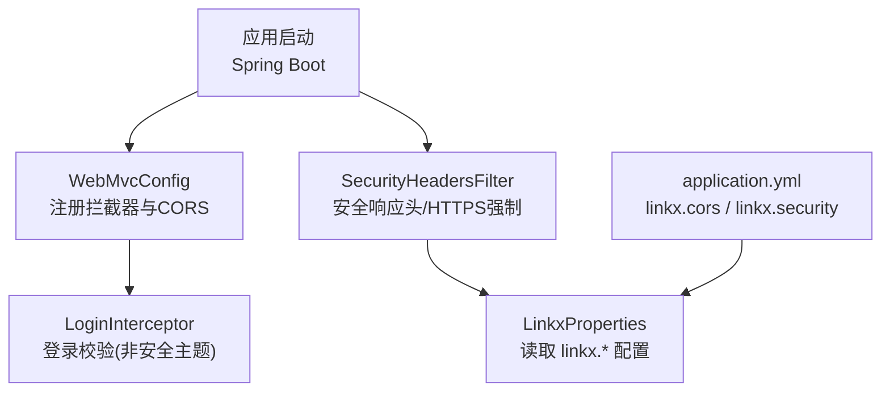
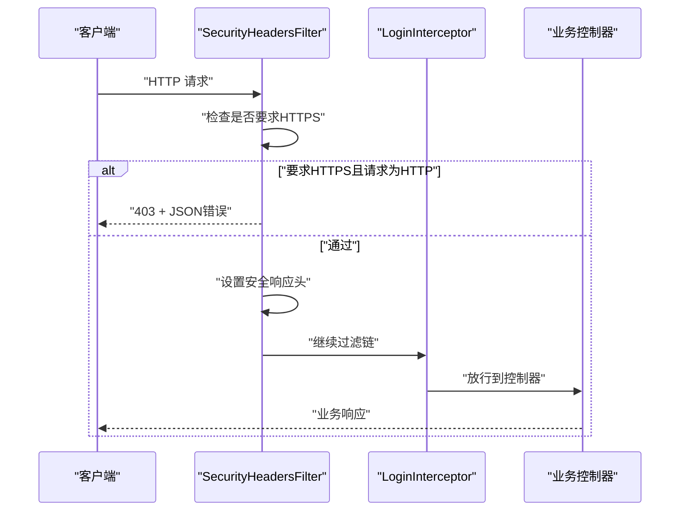
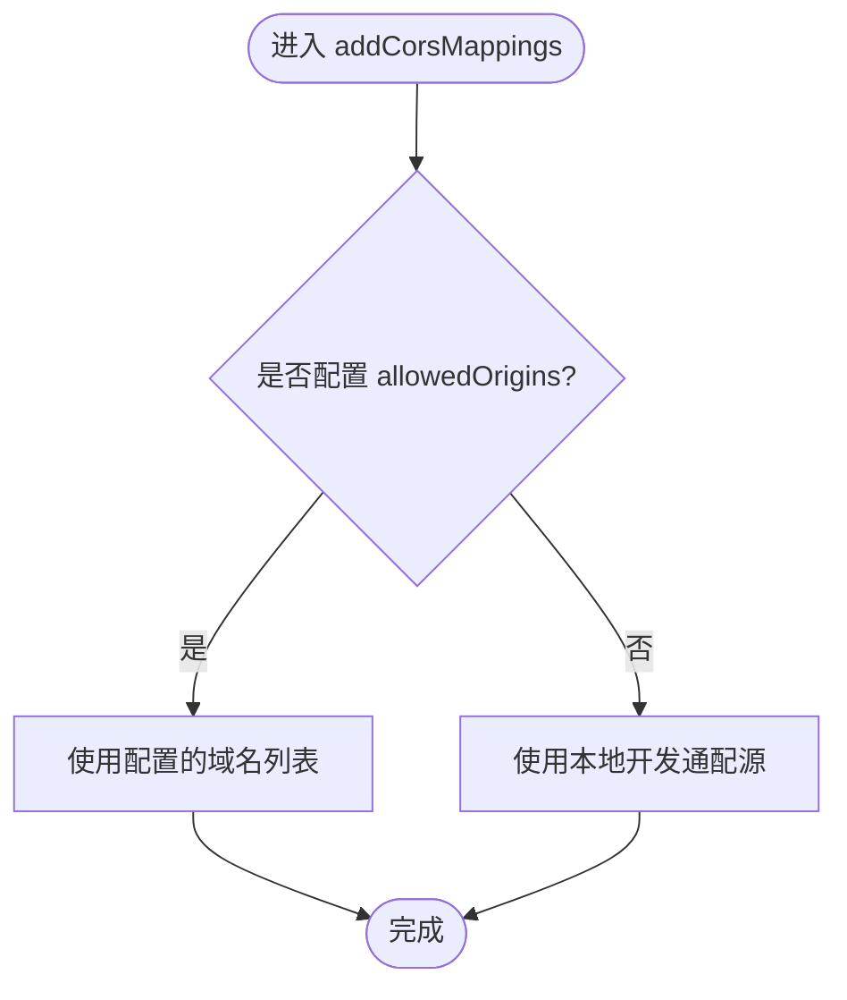
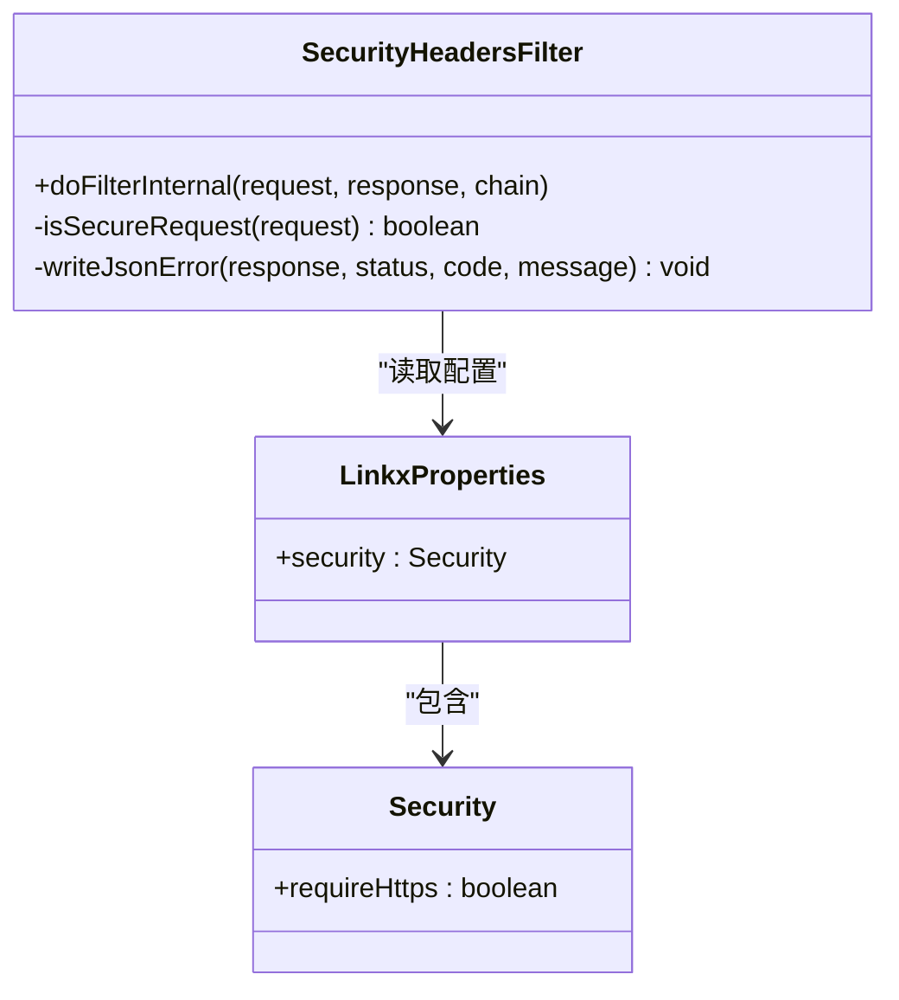
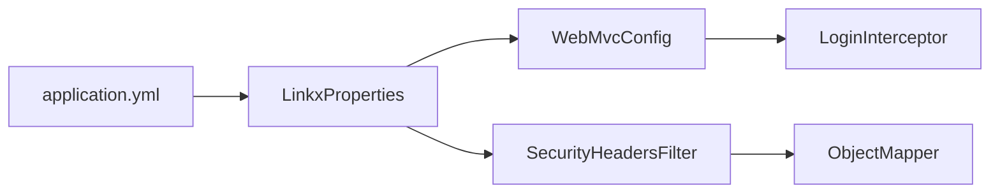

# 安全配置

<cite>
**本文引用的文件**   
- [WebMvcConfig.java](file://linkx-server/src/main/java/com/linkx/server/config/WebMvcConfig.java)
- [SecurityHeadersFilter.java](file://linkx-server/src/main/java/com/linkx/server/config/SecurityHeadersFilter.java)
- [LinkxProperties.java](file://linkx-server/src/main/java/com/linkx/server/config/LinkxProperties.java)
- [application.yml](file://linkx-server/src/main/resources/application.yml)
</cite>

## 目录
1. [简介](#简介)
2. [项目结构](#项目结构)
3. [核心组件](#核心组件)
4. [架构总览](#架构总览)
5. [详细组件分析](#详细组件分析)
6. [依赖关系分析](#依赖关系分析)
7. [性能与安全权衡](#性能与安全权衡)
8. [故障排查指南](#故障排查指南)
9. [结论](#结论)
10. [附录：生产环境加固清单](#附录生产环境加固清单)

## 简介
本文件面向 LinkX 后端服务的安全配置，聚焦以下方面：
- WebMvcConfig 中的跨域（CORS）与拦截器策略
- SecurityHeadersFilter 的安全响应头与 HTTPS 强制机制
- application.yml 中与链路安全相关的可配置项
- 基于现有实现的生产环境加固建议与参数调优方法

说明：
- 当前仓库未包含密码加密算法、会话超时时间、IP 白名单/黑名单等配置项的实现。本节仅对已有能力进行说明，并提供扩展建议。

## 项目结构
与“安全配置”直接相关的代码位于 linkx-server 模块的 config 包与 resources 下：
- WebMvcConfig：注册登录拦截器与 CORS 映射
- SecurityHeadersFilter：统一设置安全响应头并支持 HTTPS 强制
- LinkxProperties：集中读取 application.yml 中 linkx.* 配置
- application.yml：提供 linkx.cors、linkx.security 等开关与默认值

图表来源
- [WebMvcConfig.java:1-47](file://linkx-server/src/main/java/com/linkx/server/config/WebMvcConfig.java#L1-L47)
- [SecurityHeadersFilter.java:1-70](file://linkx-server/src/main/java/com/linkx/server/config/SecurityHeadersFilter.java#L1-L70)
- [LinkxProperties.java:1-65](file://linkx-server/src/main/java/com/linkx/server/config/LinkxProperties.java#L1-L65)
- [application.yml:29-54](file://linkx-server/src/main/resources/application.yml#L29-L54)

章节来源
- [WebMvcConfig.java:1-47](file://linkx-server/src/main/java/com/linkx/server/config/WebMvcConfig.java#L1-L47)
- [SecurityHeadersFilter.java:1-70](file://linkx-server/src/main/java/com/linkx/server/config/SecurityHeadersFilter.java#L1-L70)
- [LinkxProperties.java:1-65](file://linkx-server/src/main/java/com/linkx/server/config/LinkxProperties.java#L1-L65)
- [application.yml:29-54](file://linkx-server/src/main/resources/application.yml#L29-L54)

## 核心组件
- WebMvcConfig
  - 注册全局登录拦截器，排除认证相关路径
  - 配置全局 CORS，支持按域名列表或本地开发模式下的通配源
- SecurityHeadersFilter
  - 最高优先级过滤器，优先于其他过滤器执行
  - 在开启 requireHttps 时拒绝 HTTP 请求并返回 JSON 错误
  - 设置关键安全响应头：防内容类型嗅探、禁止嵌入框架、严格 Referrer 策略、禁用缓存；当启用 HTTPS 强制时附加 HSTS
- LinkxProperties
  - 集中管理 linkx.* 配置项，包括 JWT、认证、CORS、安全、IM、MinIO 等
- application.yml
  - 提供 linkx.cors.allowed-origins 与 linkx.security.require-https 等开关与默认值

章节来源
- [WebMvcConfig.java:18-45](file://linkx-server/src/main/java/com/linkx/server/config/WebMvcConfig.java#L18-L45)
- [SecurityHeadersFilter.java:29-49](file://linkx-server/src/main/java/com/linkx/server/config/SecurityHeadersFilter.java#L29-L49)
- [LinkxProperties.java:54-63](file://linkx-server/src/main/java/com/linkx/server/config/LinkxProperties.java#L54-L63)
- [application.yml:40-45](file://linkx-server/src/main/resources/application.yml#L40-L45)

## 架构总览
下图展示了请求进入后的安全处理流程：过滤器最先执行，随后是 MVC 层的拦截器与控制器。

图表来源
- [SecurityHeadersFilter.java:29-49](file://linkx-server/src/main/java/com/linkx/server/config/SecurityHeadersFilter.java#L29-L49)
- [WebMvcConfig.java:18-30](file://linkx-server/src/main/java/com/linkx/server/config/WebMvcConfig.java#L18-L30)

## 详细组件分析

### WebMvcConfig 安全相关配置
- 登录拦截器
  - 对所有路径生效，但排除认证相关路径与错误页，避免循环与重复鉴权
- CORS 策略
  - 允许常用方法与携带凭证
  - 若配置了 allowedOrigins，则使用精确域名列表
  - 否则回退到本地开发模式的通配源（localhost/127.0.0.1）

图表来源
- [WebMvcConfig.java:32-45](file://linkx-server/src/main/java/com/linkx/server/config/WebMvcConfig.java#L32-L45)
- [LinkxProperties.java:54-57](file://linkx-server/src/main/java/com/linkx/server/config/LinkxProperties.java#L54-L57)
- [application.yml:40-43](file://linkx-server/src/main/resources/application.yml#L40-L43)

章节来源
- [WebMvcConfig.java:18-45](file://linkx-server/src/main/java/com/linkx/server/config/WebMvcConfig.java#L18-L45)
- [LinkxProperties.java:54-57](file://linkx-server/src/main/java/com/linkx/server/config/LinkxProperties.java#L54-L57)
- [application.yml:40-43](file://linkx-server/src/main/resources/application.yml#L40-L43)

### SecurityHeadersFilter 安全防护机制
- HTTPS 强制
  - 当 requireHttps=true 且请求不满足 HTTPS（含 X-Forwarded-Proto=https）时，直接返回 403 与 JSON 错误体
- 安全响应头
  - X-Content-Type-Options: nosniff（防止浏览器 MIME 嗅探）
  - X-Frame-Options: DENY（禁止被 iframe 嵌入，缓解点击劫持）
  - Referrer-Policy: strict-origin-when-cross-origin（限制跨站 Referer 泄露）
  - Cache-Control: no-store（敏感页面不缓存）
  - Strict-Transport-Security: 仅在 requireHttps=true 时添加，提示浏览器后续仅走 HTTPS
- 执行顺序
  - 使用最高优先级，确保在其它过滤器之前注入安全头并执行 HTTPS 强制逻辑

图表来源
- [SecurityHeadersFilter.java:24-49](file://linkx-server/src/main/java/com/linkx/server/config/SecurityHeadersFilter.java#L24-L49)
- [LinkxProperties.java:59-63](file://linkx-server/src/main/java/com/linkx/server/config/LinkxProperties.java#L59-L63)

章节来源
- [SecurityHeadersFilter.java:29-49](file://linkx-server/src/main/java/com/linkx/server/config/SecurityHeadersFilter.java#L29-L49)
- [LinkxProperties.java:59-63](file://linkx-server/src/main/java/com/linkx/server/config/LinkxProperties.java#L59-L63)

### application.yml 安全相关配置项
- linkx.cors.allowed-origins
  - 用于指定允许的跨域来源；为空时由代码回退到本地开发模式
- linkx.security.require-https
  - 控制是否强制 HTTPS；开启后会在过滤器层拒绝 HTTP 请求并返回 JSON 错误

章节来源
- [application.yml:40-45](file://linkx-server/src/main/resources/application.yml#L40-L45)
- [LinkxProperties.java:54-63](file://linkx-server/src/main/java/com/linkx/server/config/LinkxProperties.java#L54-L63)

## 依赖关系分析
- WebMvcConfig 依赖 LoginInterceptor 与 LinkxProperties
- SecurityHeadersFilter 依赖 LinkxProperties 与 ObjectMapper（用于构造统一的 JSON 错误响应）
- application.yml 提供运行时配置，驱动上述行为

图表来源
- [WebMvcConfig.java:11-16](file://linkx-server/src/main/java/com/linkx/server/config/WebMvcConfig.java#L11-L16)
- [SecurityHeadersFilter.java:21-27](file://linkx-server/src/main/java/com/linkx/server/config/SecurityHeadersFilter.java#L21-L27)
- [LinkxProperties.java:11-20](file://linkx-server/src/main/java/com/linkx/server/config/LinkxProperties.java#L11-L20)
- [application.yml:29-54](file://linkx-server/src/main/resources/application.yml#L29-L54)

章节来源
- [WebMvcConfig.java:11-16](file://linkx-server/src/main/java/com/linkx/server/config/WebMvcConfig.java#L11-L16)
- [SecurityHeadersFilter.java:21-27](file://linkx-server/src/main/java/com/linkx/server/config/SecurityHeadersFilter.java#L21-L27)
- [LinkxProperties.java:11-20](file://linkx-server/src/main/java/com/linkx/server/config/LinkxProperties.java#L11-L20)
- [application.yml:29-54](file://linkx-server/src/main/resources/application.yml#L29-L54)

## 性能与安全权衡
- CORS 预检请求
  - 允许 OPTIONS 方法可减少浏览器预检失败带来的额外往返，但需配合严格的来源白名单
- 安全响应头
  - 均为轻量级头部写入，开销极低
- HTTPS 强制
  - 在网关/反向代理层终止 TLS 更常见；应用内强制可作为兜底策略

[本节为通用指导，不涉及具体文件分析]

## 故障排查指南
- 本地访问被拒绝（403）
  - 现象：开启 require-https 后，HTTP 请求直接返回 403 与 JSON 错误
  - 排查：确认前端是否通过 HTTPS 访问，或在反向代理层透传 X-Forwarded-Proto=https
- 跨域失败
  - 现象：浏览器控制台报跨域错误
  - 排查：核对 linkx.cors.allowed-origins 是否包含实际来源；如为空，确认是否为本地开发场景
- 安全头缺失
  - 现象：安全扫描工具提示缺少某些安全头
  - 排查：确认 SecurityHeadersFilter 已加载且未被自定义过滤器覆盖；检查 require-https 是否影响 HSTS 头的输出

章节来源
- [SecurityHeadersFilter.java:35-49](file://linkx-server/src/main/java/com/linkx/server/config/SecurityHeadersFilter.java#L35-L49)
- [WebMvcConfig.java:32-45](file://linkx-server/src/main/java/com/linkx/server/config/WebMvcConfig.java#L32-L45)

## 结论
- 当前安全配置覆盖了跨域、基础安全响应头与可选的 HTTPS 强制
- 如需完善 XSS、点击劫持、内容类型嗅探防护，可在过滤器中补充相应头部或引入成熟的安全中间件
- 密码加密算法、会话超时、IP 白名单/黑名单等能力尚未在当前仓库中体现，可按需扩展

[本节为总结性内容，不涉及具体文件分析]

## 附录：生产环境加固清单
- HTTPS 强制
  - 在反向代理层启用 TLS，并在应用侧开启 require-https 作为兜底
- 安全响应头增强
  - 建议在过滤器中按需增加 Content-Security-Policy、X-XSS-Protection、Permissions-Policy 等
- 日志审计
  - 记录登录成功/失败、异常与关键操作，结合外部日志系统做留存与分析
- 参数调优
  - 根据业务调整 CORS 白名单、令牌过期时间与限流策略
  - 将敏感配置通过环境变量注入，避免硬编码

[本节为通用建议，不涉及具体文件分析]