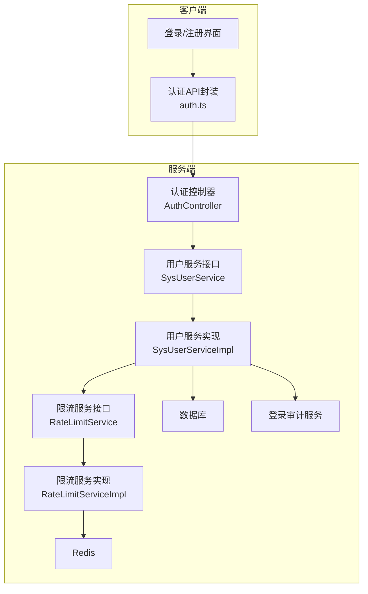
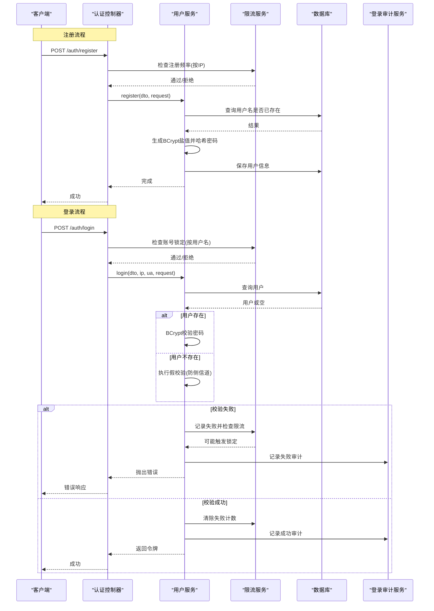
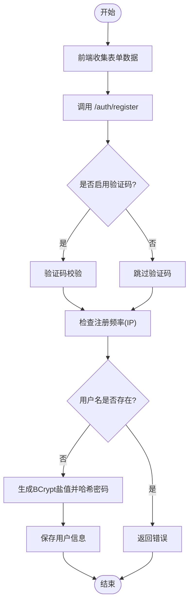
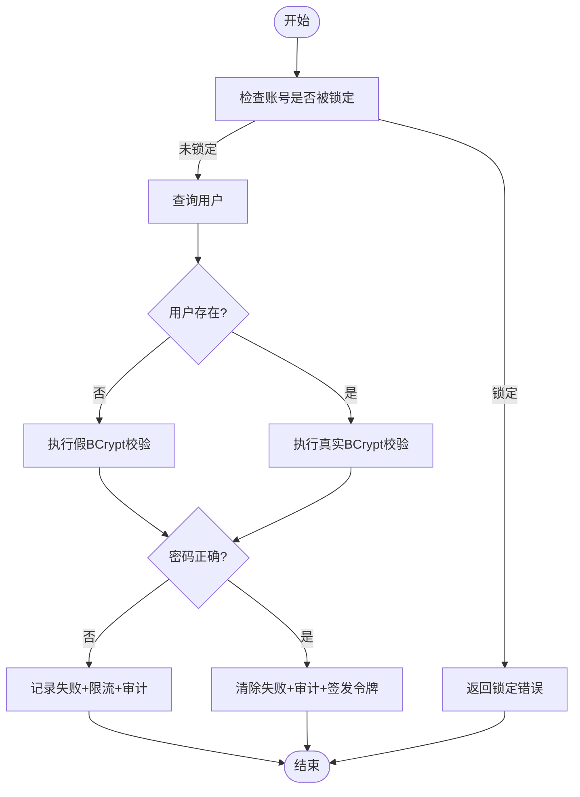
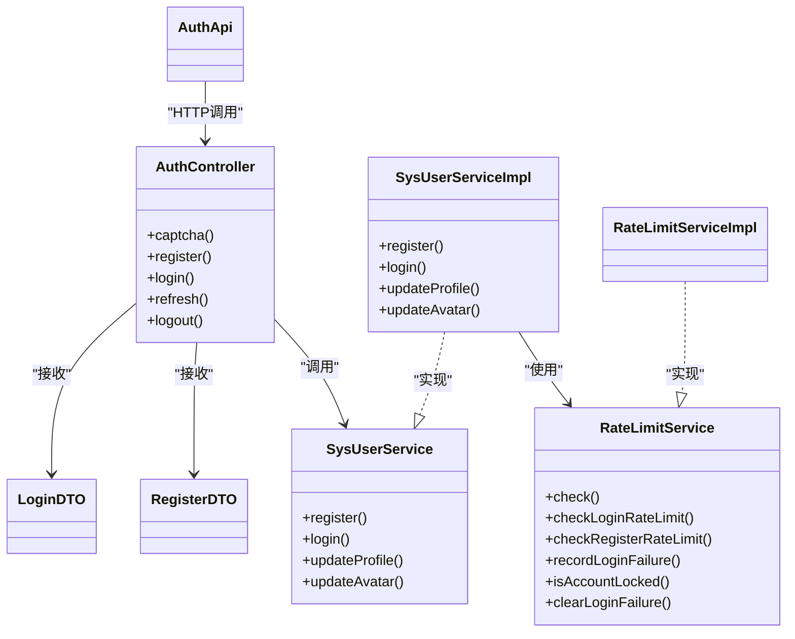

# 密码安全

<cite>
**本文引用的文件**   
- [AuthController.java](file://linkx-server/src/main/java/com/linkx/server/controller/AuthController.java)
- [SysUserService.java](file://linkx-server/src/main/java/com/linkx/server/service/SysUserService.java)
- [SysUserServiceImpl.java](file://linkx-server/src/main/java/com/linkx/server/service/impl/SysUserServiceImpl.java)
- [RegisterDTO.java](file://linkx-server/src/main/java/com/linkx/server/controller/dto/RegisterDTO.java)
- [LoginDTO.java](file://linkx-server/src/main/java/com/linkx/server/controller/dto/LoginDTO.java)
- [RateLimitService.java](file://linkx-server/src/main/java/com/linkx/server/service/RateLimitService.java)
- [RateLimitServiceImpl.java](file://linkx-server/src/main/java/com/linkx/server/service/impl/RateLimitServiceImpl.java)
- [auth.ts](file://linkx-client/src/api/auth.ts)
- [auth.ts（类型定义）](file://linkx-client/src/types/auth.ts)
</cite>

## 目录
1. [简介](#简介)
2. [项目结构](#项目结构)
3. [核心组件](#核心组件)
4. [架构总览](#架构总览)
5. [详细组件分析](#详细组件分析)
6. [依赖关系分析](#依赖关系分析)
7. [性能与安全特性](#性能与安全特性)
8. [故障排查指南](#故障排查指南)
9. [结论](#结论)
10. [附录：最佳实践与配置建议](#附录最佳实践与配置建议)

## 简介
本文件面向 LinkX 密码安全实现，聚焦以下目标：
- 密码加密存储机制：基于 BCrypt 的哈希算法、盐值生成策略与强度校验规则。
- 用户注册流程：从前端输入到后端加密存储的完整链路。
- 密码重置与修改策略：旧密码验证、新密码强度检查与操作审计记录。
- 常见攻击防护：暴力破解、字典攻击、彩虹表攻击等。
- 最佳实践：密码策略配置、安全传输与存储建议。

## 项目结构
本项目采用前后端分离架构：
- 前端（Electron + Vue）负责用户交互、基础校验与 API 调用。
- 后端（Spring Boot）提供认证接口、业务处理、限流与审计。
- Redis 用于登录失败计数、账号锁定与通用限流。
- 数据库持久化用户信息与审计日志。

图表来源
- [AuthController.java:25-84](file://linkx-server/src/main/java/com/linkx/server/controller/AuthController.java#L25-L84)
- [SysUserService.java:11-33](file://linkx-server/src/main/java/com/linkx/server/service/SysUserService.java#L11-L33)
- [SysUserServiceImpl.java:23-99](file://linkx-server/src/main/java/com/linkx/server/service/impl/SysUserServiceImpl.java#L23-L99)
- [RateLimitService.java:5-46](file://linkx-server/src/main/java/com/linkx/server/service/RateLimitService.java#L5-L46)
- [RateLimitServiceImpl.java:13-132](file://linkx-server/src/main/java/com/linkx/server/service/impl/RateLimitServiceImpl.java#L13-L132)
- [auth.ts:1-25](file://linkx-client/src/api/auth.ts#L1-L25)

章节来源
- [AuthController.java:25-84](file://linkx-server/src/main/java/com/linkx/server/controller/AuthController.java#L25-L84)
- [SysUserService.java:11-33](file://linkx-server/src/main/java/com/linkx/server/service/SysUserService.java#L11-L33)
- [SysUserServiceImpl.java:23-99](file://linkx-server/src/main/java/com/linkx/server/service/impl/SysUserServiceImpl.java#L23-L99)
- [RateLimitService.java:5-46](file://linkx-server/src/main/java/com/linkx/server/service/RateLimitService.java#L5-L46)
- [RateLimitServiceImpl.java:13-132](file://linkx-server/src/main/java/com/linkx/server/service/impl/RateLimitServiceImpl.java#L13-L132)
- [auth.ts:1-25](file://linkx-client/src/api/auth.ts#L1-L25)

## 核心组件
- 认证控制器：统一暴露注册、登录、刷新令牌、登出与验证码接口；在注册/登录前可选启用验证码校验。
- 用户服务：实现注册（含密码哈希）、登录（含防侧信道与限流）、资料更新与头像更新。
- 限流服务：基于 Redis 实现 IP 与用户名维度的登录失败计数、账号锁定与注册频率限制。
- DTO 校验：使用注解对用户名、密码、昵称进行长度与格式校验。
- 前端 API：封装认证相关请求，传递验证码参数。

章节来源
- [AuthController.java:36-74](file://linkx-server/src/main/java/com/linkx/server/controller/AuthController.java#L36-L74)
- [SysUserServiceImpl.java:34-99](file://linkx-server/src/main/java/com/linkx/server/service/impl/SysUserServiceImpl.java#L34-L99)
- [RegisterDTO.java:8-27](file://linkx-server/src/main/java/com/linkx/server/controller/dto/RegisterDTO.java#L8-L27)
- [LoginDTO.java:8-22](file://linkx-server/src/main/java/com/linkx/server/controller/dto/LoginDTO.java#L8-L22)
- [auth.ts:4-24](file://linkx-client/src/api/auth.ts#L4-L24)

## 架构总览
下图展示注册与登录的关键调用链路与安全控制点。

图表来源
- [AuthController.java:41-53](file://linkx-server/src/main/java/com/linkx/server/controller/AuthController.java#L41-L53)
- [SysUserServiceImpl.java:34-99](file://linkx-server/src/main/java/com/linkx/server/service/impl/SysUserServiceImpl.java#L34-L99)
- [RateLimitServiceImpl.java:37-96](file://linkx-server/src/main/java/com/linkx/server/service/impl/RateLimitServiceImpl.java#L37-L96)

## 详细组件分析

### 密码加密存储机制（BCrypt）
- 算法选择：使用 BCrypt 进行密码哈希，具备内置盐值与自适应成本因子，天然抵御彩虹表攻击。
- 盐值生成：每次注册时随机生成盐值，确保相同明文在不同用户或不同时间产生不同密文。
- 存储规范：仅存储 BCrypt 哈希串，不存储明文或可逆加密数据。

章节来源
- [SysUserServiceImpl.java:46-56](file://linkx-server/src/main/java/com/linkx/server/service/impl/SysUserServiceImpl.java#L46-L56)

### 密码强度验证规则
- 长度约束：最小 8 字符，最大 64 字符。
- 复杂度要求：必须同时包含字母与数字。
- 用户名约束：仅允许字母、数字与下划线，长度 4-32。
- 前端配合：前端类型定义中携带密码字段，建议在客户端也做基础提示与校验以提升用户体验。

章节来源
- [RegisterDTO.java:16-19](file://linkx-server/src/main/java/com/linkx/server/controller/dto/RegisterDTO.java#L16-L19)
- [LoginDTO.java:16-18](file://linkx-server/src/main/java/com/linkx/server/controller/dto/LoginDTO.java#L16-18)
- [auth.ts（类型定义）:33-46](file://linkx-client/src/types/auth.ts#L33-L46)

### 用户注册流程（端到端）
- 前端：收集用户名、密码、昵称与验证码，调用注册接口。
- 后端：
  - 可选验证码校验。
  - IP 维度注册频率限制。
  - 用户名唯一性检查。
  - 生成 BCrypt 哈希并持久化。
- 返回：统一成功响应。

图表来源
- [AuthController.java:41-46](file://linkx-server/src/main/java/com/linkx/server/controller/AuthController.java#L41-L46)
- [SysUserServiceImpl.java:34-56](file://linkx-server/src/main/java/com/linkx/server/service/impl/SysUserServiceImpl.java#L34-L56)
- [RegisterDTO.java:8-27](file://linkx-server/src/main/java/com/linkx/server/controller/dto/RegisterDTO.java#L8-L27)

章节来源
- [AuthController.java:41-46](file://linkx-server/src/main/java/com/linkx/server/controller/AuthController.java#L41-L46)
- [SysUserServiceImpl.java:34-56](file://linkx-server/src/main/java/com/linkx/server/service/impl/SysUserServiceImpl.java#L34-L56)
- [auth.ts:12-14](file://linkx-client/src/api/auth.ts#L12-L14)

### 登录流程与防侧信道
- 账号锁定检查：若达到失败阈值则锁定一段时间。
- 防侧信道：无论用户是否存在，均执行耗时操作，避免通过响应时间推断用户存在与否。
- 失败处理：记录失败次数、触发限流与账号锁定，并写入审计日志。
- 成功处理：清除失败计数，记录成功审计，签发令牌。

图表来源
- [SysUserServiceImpl.java:60-99](file://linkx-server/src/main/java/com/linkx/server/service/impl/SysUserServiceImpl.java#L60-L99)
- [RateLimitServiceImpl.java:37-96](file://linkx-server/src/main/java/com/linkx/server/service/impl/RateLimitServiceImpl.java#L37-L96)

章节来源
- [SysUserServiceImpl.java:60-99](file://linkx-server/src/main/java/com/linkx/server/service/impl/SysUserServiceImpl.java#L60-L99)
- [RateLimitServiceImpl.java:37-96](file://linkx-server/src/main/java/com/linkx/server/service/impl/RateLimitServiceImpl.java#L37-L96)

### 密码重置与修改密码的安全策略
当前代码库未提供“修改密码”和“密码重置”的专用接口与实现。建议遵循以下安全策略（概念性指导）：
- 身份二次确认：修改/重置前需验证旧密码或通过短信/邮箱验证码完成身份确认。
- 新密码强度检查：复用现有强度规则（长度、复杂度），并可扩展为禁止历史密码、禁止常见弱口令。
- 操作审计：记录操作人、时间、IP、设备指纹与结果，便于追溯与风控。
- 会话管理：修改成功后主动失效旧令牌，强制重新登录。
- 防重放与防并发：使用一次性令牌或幂等键防止重复提交。

[本节为概念性内容，不涉及具体源码]

### 验证码与限流（辅助安全）
- 验证码：注册与登录时可启用验证码，降低自动化攻击风险。
- 限流：
  - 登录失败：按用户名与 IP 双维度计数，超过阈值锁定账号。
  - 注册频率：按 IP 限制单位时间内注册次数。
  - 令牌刷新：对刷新接口进行速率限制。

章节来源
- [AuthController.java:70-74](file://linkx-server/src/main/java/com/linkx/server/controller/AuthController.java#L70-L74)
- [RateLimitServiceImpl.java:25-82](file://linkx-server/src/main/java/com/linkx/server/service/impl/RateLimitServiceImpl.java#L25-L82)

## 依赖关系分析
- 控制器依赖服务层与属性配置，服务层依赖限流、审计与存储。
- 限流服务依赖 Redis 与配置项，实现原子递增与过期策略。
- 前端 API 模块仅负责请求封装与类型定义。

图表来源
- [AuthController.java:25-84](file://linkx-server/src/main/java/com/linkx/server/controller/AuthController.java#L25-L84)
- [SysUserService.java:11-33](file://linkx-server/src/main/java/com/linkx/server/service/SysUserService.java#L11-L33)
- [SysUserServiceImpl.java:23-99](file://linkx-server/src/main/java/com/linkx/server/service/impl/SysUserServiceImpl.java#L23-L99)
- [RateLimitService.java:5-46](file://linkx-server/src/main/java/com/linkx/server/service/RateLimitService.java#L5-L46)
- [RateLimitServiceImpl.java:13-132](file://linkx-server/src/main/java/com/linkx/server/service/impl/RateLimitServiceImpl.java#L13-L132)
- [auth.ts:1-25](file://linkx-client/src/api/auth.ts#L1-L25)

章节来源
- [AuthController.java:25-84](file://linkx-server/src/main/java/com/linkx/server/controller/AuthController.java#L25-L84)
- [SysUserService.java:11-33](file://linkx-server/src/main/java/com/linkx/server/service/SysUserService.java#L11-L33)
- [SysUserServiceImpl.java:23-99](file://linkx-server/src/main/java/com/linkx/server/service/impl/SysUserServiceImpl.java#L23-L99)
- [RateLimitService.java:5-46](file://linkx-server/src/main/java/com/linkx/server/service/RateLimitService.java#L5-L46)
- [RateLimitServiceImpl.java:13-132](file://linkx-server/src/main/java/com/linkx/server/service/impl/RateLimitServiceImpl.java#L13-L132)
- [auth.ts:1-25](file://linkx-client/src/api/auth.ts#L1-L25)

## 性能与安全特性
- 计算开销：BCrypt 的自适应成本因子使哈希计算具有一定延迟，有助于抵御离线爆破。
- 防侧信道：登录时对不存在的用户执行等价耗时的假校验，避免通过时间差异泄露用户存在性。
- 限流与锁定：基于 Redis 的原子计数与过期策略，有效抑制暴力破解与撞库。
- 审计记录：登录成功/失败事件记录，支持事后分析与风控联动。

章节来源
- [SysUserServiceImpl.java:72-80](file://linkx-server/src/main/java/com/linkx/server/service/impl/SysUserServiceImpl.java#L72-L80)
- [RateLimitServiceImpl.java:25-66](file://linkx-server/src/main/java/com/linkx/server/service/impl/RateLimitServiceImpl.java#L25-L66)

## 故障排查指南
- 注册失败
  - 现象：返回“注册失败，请检查信息后重试”。
  - 排查：检查用户名是否已存在、验证码是否启用且有效、注册频率是否超限。
- 登录失败
  - 现象：返回“用户名或密码错误”或“登录失败次数过多，请稍后再试”。
  - 排查：检查用户名/密码是否正确、是否触发账号锁定、IP 是否因频繁尝试被限流。
- 令牌刷新受限
  - 现象：刷新接口返回“操作过于频繁，请稍后再试”。
  - 排查：检查刷新频率是否超过限制。

章节来源
- [SysUserServiceImpl.java:42-44](file://linkx-server/src/main/java/com/linkx/server/service/impl/SysUserServiceImpl.java#L42-L44)
- [SysUserServiceImpl.java:64-66](file://linkx-server/src/main/java/com/linkx/server/service/impl/SysUserServiceImpl.java#L64-L66)
- [SysUserServiceImpl.java:82-87](file://linkx-server/src/main/java/com/linkx/server/service/impl/SysUserServiceImpl.java#L82-L87)
- [RateLimitServiceImpl.java:32-35](file://linkx-server/src/main/java/com/linkx/server/service/impl/RateLimitServiceImpl.java#L32-L35)

## 结论
LinkX 在后端实现了以 BCrypt 为核心的密码安全方案，结合严格的输入校验、防侧信道登录、多维限流与账号锁定、以及审计记录，能够有效抵御常见的密码攻击。当前版本尚未提供“修改密码”和“密码重置”接口，建议按本文附录的策略补充完善，以实现更完整的生命周期安全管理。

## 附录：最佳实践与配置建议
- 密码策略
  - 最小长度与复杂度：至少 8 位，包含字母与数字；可扩展为大小写、特殊字符与长度上限。
  - 历史密码与黑名单：禁止最近 N 次使用的密码，屏蔽常见弱口令。
- 安全传输
  - 全站 HTTPS：确保所有认证相关接口走 TLS，禁用 HTTP。
  - 敏感头与 Cookie：设置 Secure、HttpOnly、SameSite 等标志。
- 安全存储
  - 仅存哈希：不存储明文或可逆加密数据。
  - 定期评估 BCrypt 成本因子：根据硬件能力调整，平衡安全与性能。
- 访问控制与风控
  - 多因素认证：对高风险操作（如修改密码、重置密码）引入二次验证。
  - 设备与环境基线：记录 UA、IP、地理位置，异常行为触发额外校验。
- 审计与合规
  - 全量记录：登录、注册、修改、重置等关键操作的主体、时间、来源与结果。
  - 留存周期与脱敏：满足合规要求并对敏感信息进行脱敏展示。

[本节为通用建议，不涉及具体源码]