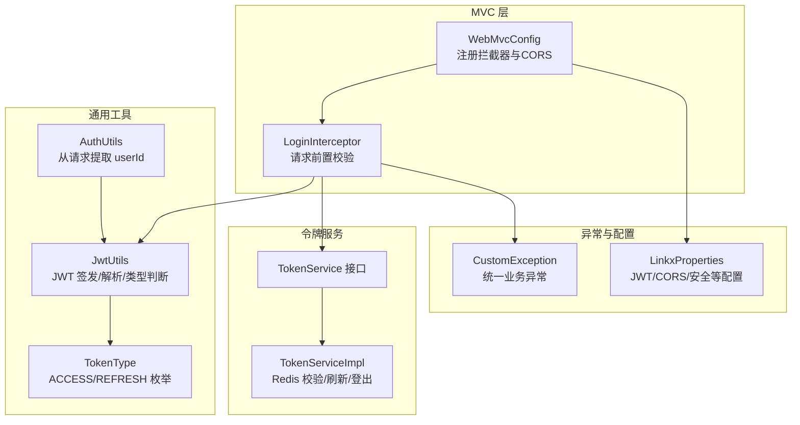
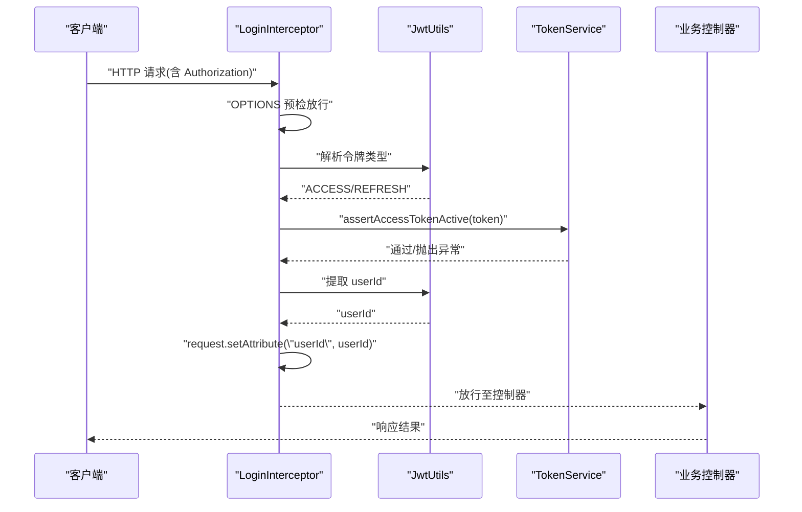
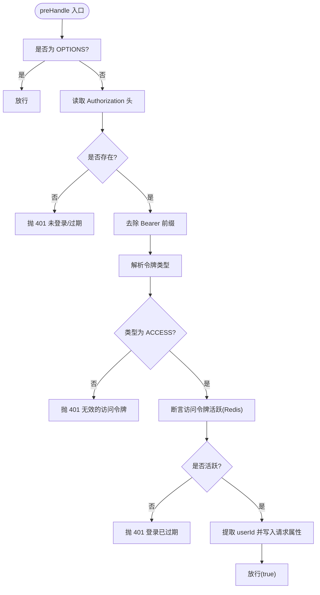
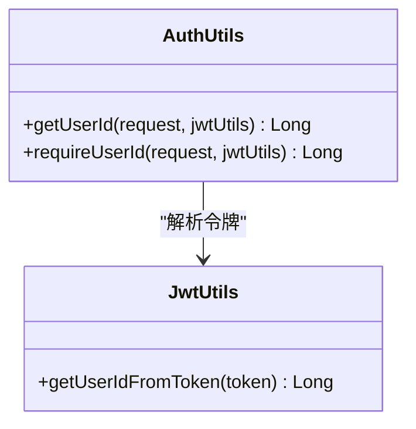
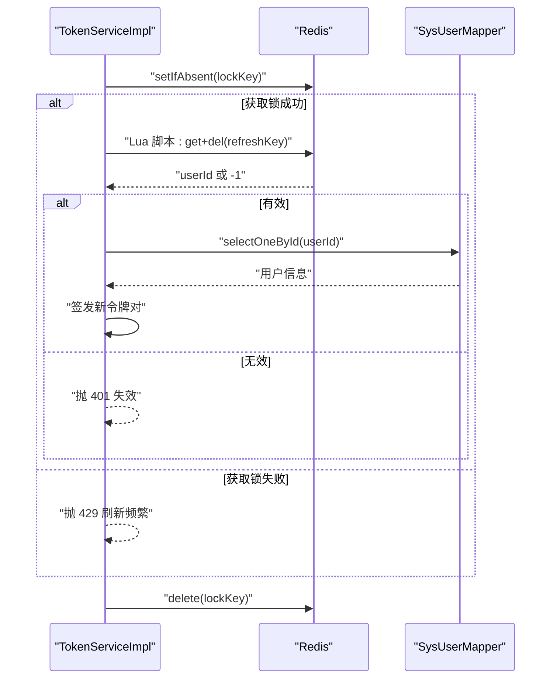
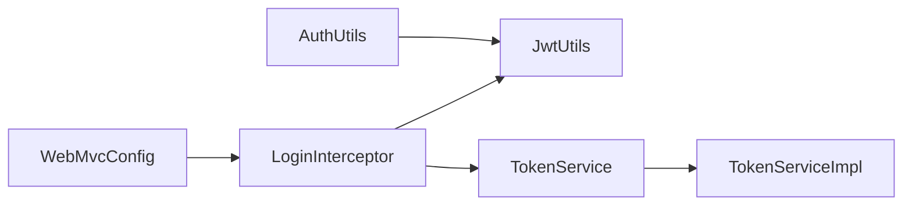

# 登录拦截器

<cite>
**本文引用的文件列表**
- [LoginInterceptor.java](file://linkx-server/src/main/java/com/linkx/server/config/interceptor/LoginInterceptor.java)
- [WebMvcConfig.java](file://linkx-server/src/main/java/com/linkx/server/config/WebMvcConfig.java)
- [AuthUtils.java](file://linkx-server/src/main/java/com/linkx/server/common/AuthUtils.java)
- [JwtUtils.java](file://linkx-server/src/main/java/com/linkx/server/common/JwtUtils.java)
- [TokenType.java](file://linkx-server/src/main/java/com/linkx/server/common/TokenType.java)
- [TokenService.java](file://linkx-server/src/main/java/com/linkx/server/service/TokenService.java)
- [TokenServiceImpl.java](file://linkx-server/src/main/java/com/linkx/server/service/impl/TokenServiceImpl.java)
- [CustomException.java](file://linkx-server/src/main/java/com/linkx/server/exception/CustomException.java)
- [LinkxProperties.java](file://linkx-server/src/main/java/com/linkx/server/config/LinkxProperties.java)
</cite>

## 目录
1. [简介](#简介)
2. [项目结构](#项目结构)
3. [核心组件](#核心组件)
4. [架构总览](#架构总览)
5. [详细组件分析](#详细组件分析)
6. [依赖关系分析](#依赖关系分析)
7. [性能考虑](#性能考虑)
8. [故障排查指南](#故障排查指南)
9. [结论](#结论)
10. [附录](#附录)

## 简介
本文件为 LinkX 后端登录拦截器系统的实现文档，聚焦于以下目标：
- 深入解析 LoginInterceptor 的拦截时机、权限验证逻辑与访问控制策略
- 说明 AuthUtils 工具类在请求中获取当前用户身份的方法与边界行为
- 给出拦截器的注册配置、白名单路径设置、异常处理与性能优化建议
- 提供扩展自定义权限检查逻辑的方案，以及与 Spring Security 集成的思路
- 给出角色权限、资源权限与方法级权限的完整示例方案（概念性）

## 项目结构
登录与鉴权相关代码主要位于 linkx-server 模块下，关键位置如下：
- 拦截器与 MVC 配置：config/interceptor、config/WebMvcConfig
- 认证工具与令牌类型：common/AuthUtils、common/JwtUtils、common/TokenType
- 令牌服务接口与实现：service/TokenService、service/impl/TokenServiceImpl
- 全局异常定义：exception/CustomException
- 应用配置属性：config/LinkxProperties

图表来源
- [WebMvcConfig.java:1-47](file://linkx-server/src/main/java/com/linkx/server/config/WebMvcConfig.java#L1-L47)
- [LoginInterceptor.java:1-53](file://linkx-server/src/main/java/com/linkx/server/config/interceptor/LoginInterceptor.java#L1-L53)
- [JwtUtils.java:1-76](file://linkx-server/src/main/java/com/linkx/server/common/JwtUtils.java#L1-L76)
- [TokenType.java:1-29](file://linkx-server/src/main/java/com/linkx/server/common/TokenType.java#L1-L29)
- [AuthUtils.java:1-43](file://linkx-server/src/main/java/com/linkx/server/common/AuthUtils.java#L1-L43)
- [TokenService.java:1-16](file://linkx-server/src/main/java/com/linkx/server/service/TokenService.java#L1-L16)
- [TokenServiceImpl.java:1-204](file://linkx-server/src/main/java/com/linkx/server/service/impl/TokenServiceImpl.java#L1-L204)
- [CustomException.java:1-40](file://linkx-server/src/main/java/com/linkx/server/exception/CustomException.java#L1-L40)
- [LinkxProperties.java:1-65](file://linkx-server/src/main/java/com/linkx/server/config/LinkxProperties.java#L1-L65)

章节来源
- [WebMvcConfig.java:1-47](file://linkx-server/src/main/java/com/linkx/server/config/WebMvcConfig.java#L1-L47)
- [LoginInterceptor.java:1-53](file://linkx-server/src/main/java/com/linkx/server/config/interceptor/LoginInterceptor.java#L1-L53)
- [AuthUtils.java:1-43](file://linkx-server/src/main/java/com/linkx/server/common/AuthUtils.java#L1-L43)
- [JwtUtils.java:1-76](file://linkx-server/src/main/java/com/linkx/server/common/JwtUtils.java#L1-L76)
- [TokenType.java:1-29](file://linkx-server/src/main/java/com/linkx/server/common/TokenType.java#L1-L29)
- [TokenService.java:1-16](file://linkx-server/src/main/java/com/linkx/server/service/TokenService.java#L1-L16)
- [TokenServiceImpl.java:1-204](file://linkx-server/src/main/java/com/linkx/server/service/impl/TokenServiceImpl.java#L1-L204)
- [CustomException.java:1-40](file://linkx-server/src/main/java/com/linkx/server/exception/CustomException.java#L1-L40)
- [LinkxProperties.java:1-65](file://linkx-server/src/main/java/com/linkx/server/config/LinkxProperties.java#L1-L65)

## 核心组件
- LoginInterceptor：在请求进入控制器前进行鉴权，校验 Authorization 头、令牌类型、访问令牌有效性，并将当前用户 ID 写入请求上下文。
- WebMvcConfig：注册全局拦截器并配置跨域；维护白名单路径，排除无需鉴权的公开接口。
- JwtUtils：负责 JWT 的签发、解析、类型判断与用户 ID 提取。
- TokenService/TokenServiceImpl：基于 Redis 管理令牌的活跃状态、刷新与登出，提供断言访问令牌有效的能力。
- AuthUtils：从请求上下文中安全地获取当前用户 ID，支持可选或强制模式。
- CustomException：统一的业务异常封装，用于返回 HTTP 风格错误码与消息。
- TokenType：区分 ACCESS 与 REFRESH 两种令牌类型。
- LinkxProperties：集中化配置项，包含 JWT 过期时间、CORS 允许源、安全开关等。

章节来源
- [LoginInterceptor.java:1-53](file://linkx-server/src/main/java/com/linkx/server/config/interceptor/LoginInterceptor.java#L1-L53)
- [WebMvcConfig.java:1-47](file://linkx-server/src/main/java/com/linkx/server/config/WebMvcConfig.java#L1-L47)
- [JwtUtils.java:1-76](file://linkx-server/src/main/java/com/linkx/server/common/JwtUtils.java#L1-L76)
- [TokenService.java:1-16](file://linkx-server/src/main/java/com/linkx/server/service/TokenService.java#L1-L16)
- [TokenServiceImpl.java:1-204](file://linkx-server/src/main/java/com/linkx/server/service/impl/TokenServiceImpl.java#L1-L204)
- [AuthUtils.java:1-43](file://linkx-server/src/main/java/com/linkx/server/common/AuthUtils.java#L1-L43)
- [CustomException.java:1-40](file://linkx-server/src/main/java/com/linkx/server/exception/CustomException.java#L1-L40)
- [TokenType.java:1-29](file://linkx-server/src/main/java/com/linkx/server/common/TokenType.java#L1-L29)
- [LinkxProperties.java:1-65](file://linkx-server/src/main/java/com/linkx/server/config/LinkxProperties.java#L1-L65)

## 架构总览
下图展示了典型受保护接口的请求流程：客户端携带 Access Token 发起请求，拦截器校验令牌类型与活跃度，成功后将用户 ID 注入请求上下文，供后续控制器使用。

图表来源
- [LoginInterceptor.java:22-51](file://linkx-server/src/main/java/com/linkx/server/config/interceptor/LoginInterceptor.java#L22-L51)
- [JwtUtils.java:66-74](file://linkx-server/src/main/java/com/linkx/server/common/JwtUtils.java#L66-L74)
- [TokenService.java:14](file://linkx-server/src/main/java/com/linkx/server/service/TokenService.java#L14)
- [TokenServiceImpl.java:126-136](file://linkx-server/src/main/java/com/linkx/server/service/impl/TokenServiceImpl.java#L126-L136)

## 详细组件分析

### LoginInterceptor 工作原理
- 拦截时机：所有匹配到 addPathPatterns("/**") 的请求在进入控制器之前执行 preHandle。
- 白名单放行：WebMvcConfig 中 excludePathPatterns 配置的公开路径不经过拦截器。
- OPTIONS 预检：对跨域预检请求直接放行，避免重复鉴权开销。
- 令牌解析与校验：
  - 从 Authorization 头读取 token，去除 "Bearer " 前缀。
  - 使用 JwtUtils 判断令牌类型，拒绝 REFRESH 令牌作为访问令牌。
  - 调用 TokenService.assertAccessTokenActive 校验访问令牌在 Redis 中是否仍有效。
- 上下文注入：将解析出的 userId 写入 request 属性，供后续组件使用。
- 异常处理：
  - 未携带或无效令牌：抛出 401 业务异常。
  - 非预期异常：统一包装为 401 提示“登录已过期”。

图表来源
- [LoginInterceptor.java:22-51](file://linkx-server/src/main/java/com/linkx/server/config/interceptor/LoginInterceptor.java#L22-L51)
- [JwtUtils.java:71-74](file://linkx-server/src/main/java/com/linkx/server/common/JwtUtils.java#L71-L74)
- [TokenServiceImpl.java:126-136](file://linkx-server/src/main/java/com/linkx/server/service/impl/TokenServiceImpl.java#L126-L136)

章节来源
- [LoginInterceptor.java:1-53](file://linkx-server/src/main/java/com/linkx/server/config/interceptor/LoginInterceptor.java#L1-L53)
- [WebMvcConfig.java:19-29](file://linkx-server/src/main/java/com/linkx/server/config/WebMvcConfig.java#L19-L29)
- [JwtUtils.java:66-74](file://linkx-server/src/main/java/com/linkx/server/common/JwtUtils.java#L66-L74)
- [TokenServiceImpl.java:126-136](file://linkx-server/src/main/java/com/linkx/server/service/impl/TokenServiceImpl.java#L126-L136)
- [CustomException.java:14-39](file://linkx-server/src/main/java/com/linkx/server/exception/CustomException.java#L14-L39)

### AuthUtils 工具类
- 设计目标：以最小侵入方式从请求中提取当前用户 ID，兼容“已通过拦截器注入”和“直接从 Header 解析”两种场景。
- 方法说明：
  - getUserId(request, jwtUtils)：优先从 request 属性取 userId；若不存在则尝试从 Authorization 头解析，失败返回 null。
  - requireUserId(request, jwtUtils)：强校验模式，若无法获取 userId 则抛出 401 异常。
- 使用建议：
  - 在受保护接口中优先使用 requireUserId 确保必须登录。
  - 在可选登录接口中使用 getUserId 做降级处理。

图表来源
- [AuthUtils.java:15-41](file://linkx-server/src/main/java/com/linkx/server/common/AuthUtils.java#L15-L41)
- [JwtUtils.java:66-69](file://linkx-server/src/main/java/com/linkx/server/common/JwtUtils.java#L66-L69)

章节来源
- [AuthUtils.java:1-43](file://linkx-server/src/main/java/com/linkx/server/common/AuthUtils.java#L1-L43)
- [JwtUtils.java:66-69](file://linkx-server/src/main/java/com/linkx/server/common/JwtUtils.java#L66-L69)

### 令牌服务与 Redis 校验
- TokenService.assertAccessTokenActive：
  - 解析 JWT 并校验类型为 ACCESS。
  - 在 Redis 中检查对应键是否存在，不存在视为已过期或未登录。
- TokenServiceImpl.refreshAccessToken：
  - 校验 refreshToken 类型与存在性。
  - 使用分布式锁与 Lua 脚本原子性地验证并删除 refresh token，防止并发刷新导致重复发放。
  - 校验用户状态后重新签发新的 access/refresh 令牌对。
- 登出：
  - 撤销 bearer 访问令牌与原始 refresh 令牌对应的 Redis 键。

图表来源
- [TokenServiceImpl.java:67-117](file://linkx-server/src/main/java/com/linkx/server/service/impl/TokenServiceImpl.java#L67-L117)
- [TokenServiceImpl.java:126-136](file://linkx-server/src/main/java/com/linkx/server/service/impl/TokenServiceImpl.java#L126-L136)
- [TokenServiceImpl.java:146-171](file://linkx-server/src/main/java/com/linkx/server/service/impl/TokenServiceImpl.java#L146-L171)

章节来源
- [TokenService.java:1-16](file://linkx-server/src/main/java/com/linkx/server/service/TokenService.java#L1-L16)
- [TokenServiceImpl.java:1-204](file://linkx-server/src/main/java/com/linkx/server/service/impl/TokenServiceImpl.java#L1-L204)

### 拦截器注册与白名单配置
- 全局拦截：addPathPatterns("/**") 覆盖全部接口。
- 白名单排除：excludePathPatterns 配置了认证相关与错误页路径，这些路径不受登录校验限制。
- CORS 配置：根据 LinkxProperties 动态设置允许的源，默认开发环境允许本地回环地址。

章节来源
- [WebMvcConfig.java:19-45](file://linkx-server/src/main/java/com/linkx/server/config/WebMvcConfig.java#L19-L45)
- [LinkxProperties.java:55-63](file://linkx-server/src/main/java/com/linkx/server/config/LinkxProperties.java#L55-L63)

### 异常处理与错误码
- 自定义异常 CustomException 承载 HTTP 风格错误码与消息，便于统一返回格式。
- 拦截器与服务层在多种非法状态下抛出 401 异常，例如：
  - 未携带 Authorization
  - 令牌类型不是 ACCESS
  - Redis 中无活跃访问令牌
  - refreshToken 无效或已过期
  - 账号不可用

章节来源
- [CustomException.java:14-39](file://linkx-server/src/main/java/com/linkx/server/exception/CustomException.java#L14-L39)
- [LoginInterceptor.java:28-50](file://linkx-server/src/main/java/com/linkx/server/config/interceptor/LoginInterceptor.java#L28-L50)
- [TokenServiceImpl.java:67-117](file://linkx-server/src/main/java/com/linkx/server/service/impl/TokenServiceImpl.java#L67-L117)

## 依赖关系分析
- LoginInterceptor 依赖 JwtUtils 与 TokenService，完成令牌类型判断与活跃度校验。
- TokenServiceImpl 依赖 Redis 与数据库映射，完成令牌存储、刷新与登出。
- AuthUtils 依赖 JwtUtils，用于从请求中解析用户 ID。
- WebMvcConfig 依赖 LoginInterceptor 与 LinkxProperties，完成拦截器注册与 CORS 配置。

图表来源
- [WebMvcConfig.java:1-47](file://linkx-server/src/main/java/com/linkx/server/config/WebMvcConfig.java#L1-L47)
- [LoginInterceptor.java:1-53](file://linkx-server/src/main/java/com/linkx/server/config/interceptor/LoginInterceptor.java#L1-L53)
- [JwtUtils.java:1-76](file://linkx-server/src/main/java/com/linkx/server/common/JwtUtils.java#L1-L76)
- [TokenService.java:1-16](file://linkx-server/src/main/java/com/linkx/server/service/TokenService.java#L1-L16)
- [TokenServiceImpl.java:1-204](file://linkx-server/src/main/java/com/linkx/server/service/impl/TokenServiceImpl.java#L1-L204)
- [AuthUtils.java:1-43](file://linkx-server/src/main/java/com/linkx/server/common/AuthUtils.java#L1-L43)

章节来源
- [WebMvcConfig.java:1-47](file://linkx-server/src/main/java/com/linkx/server/config/WebMvcConfig.java#L1-L47)
- [LoginInterceptor.java:1-53](file://linkx-server/src/main/java/com/linkx/server/config/interceptor/LoginInterceptor.java#L1-L53)
- [JwtUtils.java:1-76](file://linkx-server/src/main/java/com/linkx/server/common/JwtUtils.java#L1-L76)
- [TokenService.java:1-16](file://linkx-server/src/main/java/com/linkx/server/service/TokenService.java#L1-L16)
- [TokenServiceImpl.java:1-204](file://linkx-server/src/main/java/com/linkx/server/service/impl/TokenServiceImpl.java#L1-L204)
- [AuthUtils.java:1-43](file://linkx-server/src/main/java/com/linkx/server/common/AuthUtils.java#L1-L43)

## 性能考虑
- 拦截器层面
  - 对 OPTIONS 预检请求直接放行，减少不必要的鉴权开销。
  - 仅做一次 Redis 活跃性检查，避免重复 IO。
- 令牌刷新
  - 使用分布式锁与 Lua 脚本保证并发安全，避免重复签发。
  - 刷新频率限制返回 429，降低热点刷新带来的压力。
- 缓存与键空间
  - 访问令牌与刷新令牌分别使用前缀隔离，便于统计与清理。
  - 合理设置过期时间与 TTL，避免内存膨胀。
- 可观测性
  - 建议在拦截器与服务层增加耗时埋点与指标上报，定位慢请求与热点路径。

[本节为通用性能建议，不直接分析具体文件]

## 故障排查指南
- 常见 401 错误
  - 未携带 Authorization：检查客户端是否正确设置请求头。
  - 令牌类型错误：确认使用的是 ACCESS 而非 REFRESH。
  - 登录已过期：检查 Redis 中访问令牌键是否存在，或服务端是否主动登出。
  - 刷新过于频繁：等待一段时间后再试，或调整刷新频率限制。
- 调试建议
  - 打印请求头与解析后的 claims，确认签名与过期时间。
  - 查看 Redis 中对应 key 是否存在与剩余 TTL。
  - 核对白名单路径是否与请求路径一致，避免误拦截。

章节来源
- [LoginInterceptor.java:28-50](file://linkx-server/src/main/java/com/linkx/server/config/interceptor/LoginInterceptor.java#L28-L50)
- [TokenServiceImpl.java:67-117](file://linkx-server/src/main/java/com/linkx/server/service/impl/TokenServiceImpl.java#L67-L117)
- [TokenServiceImpl.java:126-136](file://linkx-server/src/main/java/com/linkx/server/service/impl/TokenServiceImpl.java#L126-L136)

## 结论
LinkX 的登录拦截体系以轻量拦截器为核心，结合 JWT 与 Redis 实现了无状态的访问控制与活跃的会话管理。通过白名单机制与清晰的异常语义，系统在保证安全性的同时具备良好的可扩展性与可维护性。后续可在该基础上平滑接入更细粒度的权限模型与 Spring Security。

[本节为总结性内容，不直接分析具体文件]

## 附录

### 如何扩展自定义权限检查逻辑
- 在 LoginInterceptor 之后引入新的权限拦截器，或在控制器方法上添加注解式鉴权。
- 在拦截器中读取 request.getAttribute("userId") 并结合业务数据（如用户角色、资源映射）进行决策。
- 对于需要读库的复杂校验，建议引入缓存层以减少数据库压力。

[本节为概念性指导，不直接分析具体文件]

### 与 Spring Security 集成建议
- 保留现有 LoginInterceptor 作为轻量前置校验，Spring Security 作为后置增强，实现双重保障。
- 将 AuthUtils 提供的 userId 注入到 SecurityContext，以便使用 @PreAuthorize/@PostAuthorize 等注解。
- 将白名单路径同步到 Security 的 permitAll 配置，避免重复放行逻辑。

[本节为概念性指导，不直接分析具体文件]

### 完整的权限控制示例（概念性）
- 角色权限
  - 在用户表中维护角色字段，在拦截器或授权层加载用户角色集合。
  - 使用注解或表达式校验角色，如要求 ADMIN 角色才能访问管理接口。
- 资源权限
  - 建立用户-资源映射表，记录用户对资源的读写权限。
  - 在业务方法中通过 AuthUtils 获取 userId，再查询资源权限矩阵进行判定。
- 方法级权限
  - 结合注解与 AOP 实现方法级鉴权，例如在更新敏感数据时强制校验操作者身份与资源归属。
  - 将权限校验结果与审计日志关联，满足合规要求。

[本节为概念性指导，不直接分析具体文件]