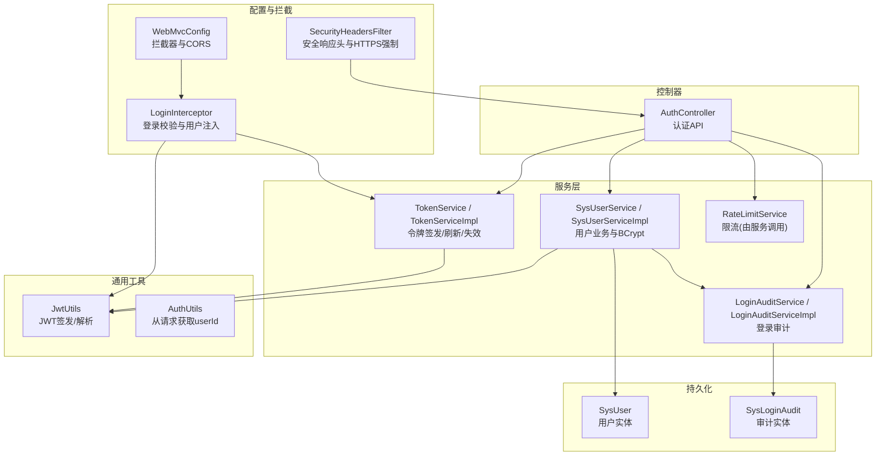
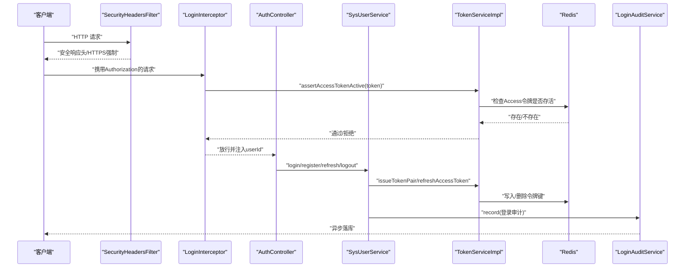
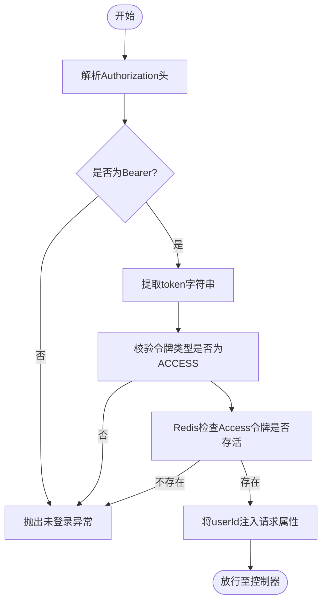
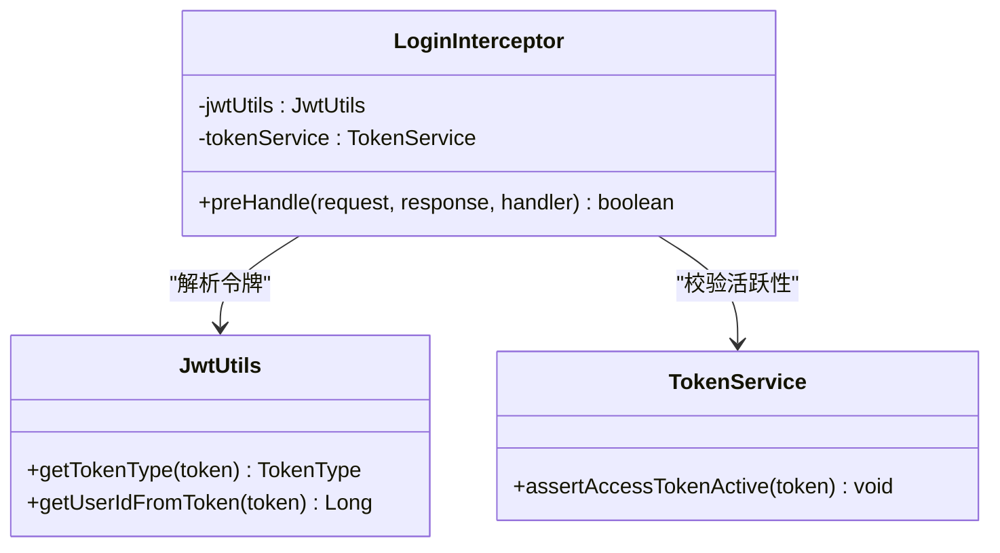
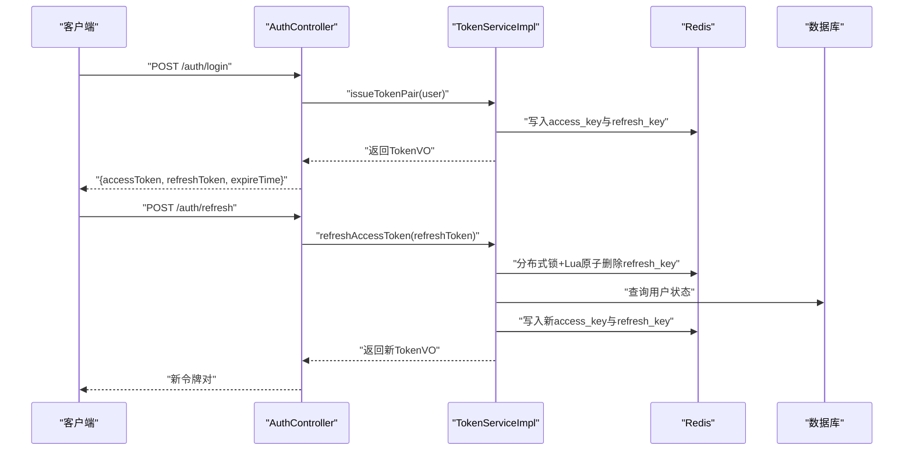
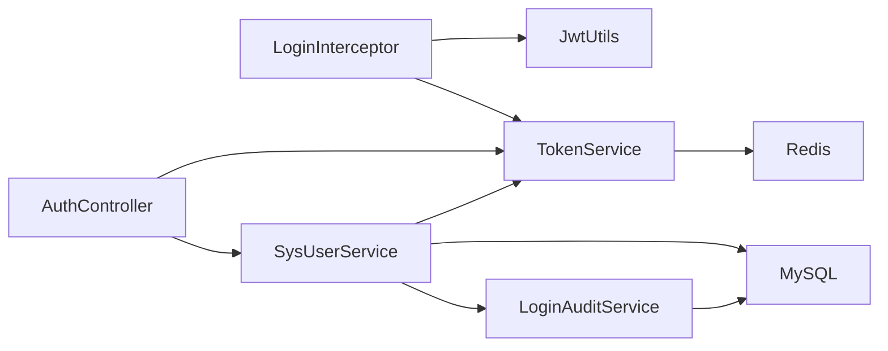

# 认证与安全

<cite>
**本文引用的文件**   
- [JwtUtils.java](file://linkx-server/src/main/java/com/linkx/server/common/JwtUtils.java)
- [LoginInterceptor.java](file://linkx-server/src/main/java/com/linkx/server/config/interceptor/LoginInterceptor.java)
- [AuthController.java](file://linkx-server/src/main/java/com/linkx/server/controller/AuthController.java)
- [TokenService.java](file://linkx-server/src/main/java/com/linkx/server/service/TokenService.java)
- [TokenServiceImpl.java](file://linkx-server/src/main/java/com/linkx/server/service/impl/TokenServiceImpl.java)
- [SysUser.java](file://linkx-server/src/main/java/com/linkx/server/entity/SysUser.java)
- [application.yml](file://linkx-server/src/main/resources/application.yml)
- [SecurityHeadersFilter.java](file://linkx-server/src/main/java/com/linkx/server/config/SecurityHeadersFilter.java)
- [WebMvcConfig.java](file://linkx-server/src/main/java/com/linkx/server/config/WebMvcConfig.java)
- [GlobalExceptionHandler.java](file://linkx-server/src/main/java/com/linkx/server/exception/GlobalExceptionHandler.java)
- [AuthUtils.java](file://linkx-server/src/main/java/com/linkx/server/common/AuthUtils.java)
- [SysUserService.java](file://linkx-server/src/main/java/com/linkx/server/service/SysUserService.java)
- [SysUserServiceImpl.java](file://linkx-server/src/main/java/com/linkx/server/service/impl/SysUserServiceImpl.java)
- [SysLoginAudit.java](file://linkx-server/src/main/java/com/linkx/server/entity/SysLoginAudit.java)
- [LoginAuditService.java](file://linkx-server/src/main/java/com/linkx/server/service/LoginAuditService.java)
- [LoginAuditServiceImpl.java](file://linkx-server/src/main/java/com/linkx/server/service/impl/LoginAuditServiceImpl.java)
</cite>

## 目录
1. [简介](#简介)
2. [项目结构](#项目结构)
3. [核心组件](#核心组件)
4. [架构总览](#架构总览)
5. [详细组件分析](#详细组件分析)
6. [依赖关系分析](#依赖关系分析)
7. [性能考虑](#性能考虑)
8. [故障排查指南](#故障排查指南)
9. [结论](#结论)
10. [附录](#附录)

## 简介
本文件为 LinkX 认证安全系统的全面安全架构文档，聚焦于基于 JWT 的无状态认证机制与配套的安全防护策略。内容覆盖令牌生成、验证、刷新与过期处理；登录拦截器实现原理与权限控制；密码加密存储、会话管理、防重放攻击与 XSS 防护；以及安全配置参数、密钥管理策略、访问控制与审计日志记录等。旨在为安全开发者提供完整的安全实现指南与漏洞防护方案。

## 项目结构
后端安全相关代码主要分布在以下模块：
- 通用工具与常量：JWT 工具、结果封装、令牌类型枚举
- 配置与拦截器：全局安全响应头过滤器、MVC 配置（拦截器与 CORS）
- 控制器层：认证接口（注册、登录、刷新、登出、验证码）
- 服务层：用户服务、令牌服务、登录审计服务、限流服务
- 实体与持久化：用户实体、登录审计实体
- 异常处理：统一异常处理器

图表来源
- [SecurityHeadersFilter.java:1-70](file://linkx-server/src/main/java/com/linkx/server/config/SecurityHeadersFilter.java#L1-L70)
- [WebMvcConfig.java:1-47](file://linkx-server/src/main/java/com/linkx/server/config/WebMvcConfig.java#L1-L47)
- [LoginInterceptor.java:1-53](file://linkx-server/src/main/java/com/linkx/server/config/interceptor/LoginInterceptor.java#L1-L53)
- [AuthController.java:1-84](file://linkx-server/src/main/java/com/linkx/server/controller/AuthController.java#L1-L84)
- [SysUserService.java:1-34](file://linkx-server/src/main/java/com/linkx/server/service/SysUserService.java#L1-L34)
- [SysUserServiceImpl.java:1-175](file://linkx-server/src/main/java/com/linkx/server/service/impl/SysUserServiceImpl.java#L1-L175)
- [TokenService.java:1-16](file://linkx-server/src/main/java/com/linkx/server/service/TokenService.java#L1-L16)
- [TokenServiceImpl.java:1-204](file://linkx-server/src/main/java/com/linkx/server/service/impl/TokenServiceImpl.java#L1-L204)
- [JwtUtils.java:1-76](file://linkx-server/src/main/java/com/linkx/server/common/JwtUtils.java#L1-L76)
- [AuthUtils.java:1-43](file://linkx-server/src/main/java/com/linkx/server/common/AuthUtils.java#L1-L43)
- [SysUser.java:1-97](file://linkx-server/src/main/java/com/linkx/server/entity/SysUser.java#L1-L97)
- [SysLoginAudit.java:1-35](file://linkx-server/src/main/java/com/linkx/server/entity/SysLoginAudit.java#L1-L35)
- [LoginAuditService.java:1-7](file://linkx-server/src/main/java/com/linkx/server/service/LoginAuditService.java#L1-L7)
- [LoginAuditServiceImpl.java:1-40](file://linkx-server/src/main/java/com/linkx/server/service/impl/LoginAuditServiceImpl.java#L1-L40)

章节来源
- [application.yml:1-54](file://linkx-server/src/main/resources/application.yml#L1-L54)

## 核心组件
- 令牌工具 JwtUtils：负责 JWT 的签发、解析与类型判断，使用 HMAC-SHA 签名，支持 Access/Refresh 两种令牌类型，并通过 jti 唯一标识令牌实例。
- 令牌服务 TokenService/Impl：实现令牌的签发、刷新、注销与活跃性校验；通过 Redis 维护令牌白名单与分布式锁，防止并发刷新与重复使用。
- 登录拦截器 LoginInterceptor：在请求进入控制器前校验 Authorization 头，确保仅携带有效 Access Token 的请求通过，并将 userId 注入到请求上下文。
- 认证控制器 AuthController：暴露注册、登录、刷新、登出、验证码等接口，集成验证码校验、IP 限流与审计记录。
- 用户服务 SysUserService/Impl：实现注册与登录流程，采用 BCrypt 对密码进行加盐哈希存储，并防御时间侧信道攻击。
- 安全响应头过滤器 SecurityHeadersFilter：强制 HTTPS（可配置）、设置 X-Content-Type-Options、X-Frame-Options、Referrer-Policy、HSTS 等安全头。
- 全局异常处理器 GlobalExceptionHandler：统一业务异常、参数校验异常与系统异常的返回格式与 HTTP 状态码映射。
- 登录审计 LoginAuditService/Impl：异步记录登录成功/失败事件，包含用户、IP、UA、原因等信息。

章节来源
- [JwtUtils.java:1-76](file://linkx-server/src/main/java/com/linkx/server/common/JwtUtils.java#L1-L76)
- [TokenService.java:1-16](file://linkx-server/src/main/java/com/linkx/server/service/TokenService.java#L1-L16)
- [TokenServiceImpl.java:1-204](file://linkx-server/src/main/java/com/linkx/server/service/impl/TokenServiceImpl.java#L1-L204)
- [LoginInterceptor.java:1-53](file://linkx-server/src/main/java/com/linkx/server/config/interceptor/LoginInterceptor.java#L1-L53)
- [AuthController.java:1-84](file://linkx-server/src/main/java/com/linkx/server/controller/AuthController.java#L1-L84)
- [SysUserService.java:1-34](file://linkx-server/src/main/java/com/linkx/server/service/SysUserService.java#L1-L34)
- [SysUserServiceImpl.java:1-175](file://linkx-server/src/main/java/com/linkx/server/service/impl/SysUserServiceImpl.java#L1-L175)
- [SecurityHeadersFilter.java:1-70](file://linkx-server/src/main/java/com/linkx/server/config/SecurityHeadersFilter.java#L1-L70)
- [GlobalExceptionHandler.java:1-53](file://linkx-server/src/main/java/com/linkx/server/exception/GlobalExceptionHandler.java#L1-L53)
- [LoginAuditService.java:1-7](file://linkx-server/src/main/java/com/linkx/server/service/LoginAuditService.java#L1-L7)
- [LoginAuditServiceImpl.java:1-40](file://linkx-server/src/main/java/com/linkx/server/service/impl/LoginAuditServiceImpl.java#L1-L40)

## 架构总览
下图展示了认证安全的核心交互路径：客户端通过浏览器或桌面端发起请求，经过安全响应头过滤器与 MVC 拦截器后到达认证控制器或服务控制器；令牌签发与刷新由令牌服务完成，配合 Redis 做令牌白名单与分布式锁；登录过程涉及用户服务与审计服务。

图表来源
- [SecurityHeadersFilter.java:1-70](file://linkx-server/src/main/java/com/linkx/server/config/SecurityHeadersFilter.java#L1-L70)
- [LoginInterceptor.java:1-53](file://linkx-server/src/main/java/com/linkx/server/config/interceptor/LoginInterceptor.java#L1-L53)
- [AuthController.java:1-84](file://linkx-server/src/main/java/com/linkx/server/controller/AuthController.java#L1-L84)
- [SysUserService.java:1-34](file://linkx-server/src/main/java/com/linkx/server/service/SysUserService.java#L1-L34)
- [TokenServiceImpl.java:1-204](file://linkx-server/src/main/java/com/linkx/server/service/impl/TokenServiceImpl.java#L1-L204)
- [LoginAuditService.java:1-7](file://linkx-server/src/main/java/com/linkx/server/service/LoginAuditService.java#L1-L7)

## 详细组件分析

### 基于 JWT 的无状态认证机制
- 令牌类型与载荷
  - Access Token：短期有效，用于访问受保护资源；包含 userId、username、type=ACCESS、jti、issuedAt、exp。
  - Refresh Token：长期有效，用于刷新 Access Token；包含 type=REFRESH、jti、exp。
- 令牌签发
  - 登录成功后，服务端生成一对 Access/Refresh Token，并在 Redis 中写入对应键值（以 jti 为键），便于后续撤销与活跃性校验。
- 令牌验证
  - 登录拦截器从 Authorization 头提取 Bearer Token，校验类型必须为 ACCESS，并通过令牌服务检查 Redis 中是否存在该 Access Token。
- 令牌刷新
  - 客户端提交 Refresh Token，服务端先解析并校验类型，再使用 Lua 脚本原子性地读取并删除对应的 Refresh Token，避免重复使用；随后签发新的 Access/Refresh 令牌对。
- 令牌过期与撤销
  - Access Token 过期或登出时，从 Redis 删除对应键；Refresh Token 被使用后即刻删除；所有操作均结合 Redis 的 TTL 与分布式锁保证一致性。

图表来源
- [LoginInterceptor.java:1-53](file://linkx-server/src/main/java/com/linkx/server/config/interceptor/LoginInterceptor.java#L1-L53)
- [TokenServiceImpl.java:126-136](file://linkx-server/src/main/java/com/linkx/server/service/impl/TokenServiceImpl.java#L126-L136)
- [JwtUtils.java:71-74](file://linkx-server/src/main/java/com/linkx/server/common/JwtUtils.java#L71-L74)

章节来源
- [JwtUtils.java:1-76](file://linkx-server/src/main/java/com/linkx/server/common/JwtUtils.java#L1-L76)
- [TokenServiceImpl.java:47-117](file://linkx-server/src/main/java/com/linkx/server/service/impl/TokenServiceImpl.java#L47-L117)
- [LoginInterceptor.java:22-51](file://linkx-server/src/main/java/com/linkx/server/config/interceptor/LoginInterceptor.java#L22-L51)

### 登录拦截器与权限控制
- 拦截范围与排除路径
  - 对所有路径启用拦截，但排除认证相关路径（登录、注册、刷新、登出、验证码）与错误页面。
- 前置处理逻辑
  - 跳过 OPTIONS 预检请求；从 Authorization 头提取 Bearer Token；校验类型必须为 ACCESS；检查 Redis 中令牌活跃性；将 userId 注入请求属性供后续使用。
- 权限控制策略
  - 当前实现为“已登录即可访问”的粗粒度控制；如需细粒度 RBAC，可在控制器方法上增加注解并在拦截器中根据角色/权限进行二次校验。

图表来源
- [LoginInterceptor.java:1-53](file://linkx-server/src/main/java/com/linkx/server/config/interceptor/LoginInterceptor.java#L1-L53)
- [JwtUtils.java:1-76](file://linkx-server/src/main/java/com/linkx/server/common/JwtUtils.java#L1-L76)
- [TokenService.java:1-16](file://linkx-server/src/main/java/com/linkx/server/service/TokenService.java#L1-L16)

章节来源
- [WebMvcConfig.java:19-30](file://linkx-server/src/main/java/com/linkx/server/config/WebMvcConfig.java#L19-L30)
- [LoginInterceptor.java:22-51](file://linkx-server/src/main/java/com/linkx/server/config/interceptor/LoginInterceptor.java#L22-L51)

### 令牌签发、刷新与过期处理流程
- 签发流程
  - 用户登录成功后，生成 Access/Refresh Token 对，分别写入 Redis，并返回给客户端。
- 刷新流程
  - 客户端提交 Refresh Token，服务端解析并校验类型，使用分布式锁与 Lua 脚本原子性删除旧 Refresh Token，然后签发新令牌对。
- 过期与撤销
  - Access Token 过期或登出时，从 Redis 删除对应键；Refresh Token 被使用后即刻删除；所有键均带有 TTL，自动过期。

图表来源
- [AuthController.java:48-59](file://linkx-server/src/main/java/com/linkx/server/controller/AuthController.java#L48-L59)
- [TokenServiceImpl.java:47-117](file://linkx-server/src/main/java/com/linkx/server/service/impl/TokenServiceImpl.java#L47-L117)

章节来源
- [TokenServiceImpl.java:47-117](file://linkx-server/src/main/java/com/linkx/server/service/impl/TokenServiceImpl.java#L47-L117)
- [TokenServiceImpl.java:173-185](file://linkx-server/src/main/java/com/linkx/server/service/impl/TokenServiceImpl.java#L173-L185)

### 密码加密存储与会话管理
- 密码加密
  - 注册时使用 BCrypt 对明文密码进行加盐哈希存储；登录时对输入密码与存储哈希进行比对。
- 时间侧信道防护
  - 即使用户不存在，也执行一次假 BCrypt 校验，消耗相同时间，避免通过响应时间推断用户名是否存在。
- 会话管理
  - 采用无状态 JWT + Redis 白名单模式，不依赖服务器本地会话；通过 Redis 的 TTL 与键空间管理令牌生命周期。

章节来源
- [SysUserServiceImpl.java:35-57](file://linkx-server/src/main/java/com/linkx/server/service/impl/SysUserServiceImpl.java#L35-L57)
- [SysUserServiceImpl.java:60-99](file://linkx-server/src/main/java/com/linkx/server/service/impl/SysUserServiceImpl.java#L60-L99)
- [SysUser.java:51-52](file://linkx-server/src/main/java/com/linkx/server/entity/SysUser.java#L51-L52)
- [TokenServiceImpl.java:173-185](file://linkx-server/src/main/java/com/linkx/server/service/impl/TokenServiceImpl.java#L173-L185)

### 防重放攻击与令牌安全
- 防重放措施
  - Refresh Token 使用 Lua 脚本原子性读取并删除，确保一次性使用；同时使用分布式锁防止并发刷新导致的重复发放。
- 令牌校验
  - 登录拦截器严格校验令牌类型必须为 ACCESS，拒绝 REFRESH 令牌用于访问受保护资源。
- 令牌撤销
  - 登出时主动删除 Access/Refresh 令牌在 Redis 中的键，立即失效。

章节来源
- [TokenServiceImpl.java:88-117](file://linkx-server/src/main/java/com/linkx/server/service/impl/TokenServiceImpl.java#L88-L117)
- [LoginInterceptor.java:36-44](file://linkx-server/src/main/java/com/linkx/server/config/interceptor/LoginInterceptor.java#L36-L44)
- [TokenServiceImpl.java:146-171](file://linkx-server/src/main/java/com/linkx/server/service/impl/TokenServiceImpl.java#L146-L171)

### XSS 防护与安全响应头
- 安全响应头
  - 设置 X-Content-Type-Options=nosniff、X-Frame-Options=DENY、Referrer-Policy=strict-origin-when-cross-origin、Cache-Control=no-store。
- HTTPS 强制
  - 当配置开启时，非 HTTPS 请求直接返回 403，并添加 Strict-Transport-Security 头。
- 前端建议
  - 前端应正确设置 Content-Type，避免 MIME 嗅探；对输出内容进行 HTML 转义，避免反射型 XSS。

章节来源
- [SecurityHeadersFilter.java:35-48](file://linkx-server/src/main/java/com/linkx/server/config/SecurityHeadersFilter.java#L35-L48)

### 访问控制列表与审计日志
- 访问控制
  - 当前为“已登录即允许”的粗粒度控制；可通过扩展拦截器或注解方式实现基于角色的细粒度访问控制。
- 审计日志
  - 登录成功/失败均记录审计信息（用户ID、用户名、IP、UA、成功标志、原因），异步写入数据库，便于事后追溯。

章节来源
- [WebMvcConfig.java:19-30](file://linkx-server/src/main/java/com/linkx/server/config/WebMvcConfig.java#L19-L30)
- [LoginAuditServiceImpl.java:18-31](file://linkx-server/src/main/java/com/linkx/server/service/impl/LoginAuditServiceImpl.java#L18-L31)
- [SysLoginAudit.java:19-34](file://linkx-server/src/main/java/com/linkx/server/entity/SysLoginAudit.java#L19-L34)

## 依赖关系分析
- 组件耦合
  - LoginInterceptor 依赖 JwtUtils 与 TokenService；AuthController 依赖 SysUserService、TokenService、CaptchaService、RateLimitService；SysUserServiceImpl 依赖 TokenService、LoginAuditService、RateLimitService、FileStorageService。
- 外部依赖
  - Redis 用于令牌白名单与分布式锁；MySQL 用于用户与审计数据持久化；MinIO 用于文件存储（头像等）。
- 潜在循环依赖
  - 当前未发现循环依赖；各层职责清晰，遵循分层架构原则。

图表来源
- [LoginInterceptor.java:1-53](file://linkx-server/src/main/java/com/linkx/server/config/interceptor/LoginInterceptor.java#L1-L53)
- [AuthController.java:1-84](file://linkx-server/src/main/java/com/linkx/server/controller/AuthController.java#L1-L84)
- [SysUserServiceImpl.java:1-175](file://linkx-server/src/main/java/com/linkx/server/service/impl/SysUserServiceImpl.java#L1-L175)
- [TokenServiceImpl.java:1-204](file://linkx-server/src/main/java/com/linkx/server/service/impl/TokenServiceImpl.java#L1-L204)

章节来源
- [application.yml:1-54](file://linkx-server/src/main/resources/application.yml#L1-L54)

## 性能考虑
- Redis 原子性与锁
  - 使用 Lua 脚本与 setIfAbsent 分布式锁减少竞争与重复刷新带来的开销。
- 异步审计
  - 登录审计使用异步写入，降低主流程延迟。
- 令牌大小与网络开销
  - JWT 载荷尽量精简，避免在 token 中携带敏感或大对象数据。
- 缓存与过期
  - 合理设置 access-expire 与 refresh-expire，平衡安全性与用户体验。

[本节为通用指导，无需特定文件引用]

## 故障排查指南
- 常见异常与处理
  - 未登录或登录已过期：检查 Authorization 头是否正确携带 Bearer Token，确认 Redis 中 Access Token 是否存在。
  - 无效的访问令牌：确认令牌类型是否为 ACCESS，且未被撤销。
  - 账号不可用：检查用户状态字段是否为正常。
  - 系统内部繁忙：查看全局异常处理器日志定位具体异常堆栈。
- 调试建议
  - 打印请求头与响应体，确认安全响应头是否生效。
  - 检查 Redis 键空间，确认令牌键是否按预期写入与删除。
  - 查看审计日志表，核对登录成功/失败记录。

章节来源
- [GlobalExceptionHandler.java:16-38](file://linkx-server/src/main/java/com/linkx/server/exception/GlobalExceptionHandler.java#L16-L38)
- [TokenServiceImpl.java:126-144](file://linkx-server/src/main/java/com/linkx/server/service/impl/TokenServiceImpl.java#L126-L144)
- [LoginInterceptor.java:46-51](file://linkx-server/src/main/java/com/linkx/server/config/interceptor/LoginInterceptor.java#L46-L51)

## 结论
LinkX 认证安全系统采用基于 JWT 的无状态认证模型，结合 Redis 白名单与分布式锁，实现了高可用、可扩展的令牌管理与安全防护。通过严格的令牌类型校验、原子性刷新、时间侧信道防护、安全响应头与 HTTPS 强制等措施，整体安全基线较为完善。建议在后续迭代中引入细粒度 RBAC、完善的速率限制与更全面的审计指标，进一步提升系统的安全性与可观测性。

[本节为总结，无需特定文件引用]

## 附录

### 安全配置参数说明
- JWT 配置
  - linkx.jwt.secret：JWT 签名密钥（建议使用环境变量注入）
  - linkx.jwt.access-expire：Access Token 过期时间（毫秒）
  - linkx.jwt.refresh-expire：Refresh Token 过期时间（毫秒）
- 认证策略
  - linkx.auth.captcha-enabled：是否启用验证码
  - linkx.auth.login-max-attempts：最大登录失败次数
  - linkx.auth.lock-duration-minutes：账号锁定持续时间（分钟）
  - linkx.auth.rate-limit-login-per-minute：登录频率限制（每分钟）
  - linkx.auth.rate-limit-register-per-minute：注册频率限制（每分钟）
- 安全策略
  - linkx.security.require-https：是否强制 HTTPS
- CORS 策略
  - linkx.cors.allowed-origins：允许的源列表

章节来源
- [application.yml:29-46](file://linkx-server/src/main/resources/application.yml#L29-L46)

### 密钥管理策略
- 生产环境务必通过环境变量或密钥管理服务注入 JWT_SECRET，禁止硬编码。
- 定期轮换密钥，并确保新旧密钥兼容期内的令牌可被正确验证。
- 对 Redis 与数据库连接凭据同样采用环境变量或密钥管理服务。

章节来源
- [application.yml:31-33](file://linkx-server/src/main/resources/application.yml#L31-L33)

### 访问控制清单（ACL）建议
- 当前为“已登录即允许”的粗粒度控制；建议扩展为：
  - 基于角色的访问控制（RBAC）：在控制器方法上使用注解声明所需角色。
  - 基于资源的访问控制（ABAC）：根据资源属性与用户属性动态授权。
  - 在 LoginInterceptor 或新增鉴权中间件中实现细粒度校验。

[本节为概念性建议，无需特定文件引用]