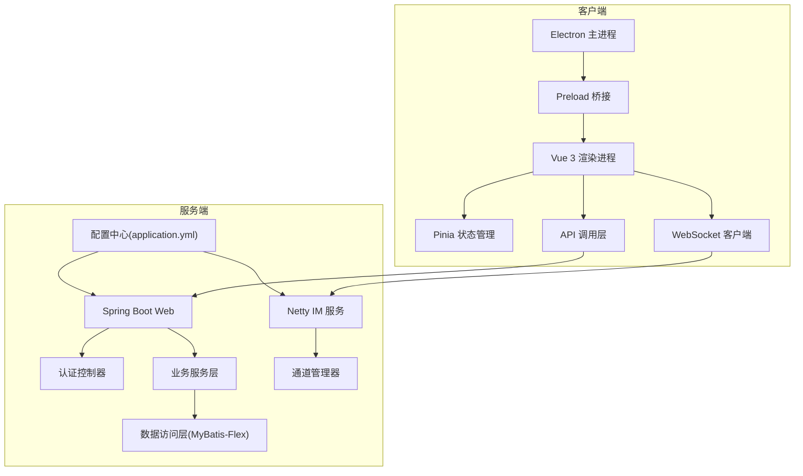
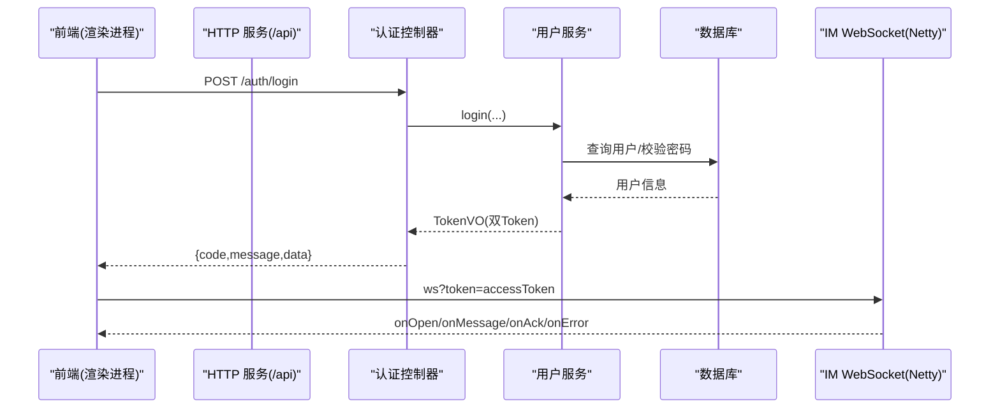
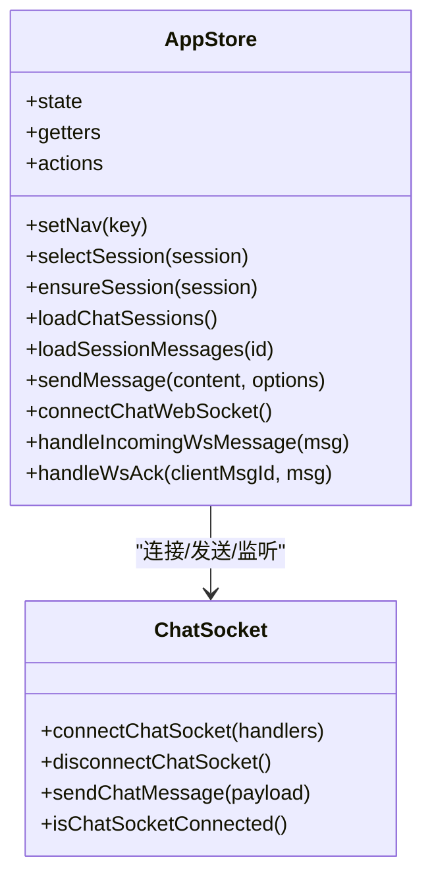
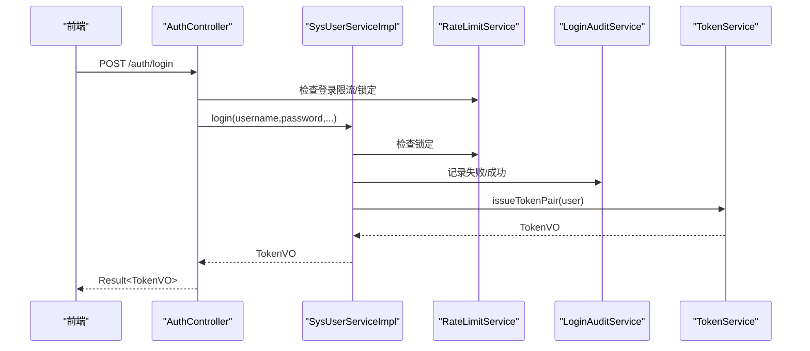
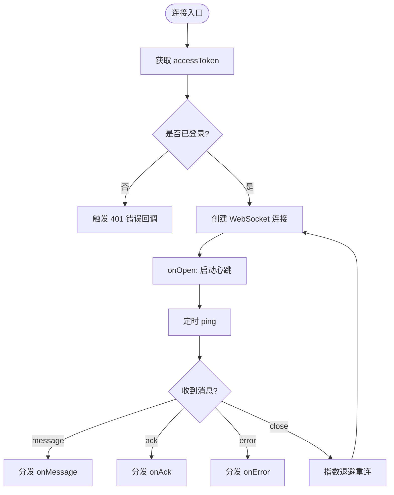
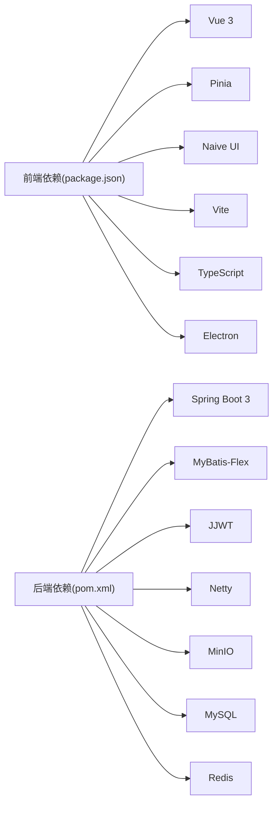

# 开发指南

<cite>
**本文引用的文件**   
- [README.md](file://README.md)
- [linkx-client/package.json](file://linkx-client/package.json)
- [linkx-client/tsconfig.json](file://linkx-client/tsconfig.json)
- [linkx-server/pom.xml](file://linkx-server/pom.xml)
- [linkx-server/src/main/resources/application.yml](file://linkx-server/src/main/resources/application.yml)
- [linkx-server/src/main/resources/application-local.yml.example](file://linkx-server/src/main/resources/application-local.yml.example)
- [linkx-client/src/types/index.ts](file://linkx-client/src/types/index.ts)
- [linkx-client/src/utils/chatSocket.ts](file://linkx-client/src/utils/chatSocket.ts)
- [linkx-client/src/stores/app.ts](file://linkx-client/src/stores/app.ts)
- [linkx-client/src/api/auth.ts](file://linkx-client/src/api/auth.ts)
- [linkx-server/src/main/java/com/linkx/server/common/Result.java](file://linkx-server/src/main/java/com/linkx/server/common/Result.java)
- [linkx-server/src/main/java/com/linkx/server/exception/GlobalExceptionHandler.java](file://linkx-server/src/main/java/com/linkx/server/exception/GlobalExceptionHandler.java)
- [linkx-server/src/main/java/com/linkx/server/controller/AuthController.java](file://linkx-server/src/main/java/com/linkx/server/controller/AuthController.java)
- [linkx-server/src/main/java/com/linkx/server/service/impl/SysUserServiceImpl.java](file://linkx-server/src/main/java/com/linkx/server/service/impl/SysUserServiceImpl.java)
- [linkx-server/src/main/java/com/linkx/server/im/ImWebSocketServer.java](file://linkx-server/src/main/java/com/linkx/server/im/ImWebSocketServer.java)
</cite>

## 目录
1. [简介](#简介)
2. [项目结构](#项目结构)
3. [核心组件](#核心组件)
4. [架构总览](#架构总览)
5. [详细组件分析](#详细组件分析)
6. [依赖分析](#依赖分析)
7. [性能考虑](#性能考虑)
8. [故障排查指南](#故障排查指南)
9. [结论](#结论)
10. [附录](#附录)

## 简介
本指南面向 LinkX 项目的开发者与贡献者，覆盖代码规范、命名约定、提交规范、分支管理策略；前后端环境搭建与调试技巧；测试策略与代码审查流程；常见问题排查、性能优化建议与最佳实践。文档同时涵盖 TypeScript 类型定义、Java 编码规范、Git 工作流与协作流程，帮助新加入的开发者快速上手并高效协作。

## 项目结构
LinkX 采用前后端分离的单体工程组织方式：
- 前端 linkx-client：基于 Vue 3 + Electron（主进程 + 渲染进程），使用 Pinia 做状态管理，UnoCSS 原子化样式，Naive UI 组件库。
- 后端 linkx-server：Spring Boot 3 单体应用，集成 MyBatis-Flex、Redis、MySQL、Netty WebSocket、MinIO 对象存储等。

图表来源
- [linkx-client/package.json:1-62](file://linkx-client/package.json#L1-L62)
- [linkx-server/pom.xml:1-145](file://linkx-server/pom.xml#L1-L145)
- [linkx-server/src/main/resources/application.yml:1-54](file://linkx-server/src/main/resources/application.yml#L1-L54)

章节来源
- [README.md:1-342](file://README.md#L1-L342)
- [linkx-client/package.json:1-62](file://linkx-client/package.json#L1-L62)
- [linkx-server/pom.xml:1-145](file://linkx-server/pom.xml#L1-L145)

## 核心组件
- 统一响应体 Result<T>：前后端统一的 JSON 响应格式，包含 code、message、data。
- 全局异常处理 GlobalExceptionHandler：将自定义异常、参数校验异常、未知异常映射为统一 Result。
- 认证控制器 AuthController：提供验证码、注册、登录、刷新令牌、登出接口。
- 用户服务 SysUserServiceImpl：实现注册、登录、资料更新、头像更新等核心逻辑。
- IM WebSocket 服务 ImWebSocketServer：独立 Netty 端口提供实时消息能力。
- 前端聊天 Socket 封装 chatSocket.ts：连接、心跳、重连、发送消息、事件回调。
- 前端核心 Store app.ts：会话、消息、鉴权、主题、锁屏、通知等全局状态与业务编排。
- 前端 API 模块 auth.ts：封装认证相关 HTTP 请求。
- 前端类型定义 types/index.ts：会话、消息、联系人、收藏等核心类型。

章节来源
- [linkx-server/src/main/java/com/linkx/server/common/Result.java:1-95](file://linkx-server/src/main/java/com/linkx/server/common/Result.java#L1-L95)
- [linkx-server/src/main/java/com/linkx/server/exception/GlobalExceptionHandler.java:1-53](file://linkx-server/src/main/java/com/linkx/server/exception/GlobalExceptionHandler.java#L1-L53)
- [linkx-server/src/main/java/com/linkx/server/controller/AuthController.java:1-84](file://linkx-server/src/main/java/com/linkx/server/controller/AuthController.java#L1-L84)
- [linkx-server/src/main/java/com/linkx/server/service/impl/SysUserServiceImpl.java:1-175](file://linkx-server/src/main/java/com/linkx/server/service/impl/SysUserServiceImpl.java#L1-L175)
- [linkx-server/src/main/java/com/linkx/server/im/ImWebSocketServer.java:1-82](file://linkx-server/src/main/java/com/linkx/server/im/ImWebSocketServer.java#L1-L82)
- [linkx-client/src/utils/chatSocket.ts:1-144](file://linkx-client/src/utils/chatSocket.ts#L1-L144)
- [linkx-client/src/stores/app.ts:1-800](file://linkx-client/src/stores/app.ts#L1-L800)
- [linkx-client/src/api/auth.ts:1-25](file://linkx-client/src/api/auth.ts#L1-L25)
- [linkx-client/src/types/index.ts:1-129](file://linkx-client/src/types/index.ts#L1-L129)

## 架构总览
系统由“桌面客户端 + Spring Boot 单体后端 + Netty IM 服务”组成。前端通过 HTTP 进行认证与会话管理，通过 WebSocket 进行实时消息收发；后端通过 Redis 缓存令牌与限流信息，通过 MySQL 持久化用户与会话数据，通过 MinIO 存储文件资源。

图表来源
- [linkx-client/src/api/auth.ts:1-25](file://linkx-client/src/api/auth.ts#L1-L25)
- [linkx-server/src/main/java/com/linkx/server/controller/AuthController.java:1-84](file://linkx-server/src/main/java/com/linkx/server/controller/AuthController.java#L1-L84)
- [linkx-server/src/main/java/com/linkx/server/service/impl/SysUserServiceImpl.java:1-175](file://linkx-server/src/main/java/com/linkx/server/service/impl/SysUserServiceImpl.java#L1-L175)
- [linkx-client/src/utils/chatSocket.ts:1-144](file://linkx-client/src/utils/chatSocket.ts#L1-L144)
- [linkx-server/src/main/java/com/linkx/server/im/ImWebSocketServer.java:1-82](file://linkx-server/src/main/java/com/linkx/server/im/ImWebSocketServer.java#L1-L82)

## 详细组件分析

### 前端类型系统与状态管理
- 类型定义集中在 src/types/index.ts，包括会话、消息、联系人、收藏、应用等核心实体，确保前后端交互的类型安全。
- 核心状态集中在 stores/app.ts，负责导航、会话列表、消息历史、登录态、主题、锁屏、通知等，并通过 actions 编排业务逻辑（如拉取会话、加载历史、发送消息、WebSocket 连接与消息处理）。

图表来源
- [linkx-client/src/stores/app.ts:1-800](file://linkx-client/src/stores/app.ts#L1-L800)
- [linkx-client/src/utils/chatSocket.ts:1-144](file://linkx-client/src/utils/chatSocket.ts#L1-L144)
- [linkx-client/src/types/index.ts:1-129](file://linkx-client/src/types/index.ts#L1-L129)

章节来源
- [linkx-client/src/types/index.ts:1-129](file://linkx-client/src/types/index.ts#L1-L129)
- [linkx-client/src/stores/app.ts:1-800](file://linkx-client/src/stores/app.ts#L1-L800)

### 认证与安全流程
- 前端通过 api/auth.ts 调用 /auth/captcha、/auth/login、/auth/refresh、/auth/logout。
- 后端 AuthController 接收请求，必要时校验验证码，调用 SysUserService 完成注册/登录/刷新/登出。
- SysUserServiceImpl 实现 BCrypt 密码校验、账号锁定与限流、审计记录、双 Token 签发。
- 全局异常处理器将业务异常与参数校验异常转换为统一 Result 返回码。

图表来源
- [linkx-client/src/api/auth.ts:1-25](file://linkx-client/src/api/auth.ts#L1-L25)
- [linkx-server/src/main/java/com/linkx/server/controller/AuthController.java:1-84](file://linkx-server/src/main/java/com/linkx/server/controller/AuthController.java#L1-L84)
- [linkx-server/src/main/java/com/linkx/server/service/impl/SysUserServiceImpl.java:1-175](file://linkx-server/src/main/java/com/linkx/server/service/impl/SysUserServiceImpl.java#L1-L175)
- [linkx-server/src/main/java/com/linkx/server/exception/GlobalExceptionHandler.java:1-53](file://linkx-server/src/main/java/com/linkx/server/exception/GlobalExceptionHandler.java#L1-L53)

章节来源
- [linkx-client/src/api/auth.ts:1-25](file://linkx-client/src/api/auth.ts#L1-L25)
- [linkx-server/src/main/java/com/linkx/server/controller/AuthController.java:1-84](file://linkx-server/src/main/java/com/linkx/server/controller/AuthController.java#L1-L84)
- [linkx-server/src/main/java/com/linkx/server/service/impl/SysUserServiceImpl.java:1-175](file://linkx-server/src/main/java/com/linkx/server/service/impl/SysUserServiceImpl.java#L1-L175)
- [linkx-server/src/main/java/com/linkx/server/exception/GlobalExceptionHandler.java:1-53](file://linkx-server/src/main/java/com/linkx/server/exception/GlobalExceptionHandler.java#L1-L53)

### IM WebSocket 通信
- 前端 chatSocket.ts 负责建立连接、心跳保活、指数退避重连、消息发送与回调分发。
- 后端 ImWebSocketServer 在独立端口启动 Netty 服务，按配置路径处理握手与消息路由。

图表来源
- [linkx-client/src/utils/chatSocket.ts:1-144](file://linkx-client/src/utils/chatSocket.ts#L1-L144)
- [linkx-server/src/main/java/com/linkx/server/im/ImWebSocketServer.java:1-82](file://linkx-server/src/main/java/com/linkx/server/im/ImWebSocketServer.java#L1-L82)

章节来源
- [linkx-client/src/utils/chatSocket.ts:1-144](file://linkx-client/src/utils/chatSocket.ts#L1-L144)
- [linkx-server/src/main/java/com/linkx/server/im/ImWebSocketServer.java:1-82](file://linkx-server/src/main/java/com/linkx/server/im/ImWebSocketServer.java#L1-L82)

### 前后端数据契约与类型对齐
- 后端统一响应体 Result<T> 约定 code/message/data 字段，前端据此解析业务结果。
- 前端类型定义 ChatSession、ChatMessage 等与后端 VO/DTO 保持语义一致，便于状态管理与视图渲染。

章节来源
- [linkx-server/src/main/java/com/linkx/server/common/Result.java:1-95](file://linkx-server/src/main/java/com/linkx/server/common/Result.java#L1-L95)
- [linkx-client/src/types/index.ts:1-129](file://linkx-client/src/types/index.ts#L1-L129)

## 依赖分析
- 前端依赖：Vue 3、Pinia、Naive UI、Vite、TypeScript、Electron、electron-builder、UnoCSS 等。
- 后端依赖：Spring Boot 3、MyBatis-Flex、JJWT、Netty、BCrypt、MinIO、MySQL、Redis 等。

图表来源
- [linkx-client/package.json:1-62](file://linkx-client/package.json#L1-L62)
- [linkx-server/pom.xml:1-145](file://linkx-server/pom.xml#L1-L145)

章节来源
- [linkx-client/package.json:1-62](file://linkx-client/package.json#L1-L62)
- [linkx-server/pom.xml:1-145](file://linkx-server/pom.xml#L1-L145)

## 性能考虑
- 前端
  - 使用 storeToRefs 读取响应式状态，避免不必要的计算与重复订阅。
  - 消息历史分页加载，结合 messagesLoaded/messagesHasMore/messagesLoading 控制增量与去重。
  - WebSocket 心跳与指数退避重连降低无效连接与抖动。
- 后端
  - 登录防时间侧信道攻击，固定耗时操作避免泄露用户存在性。
  - 限流与锁定保护关键接口，防止暴力破解与滥用。
  - 文件上传前校验大小与类型，减少无效 IO 与存储压力。
  - 合理配置 CORS 与 HTTPS 强制，减少跨域开销与安全风险。

[本节为通用指导，不直接分析具体文件]

## 故障排查指南
- 认证问题
  - 确认环境变量 JWT_SECRET、DB_PASSWORD、REDIS_PASSWORD 正确配置。
  - 检查 application.yml 中 linkx.cors.allowed-origins 是否包含前端地址。
  - 查看 GlobalExceptionHandler 日志定位业务异常或参数校验失败。
- WebSocket 连接失败
  - 确认 IM 端口与路径配置，检查防火墙与代理设置。
  - 前端未登录时无法连接，需先完成登录并获取 accessToken。
  - 观察心跳与重连日志，定位网络波动或服务端异常。
- 构建与打包
  - 前端 build 命令包含 TypeScript 严格检查，修复类型错误后再打包。
  - Electron 打包输出至 release 目录，检查 electron-builder 配置与平台目标。

章节来源
- [linkx-server/src/main/resources/application.yml:1-54](file://linkx-server/src/main/resources/application.yml#L1-L54)
- [linkx-server/src/main/java/com/linkx/server/exception/GlobalExceptionHandler.java:1-53](file://linkx-server/src/main/java/com/linkx/server/exception/GlobalExceptionHandler.java#L1-L53)
- [linkx-client/src/utils/chatSocket.ts:1-144](file://linkx-client/src/utils/chatSocket.ts#L1-L144)
- [linkx-client/package.json:1-62](file://linkx-client/package.json#L1-L62)

## 结论
LinkX 以清晰的模块化设计与严格的类型约束为基础，结合统一响应体与全局异常处理，形成稳定的前后端契约。通过 WebSocket 实现实时消息能力，配合限流、锁定与审计机制保障安全性。遵循本文的开发规范与最佳实践，可显著提升团队协作效率与交付质量。

[本节为总结性内容，不直接分析具体文件]

## 附录

### 开发环境与工具链
- Node.js >= 18.x（推荐 22.x），npm >= 9.x。
- Java 21，Maven 构建。
- Docker Compose 一键启动中间件（MySQL、Redis、MinIO）。

章节来源
- [README.md:100-142](file://README.md#L100-L142)
- [linkx-server/pom.xml:1-145](file://linkx-server/pom.xml#L1-L145)

### 环境变量与配置
- 后端
  - 必填：JWT_SECRET、DB_PASSWORD、REDIS_PASSWORD。
  - 可选：CAPTCHA_ENABLED、REQUIRE_HTTPS、SPRING_PROFILES_ACTIVE。
  - 本地开发复制 application-local.yml.example 为 application-local.yml。
- 前端
  - .env 中配置 VITE_API_BASE_URL 指向后端 /api。

章节来源
- [README.md:54-73](file://README.md#L54-L73)
- [linkx-server/src/main/resources/application.yml:1-54](file://linkx-server/src/main/resources/application.yml#L1-L54)
- [linkx-server/src/main/resources/application-local.yml.example:1-33](file://linkx-server/src/main/resources/application-local.yml.example#L1-L33)

### TypeScript 类型与严格模式
- tsconfig.json 启用 strict、noUnusedLocals、noUnusedParameters、noFallthroughCases in Switch。
- 所有业务实体类型集中于 src/types/index.ts，保持前后端一致性。

章节来源
- [linkx-client/tsconfig.json:1-22](file://linkx-client/tsconfig.json#L1-L22)
- [linkx-client/src/types/index.ts:1-129](file://linkx-client/src/types/index.ts#L1-L129)

### Java 编码规范
- 统一响应体 Result<T> 作为所有接口返回值。
- 使用 @RestControllerAdvice 集中处理异常，返回标准 Result。
- 密码使用 BCrypt 加密，登录过程防御时间侧信道攻击。
- 使用 MyBatis-Flex 简化数据访问，逻辑删除列统一配置。

章节来源
- [linkx-server/src/main/java/com/linkx/server/common/Result.java:1-95](file://linkx-server/src/main/java/com/linkx/server/common/Result.java#L1-L95)
- [linkx-server/src/main/java/com/linkx/server/exception/GlobalExceptionHandler.java:1-53](file://linkx-server/src/main/java/com/linkx/server/exception/GlobalExceptionHandler.java#L1-L53)
- [linkx-server/src/main/java/com/linkx/server/service/impl/SysUserServiceImpl.java:1-175](file://linkx-server/src/main/java/com/linkx/server/service/impl/SysUserServiceImpl.java#L1-L175)
- [linkx-server/src/main/resources/application.yml:1-54](file://linkx-server/src/main/resources/application.yml#L1-L54)

### Git 工作流与协作
- 提交规范：遵循 Conventional Commits，提交信息使用中文描述。
- 分支策略：建议使用 feature/* 功能分支、hotfix/* 热修复分支，合并到 main 前进行代码审查与 CI 检查。
- 代码审查：关注类型安全、异常处理、限流与审计、安全配置与敏感信息隔离。

章节来源
- [README.md:317-325](file://README.md#L317-L325)

### 调试技巧
- 前端
  - Web 开发模式：npm run dev。
  - Electron 开发模式：npm run electron:dev。
  - 使用浏览器 DevTools 与 Electron 开发者工具联合调试。
- 后端
  - 通过 IDE 运行 LinkXServerApplication，结合日志与断点定位问题。
  - 使用 docker-compose up -d 启动中间件，验证数据库、Redis、MinIO 连通性。

章节来源
- [README.md:110-142](file://README.md#L110-L142)
- [linkx-client/package.json:1-62](file://linkx-client/package.json#L1-L62)

### 测试策略
- 单元测试：对核心服务方法（如注册、登录、资料更新）编写单测，覆盖边界条件与异常路径。
- 集成测试：对认证链路、WebSocket 握手与消息收发进行端到端验证。
- 自动化：后续接入 CI/CD 流水线，执行 lint、类型检查、构建与测试用例。

[本节为通用指导，不直接分析具体文件]

### 代码审查清单
- 类型与契约
  - 前端类型是否与后端 DTO/VO 保持一致？
  - Result<T> 的 code/message/data 是否被正确处理？
- 安全与健壮性
  - 是否启用限流与锁定？是否记录审计日志？
  - 敏感配置是否通过环境变量注入？
- 性能与体验
  - 消息历史是否分页加载与去重？
  - WebSocket 是否具备心跳与重连机制？
- 可维护性
  - 是否遵循统一异常处理与错误提示？
  - 是否避免在 composable 中使用模块级 ref 管理全局状态？

[本节为通用指导，不直接分析具体文件]