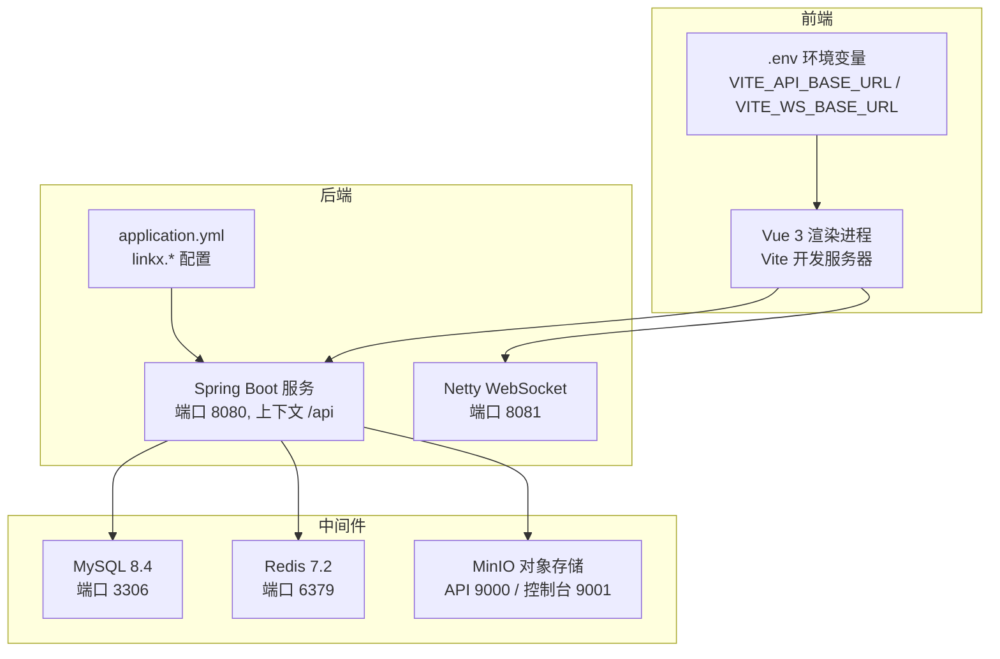

# 快速开始

<cite>
**本文引用的文件**   
- [README.md](file://README.md)
- [pom.xml](file://linkx-server/pom.xml)
- [application.yml](file://linkx-server/src/main/resources/application.yml)
- [application-local.yml.example](file://linkx-server/src/main/resources/application-local.yml.example)
- [docker-compose.yml](file://linkx-server/docker-compose.yml)
- [init.sql](file://linkx-server/init.sql)
- [LinkXServerApplication.java](file://linkx-server/src/main/java/com/linkx/server/LinkXServerApplication.java)
- [package.json](file://linkx-client/package.json)
- [.env.example](file://linkx-client/.env.example)
- [main.ts](file://linkx-client/src/main.ts)
</cite>

## 目录
1. [简介](#简介)
2. [环境要求与前置依赖](#环境要求与前置依赖)
3. [项目克隆与初始化](#项目克隆与初始化)
4. [数据库与中间件准备](#数据库与中间件准备)
5. [后端服务启动](#后端服务启动)
6. [前端服务启动](#前端服务启动)
7. [验证与测试](#验证与测试)
8. [常见问题排查](#常见问题排查)
9. [架构概览](#架构概览)
10. [结论](#结论)

## 简介
本指南面向新开发者，提供从零到运行的完整路径，涵盖 Node.js、Java 21、MySQL 8.0、Redis 等前置依赖的安装配置；以及项目克隆、数据库初始化、配置文件设置、前后端服务启动的完整流程。同时包含常见环境问题的排查解决方案和验证测试方法，帮助你在最短时间内成功运行 LinkX 项目。

## 环境要求与前置依赖
- Node.js：>= 18.x（推荐 22.x）
- npm：>= 9.x
- Java：21（后端使用 Spring Boot 3.3.0，需 Java 21）
- Docker 与 docker-compose：用于一键拉起 MySQL、Redis、MinIO
- 操作系统：Windows 10+ / macOS / Linux

说明：
- 后端通过环境变量读取数据库、Redis、JWT 等敏感配置，避免硬编码。
- 前端默认通过 Vite 开发服务器运行，Electron 桌面模式也可用。

章节来源
- [README.md:100-108](file://README.md#L100-L108)
- [pom.xml:19-24](file://linkx-server/pom.xml#L19-L24)

## 项目克隆与初始化
- 克隆仓库后，进入前端工程目录安装依赖：
  - 命令参考：cd linkx-client && npm install
- 如需本地覆盖默认配置，复制示例配置为实际配置文件：
  - 后端：复制 application-local.yml.example 为 application-local.yml
  - 前端：复制 .env.example 为 .env（若不存在）

章节来源
- [README.md:114-141](file://README.md#L114-L141)
- [application-local.yml.example:1-4](file://linkx-server/src/main/resources/application-local.yml.example#L1-L4)
- [.env.example:1-6](file://linkx-client/.env.example#L1-L6)

## 数据库与中间件准备
推荐使用 docker-compose 一键启动 MySQL、Redis、MinIO：
- 在 linkx-server 目录下执行：docker-compose up -d
- 该编排会：
  - 创建并初始化 linkx 数据库（挂载 init.sql）
  - 启动 Redis（启用密码保护与持久化）
  - 启动 MinIO（对象存储，控制台端口 9001）

注意：
- 首次启动时，MySQL 容器会自动执行 init.sql 完成建库建表。
- 若需要手动初始化，可登录 MySQL 后执行 init.sql。

章节来源
- [docker-compose.yml:1-48](file://linkx-server/docker-compose.yml#L1-L48)
- [init.sql:1-131](file://linkx-server/init.sql#L1-L131)

## 后端服务启动
- 确保已启动中间件（MySQL、Redis、MinIO）。
- 配置环境变量或 application-local.yml：
  - 必须设置：JWT_SECRET、DB_PASSWORD、REDIS_PASSWORD
  - 可选设置：CAPTCHA_ENABLED、REQUIRE_HTTPS、SPRING_PROFILES_ACTIVE
- 通过 IDE 直接运行主类 LinkXServerApplication，或使用 Maven/Spring Boot 插件启动。
- 应用启动时会校验 JWT Secret 长度与格式，不满足要求将抛出异常并阻止启动。

关键配置项（来自 application.yml）：
- server.context-path=/api
- spring.profiles.active=${SPRING_PROFILES_ACTIVE:local}
- datasource.url 使用 DB_HOST/DB_PORT/DB_USERNAME/DB_PASSWORD 环境变量
- data.redis.host/port/password 使用 REDIS_* 环境变量
- linkx.jwt.secret 使用 JWT_SECRET 环境变量
- linkx.cors.allowed-origins 允许前端开发地址
- linkx.im.websocket-port=8081（Netty WebSocket 端口）
- linkx.minio.endpoint/access-key/secret-key/bucket-name/max-file-size

章节来源
- [application.yml:1-54](file://linkx-server/src/main/resources/application.yml#L1-L54)
- [application-local.yml.example:12-33](file://linkx-server/src/main/resources/application-local.yml.example#L12-L33)
- [LinkXServerApplication.java:26-43](file://linkx-server/src/main/java/com/linkx/server/LinkXServerApplication.java#L26-L43)
- [LinkXServerApplication.java:49-95](file://linkx-server/src/main/java/com/linkx/server/LinkXServerApplication.java#L49-L95)

## 前端服务启动
- 在 linkx-client 目录下安装依赖后，选择以下任一方式启动：
  - Web 开发模式：npm run dev
  - Electron 桌面开发模式：npm run electron:dev
- 前端通过环境变量 VITE_API_BASE_URL 指向后端 API（含 context-path /api），例如 http://localhost:8080/api。
- 如需连接 IM WebSocket，设置 VITE_WS_BASE_URL=ws://localhost:8081。

章节来源
- [README.md:121-131](file://README.md#L121-L131)
- [.env.example:1-6](file://linkx-client/.env.example#L1-L6)
- [package.json:8-15](file://linkx-client/package.json#L8-L15)
- [main.ts:37-63](file://linkx-client/src/main.ts#L37-L63)

## 验证与测试
- 后端健康检查：
  - 访问 http://localhost:8080/api（确认上下文路径生效）
  - 查看日志中“LinkX 单体后端服务启动成功”提示
- 认证接口验证（示例）：
  - 注册/登录接口返回双 Token（Access Token + Refresh Token）
  - 自动登录：勾选「自动登录」后，启动时用 Refresh Token 换票
- 前端联调：
  - 打开浏览器访问 http://localhost:5173（Vite 默认端口）
  - 尝试登录，观察是否成功获取 Token 并调用后端接口
- IM WebSocket：
  - 确认 Netty 监听 8081 端口
  - 前端连接 ws://localhost:8081 进行消息收发测试

章节来源
- [README.md:43-74](file://README.md#L43-L74)
- [application.yml:1-10](file://linkx-server/src/main/resources/application.yml#L1-L10)
- [LinkXServerApplication.java:37-42](file://linkx-server/src/main/java/com/linkx/server/LinkXServerApplication.java#L37-L42)

## 常见问题排查
- 无法连接数据库：
  - 检查 MySQL 容器是否启动成功，端口 3306 是否被占用
  - 确认 DB_PASSWORD 与 docker-compose.yml 中的 MYSQL_ROOT_PASSWORD 一致
  - 确认 init.sql 已成功执行（查看容器日志）
- Redis 连接失败：
  - 检查 REDIS_PASSWORD 是否与 docker-compose.yml 中 requirepass 一致
  - 确认端口 6379 未被占用
- JWT 启动失败：
  - 确保 JWT_SECRET 环境变量存在且长度至少 32 字节
  - 应用启动时会校验密钥强度，弱密钥会发出警告但仍可能启动
- CORS 跨域问题：
  - 确认 linkx.cors.allowed-origins 包含前端开发地址（http://localhost:5173 或 http://127.0.0.1:5173）
- 前端无法访问后端：
  - 检查 .env 中 VITE_API_BASE_URL 是否正确（含 /api）
  - 确认后端服务已启动且端口 8080 可用
- IM WebSocket 不可用：
  - 确认 linkx.im.websocket-port=8081 未被占用
  - 前端 VITE_WS_BASE_URL 设置为 ws://localhost:8081

章节来源
- [application.yml:11-22](file://linkx-server/src/main/resources/application.yml#L11-L22)
- [application.yml:29-45](file://linkx-server/src/main/resources/application.yml#L29-L45)
- [docker-compose.yml:4-32](file://linkx-server/docker-compose.yml#L4-L32)
- [LinkXServerApplication.java:58-95](file://linkx-server/src/main/java/com/linkx/server/LinkXServerApplication.java#L58-L95)
- [.env.example:1-6](file://linkx-client/.env.example#L1-L6)

## 架构概览
下图展示了前后端与中间件的交互关系，包括 HTTP API、WebSocket、数据库与对象存储。

图表来源
- [application.yml:1-54](file://linkx-server/src/main/resources/application.yml#L1-L54)
- [docker-compose.yml:1-48](file://linkx-server/docker-compose.yml#L1-L48)
- [.env.example:1-6](file://linkx-client/.env.example#L1-L6)

## 结论
按照本指南完成环境准备、依赖安装、配置设置与服务启动后，即可在本地运行 LinkX 的前后端服务并进行联调。建议优先使用 docker-compose 管理中间件，并通过环境变量注入敏感配置，保证开发与生产的一致性。遇到问题时，结合日志与配置逐项排查，通常可以快速定位并解决。