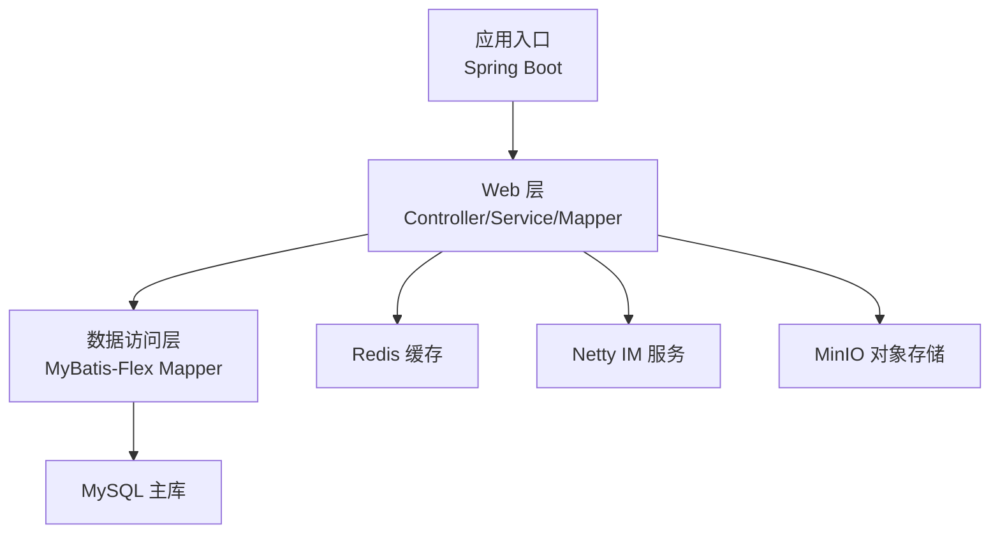
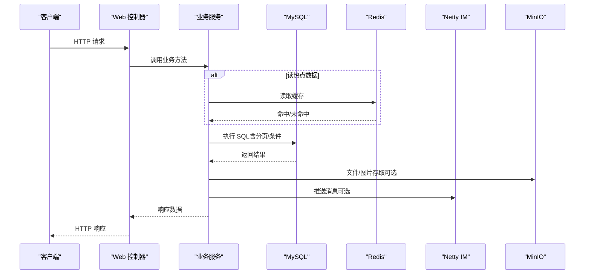
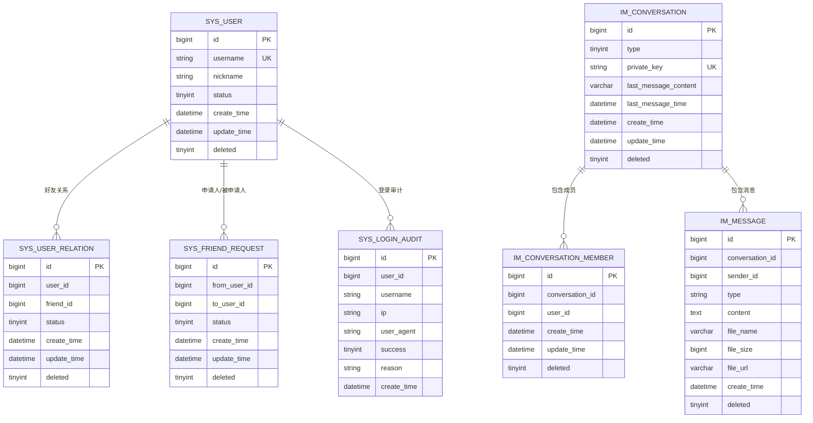
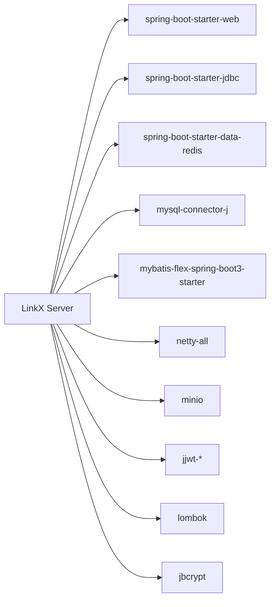

# 性能优化策略

<cite>
**本文引用的文件**   
- [application.yml](file://linkx-server/src/main/resources/application.yml)
- [application-local.yml](file://linkx-server/src/main/resources/application-local.yml)
- [application-test.yml](file://linkx-server/src/test/resources/application-test.yml)
- [pom.xml](file://linkx-server/pom.xml)
- [init.sql](file://linkx-server/init.sql)
- [SysUserMapper.java](file://linkx-server/src/main/java/com/linkx/server/mapper/SysUserMapper.java)
- [ImMessageMapper.java](file://linkx-server/src/main/java/com/linkx/server/mapper/ImMessageMapper.java)
</cite>

## 目录
1. [引言](#引言)
2. [项目结构](#项目结构)
3. [核心组件](#核心组件)
4. [架构总览](#架构总览)
5. [详细组件分析](#详细组件分析)
6. [依赖分析](#依赖分析)
7. [性能考虑](#性能考虑)
8. [故障排查指南](#故障排查指南)
9. [结论](#结论)
10. [附录](#附录)

## 引言
本文件面向 LinkX 数据库性能优化，聚焦于查询优化、索引设计、慢查询分析、连接池配置、缓存与内存管理、分库分表与读写分离、负载均衡等主题。文档基于仓库现有配置与数据模型进行落地化建议，并提供可操作的监控指标与调优案例路径，帮助读者快速定位瓶颈并实施改进。

## 项目结构
后端采用 Spring Boot + MyBatis-Flex + MySQL + Redis 的单体架构，IM 消息通过 Netty WebSocket 服务处理，对象存储使用 MinIO。数据库初始化脚本定义了用户、好友关系、会话、消息、登录审计等核心表结构；应用配置文件提供数据源、Redis、JWT、CORS、MinIO 等运行时参数。

图表来源
- [application.yml:1-54](file://linkx-server/src/main/resources/application.yml#L1-L54)
- [pom.xml:26-142](file://linkx-server/pom.xml#L26-L142)

章节来源
- [application.yml:1-54](file://linkx-server/src/main/resources/application.yml#L1-L54)
- [pom.xml:1-168](file://linkx-server/pom.xml#L1-L168)

## 核心组件
- 数据源与连接池：通过 spring-boot-starter-jdbc 自动装配 HikariCP，默认连接池由 Spring Boot 管理，可在 application.yml 中扩展自定义参数。
- ORM 与 SQL 生成：MyBatis-Flex 提供 BaseMapper 与链式查询能力，减少手写 SQL 的同时需关注生成的 SQL 是否命中索引。
- 缓存：集成 spring-boot-starter-data-redis，用于验证码、限流、会话或热点数据缓存。
- IM 通道：Netty 独立端口监听，消息落库走 JDBC 事务。
- 对象存储：MinIO 用于图片/文件上传下载，避免大对象进入数据库。

章节来源
- [application.yml:11-22](file://linkx-server/src/main/resources/application.yml#L11-L22)
- [pom.xml:45-63](file://linkx-server/pom.xml#L45-L63)
- [pom.xml:84-89](file://linkx-server/pom.xml#L84-L89)
- [pom.xml:105-110](file://linkx-server/pom.xml#L105-L110)

## 架构总览
下图展示请求从 Web 到数据库/缓存/IM 的主要路径，便于理解性能关键路径与潜在瓶颈点。

图表来源
- [application.yml:1-54](file://linkx-server/src/main/resources/application.yml#L1-L54)
- [pom.xml:26-142](file://linkx-server/pom.xml#L26-L142)

## 详细组件分析

### 数据模型与索引现状
当前 init.sql 已为高频查询场景建立必要索引，覆盖以下典型模式：
- 用户唯一性校验：用户名唯一键
- 好友关系：按 user_id/friend_id 查询及联合唯一约束
- 好友申请：按 to_user_id+status 复合索引，支持“待处理”列表
- 会话成员：conversation_id+user_id 联合唯一，user_id 单列索引
- 消息：conversation_id+create_time 复合索引，支撑会话内分页拉取
- 登录审计：username、create_time 索引，便于按账号/时间检索

图表来源
- [init.sql:1-131](file://linkx-server/init.sql#L1-L131)

章节来源
- [init.sql:1-131](file://linkx-server/init.sql#L1-L131)

### 查询优化策略
- 优先使用已有索引：
  - 好友列表：利用 idx_user_id 或 uk_user_friend 组合键
  - 好友申请：利用 idx_to_user_status 过滤“待处理”
  - 会话消息：利用 idx_conv_time 做按会话分页
- 避免全表扫描：
  - 不在 WHERE 中对字段使用函数或隐式类型转换
  - 避免 SELECT *，仅选择必要字段
- 分页与排序：
  - 使用基于时间戳/自增 ID 的游标分页替代深分页
  - 排序字段尽量与索引前缀一致
- 批量操作：
  - 写入类接口（如批量导入好友关系）使用批量插入
- 事务边界：
  - 将只读查询移出事务，缩短事务持有时间

章节来源
- [init.sql:34-47](file://linkx-server/init.sql#L34-L47)
- [init.sql:52-64](file://linkx-server/init.sql#L52-L64)
- [init.sql:100-113](file://linkx-server/init.sql#L100-L113)

### 索引设计原则
- 选择性高的列优先建索引（如 username、to_user_id）
- 复合索引遵循最左前缀原则，将等值条件列放在前面，范围条件列放后面
- 覆盖索引：对高频查询所需字段构建覆盖索引，减少回表
- 控制索引数量：每个表索引不宜过多，避免写放大
- 定期评估无用索引：结合慢查询日志与执行计划清理

章节来源
- [init.sql:27-29](file://linkx-server/init.sql#L27-L29)
- [init.sql:44-46](file://linkx-server/init.sql#L44-L46)
- [init.sql:62-63](file://linkx-server/init.sql#L62-L63)
- [init.sql:93-94](file://linkx-server/init.sql#L93-94)
- [init.sql:112](file://linkx-server/init.sql#L112)

### 慢查询分析方法
- 开启 MySQL 慢查询日志，设置阈值（如 >1s），收集 TOP N 慢 SQL
- 使用 EXPLAIN/EXPLAIN ANALYZE 分析执行计划，关注：
  - type（ALL/idx/range/ref/const）
  - key/key_len/rows/Extra
- 针对热点 SQL 补充或调整索引，必要时改写 SQL
- 在测试环境复现压测，验证优化效果

章节来源
- [init.sql:100-113](file://linkx-server/init.sql#L100-L113)

### 连接池配置与调优
- 默认使用 HikariCP，可通过 application.yml 扩展参数：
  - 最大连接数、最小空闲、连接超时、最大生命周期等
- 根据 QPS 与平均响应时间估算并发连接需求，避免连接耗尽
- 监控连接池状态（活跃连接、等待获取连接线程数）

章节来源
- [application.yml:11-15](file://linkx-server/src/main/resources/application.yml#L11-L15)
- [pom.xml:52-56](file://linkx-server/pom.xml#L52-56)

### 缓存策略与内存管理
- 缓存分层：
  - 本地缓存（小容量、低延迟）+ Redis 分布式缓存
- 热点数据：
  - 用户信息、会话列表、好友关系等短 TTL 缓存
- 一致性：
  - 先更新数据库再删除缓存，或使用延迟双删
- 内存管理：
  - 合理设置 JVM 堆大小与 GC 策略
  - 避免大对象常驻内存，及时释放临时资源

章节来源
- [application.yml:16-21](file://linkx-server/src/main/resources/application.yml#L16-L21)
- [pom.xml:39-43](file://linkx-server/pom.xml#L39-43)

### 分库分表方案
- 水平拆分：
  - 以 user_id 或 conversation_id 作为分片键，将消息与会话成员分散到多实例
- 路由与聚合：
  - 在服务层实现分片路由，跨分片查询需聚合
- 迁移策略：
  - 灰度切流、双写过渡、历史数据分批迁移

章节来源
- [init.sql:85-95](file://linkx-server/init.sql#L85-95)
- [init.sql:100-113](file://linkx-server/init.sql#L100-L113)

### 读写分离配置
- 主库写、从库读：
  - 配置多数据源，按注解或规则路由到从库
- 一致性要求：
  - 强一致场景仍走主库，最终一致场景可走从库
- 延迟容忍：
  - 对读多写少且可容忍秒级延迟的场景启用

章节来源
- [application.yml:11-15](file://linkx-server/src/main/resources/application.yml#L11-L15)

### 负载均衡策略
- 应用层：
  - 多实例部署，配合网关/反向代理轮询或加权
- 连接复用：
  - 合理设置连接池与 HTTP 长连接，降低握手开销
- 限流与熔断：
  - 对热点接口限流，保护下游数据库

章节来源
- [application.yml:1-4](file://linkx-server/src/main/resources/application.yml#L1-L4)

### 代码级数据访问示例路径
- 用户数据访问接口（BaseMapper 能力）
  - [SysUserMapper.java:1-22](file://linkx-server/src/main/java/com/linkx/server/mapper/SysUserMapper.java#L1-L22)
- 消息数据访问接口（BaseMapper 能力）
  - [ImMessageMapper.java:1-10](file://linkx-server/src/main/java/com/linkx/server/mapper/ImMessageMapper.java#L1-L10)

章节来源
- [SysUserMapper.java:1-22](file://linkx-server/src/main/java/com/linkx/server/mapper/SysUserMapper.java#L1-L22)
- [ImMessageMapper.java:1-10](file://linkx-server/src/main/java/com/linkx/server/mapper/ImMessageMapper.java#L1-L10)

## 依赖分析
- 运行时依赖：
  - Spring Boot Web、Validation、JDBC、Data Redis、MySQL Connector、MyBatis-Flex、Netty、MinIO、JWT、Lombok、BCrypt
- 测试依赖：
  - H2 内存数据库、嵌入式 Redis、Spring Boot Test

图表来源
- [pom.xml:26-142](file://linkx-server/pom.xml#L26-L142)

章节来源
- [pom.xml:1-168](file://linkx-server/pom.xml#L1-L168)

## 性能考虑
- 数据库侧
  - 索引命中率、锁等待、缓冲池命中率、慢查询比例
- 连接池侧
  - 活跃连接数、等待获取连接线程数、连接泄漏告警
- 缓存侧
  - 命中率、过期率、内存占用、网络 RTT
- 应用侧
  - CPU/堆内存/GC 频率、线程池队列长度、HTTP 响应 P95/P99
- 外部依赖
  - MinIO IOPS/吞吐、Netty 连接数与背压

[本节为通用指导，不直接分析具体文件]

## 故障排查指南
- 连接池耗尽
  - 现象：获取连接超时、请求堆积
  - 排查：查看连接池监控、SQL 耗时、是否存在长事务
- 缓存穿透/雪崩
  - 现象：大量请求直达数据库、CPU/IO 飙升
  - 排查：检查空值缓存、随机过期、热点 Key 预热
- 慢查询增多
  - 现象：P95/P99 升高、错误率上升
  - 排查：收集慢日志、EXPLAIN 分析、补充索引或改写 SQL
- IM 消息积压
  - 现象：WebSocket 推送延迟、消息入库缓慢
  - 排查：检查 Netty 线程池、DB 写入吞吐、磁盘 IO

章节来源
- [application.yml:11-22](file://linkx-server/src/main/resources/application.yml#L11-L22)
- [application.yml:46-47](file://linkx-server/src/main/resources/application.yml#L46-L47)

## 结论
通过对索引与查询的精细化治理、合理的连接池与缓存配置、以及分库分表与读写分离的渐进式演进，LinkX 可在高并发场景下保持稳定的数据库性能。建议在生产环境持续采集慢查询与系统指标，形成闭环优化机制。

[本节为总结性内容，不直接分析具体文件]

## 附录

### 常用配置项参考（节选）
- 数据源
  - spring.datasource.url / username / password / driver-class-name
- Redis
  - spring.data.redis.host / port / password / database
- MyBatis-Flex
  - mybatis-flex.global-config.logic-delete-column
- 安全与认证
  - linkx.jwt.* / linkx.auth.*
- CORS
  - linkx.cors.allowed-origins
- IM
  - linkx.im.websocket-port
- 对象存储
  - linkx.minio.endpoint / access-key / secret-key / bucket-name / max-file-size

章节来源
- [application.yml:1-54](file://linkx-server/src/main/resources/application.yml#L1-L54)
- [application-local.yml:1-32](file://linkx-server/src/main/resources/application-local.yml#L1-L32)
- [application-test.yml:1-59](file://linkx-server/src/test/resources/application-test.yml#L1-L59)