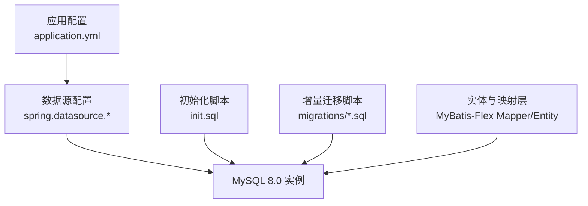
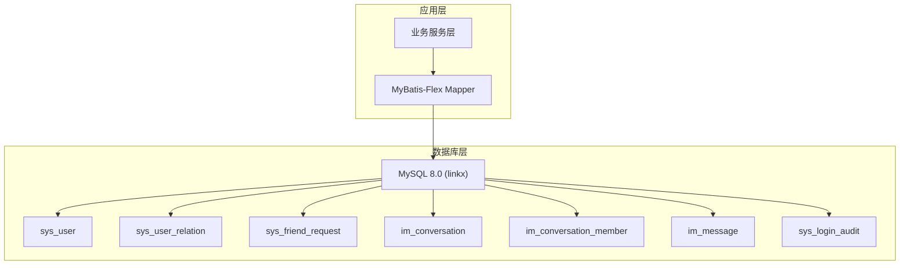
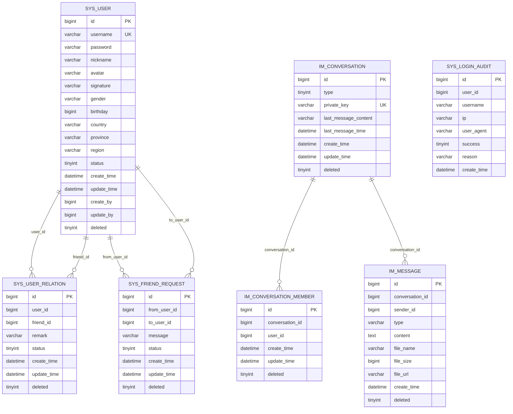
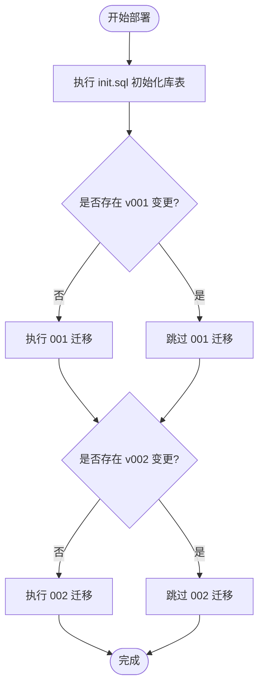
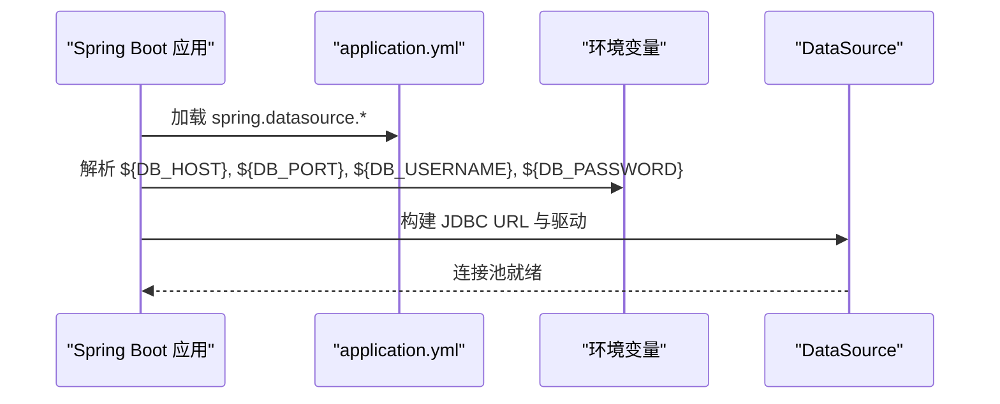
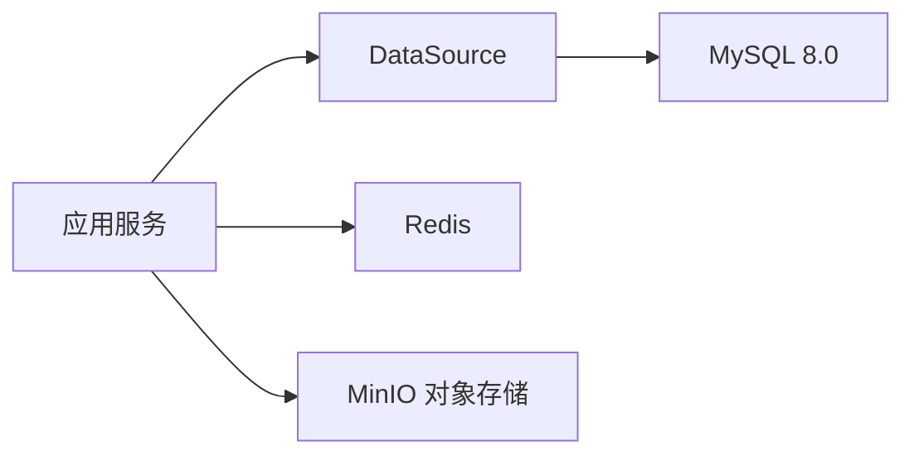

# 数据库架构

<cite>
**本文引用的文件**
- [application.yml](file://linkx-server/src/main/resources/application.yml)
- [application-local.yml.example](file://linkx-server/src/main/resources/application-local.yml.example)
- [application-local.yml](file://linkx-server/src/main/resources/application-local.yml)
- [init.sql](file://linkx-server/init.sql)
- [001_add_user_profile_and_friend_tables.sql](file://linkx-server/migrations/001_add_user_profile_and_friend_tables.sql)
- [002_add_im_tables.sql](file://linkx-server/migrations/002_add_im_tables.sql)
- [LinkxProperties.java](file://linkx-server/src/main/java/com/linkx/server/config/LinkxProperties.java)
</cite>

## 目录
1. [引言](#引言)
2. [项目结构](#项目结构)
3. [核心组件](#核心组件)
4. [架构总览](#架构总览)
5. [详细组件分析](#详细组件分析)
6. [依赖关系分析](#依赖关系分析)
7. [性能考虑](#性能考虑)
8. [故障排查指南](#故障排查指南)
9. [结论](#结论)
10. [附录](#附录)

## 引言
本设计文档面向 LinkX 的数据库设计与运维，目标包括：
- 明确整体数据库设计原则、表结构组织策略与命名规范
- 说明 MySQL 8.0 的配置优化要点（字符集 utf8mb4、存储引擎 InnoDB、连接池参数）
- 给出分库分表策略、读写分离方案与备份恢复机制建议
- 提供数据库架构图、性能监控指标与容量规划建议
- 为开发与运维提供可落地的指导

## 项目结构
本项目后端服务使用 Spring Boot + MyBatis-Flex，数据库脚本集中管理于 SQL 迁移文件。数据库初始化与演进通过 init.sql 与 migrations 目录下的版本化脚本完成。

图表来源
- [application.yml:11-15](file://linkx-server/src/main/resources/application.yml#L11-L15)
- [init.sql:1-4](file://linkx-server/init.sql#L1-L4)
- [001_add_user_profile_and_friend_tables.sql:1-4](file://linkx-server/migrations/001_add_user_profile_and_friend_tables.sql#L1-L4)
- [002_add_im_tables.sql:1-4](file://linkx-server/migrations/002_add_im_tables.sql#L1-L4)

章节来源
- [application.yml:1-54](file://linkx-server/src/main/resources/application.yml#L1-L54)
- [init.sql:1-131](file://linkx-server/init.sql#L1-L131)
- [001_add_user_profile_and_friend_tables.sql:1-80](file://linkx-server/migrations/001_add_user_profile_and_friend_tables.sql#L1-L80)
- [002_add_im_tables.sql:1-45](file://linkx-server/migrations/002_add_im_tables.sql#L1-L45)

## 核心组件
- 数据库与字符集
  - 数据库名：linkx
  - 字符集：utf8mb4；排序规则：utf8mb4_unicode_ci
  - 存储引擎：InnoDB
- 核心业务域
  - 用户域：sys_user、sys_user_relation、sys_friend_request
  - IM 域：im_conversation、im_conversation_member、im_message
  - 审计域：sys_login_audit
- 主键策略
  - 所有表主键 BIGINT，注释标注“雪花算法”，用于分布式 ID 生成
- 逻辑删除
  - 全局启用 deleted 字段，配合 MyBatis-Flex 全局配置 logic-delete-column=deleted

章节来源
- [init.sql:1-131](file://linkx-server/init.sql#L1-L131)
- [application.yml:23-27](file://linkx-server/src/main/resources/application.yml#L23-L27)

## 架构总览
下图展示当前单库多表的数据库架构，以及与应用层的交互方式。

图表来源
- [application.yml:11-15](file://linkx-server/src/main/resources/application.yml#L11-L15)
- [init.sql:1-131](file://linkx-server/init.sql#L1-L131)

## 详细组件分析

### 表结构与命名规范
- 命名规范
  - 表名前缀：sys_（系统）、im_（即时消息）
  - 列名采用小写下划线风格，语义清晰
  - 索引命名：uk_*（唯一索引）、idx_*（普通索引）
- 核心表概览
  - sys_user：用户基本信息、状态、时间戳、逻辑删除
  - sys_user_relation：好友关系（双向关系由两条记录表示），含备注与状态
  - sys_friend_request：好友申请流程状态机
  - im_conversation：会话元信息（单聊/群聊），单聊以 private_key 唯一标识
  - im_conversation_member：会话成员关系
  - im_message：消息体（文本/图片/文件等类型），按会话+时间查询
  - sys_login_audit：登录成功/失败审计日志

图表来源
- [init.sql:9-131](file://linkx-server/init.sql#L9-L131)

章节来源
- [init.sql:9-131](file://linkx-server/init.sql#L9-L131)

### 数据模型与索引策略
- 主键与唯一性
  - 所有表主键 BIGINT，基于雪花算法
  - sys_user.username 唯一约束
  - im_conversation.private_key 唯一约束（单聊会话）
  - im_conversation_member(conversation_id, user_id) 唯一约束
- 常用查询索引
  - sys_user_relation(user_id)、(friend_id)
  - sys_friend_request(to_user_id, status)、(from_user_id)
  - im_message(conversation_id, create_time)
- 设计考量
  - 高频查询路径优先建复合索引
  - 避免过度索引导致写入放大
  - 大文本字段（content）不纳入索引

章节来源
- [init.sql:27-131](file://linkx-server/init.sql#L27-L131)

### 数据迁移与版本控制
- 初始化脚本
  - init.sql：创建数据库、核心表及索引
- 增量迁移
  - 001_add_user_profile_and_friend_tables.sql：为 sys_user 补充资料字段，并创建好友相关表
  - 002_add_im_tables.sql：创建 IM 模块三张表
- 幂等性与可重复执行
  - 使用 CREATE TABLE IF NOT EXISTS 与条件判断式 ALTER 语句保证可重复执行

图表来源
- [init.sql:1-4](file://linkx-server/init.sql#L1-L4)
- [001_add_user_profile_and_friend_tables.sql:1-80](file://linkx-server/migrations/001_add_user_profile_and_friend_tables.sql#L1-L80)
- [002_add_im_tables.sql:1-45](file://linkx-server/migrations/002_add_im_tables.sql#L1-L45)

章节来源
- [001_add_user_profile_and_friend_tables.sql:1-80](file://linkx-server/migrations/001_add_user_profile_and_friend_tables.sql#L1-L80)
- [002_add_im_tables.sql:1-45](file://linkx-server/migrations/002_add_im_tables.sql#L1-L45)

### 配置与连接管理
- 数据源配置
  - URL 包含时区 Asia/Shanghai、UTF-8 编码开关
  - 用户名/密码通过环境变量注入
- 本地开发覆盖
  - application-local.yml 与 example 模板提供本地默认值
- 自定义属性
  - LinkxProperties 读取 linkx.* 配置项（JWT、认证、CORS、IM、MinIO 等）

图表来源
- [application.yml:11-15](file://linkx-server/src/main/resources/application.yml#L11-L15)
- [application-local.yml.example:5-10](file://linkx-server/src/main/resources/application-local.yml.example#L5-L10)
- [application-local.yml:4-9](file://linkx-server/src/main/resources/application-local.yml#L4-L9)
- [LinkxProperties.java:12-20](file://linkx-server/src/main/java/com/linkx/server/config/LinkxProperties.java#L12-L20)

章节来源
- [application.yml:11-21](file://linkx-server/src/main/resources/application.yml#L11-L21)
- [application-local.yml.example:5-10](file://linkx-server/src/main/resources/application-local.yml.example#L5-L10)
- [application-local.yml:4-9](file://linkx-server/src/main/resources/application-local.yml#L4-L9)
- [LinkxProperties.java:12-20](file://linkx-server/src/main/java/com/linkx/server/config/LinkxProperties.java#L12-L20)

## 依赖关系分析
- 应用到数据库
  - Spring Boot DataSource 负责连接管理
  - MyBatis-Flex 负责 SQL 映射与逻辑删除
- 外部依赖
  - Redis 用于缓存与会话（非本次重点）
  - MinIO 用于对象存储（文件/图片）

图表来源
- [application.yml:11-21](file://linkx-server/src/main/resources/application.yml#L11-L21)

章节来源
- [application.yml:11-21](file://linkx-server/src/main/resources/application.yml#L11-L21)

## 性能考虑

### MySQL 8.0 配置优化建议
- 字符集与排序规则
  - 统一使用 utf8mb4 与 utf8mb4_unicode_ci，确保表情符号与多语言兼容
- 存储引擎
  - 全部使用 InnoDB，开启事务与行级锁
- 连接池（HikariCP）
  - 根据并发与 CPU 核数设置 maximum-pool-size
  - 合理配置 minimum-idle、connection-timeout、idle-timeout、max-lifetime
- 缓冲与日志
  - innodb_buffer_pool_size 设置为物理内存的 50%-70%
  - innodb_log_file_size 与 innodb_flush_log_at_trx_commit 根据一致性要求调整
- 查询优化
  - 利用覆盖索引减少回表
  - 对热点查询建立复合索引（如 im_message 的会话+时间）
  - 避免在 TEXT 字段上建立索引

### 分库分表策略
- 现状
  - 当前为单库多表，未实现水平拆分
- 建议
  - 按用户维度进行分片：以 user_id 或 conversation_id 作为路由键
  - 消息表 im_message 按时间范围或会话维度进行分区/分表
  - 引入中间件（如 ShardingSphere）或自研路由层，屏蔽分片细节
  - 跨分片查询尽量通过聚合服务或离线报表解决

### 读写分离方案
- 架构
  - 一主多从，应用层通过读写分离中间件或动态数据源切换
- 一致性
  - 强一致场景走主库，读多写少场景走从库
  - 注意主从延迟导致的最终一致性问题

### 备份与恢复
- 全量备份
  - 使用 mysqldump 或 Percona XtraBackup 定期全量备份
- 增量备份
  - 开启 binlog，结合 xtrabackup 增量备份
- 恢复演练
  - 定期在隔离环境验证恢复流程与 RTO/RPO 达标情况

### 容量规划建议
- 估算公式
  - 单条消息约 200-500 字节（含元数据），按日活 DAU×人均消息数×365 估算年增量
- 扩容策略
  - 先垂直扩容（CPU/内存/磁盘 I/O）
  - 再水平扩容（分库分表、冷热分离）
- 冷热分层
  - 历史消息归档至低成本存储或只读节点

[本节为通用指导，无需代码来源]

## 故障排查指南
- 连接问题
  - 检查环境变量 DB_HOST/DB_PORT/DB_USERNAME/DB_PASSWORD 是否正确
  - 确认防火墙与安全组放行 3306 端口
- 字符集乱码
  - 确认客户端与服务端均使用 utf8mb4
  - 检查连接串中 useUnicode=true&characterEncoding=utf-8 是否生效
- 权限不足
  - 确认数据库用户具备 linkx 库的读写权限
- 慢查询定位
  - 开启 slow_query_log，结合 EXPLAIN 分析索引命中
- 迁移失败
  - 校验迁移脚本幂等性，查看错误日志定位具体语句

章节来源
- [application.yml:11-15](file://linkx-server/src/main/resources/application.yml#L11-L15)
- [application-local.yml:4-9](file://linkx-server/src/main/resources/application-local.yml#L4-L9)

## 结论
LinkX 当前采用单库多表架构，统一使用 utf8mb4 与 InnoDB，并通过迁移脚本管理版本演进。未来可按用户维度实施分库分表与读写分离，结合完善的监控与备份体系，满足高并发与高可用需求。

[本节为总结，无需代码来源]

## 附录

### 关键配置清单
- 数据源
  - spring.datasource.url：JDBC URL（含时区与编码）
  - spring.datasource.username/password：环境变量注入
  - spring.datasource.driver-class-name：com.mysql.cj.jdbc.Driver
- 本地开发覆盖
  - application-local.yml 与 example 模板
- 自定义属性
  - linkx.* 配置项由 LinkxProperties 绑定

章节来源
- [application.yml:11-15](file://linkx-server/src/main/resources/application.yml#L11-L15)
- [application-local.yml.example:5-10](file://linkx-server/src/main/resources/application-local.yml.example#L5-L10)
- [application-local.yml:4-9](file://linkx-server/src/main/resources/application-local.yml#L4-L9)
- [LinkxProperties.java:12-20](file://linkx-server/src/main/java/com/linkx/server/config/LinkxProperties.java#L12-L20)