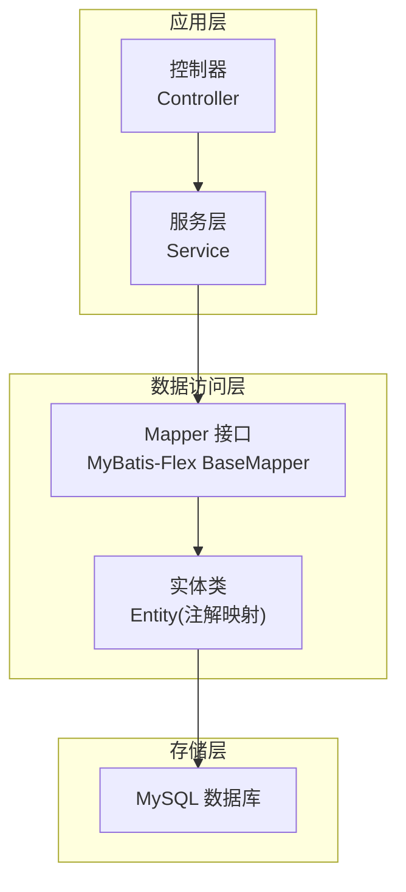
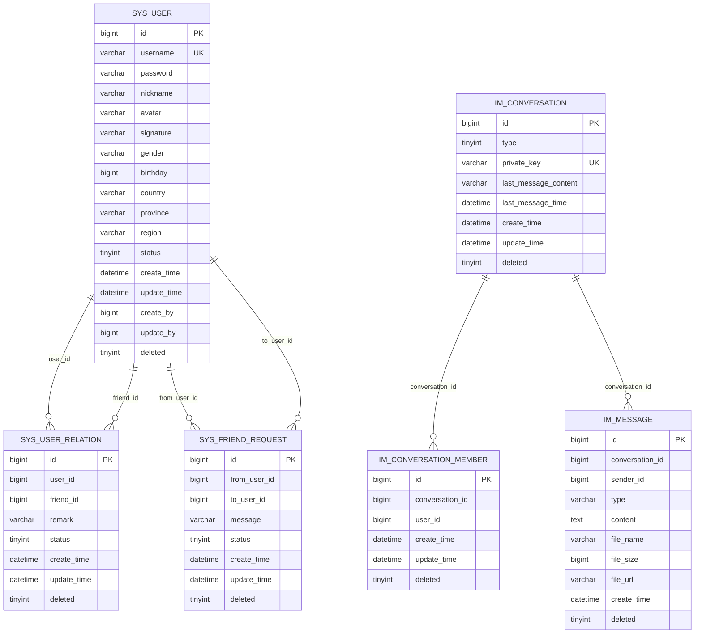
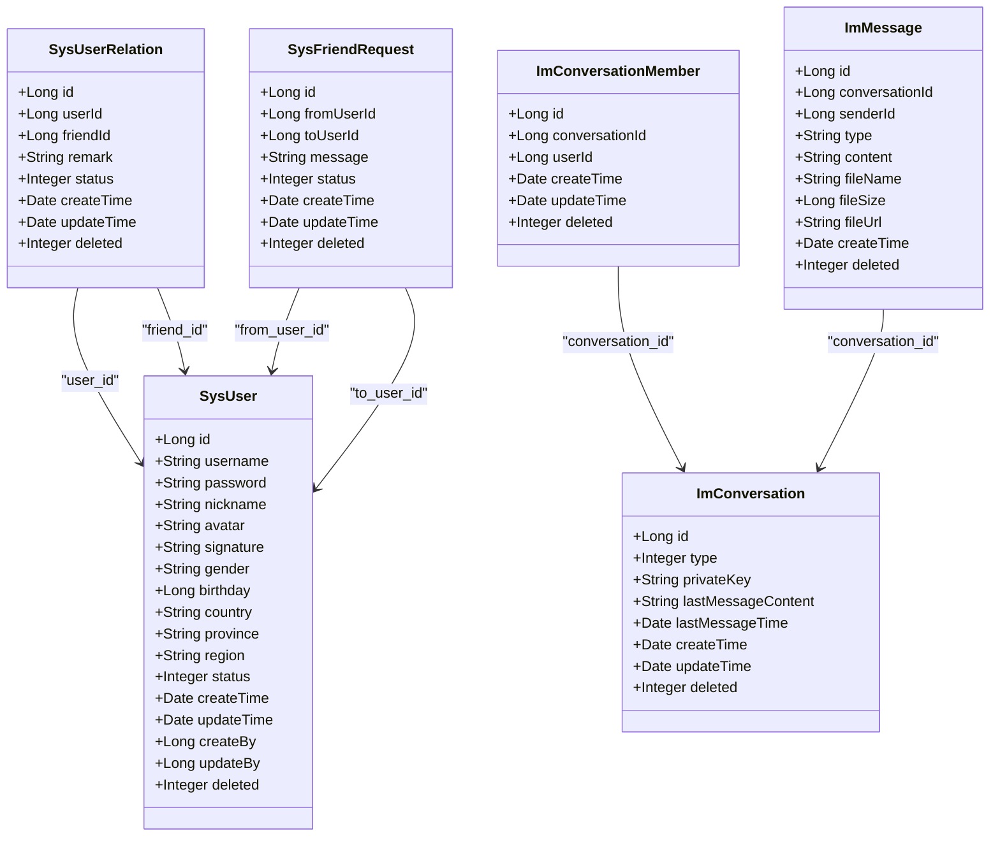
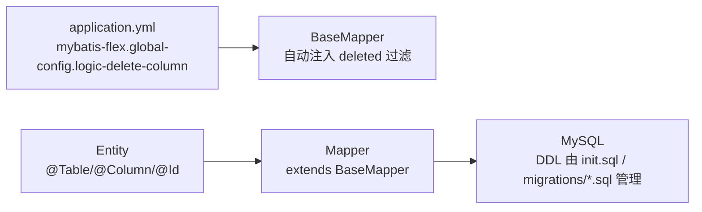

# 数据库设计

<cite>
**本文引用的文件**   
- [SysUser.java](file://linkx-server/src/main/java/com/linkx/server/entity/SysUser.java)
- [SysUserRelation.java](file://linkx-server/src/main/java/com/linkx/server/entity/SysUserRelation.java)
- [SysFriendRequest.java](file://linkx-server/src/main/java/com/linkx/server/entity/SysFriendRequest.java)
- [ImConversation.java](file://linkx-server/src/main/java/com/linkx/server/entity/ImConversation.java)
- [ImConversationMember.java](file://linkx-server/src/main/java/com/linkx/server/entity/ImConversationMember.java)
- [ImMessage.java](file://linkx-server/src/main/java/com/linkx/server/entity/ImMessage.java)
- [SysUserMapper.java](file://linkx-server/src/main/java/com/linkx/server/mapper/SysUserMapper.java)
- [SysUserRelationMapper.java](file://linkx-server/src/main/java/com/linkx/server/mapper/SysUserRelationMapper.java)
- [SysFriendRequestMapper.java](file://linkx-server/src/main/java/com/linkx/server/mapper/SysFriendRequestMapper.java)
- [ImConversationMapper.java](file://linkx-server/src/main/java/com/linkx/server/mapper/ImConversationMapper.java)
- [ImConversationMemberMapper.java](file://linkx-server/src/main/java/com/linkx/server/mapper/ImConversationMemberMapper.java)
- [ImMessageMapper.java](file://linkx-server/src/main/java/com/linkx/server/mapper/ImMessageMapper.java)
- [application.yml](file://linkx-server/src/main/resources/application.yml)
- [001_add_user_profile_and_friend_tables.sql](file://linkx-server/migrations/001_add_user_profile_and_friend_tables.sql)
- [002_add_im_tables.sql](file://linkx-server/migrations/002_add_im_tables.sql)
- [init.sql](file://linkx-server/init.sql)
</cite>

## 目录
1. [引言](#引言)
2. [项目结构](#项目结构)
3. [核心组件](#核心组件)
4. [架构总览](#架构总览)
5. [详细组件分析](#详细组件分析)
6. [依赖分析](#依赖分析)
7. [性能考虑](#性能考虑)
8. [故障排查指南](#故障排查指南)
9. [结论](#结论)
10. [附录](#附录)

## 引言
本文件面向 LinkX 项目的数据库设计与运维，聚焦以下目标：
- 完整描述实体关系与表结构设计（用户、会话、消息、好友关系等）
- 明确索引优化策略与数据完整性约束
- 说明 MyBatis-Flex 的配置与使用方式
- 给出数据迁移管理策略、查询性能优化与缓存建议
- 提供数据库架构图、ER 图与样本数据，便于开发与运维参考

## 项目结构
后端采用分层架构：Controller → Service → Mapper → Entity → Database。数据模型以 MyBatis-Flex 注解驱动，配合 SQL 迁移脚本进行版本化管理。

图表来源
- [application.yml:23-27](file://linkx-server/src/main/resources/application.yml#L23-L27)
- [SysUserMapper.java:1-22](file://linkx-server/src/main/java/com/linkx/server/mapper/SysUserMapper.java#L1-L22)

章节来源
- [application.yml:1-54](file://linkx-server/src/main/resources/application.yml#L1-L54)

## 核心组件
本节概述核心实体及其职责：
- 用户实体：账号、密码哈希、昵称、头像、签名、性别、生日、地区、状态、审计字段、逻辑删除
- 好友关系实体：用户与好友的关联、备注、状态、时间戳、逻辑删除
- 好友申请实体：申请人、被申请人、验证信息、状态、时间戳、逻辑删除
- IM 会话实体：单聊/群聊类型、私钥、最后消息预览与时间、时间戳、逻辑删除
- IM 会话成员实体：会话与用户的成员关系、时间戳、逻辑删除
- IM 消息实体：会话、发送者、类型、内容、文件元数据、时间戳、逻辑删除

章节来源
- [SysUser.java:28-96](file://linkx-server/src/main/java/com/linkx/server/entity/SysUser.java#L28-L96)
- [SysUserRelation.java:28-70](file://linkx-server/src/main/java/com/linkx/server/entity/SysUserRelation.java#L28-L70)
- [SysFriendRequest.java:16-54](file://linkx-server/src/main/java/com/linkx/server/entity/SysFriendRequest.java#L16-L54)
- [ImConversation.java:16-47](file://linkx-server/src/main/java/com/linkx/server/entity/ImConversation.java#L16-L47)
- [ImConversationMember.java:16-40](file://linkx-server/src/main/java/com/linkx/server/entity/ImConversationMember.java#L16-L40)
- [ImMessage.java:16-51](file://linkx-server/src/main/java/com/linkx/server/entity/ImMessage.java#L16-L51)

## 架构总览
下图展示数据库层面的实体关系与关键约束，包括主键、唯一键与常用索引。

图表来源
- [init.sql:9-113](file://linkx-server/init.sql#L9-L113)
- [001_add_user_profile_and_friend_tables.sql:51-79](file://linkx-server/migrations/001_add_user_profile_and_friend_tables.sql#L51-L79)
- [002_add_im_tables.sql:6-44](file://linkx-server/migrations/002_add_im_tables.sql#L6-L44)

## 详细组件分析

### 用户实体（sys_user）
- 设计理念
  - 使用雪花算法作为主键，避免集中式自增带来的扩展性问题
  - 登录账号唯一，保障身份识别一致性
  - 敏感字段（密码）仅存储加密哈希
  - 支持逻辑删除，便于审计与恢复
- 业务规则
  - 账号唯一性由唯一索引保证
  - 状态字段用于控制账号启用/停用
  - 地区信息可空，便于渐进完善资料
- 索引与约束
  - 主键：id
  - 唯一索引：uk_username
  - 逻辑删除：deleted
- 示例数据
  - 用户A：id=1, username="alice", nickname="Alice", status=1, deleted=0
  - 用户B：id=2, username="bob", nickname="Bob", status=1, deleted=0

章节来源
- [SysUser.java:28-96](file://linkx-server/src/main/java/com/linkx/server/entity/SysUser.java#L28-L96)
- [init.sql:9-29](file://linkx-server/init.sql#L9-L29)

### 好友关系实体（sys_user_relation）
- 设计理念
  - 记录“用户-好友”的双向关系，通过唯一键防止重复关系
  - 支持备注与拉黑状态，满足常见社交场景
- 业务规则
  - 同一用户对同一好友仅允许一条有效关系
  - 状态区分正常好友与拉黑
- 索引与约束
  - 主键：id
  - 唯一键：uk_user_friend(user_id, friend_id)
  - 索引：idx_user_id、idx_friend_id
- 示例数据
  - 关系R1：user_id=1, friend_id=2, status=1, deleted=0

章节来源
- [SysUserRelation.java:28-70](file://linkx-server/src/main/java/com/linkx/server/entity/SysUserRelation.java#L28-L70)
- [init.sql:34-47](file://linkx-server/init.sql#L34-L47)
- [001_add_user_profile_and_friend_tables.sql:51-64](file://linkx-server/migrations/001_add_user_profile_and_friend_tables.sql#L51-L64)

### 好友申请实体（sys_friend_request）
- 设计理念
  - 记录好友请求生命周期，支持待处理、已同意、已拒绝三种状态
- 业务规则
  - 同一申请人对同一被申请人的申请应去重或按状态流转
  - 同意后可生成对应的好友关系记录
- 索引与约束
  - 主键：id
  - 复合索引：idx_to_user_status(to_user_id, status)，便于按接收方与状态检索
  - 索引：idx_from_user(from_user_id)
- 示例数据
  - 申请F1：from_user_id=1, to_user_id=2, status=0, deleted=0

章节来源
- [SysFriendRequest.java:16-54](file://linkx-server/src/main/java/com/linkx/server/entity/SysFriendRequest.java#L16-L54)
- [init.sql:52-64](file://linkx-server/init.sql#L52-L64)
- [001_add_user_profile_and_friend_tables.sql:67-79](file://linkx-server/migrations/001_add_user_profile_and_friend_tables.sql#L67-L79)

### IM 会话实体（im_conversation）
- 设计理念
  - 统一抽象单聊与群聊，type 区分会话类型
  - 私聊使用 private_key 唯一标识，避免歧义
  - 维护最后消息预览与时间，提升列表加载性能
- 业务规则
  - 私聊会话的 private_key 需全局唯一
  - 群聊无需 private_key
- 索引与约束
  - 主键：id
  - 唯一键：uk_private_key(private_key)
- 示例数据
  - 会话C1：type=1, private_key="min_1_max_2", last_message_content="你好", last_message_time=...

章节来源
- [ImConversation.java:16-47](file://linkx-server/src/main/java/com/linkx/server/entity/ImConversation.java#L16-L47)
- [init.sql:69-80](file://linkx-server/init.sql#L69-L80)
- [002_add_im_tables.sql:6-17](file://linkx-server/migrations/002_add_im_tables.sql#L6-L17)

### IM 会话成员实体（im_conversation_member）
- 设计理念
  - 多对多关系的中间表，表示用户加入某会话
- 业务规则
  - 同一用户在同一个会话中仅能存在一次
- 索引与约束
  - 主键：id
  - 唯一键：uk_conv_user(conversation_id, user_id)
  - 索引：idx_user_id(user_id)，便于查找用户参与的会话
- 示例数据
  - 成员M1：conversation_id=1, user_id=1, deleted=0

章节来源
- [ImConversationMember.java:16-40](file://linkx-server/src/main/java/com/linkx/server/entity/ImConversationMember.java#L16-L40)
- [init.sql:85-95](file://linkx-server/init.sql#L85-L95)
- [002_add_im_tables.sql:19-29](file://linkx-server/migrations/002_add_im_tables.sql#L19-L29)

### IM 消息实体（im_message）
- 设计理念
  - 支持文本、图片、文件等多类型消息
  - 通过 conversation_id 与 create_time 组合索引优化分页与历史消息查询
- 业务规则
  - 消息类型由 type 字段标识，content 承载文本或预览
  - 文件类消息包含文件名、大小与 URL
- 索引与约束
  - 主键：id
  - 复合索引：idx_conv_time(conversation_id, create_time)
- 示例数据
  - 消息Msg1：conversation_id=1, sender_id=1, type="text", content="你好", deleted=0

章节来源
- [ImMessage.java:16-51](file://linkx-server/src/main/java/com/linkx/server/entity/ImMessage.java#L16-L51)
- [init.sql:100-113](file://linkx-server/init.sql#L100-L113)
- [002_add_im_tables.sql:31-44](file://linkx-server/migrations/002_add_im_tables.sql#L31-L44)

### 登录审计实体（sys_login_audit）
- 设计理念
  - 记录登录成功/失败事件，便于安全审计与风控
- 索引与约束
  - 主键：id
  - 索引：idx_username(username)、idx_create_time(create_time)
- 示例数据
  - 审计L1：username="alice", success=1, ip="127.0.0.1", create_time=...

章节来源
- [init.sql:118-130](file://linkx-server/init.sql#L118-L130)

### 实体关系图（代码级）

图表来源
- [SysUser.java:28-96](file://linkx-server/src/main/java/com/linkx/server/entity/SysUser.java#L28-L96)
- [SysUserRelation.java:28-70](file://linkx-server/src/main/java/com/linkx/server/entity/SysUserRelation.java#L28-L70)
- [SysFriendRequest.java:16-54](file://linkx-server/src/main/java/com/linkx/server/entity/SysFriendRequest.java#L16-L54)
- [ImConversation.java:16-47](file://linkx-server/src/main/java/com/linkx/server/entity/ImConversation.java#L16-L47)
- [ImConversationMember.java:16-40](file://linkx-server/src/main/java/com/linkx/server/entity/ImConversationMember.java#L16-L40)
- [ImMessage.java:16-51](file://linkx-server/src/main/java/com/linkx/server/entity/ImMessage.java#L16-L51)

## 依赖分析
- 实体与 Mapper 一一对应，均继承 MyBatis-Flex 的 BaseMapper，获得标准 CRUD 能力
- 配置层面通过 application.yml 指定全局逻辑删除列与数据源连接参数
- 迁移脚本负责增量变更与幂等执行

图表来源
- [application.yml:23-27](file://linkx-server/src/main/resources/application.yml#L23-L27)
- [SysUserMapper.java:1-22](file://linkx-server/src/main/java/com/linkx/server/mapper/SysUserMapper.java#L1-L22)
- [init.sql:1-131](file://linkx-server/init.sql#L1-L131)
- [001_add_user_profile_and_friend_tables.sql:1-80](file://linkx-server/migrations/001_add_user_profile_and_friend_tables.sql#L1-L80)
- [002_add_im_tables.sql:1-45](file://linkx-server/migrations/002_add_im_tables.sql#L1-L45)

章节来源
- [SysUserMapper.java:1-22](file://linkx-server/src/main/java/com/linkx/server/mapper/SysUserMapper.java#L1-L22)
- [SysUserRelationMapper.java:1-21](file://linkx-server/src/main/java/com/linkx/server/mapper/SysUserRelationMapper.java#L1-L21)
- [SysFriendRequestMapper.java:1-10](file://linkx-server/src/main/java/com/linkx/server/mapper/SysFriendRequestMapper.java#L1-L10)
- [ImConversationMapper.java:1-10](file://linkx-server/src/main/java/com/linkx/server/mapper/ImConversationMapper.java#L1-L10)
- [ImConversationMemberMapper.java:1-10](file://linkx-server/src/main/java/com/linkx/server/mapper/ImConversationMemberMapper.java#L1-L10)
- [ImMessageMapper.java:1-10](file://linkx-server/src/main/java/com/linkx/server/mapper/ImMessageMapper.java#L1-L10)

## 性能考虑
- 索引策略
  - 用户表：基于 uk_username 的唯一查询与登录校验
  - 好友关系：uk_user_friend 防重；idx_user_id、idx_friend_id 加速双向查询
  - 好友申请：idx_to_user_status 支持按接收方与状态高效筛选；idx_from_user 支持按申请人查询
  - 会话：uk_private_key 确保私聊会话唯一；last_message_* 减少聚合计算
  - 会话成员：uk_conv_user 防重复；idx_user_id 支持用户会话列表
  - 消息：idx_conv_time 优化按会话分页的历史消息读取
- 读写分离与分库分表
  - 消息表为热点写表，未来可按 conversation_id 或时间范围进行水平拆分
  - 会话与成员表可考虑按用户维度进行垂直拆分
- 缓存策略
  - 用户资料与好友关系适合使用 Redis 缓存，设置合理过期与失效策略
  - 会话最后消息预览可短期缓存，降低频繁聚合开销
- 事务与一致性
  - 好友申请同意后创建关系需在事务内完成，保证最终一致性
  - 会话成员变更与消息写入需遵循业务顺序，必要时引入幂等键

[本节为通用性能指导，不直接分析具体文件]

## 故障排查指南
- 逻辑删除未生效
  - 检查 mybatis-flex.global-config.logic-delete-column 是否设置为 deleted
  - 确认实体字段使用 @Column(isLogicDelete = true)
- 唯一键冲突
  - 好友关系：uk_user_friend 冲突时，检查是否重复添加好友
  - 私聊会话：uk_private_key 冲突时，核对 min/max 用户排序逻辑
- 索引缺失导致慢查询
  - 消息分页：确认 idx_conv_time 是否存在
  - 好友申请：确认 idx_to_user_status 与 idx_from_user 是否存在
- 迁移幂等性
  - 迁移脚本使用 IF NOT EXISTS 与条件判断，确保可重复执行

章节来源
- [application.yml:23-27](file://linkx-server/src/main/resources/application.yml#L23-L27)
- [001_add_user_profile_and_friend_tables.sql:1-80](file://linkx-server/migrations/001_add_user_profile_and_friend_tables.sql#L1-L80)
- [002_add_im_tables.sql:1-45](file://linkx-server/migrations/002_add_im_tables.sql#L1-L45)

## 结论
LinkX 的数据模型围绕用户、好友关系、好友申请与即时通信（会话、成员、消息）构建，采用雪花主键、唯一键与复合索引保障一致性与性能。通过 MyBatis-Flex 的全局逻辑删除与 BaseMapper 能力简化开发，结合幂等的迁移脚本实现安全的版本演进。后续可在消息表的分片与缓存策略上进一步优化，以满足高并发场景。

[本节为总结性内容，不直接分析具体文件]

## 附录

### MyBatis-Flex 配置与使用要点
- 全局逻辑删除列：deleted
- 自定义 XML 映射位置：classpath:mapper/*.xml
- 实体注解：@Table、@Id、@Column、@KeyGenerator
- Mapper 接口：继承 BaseMapper<T>，获得标准 CRUD 与链式查询能力

章节来源
- [application.yml:23-27](file://linkx-server/src/main/resources/application.yml#L23-L27)
- [SysUser.java:28-96](file://linkx-server/src/main/java/com/linkx/server/entity/SysUser.java#L28-L96)
- [SysUserMapper.java:1-22](file://linkx-server/src/main/java/com/linkx/server/mapper/SysUserMapper.java#L1-L22)

### 数据迁移管理策略
- 初始化脚本：init.sql 提供全量建库建表
- 增量迁移：migrations/*.sql 提供幂等升级，支持重复执行
- 命名规范：序号_描述.sql，便于追踪版本

章节来源
- [init.sql:1-131](file://linkx-server/init.sql#L1-L131)
- [001_add_user_profile_and_friend_tables.sql:1-80](file://linkx-server/migrations/001_add_user_profile_and_friend_tables.sql#L1-L80)
- [002_add_im_tables.sql:1-45](file://linkx-server/migrations/002_add_im_tables.sql#L1-L45)

### 样本数据（示例）
- 用户
  - id=1, username="alice", nickname="Alice", status=1, deleted=0
  - id=2, username="bob", nickname="Bob", status=1, deleted=0
- 好友关系
  - id=101, user_id=1, friend_id=2, status=1, deleted=0
- 好友申请
  - id=201, from_user_id=1, to_user_id=2, status=0, deleted=0
- 会话
  - id=301, type=1, private_key="min_1_max_2", last_message_content="你好", last_message_time=...
- 会话成员
  - id=401, conversation_id=301, user_id=1, deleted=0
  - id=402, conversation_id=301, user_id=2, deleted=0
- 消息
  - id=501, conversation_id=301, sender_id=1, type="text", content="你好", deleted=0

[本节为概念性示例，不直接分析具体文件]