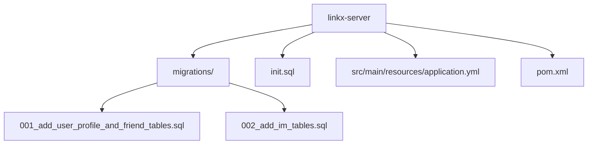
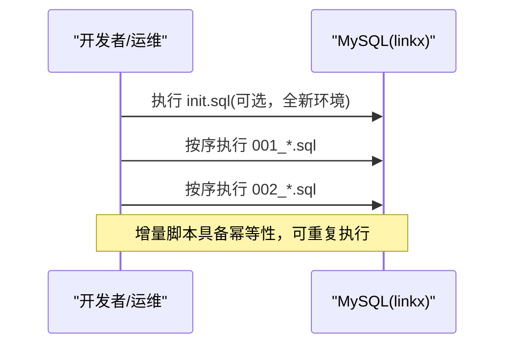
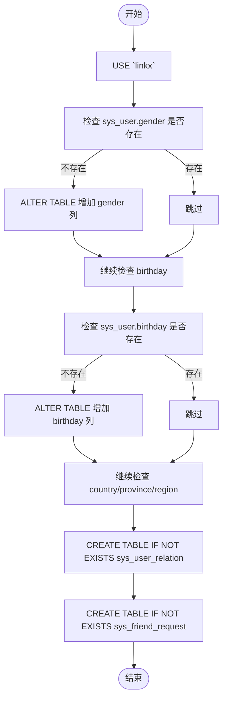
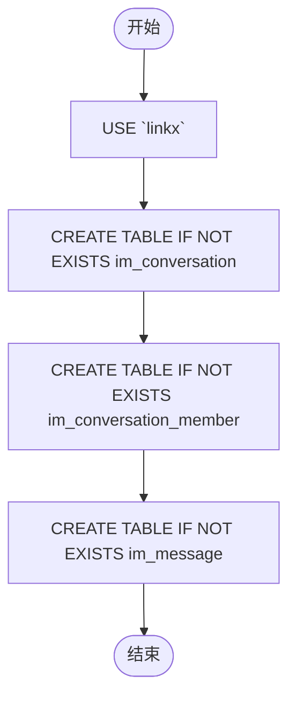
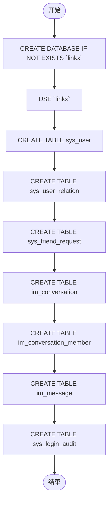
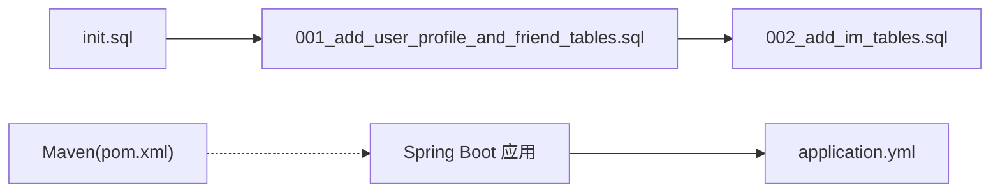

# 数据迁移管理

<cite>
**本文引用的文件**   
- [001_add_user_profile_and_friend_tables.sql](file://linkx-server/migrations/001_add_user_profile_and_friend_tables.sql)
- [002_add_im_tables.sql](file://linkx-server/migrations/002_add_im_tables.sql)
- [init.sql](file://linkx-server/init.sql)
- [pom.xml](file://linkx-server/pom.xml)
- [application.yml](file://linkx-server/src/main/resources/application.yml)
</cite>

## 目录
1. [简介](#简介)
2. [项目结构](#项目结构)
3. [核心组件](#核心组件)
4. [架构总览](#架构总览)
5. [详细组件分析](#详细组件分析)
6. [依赖分析](#依赖分析)
7. [性能考虑](#性能考虑)
8. [故障排查指南](#故障排查指南)
9. [结论](#结论)
10. [附录](#附录)

## 简介
本管理文档面向 LinkX 数据迁移系统，聚焦于数据库版本管理与变更落地。内容涵盖：
- 迁移脚本的组织结构与命名规范
- 版本控制策略与回滚机制
- SQL 迁移脚本的编写规范、条件判断语法与幂等性保证
- 初始化脚本执行流程与环境隔离策略
- 数据一致性保障与最佳实践
- 迁移工具使用指南与常见问题排查

## 项目结构
当前仓库中，数据库相关资源位于 linkx-server 模块下：
- migrations：存放增量迁移脚本（按序号递增）
- init.sql：用于全新环境初始化的完整建库建表脚本
- application.yml：数据库连接配置
- pom.xml：构建与依赖声明（未集成自动迁移插件）

图表来源
- [pom.xml:1-168](file://linkx-server/pom.xml#L1-L168)
- [application.yml:1-54](file://linkx-server/src/main/resources/application.yml#L1-L54)
- [001_add_user_profile_and_friend_tables.sql:1-80](file://linkx-server/migrations/001_add_user_profile_and_friend_tables.sql#L1-L80)
- [002_add_im_tables.sql:1-45](file://linkx-server/migrations/002_add_im_tables.sql#L1-L45)
- [init.sql:1-131](file://linkx-server/init.sql#L1-L131)

章节来源
- [pom.xml:1-168](file://linkx-server/pom.xml#L1-L168)
- [application.yml:1-54](file://linkx-server/src/main/resources/application.yml#L1-L54)

## 核心组件
- 增量迁移脚本
  - 001_add_user_profile_and_friend_tables.sql：为 sys_user 补充资料字段，并创建好友关系与申请相关表；具备幂等能力（通过信息模式检查与 IF NOT EXISTS）。
  - 002_add_im_tables.sql：创建 IM 会话、成员与消息三张表；具备幂等能力（IF NOT EXISTS）。
- 初始化脚本
  - init.sql：创建数据库与所有基础表，适用于全新环境初始化。
- 运行期配置
  - application.yml：定义 MySQL 连接参数及默认数据库名 linkx。
- 构建与依赖
  - pom.xml：声明 Spring Boot、JDBC、MyBatis-Flex、MySQL 驱动等依赖；未引入 Flyway/Liquibase 等自动迁移插件。

章节来源
- [001_add_user_profile_and_friend_tables.sql:1-80](file://linkx-server/migrations/001_add_user_profile_and_friend_tables.sql#L1-L80)
- [002_add_im_tables.sql:1-45](file://linkx-server/migrations/002_add_im_tables.sql#L1-L45)
- [init.sql:1-131](file://linkx-server/init.sql#L1-L131)
- [application.yml:1-54](file://linkx-server/src/main/resources/application.yml#L1-L54)
- [pom.xml:1-168](file://linkx-server/pom.xml#L1-L168)

## 架构总览
从“脚本到数据库”的执行路径如下：
- 开发/测试环境：通常先执行 init.sql 完成全量初始化，再按顺序执行 migrations 下的增量脚本。
- 生产环境：建议仅执行增量迁移脚本，避免覆盖已有数据；严格遵循版本号顺序执行。
- 应用启动：Spring Boot 读取 application.yml 中的 datasource 配置建立连接；当前未启用自动迁移，需由外部流程或自定义任务触发脚本执行。

图表来源
- [init.sql:1-131](file://linkx-server/init.sql#L1-L131)
- [001_add_user_profile_and_friend_tables.sql:1-80](file://linkx-server/migrations/001_add_user_profile_and_friend_tables.sql#L1-L80)
- [002_add_im_tables.sql:1-45](file://linkx-server/migrations/002_add_im_tables.sql#L1-L45)

## 详细组件分析

### 增量迁移脚本：001_add_user_profile_and_friend_tables.sql
- 目标
  - 为 sys_user 表新增性别、生日、国家、省份、地区等字段（若不存在则添加）。
  - 创建 sys_user_relation（好友关系）与 sys_friend_request（好友申请）表（若不存在则创建）。
- 幂等性与条件判断
  - 使用 information_schema.COLUMNS 查询列是否存在，结合动态 SQL 实现“存在即跳过”。
  - 表创建采用 IF NOT EXISTS，确保重复执行安全。
- 注意事项
  - 该脚本会切换至 linkx 数据库，请确保执行用户具备相应权限。
  - 对已存在的列进行 ALTER 操作时，应评估锁与在线变更影响。

图表来源
- [001_add_user_profile_and_friend_tables.sql:1-80](file://linkx-server/migrations/001_add_user_profile_and_friend_tables.sql#L1-L80)

章节来源
- [001_add_user_profile_and_friend_tables.sql:1-80](file://linkx-server/migrations/001_add_user_profile_and_friend_tables.sql#L1-L80)

### 增量迁移脚本：002_add_im_tables.sql
- 目标
  - 创建 IM 会话表 im_conversation、会话成员表 im_conversation_member、消息表 im_message。
- 幂等性
  - 全部使用 IF NOT EXISTS，支持重复执行。
- 索引设计
  - 针对常用查询路径建立唯一键与索引，如会话唯一键、用户维度索引、会话+时间复合索引等。

图表来源
- [002_add_im_tables.sql:1-45](file://linkx-server/migrations/002_add_im_tables.sql#L1-L45)

章节来源
- [002_add_im_tables.sql:1-45](file://linkx-server/migrations/002_add_im_tables.sql#L1-L45)

### 初始化脚本：init.sql
- 目标
  - 创建 linkx 数据库与所有基础表（用户、好友关系、好友申请、IM 会话/成员/消息、登录审计等）。
- 适用场景
  - 全新环境快速初始化；不建议在生产环境直接执行，以免覆盖现有数据。
- 一致性
  - 统一字符集与排序规则，便于多语言与全文检索扩展。

图表来源
- [init.sql:1-131](file://linkx-server/init.sql#L1-L131)

章节来源
- [init.sql:1-131](file://linkx-server/init.sql#L1-L131)

### 运行期配置与连接
- application.yml 定义了 JDBC URL、用户名、密码、Redis 等运行时参数；默认数据库名为 linkx。
- 当前未启用自动迁移，应用启动不会自动执行 SQL 脚本。

章节来源
- [application.yml:1-54](file://linkx-server/src/main/resources/application.yml#L1-L54)

### 构建与依赖
- pom.xml 引入了 Spring Boot、JDBC、MyBatis-Flex、MySQL 驱动等；未包含 Flyway/Liquibase 等迁移插件。
- 这意味着迁移执行需要借助外部流程或自定义任务。

章节来源
- [pom.xml:1-168](file://linkx-server/pom.xml#L1-L168)

## 依赖分析
- 脚本层
  - 001 依赖 sys_user 表存在（否则 ALTER 失败），因此应在 init.sql 之后执行。
  - 002 不依赖其他脚本，但通常作为后续功能模块的增量变更。
- 应用层
  - 应用通过 application.yml 获取数据库连接；无内置迁移逻辑。
- 构建层
  - Maven 构建过程不包含迁移阶段，需额外编排。

图表来源
- [init.sql:1-131](file://linkx-server/init.sql#L1-L131)
- [001_add_user_profile_and_friend_tables.sql:1-80](file://linkx-server/migrations/001_add_user_profile_and_friend_tables.sql#L1-L80)
- [002_add_im_tables.sql:1-45](file://linkx-server/migrations/002_add_im_tables.sql#L1-L45)
- [application.yml:1-54](file://linkx-server/src/main/resources/application.yml#L1-L54)
- [pom.xml:1-168](file://linkx-server/pom.xml#L1-L168)

章节来源
- [init.sql:1-131](file://linkx-server/init.sql#L1-L131)
- [001_add_user_profile_and_friend_tables.sql:1-80](file://linkx-server/migrations/001_add_user_profile_and_friend_tables.sql#L1-L80)
- [002_add_im_tables.sql:1-45](file://linkx-server/migrations/002_add_im_tables.sql#L1-L45)
- [application.yml:1-54](file://linkx-server/src/main/resources/application.yml#L1-L54)
- [pom.xml:1-168](file://linkx-server/pom.xml#L1-L168)

## 性能考虑
- 大表变更
  - 在 001 中对 sys_user 进行多次 ALTER 列操作，建议在低峰期执行，或使用在线DDL工具降低锁等待。
- 索引与查询
  - 002 中为消息表建立了会话+时间的复合索引，利于分页与最近消息查询；注意写入放大与空间占用。
- 字符集与排序
  - 统一 utf8mb4 与 unicode_ci，兼顾表情与国际化，但需注意存储开销与比较性能。

[本节为通用指导，无需引用具体文件]

## 故障排查指南
- 无法切换到 linkx 数据库
  - 现象：执行迁移时报错找不到数据库。
  - 处理：确认已执行 init.sql 或在目标实例上手动创建 linkx 数据库。
- 列已存在导致 ALTER 失败
  - 现象：重复执行 001 报错。
  - 处理：当前脚本已通过信息模式检查实现幂等；若仍失败，检查 MySQL 版本与权限，或清理异常状态后重试。
- 表已存在导致创建失败
  - 现象：重复执行 002 报错。
  - 处理：当前脚本使用 IF NOT EXISTS，理论上可重复执行；若失败，检查是否被外部流程提前删除或权限不足。
- 连接配置错误
  - 现象：应用无法连接数据库。
  - 处理：核对 application.yml 中的 DB_HOST、DB_PORT、DB_USERNAME、DB_PASSWORD 等环境变量或配置文件值。
- 未执行自动迁移
  - 现象：应用启动后缺少表或字段。
  - 处理：当前未集成自动迁移，需在部署流程中显式执行对应脚本。

章节来源
- [application.yml:1-54](file://linkx-server/src/main/resources/application.yml#L1-L54)
- [001_add_user_profile_and_friend_tables.sql:1-80](file://linkx-server/migrations/001_add_user_profile_and_friend_tables.sql#L1-L80)
- [002_add_im_tables.sql:1-45](file://linkx-server/migrations/002_add_im_tables.sql#L1-L45)
- [init.sql:1-131](file://linkx-server/init.sql#L1-L131)

## 结论
- 当前仓库采用“手动脚本 + 序号化命名”的轻量迁移方式，具备较好的幂等性与可读性。
- 建议在生产环境引入自动化迁移工具（如 Flyway/Liquibase），以增强版本追踪、回滚与并发控制能力。
- 严格区分 init.sql（仅用于全新环境）与 migrations（增量变更），并在发布流水线中固化执行顺序与校验步骤。

[本节为总结性内容，无需引用具体文件]

## 附录

### 迁移脚本组织与命名规范
- 目录
  - linkx-server/migrations：增量迁移脚本
  - linkx-server/init.sql：全量初始化脚本
- 命名
  - 采用“三位数字序号_描述.sql”，如 001_add_user_profile_and_friend_tables.sql、002_add_im_tables.sql。
- 顺序
  - 严格按序号升序执行，禁止乱序或跳号。

章节来源
- [001_add_user_profile_and_friend_tables.sql:1-80](file://linkx-server/migrations/001_add_user_profile_and_friend_tables.sql#L1-L80)
- [002_add_im_tables.sql:1-45](file://linkx-server/migrations/002_add_im_tables.sql#L1-L45)

### 版本控制策略
- 代码库
  - 将 init.sql 与 migrations 纳入版本控制，提交记录需包含变更说明与影响范围。
- 环境
  - 不同环境（dev/test/stage/prod）共享同一套脚本，通过环境变量区分连接参数。
- 基线
  - 以最新版本的 init.sql 作为“基线快照”，新环境优先使用该基线，再执行增量迁移。

章节来源
- [init.sql:1-131](file://linkx-server/init.sql#L1-L131)
- [application.yml:1-54](file://linkx-server/src/main/resources/application.yml#L1-L54)

### 回滚机制
- 现状
  - 当前未提供自动回滚脚本或机制。
- 建议
  - 为每个增量脚本配套反向脚本（如 001_Rollback.sql），记录撤销操作（DROP/ALTER/DROP INDEX 等）。
  - 在发布流程中增加回滚演练与验证步骤。

[本节为通用建议，无需引用具体文件]

### SQL 迁移脚本编写规范
- 幂等性
  - 使用 IF NOT EXISTS 创建对象；对列/索引变更前检查是否存在。
- 条件判断
  - 参考 001 中使用 information_schema.COLUMNS 的动态 SQL 模式进行存在性判断。
- 事务
  - 对于复杂变更，建议使用事务包裹，确保原子性。
- 注释
  - 在脚本头部注明目的、适用范围、依赖关系与风险点。

章节来源
- [001_add_user_profile_and_friend_tables.sql:1-80](file://linkx-server/migrations/001_add_user_profile_and_friend_tables.sql#L1-L80)

### 初始化脚本执行流程
- 全新环境
  - 执行 init.sql 创建数据库与表结构。
  - 按需执行 migrations 下的增量脚本（若 init.sql 未包含最新变更）。
- 已有环境
  - 仅执行尚未落地的增量脚本，严禁再次执行 init.sql。

章节来源
- [init.sql:1-131](file://linkx-server/init.sql#L1-L131)
- [001_add_user_profile_and_friend_tables.sql:1-80](file://linkx-server/migrations/001_add_user_profile_and_friend_tables.sql#L1-L80)
- [002_add_im_tables.sql:1-45](file://linkx-server/migrations/002_add_im_tables.sql#L1-L45)

### 环境隔离策略
- 数据库
  - 通过 application.yml 的环境变量（DB_HOST、DB_PORT、DB_USERNAME、DB_PASSWORD）实现连接隔离。
- 应用
  - 使用 Spring Profiles 区分不同环境的配置片段。
- 数据
  - 各环境独立数据库实例，禁止跨环境共享数据。

章节来源
- [application.yml:1-54](file://linkx-server/src/main/resources/application.yml#L1-L54)

### 数据一致性保障
- 约束
  - 合理使用主键、唯一键与外键（如需），避免脏数据。
- 索引
  - 为高频查询路径建立合适索引，平衡读写性能。
- 幂等
  - 迁移脚本必须幂等，防止重复执行引发不一致。
- 审计
  - 保留关键变更日志（如登录审计表），便于追溯。

章节来源
- [init.sql:1-131](file://linkx-server/init.sql#L1-L131)
- [002_add_im_tables.sql:1-45](file://linkx-server/migrations/002_add_im_tables.sql#L1-L45)

### 迁移工具使用指南（建议）
- 方案一：Flyway
  - 在 pom.xml 引入 Flyway 依赖与插件，配置 base-dirs 指向 migrations。
  - 通过 mvn flyway:migrate 执行迁移，flyway:undo 执行回滚（需开启 undo 支持）。
- 方案二：Liquibase
  - 引入 Liquibase 依赖，维护 changelog 清单，支持 XML/YAML/SQL 格式。
  - 通过命令行或 CI 管道执行 update/rollback。
- 方案三：自定义任务
  - 基于 Spring Boot 的 CommandLineRunner 或 ApplicationRunner 加载并执行 SQL 文件，配合版本号表记录已执行脚本。

[本节为通用建议，无需引用具体文件]

### 最佳实践建议
- 小步快跑：每次变更拆分为最小可逆的脚本，降低回滚成本。
- 灰度发布：先在预发环境验证，再逐步推广到生产。
- 变更评审：所有迁移脚本需经过 Code Review 与回归测试。
- 监控告警：对迁移执行耗时、失败率与锁等待进行监控与告警。

[本节为通用建议，无需引用具体文件]