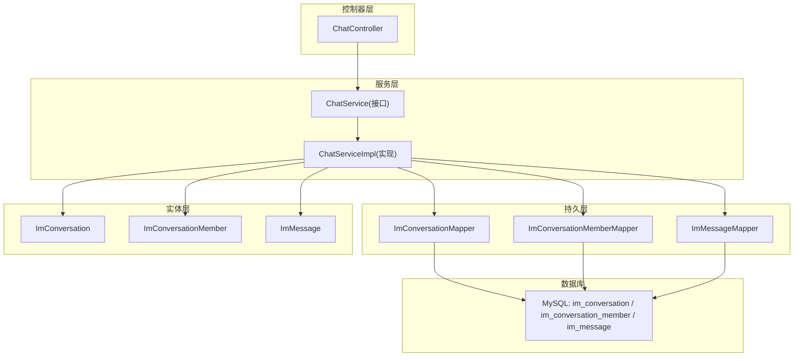
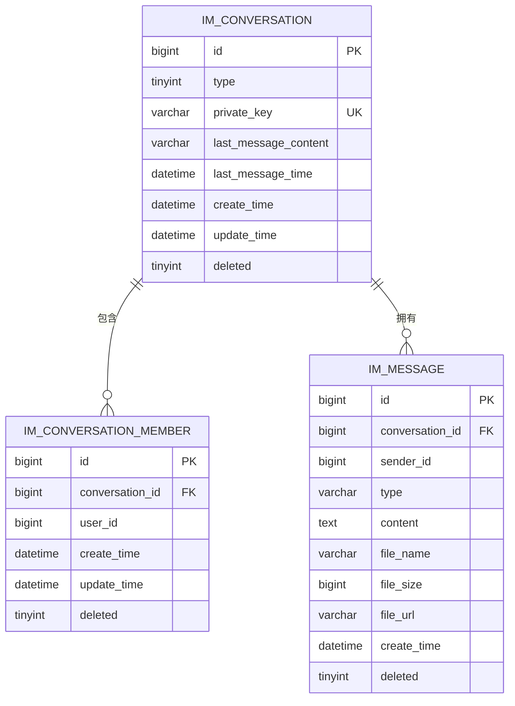
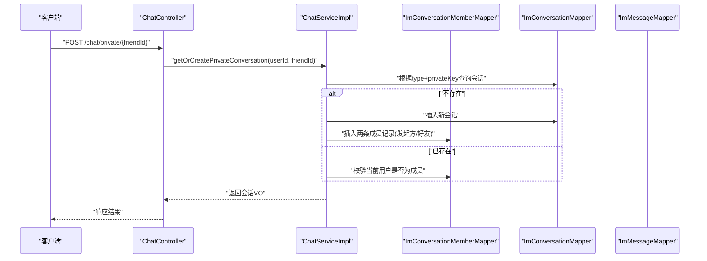
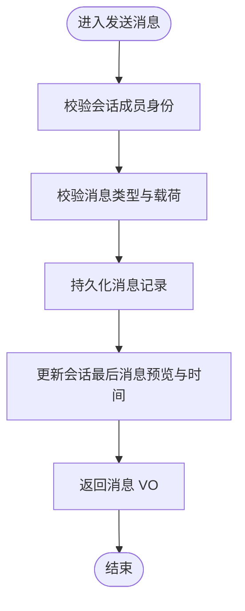
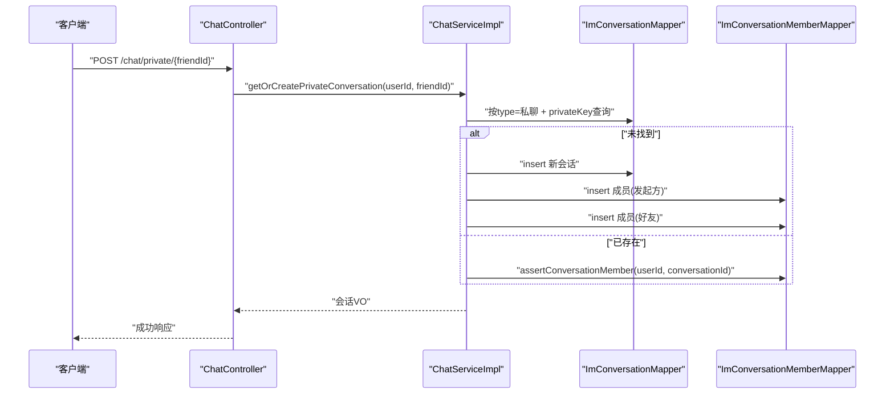
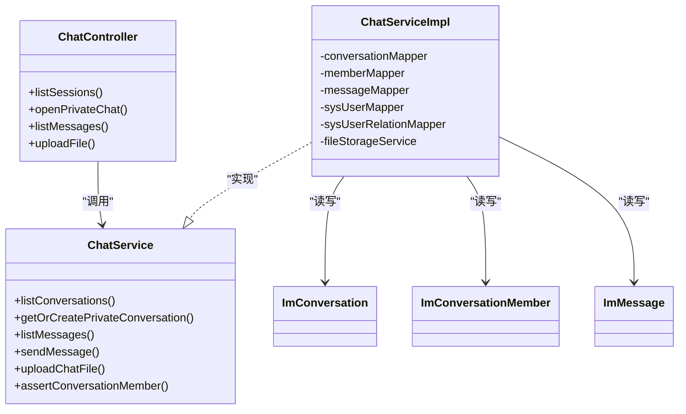

# 会话实体设计

<cite>
**本文引用的文件**
- [ImConversation.java](file://linkx-server/src/main/java/com/linkx/server/entity/ImConversation.java)
- [ImConversationMember.java](file://linkx-server/src/main/java/com/linkx/server/entity/ImConversationMember.java)
- [002_add_im_tables.sql](file://linkx-server/migrations/002_add_im_tables.sql)
- [ChatService.java](file://linkx-server/src/main/java/com/linkx/server/service/ChatService.java)
- [ChatServiceImpl.java](file://linkx-server/src/main/java/com/linkx/server/service/impl/ChatServiceImpl.java)
- [ChatController.java](file://linkx-server/src/main/java/com/linkx/server/controller/ChatController.java)
</cite>

## 目录
1. [简介](#简介)
2. [项目结构](#项目结构)
3. [核心组件](#核心组件)
4. [架构总览](#架构总览)
5. [详细组件分析](#详细组件分析)
6. [依赖关系分析](#依赖关系分析)
7. [性能考虑](#性能考虑)
8. [故障排查指南](#故障排查指南)
9. [结论](#结论)
10. [附录](#附录)

## 简介
本文件围绕 LinkX 即时通讯模块中的两个核心数据模型展开：会话实体 ImConversation 与会话成员实体 ImConversationMember。文档将全面描述字段定义、关联关系、生命周期管理、成员维护机制以及状态同步策略，并结合现有服务层实现给出会话创建流程、消息发送对会话状态的更新策略等完整示例路径。需要特别说明的是，当前代码库未提供群聊创建与成员邀请的接口实现，因此“群聊创建”和“成员邀请机制”的实现示例以概念性说明为主，并标注来源边界。

## 项目结构
与本次文档相关的后端关键位置如下：
- 实体层：im_conversation、im_conversation_member 表对应的 Java 实体类
- 迁移脚本：数据库建表与索引定义
- 服务层：会话列表、私聊会话获取或创建、消息分页拉取、文件上传、权限校验等
- 控制层：对外暴露的聊天相关 HTTP 接口

图表来源
- [ChatController.java:1-72](file://linkx-server/src/main/java/com/linkx/server/controller/ChatController.java#L1-L72)
- [ChatService.java:1-25](file://linkx-server/src/main/java/com/linkx/server/service/ChatService.java#L1-L25)
- [ChatServiceImpl.java:1-379](file://linkx-server/src/main/java/com/linkx/server/service/impl/ChatServiceImpl.java#L1-L379)
- [ImConversation.java:1-48](file://linkx-server/src/main/java/com/linkx/server/entity/ImConversation.java#L1-L48)
- [ImConversationMember.java:1-41](file://linkx-server/src/main/java/com/linkx/server/entity/ImConversationMember.java#L1-L41)
- [002_add_im_tables.sql:1-45](file://linkx-server/migrations/002_add_im_tables.sql#L1-L45)

章节来源
- [ChatController.java:1-72](file://linkx-server/src/main/java/com/linkx/server/controller/ChatController.java#L1-L72)
- [ChatService.java:1-25](file://linkx-server/src/main/java/com/linkx/server/service/ChatService.java#L1-L25)
- [ChatServiceImpl.java:1-379](file://linkx-server/src/main/java/com/linkx/server/service/impl/ChatServiceImpl.java#L1-L379)
- [ImConversation.java:1-48](file://linkx-server/src/main/java/com/linkx/server/entity/ImConversation.java#L1-L48)
- [ImConversationMember.java:1-41](file://linkx-server/src/main/java/com/linkx/server/entity/ImConversationMember.java#L1-L41)
- [002_add_im_tables.sql:1-45](file://linkx-server/migrations/002_add_im_tables.sql#L1-L45)

## 核心组件
本节聚焦于两个核心实体的字段定义与约束，以及与数据库表的映射关系。

### 会话实体 ImConversation
- 主键 id：雪花算法生成
- type：会话类型（单聊/群聊）
- privateKey：单聊唯一键（由双方用户 ID 组合生成），用于幂等查找与去重
- lastMessageContent：最后一条消息预览内容
- lastMessageTime：最后一条消息时间
- createTime/updateTime：自动填充的创建/更新时间
- deleted：逻辑删除标记

上述字段在数据库表 im_conversation 中均有对应列，且为单聊提供了唯一索引 uk_private_key。

章节来源
- [ImConversation.java:1-48](file://linkx-server/src/main/java/com/linkx/server/entity/ImConversation.java#L1-L48)
- [002_add_im_tables.sql:6-17](file://linkx-server/migrations/002_add_im_tables.sql#L6-L17)

### 会话成员实体 ImConversationMember
- 主键 id：雪花算法生成
- conversationId：所属会话 ID
- userId：成员用户 ID
- createTime/updateTime：自动填充的加入/更新时间
- deleted：逻辑删除标记

数据库表 im_conversation_member 上存在联合唯一索引 uk_conv_user(conversation_id, user_id)，保证同一用户在同一个会话中仅有一条成员记录；同时建立 idx_user_id 索引便于按用户查询其所在会话。

章节来源
- [ImConversationMember.java:1-41](file://linkx-server/src/main/java/com/linkx/server/entity/ImConversationMember.java#L1-L41)
- [002_add_im_tables.sql:19-29](file://linkx-server/migrations/002_add_im_tables.sql#L19-L29)

### 实体关系图

图表来源
- [002_add_im_tables.sql:6-44](file://linkx-server/migrations/002_add_im_tables.sql#L6-L44)

## 架构总览
从调用链路看，客户端通过 ChatController 暴露的 REST 接口访问聊天能力，服务层 ChatServiceImpl 负责会话与消息的业务编排，并通过 MyBatis-Flex Mapper 访问数据库。会话状态（如最后消息预览与时间）在发送消息时进行更新，形成“写放大但读优化”的策略。

图表来源
- [ChatController.java:36-42](file://linkx-server/src/main/java/com/linkx/server/controller/ChatController.java#L36-L42)
- [ChatServiceImpl.java:92-132](file://linkx-server/src/main/java/com/linkx/server/service/impl/ChatServiceImpl.java#L92-L132)

## 详细组件分析

### 会话实体 ImConversation 字段详解
- id：主键，分布式自增
- type：枚举值含义
  - 1：单聊
  - 2：群聊
- privateKey：单聊唯一键，由双方用户 ID 排序拼接而成，确保同一对用户的私聊会话唯一
- lastMessageContent：最后一条消息预览文本，用于会话列表展示
- lastMessageTime：最后一条消息时间，用于会话列表排序
- createTime/updateTime：系统自动维护的时间戳
- deleted：逻辑删除标志位

复杂度与索引
- 单聊查找 O(log N)（基于唯一索引 uk_private_key）
- 会话列表读取需结合成员表聚合，典型为两次查询后内存排序

章节来源
- [ImConversation.java:1-48](file://linkx-server/src/main/java/com/linkx/server/entity/ImConversation.java#L1-L48)
- [002_add_im_tables.sql:6-17](file://linkx-server/migrations/002_add_im_tables.sql#L6-L17)

### 会话成员实体 ImConversationMember 字段详解
- id：主键，分布式自增
- conversationId：外键指向会话
- userId：成员用户标识
- createTime/updateTime：自动维护
- deleted：逻辑删除标志位

约束与索引
- 联合唯一索引 uk_conv_user(conversation_id, user_id) 防止重复入会
- 普通索引 idx_user_id 支持按用户快速检索其所有会话

章节来源
- [ImConversationMember.java:1-41](file://linkx-server/src/main/java/com/linkx/server/entity/ImConversationMember.java#L1-L41)
- [002_add_im_tables.sql:19-29](file://linkx-server/migrations/002_add_im_tables.sql#L19-L29)

### 会话生命周期管理
- 创建
  - 私聊：通过“获取或创建私聊会话”接口完成，若不存在则新建会话并写入两名成员记录
  - 群聊：当前代码库未提供群聊创建接口，属于待实现范围
- 读取
  - 会话列表：先查成员表得到用户参与的所有会话 ID，再批量加载会话并按最后消息时间倒序排列
- 销毁
  - 使用逻辑删除字段 deleted 标记，不物理删除

章节来源
- [ChatServiceImpl.java:54-89](file://linkx-server/src/main/java/com/linkx/server/service/impl/ChatServiceImpl.java#L54-L89)
- [ChatServiceImpl.java:92-132](file://linkx-server/src/main/java/com/linkx/server/service/impl/ChatServiceImpl.java#L92-L132)

### 成员关系的维护机制
- 入会
  - 私聊：创建会话时自动插入两条成员记录
  - 群聊：当前未提供“添加成员”接口，属于待实现范围
- 出会/踢人
  - 当前未提供“移除成员”接口，属于待实现范围
- 权限校验
  - 所有涉及会话的操作均通过 assertConversationMember 校验当前用户是否具备成员身份

章节来源
- [ChatServiceImpl.java:229-238](file://linkx-server/src/main/java/com/linkx/server/service/impl/ChatServiceImpl.java#L229-L238)
- [ChatServiceImpl.java:118-125](file://linkx-server/src/main/java/com/linkx/server/service/impl/ChatServiceImpl.java#L118-L125)

### 会话状态同步策略
- 最后消息预览与时间
  - 发送消息成功后，服务层会更新会话的 lastMessageContent 与 lastMessageTime，从而保证会话列表的实时性与一致性
- 未读消息数
  - 当前实体与服务层未提供未读消息数字段与计数逻辑，属于可扩展点

图表来源
- [ChatServiceImpl.java:171-204](file://linkx-server/src/main/java/com/linkx/server/service/impl/ChatServiceImpl.java#L171-L204)

章节来源
- [ChatServiceImpl.java:171-204](file://linkx-server/src/main/java/com/linkx/server/service/impl/ChatServiceImpl.java#L171-L204)

### 会话创建流程（私聊）
- 入口：/chat/private/{friendId}
- 步骤
  - 解析并校验参数
  - 检查双方好友关系
  - 计算并查询私聊唯一键
  - 若不存在则创建会话并插入两名成员
  - 若已存在则校验当前用户为成员
  - 组装会话 VO 返回

图表来源
- [ChatController.java:36-42](file://linkx-server/src/main/java/com/linkx/server/controller/ChatController.java#L36-L42)
- [ChatServiceImpl.java:92-132](file://linkx-server/src/main/java/com/linkx/server/service/impl/ChatServiceImpl.java#L92-L132)

章节来源
- [ChatController.java:36-42](file://linkx-server/src/main/java/com/linkx/server/controller/ChatController.java#L36-L42)
- [ChatServiceImpl.java:92-132](file://linkx-server/src/main/java/com/linkx/server/service/impl/ChatServiceImpl.java#L92-L132)

### 成员邀请机制（概念性说明）
- 目标：支持向群聊邀请用户加入
- 建议实现要点
  - 新增“添加成员”接口，校验操作者权限（管理员/群主）
  - 使用联合唯一索引避免重复入会
  - 事务内写入成员记录，必要时广播通知在线成员
- 当前状态：代码库未提供该接口，属于后续扩展

[本节为概念性说明，不涉及具体源码]

### 会话管理（概念性说明）
- 目标：支持群聊创建、成员移除、角色权限管理等
- 建议实现要点
  - 群聊创建：初始化会话并批量插入成员（创建者为管理员）
  - 成员移除：软删除成员记录，并触发离线/在线推送
  - 角色权限：可在成员表中增加 role 字段（管理员/普通成员），并在业务层做鉴权
- 当前状态：代码库未提供这些接口，属于后续扩展

[本节为概念性说明，不涉及具体源码]

## 依赖关系分析
- 控制器依赖服务接口
- 服务实现依赖多个 Mapper 与实体
- 实体与数据库表一一对应，受迁移脚本约束

图表来源
- [ChatController.java:1-72](file://linkx-server/src/main/java/com/linkx/server/controller/ChatController.java#L1-L72)
- [ChatService.java:1-25](file://linkx-server/src/main/java/com/linkx/server/service/ChatService.java#L1-L25)
- [ChatServiceImpl.java:1-379](file://linkx-server/src/main/java/com/linkx/server/service/impl/ChatServiceImpl.java#L1-L379)
- [ImConversation.java:1-48](file://linkx-server/src/main/java/com/linkx/server/entity/ImConversation.java#L1-L48)
- [ImConversationMember.java:1-41](file://linkx-server/src/main/java/com/linkx/server/entity/ImConversationMember.java#L1-L41)

章节来源
- [ChatController.java:1-72](file://linkx-server/src/main/java/com/linkx/server/controller/ChatController.java#L1-L72)
- [ChatService.java:1-25](file://linkx-server/src/main/java/com/linkx/server/service/ChatService.java#L1-L25)
- [ChatServiceImpl.java:1-379](file://linkx-server/src/main/java/com/linkx/server/service/impl/ChatServiceImpl.java#L1-L379)

## 性能考虑
- 会话列表
  - 先查成员表再批量查会话，减少 N+1 问题
  - 内存排序按 lastMessageTime 降序，适合中小规模会话量
- 消息分页
  - 默认分页大小与上限限制，避免大页导致性能抖动
- 索引利用
  - 私聊唯一键 uk_private_key 提升幂等查找效率
  - 成员表 uk_conv_user 防重，idx_user_id 加速按用户检索
- 写放大
  - 每次发消息都更新会话预览与时间，换取会话列表的高效读取

[本节为通用性能讨论，不直接分析具体文件]

## 故障排查指南
- 无权访问该会话
  - 现象：抛出“无权访问该会话”异常
  - 原因：当前用户不在会话成员列表中
  - 定位：权限校验方法
- 只能与好友聊天
  - 现象：私聊前校验失败
  - 原因：双方非好友关系或关系状态异常
  - 定位：好友关系校验方法
- 会话不存在
  - 现象：发送消息时报错
  - 原因：会话已被删除或 ID 错误
  - 定位：发送消息前的会话存在性检查
- 无效的 ID
  - 现象：URL 路径参数无法解析为 Long
  - 原因：前端传入非法 ID 格式
  - 定位：控制器 ID 解析逻辑

章节来源
- [ChatServiceImpl.java:229-238](file://linkx-server/src/main/java/com/linkx/server/service/impl/ChatServiceImpl.java#L229-L238)
- [ChatServiceImpl.java:240-250](file://linkx-server/src/main/java/com/linkx/server/service/impl/ChatServiceImpl.java#L240-L250)
- [ChatServiceImpl.java:174-177](file://linkx-server/src/main/java/com/linkx/server/service/impl/ChatServiceImpl.java#L174-L177)
- [ChatController.java:64-70](file://linkx-server/src/main/java/com/linkx/server/controller/ChatController.java#L64-L70)

## 结论
- 会话与成员模型清晰简洁，满足私聊场景的核心需求
- 通过唯一键与联合唯一索引保障幂等与一致性
- 当前未覆盖群聊创建、成员邀请/移除、未读计数等能力，可作为后续演进方向
- 建议在后续版本中补充群聊管理能力与更细粒度的权限控制

[本节为总结性内容，不直接分析具体文件]

## 附录

### API 概览（与实体相关）
- 列出会话列表：GET /chat/sessions
- 打开私聊会话：POST /chat/private/{friendId}
- 拉取消息：GET /chat/sessions/{conversationId}/messages?before=&limit=
- 上传聊天文件：POST /chat/sessions/{conversationId}/upload

章节来源
- [ChatController.java:30-62](file://linkx-server/src/main/java/com/linkx/server/controller/ChatController.java#L30-L62)