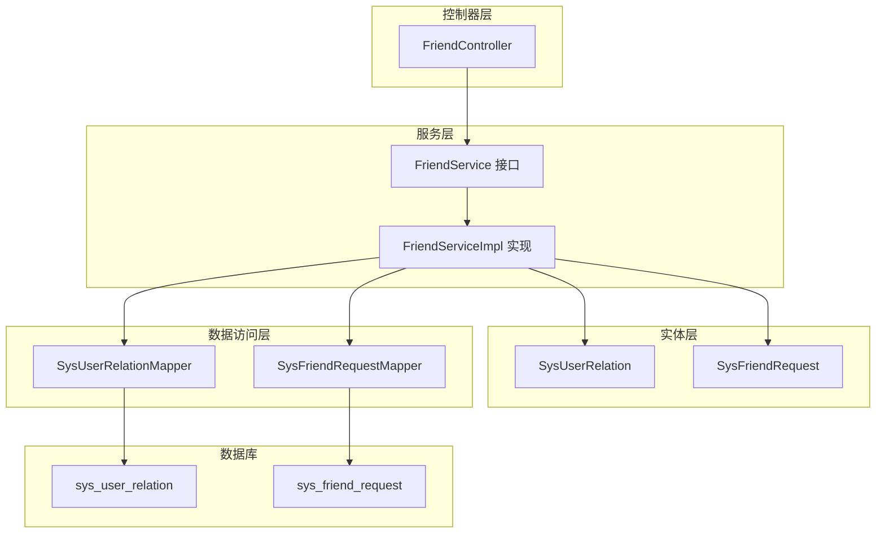
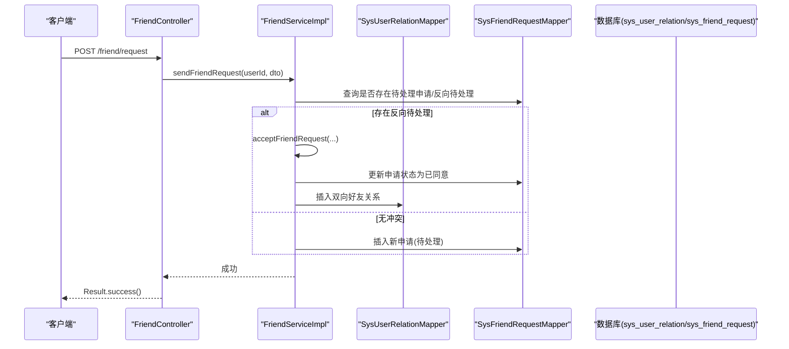
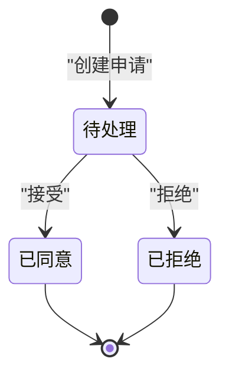
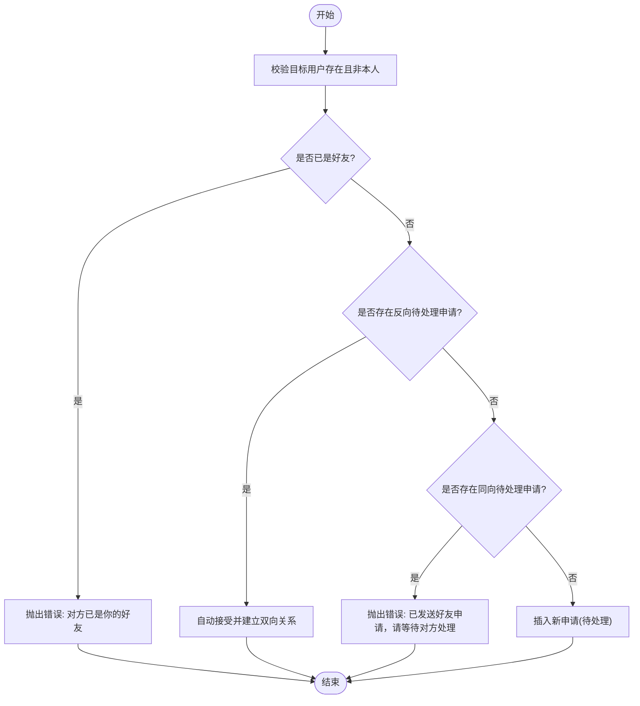
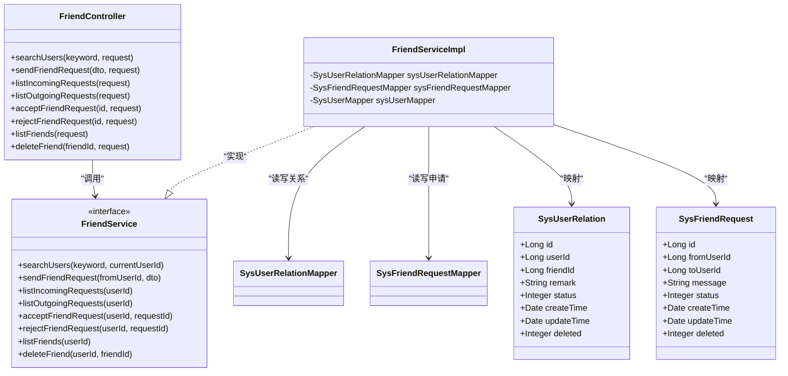
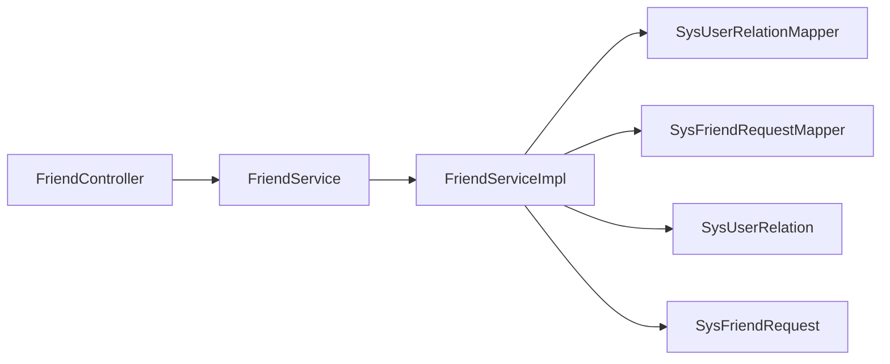

# 关系实体设计

<cite>
**本文引用的文件列表**
- [SysUserRelation.java](file://linkx-server/src/main/java/com/linkx/server/entity/SysUserRelation.java)
- [SysFriendRequest.java](file://linkx-server/src/main/java/com/linkx/server/entity/SysFriendRequest.java)
- [001_add_user_profile_and_friend_tables.sql](file://linkx-server/migrations/001_add_user_profile_and_friend_tables.sql)
- [FriendController.java](file://linkx-server/src/main/java/com/linkx/server/controller/FriendController.java)
- [FriendService.java](file://linkx-server/src/main/java/com/linkx/server/service/FriendService.java)
- [FriendServiceImpl.java](file://linkx-server/src/main/java/com/linkx/server/service/impl/FriendServiceImpl.java)
- [SendFriendRequestDTO.java](file://linkx-server/src/main/java/com/linkx/server/controller/dto/SendFriendRequestDTO.java)
- [FriendItemVO.java](file://linkx-server/src/main/java/com/linkx/server/controller/vo/FriendItemVO.java)
- [FriendRequestVO.java](file://linkx-server/src/main/java/com/linkx/server/controller/vo/FriendRequestVO.java)
- [SysUserRelationMapper.java](file://linkx-server/src/main/java/com/linkx/server/mapper/SysUserRelationMapper.java)
- [SysFriendRequestMapper.java](file://linkx-server/src/main/java/com/linkx/server/mapper/SysFriendRequestMapper.java)
</cite>

## 目录
1. [引言](#引言)
2. [项目结构](#项目结构)
3. [核心组件](#核心组件)
4. [架构总览](#架构总览)
5. [详细组件分析](#详细组件分析)
6. [依赖分析](#依赖分析)
7. [性能考虑](#性能考虑)
8. [故障排查指南](#故障排查指南)
9. [结论](#结论)

## 引言
本文件围绕 LinkX 的关系与好友申请能力，系统化梳理并文档化以下两个核心数据模型：
- 关系实体 SysUserRelation（好友关系）
- 申请实体 SysFriendRequest（好友申请）

内容覆盖字段定义、状态机设计、完整性约束、建立流程、查询与管理逻辑，并提供端到端接口调用时序图与关键业务实现路径，帮助读者快速理解并扩展相关功能。

## 项目结构
与“关系实体”直接相关的后端代码位于 linkx-server 模块中，主要包含：
- 实体层：SysUserRelation、SysFriendRequest
- 迁移脚本：创建 sys_user_relation、sys_friend_request 表及索引
- 控制器层：FriendController 暴露好友搜索、申请、处理、列表等接口
- 服务层：FriendService 接口与 FriendServiceImpl 实现，封装完整业务逻辑
- 数据传输对象：SendFriendRequestDTO、FriendItemVO、FriendRequestVO
- 数据访问层：SysUserRelationMapper、SysFriendRequestMapper

图表来源
- [FriendController.java:1-96](file://linkx-server/src/main/java/com/linkx/server/controller/FriendController.java#L1-L96)
- [FriendService.java:1-28](file://linkx-server/src/main/java/com/linkx/server/service/FriendService.java#L1-L28)
- [FriendServiceImpl.java:1-333](file://linkx-server/src/main/java/com/linkx/server/service/impl/FriendServiceImpl.java#L1-L333)
- [SysUserRelation.java:1-71](file://linkx-server/src/main/java/com/linkx/server/entity/SysUserRelation.java#L1-L71)
- [SysFriendRequest.java:1-55](file://linkx-server/src/main/java/com/linkx/server/entity/SysFriendRequest.java#L1-L55)
- [SysUserRelationMapper.java:1-21](file://linkx-server/src/main/java/com/linkx/server/mapper/SysUserRelationMapper.java#L1-L21)
- [SysFriendRequestMapper.java:1-10](file://linkx-server/src/main/java/com/linkx/server/mapper/SysFriendRequestMapper.java#L1-L10)

章节来源
- [FriendController.java:1-96](file://linkx-server/src/main/java/com/linkx/server/controller/FriendController.java#L1-L96)
- [FriendService.java:1-28](file://linkx-server/src/main/java/com/linkx/server/service/FriendService.java#L1-L28)
- [FriendServiceImpl.java:1-333](file://linkx-server/src/main/java/com/linkx/server/service/impl/FriendServiceImpl.java#L1-L333)
- [SysUserRelation.java:1-71](file://linkx-server/src/main/java/com/linkx/server/entity/SysUserRelation.java#L1-L71)
- [SysFriendRequest.java:1-55](file://linkx-server/src/main/java/com/linkx/server/entity/SysFriendRequest.java#L1-L55)
- [SysUserRelationMapper.java:1-21](file://linkx-server/src/main/java/com/linkx/server/mapper/SysUserRelationMapper.java#L1-L21)
- [SysFriendRequestMapper.java:1-10](file://linkx-server/src/main/java/com/linkx/server/mapper/SysFriendRequestMapper.java#L1-L10)

## 核心组件
本节聚焦两个核心实体的字段设计与语义约定。

### 关系实体：SysUserRelation（好友关系）
- 主键 id：雪花算法生成
- 用户 ID userId：发起方/所属用户
- 好友 ID friendId：被添加为对方的用户
- 备注 remark：对好友的备注名，可为空
- 状态 status：1=正常好友；2=已拉黑
- 时间 createTime：成为好友的时间（插入时自动填充）
- 时间 updateTime：更新时间（插入/更新时自动填充）
- 逻辑删除 deleted：0=有效；1=已删除

该实体用于表达“某用户对某人的单向关系”，双向好友由两条记录组成。

章节来源
- [SysUserRelation.java:1-71](file://linkx-server/src/main/java/com/linkx/server/entity/SysUserRelation.java#L1-L71)
- [001_add_user_profile_and_friend_tables.sql:51-64](file://linkx-server/migrations/001_add_user_profile_and_friend_tables.sql#L51-L64)

### 申请实体：SysFriendRequest（好友申请）
- 主键 id：雪花算法生成
- 申请人 fromUserId
- 被申请人 toUserId
- 消息 message：验证信息，可为空
- 状态 status：0=待处理；1=已同意；2=已拒绝
- 时间 createTime：申请时间（插入时自动填充）
- 时间 updateTime：更新时间（插入/更新时自动填充）
- 逻辑删除 deleted：0=有效；1=已删除

状态常量在实体中明确定义，便于统一维护。

章节来源
- [SysFriendRequest.java:1-55](file://linkx-server/src/main/java/com/linkx/server/entity/SysFriendRequest.java#L1-L55)
- [001_add_user_profile_and_friend_tables.sql:67-79](file://linkx-server/migrations/001_add_user_profile_and_friend_tables.sql#L67-L79)

## 架构总览
从请求到落库的整体链路如下：
- 客户端调用 /friend/* 接口
- 控制器解析参数与鉴权
- 服务层校验并发执行业务规则（防重复申请、互斥关系、幂等接受等）
- 通过 Mapper 操作对应表
- 返回统一结果包装

图表来源
- [FriendController.java:34-41](file://linkx-server/src/main/java/com/linkx/server/controller/FriendController.java#L34-L41)
- [FriendServiceImpl.java:92-138](file://linkx-server/src/main/java/com/linkx/server/service/impl/FriendServiceImpl.java#L92-L138)
- [FriendServiceImpl.java:160-176](file://linkx-server/src/main/java/com/linkx/server/service/impl/FriendServiceImpl.java#L160-L176)
- [SysFriendRequestMapper.java:1-10](file://linkx-server/src/main/java/com/linkx/server/mapper/SysFriendRequestMapper.java#L1-L10)
- [SysUserRelationMapper.java:1-21](file://linkx-server/src/main/java/com/linkx/server/mapper/SysUserRelationMapper.java#L1-L21)

## 详细组件分析

### 数据模型与约束
- 唯一性约束
  - sys_user_relation(user_id, friend_id) 唯一键，防止同一方向重复关系
- 索引优化
  - sys_user_relation: idx_user_id、idx_friend_id
  - sys_friend_request: idx_to_user_status、idx_from_user
- 时间字段
  - create_time/update_time 使用数据库默认值与自动更新
- 逻辑删除
  - deleted 字段标记删除，查询需过滤未删除记录（框架注解已配置）

章节来源
- [001_add_user_profile_and_friend_tables.sql:51-79](file://linkx-server/migrations/001_add_user_profile_and_friend_tables.sql#L51-L79)
- [SysUserRelation.java:61-69](file://linkx-server/src/main/java/com/linkx/server/entity/SysUserRelation.java#L61-L69)
- [SysFriendRequest.java:46-53](file://linkx-server/src/main/java/com/linkx/server/entity/SysFriendRequest.java#L46-L53)

### 状态机设计（好友申请）
申请状态机遵循严格转换：
- 初始态：待处理(0)
- 可转换至：已同意(1)、已拒绝(2)
- 终态：已同意、已拒绝（不可再变更）

图表来源
- [SysFriendRequest.java:28-33](file://linkx-server/src/main/java/com/linkx/server/entity/SysFriendRequest.java#L28-L33)
- [FriendServiceImpl.java:160-192](file://linkx-server/src/main/java/com/linkx/server/service/impl/FriendServiceImpl.java#L160-L192)

### 关系建立流程（含幂等与双向关系）
- 发送申请前校验：目标用户存在、非本人、非已是好友
- 幂等处理：若对方已向你发出待处理申请，则直接接受并建立双向关系
- 避免重复申请：若同向已有待处理申请，提示等待
- 接受申请：更新申请状态为已同意，并插入双向好友关系（不存在则插入）
- 删除好友：移除双方各自的关系记录

图表来源
- [FriendServiceImpl.java:92-138](file://linkx-server/src/main/java/com/linkx/server/service/impl/FriendServiceImpl.java#L92-L138)
- [FriendServiceImpl.java:262-282](file://linkx-server/src/main/java/com/linkx/server/service/impl/FriendServiceImpl.java#L262-L282)

### 关系数据的完整性约束与一致性
- 唯一性约束保障同一方向不重复
- 事务保护接受申请与双向关系写入，保证原子性
- 删除好友时同时移除双方关系，保持对称性
- 查询好友列表仅返回正常状态的关系，屏蔽拉黑与已删除

章节来源
- [FriendServiceImpl.java:160-176](file://linkx-server/src/main/java/com/linkx/server/service/impl/FriendServiceImpl.java#L160-L176)
- [FriendServiceImpl.java:235-243](file://linkx-server/src/main/java/com/linkx/server/service/impl/FriendServiceImpl.java#L235-L243)
- [FriendServiceImpl.java:194-233](file://linkx-server/src/main/java/com/linkx/server/service/impl/FriendServiceImpl.java#L194-L233)

### 接口与数据契约
- 发送好友申请
  - 入参：SendFriendRequestDTO（username、message）
  - 出参：通用成功响应
- 接收/发送申请列表
  - 入参：当前登录用户ID（从上下文获取）
  - 出参：FriendRequestVO 列表（含方向 incoming/outgoing）
- 接受/拒绝申请
  - 入参：申请ID
  - 出参：通用成功响应
- 好友列表
  - 入参：当前登录用户ID
  - 出参：FriendItemVO 列表（含用户名、昵称、头像、备注）

章节来源
- [FriendController.java:26-86](file://linkx-server/src/main/java/com/linkx/server/controller/FriendController.java#L26-L86)
- [SendFriendRequestDTO.java:1-17](file://linkx-server/src/main/java/com/linkx/server/controller/dto/SendFriendRequestDTO.java#L1-L17)
- [FriendRequestVO.java:1-48](file://linkx-server/src/main/java/com/linkx/server/controller/vo/FriendRequestVO.java#L1-L48)
- [FriendItemVO.java:1-23](file://linkx-server/src/main/java/com/linkx/server/controller/vo/FriendItemVO.java#L1-L23)

### 类关系图（代码级）

图表来源
- [SysUserRelation.java:1-71](file://linkx-server/src/main/java/com/linkx/server/entity/SysUserRelation.java#L1-L71)
- [SysFriendRequest.java:1-55](file://linkx-server/src/main/java/com/linkx/server/entity/SysFriendRequest.java#L1-L55)
- [FriendController.java:1-96](file://linkx-server/src/main/java/com/linkx/server/controller/FriendController.java#L1-L96)
- [FriendService.java:1-28](file://linkx-server/src/main/java/com/linkx/server/service/FriendService.java#L1-L28)
- [FriendServiceImpl.java:1-333](file://linkx-server/src/main/java/com/linkx/server/service/impl/FriendServiceImpl.java#L1-L333)
- [SysUserRelationMapper.java:1-21](file://linkx-server/src/main/java/com/linkx/server/mapper/SysUserRelationMapper.java#L1-L21)
- [SysFriendRequestMapper.java:1-10](file://linkx-server/src/main/java/com/linkx/server/mapper/SysFriendRequestMapper.java#L1-L10)

## 依赖分析
- 控制器依赖服务接口，服务实现依赖 Mapper 与实体
- 服务实现内部还依赖用户查询（用于搜索与展示），但不在本文重点范围
- 数据访问层基于 MyBatis-Flex 的 BaseMapper，提供基础 CRUD 与条件查询能力

图表来源
- [FriendController.java:1-96](file://linkx-server/src/main/java/com/linkx/server/controller/FriendController.java#L1-L96)
- [FriendService.java:1-28](file://linkx-server/src/main/java/com/linkx/server/service/FriendService.java#L1-L28)
- [FriendServiceImpl.java:1-333](file://linkx-server/src/main/java/com/linkx/server/service/impl/FriendServiceImpl.java#L1-L333)
- [SysUserRelationMapper.java:1-21](file://linkx-server/src/main/java/com/linkx/server/mapper/SysUserRelationMapper.java#L1-L21)
- [SysFriendRequestMapper.java:1-10](file://linkx-server/src/main/java/com/linkx/server/mapper/SysFriendRequestMapper.java#L1-L10)

## 性能考虑
- 索引利用
  - 按 user_id/friend_id 查询好友关系高效
  - 按 to_user_id+status 组合索引加速“我收到的待处理申请”列表
- 批量加载
  - 好友列表采用先查关系再批量查用户信息的策略，减少 N+1 问题
- 幂等与去重
  - 发送申请前检查反向待处理申请，避免重复提交
- 逻辑删除
  - 通过逻辑删除字段控制可见性，避免物理删除带来的级联复杂度

[本节为通用指导，无需特定文件引用]

## 故障排查指南
- 无效的申请 ID
  - 控制器对路径参数进行解析，非法格式将抛出异常
- 无权处理申请
  - 服务端校验当前用户是否为被申请人，否则拒绝
- 申请已处理
  - 非待处理状态的申请不允许再次接受或拒绝
- 对方不是你的好友
  - 删除好友前校验关系存在且正常
- 搜索关键词过短
  - 少于最小长度会直接报错，避免低质量查询

章节来源
- [FriendController.java:88-94](file://linkx-server/src/main/java/com/linkx/server/controller/FriendController.java#L88-L94)
- [FriendServiceImpl.java:160-192](file://linkx-server/src/main/java/com/linkx/server/service/impl/FriendServiceImpl.java#L160-L192)
- [FriendServiceImpl.java:235-243](file://linkx-server/src/main/java/com/linkx/server/service/impl/FriendServiceImpl.java#L235-L243)
- [FriendServiceImpl.java:40-44](file://linkx-server/src/main/java/com/linkx/server/service/impl/FriendServiceImpl.java#L40-L44)

## 结论
- 数据模型清晰：关系与申请分离，状态机简洁明确
- 完整性保障充分：唯一键、索引、事务与逻辑删除共同确保一致性与性能
- 业务流程完善：支持幂等接受、双向关系维护、友好提示与错误码
- 可扩展性强：后续可在 Mapper 层补充复杂查询，或在 VO 层扩展展示字段

[本节为总结性内容，无需特定文件引用]