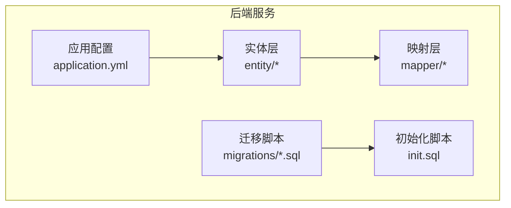
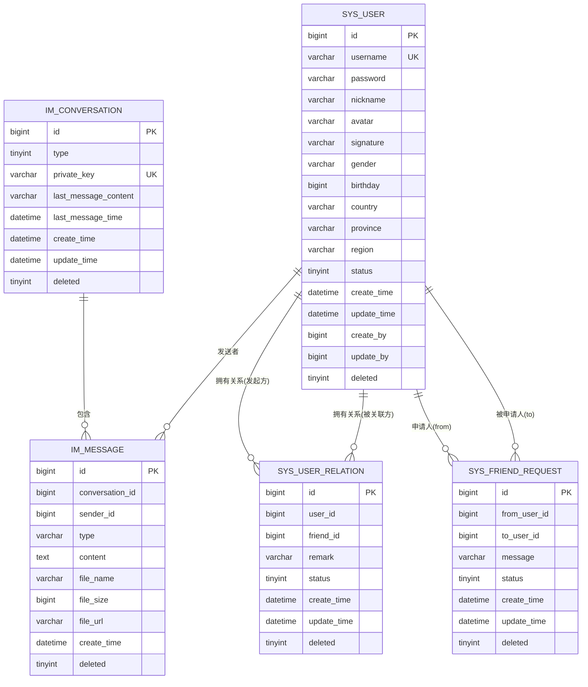
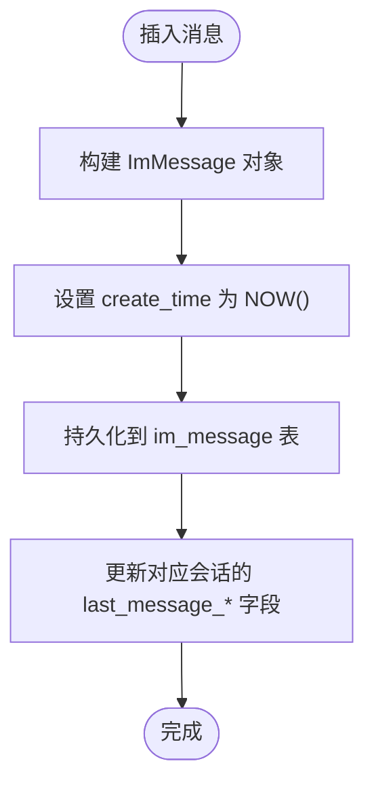

# 核心实体设计

<cite>
**本文引用的文件**
- [SysUser.java](file://linkx-server/src/main/java/com/linkx/server/entity/SysUser.java)
- [ImMessage.java](file://linkx-server/src/main/java/com/linkx/server/entity/ImMessage.java)
- [ImConversation.java](file://linkx-server/src/main/java/com/linkx/server/entity/ImConversation.java)
- [SysUserRelation.java](file://linkx-server/src/main/java/com/linkx/server/entity/SysUserRelation.java)
- [SysFriendRequest.java](file://linkx-server/src/main/java/com/linkx/server/entity/SysFriendRequest.java)
- [ImConversationMemberMapper.java](file://linkx-server/src/main/java/com/linkx/server/mapper/ImConversationMemberMapper.java)
- [init.sql](file://linkx-server/init.sql)
- [001_add_user_profile_and_friend_tables.sql](file://linkx-server/migrations/001_add_user_profile_and_friend_tables.sql)
- [002_add_im_tables.sql](file://linkx-server/migrations/002_add_im_tables.sql)
- [application.yml](file://linkx-server/src/main/resources/application.yml)
</cite>

## 目录
1. [简介](#简介)
2. [项目结构](#项目结构)
3. [核心组件](#核心组件)
4. [架构总览](#架构总览)
5. [详细组件分析](#详细组件分析)
6. [依赖关系分析](#依赖关系分析)
7. [性能考虑](#性能考虑)
8. [故障排查指南](#故障排查指南)
9. [结论](#结论)
10. [附录](#附录)

## 简介
本文件为 LinkX 核心实体的数据模型文档，覆盖以下核心实体：用户（SysUser）、消息（ImMessage）、会话（ImConversation）、好友关系（SysUserRelation）与好友申请（SysFriendRequest）。文档包含字段定义、数据类型、业务规则、关联关系、外键约束与索引设计；并说明雪花算法主键生成策略、逻辑删除实现与时间戳管理。文末提供 ER 图、数据字典与样本数据，便于开发与测试参考。

## 项目结构
后端采用 MyBatis-Flex 作为 ORM，实体类位于 entity 包，数据库初始化脚本位于 init.sql 与 migrations 目录，全局配置在 application.yml。

图表来源
- [application.yml:23-27](file://linkx-server/src/main/resources/application.yml#L23-L27)
- [init.sql:9-29](file://linkx-server/init.sql#L9-L29)
- [002_add_im_tables.sql:6-17](file://linkx-server/migrations/002_add_im_tables.sql#L6-L17)

章节来源
- [application.yml:1-54](file://linkx-server/src/main/resources/application.yml#L1-L54)
- [init.sql:1-131](file://linkx-server/init.sql#L1-L131)
- [001_add_user_profile_and_friend_tables.sql:1-80](file://linkx-server/migrations/001_add_user_profile_and_friend_tables.sql#L1-L80)
- [002_add_im_tables.sql:1-45](file://linkx-server/migrations/002_add_im_tables.sql#L1-L45)

## 核心组件
本节概述五个核心实体的职责与关键特性：
- SysUser：系统用户基础信息与账号状态。
- ImConversation：单聊/群聊会话元信息，维护最后消息预览与时间。
- ImMessage：会话中的具体消息记录，支持文本、图片、文件等类型。
- SysUserRelation：用户间的好友关系，含备注与拉黑状态。
- SysFriendRequest：好友申请流程的状态机与审计字段。

章节来源
- [SysUser.java:28-96](file://linkx-server/src/main/java/com/linkx/server/entity/SysUser.java#L28-L96)
- [ImConversation.java:16-47](file://linkx-server/src/main/java/com/linkx/server/entity/ImConversation.java#L16-L47)
- [ImMessage.java:16-51](file://linkx-server/src/main/java/com/linkx/server/entity/ImMessage.java#L16-L51)
- [SysUserRelation.java:28-70](file://linkx-server/src/main/java/com/linkx/server/entity/SysUserRelation.java#L28-L70)
- [SysFriendRequest.java:16-54](file://linkx-server/src/main/java/com/linkx/server/entity/SysFriendRequest.java#L16-L54)

## 架构总览
下图展示核心实体之间的主要关系与数据流向，包括好友关系、好友申请与会话消息的关联。

图表来源
- [init.sql:9-29](file://linkx-server/init.sql#L9-L29)
- [init.sql:69-80](file://linkx-server/init.sql#L69-L80)
- [init.sql:100-113](file://linkx-server/init.sql#L100-L113)
- [init.sql:34-47](file://linkx-server/init.sql#L34-L47)
- [init.sql:52-64](file://linkx-server/init.sql#L52-L64)

## 详细组件分析

### 用户实体（SysUser）
- 表名：sys_user
- 主键：id（BIGINT，雪花算法）
- 唯一索引：uk_username（username）
- 关键字段
  - username：登录账号，唯一
  - password：BCrypt 加密存储
  - nickname/avatar/signature：展示与签名
  - gender/birthday/country/province/region：个人资料
  - status：账号状态（1=正常，0=停用）
  - create_time/update_time：自动时间戳
  - create_by/update_by：审计字段
  - deleted：逻辑删除标记（0=未删除，1=已删除）
- 业务规则
  - 账号唯一性由 uk_username 保证
  - 密码禁止明文存储
  - 逻辑删除通过全局配置与注解共同生效
- 时间戳管理
  - create_time：默认 CURRENT_TIMESTAMP
  - update_time：ON UPDATE CURRENT_TIMESTAMP
- 雪花算法
  - 使用 KeyGenerators.snowFlakeId 自动生成 Long 型主键

章节来源
- [SysUser.java:34-96](file://linkx-server/src/main/java/com/linkx/server/entity/SysUser.java#L34-L96)
- [init.sql:9-29](file://linkx-server/init.sql#L9-L29)
- [application.yml:23-27](file://linkx-server/src/main/resources/application.yml#L23-L27)

### 会话实体（ImConversation）
- 表名：im_conversation
- 主键：id（BIGINT，雪花算法）
- 唯一索引：uk_private_key（private_key）
- 关键字段
  - type：会话类型（1=单聊，2=群聊）
  - private_key：单聊唯一键（minUserId_maxUserId）
  - last_message_content/last_message_time：会话摘要与最新时间
  - create_time/update_time：自动时间戳
  - deleted：逻辑删除标记
- 业务规则
  - 单聊会话通过 private_key 去重，避免重复创建
  - 更新会话时建议同步更新 last_message_* 字段
- 时间戳管理
  - create_time：默认 CURRENT_TIMESTAMP
  - update_time：ON UPDATE CURRENT_TIMESTAMP

章节来源
- [ImConversation.java:16-47](file://linkx-server/src/main/java/com/linkx/server/entity/ImConversation.java#L16-L47)
- [init.sql:69-80](file://linkx-server/init.sql#L69-L80)

### 消息实体（ImMessage）
- 表名：im_message
- 主键：id（BIGINT，雪花算法）
- 复合索引：idx_conv_time（conversation_id, create_time）
- 关键字段
  - conversation_id：所属会话
  - sender_id：发送者用户ID
  - type：消息类型（text/image/file）
  - content：文本内容或预览
  - file_name/file_size/file_url：文件相关元数据
  - create_time：发送时间（默认 CURRENT_TIMESTAMP）
  - deleted：逻辑删除标记
- 业务规则
  - 消息按会话维度分页查询，依赖 idx_conv_time
  - 文件消息需确保 file_url 有效且大小合理
- 时间戳管理
  - create_time：默认 CURRENT_TIMESTAMP

章节来源
- [ImMessage.java:16-51](file://linkx-server/src/main/java/com/linkx/server/entity/ImMessage.java#L16-L51)
- [init.sql:100-113](file://linkx-server/init.sql#L100-L113)

### 好友关系实体（SysUserRelation）
- 表名：sys_user_relation
- 主键：id（BIGINT，雪花算法）
- 唯一索引：uk_user_friend（user_id, friend_id）
- 普通索引：idx_user_id、idx_friend_id
- 关键字段
  - user_id：发起方/所属用户
  - friend_id：好友用户
  - remark：备注
  - status：关系状态（1=正常，2=拉黑）
  - create_time/update_time：自动时间戳
  - deleted：逻辑删除标记
- 业务规则
  - 同一用户对之间仅允许一条关系记录（唯一约束）
  - 拉黑状态下应限制聊天与互动
- 时间戳管理
  - create_time：默认 CURRENT_TIMESTAMP
  - update_time：ON UPDATE CURRENT_TIMESTAMP

章节来源
- [SysUserRelation.java:28-70](file://linkx-server/src/main/java/com/linkx/server/entity/SysUserRelation.java#L28-L70)
- [init.sql:34-47](file://linkx-server/init.sql#L34-L47)

### 好友申请实体（SysFriendRequest）
- 表名：sys_friend_request
- 主键：id（BIGINT，雪花算法）
- 复合索引：idx_to_user_status（to_user_id, status）
- 普通索引：idx_from_user
- 关键字段
  - from_user_id：申请人
  - to_user_id：被申请人
  - message：验证信息
  - status：状态（0=待处理，1=已同意，2=已拒绝）
  - create_time/update_time：自动时间戳
  - deleted：逻辑删除标记
- 业务规则
  - 同一申请人对被申请人可存在多条申请记录，但通常只保留最近一条待处理
  - 同意后将写入 sys_user_relation 建立好友关系
- 时间戳管理
  - create_time：默认 CURRENT_TIMESTAMP
  - update_time：ON UPDATE CURRENT_TIMESTAMP

章节来源
- [SysFriendRequest.java:16-54](file://linkx-server/src/main/java/com/linkx/server/entity/SysFriendRequest.java#L16-L54)
- [init.sql:52-64](file://linkx-server/init.sql#L52-L64)

### 会话成员（补充）
- 表名：im_conversation_member
- 主键：id（BIGINT，雪花算法）
- 唯一索引：uk_conv_user（conversation_id, user_id）
- 普通索引：idx_user_id
- 用途：记录会话成员，用于群聊场景的成员管理与权限控制

章节来源
- [init.sql:85-95](file://linkx-server/init.sql#L85-L95)
- [ImConversationMemberMapper.java:1-10](file://linkx-server/src/main/java/com/linkx/server/mapper/ImConversationMemberMapper.java#L1-L10)

## 依赖关系分析
- 实体与表映射
  - 所有实体均通过 @Table 指定表名，@Id + KeyGenerators.snowFlakeId 实现雪花主键
- 逻辑删除
  - 全局配置 mybatis-flex.global-config.logic-delete-column=deleted，配合 @Column(isLogicDelete=true) 生效
- 时间戳
  - 多数表使用 DEFAULT CURRENT_TIMESTAMP 与 ON UPDATE CURRENT_TIMESTAMP 自动维护时间字段
- 索引设计
  - 会话消息按会话+时间排序查询，使用复合索引提升性能
  - 好友关系与申请针对常用查询路径建立索引
- 外键约束
  - 当前未定义物理外键，通过业务逻辑与索引保证一致性

图表来源
- [ImMessage.java:46-50](file://linkx-server/src/main/java/com/linkx/server/entity/ImMessage.java#L46-L50)
- [ImConversation.java:39-46](file://linkx-server/src/main/java/com/linkx/server/entity/ImConversation.java#L39-L46)
- [init.sql:100-113](file://linkx-server/init.sql#L100-L113)
- [init.sql:69-80](file://linkx-server/init.sql#L69-L80)

章节来源
- [application.yml:23-27](file://linkx-server/src/main/resources/application.yml#L23-L27)
- [init.sql:9-29](file://linkx-server/init.sql#L9-L29)
- [init.sql:69-80](file://linkx-server/init.sql#L69-L80)
- [init.sql:100-113](file://linkx-server/init.sql#L100-L113)

## 性能考虑
- 主键策略
  - 雪花算法生成无冲突分布式 ID，适合高并发写入
- 索引优化
  - 会话消息按 conversation_id + create_time 查询频繁，复合索引 idx_conv_time 显著提升分页与历史加载性能
  - 好友关系与申请针对高频查询列建立索引，减少全表扫描
- 逻辑删除
  - 使用 deleted 标记避免物理删除带来的级联成本，但需注意查询条件始终包含 deleted=0
- 时间戳
  - 利用数据库默认值与触发更新，降低应用层负担
- 会话摘要
  - 维护 last_message_content/last_message_time 可减少聚合计算开销

[本节为通用性能建议，不直接分析具体文件]

## 故障排查指南
- 逻辑删除未生效
  - 检查全局配置 logic-delete-column 是否设置为 deleted
  - 确认实体字段标注了 isLogicDelete=true
- 重复会话问题
  - 单聊会话需保证 private_key 唯一，避免重复创建
- 消息查询缓慢
  - 确认 idx_conv_time 索引存在且未被禁用
- 好友关系冲突
  - 检查 uk_user_friend 唯一约束，避免重复写入
- 时间戳异常
  - 检查服务器时区与数据库时区一致，确保 CURRENT_TIMESTAMP 正确

章节来源
- [application.yml:23-27](file://linkx-server/src/main/resources/application.yml#L23-L27)
- [init.sql:69-80](file://linkx-server/init.sql#L69-L80)
- [init.sql:100-113](file://linkx-server/init.sql#L100-L113)
- [init.sql:34-47](file://linkx-server/init.sql#L34-L47)

## 结论
LinkX 的核心实体围绕用户、会话、消息、好友关系与申请展开，采用雪花算法主键、逻辑删除与自动时间戳，结合合理的索引设计，满足即时通讯与社交功能的高并发与可扩展需求。建议在业务层严格遵循唯一约束与状态机规则，保障数据一致性与用户体验。

[本节为总结性内容，不直接分析具体文件]

## 附录

### 数据字典（字段与类型）
- 用户（sys_user）
  - id: BIGINT（雪花主键）
  - username: VARCHAR(64)，唯一
  - password: VARCHAR(255)，BCrypt
  - nickname: VARCHAR(64)
  - avatar: VARCHAR(255)
  - signature: VARCHAR(255)
  - gender: VARCHAR(8)
  - birthday: BIGINT（毫秒时间戳）
  - country/province/region: VARCHAR(64)
  - status: TINYINT（1=正常，0=停用）
  - create_time/update_time: DATETIME（自动）
  - create_by/update_by: BIGINT（审计）
  - deleted: TINYINT(1)（逻辑删除）
- 会话（im_conversation）
  - id: BIGINT（雪花主键）
  - type: TINYINT（1=单聊，2=群聊）
  - private_key: VARCHAR(64)，唯一
  - last_message_content: VARCHAR(500)
  - last_message_time: DATETIME
  - create_time/update_time: DATETIME（自动）
  - deleted: TINYINT(1)
- 消息（im_message）
  - id: BIGINT（雪花主键）
  - conversation_id: BIGINT
  - sender_id: BIGINT
  - type: VARCHAR(20)（text/image/file）
  - content: TEXT
  - file_name: VARCHAR(255)
  - file_size: BIGINT
  - file_url: VARCHAR(500)
  - create_time: DATETIME（自动）
  - deleted: TINYINT(1)
- 好友关系（sys_user_relation）
  - id: BIGINT（雪花主键）
  - user_id/friend_id: BIGINT
  - remark: VARCHAR(64)
  - status: TINYINT（1=正常，2=拉黑）
  - create_time/update_time: DATETIME（自动）
  - deleted: TINYINT(1)
- 好友申请（sys_friend_request）
  - id: BIGINT（雪花主键）
  - from_user_id/to_user_id: BIGINT
  - message: VARCHAR(255)
  - status: TINYINT（0=待处理，1=已同意，2=已拒绝）
  - create_time/update_time: DATETIME（自动）
  - deleted: TINYINT(1)

章节来源
- [init.sql:9-29](file://linkx-server/init.sql#L9-L29)
- [init.sql:69-80](file://linkx-server/init.sql#L69-L80)
- [init.sql:100-113](file://linkx-server/init.sql#L100-L113)
- [init.sql:34-47](file://linkx-server/init.sql#L34-L47)
- [init.sql:52-64](file://linkx-server/init.sql#L52-L64)

### 索引与约束清单
- sys_user
  - PRIMARY KEY (id)
  - UNIQUE KEY uk_username (username)
- im_conversation
  - PRIMARY KEY (id)
  - UNIQUE KEY uk_private_key (private_key)
- im_message
  - PRIMARY KEY (id)
  - KEY idx_conv_time (conversation_id, create_time)
- sys_user_relation
  - PRIMARY KEY (id)
  - UNIQUE KEY uk_user_friend (user_id, friend_id)
  - KEY idx_user_id (user_id)
  - KEY idx_friend_id (friend_id)
- sys_friend_request
  - PRIMARY KEY (id)
  - KEY idx_to_user_status (to_user_id, status)
  - KEY idx_from_user (from_user_id)

章节来源
- [init.sql:9-29](file://linkx-server/init.sql#L9-L29)
- [init.sql:69-80](file://linkx-server/init.sql#L69-L80)
- [init.sql:100-113](file://linkx-server/init.sql#L100-L113)
- [init.sql:34-47](file://linkx-server/init.sql#L34-L47)
- [init.sql:52-64](file://linkx-server/init.sql#L52-L64)

### 主键与时间戳策略
- 主键策略
  - 全部实体使用雪花算法生成 Long 型主键，避免集中式 ID 瓶颈
- 逻辑删除
  - 全局配置 deleted 列为逻辑删除标志，实体字段标注 isLogicDelete=true
- 时间戳
  - 使用数据库默认值与触发更新，简化应用层处理

章节来源
- [application.yml:23-27](file://linkx-server/src/main/resources/application.yml#L23-L27)
- [init.sql:9-29](file://linkx-server/init.sql#L9-L29)
- [init.sql:69-80](file://linkx-server/init.sql#L69-L80)
- [init.sql:100-113](file://linkx-server/init.sql#L100-L113)

### 样本数据（示例）
以下为示例行，仅用于理解字段含义与取值范围，非真实数据：
- 用户（sys_user）
  - id: 1234567890123456789
  - username: alice
  - password: $2a$10$...（BCrypt 哈希）
  - nickname: Alice
  - avatar: https://example.com/avatar/alice.jpg
  - signature: Hello World
  - gender: 女
  - birthday: 946684800000
  - country: CN
  - province: GD
  - region: SZ
  - status: 1
  - create_time: 2024-01-01 10:00:00
  - update_time: 2024-06-01 12:00:00
  - create_by: null
  - update_by: null
  - deleted: 0
- 会话（im_conversation）
  - id: 1234567890123456790
  - type: 1
  - private_key: 1001_1002
  - last_message_content: 你好
  - last_message_time: 2024-06-01 12:05:00
  - create_time: 2024-06-01 12:00:00
  - update_time: 2024-06-01 12:05:00
  - deleted: 0
- 消息（im_message）
  - id: 1234567890123456791
  - conversation_id: 1234567890123456790
  - sender_id: 1001
  - type: text
  - content: 你好
  - file_name: null
  - file_size: null
  - file_url: null
  - create_time: 2024-06-01 12:05:00
  - deleted: 0
- 好友关系（sys_user_relation）
  - id: 1234567890123456792
  - user_id: 1001
  - friend_id: 1002
  - remark: 同事
  - status: 1
  - create_time: 2024-06-01 12:10:00
  - update_time: 2024-06-01 12:10:00
  - deleted: 0
- 好友申请（sys_friend_request）
  - id: 1234567890123456793
  - from_user_id: 1001
  - to_user_id: 1002
  - message: 请添加我
  - status: 1
  - create_time: 2024-06-01 12:08:00
  - update_time: 2024-06-01 12:09:00
  - deleted: 0

[本节为概念性示例，不直接分析具体文件]