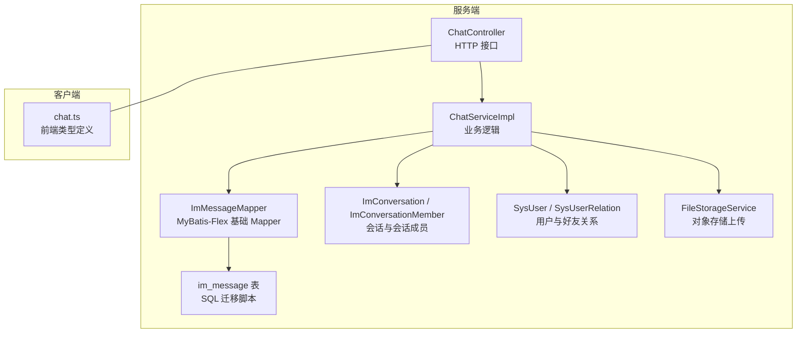
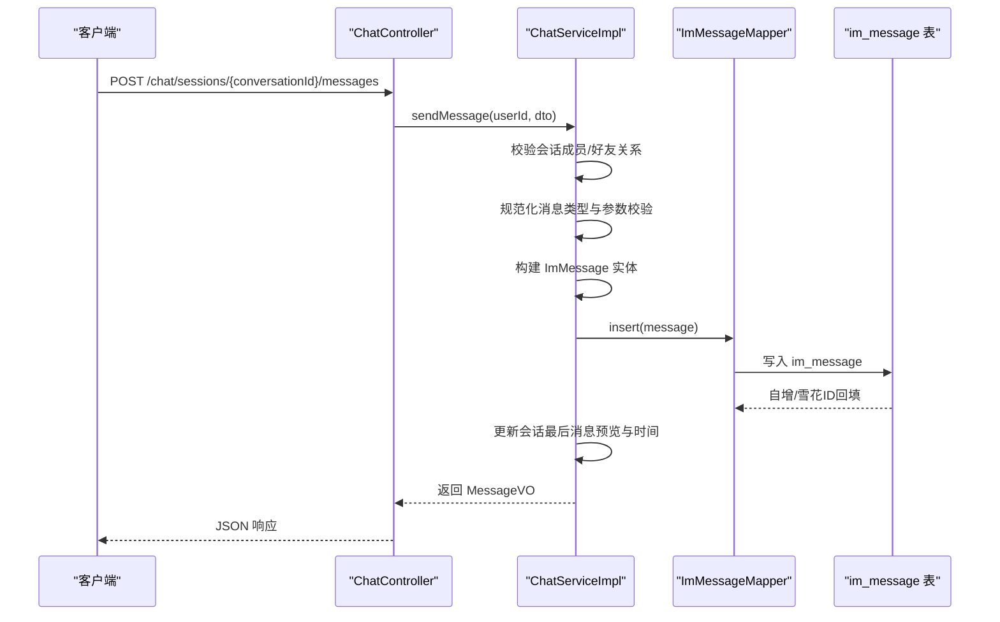
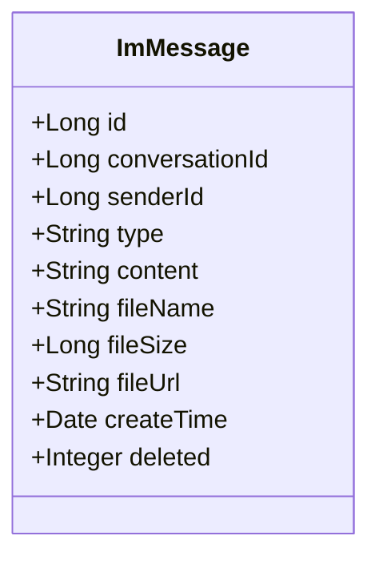
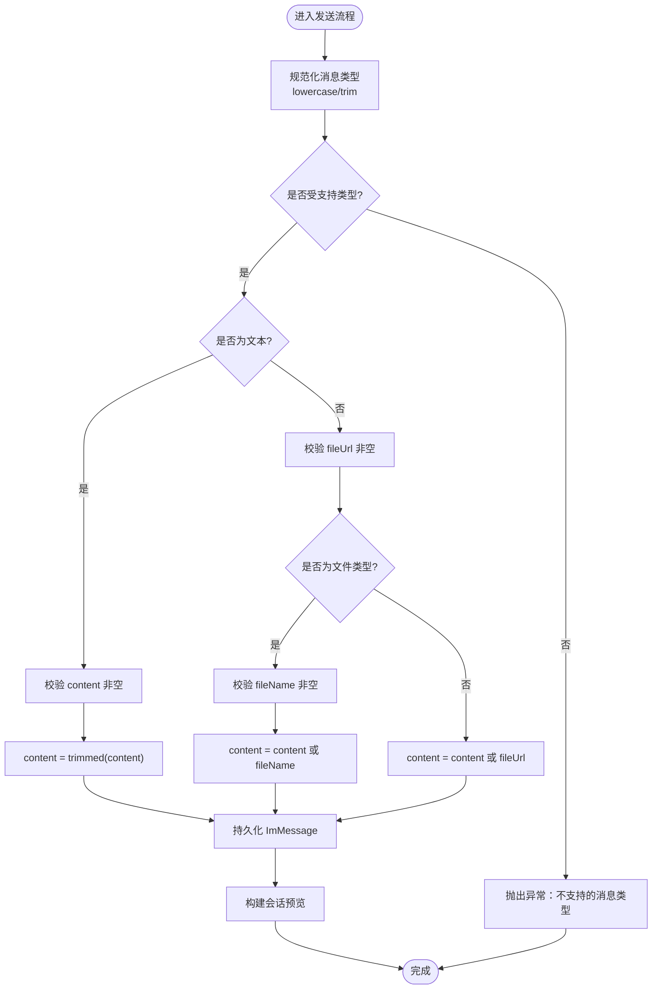
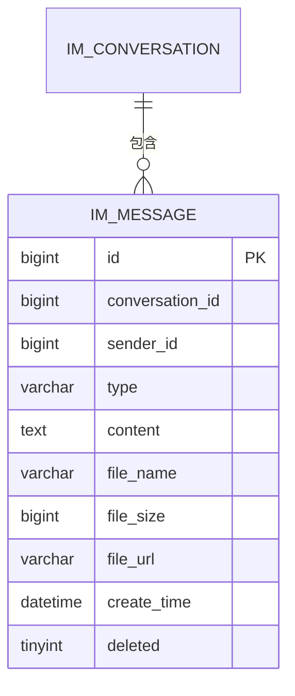
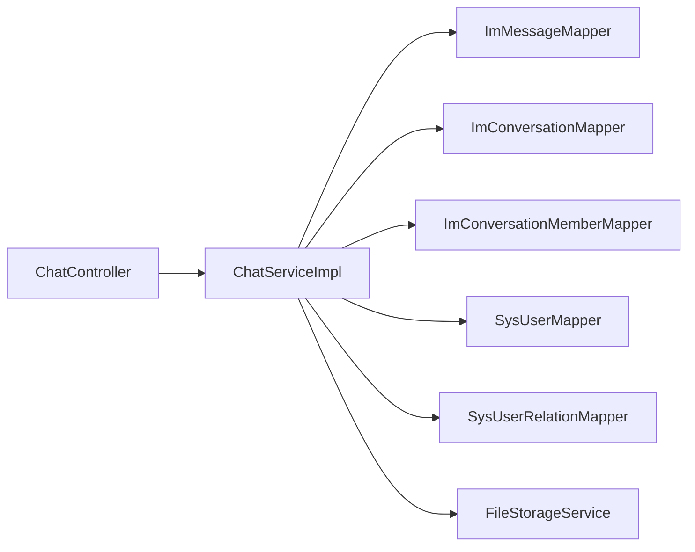

# 消息实体设计

<cite>
**本文引用的文件**
- [ImMessage.java](file://linkx-server/src/main/java/com/linkx/server/entity/ImMessage.java)
- [002_add_im_tables.sql](file://linkx-server/migrations/002_add_im_tables.sql)
- [SendMessageDTO.java](file://linkx-server/src/main/java/com/linkx/server/controller/dto/SendMessageDTO.java)
- [MessageVO.java](file://linkx-server/src/main/java/com/linkx/server/controller/vo/MessageVO.java)
- [ChatServiceImpl.java](file://linkx-server/src/main/java/com/linkx/server/service/impl/ChatServiceImpl.java)
- [ChatController.java](file://linkx-server/src/main/java/com/linkx/server/controller/ChatController.java)
- [chat.ts](file://linkx-client/src/types/chat.ts)
</cite>

## 目录
1. [简介](#简介)
2. [项目结构](#项目结构)
3. [核心组件](#核心组件)
4. [架构总览](#架构总览)
5. [详细组件分析](#详细组件分析)
6. [依赖关系分析](#依赖关系分析)
7. [性能与索引优化](#性能与索引优化)
8. [CRUD 与批量处理示例](#crud-与批量处理示例)
9. [故障排查指南](#故障排查指南)
10. [结论](#结论)

## 简介
本文件围绕 LinkX 即时消息模块中的消息实体（ImMessage）进行数据模型层面的系统化说明，覆盖字段定义、类型枚举、内容存储策略、状态流转机制、持久化设计与索引优化、查询性能考量，以及面向客户端与服务端的 CRUD 操作和最佳实践。文档旨在帮助开发者快速理解消息实体的设计意图与落地实现，并指导后续扩展与维护。

## 项目结构
与消息实体相关的关键代码分布在服务端与客户端：
- 服务端实体与映射：ImMessage 实体、数据库迁移脚本、消息发送 DTO、消息返回 VO、聊天服务实现、聊天控制器
- 客户端类型定义：前端消息类型与 WebSocket 载荷类型

图表来源
- [ChatController.java:1-72](file://linkx-server/src/main/java/com/linkx/server/controller/ChatController.java#L1-L72)
- [ChatServiceImpl.java:1-379](file://linkx-server/src/main/java/com/linkx/server/service/impl/ChatServiceImpl.java#L1-L379)
- [ImMessage.java:1-52](file://linkx-server/src/main/java/com/linkx/server/entity/ImMessage.java#L1-L52)
- [002_add_im_tables.sql:1-45](file://linkx-server/migrations/002_add_im_tables.sql#L1-L45)
- [chat.ts:1-57](file://linkx-client/src/types/chat.ts#L1-L57)

章节来源
- [ChatController.java:1-72](file://linkx-server/src/main/java/com/linkx/server/controller/ChatController.java#L1-L72)
- [ChatServiceImpl.java:1-379](file://linkx-server/src/main/java/com/linkx/server/service/impl/ChatServiceImpl.java#L1-L379)
- [ImMessage.java:1-52](file://linkx-server/src/main/java/com/linkx/server/entity/ImMessage.java#L1-L52)
- [002_add_im_tables.sql:1-45](file://linkx-server/migrations/002_add_im_tables.sql#L1-L45)
- [chat.ts:1-57](file://linkx-client/src/types/chat.ts#L1-L57)

## 核心组件
本节聚焦消息实体及其周边契约，梳理字段含义、类型约束与交互方式。

- 消息实体（ImMessage）
  - 主键 id：雪花算法生成，Long 类型
  - 会话标识 conversationId：关联会话
  - 发送者 senderId：消息发送方用户 ID
  - 消息类型 type：文本/图片/文件等
  - 消息内容 content：文本或预览摘要
  - 文件信息 fileName/fileSize/fileUrl：用于图片/文件类消息
  - 创建时间 createTime：插入时自动填充
  - 逻辑删除 deleted：软删除标记

- 消息类型枚举
  - 当前支持：text、image、file
  - 校验与归一化在服务端统一处理，拒绝未知类型

- 消息内容存储策略
  - 文本消息：content 存储实际文本
  - 图片/文件消息：content 可存缩略预览或回退为 fileUrl；同时记录 fileName、fileSize、fileUrl

- 消息状态
  - 当前未引入显式“已发送/已送达/已读”状态字段
  - 通过“最后一条消息预览与时间”在会话维度体现最新消息状态
  - 未来可扩展独立状态字段以支撑更细粒度回执

- 客户端类型对齐
  - 前端 MessageItem 与 WsSendPayload 的 type 限定为 text/image/file，与服务端保持一致

章节来源
- [ImMessage.java:1-52](file://linkx-server/src/main/java/com/linkx/server/entity/ImMessage.java#L1-L52)
- [SendMessageDTO.java:1-26](file://linkx-server/src/main/java/com/linkx/server/controller/dto/SendMessageDTO.java#L1-L26)
- [MessageVO.java:1-32](file://linkx-server/src/main/java/com/linkx/server/controller/vo/MessageVO.java#L1-L32)
- [ChatServiceImpl.java:333-377](file://linkx-server/src/main/java/com/linkx/server/service/impl/ChatServiceImpl.java#L333-L377)
- [chat.ts:15-46](file://linkx-client/src/types/chat.ts#L15-L46)

## 架构总览
下图展示从 HTTP 请求到消息落库与返回的整体流程，突出消息实体的写入路径与关键校验点。

图表来源
- [ChatController.java:44-53](file://linkx-server/src/main/java/com/linkx/server/controller/ChatController.java#L44-L53)
- [ChatServiceImpl.java:172-204](file://linkx-server/src/main/java/com/linkx/server/service/impl/ChatServiceImpl.java#L172-L204)
- [ImMessage.java:29-47](file://linkx-server/src/main/java/com/linkx/server/entity/ImMessage.java#L29-L47)
- [002_add_im_tables.sql:31-44](file://linkx-server/migrations/002_add_im_tables.sql#L31-L44)

## 详细组件分析

### 数据模型与字段语义
- 主键与时间戳
  - id：分布式唯一主键，避免热点分片冲突
  - createTime：插入时自动填充，便于排序与分页
- 会话与发送者
  - conversationId：消息归属会话，作为查询主维度
  - senderId：消息发送人，用于展示与权限校验
- 类型与内容
  - type：text/image/file，由服务端统一归一化与校验
  - content：文本消息为正文；媒体消息可为预览或回退 URL
- 文件元数据
  - fileName/fileSize/fileUrl：用于图片/文件消息的展示与下载
- 软删除
  - deleted：逻辑删除标记，便于审计与恢复

图表来源
- [ImMessage.java:16-51](file://linkx-server/src/main/java/com/linkx/server/entity/ImMessage.java#L16-L51)

章节来源
- [ImMessage.java:16-51](file://linkx-server/src/main/java/com/linkx/server/entity/ImMessage.java#L16-L51)
- [002_add_im_tables.sql:31-44](file://linkx-server/migrations/002_add_im_tables.sql#L31-L44)

### 消息类型与内容存储策略
- 类型枚举
  - 文本：type=text，content 为文本正文
  - 图片：type=image，content 优先使用传入的预览，否则回退为 fileUrl
  - 文件：type=file，content 优先使用传入的摘要，否则回退为 fileName
- 参数校验
  - 文本消息要求 content 非空
  - 图片/文件消息要求 fileUrl 非空；文件消息额外要求 fileName 非空
- 内容解析与预览构建
  - 根据 type 决定最终 content 取值
  - 会话列表预览按类型生成简短提示（如“[图片]”、“[文件] xxx”）

图表来源
- [ChatServiceImpl.java:333-377](file://linkx-server/src/main/java/com/linkx/server/service/impl/ChatServiceImpl.java#L333-L377)

章节来源
- [ChatServiceImpl.java:333-377](file://linkx-server/src/main/java/com/linkx/server/service/impl/ChatServiceImpl.java#L333-L377)

### 消息状态流转机制
- 现状
  - 未定义独立的“已发送/已送达/已读”状态字段
  - 通过会话维度的 last_message_content 与 last_message_time 反映最新状态
- 建议扩展（概念性）
  - 可在 ImMessage 增加 status 字段（如 SENT/DELIVERED/READ），并在推送/回执链路中更新
  - 结合 Redis 缓存最近 N 条消息的状态，加速前端渲染与去重

章节来源
- [ChatServiceImpl.java:196-204](file://linkx-server/src/main/java/com/linkx/server/service/impl/ChatServiceImpl.java#L196-L204)

### 持久化设计与索引优化
- 表结构与主键
  - id 为主键，采用雪花算法保证全局唯一且有序
- 索引策略
  - 复合索引 idx_conv_time(conversation_id, create_time)：高效支持会话内按时间倒序分页查询
- 字段类型
  - content 使用 TEXT，适合存储较长文本或预览
  - file_url 使用 VARCHAR(500)，满足常见对象存储地址长度
- 软删除
  - deleted 字段配合框架注解实现逻辑删除，便于审计与恢复

图表来源
- [002_add_im_tables.sql:31-44](file://linkx-server/migrations/002_add_im_tables.sql#L31-L44)

章节来源
- [002_add_im_tables.sql:31-44](file://linkx-server/migrations/002_add_im_tables.sql#L31-L44)

### 查询性能考虑
- 会话历史分页
  - 基于 beforeMessageId 的时间游标分页，避免深分页开销
  - 默认限制 50 条，最大不超过 100 条，防止大结果集拖慢响应
- 排序与过滤
  - 先按 create_time 降序取窗口，再在内存中升序排列，确保 UI 顺序正确
- 关联信息加载
  - 批量加载发送者信息，减少 N+1 查询

章节来源
- [ChatServiceImpl.java:135-168](file://linkx-server/src/main/java/com/linkx/server/service/impl/ChatServiceImpl.java#L135-L168)

## 依赖关系分析
- 控制器层
  - ChatController 暴露 REST 接口，负责鉴权与参数解析
- 服务层
  - ChatServiceImpl 实现核心业务：会话校验、消息发送、历史查询、文件上传
- 数据访问层
  - ImMessageMapper 继承 MyBatis-Flex BaseMapper，提供基础 CRUD
- 外部依赖
  - FileStorageService 负责对象存储上传，返回 URL 供消息体引用

图表来源
- [ChatController.java:1-72](file://linkx-server/src/main/java/com/linkx/server/controller/ChatController.java#L1-L72)
- [ChatServiceImpl.java:1-52](file://linkx-server/src/main/java/com/linkx/server/service/impl/ChatServiceImpl.java#L1-L52)
- [ImMessageMapper.java:1-10](file://linkx-server/src/main/java/com/linkx/server/mapper/ImMessageMapper.java#L1-L10)

章节来源
- [ChatController.java:1-72](file://linkx-server/src/main/java/com/linkx/server/controller/ChatController.java#L1-L72)
- [ChatServiceImpl.java:1-52](file://linkx-server/src/main/java/com/linkx/server/service/impl/ChatServiceImpl.java#L1-L52)
- [ImMessageMapper.java:1-10](file://linkx-server/src/main/java/com/linkx/server/mapper/ImMessageMapper.java#L1-L10)

## 性能与索引优化
- 索引
  - 会话维度复合索引 (conversation_id, create_time) 保障历史查询效率
- 分页
  - 基于时间游标的分页，避免 OFFSET 深翻页
- 限流
  - 单次查询上限 100 条，降低大结果集对 CPU/IO 的压力
- 序列化
  - 长整型 ID 使用 ToStringSerializer 输出字符串，避免前端精度丢失
- 内容压缩
  - 对于超大文本，建议在应用层做截断或压缩后再入库

章节来源
- [MessageVO.java:12-13](file://linkx-server/src/main/java/com/linkx/server/controller/vo/MessageVO.java#L12-L13)
- [ChatServiceImpl.java:42-44](file://linkx-server/src/main/java/com/linkx/server/service/impl/ChatServiceImpl.java#L42-L44)
- [002_add_im_tables.sql:43](file://linkx-server/migrations/002_add_im_tables.sql#L43)

## CRUD 与批量处理示例
以下示例仅描述调用方式与参数约定，不包含具体代码片段。

- 创建（发送消息）
  - 接口：POST /chat/sessions/{conversationId}/messages
  - 入参：
    - conversationId：会话 ID
    - msgType：text | image | file
    - content：文本消息必填；媒体消息可选（回退规则见上文）
    - fileName/fileSize/fileUrl：媒体消息必填项
  - 出参：MessageVO，包含 id、senderId、type、content、createTime 等
  - 参考路径
    - [ChatController.java:44-53](file://linkx-server/src/main/java/com/linkx/server/controller/ChatController.java#L44-L53)
    - [SendMessageDTO.java:1-26](file://linkx-server/src/main/java/com/linkx/server/controller/dto/SendMessageDTO.java#L1-L26)
    - [ChatServiceImpl.java:172-204](file://linkx-server/src/main/java/com/linkx/server/service/impl/ChatServiceImpl.java#L172-L204)

- 读取（会话历史）
  - 接口：GET /chat/sessions/{conversationId}/messages?before={messageId}&limit=50
  - 行为：按 create_time 倒序取窗口，再正序返回；before 为空则从头开始
  - 参考路径
    - [ChatController.java:44-53](file://linkx-server/src/main/java/com/linkx/server/controller/ChatController.java#L44-L53)
    - [ChatServiceImpl.java:135-168](file://linkx-server/src/main/java/com/linkx/server/service/impl/ChatServiceImpl.java#L135-L168)

- 更新（扩展建议）
  - 当前未提供直接更新消息内容的接口
  - 若需撤回/编辑，可在 ImMessage 增加 status 与 editTime，并提供专用接口
  - 参考路径
    - [ImMessage.java:46-50](file://linkx-server/src/main/java/com/linkx/server/entity/ImMessage.java#L46-L50)

- 删除（软删除）
  - 通过 deleted 字段实现逻辑删除
  - 查询时需排除 deleted=1 的记录（框架注解已启用逻辑删除）
  - 参考路径
    - [ImMessage.java:49-50](file://linkx-server/src/main/java/com/linkx/server/entity/ImMessage.java#L49-L50)

- 批量处理模式（建议）
  - 批量发送：将多条消息合并为一次事务写入，提升吞吐
  - 批量拉取：使用 before 游标分页，避免一次性拉取过多
  - 参考路径
    - [ChatServiceImpl.java:135-168](file://linkx-server/src/main/java/com/linkx/server/service/impl/ChatServiceImpl.java#L135-L168)

- 消息历史查询最佳实践
  - 使用 before 游标分页，避免深翻页
  - 合理设置 limit，默认 50，最大 100
  - 对发送者信息进行批量加载，减少 N+1 查询
  - 参考路径
    - [ChatServiceImpl.java:135-168](file://linkx-server/src/main/java/com/linkx/server/service/impl/ChatServiceImpl.java#L135-L168)

章节来源
- [ChatController.java:44-53](file://linkx-server/src/main/java/com/linkx/server/controller/ChatController.java#L44-L53)
- [SendMessageDTO.java:1-26](file://linkx-server/src/main/java/com/linkx/server/controller/dto/SendMessageDTO.java#L1-L26)
- [ChatServiceImpl.java:135-204](file://linkx-server/src/main/java/com/linkx/server/service/impl/ChatServiceImpl.java#L135-L204)
- [ImMessage.java:46-50](file://linkx-server/src/main/java/com/linkx/server/entity/ImMessage.java#L46-L50)

## 故障排查指南
- 常见错误
  - 会话不存在：检查 conversationId 是否正确，确认会话存在
  - 无权访问该会话：确认当前用户为会话成员
  - 只能与好友聊天：私聊场景需双方为好友关系
  - 不支持的消息类型：msgType 必须为 text/image/file
  - 参数缺失：文本消息缺少 content；媒体消息缺少 fileUrl；文件消息缺少 fileName
- 定位要点
  - 查看控制器日志与异常堆栈
  - 核对数据库索引是否存在（idx_conv_time）
  - 检查对象存储上传是否成功并返回有效 URL
- 参考路径
  - [ChatServiceImpl.java:229-250](file://linkx-server/src/main/java/com/linkx/server/service/impl/ChatServiceImpl.java#L229-L250)
  - [ChatServiceImpl.java:333-359](file://linkx-server/src/main/java/com/linkx/server/service/impl/ChatServiceImpl.java#L333-L359)

章节来源
- [ChatServiceImpl.java:229-250](file://linkx-server/src/main/java/com/linkx/server/service/impl/ChatServiceImpl.java#L229-L250)
- [ChatServiceImpl.java:333-359](file://linkx-server/src/main/java/com/linkx/server/service/impl/ChatServiceImpl.java#L333-L359)

## 结论
LinkX 的消息实体以简洁而实用的设计覆盖了文本、图片、文件三类核心场景。通过合理的类型归一化、内容回退策略、会话预览更新与基于时间的游标分页，系统在易用性与性能之间取得良好平衡。未来如需更精细的状态追踪（已发送/已送达/已读），可在不破坏现有结构的前提下扩展状态字段与相应接口，并结合缓存进一步优化实时体验。