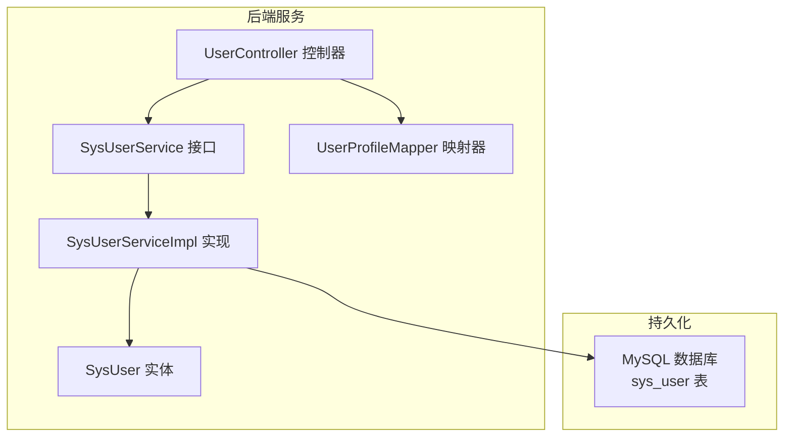
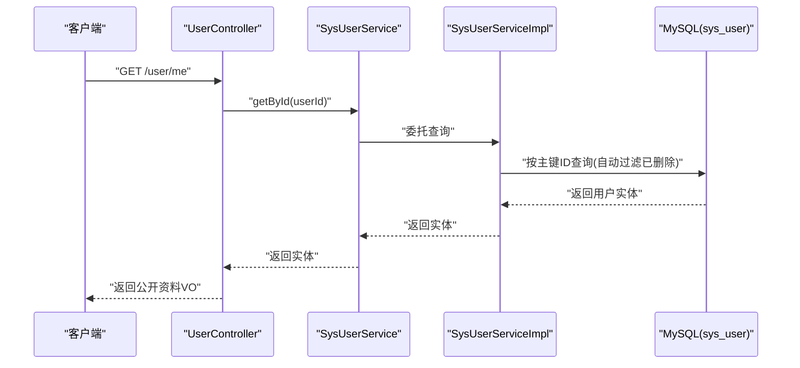
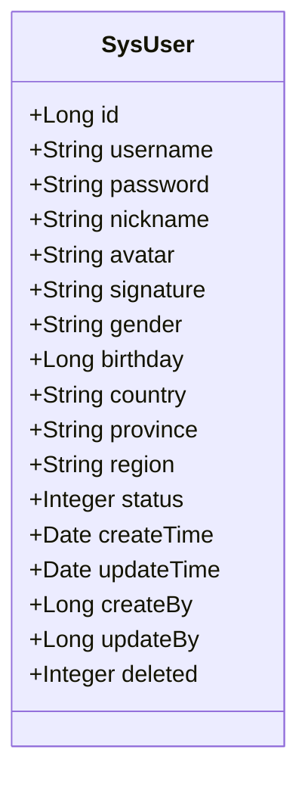
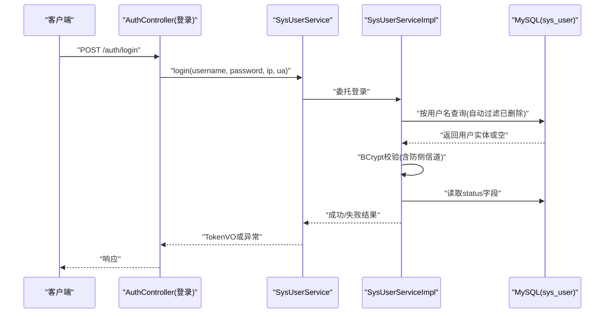
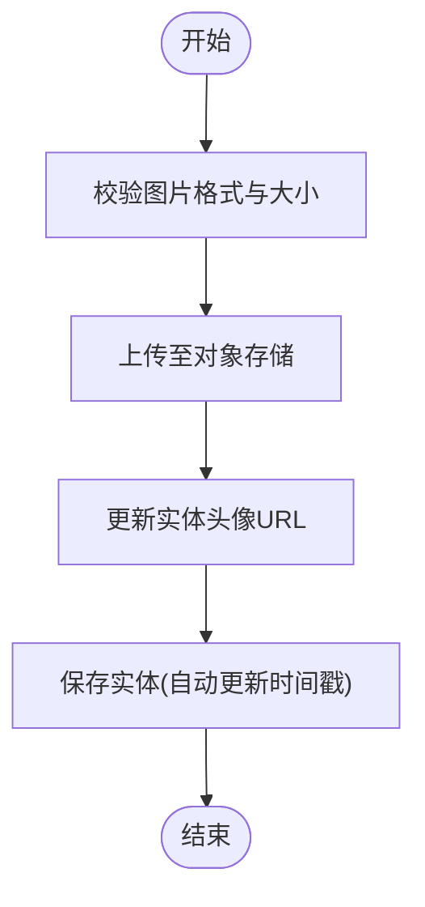
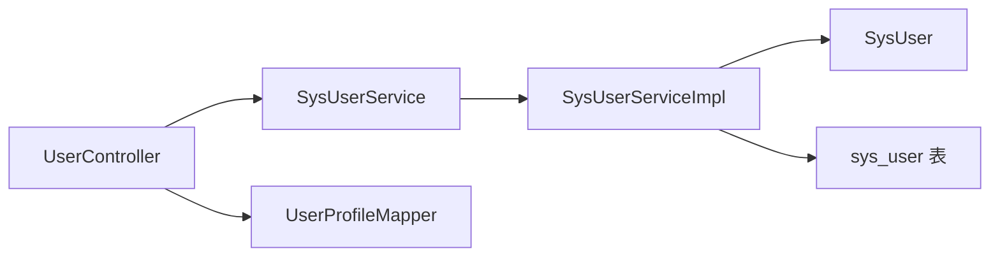

# 用户实体设计

<cite>
**本文引用的文件列表**
- [SysUser.java](file://linkx-server/src/main/java/com/linkx/server/entity/SysUser.java)
- [init.sql](file://linkx-server/init.sql)
- [001_add_user_profile_and_friend_tables.sql](file://linkx-server/migrations/001_add_user_profile_and_friend_tables.sql)
- [SysUserService.java](file://linkx-server/src/main/java/com/linkx/server/service/SysUserService.java)
- [SysUserServiceImpl.java](file://linkx-server/src/main/java/com/linkx/server/service/impl/SysUserServiceImpl.java)
- [UserController.java](file://linkx-server/src/main/java/com/linkx/server/controller/UserController.java)
- [UserProfileMapper.java](file://linkx-server/src/main/java/com/linkx/server/common/UserProfileMapper.java)
</cite>

## 目录
1. [简介](#简介)
2. [项目结构](#项目结构)
3. [核心组件](#核心组件)
4. [架构总览](#架构总览)
5. [详细组件分析](#详细组件分析)
6. [依赖关系分析](#依赖关系分析)
7. [性能与索引设计](#性能与索引设计)
8. [故障排查指南](#故障排查指南)
9. [结论](#结论)
10. [附录：字段定义与业务规则](#附录字段定义与业务规则)

## 简介
本文件面向 LinkX 项目的系统用户实体 SysUser，提供完整的数据模型文档。内容覆盖字段定义、主键生成策略（雪花算法）、状态管理、时间戳与审计字段、逻辑删除机制、类型映射、业务规则验证、数据库索引设计，以及使用示例与最佳实践。读者无需深入代码即可理解该实体的设计与用法。

## 项目结构
SysUser 作为后端数据模型，位于 linkx-server 模块的 entity 包中；其对应的数据库表在 init.sql 和迁移脚本中定义；服务层与控制器层围绕该实体完成注册、登录、资料更新与头像上传等能力。

图表来源
- [SysUser.java:1-97](file://linkx-server/src/main/java/com/linkx/server/entity/SysUser.java#L1-L97)
- [SysUserService.java:1-34](file://linkx-server/src/main/java/com/linkx/server/service/SysUserService.java#L1-L34)
- [SysUserServiceImpl.java:1-175](file://linkx-server/src/main/java/com/linkx/server/service/impl/SysUserServiceImpl.java#L1-L175)
- [UserController.java:1-145](file://linkx-server/src/main/java/com/linkx/server/controller/UserController.java#L1-L145)
- [UserProfileMapper.java:1-52](file://linkx-server/src/main/java/com/linkx/server/common/UserProfileMapper.java#L1-L52)
- [init.sql:9-29](file://linkx-server/init.sql#L9-L29)

章节来源
- [SysUser.java:1-97](file://linkx-server/src/main/java/com/linkx/server/entity/SysUser.java#L1-L97)
- [init.sql:9-29](file://linkx-server/init.sql#L9-L29)

## 核心组件
- 实体类 SysUser：与数据库表 sys_user 一一对应，包含用户基础信息、状态、时间戳、审计与逻辑删除标记。
- 服务层 SysUserService 及其实现：封装注册、登录、资料更新、头像更新等业务逻辑，并处理密码哈希、限流、审计记录等。
- 控制器 UserController：暴露用户资料查询、资料更新、头像上传等 HTTP 接口。
- 映射器 UserProfileMapper：将实体转换为对外展示的 VO，屏蔽敏感字段。

章节来源
- [SysUser.java:1-97](file://linkx-server/src/main/java/com/linkx/server/entity/SysUser.java#L1-L97)
- [SysUserService.java:1-34](file://linkx-server/src/main/java/com/linkx/server/service/SysUserService.java#L1-L34)
- [SysUserServiceImpl.java:1-175](file://linkx-server/src/main/java/com/linkx/server/service/impl/SysUserServiceImpl.java#L1-L175)
- [UserController.java:1-145](file://linkx-server/src/main/java/com/linkx/server/controller/UserController.java#L1-L145)
- [UserProfileMapper.java:1-52](file://linkx-server/src/main/java/com/linkx/server/common/UserProfileMapper.java#L1-L52)

## 架构总览
下图展示从控制器到服务再到实体与数据库的调用链路，体现用户资料相关能力的端到端流程。

图表来源
- [UserController.java:36-49](file://linkx-server/src/main/java/com/linkx/server/controller/UserController.java#L36-L49)
- [SysUserService.java:11-11](file://linkx-server/src/main/java/com/linkx/server/service/SysUserService.java#L11-L11)
- [SysUserServiceImpl.java:101-152](file://linkx-server/src/main/java/com/linkx/server/service/impl/SysUserServiceImpl.java#L101-L152)
- [SysUser.java:44-96](file://linkx-server/src/main/java/com/linkx/server/entity/SysUser.java#L44-L96)
- [init.sql:9-29](file://linkx-server/init.sql#L9-L29)

## 详细组件分析

### 实体类 SysUser 分析
- 主键 ID：采用雪花算法自动生成，避免手动赋值，保证分布式唯一性。
- 账号与密码：username 为登录账号，password 存储 BCrypt 哈希值，禁止明文。
- 个人资料：nickname、avatar、signature、gender、birthday、country、province、region。
- 状态与时间：status 表示正常/停用；createTime、updateTime 由数据库默认值维护。
- 审计字段：createBy、updateBy 用于记录创建人与修改人。
- 逻辑删除：deleted 标记位，查询时自动过滤已删除记录。

图表来源
- [SysUser.java:44-96](file://linkx-server/src/main/java/com/linkx/server/entity/SysUser.java#L44-L96)

章节来源
- [SysUser.java:1-97](file://linkx-server/src/main/java/com/linkx/server/entity/SysUser.java#L1-L97)

### 注册与登录流程中的实体使用
- 注册：校验用户名唯一性，对密码进行 BCrypt 哈希后写入实体，设置默认头像与状态。
- 登录：根据用户名查询实体，执行防侧信道的时间消耗校验，检查账号状态，成功后签发令牌。

图表来源
- [SysUserServiceImpl.java:59-99](file://linkx-server/src/main/java/com/linkx/server/service/impl/SysUserServiceImpl.java#L59-L99)
- [SysUser.java:78-79](file://linkx-server/src/main/java/com/linkx/server/entity/SysUser.java#L78-L79)
- [init.sql:9-29](file://linkx-server/init.sql#L9-L29)

章节来源
- [SysUserServiceImpl.java:34-99](file://linkx-server/src/main/java/com/linkx/server/service/impl/SysUserServiceImpl.java#L34-L99)

### 资料更新与头像上传
- 资料更新：按需更新昵称、签名、性别、生日、地区信息，仅当有变更时才落库。
- 头像上传：先校验图片格式，再上传至对象存储，最后更新实体头像字段并保存。

图表来源
- [UserController.java:70-100](file://linkx-server/src/main/java/com/linkx/server/controller/UserController.java#L70-L100)
- [SysUserServiceImpl.java:154-173](file://linkx-server/src/main/java/com/linkx/server/service/impl/SysUserServiceImpl.java#L154-L173)
- [SysUser.java:57-58](file://linkx-server/src/main/java/com/linkx/server/entity/SysUser.java#L57-L58)

章节来源
- [UserController.java:70-100](file://linkx-server/src/main/java/com/linkx/server/controller/UserController.java#L70-L100)
- [SysUserServiceImpl.java:154-173](file://linkx-server/src/main/java/com/linkx/server/service/impl/SysUserServiceImpl.java#L154-L173)

### 对外展示映射
- 通过 UserProfileMapper 将实体转换为公开资料 VO，屏蔽敏感字段（如密码），统一输出格式。

章节来源
- [UserProfileMapper.java:15-32](file://linkx-server/src/main/java/com/linkx/server/common/UserProfileMapper.java#L15-L32)
- [UserProfileMapper.java:34-50](file://linkx-server/src/main/java/com/linkx/server/common/UserProfileMapper.java#L34-L50)

## 依赖关系分析
- 实体与数据库：SysUser 注解映射到 sys_user 表，主键生成策略与逻辑删除由框架配置驱动。
- 服务与实体：服务层通过 MyBatis-Flex 的 IService 扩展方法访问实体，自动应用逻辑删除过滤。
- 控制器与服务：控制器负责参数校验、鉴权解析与结果包装，不直接操作实体。

图表来源
- [UserController.java:1-145](file://linkx-server/src/main/java/com/linkx/server/controller/UserController.java#L1-L145)
- [SysUserService.java:1-34](file://linkx-server/src/main/java/com/linkx/server/service/SysUserService.java#L1-L34)
- [SysUserServiceImpl.java:1-175](file://linkx-server/src/main/java/com/linkx/server/service/impl/SysUserServiceImpl.java#L1-L175)
- [SysUser.java:1-97](file://linkx-server/src/main/java/com/linkx/server/entity/SysUser.java#L1-L97)
- [init.sql:9-29](file://linkx-server/init.sql#L9-L29)

章节来源
- [SysUser.java:1-97](file://linkx-server/src/main/java/com/linkx/server/entity/SysUser.java#L1-L97)
- [SysUserServiceImpl.java:1-175](file://linkx-server/src/main/java/com/linkx/server/service/impl/SysUserServiceImpl.java#L1-L175)
- [UserController.java:1-145](file://linkx-server/src/main/java/com/linkx/server/controller/UserController.java#L1-L145)

## 性能与索引设计
- 主键索引：id 为主键，雪花算法生成，具备高并发下的全局唯一性与有序性优势。
- 唯一索引：username 建立唯一索引 uk_username，保障登录账号唯一，提升登录与注册时的查找效率。
- 逻辑删除：deleted 字段配合框架自动过滤，避免物理删除带来的级联与数据恢复成本。
- 时间戳：createTime 与 updateTime 由数据库默认值维护，减少应用层开销。
- 建议索引：若后续频繁按地区检索用户，可考虑在 country/province/region 上建立复合索引；当前未定义，需结合查询场景评估。

章节来源
- [init.sql:9-29](file://linkx-server/init.sql#L9-L29)
- [SysUser.java:44-96](file://linkx-server/src/main/java/com/linkx/server/entity/SysUser.java#L44-L96)

## 故障排查指南
- 登录失败：
  - 可能原因：用户名不存在、密码错误、账号被停用、触发限流。
  - 排查要点：确认用户名是否存在且未被逻辑删除；检查 status 是否为正常；查看登录审计记录与限流计数。
- 注册冲突：
  - 可能原因：用户名重复。
  - 排查要点：查询 username 唯一索引是否冲突；确保前端提示清晰。
- 头像上传失败：
  - 可能原因：文件格式不支持、存储上传异常。
  - 排查要点：校验图片格式与大小；检查对象存储服务连通性与权限。
- 资料更新无效果：
  - 可能原因：请求体为空或未变更字段。
  - 排查要点：确认 DTO 字段非空；观察服务层是否执行了更新。

章节来源
- [SysUserServiceImpl.java:59-99](file://linkx-server/src/main/java/com/linkx/server/service/impl/SysUserServiceImpl.java#L59-L99)
- [SysUserServiceImpl.java:34-57](file://linkx-server/src/main/java/com/linkx/server/service/impl/SysUserServiceImpl.java#L34-L57)
- [UserController.java:70-100](file://linkx-server/src/main/java/com/linkx/server/controller/UserController.java#L70-L100)

## 结论
SysUser 实体以简洁清晰的字段设计承载用户核心信息，结合雪花主键、逻辑删除与时间戳/审计字段，满足高可用与可追溯要求。服务层与控制器层围绕该实体实现了安全的注册登录与资料管理能力。建议在后续迭代中根据实际查询模式补充合适的索引，并持续完善输入校验与错误提示。

## 附录：字段定义与业务规则

### 字段定义与类型映射
- id：BIGINT，雪花算法主键，分布式唯一。
- username：VARCHAR(64)，登录账号，唯一索引。
- password：VARCHAR(255)，BCrypt 哈希值，禁止明文。
- nickname：VARCHAR(64)，用户昵称。
- avatar：VARCHAR(255)，头像 URL。
- signature：VARCHAR(255)，个性签名。
- gender：VARCHAR(8)，性别（男/女）。
- birthday：BIGINT，生日毫秒时间戳。
- country：VARCHAR(64)，国家。
- province：VARCHAR(64)，省份。
- region：VARCHAR(64)，地区。
- status：TINYINT，状态（1=正常，0=停用）。
- createTime：DATETIME，创建时间，默认 CURRENT_TIMESTAMP。
- updateTime：DATETIME，更新时间，ON UPDATE CURRENT_TIMESTAMP。
- createBy：BIGINT，创建人 ID。
- updateBy：BIGINT，修改人 ID。
- deleted：TINYINT(1)，逻辑删除（0=未删除，1=已删除），查询自动过滤。

章节来源
- [init.sql:9-29](file://linkx-server/init.sql#L9-L29)
- [SysUser.java:44-96](file://linkx-server/src/main/java/com/linkx/server/entity/SysUser.java#L44-L96)

### 业务规则与约束
- 账号唯一性：username 必须唯一，注册时需校验。
- 密码安全：必须使用 BCrypt 哈希存储，禁止明文。
- 状态控制：登录前检查 status，停用的账号禁止登录。
- 时间戳维护：createTime 与 updateTime 由数据库默认值维护。
- 审计追踪：createBy、updateBy 可用于记录操作者（可选）。
- 逻辑删除：deleted 标记位，所有查询自动排除已删除记录。

章节来源
- [SysUserServiceImpl.java:34-99](file://linkx-server/src/main/java/com/linkx/server/service/impl/SysUserServiceImpl.java#L34-L99)
- [SysUser.java:78-96](file://linkx-server/src/main/java/com/linkx/server/entity/SysUser.java#L78-L96)

### 数据库索引设计说明
- 主键索引：id。
- 唯一索引：uk_username(username)。
- 其他索引：当前未定义额外索引；可按查询需求评估添加。

章节来源
- [init.sql:9-29](file://linkx-server/init.sql#L9-L29)

### 使用示例与最佳实践
- 注册示例：
  - 步骤：接收注册 DTO -> 校验用户名唯一 -> BCrypt 哈希密码 -> 构建 SysUser -> 保存。
  - 参考路径：[注册实现:34-57](file://linkx-server/src/main/java/com/linkx/server/service/impl/SysUserServiceImpl.java#L34-L57)
- 登录示例：
  - 步骤：接收登录 DTO -> 检查限流 -> 按用户名查询 -> BCrypt 校验 -> 检查状态 -> 签发令牌。
  - 参考路径：[登录实现:59-99](file://linkx-server/src/main/java/com/linkx/server/service/impl/SysUserServiceImpl.java#L59-99)
- 资料更新示例：
  - 步骤：获取当前用户 -> 按需更新字段 -> 保存并返回公开资料 VO。
  - 参考路径：[资料更新:101-152](file://linkx-server/src/main/java/com/linkx/server/service/impl/SysUserServiceImpl.java#L101-152)、[公开资料映射:15-32](file://linkx-server/src/main/java/com/linkx/server/common/UserProfileMapper.java#L15-32)
- 头像上传示例：
  - 步骤：校验图片 -> 上传对象存储 -> 更新实体头像 -> 保存。
  - 参考路径：[头像上传:70-100](file://linkx-server/src/main/java/com/linkx/server/controller/UserController.java#L70-100)、[头像更新实现:154-173](file://linkx-server/src/main/java/com/linkx/server/service/impl/SysUserServiceImpl.java#L154-173)

章节来源
- [SysUserServiceImpl.java:34-173](file://linkx-server/src/main/java/com/linkx/server/service/impl/SysUserServiceImpl.java#L34-L173)
- [UserController.java:70-100](file://linkx-server/src/main/java/com/linkx/server/controller/UserController.java#L70-L100)
- [UserProfileMapper.java:15-32](file://linkx-server/src/main/java/com/linkx/server/common/UserProfileMapper.java#L15-L32)