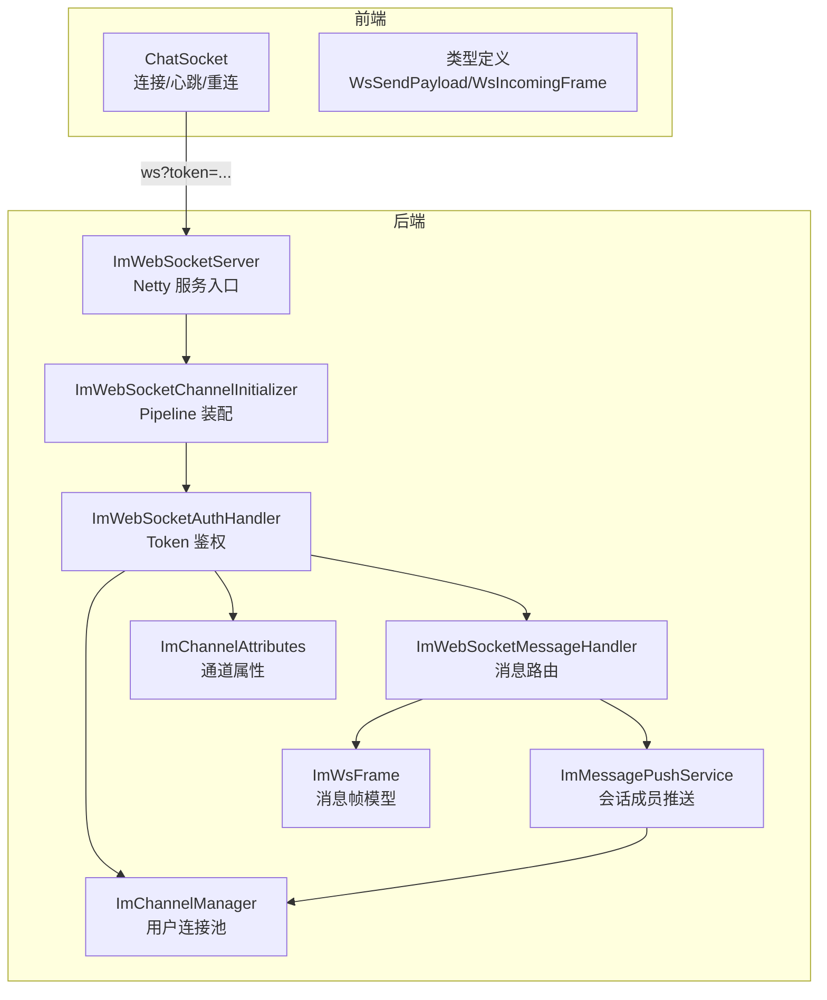
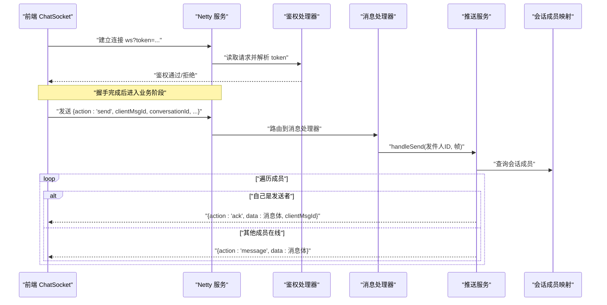
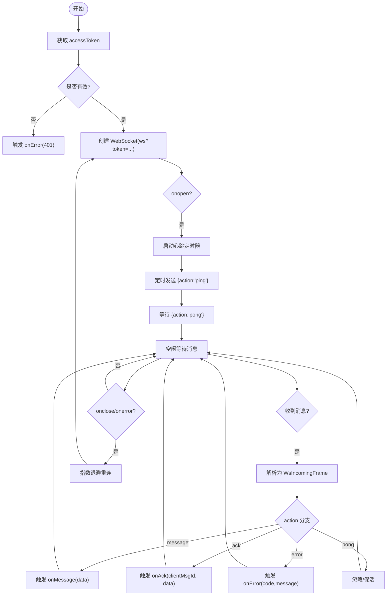
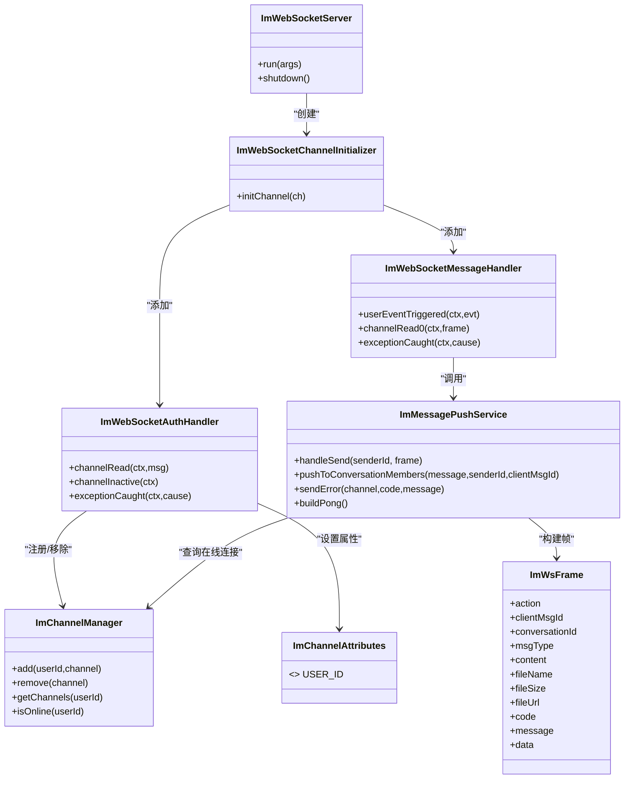
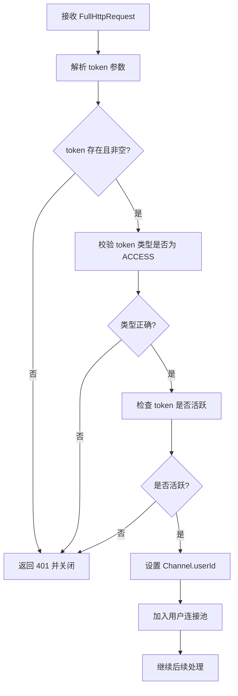
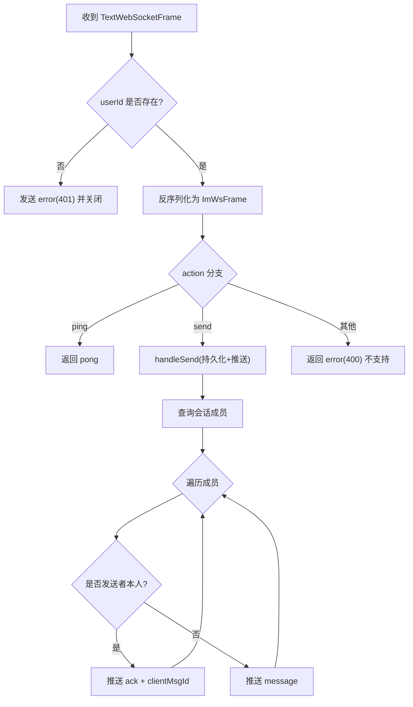
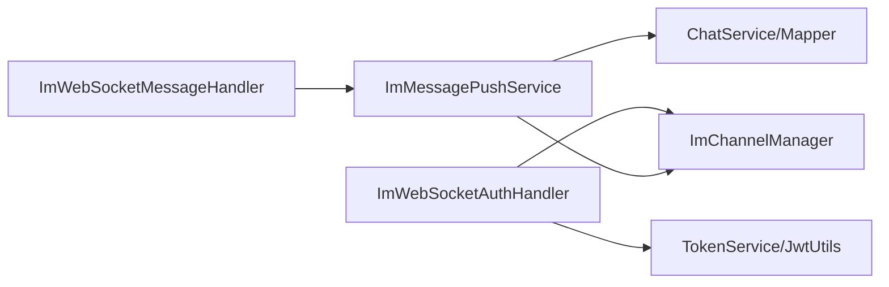

# WebSocket 实时通信

<cite>
**本文引用的文件**
- [chatSocket.ts](file://linkx-client/src/utils/chatSocket.ts)
- [chat.ts](file://linkx-client/src/types/chat.ts)
- [ImWebSocketServer.java](file://linkx-server/src/main/java/com/linkx/server/im/ImWebSocketServer.java)
- [ImWebSocketChannelInitializer.java](file://linkx-server/src/main/java/com/linkx/server/im/ImWebSocketChannelInitializer.java)
- [ImWebSocketAuthHandler.java](file://linkx-server/src/main/java/com/linkx/server/im/ImWebSocketAuthHandler.java)
- [ImWebSocketMessageHandler.java](file://linkx-server/src/main/java/com/linkx/server/im/ImWebSocketMessageHandler.java)
- [ImMessagePushService.java](file://linkx-server/src/main/java/com/linkx/server/im/ImMessagePushService.java)
- [ImChannelManager.java](file://linkx-server/src/main/java/com/linkx/server/im/ImChannelManager.java)
- [ImChannelAttributes.java](file://linkx-server/src/main/java/com/linkx/server/im/ImChannelAttributes.java)
- [ImWsFrame.java](file://linkx-server/src/main/java/com/linkx/server/im/ImWsFrame.java)
- [application.yml](file://linkx-server/src/main/resources/application.yml)
</cite>

## 目录
1. [简介](#简介)
2. [项目结构](#项目结构)
3. [核心组件](#核心组件)
4. [架构总览](#架构总览)
5. [详细组件分析](#详细组件分析)
6. [依赖关系分析](#依赖关系分析)
7. [性能考虑](#性能考虑)
8. [故障排查指南](#故障排查指南)
9. [结论](#结论)
10. [附录：协议规范与集成示例](#附录协议规范与集成示例)

## 简介
本技术文档围绕 LinkX 的 WebSocket 实时通信模块，系统性阐述前后端实现与交互流程。内容涵盖前端 ChatSocket 连接管理、心跳机制、自动重连策略与错误处理；后端基于 Netty 的 WebSocket 服务器配置、握手认证、消息帧格式定义与路由分发；并提供完整的消息协议规范、客户端集成要点与排障建议。

## 项目结构
本项目采用前后端分离架构：
- 前端（Vue + TypeScript）通过 chatSocket.ts 封装 WebSocket 连接、心跳与重连逻辑，并基于 chat.ts 中类型定义进行消息编解码。
- 后端（Spring Boot + Netty）通过 ImWebSocketServer 启动独立端口监听，使用 ImWebSocketChannelInitializer 装配 Netty Pipeline，完成 HTTP 编解码、鉴权、协议升级与业务处理。

图表来源
- [ImWebSocketServer.java:1-82](file://linkx-server/src/main/java/com/linkx/server/im/ImWebSocketServer.java#L1-L82)
- [ImWebSocketChannelInitializer.java:1-38](file://linkx-server/src/main/java/com/linkx/server/im/ImWebSocketChannelInitializer.java#L1-L38)
- [ImWebSocketAuthHandler.java:1-81](file://linkx-server/src/main/java/com/linkx/server/im/ImWebSocketAuthHandler.java#L1-L81)
- [ImWebSocketMessageHandler.java:1-62](file://linkx-server/src/main/java/com/linkx/server/im/ImWebSocketMessageHandler.java#L1-L62)
- [ImMessagePushService.java:1-136](file://linkx-server/src/main/java/com/linkx/server/im/ImMessagePushService.java#L1-L136)
- [ImChannelManager.java:1-41](file://linkx-server/src/main/java/com/linkx/server/im/ImChannelManager.java#L1-L41)
- [ImChannelAttributes.java:1-12](file://linkx-server/src/main/java/com/linkx/server/im/ImChannelAttributes.java#L1-L12)
- [ImWsFrame.java:1-20](file://linkx-server/src/main/java/com/linkx/server/im/ImWsFrame.java#L1-L20)
- [chatSocket.ts:1-144](file://linkx-client/src/utils/chatSocket.ts#L1-L144)
- [chat.ts:1-57](file://linkx-client/src/types/chat.ts#L1-L57)

章节来源
- [ImWebSocketServer.java:1-82](file://linkx-server/src/main/java/com/linkx/server/im/ImWebSocketServer.java#L1-L82)
- [ImWebSocketChannelInitializer.java:1-38](file://linkx-server/src/main/java/com/linkx/server/im/ImWebSocketChannelInitializer.java#L1-L38)
- [ImWebSocketAuthHandler.java:1-81](file://linkx-server/src/main/java/com/linkx/server/im/ImWebSocketAuthHandler.java#L1-L81)
- [ImWebSocketMessageHandler.java:1-62](file://linkx-server/src/main/java/com/linkx/server/im/ImWebSocketMessageHandler.java#L1-L62)
- [ImMessagePushService.java:1-136](file://linkx-server/src/main/java/com/linkx/server/im/ImMessagePushService.java#L1-L136)
- [ImChannelManager.java:1-41](file://linkx-server/src/main/java/com/linkx/server/im/ImChannelManager.java#L1-L41)
- [ImChannelAttributes.java:1-12](file://linkx-server/src/main/java/com/linkx/server/im/ImChannelAttributes.java#L1-L12)
- [ImWsFrame.java:1-20](file://linkx-server/src/main/java/com/linkx/server/im/ImWsFrame.java#L1-L20)
- [chatSocket.ts:1-144](file://linkx-client/src/utils/chatSocket.ts#L1-L144)
- [chat.ts:1-57](file://linkx-client/src/types/chat.ts#L1-L57)

## 核心组件
- 前端 ChatSocket
  - 负责建立连接、携带 token 参数、心跳 ping/pong、指数退避重连、统一错误回调与发送消息。
- 后端 Netty 服务
  - 独立端口监听，Pipeline 包含 HTTP 编解码、分块写入、对象聚合、自定义鉴权、协议升级与消息处理器。
- 鉴权与连接池
  - 从查询参数解析 token，校验类型与有效性，提取 userId 写入 Channel 属性，维护用户到连接的映射。
- 消息路由与推送
  - 解析 action 分支处理 ping/send，send 走持久化后按会话成员在线情况推送 ack/message/error。
- 消息帧模型
  - 统一的 JSON 帧结构，包含 action、clientMsgId、data、code、message 等字段。

章节来源
- [chatSocket.ts:1-144](file://linkx-client/src/utils/chatSocket.ts#L1-L144)
- [ImWebSocketServer.java:1-82](file://linkx-server/src/main/java/com/linkx/server/im/ImWebSocketServer.java#L1-L82)
- [ImWebSocketChannelInitializer.java:1-38](file://linkx-server/src/main/java/com/linkx/server/im/ImWebSocketChannelInitializer.java#L1-L38)
- [ImWebSocketAuthHandler.java:1-81](file://linkx-server/src/main/java/com/linkx/server/im/ImWebSocketAuthHandler.java#L1-L81)
- [ImWebSocketMessageHandler.java:1-62](file://linkx-server/src/main/java/com/linkx/server/im/ImWebSocketMessageHandler.java#L1-L62)
- [ImMessagePushService.java:1-136](file://linkx-server/src/main/java/com/linkx/server/im/ImMessagePushService.java#L1-L136)
- [ImChannelManager.java:1-41](file://linkx-server/src/main/java/com/linkx/server/im/ImChannelManager.java#L1-L41)
- [ImChannelAttributes.java:1-12](file://linkx-server/src/main/java/com/linkx/server/im/ImChannelAttributes.java#L1-L12)
- [ImWsFrame.java:1-20](file://linkx-server/src/main/java/com/linkx/server/im/ImWsFrame.java#L1-L20)

## 架构总览
下图展示一次“发送消息”的端到端时序，包括前端心跳、鉴权、消息路由与推送。

图表来源
- [ImWebSocketAuthHandler.java:1-81](file://linkx-server/src/main/java/com/linkx/server/im/ImWebSocketAuthHandler.java#L1-L81)
- [ImWebSocketMessageHandler.java:1-62](file://linkx-server/src/main/java/com/linkx/server/im/ImWebSocketMessageHandler.java#L1-L62)
- [ImMessagePushService.java:1-136](file://linkx-server/src/main/java/com/linkx/server/im/ImMessagePushService.java#L1-L136)
- [ImChannelManager.java:1-41](file://linkx-server/src/main/java/com/linkx/server/im/ImChannelManager.java#L1-L41)
- [chatSocket.ts:1-144](file://linkx-client/src/utils/chatSocket.ts#L1-L144)

## 详细组件分析

### 前端 ChatSocket 连接管理
- 连接建立
  - 从存储获取 accessToken，拼接 URL 为 ws?token=...，创建 WebSocket 实例。
  - onopen 时重置重连计数、启动心跳定时器、触发 onOpen 回调。
- 心跳机制
  - 每固定间隔发送 {action:'ping'}，服务端返回 {action:'pong'}，用于保活检测。
- 自动重连
  - 关闭或异常时触发 scheduleReconnect，采用指数退避策略，上限延迟固定值。
  - 提供 disconnectChatSocket 主动断开并停止重连。
- 消息收发
  - sendChatMessage 在连接可用时发送 WsSendPayload。
  - onmessage 统一解析为 WsIncomingFrame，根据 action 分发 message/ack/error/pong。
- 错误处理
  - 对 JSON 解析失败、网络异常、服务端 error 帧分别调用 onError 回调。

图表来源
- [chatSocket.ts:1-144](file://linkx-client/src/utils/chatSocket.ts#L1-L144)

章节来源
- [chatSocket.ts:1-144](file://linkx-client/src/utils/chatSocket.ts#L1-L144)
- [chat.ts:1-57](file://linkx-client/src/types/chat.ts#L1-L57)

### 后端 Netty WebSocket 服务器与 Pipeline
- 服务启动
  - 读取配置中的 websocket-port，若未启用则跳过启动；绑定端口并记录日志。
- Pipeline 装配
  - HttpServerCodec -> ChunkedWriteHandler -> HttpObjectAggregator -> 自定义鉴权 -> WebSocketServerProtocolHandler -> 消息处理器。
- 关键职责
  - 鉴权处理器：从 URI 查询参数提取 token，校验类型与有效性，设置 Channel 属性并加入连接池。
  - 消息处理器：检查用户是否已认证，解析 action 分支，转发至推送服务。

图表来源
- [ImWebSocketServer.java:1-82](file://linkx-server/src/main/java/com/linkx/server/im/ImWebSocketServer.java#L1-L82)
- [ImWebSocketChannelInitializer.java:1-38](file://linkx-server/src/main/java/com/linkx/server/im/ImWebSocketChannelInitializer.java#L1-L38)
- [ImWebSocketAuthHandler.java:1-81](file://linkx-server/src/main/java/com/linkx/server/im/ImWebSocketAuthHandler.java#L1-L81)
- [ImWebSocketMessageHandler.java:1-62](file://linkx-server/src/main/java/com/linkx/server/im/ImWebSocketMessageHandler.java#L1-L62)
- [ImMessagePushService.java:1-136](file://linkx-server/src/main/java/com/linkx/server/im/ImMessagePushService.java#L1-L136)
- [ImChannelManager.java:1-41](file://linkx-server/src/main/java/com/linkx/server/im/ImChannelManager.java#L1-L41)
- [ImChannelAttributes.java:1-12](file://linkx-server/src/main/java/com/linkx/server/im/ImChannelAttributes.java#L1-L12)
- [ImWsFrame.java:1-20](file://linkx-server/src/main/java/com/linkx/server/im/ImWsFrame.java#L1-L20)

章节来源
- [ImWebSocketServer.java:1-82](file://linkx-server/src/main/java/com/linkx/server/im/ImWebSocketServer.java#L1-L82)
- [ImWebSocketChannelInitializer.java:1-38](file://linkx-server/src/main/java/com/linkx/server/im/ImWebSocketChannelInitializer.java#L1-L38)
- [ImWebSocketAuthHandler.java:1-81](file://linkx-server/src/main/java/com/linkx/server/im/ImWebSocketAuthHandler.java#L1-L81)
- [ImWebSocketMessageHandler.java:1-62](file://linkx-server/src/main/java/com/linkx/server/im/ImWebSocketMessageHandler.java#L1-L62)
- [ImMessagePushService.java:1-136](file://linkx-server/src/main/java/com/linkx/server/im/ImMessagePushService.java#L1-L136)
- [ImChannelManager.java:1-41](file://linkx-server/src/main/java/com/linkx/server/im/ImChannelManager.java#L1-L41)
- [ImChannelAttributes.java:1-12](file://linkx-server/src/main/java/com/linkx/server/im/ImChannelAttributes.java#L1-L12)
- [ImWsFrame.java:1-20](file://linkx-server/src/main/java/com/linkx/server/im/ImWsFrame.java#L1-L20)

### 认证与连接池管理
- 认证流程
  - 从 URI 查询参数解析 token，校验类型为 ACCESS，并检查是否活跃；通过后从 token 提取 userId，写入 Channel 属性，并将连接加入用户连接组。
- 连接池
  - 以 userId 为键维护 ChannelGroup，支持添加、移除、查询与在线判断；连接失效时自动清理。

图表来源
- [ImWebSocketAuthHandler.java:1-81](file://linkx-server/src/main/java/com/linkx/server/im/ImWebSocketAuthHandler.java#L1-L81)
- [ImChannelManager.java:1-41](file://linkx-server/src/main/java/com/linkx/server/im/ImChannelManager.java#L1-L41)
- [ImChannelAttributes.java:1-12](file://linkx-server/src/main/java/com/linkx/server/im/ImChannelAttributes.java#L1-L12)

章节来源
- [ImWebSocketAuthHandler.java:1-81](file://linkx-server/src/main/java/com/linkx/server/im/ImWebSocketAuthHandler.java#L1-L81)
- [ImChannelManager.java:1-41](file://linkx-server/src/main/java/com/linkx/server/im/ImChannelManager.java#L1-L41)
- [ImChannelAttributes.java:1-12](file://linkx-server/src/main/java/com/linkx/server/im/ImChannelAttributes.java#L1-L12)

### 消息路由与推送逻辑
- 路由规则
  - action='ping'：直接返回 pong。
  - action='send'：执行业务发送，落库后按会话成员推送。
  - 其他：返回不支持的 action 错误。
- 推送策略
  - 查询会话成员列表，遍历每个成员：
    - 若为发送者本人：推送 ack，附带 clientMsgId 与消息数据。
    - 若为其他在线成员：推送 message，附带消息数据。
  - 所有错误通过 error 帧返回 code 与 message。

图表来源
- [ImWebSocketMessageHandler.java:1-62](file://linkx-server/src/main/java/com/linkx/server/im/ImWebSocketMessageHandler.java#L1-L62)
- [ImMessagePushService.java:1-136](file://linkx-server/src/main/java/com/linkx/server/im/ImMessagePushService.java#L1-L136)

章节来源
- [ImWebSocketMessageHandler.java:1-62](file://linkx-server/src/main/java/com/linkx/server/im/ImWebSocketMessageHandler.java#L1-L62)
- [ImMessagePushService.java:1-136](file://linkx-server/src/main/java/com/linkx/server/im/ImMessagePushService.java#L1-L136)

## 依赖关系分析
- 组件耦合
  - 鉴权处理器依赖 TokenService/JwtUtils 与连接池管理器；消息处理器依赖推送服务；推送服务依赖数据库访问与连接池。
- 外部依赖
  - Netty 事件循环、HTTP/WebSocket 编解码器、Jackson 序列化、MyBatis-Flex 查询。
- 潜在风险
  - 鉴权失败路径需确保资源释放与连接关闭；推送过程中成员离线需避免阻塞主流程。

图表来源
- [ImWebSocketAuthHandler.java:1-81](file://linkx-server/src/main/java/com/linkx/server/im/ImWebSocketAuthHandler.java#L1-L81)
- [ImWebSocketMessageHandler.java:1-62](file://linkx-server/src/main/java/com/linkx/server/im/ImWebSocketMessageHandler.java#L1-L62)
- [ImMessagePushService.java:1-136](file://linkx-server/src/main/java/com/linkx/server/im/ImMessagePushService.java#L1-L136)
- [ImChannelManager.java:1-41](file://linkx-server/src/main/java/com/linkx/server/im/ImChannelManager.java#L1-L41)

章节来源
- [ImWebSocketAuthHandler.java:1-81](file://linkx-server/src/main/java/com/linkx/server/im/ImWebSocketAuthHandler.java#L1-L81)
- [ImWebSocketMessageHandler.java:1-62](file://linkx-server/src/main/java/com/linkx/server/im/ImWebSocketMessageHandler.java#L1-L62)
- [ImMessagePushService.java:1-136](file://linkx-server/src/main/java/com/linkx/server/im/ImMessagePushService.java#L1-L136)
- [ImChannelManager.java:1-41](file://linkx-server/src/main/java/com/linkx/server/im/ImChannelManager.java#L1-L41)

## 性能考虑
- 心跳与重连
  - 心跳间隔适中，避免频繁 I/O；重连采用指数退避，防止雪崩。
- 连接池
  - 使用 ChannelGroup 按用户维度组织连接，推送时批量写，减少锁竞争。
- 序列化
  - 使用 Jackson 统一序列化，注意大对象传输时的体积控制。
- 背压与缓冲
  - 使用 ChunkedWriteHandler 与大对象聚合限制，避免内存溢出。
- 线程模型
  - Netty 事件循环默认线程数合理分配，避免在 IO 线程执行耗时操作（如数据库查询已在 Service 层异步化）。

[本节为通用性能建议，不直接分析具体文件]

## 故障排查指南
- 连接失败
  - 检查前端是否成功获取 accessToken，URL 是否正确拼接；确认后端端口与路径配置。
- 鉴权失败
  - 确认 token 类型是否为 ACCESS，是否过期或被撤销；查看鉴权处理器日志。
- 消息未送达
  - 检查会话成员是否在线；确认推送服务是否成功查询成员并写出；关注 error 帧返回码。
- 心跳超时
  - 观察客户端是否收到 pong；检查网络中间设备是否拦截长连接。
- 常见错误码
  - 401：未认证或 token 无效
  - 400：缺少必要字段或参数非法
  - 500：消息处理失败或序列化异常

章节来源
- [ImWebSocketAuthHandler.java:1-81](file://linkx-server/src/main/java/com/linkx/server/im/ImWebSocketAuthHandler.java#L1-L81)
- [ImWebSocketMessageHandler.java:1-62](file://linkx-server/src/main/java/com/linkx/server/im/ImWebSocketMessageHandler.java#L1-L62)
- [ImMessagePushService.java:1-136](file://linkx-server/src/main/java/com/linkx/server/im/ImMessagePushService.java#L1-L136)
- [chatSocket.ts:1-144](file://linkx-client/src/utils/chatSocket.ts#L1-L144)

## 结论
LinkX 的 WebSocket 实时通信模块以前端 ChatSocket 与后端 Netty 为核心，实现了稳定的连接管理、心跳保活、自动重连与完善的错误处理。后端通过鉴权处理器与连接池管理保障安全与可扩展性，消息处理器与推送服务完成高效的路由与分发。整体设计清晰、职责分明，具备良好的可维护性与扩展空间。

[本节为总结性内容，不直接分析具体文件]

## 附录：协议规范与集成示例

### 消息协议规范
- 帧结构
  - 统一 JSON 帧，包含以下字段：
    - action: 字符串，取值 'ping' | 'send' | 'message' | 'ack' | 'error' | 'pong'
    - clientMsgId: 可选，客户端消息唯一标识
    - conversationId: 可选，会话 ID
    - msgType: 可选，消息类型 'text' | 'image' | 'file'
    - content: 可选，文本内容
    - fileName/fileSize/fileUrl: 可选，文件相关元信息
    - code/message: 可选，错误码与描述
    - data: 可选，业务数据（如 MessageItem）
- 客户端发送
  - action='send'，必须包含 conversationId、msgType、clientMsgId 等必要字段。
- 服务端响应
  - action='ack'：对发送者返回确认，附带 clientMsgId 与 data。
  - action='message'：对其他在线成员推送新消息。
  - action='error'：返回错误码与描述。
  - action='pong'：对心跳 ping 的响应。

章节来源
- [ImWsFrame.java:1-20](file://linkx-server/src/main/java/com/linkx/server/im/ImWsFrame.java#L1-L20)
- [chat.ts:1-57](file://linkx-client/src/types/chat.ts#L1-L57)
- [ImMessagePushService.java:1-136](file://linkx-server/src/main/java/com/linkx/server/im/ImMessagePushService.java#L1-L136)

### 客户端集成示例（步骤说明）
- 初始化
  - 调用 connectChatSocket(handlers)，传入 onMessage/onAck/onError/onOpen/onClose 回调。
- 发送消息
  - 构造 WsSendPayload（action='send'），调用 sendChatMessage(payload)。
- 状态监控
  - 使用 isChatSocketConnected() 判断连接状态；监听 onClose/onError 进行 UI 提示。
- 断开连接
  - 调用 disconnectChatSocket() 停止重连并关闭连接。

章节来源
- [chatSocket.ts:1-144](file://linkx-client/src/utils/chatSocket.ts#L1-L144)
- [chat.ts:1-57](file://linkx-client/src/types/chat.ts#L1-L57)

### 后端配置要点
- 端口与路径
  - websocket-port 指定 Netty 监听端口；websocket-path 指定握手路径。
- 环境变量
  - JWT_SECRET、DB_*、REDIS_*、MINIO_* 等通过环境变量注入。

章节来源
- [application.yml:1-54](file://linkx-server/src/main/resources/application.yml#L1-L54)