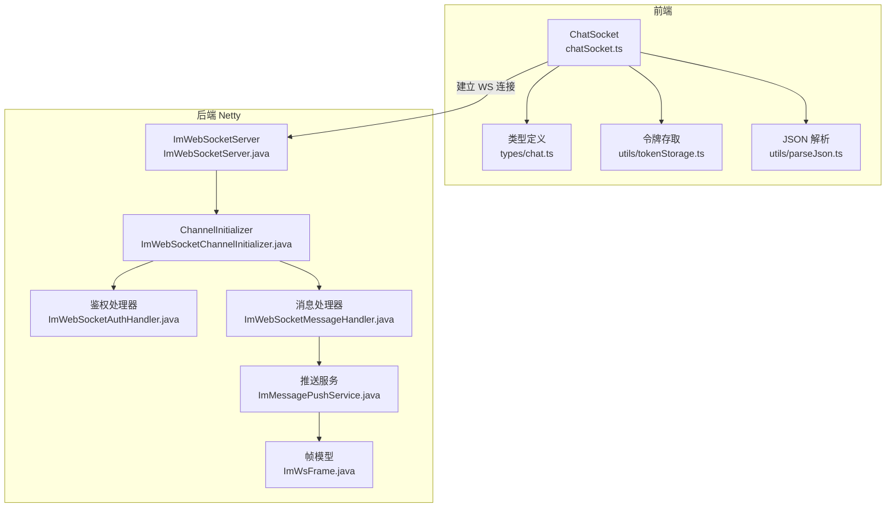
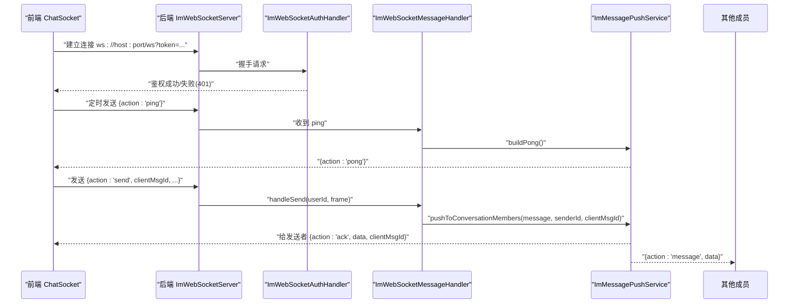
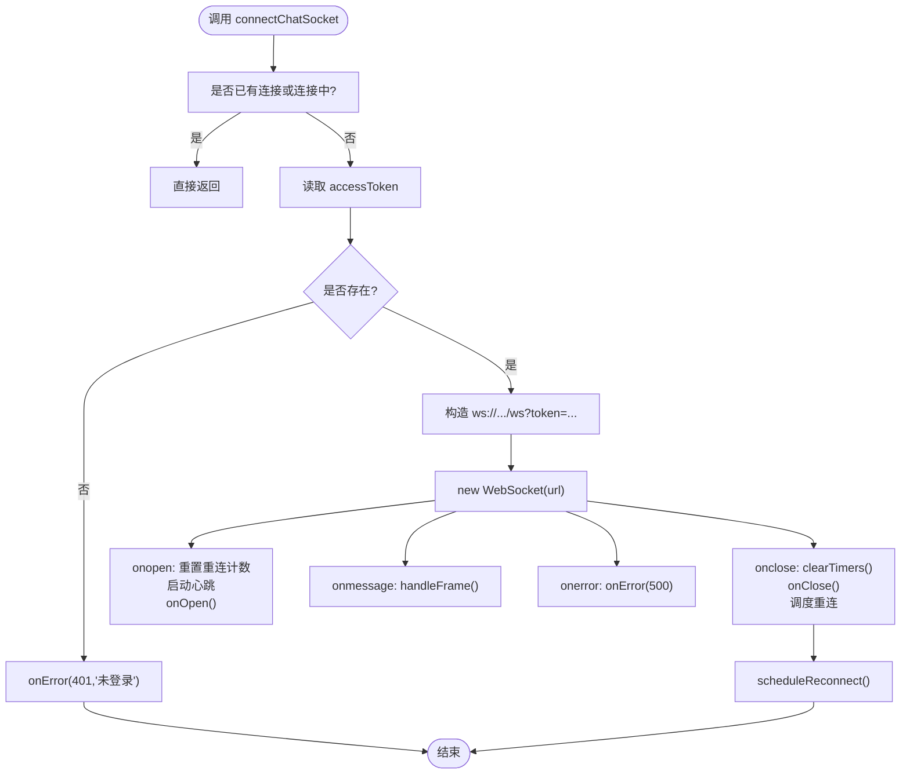
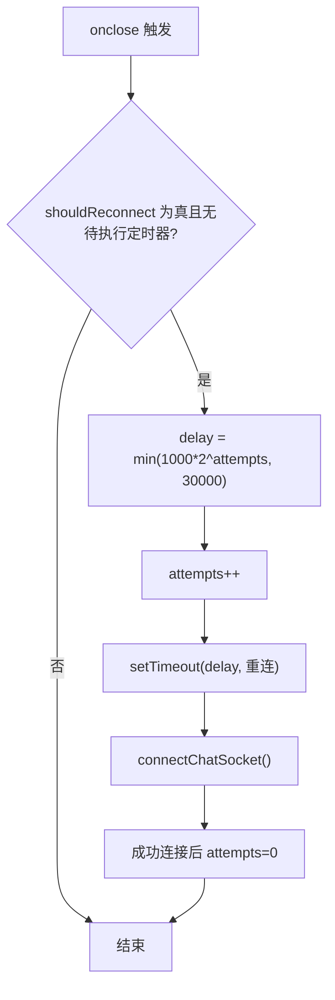
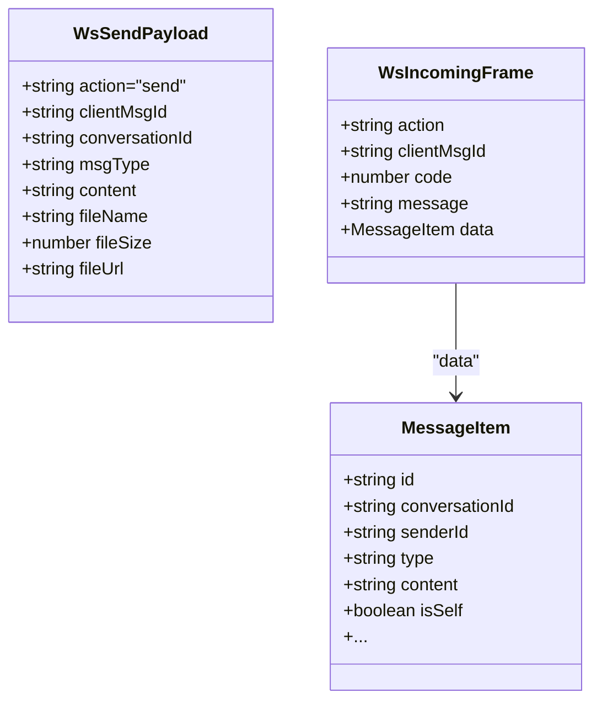
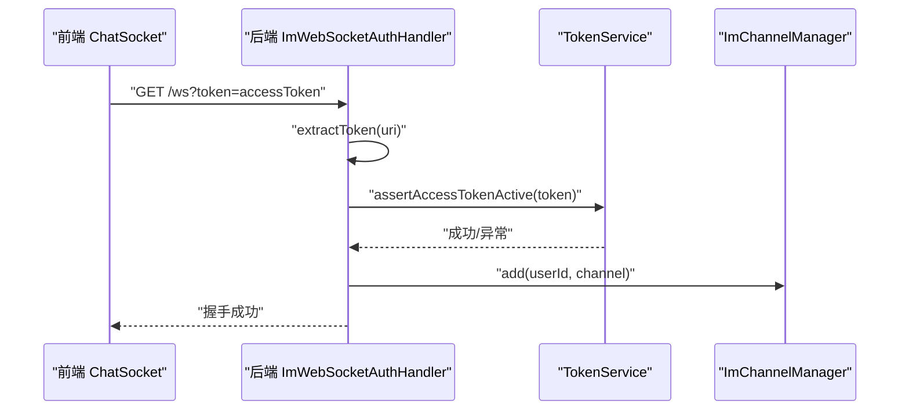
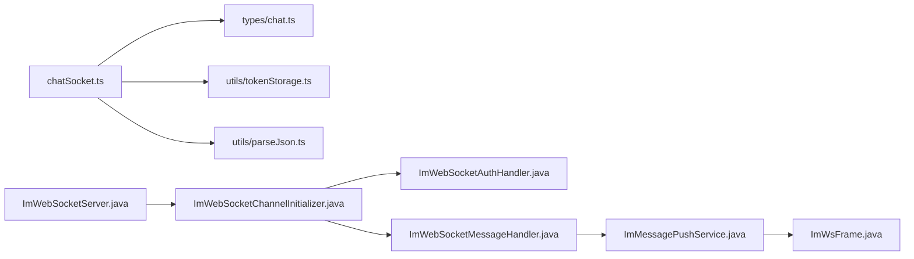

# 前端 WebSocket 客户端

<cite>
**本文引用的文件**
- [chatSocket.ts](file://linkx-client/src/utils/chatSocket.ts)
- [chat.ts](file://linkx-client/src/types/chat.ts)
- [tokenStorage.ts](file://linkx-client/src/utils/tokenStorage.ts)
- [parseJson.ts](file://linkx-client/src/utils/parseJson.ts)
- [ImWebSocketServer.java](file://linkx-server/src/main/java/com/linkx/server/im/ImWebSocketServer.java)
- [ImWebSocketChannelInitializer.java](file://linkx-server/src/main/java/com/linkx/server/im/ImWebSocketChannelInitializer.java)
- [ImWebSocketAuthHandler.java](file://linkx-server/src/main/java/com/linkx/server/im/ImWebSocketAuthHandler.java)
- [ImWebSocketMessageHandler.java](file://linkx-server/src/main/java/com/linkx/server/im/ImWebSocketMessageHandler.java)
- [ImMessagePushService.java](file://linkx-server/src/main/java/com/linkx/server/im/ImMessagePushService.java)
- [ImWsFrame.java](file://linkx-server/src/main/java/com/linkx/server/im/ImWsFrame.java)
</cite>

## 目录
1. [简介](#简介)
2. [项目结构](#项目结构)
3. [核心组件](#核心组件)
4. [架构总览](#架构总览)
5. [详细组件分析](#详细组件分析)
6. [依赖关系分析](#依赖关系分析)
7. [性能考虑](#性能考虑)
8. [故障排查指南](#故障排查指南)
9. [结论](#结论)
10. [附录：API 与协议说明](#附录api-与协议说明)

## 简介
本技术文档聚焦于 LinkX 前端的 WebSocket 客户端实现，围绕 ChatSocket 类（位于 chatSocket.ts）展开，系统阐述连接管理、心跳机制、自动重连策略与指数退避算法；详细说明消息帧格式处理、错误处理逻辑、令牌认证流程与连接状态管理。同时结合后端 Netty 服务（ImWebSocketServer 及其处理器），解释前后端通信协议、消息确认机制与异常恢复策略，并提供 API 接口说明、使用示例路径、性能优化建议与故障排查指南。

## 项目结构
前端部分关键文件：
- utils/chatSocket.ts：WebSocket 客户端封装，负责连接、心跳、重连、消息收发与事件分发
- types/chat.ts：消息与帧类型定义
- utils/tokenStorage.ts：令牌存取（优先安全存储，回退 localStorage）
- utils/parseJson.ts：JSON 解析时保留大整数 ID，避免精度丢失

后端部分关键文件：
- ImWebSocketServer.java：Netty 服务器启动与生命周期管理
- ImWebSocketChannelInitializer.java：管道初始化（HTTP 编解码、聚合、鉴权、协议、业务处理）
- ImWebSocketAuthHandler.java：握手阶段从 URL 查询参数提取 token 并校验
- ImWebSocketMessageHandler.java：业务消息处理（ping/send/error）
- ImMessagePushService.java：消息推送、ACK 构建、错误帧构建、Pong 构建
- ImWsFrame.java：通用帧模型（action/data/code/message 等）

图表来源
- [chatSocket.ts:1-144](file://linkx-client/src/utils/chatSocket.ts#L1-L144)
- [chat.ts:1-57](file://linkx-client/src/types/chat.ts#L1-L57)
- [tokenStorage.ts:1-79](file://linkx-client/src/utils/tokenStorage.ts#L1-L79)
- [parseJson.ts:1-28](file://linkx-client/src/utils/parseJson.ts#L1-L28)
- [ImWebSocketServer.java:1-82](file://linkx-server/src/main/java/com/linkx/server/im/ImWebSocketServer.java#L1-L82)
- [ImWebSocketChannelInitializer.java:1-38](file://linkx-server/src/main/java/com/linkx/server/im/ImWebSocketChannelInitializer.java#L1-L38)
- [ImWebSocketAuthHandler.java:1-81](file://linkx-server/src/main/java/com/linkx/server/im/ImWebSocketAuthHandler.java#L1-L81)
- [ImWebSocketMessageHandler.java:1-62](file://linkx-server/src/main/java/com/linkx/server/im/ImWebSocketMessageHandler.java#L1-L62)
- [ImMessagePushService.java:1-136](file://linkx-server/src/main/java/com/linkx/server/im/ImMessagePushService.java#L1-L136)
- [ImWsFrame.java:1-20](file://linkx-server/src/main/java/com/linkx/server/im/ImWsFrame.java#L1-L20)

章节来源
- [chatSocket.ts:1-144](file://linkx-client/src/utils/chatSocket.ts#L1-L144)
- [ImWebSocketServer.java:1-82](file://linkx-server/src/main/java/com/linkx/server/im/ImWebSocketServer.java#L1-L82)

## 核心组件
- ChatSocket（chatSocket.ts）
  - 职责：封装 WebSocket 连接生命周期、心跳、重连、消息帧解析与回调派发、发送消息、连接状态查询
  - 关键能力：
    - 连接管理：connectChatSocket/disconnectChatSocket/isChatSocketConnected
    - 心跳：startHeartbeat 每 25s 发送 ping
    - 自动重连：scheduleReconnect 基于指数退避（上限 30s）
    - 帧处理：handleFrame 解析 action=message/ack/pong/error
    - 认证：在连接前读取 accessToken 并拼接到 URL 查询参数
- 类型定义（types/chat.ts）
  - WsSendPayload：客户端发送的“send”动作载荷
  - WsIncomingFrame：服务端返回帧（message/ack/pong/error）
  - MessageItem：消息体结构
- 令牌存取（utils/tokenStorage.ts）
  - getToken/setToken/clearTokens 等，优先使用 Electron 安全存储，不可用时回退到 localStorage
- JSON 解析（utils/parseJson.ts）
  - parseJsonPreservingIds：对长整型 ID 字段进行字符串化，避免 JS 精度丢失

章节来源
- [chatSocket.ts:1-144](file://linkx-client/src/utils/chatSocket.ts#L1-L144)
- [chat.ts:1-57](file://linkx-client/src/types/chat.ts#L1-L57)
- [tokenStorage.ts:1-79](file://linkx-client/src/utils/tokenStorage.ts#L1-L79)
- [parseJson.ts:1-28](file://linkx-client/src/utils/parseJson.ts#L1-L28)

## 架构总览
前后端通过 WebSocket 文本帧交互，采用统一的 JSON 帧模型 ImWsFrame。前端以 action 区分消息语义，后端根据 action 路由到不同处理逻辑。

图表来源
- [chatSocket.ts:33-50](file://linkx-client/src/utils/chatSocket.ts#L33-L50)
- [chatSocket.ts:80-121](file://linkx-client/src/utils/chatSocket.ts#L80-L121)
- [ImWebSocketAuthHandler.java:26-53](file://linkx-server/src/main/java/com/linkx/server/im/ImWebSocketAuthHandler.java#L26-L53)
- [ImWebSocketMessageHandler.java:27-54](file://linkx-server/src/main/java/com/linkx/server/im/ImWebSocketMessageHandler.java#L27-L54)
- [ImMessagePushService.java:30-73](file://linkx-server/src/main/java/com/linkx/server/im/ImMessagePushService.java#L30-L73)

## 详细组件分析

### ChatSocket 连接管理与心跳
- 连接建立
  - connectChatSocket 会检查是否已有连接或正在连接，避免重复创建
  - 从 tokenStorage 获取 accessToken，若缺失则触发 onOpen 前的 onError(401)
  - 拼接 URL 为 /ws?token=...，创建 WebSocket 实例并注册 onopen/onmessage/onerror/onclose
- 心跳机制
  - startHeartbeat 每 25s 发送一次 {action:'ping'}
  - 收到 pong 帧时无需额外处理（仅用于保活）
- 关闭与清理
  - disconnectChatSocket 停止重连、清理定时器、关闭 socket 并置空 handlers
  - onclose 中清理定时器、触发 onClose，并在 shouldReconnect 为真时调度重连

图表来源
- [chatSocket.ts:80-121](file://linkx-client/src/utils/chatSocket.ts#L80-L121)
- [chatSocket.ts:33-50](file://linkx-client/src/utils/chatSocket.ts#L33-L50)

章节来源
- [chatSocket.ts:80-121](file://linkx-client/src/utils/chatSocket.ts#L80-L121)
- [chatSocket.ts:33-50](file://linkx-client/src/utils/chatSocket.ts#L33-L50)

### 自动重连与指数退避
- 重连开关
  - shouldReconnect 控制是否允许重连；disconnectChatSocket 将其置为 false
- 指数退避
  - scheduleReconnect 计算 delay = min(1000 * 2^reconnectAttempts, 30000)
  - reconnectAttempts 每次递增，避免风暴式重连
  - 到达延迟后重新调用 connectChatSocket，成功后重置 reconnectAttempts

图表来源
- [chatSocket.ts:42-50](file://linkx-client/src/utils/chatSocket.ts#L42-L50)
- [chatSocket.ts:113-121](file://linkx-client/src/utils/chatSocket.ts#L113-L121)

章节来源
- [chatSocket.ts:42-50](file://linkx-client/src/utils/chatSocket.ts#L42-L50)
- [chatSocket.ts:113-121](file://linkx-client/src/utils/chatSocket.ts#L113-L121)

### 消息帧格式与处理
- 发送帧（WsSendPayload）
  - action='send'，携带 clientMsgId、conversationId、msgType、content/fileInfo 等
- 接收帧（WsIncomingFrame）
  - action='message'：普通消息，data 为 MessageItem
  - action='ack'：发送确认，data 为 MessageItem，clientMsgId 对应发送时的 clientMsgId
  - action='pong'：心跳响应
  - action='error'：错误码 code 与 message
- 解析与分发
  - handleFrame 使用 parseJsonPreservingIds 解析，按 action 分发到 onMessage/onAck/onError

图表来源
- [chat.ts:37-54](file://linkx-client/src/types/chat.ts#L37-L54)
- [chat.ts:15-28](file://linkx-client/src/types/chat.ts#L15-L28)

章节来源
- [chat.ts:37-54](file://linkx-client/src/types/chat.ts#L37-L54)
- [chat.ts:15-28](file://linkx-client/src/types/chat.ts#L15-L28)
- [chatSocket.ts:52-78](file://linkx-client/src/utils/chatSocket.ts#L52-L78)

### 错误处理与异常恢复
- 前端
  - 解析失败：onError(400, '消息格式错误')
  - 连接异常：onError(500, 'WebSocket 连接异常')
  - 未登录：onError(401, '未登录')
  - 服务端错误帧：转发 code/message 到上层
- 后端
  - 未认证：ImWebSocketAuthHandler 拒绝握手（401）
  - 缺少 action：ImWebSocketMessageHandler 返回 error(400)
  - 不支持 action：返回 error(400)
  - 业务异常：CustomException 映射为 error(code,message)
  - 未知异常：返回 error(500)

章节来源
- [chatSocket.ts:52-78](file://linkx-client/src/utils/chatSocket.ts#L52-L78)
- [ImWebSocketMessageHandler.java:27-54](file://linkx-server/src/main/java/com/linkx/server/im/ImWebSocketMessageHandler.java#L27-L54)
- [ImWebSocketAuthHandler.java:26-53](file://linkx-server/src/main/java/com/linkx/server/im/ImWebSocketAuthHandler.java#L26-L53)

### 令牌认证流程
- 前端
  - connectChatSocket 读取 accessToken，拼接至 URL 查询参数 token
  - 若无 token，直接触发 onOpen 前的 onError(401)
- 后端
  - ImWebSocketAuthHandler 从 URI 查询参数提取 token
  - 校验类型为 ACCESS，并通过 TokenService 断言有效
  - 将 userId 写入 channel 属性，加入 ChannelManager
  - 鉴权失败返回 401 并关闭连接

图表来源
- [chatSocket.ts:88-95](file://linkx-client/src/utils/chatSocket.ts#L88-L95)
- [ImWebSocketAuthHandler.java:26-53](file://linkx-server/src/main/java/com/linkx/server/im/ImWebSocketAuthHandler.java#L26-L53)

章节来源
- [chatSocket.ts:88-95](file://linkx-client/src/utils/chatSocket.ts#L88-L95)
- [ImWebSocketAuthHandler.java:26-53](file://linkx-server/src/main/java/com/linkx/server/im/ImWebSocketAuthHandler.java#L26-L53)

### 连接状态管理
- 状态查询
  - isChatSocketConnected 返回当前是否为 OPEN
- 生命周期
  - onopen：重置重连计数、启动心跳、触发 onOpen
  - onclose：清理定时器、触发 onClose、按需重连
  - disconnectChatSocket：主动断开并禁止重连

章节来源
- [chatSocket.ts:97-121](file://linkx-client/src/utils/chatSocket.ts#L97-L121)
- [chatSocket.ts:123-132](file://linkx-client/src/utils/chatSocket.ts#L123-L132)
- [chatSocket.ts:141-143](file://linkx-client/src/utils/chatSocket.ts#L141-L143)

### 消息确认机制与异常恢复
- 发送确认
  - 前端发送 send 帧时携带 clientMsgId
  - 后端针对发送者返回 ack 帧，包含相同 clientMsgId 与完整消息数据
- 异常恢复
  - 若网络中断，前端自动重连；应用层可依据 onAck 完成 UI 渲染与持久化
  - 若出现错误帧，前端统一上报 onError，上层可据此提示用户或重试

章节来源
- [chatSocket.ts:134-139](file://linkx-client/src/utils/chatSocket.ts#L134-L139)
- [ImMessagePushService.java:45-73](file://linkx-server/src/main/java/com/linkx/server/im/ImMessagePushService.java#L45-L73)

## 依赖关系分析
- 前端模块耦合
  - chatSocket.ts 依赖 types/chat.ts（类型）、tokenStorage.ts（令牌）、parseJson.ts（解析）
- 后端模块耦合
  - ImWebSocketServer 依赖配置与组件装配
  - ChannelInitializer 组装 HTTP 编解码、聚合、鉴权、协议、消息处理器
  - ImWebSocketMessageHandler 依赖 ImMessagePushService 完成业务处理与推送
  - ImMessagePushService 依赖 ChatService、Mapper、ChannelManager、ObjectMapper

图表来源
- [chatSocket.ts:1-144](file://linkx-client/src/utils/chatSocket.ts#L1-L144)
- [ImWebSocketChannelInitializer.java:1-38](file://linkx-server/src/main/java/com/linkx/server/im/ImWebSocketChannelInitializer.java#L1-L38)
- [ImWebSocketMessageHandler.java:1-62](file://linkx-server/src/main/java/com/linkx/server/im/ImWebSocketMessageHandler.java#L1-L62)
- [ImMessagePushService.java:1-136](file://linkx-server/src/main/java/com/linkx/server/im/ImMessagePushService.java#L1-L136)

章节来源
- [chatSocket.ts:1-144](file://linkx-client/src/utils/chatSocket.ts#L1-L144)
- [ImWebSocketChannelInitializer.java:1-38](file://linkx-server/src/main/java/com/linkx/server/im/ImWebSocketChannelInitializer.java#L1-L38)

## 性能考虑
- 心跳间隔
  - 当前 25s 发送一次 ping，适合大多数场景；可根据网络质量调整
- 重连退避
  - 指数退避上限 30s，避免雪崩；建议在大规模客户端场景下评估上限与最大尝试次数
- 大整数 ID 处理
  - 使用 parseJsonPreservingIds 避免雪花 ID 精度丢失，减少后续转换开销
- 连接复用
  - 已存在连接或连接中时直接返回，避免重复创建
- 序列化与反序列化
  - 后端使用 ObjectMapper 序列化帧，注意对象大小与字段裁剪，减少带宽占用

[本节为通用性能建议，不直接分析具体代码文件]

## 故障排查指南
- 常见问题定位
  - 未登录：前端 onOpen 前即触发 onError(401)，检查 tokenStorage 中的 accessToken 是否正确设置
  - 握手失败：后端返回 401，检查 URL 中 token 是否合法、是否过期
  - 消息格式错误：前端 onError(400)，检查服务端返回帧是否符合 WsIncomingFrame 规范
  - 不支持的 action：后端返回 400，检查客户端发送的 action 是否在支持列表内
  - 连接异常：前端 onError(500)，检查网络连通性与防火墙策略
- 日志与调试
  - 后端在握手与消息处理处有日志输出，便于定位问题
  - 前端可在 onmessage 分支打印原始帧内容辅助调试（生产环境建议脱敏）

章节来源
- [chatSocket.ts:52-78](file://linkx-client/src/utils/chatSocket.ts#L52-L78)
- [ImWebSocketMessageHandler.java:27-54](file://linkx-server/src/main/java/com/linkx/server/im/ImWebSocketMessageHandler.java#L27-L54)
- [ImWebSocketAuthHandler.java:26-53](file://linkx-server/src/main/java/com/linkx/server/im/ImWebSocketAuthHandler.java#L26-L53)

## 结论
ChatSocket 在前端实现了健壮的 WebSocket 客户端能力：稳定的连接管理、可靠的心跳保活、指数退避的重连策略、严格的帧解析与错误处理、以及完善的令牌认证集成。配合后端 Netty 服务的鉴权与消息处理链路，形成了完整的即时通讯通道。通过合理的性能调优与完善的故障排查手段，可在复杂网络环境下保持高可用与良好用户体验。

[本节为总结性内容，不直接分析具体代码文件]

## 附录：API 与协议说明

### 前端 API 接口
- connectChatSocket(nextHandlers)
  - 作用：建立 WebSocket 连接并注册事件处理器
  - 参数：nextHandlers.onMessage/onAck/onError/onOpen/onClose
  - 行为：若已有连接或连接中则直接返回；否则读取 accessToken 并建立连接
- disconnectChatSocket()
  - 作用：主动断开连接并禁止重连
- sendChatMessage(payload)
  - 作用：发送消息帧（action='send'）
  - 参数：payload 遵循 WsSendPayload 类型
  - 异常：未连接时抛出错误
- isChatSocketConnected()
  - 作用：查询当前连接状态

章节来源
- [chatSocket.ts:80-143](file://linkx-client/src/utils/chatSocket.ts#L80-L143)

### 后端服务入口
- ImWebSocketServer
  - 作用：启动 Netty WebSocket 服务，绑定端口与路径
  - 生命周期：run 启动，shutdown 优雅关闭

章节来源
- [ImWebSocketServer.java:36-80](file://linkx-server/src/main/java/com/linkx/server/im/ImWebSocketServer.java#L36-L80)

### 通信协议（帧模型）
- 通用帧字段（ImWsFrame）
  - action：消息动作（ping/send/message/ack/error）
  - clientMsgId：客户端消息唯一标识（用于 ACK 匹配）
  - conversationId/msgType/content/fileInfo：消息相关字段
  - code/message：错误信息
  - data：业务数据（如 MessageItem）
- 客户端发送
  - action='send'，携带 clientMsgId 与消息内容
- 服务端返回
  - action='message'：对非发送者的消息广播
  - action='ack'：对发送者的确认，包含相同 clientMsgId
  - action='pong'：心跳响应
  - action='error'：错误码与消息

章节来源
- [ImWsFrame.java:1-20](file://linkx-server/src/main/java/com/linkx/server/im/ImWsFrame.java#L1-L20)
- [ImMessagePushService.java:75-90](file://linkx-server/src/main/java/com/linkx/server/im/ImMessagePushService.java#L75-L90)
- [chat.ts:37-54](file://linkx-client/src/types/chat.ts#L37-L54)

### 使用示例（路径指引）
- 连接与事件注册
  - 参考：[chatSocket.ts:80-121](file://linkx-client/src/utils/chatSocket.ts#L80-L121)
- 发送消息
  - 参考：[chatSocket.ts:134-139](file://linkx-client/src/utils/chatSocket.ts#L134-L139)
- 令牌获取
  - 参考：[tokenStorage.ts:53-55](file://linkx-client/src/utils/tokenStorage.ts#L53-L55)
- 帧类型定义
  - 参考：[chat.ts:37-54](file://linkx-client/src/types/chat.ts#L37-L54)