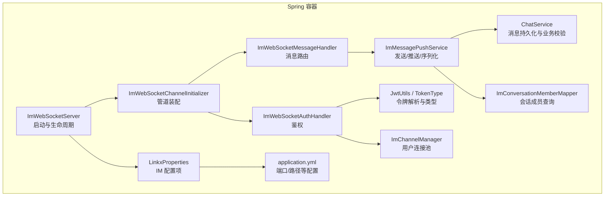
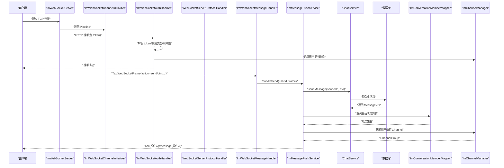
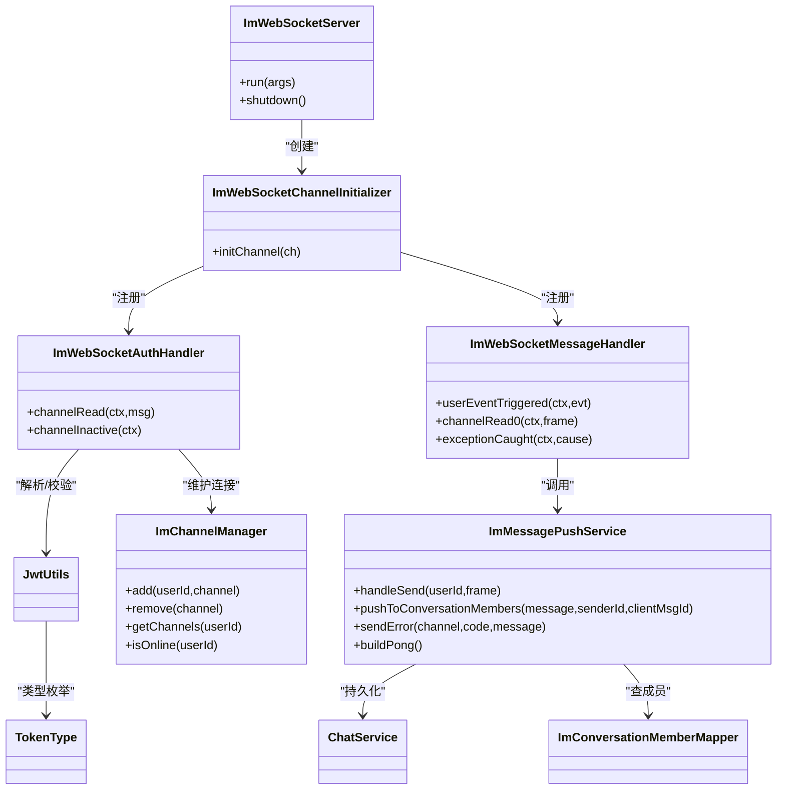

# 后端 WebSocket 服务器

<cite>
**本文引用的文件**   
- [ImWebSocketServer.java](file://linkx-server/src/main/java/com/linkx/server/im/ImWebSocketServer.java)
- [ImWebSocketChannelInitializer.java](file://linkx-server/src/main/java/com/linkx/server/im/ImWebSocketChannelInitializer.java)
- [ImWebSocketAuthHandler.java](file://linkx-server/src/main/java/com/linkx/server/im/ImWebSocketAuthHandler.java)
- [ImWebSocketMessageHandler.java](file://linkx-server/src/main/java/com/linkx/server/im/ImWebSocketMessageHandler.java)
- [ImWsFrame.java](file://linkx-server/src/main/java/com/linkx/server/im/ImWsFrame.java)
- [ImChannelManager.java](file://linkx-server/src/main/java/com/linkx/server/im/ImChannelManager.java)
- [ImChannelAttributes.java](file://linkx-server/src/main/java/com/linkx/server/im/ImChannelAttributes.java)
- [ImMessagePushService.java](file://linkx-server/src/main/java/com/linkx/server/im/ImMessagePushService.java)
- [JwtUtils.java](file://linkx-server/src/main/java/com/linkx/server/common/JwtUtils.java)
- [TokenType.java](file://linkx-server/src/main/java/com/linkx/server/common/TokenType.java)
- [LinkxProperties.java](file://linkx-server/src/main/java/com/linkx/server/config/LinkxProperties.java)
- [application.yml](file://linkx-server/src/main/resources/application.yml)
- [SendMessageDTO.java](file://linkx-server/src/main/java/com/linkx/server/controller/dto/SendMessageDTO.java)
- [MessageVO.java](file://linkx-server/src/main/java/com/linkx/server/controller/vo/MessageVO.java)
- [ChatService.java](file://linkx-server/src/main/java/com/linkx/server/service/ChatService.java)
- [ImConversationMemberMapper.java](file://linkx-server/src/main/java/com/linkx/server/mapper/ImConversationMemberMapper.java)
</cite>

## 目录
1. [简介](#简介)
2. [项目结构](#项目结构)
3. [核心组件](#核心组件)
4. [架构总览](#架构总览)
5. [详细组件分析](#详细组件分析)
6. [依赖关系分析](#依赖关系分析)
7. [性能与高并发](#性能与高并发)
8. [协议规范与消息类型](#协议规范与消息类型)
9. [监控指标与可观测性](#监控指标与可观测性)
10. [故障排查指南](#故障排查指南)
11. [结论](#结论)

## 简介
本技术文档围绕 LinkX 后端的基于 Netty 的 WebSocket 服务，系统性阐述其配置、连接建立流程、认证鉴权、消息处理、会话管理与推送机制。文档同时给出 ImWsFrame 帧协议定义、消息路由逻辑、与业务服务的集成方式、消息持久化策略以及高并发场景下的调优建议与监控指标说明，帮助读者快速理解并高效运维该子系统。

## 项目结构
后端采用 Spring Boot + Netty 混合架构：Spring 负责应用生命周期、配置注入与业务服务；Netty 作为独立的 IM WebSocket 服务器运行在独立端口，通过 ChannelPipeline 完成 HTTP 握手、鉴权、协议解析与消息分发。

图示来源
- [ImWebSocketServer.java:1-82](file://linkx-server/src/main/java/com/linkx/server/im/ImWebSocketServer.java#L1-L82)
- [ImWebSocketChannelInitializer.java:1-38](file://linkx-server/src/main/java/com/linkx/server/im/ImWebSocketChannelInitializer.java#L1-L38)
- [ImWebSocketAuthHandler.java:1-81](file://linkx-server/src/main/java/com/linkx/server/im/ImWebSocketAuthHandler.java#L1-L81)
- [ImWebSocketMessageHandler.java:1-62](file://linkx-server/src/main/java/com/linkx/server/im/ImWebSocketMessageHandler.java#L1-L62)
- [ImMessagePushService.java:1-136](file://linkx-server/src/main/java/com/linkx/server/im/ImMessagePushService.java#L1-L136)
- [ImChannelManager.java:1-41](file://linkx-server/src/main/java/com/linkx/server/im/ImChannelManager.java#L1-L41)
- [JwtUtils.java:1-76](file://linkx-server/src/main/java/com/linkx/server/common/JwtUtils.java#L1-L76)
- [TokenType.java:1-29](file://linkx-server/src/main/java/com/linkx/server/common/TokenType.java#L1-L29)
- [LinkxProperties.java:1-65](file://linkx-server/src/main/java/com/linkx/server/config/LinkxProperties.java#L1-L65)
- [application.yml:1-54](file://linkx-server/src/main/resources/application.yml#L1-L54)

章节来源
- [ImWebSocketServer.java:1-82](file://linkx-server/src/main/java/com/linkx/server/im/ImWebSocketServer.java#L1-L82)
- [ImWebSocketChannelInitializer.java:1-38](file://linkx-server/src/main/java/com/linkx/server/im/ImWebSocketChannelInitializer.java#L1-L38)
- [application.yml:1-54](file://linkx-server/src/main/resources/application.yml#L1-L54)

## 核心组件
- 启动器与生命周期管理：负责读取配置、创建 Netty 事件循环组、绑定端口、注册 ChannelPipeline、优雅关闭。
- 通道初始化器：装配 HTTP 编解码、分块写入、HTTP 聚合、鉴权处理器、WebSocket 协议处理器、业务消息处理器。
- 鉴权处理器：从请求 URI 提取 token，校验 JWT 类型与有效性，解析 userId，写入 Channel 属性，维护用户连接映射。
- 消息处理器：接收文本帧，反序列化为 ImWsFrame，按 action 路由到具体处理逻辑（如 ping/send），统一错误封装返回。
- 推送服务：将消息持久化至数据库，查询会话成员，按视角构造响应帧，批量推送到在线用户的所有连接。
- 连接池管理：以用户维度维护 ChannelGroup，支持添加、移除、查询与在线状态判断。
- 配置与工具：JWT 工具类提供令牌生成与解析；配置类承载 IM 相关参数；YAML 提供默认值与环境变量覆盖。

章节来源
- [ImWebSocketServer.java:1-82](file://linkx-server/src/main/java/com/linkx/server/im/ImWebSocketServer.java#L1-L82)
- [ImWebSocketChannelInitializer.java:1-38](file://linkx-server/src/main/java/com/linkx/server/im/ImWebSocketChannelInitializer.java#L1-L38)
- [ImWebSocketAuthHandler.java:1-81](file://linkx-server/src/main/java/com/linkx/server/im/ImWebSocketAuthHandler.java#L1-L81)
- [ImWebSocketMessageHandler.java:1-62](file://linkx-server/src/main/java/com/linkx/server/im/ImWebSocketMessageHandler.java#L1-L62)
- [ImMessagePushService.java:1-136](file://linkx-server/src/main/java/com/linkx/server/im/ImMessagePushService.java#L1-L136)
- [ImChannelManager.java:1-41](file://linkx-server/src/main/java/com/linkx/server/im/ImChannelManager.java#L1-L41)
- [JwtUtils.java:1-76](file://linkx-server/src/main/java/com/linkx/server/common/JwtUtils.java#L1-L76)
- [TokenType.java:1-29](file://linkx-server/src/main/java/com/linkx/server/common/TokenType.java#L1-L29)
- [LinkxProperties.java:1-65](file://linkx-server/src/main/java/com/linkx/server/config/LinkxProperties.java#L1-L65)

## 架构总览
下图展示了客户端到服务端的关键交互链路：客户端发起带 token 的 WebSocket 握手，服务端完成鉴权后将用户与 Channel 关联；随后客户端发送业务帧，服务端路由到发送流程，持久化消息并广播给会话成员。

图示来源
- [ImWebSocketServer.java:1-82](file://linkx-server/src/main/java/com/linkx/server/im/ImWebSocketServer.java#L1-L82)
- [ImWebSocketChannelInitializer.java:1-38](file://linkx-server/src/main/java/com/linkx/server/im/ImWebSocketChannelInitializer.java#L1-L38)
- [ImWebSocketAuthHandler.java:1-81](file://linkx-server/src/main/java/com/linkx/server/im/ImWebSocketAuthHandler.java#L1-L81)
- [ImWebSocketMessageHandler.java:1-62](file://linkx-server/src/main/java/com/linkx/server/im/ImWebSocketMessageHandler.java#L1-L62)
- [ImMessagePushService.java:1-136](file://linkx-server/src/main/java/com/linkx/server/im/ImMessagePushService.java#L1-L136)
- [ImChannelManager.java:1-41](file://linkx-server/src/main/java/com/linkx/server/im/ImChannelManager.java#L1-L41)
- [ImConversationMemberMapper.java:1-10](file://linkx-server/src/main/java/com/linkx/server/mapper/ImConversationMemberMapper.java#L1-L10)
- [ChatService.java:1-25](file://linkx-server/src/main/java/com/linkx/server/service/ChatService.java#L1-L25)

## 详细组件分析

### 启动器与生命周期
- 功能要点
  - 从配置中读取 IM WebSocket 端口与路径，若未启用则跳过启动。
  - 创建 boss/worker EventLoopGroup，绑定 NIO 服务端通道。
  - 注册自定义 ChannelInitializer，完成鉴权与消息处理链装配。
  - 优雅关闭时依次关闭 Channel 与 EventLoopGroup。
- 关键依赖
  - LinkxProperties：获取 websocketPort/websocketPath。
  - JwtUtils/TokenService：用于后续鉴权（由 Handler 使用）。
  - ImChannelManager/ImMessagePushService/ObjectMapper：注入到初始化器。
- 异常与日志
  - 绑定失败记录错误原因；关闭过程记录“已关闭”日志。

章节来源
- [ImWebSocketServer.java:1-82](file://linkx-server/src/main/java/com/linkx/server/im/ImWebSocketServer.java#L1-L82)
- [LinkxProperties.java:1-65](file://linkx-server/src/main/java/com/linkx/server/config/LinkxProperties.java#L1-L65)

### 通道初始化器与 Pipeline
- 装配顺序与作用
  - HttpServerCodec：HTTP 编解码。
  - ChunkedWriteHandler：大对象分块写入。
  - HttpObjectAggregator：聚合 HTTP 请求体，便于鉴权阶段读取完整请求。
  - ImWebSocketAuthHandler：在握手前进行鉴权与用户上下文注入。
  - WebSocketServerProtocolHandler：完成 WebSocket 协议升级。
  - ImWebSocketMessageHandler：业务消息处理与路由。
- 路径控制
  - 通过配置项动态设置 WebSocket 路径，避免硬编码。

章节来源
- [ImWebSocketChannelInitializer.java:1-38](file://linkx-server/src/main/java/com/linkx/server/im/ImWebSocketChannelInitializer.java#L1-L38)
- [LinkxProperties.java:1-65](file://linkx-server/src/main/java/com/linkx/server/config/LinkxProperties.java#L1-L65)

### 鉴权处理器
- 鉴权流程
  - 从 URI 查询参数中提取 token。
  - 校验 JWT 类型必须为 access，并通过 TokenService 断言访问令牌有效。
  - 解析 userId，写入 Channel 属性，加入用户连接池。
  - 拒绝非法请求并关闭连接。
- 资源清理
  - 连接断开时从连接池移除对应 Channel。
- 安全注意
  - 仅接受 access 类型令牌，防止刷新令牌误用。

章节来源
- [ImWebSocketAuthHandler.java:1-81](file://linkx-server/src/main/java/com/linkx/server/im/ImWebSocketAuthHandler.java#L1-L81)
- [JwtUtils.java:1-76](file://linkx-server/src/main/java/com/linkx/server/common/JwtUtils.java#L1-L76)
- [TokenType.java:1-29](file://linkx-server/src/main/java/com/linkx/server/common/TokenType.java#L1-L29)
- [ImChannelManager.java:1-41](file://linkx-server/src/main/java/com/linkx/server/im/ImChannelManager.java#L1-L41)
- [ImChannelAttributes.java:1-12](file://linkx-server/src/main/java/com/linkx/server/im/ImChannelAttributes.java#L1-L12)

### 消息处理器与路由
- 入站处理
  - 握手完成后进入消息处理阶段。
  - 校验用户是否已认证，否则返回未认证错误并关闭连接。
  - 反序列化为 ImWsFrame，校验 action 字段。
  - 路由：ping 直接回 pong；send 调用推送服务；未知 action 返回不支持错误。
- 异常处理
  - 捕获业务异常与通用异常，统一封装错误帧返回。

章节来源
- [ImWebSocketMessageHandler.java:1-62](file://linkx-server/src/main/java/com/linkx/server/im/ImWebSocketMessageHandler.java#L1-L62)
- [ImWsFrame.java:1-20](file://linkx-server/src/main/java/com/linkx/server/im/ImWsFrame.java#L1-L20)

### 推送服务与消息持久化
- 发送流程
  - 将 ImWsFrame 转换为 SendMessageDTO，调用 ChatService.sendMessage 完成持久化与业务校验。
  - 查询会话成员，按视角构造 MessageVO（标记 isSelf）。
  - 根据是否为发件人决定返回 ack 或 message 帧，遍历用户所有 Channel 推送。
- 错误与心跳
  - sendError 统一返回错误帧；buildPong 构建心跳应答帧。
- 数据模型
  - 使用 ToStringSerializer 保证 Long 型 ID 在 JSON 中的精度。

章节来源
- [ImMessagePushService.java:1-136](file://linkx-server/src/main/java/com/linkx/server/im/ImMessagePushService.java#L1-L136)
- [SendMessageDTO.java:1-26](file://linkx-server/src/main/java/com/linkx/server/controller/dto/SendMessageDTO.java#L1-L26)
- [MessageVO.java:1-32](file://linkx-server/src/main/java/com/linkx/server/controller/vo/MessageVO.java#L1-L32)
- [ChatService.java:1-25](file://linkx-server/src/main/java/com/linkx/server/service/ChatService.java#L1-L25)
- [ImConversationMemberMapper.java:1-10](file://linkx-server/src/main/java/com/linkx/server/mapper/ImConversationMemberMapper.java#L1-L10)

### 连接池与会话管理
- 数据结构
  - 以用户 ID 为键，值为 DefaultChannelGroup，实现多设备/多标签页连接聚合。
- 操作语义
  - add/remove/getChannels/isOnline 提供完整的连接生命周期管理能力。
- 线程安全
  - 使用 ConcurrentHashMap 与 Netty 内置线程安全的 ChannelGroup。

章节来源
- [ImChannelManager.java:1-41](file://linkx-server/src/main/java/com/linkx/server/im/ImChannelManager.java#L1-L41)

### 配置与环境
- 关键配置项
  - linkx.im.websocket-port：IM WebSocket 监听端口。
  - linkx.im.websocket-path：WebSocket 路径。
  - linkx.jwt.*：JWT 密钥与过期时间。
  - server.servlet.context-path：REST API 上下文路径。
- 环境变量
  - 数据库、Redis、MinIO、JWT 等敏感信息通过环境变量注入。

章节来源
- [application.yml:1-54](file://linkx-server/src/main/resources/application.yml#L1-L54)
- [LinkxProperties.java:1-65](file://linkx-server/src/main/java/com/linkx/server/config/LinkxProperties.java#L1-L65)

## 依赖关系分析
- 组件耦合
  - 启动器依赖配置与各类服务，但仅负责装配与生命周期。
  - 鉴权处理器依赖 JWT 工具与连接池，不直接依赖业务服务。
  - 消息处理器仅依赖推送服务，保持轻量。
  - 推送服务聚合业务服务、数据访问层与连接池，承担编排职责。
- 外部依赖
  - MyBatis-Flex 数据访问层、MySQL 数据库、JSON 序列化库。
- 潜在风险
  - 推送服务对每个成员逐一写 Channel，需关注高并发下写放大问题（见性能章节）。

图示来源
- [ImWebSocketServer.java:1-82](file://linkx-server/src/main/java/com/linkx/server/im/ImWebSocketServer.java#L1-L82)
- [ImWebSocketChannelInitializer.java:1-38](file://linkx-server/src/main/java/com/linkx/server/im/ImWebSocketChannelInitializer.java#L1-L38)
- [ImWebSocketAuthHandler.java:1-81](file://linkx-server/src/main/java/com/linkx/server/im/ImWebSocketAuthHandler.java#L1-L81)
- [ImWebSocketMessageHandler.java:1-62](file://linkx-server/src/main/java/com/linkx/server/im/ImWebSocketMessageHandler.java#L1-L62)
- [ImMessagePushService.java:1-136](file://linkx-server/src/main/java/com/linkx/server/im/ImMessagePushService.java#L1-L136)
- [ImChannelManager.java:1-41](file://linkx-server/src/main/java/com/linkx/server/im/ImChannelManager.java#L1-L41)
- [JwtUtils.java:1-76](file://linkx-server/src/main/java/com/linkx/server/common/JwtUtils.java#L1-L76)
- [TokenType.java:1-29](file://linkx-server/src/main/java/com/linkx/server/common/TokenType.java#L1-L29)
- [ChatService.java:1-25](file://linkx-server/src/main/java/com/linkx/server/service/ChatService.java#L1-L25)
- [ImConversationMemberMapper.java:1-10](file://linkx-server/src/main/java/com/linkx/server/mapper/ImConversationMemberMapper.java#L1-L10)

## 性能与高并发
- 事件循环与线程模型
  - bossGroup 单线程处理 accept，workerGroup 自动选择线程数，适合高并发 I/O。
- 序列化与网络 I/O
  - 使用 Jackson 进行 JSON 序列化，建议在热点路径复用 ObjectMapper 实例（当前已通过 Spring 注入共享）。
  - 大文件传输走 REST 上传接口，WebSocket 仅传递元数据，降低帧体积。
- 推送优化建议
  - 针对群聊/大群场景，考虑批量写与异步化，减少主线程阻塞。
  - 对频繁推送的目标用户做去重与合并，避免重复写。
- 连接池规模
  - 合理评估 JVM 堆与 Netty 内存模型，避免过多 Channel 导致内存压力。
- 配置调优参考
  - 调整 linkx.im.websocket-port 与 worker 线程数（可通过 JVM 参数或 Netty 扩展点）。
  - 结合系统 CPU 核数与 IO 特征，评估 EventLoopGroup 大小。

[本节为通用指导，无需列出具体源码引用]

## 协议规范与消息类型

### 帧结构 ImWsFrame
- 作用：WebSocket 文本帧的统一载体，包含动作、消息体与错误信息。
- 字段说明
  - action：字符串，必填。取值示例："send"、"ping"、"ack"、"message"、"error"。
  - clientMsgId：字符串，可选。客户端消息唯一标识，用于幂等与 ACK 匹配。
  - conversationId：字符串，可选。会话 ID（数值型字符串），发送消息时必填。
  - msgType：字符串，可选。消息类型标识。
  - content：字符串，可选。消息正文。
  - fileName/fileSize/fileUrl：字符串/数字/字符串，可选。文件消息元数据。
  - code/message/data：整数/字符串/对象，可选。错误码、错误信息与业务数据。
- 序列化：JSON 格式，Long 型 ID 使用 ToStringSerializer 输出为字符串以避免前端精度丢失。

章节来源
- [ImWsFrame.java:1-20](file://linkx-server/src/main/java/com/linkx/server/im/ImWsFrame.java#L1-L20)
- [MessageVO.java:1-32](file://linkx-server/src/main/java/com/linkx/server/controller/vo/MessageVO.java#L1-L32)

### 消息类型与路由
- 客户端 -> 服务端
  - action=ping：心跳探测，服务端返回 action=pong。
  - action=send：发送消息，服务端持久化后向会话成员推送。
- 服务端 -> 客户端
  - action=ack：对发送方的确认帧，携带原 clientMsgId。
  - action=message：对接收方的消息帧，携带 MessageVO。
  - action=error：错误帧，包含 code 与 message。
- 路由规则
  - 未认证：返回 401 错误并关闭连接。
  - 缺少 action：返回 400 错误。
  - 不支持的 action：返回 400 错误。
  - 业务异常：透传自定义异常码与消息。

章节来源
- [ImWebSocketMessageHandler.java:1-62](file://linkx-server/src/main/java/com/linkx/server/im/ImWebSocketMessageHandler.java#L1-L62)
- [ImMessagePushService.java:1-136](file://linkx-server/src/main/java/com/linkx/server/im/ImMessagePushService.java#L1-L136)

### 认证与鉴权
- 认证入口：WebSocket 握手前的 HTTP 请求，token 通过查询参数传递。
- 校验步骤
  - 解析 token，检查类型为 access。
  - 调用 TokenService 断言令牌活跃。
  - 解析 userId 并写入 Channel 属性，加入连接池。
- 失败处理：返回 401 并关闭连接。

章节来源
- [ImWebSocketAuthHandler.java:1-81](file://linkx-server/src/main/java/com/linkx/server/im/ImWebSocketAuthHandler.java#L1-L81)
- [JwtUtils.java:1-76](file://linkx-server/src/main/java/com/linkx/server/common/JwtUtils.java#L1-L76)
- [TokenType.java:1-29](file://linkx-server/src/main/java/com/linkx/server/common/TokenType.java#L1-L29)

### 连接池与会话管理
- 用户维度连接聚合：同一用户可能有多条连接（多端/多标签）。
- 在线判定：通过连接池非空判断用户是否在线。
- 推送范围：按会话成员过滤，仅推送给在线用户。

章节来源
- [ImChannelManager.java:1-41](file://linkx-server/src/main/java/com/linkx/server/im/ImChannelManager.java#L1-L41)

### 与业务服务集成
- 消息持久化：通过 ChatService.sendMessage 完成入库与权限校验。
- 会话成员：通过 ImConversationMemberMapper 查询成员列表，确保推送范围正确。
- 视图转换：推送前按 viewerId 计算 isSelf，便于前端渲染。

章节来源
- [ImMessagePushService.java:1-136](file://linkx-server/src/main/java/com/linkx/server/im/ImMessagePushService.java#L1-L136)
- [ChatService.java:1-25](file://linkx-server/src/main/java/com/linkx/server/service/ChatService.java#L1-L25)
- [ImConversationMemberMapper.java:1-10](file://linkx-server/src/main/java/com/linkx/server/mapper/ImConversationMemberMapper.java#L1-L10)

## 监控指标与可观测性
- 连接指标
  - 每用户连接数：来自连接池统计。
  - 全局在线用户数：遍历连接池计数。
- 消息指标
  - 发送量/成功率：基于 handleSend 与错误帧计数。
  - 推送延迟：从收到 send 到首个 ack 的时间差（可在业务层埋点）。
- 错误指标
  - 鉴权失败次数、消息处理异常次数、序列化失败次数。
- 日志建议
  - 握手完成、鉴权失败、消息处理异常、推送目标为空等关键路径打点。

[本节为通用指导，无需列出具体源码引用]

## 故障排查指南
- 常见问题
  - 握手失败：检查 token 是否存在、类型是否为 access、是否被吊销。
  - 未认证即发消息：服务端会返回 401 并关闭连接，确认鉴权流程是否执行。
  - 消息未送达：检查会话成员是否存在、目标用户是否在线、Channel 是否活跃。
  - 序列化失败：Jackson 异常会被捕获并返回错误帧，检查消息体结构是否符合预期。
- 定位手段
  - 查看鉴权与消息处理日志，核对 userId 与 conversationId。
  - 验证 application.yml 中 IM 端口与路径是否与客户端一致。
  - 检查数据库与缓存可用性，确保 ChatService 与 MemberMapper 正常。

章节来源
- [ImWebSocketAuthHandler.java:1-81](file://linkx-server/src/main/java/com/linkx/server/im/ImWebSocketAuthHandler.java#L1-L81)
- [ImWebSocketMessageHandler.java:1-62](file://linkx-server/src/main/java/com/linkx/server/im/ImWebSocketMessageHandler.java#L1-L62)
- [ImMessagePushService.java:1-136](file://linkx-server/src/main/java/com/linkx/server/im/ImMessagePushService.java#L1-L136)
- [application.yml:1-54](file://linkx-server/src/main/resources/application.yml#L1-L54)

## 结论
LinkX 后端 WebSocket 服务以 Netty 为核心，结合 Spring 的生命周期与依赖注入，实现了高并发、可扩展的即时通信能力。通过清晰的鉴权与消息路由、完善的连接池与会话管理、以及与业务服务的解耦集成，系统在稳定性与可维护性方面具备良好基础。在高并发与大规模群聊场景下，建议进一步引入推送批量化、异步化与更细粒度的监控埋点，以提升整体吞吐与可观测性。