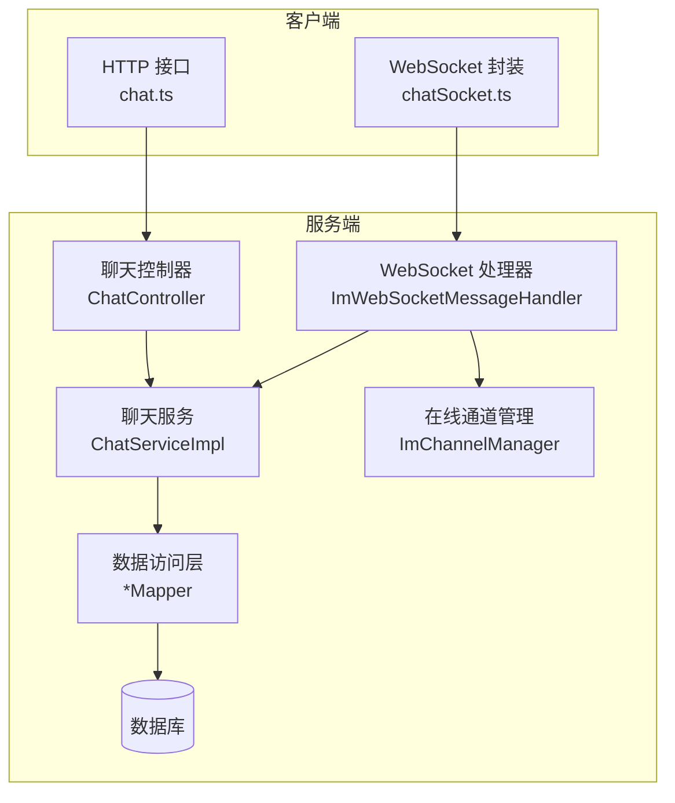
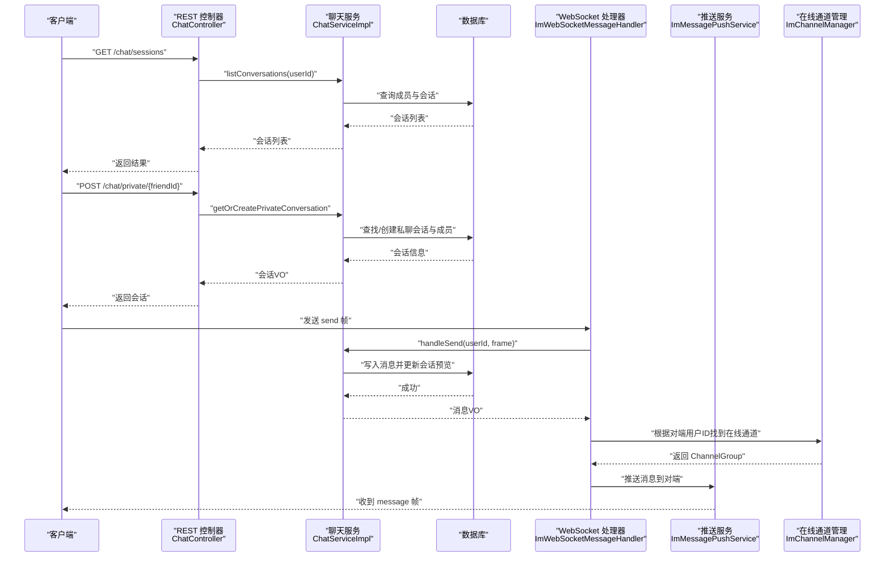
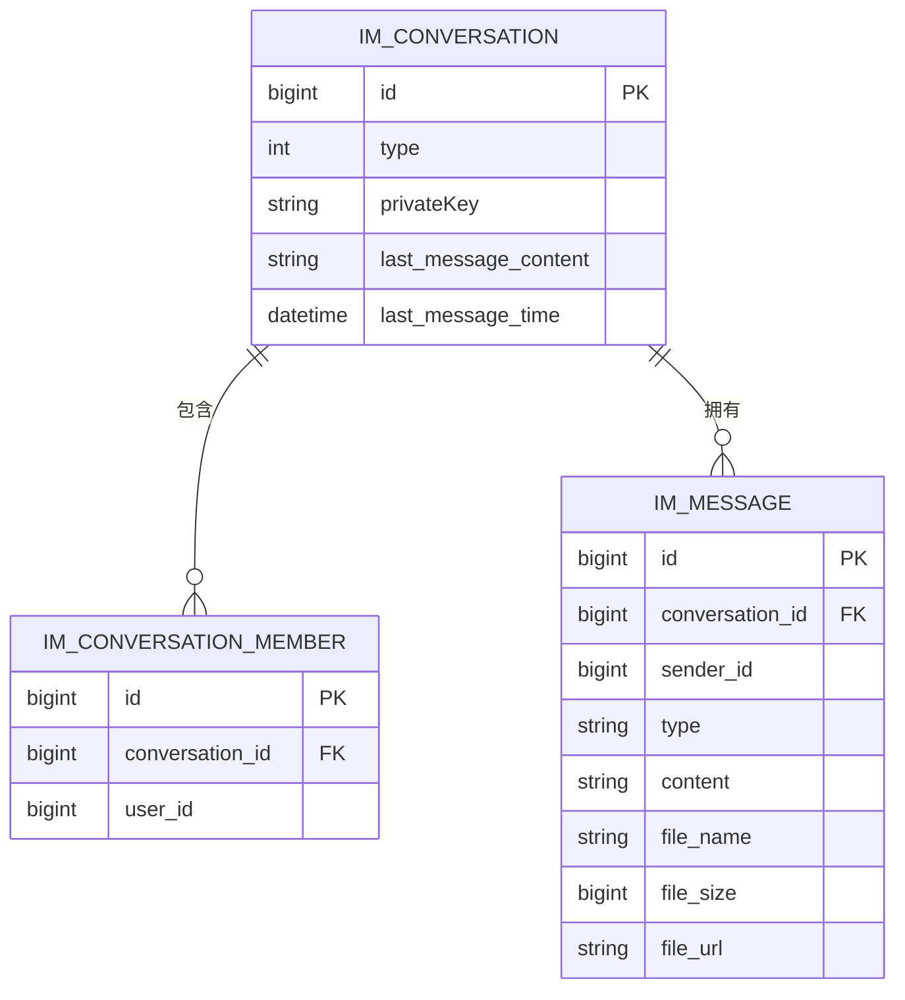
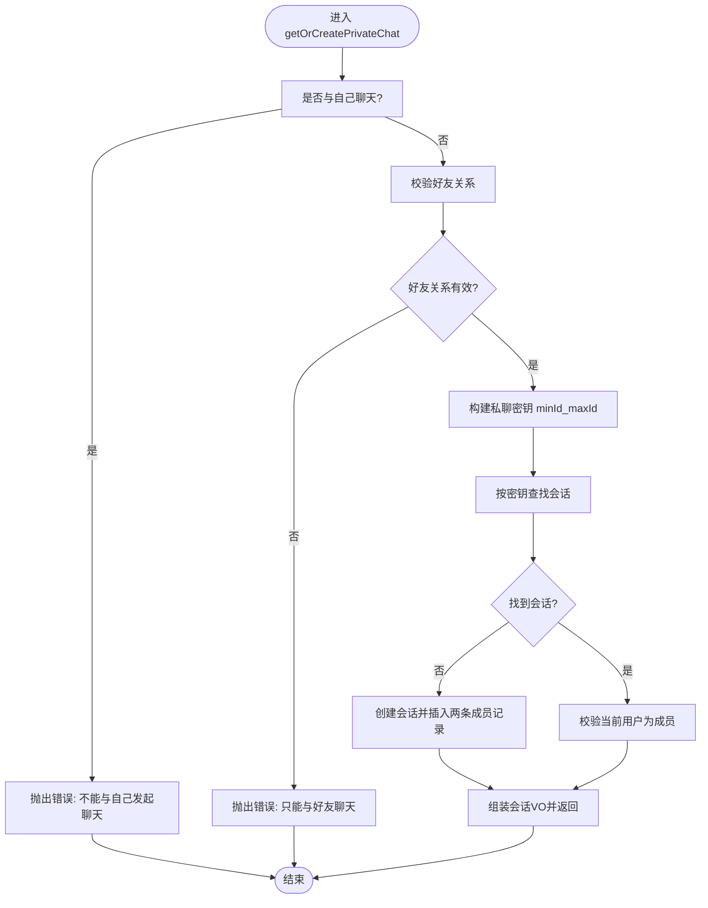
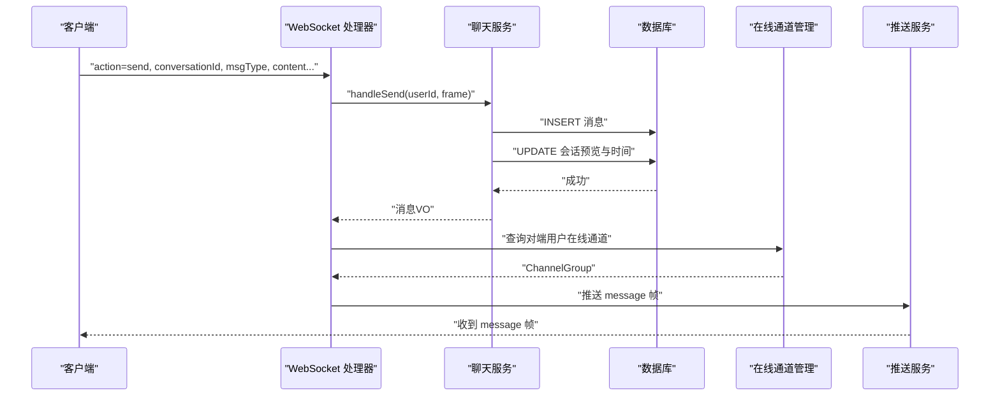
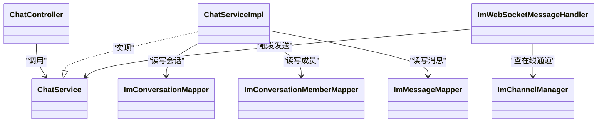

# 会话管理机制

<cite>
**本文引用的文件**   
- [ImConversation.java](file://linkx-server/src/main/java/com/linkx/server/entity/ImConversation.java)
- [ImConversationMember.java](file://linkx-server/src/main/java/com/linkx/server/entity/ImConversationMember.java)
- [ImMessage.java](file://linkx-server/src/main/java/com/linkx/server/entity/ImMessage.java)
- [ChatController.java](file://linkx-server/src/main/java/com/linkx/server/controller/ChatController.java)
- [ChatService.java](file://linkx-server/src/main/java/com/linkx/server/service/ChatService.java)
- [ChatServiceImpl.java](file://linkx-server/src/main/java/com/linkx/server/service/impl/ChatServiceImpl.java)
- [ImChannelManager.java](file://linkx-server/src/main/java/com/linkx/server/im/ImChannelManager.java)
- [ImWebSocketMessageHandler.java](file://linkx-server/src/main/java/com/linkx/server/im/ImWebSocketMessageHandler.java)
- [chat.ts](file://linkx-client/src/api/chat.ts)
- [chatSocket.ts](file://linkx-client/src/utils/chatSocket.ts)
- [chat.ts（类型定义）](file://linkx-client/src/types/chat.ts)
</cite>

## 目录
1. [简介](#简介)
2. [项目结构](#项目结构)
3. [核心组件](#核心组件)
4. [架构总览](#架构总览)
5. [详细组件分析](#详细组件分析)
6. [依赖关系分析](#依赖关系分析)
7. [性能与可扩展性](#性能与可扩展性)
8. [故障排查指南](#故障排查指南)
9. [结论](#结论)
10. [附录：API 规范与客户端示例](#附录api-规范与客户端示例)

## 简介
本文件面向 LinkX 的“会话管理”子系统，聚焦单聊与会话生命周期、成员管理、消息收发、状态同步、持久化与迁移策略。文档从服务端到客户端进行端到端梳理，包含实体关系图、关键流程时序图、以及 API 接口与客户端使用要点。

说明：
- 当前代码已完整覆盖“单聊”场景；群聊相关能力在现有实体中预留了 type 字段，但服务层未实现创建与管理逻辑。
- 置顶与搜索功能在当前仓库中未发现实现，本文给出概念性建议与扩展点。

## 项目结构
- 服务端采用 Spring Boot + MyBatis-Flex + Netty WebSocket 的分层架构：
  - Controller 暴露 REST 接口
  - Service 封装业务逻辑与事务
  - Mapper 对接数据库
  - IM 模块负责在线连接管理与消息推送
- 客户端基于 Vue + TypeScript，提供 HTTP 调用与 WebSocket 长连接封装

图表来源
- [ChatController.java:1-72](file://linkx-server/src/main/java/com/linkx/server/controller/ChatController.java#L1-L72)
- [ChatServiceImpl.java:1-379](file://linkx-server/src/main/java/com/linkx/server/service/impl/ChatServiceImpl.java#L1-L379)
- [ImWebSocketMessageHandler.java:1-62](file://linkx-server/src/main/java/com/linkx/server/im/ImWebSocketMessageHandler.java#L1-L62)
- [ImChannelManager.java:1-41](file://linkx-server/src/main/java/com/linkx/server/im/ImChannelManager.java#L1-L41)
- [chat.ts:1-28](file://linkx-client/src/api/chat.ts#L1-L28)
- [chatSocket.ts:1-144](file://linkx-client/src/utils/chatSocket.ts#L1-L144)

章节来源
- [ChatController.java:1-72](file://linkx-server/src/main/java/com/linkx/server/controller/ChatController.java#L1-L72)
- [ChatServiceImpl.java:1-379](file://linkx-server/src/main/java/com/linkx/server/service/impl/ChatServiceImpl.java#L1-L379)
- [ImWebSocketMessageHandler.java:1-62](file://linkx-server/src/main/java/com/linkx/server/im/ImWebSocketMessageHandler.java#L1-L62)
- [ImChannelManager.java:1-41](file://linkx-server/src/main/java/com/linkx/server/im/ImChannelManager.java#L1-L41)
- [chat.ts:1-28](file://linkx-client/src/api/chat.ts#L1-L28)
- [chatSocket.ts:1-144](file://linkx-client/src/utils/chatSocket.ts#L1-L144)

## 核心组件
- 会话实体
  - 会话表：记录会话类型、私聊密钥、最后消息预览与时间等
  - 成员表：会话与用户的关联
  - 消息表：消息内容、类型、附件信息与发送者
- 服务层
  - 会话列表、私聊会话获取或创建、分页拉取历史消息、发送消息、文件上传、权限校验
- 实时通信
  - WebSocket 握手后按用户维护 ChannelGroup，处理 ping/pong、send 动作并转发至推送服务
- 客户端
  - HTTP 接口封装与 WebSocket 重连、心跳、消息帧解析

章节来源
- [ImConversation.java:1-48](file://linkx-server/src/main/java/com/linkx/server/entity/ImConversation.java#L1-L48)
- [ImConversationMember.java:1-41](file://linkx-server/src/main/java/com/linkx/server/entity/ImConversationMember.java#L1-L41)
- [ImMessage.java:1-52](file://linkx-server/src/main/java/com/linkx/server/entity/ImMessage.java#L1-L52)
- [ChatService.java:1-25](file://linkx-server/src/main/java/com/linkx/server/service/ChatService.java#L1-L25)
- [ChatServiceImpl.java:1-379](file://linkx-server/src/main/java/com/linkx/server/service/impl/ChatServiceImpl.java#L1-L379)
- [ImWebSocketMessageHandler.java:1-62](file://linkx-server/src/main/java/com/linkx/server/im/ImWebSocketMessageHandler.java#L1-L62)
- [ImChannelManager.java:1-41](file://linkx-server/src/main/java/com/linkx/server/im/ImChannelManager.java#L1-L41)
- [chat.ts:1-28](file://linkx-client/src/api/chat.ts#L1-L28)
- [chatSocket.ts:1-144](file://linkx-client/src/utils/chatSocket.ts#L1-L144)

## 架构总览
下图展示“单聊”端到端路径：客户端通过 HTTP 打开私聊会话，随后通过 WebSocket 发送消息，服务端落库并更新会话预览，再推送给对端在线用户。

图表来源
- [ChatController.java:30-53](file://linkx-server/src/main/java/com/linkx/server/controller/ChatController.java#L30-L53)
- [ChatServiceImpl.java:54-132](file://linkx-server/src/main/java/com/linkx/server/service/impl/ChatServiceImpl.java#L54-L132)
- [ChatServiceImpl.java:170-204](file://linkx-server/src/main/java/com/linkx/server/service/impl/ChatServiceImpl.java#L170-L204)
- [ImWebSocketMessageHandler.java:27-54](file://linkx-server/src/main/java/com/linkx/server/im/ImWebSocketMessageHandler.java#L27-L54)
- [ImChannelManager.java:19-39](file://linkx-server/src/main/java/com/linkx/server/im/ImChannelManager.java#L19-L39)

## 详细组件分析

### 实体与数据模型
- 会话 ImConversation
  - 关键字段：id、type(1 私聊/2 群聊)、privateKey(私聊唯一键)、lastMessageContent、lastMessageTime
- 成员 ImConversationMember
  - 关键字段：conversationId、userId
- 消息 ImMessage
  - 关键字段：conversationId、senderId、type(text/image/file)、content、fileName、fileSize、fileUrl

图表来源
- [ImConversation.java:1-48](file://linkx-server/src/main/java/com/linkx/server/entity/ImConversation.java#L1-L48)
- [ImConversationMember.java:1-41](file://linkx-server/src/main/java/com/linkx/server/entity/ImConversationMember.java#L1-L41)
- [ImMessage.java:1-52](file://linkx-server/src/main/java/com/linkx/server/entity/ImMessage.java#L1-L52)

章节来源
- [ImConversation.java:1-48](file://linkx-server/src/main/java/com/linkx/server/entity/ImConversation.java#L1-L48)
- [ImConversationMember.java:1-41](file://linkx-server/src/main/java/com/linkx/server/entity/ImConversationMember.java#L1-L41)
- [ImMessage.java:1-52](file://linkx-server/src/main/java/com/linkx/server/entity/ImMessage.java#L1-L52)

### 会话创建与维护（单聊）
- 打开私聊会话
  - 校验双方好友关系与用户存在性
  - 以 minId_maxId 作为私聊密钥去重查找，不存在则创建会话并插入两名成员
  - 返回会话 VO（含对方昵称、头像、备注等）
- 会话列表
  - 按用户成员关系聚合会话，仅过滤出私聊类型
  - 按最后消息时间倒序排序，填充对方用户信息与备注
- 权限控制
  - 所有写操作前均校验用户是否为会话成员

图表来源
- [ChatServiceImpl.java:92-132](file://linkx-server/src/main/java/com/linkx/server/service/impl/ChatServiceImpl.java#L92-L132)

章节来源
- [ChatServiceImpl.java:92-132](file://linkx-server/src/main/java/com/linkx/server/service/impl/ChatServiceImpl.java#L92-L132)
- [ChatServiceImpl.java:54-89](file://linkx-server/src/main/java/com/linkx/server/service/impl/ChatServiceImpl.java#L54-L89)
- [ChatServiceImpl.java:229-238](file://linkx-server/src/main/java/com/linkx/server/service/impl/ChatServiceImpl.java#L229-L238)

### 消息发送与状态同步
- 客户端通过 WebSocket 发送 send 帧
- 服务端校验认证与会话成员身份，落库消息并更新会话预览与时间
- 根据对端用户 ID 定位其在线通道，推送消息帧

图表来源
- [ImWebSocketMessageHandler.java:27-54](file://linkx-server/src/main/java/com/linkx/server/im/ImWebSocketMessageHandler.java#L27-L54)
- [ChatServiceImpl.java:170-204](file://linkx-server/src/main/java/com/linkx/server/service/impl/ChatServiceImpl.java#L170-L204)
- [ImChannelManager.java:19-39](file://linkx-server/src/main/java/com/linkx/server/im/ImChannelManager.java#L19-L39)

章节来源
- [ImWebSocketMessageHandler.java:27-54](file://linkx-server/src/main/java/com/linkx/server/im/ImWebSocketMessageHandler.java#L27-L54)
- [ChatServiceImpl.java:170-204](file://linkx-server/src/main/java/com/linkx/server/service/impl/ChatServiceImpl.java#L170-L204)
- [ImChannelManager.java:19-39](file://linkx-server/src/main/java/com/linkx/server/im/ImChannelManager.java#L19-L39)

### 会话成员管理
- 成员表承载“会话-用户”多对多关系
- 写操作统一通过 assertConversationMember 校验成员身份
- 私聊创建时自动插入两名成员；群聊创建逻辑尚未在服务层实现

章节来源
- [ImConversationMember.java:1-41](file://linkx-server/src/main/java/com/linkx/server/entity/ImConversationMember.java#L1-L41)
- [ChatServiceImpl.java:229-238](file://linkx-server/src/main/java/com/linkx/server/service/impl/ChatServiceImpl.java#L229-L238)
- [ChatServiceImpl.java:118-125](file://linkx-server/src/main/java/com/linkx/server/service/impl/ChatServiceImpl.java#L118-L125)

### 会话状态同步
- 服务端在消息落库后更新会话的 lastMessageContent 与 lastMessageTime
- 客户端可通过 HTTP 拉取最新会话列表，或通过 WebSocket 实时接收新消息

章节来源
- [ChatServiceImpl.java:196-204](file://linkx-server/src/main/java/com/linkx/server/service/impl/ChatServiceImpl.java#L196-L204)
- [ChatServiceImpl.java:54-89](file://linkx-server/src/main/java/com/linkx/server/service/impl/ChatServiceImpl.java#L54-L89)
- [ImWebSocketMessageHandler.java:27-54](file://linkx-server/src/main/java/com/linkx/server/im/ImWebSocketMessageHandler.java#L27-L54)

### 会话置顶与搜索（现状与建议）
- 现状
  - 会话实体未包含置顶字段
  - 会话列表接口未提供搜索参数
- 建议扩展
  - 在会话表中增加置顶标记与置顶时间字段，并在列表接口支持按置顶优先与关键词检索
  - 在 ChatService 新增 searchConversations 方法，结合索引优化查询性能

章节来源
- [ImConversation.java:1-48](file://linkx-server/src/main/java/com/linkx/server/entity/ImConversation.java#L1-L48)
- [ChatController.java:30-34](file://linkx-server/src/main/java/com/linkx/server/controller/ChatController.java#L30-L34)

### 会话数据持久化策略
- 主键：雪花算法生成
- 软删除：会话与成员表包含 deleted 标志位
- 时间戳：创建/更新时间由注解自动填充
- 索引建议：
  - im_conversation_member(conversation_id, user_id)
  - im_message(conversation_id, create_time)
  - im_conversation(private_key) 用于私聊去重

章节来源
- [ImConversation.java:28-47](file://linkx-server/src/main/java/com/linkx/server/entity/ImConversation.java#L28-L47)
- [ImConversationMember.java:25-40](file://linkx-server/src/main/java/com/linkx/server/entity/ImConversationMember.java#L25-L40)
- [ImMessage.java:29-51](file://linkx-server/src/main/java/com/linkx/server/entity/ImMessage.java#L29-L51)

### 会话缓存机制
- 当前实现未引入内存缓存
- 可考虑在 ChatServiceImpl 层对“会话列表”和“最近 N 条消息”做短期缓存，降低热点查询压力

章节来源
- [ChatServiceImpl.java:54-89](file://linkx-server/src/main/java/com/linkx/server/service/impl/ChatServiceImpl.java#L54-L89)
- [ChatServiceImpl.java:135-168](file://linkx-server/src/main/java/com/linkx/server/service/impl/ChatServiceImpl.java#L135-L168)

### 会话迁移方案
- 目标：平滑扩容与分库分表
- 建议步骤
  - 双写阶段：新旧系统同时写入，保证一致性
  - 数据校验：比对总量与抽样一致性
  - 切流：逐步将读流量切换至新系统
  - 回滚预案：保留旧系统只读能力，快速回切
- 注意事项
  - 会话与消息强一致要求高，需关注幂等与重试
  - 历史消息归档与冷热分层

章节来源
- [ImConversation.java:1-48](file://linkx-server/src/main/java/com/linkx/server/entity/ImConversation.java#L1-L48)
- [ImMessage.java:1-52](file://linkx-server/src/main/java/com/linkx/server/entity/ImMessage.java#L1-L52)

## 依赖关系分析
- 控制器依赖服务层
- 服务层依赖多个 Mapper 与外部存储（文件上传）
- WebSocket 处理器依赖推送服务与在线通道管理
- 客户端依赖 HTTP 与 WebSocket 封装

图表来源
- [ChatController.java:1-72](file://linkx-server/src/main/java/com/linkx/server/controller/ChatController.java#L1-L72)
- [ChatService.java:1-25](file://linkx-server/src/main/java/com/linkx/server/service/ChatService.java#L1-L25)
- [ChatServiceImpl.java:1-379](file://linkx-server/src/main/java/com/linkx/server/service/impl/ChatServiceImpl.java#L1-L379)
- [ImConversationMapper.java:1-10](file://linkx-server/src/main/java/com/linkx/server/mapper/ImConversationMapper.java#L1-L10)
- [ImConversationMemberMapper.java:1-10](file://linkx-server/src/main/java/com/linkx/server/mapper/ImConversationMemberMapper.java#L1-L10)
- [ImMessageMapper.java:1-10](file://linkx-server/src/main/java/com/linkx/server/mapper/ImMessageMapper.java#L1-L10)
- [ImWebSocketMessageHandler.java:1-62](file://linkx-server/src/main/java/com/linkx/server/im/ImWebSocketMessageHandler.java#L1-L62)
- [ImChannelManager.java:1-41](file://linkx-server/src/main/java/com/linkx/server/im/ImChannelManager.java#L1-L41)

章节来源
- [ChatController.java:1-72](file://linkx-server/src/main/java/com/linkx/server/controller/ChatController.java#L1-L72)
- [ChatServiceImpl.java:1-379](file://linkx-server/src/main/java/com/linkx/server/service/impl/ChatServiceImpl.java#L1-L379)
- [ImWebSocketMessageHandler.java:1-62](file://linkx-server/src/main/java/com/linkx/server/im/ImWebSocketMessageHandler.java#L1-L62)
- [ImChannelManager.java:1-41](file://linkx-server/src/main/java/com/linkx/server/im/ImChannelManager.java#L1-L41)

## 性能与可扩展性
- 分页与限流
  - 消息列表默认 50 条，最大 100 条，避免大页导致延迟
- 批量加载
  - 会话列表与消息列表均采用批量查询与 Map 映射，减少 N+1 问题
- 索引与排序
  - 建议为消息表添加 (conversation_id, create_time) 复合索引，提升分页效率
- 水平扩展
  - WebSocket 无状态化处理，可横向扩展；在线通道管理需共享存储或进程内广播

章节来源
- [ChatServiceImpl.java:135-168](file://linkx-server/src/main/java/com/linkx/server/service/impl/ChatServiceImpl.java#L135-L168)
- [ChatServiceImpl.java:54-89](file://linkx-server/src/main/java/com/linkx/server/service/impl/ChatServiceImpl.java#L54-L89)

## 故障排查指南
- 常见错误码
  - 400：无效 ID、不支持的消息类型、缺少必要字段
  - 401：未认证（WebSocket 未携带 token）
  - 403：无权访问该会话、只能与好友聊天
  - 404：用户不存在、会话不存在
- 排查要点
  - 确认用户登录态与 token 有效性
  - 检查会话成员关系是否存在
  - 核对消息类型与必填字段
  - 查看服务端日志中的异常堆栈与断言失败位置

章节来源
- [ChatController.java:64-70](file://linkx-server/src/main/java/com/linkx/server/controller/ChatController.java#L64-L70)
- [ImWebSocketMessageHandler.java:27-54](file://linkx-server/src/main/java/com/linkx/server/im/ImWebSocketMessageHandler.java#L27-L54)
- [ChatServiceImpl.java:229-250](file://linkx-server/src/main/java/com/linkx/server/service/impl/ChatServiceImpl.java#L229-L250)

## 结论
LinkX 的会话管理已具备完整的单聊能力：会话创建、成员校验、消息持久化与实时推送链路清晰。群聊、置顶与搜索尚待完善。建议在后续迭代中补齐群聊创建与成员管理、会话置顶与搜索、以及必要的缓存与索引优化，以提升整体体验与扩展性。

## 附录：API 规范与客户端示例

### REST 接口
- 列出会话
  - 方法：GET
  - 路径：/chat/sessions
  - 鉴权：需要登录态
  - 响应：会话列表
- 打开私聊会话
  - 方法：POST
  - 路径：/chat/private/{friendId}
  - 参数：friendId（路径）
  - 响应：会话详情
- 拉取历史消息
  - 方法：GET
  - 路径：/chat/sessions/{conversationId}/messages
  - 参数：before（可选）、limit（默认 50）
  - 响应：消息列表
- 上传聊天文件
  - 方法：POST
  - 路径：/chat/sessions/{conversationId}/upload
  - 表单：file（multipart/form-data）
  - 响应：文件上传结果（url、文件名、大小、类型）

章节来源
- [ChatController.java:30-62](file://linkx-server/src/main/java/com/linkx/server/controller/ChatController.java#L30-L62)

### 客户端 HTTP 封装
- 会话列表：listSessions()
- 打开私聊：openPrivateChat(friendId)
- 消息列表：listMessages(conversationId, before?, limit?)
- 文件上传：uploadChatFile(conversationId, file)

章节来源
- [chat.ts:1-28](file://linkx-client/src/api/chat.ts#L1-L28)

### WebSocket 协议
- 连接地址：ws://{host}/ws?token={accessToken}
- 客户端发送帧
  - action: "send"
  - 字段：clientMsgId、conversationId、msgType、content、fileName、fileSize、fileUrl
- 服务端返回帧
  - action: "message" | "ack" | "pong" | "error"
  - data: 消息体（仅 message/ack）
  - code/message: 错误码与消息（仅 error）

章节来源
- [chatSocket.ts:1-144](file://linkx-client/src/utils/chatSocket.ts#L1-L144)
- [chat.ts（类型定义）:37-54](file://linkx-client/src/types/chat.ts#L37-L54)
- [ImWebSocketMessageHandler.java:27-54](file://linkx-server/src/main/java/com/linkx/server/im/ImWebSocketMessageHandler.java#L27-L54)