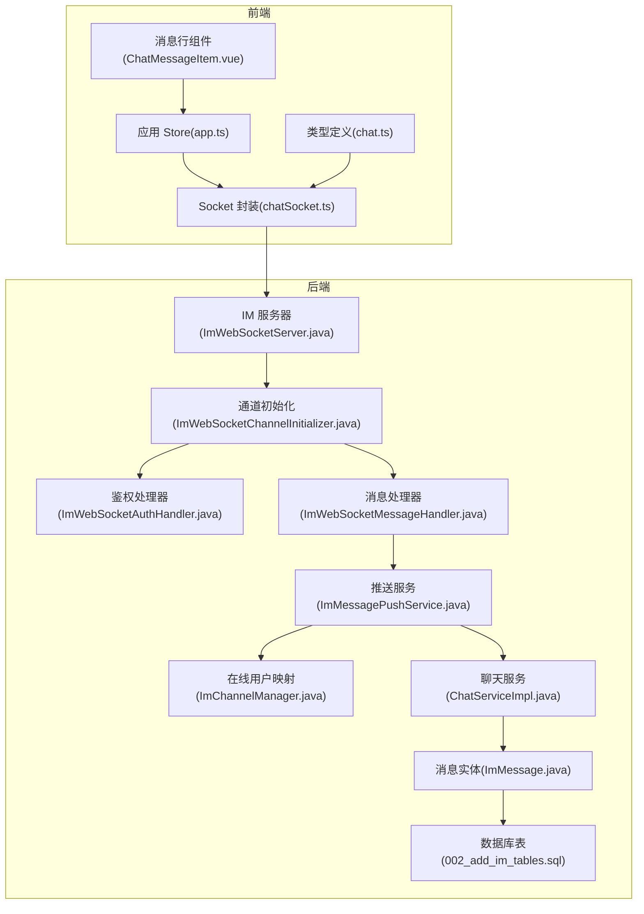
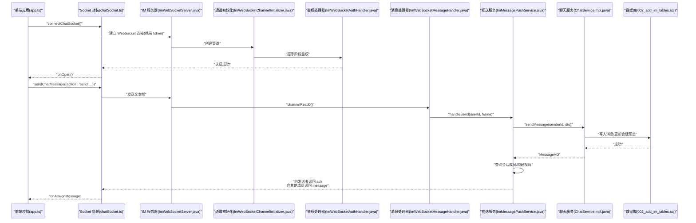
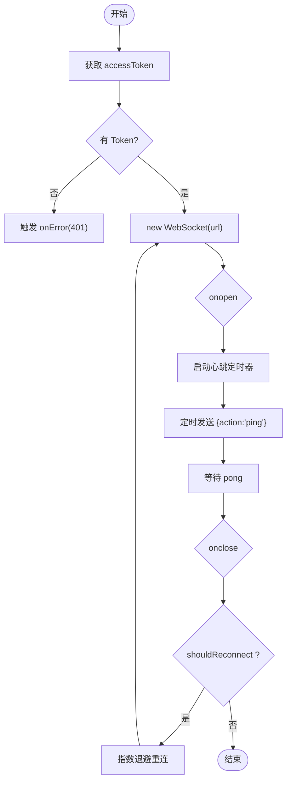
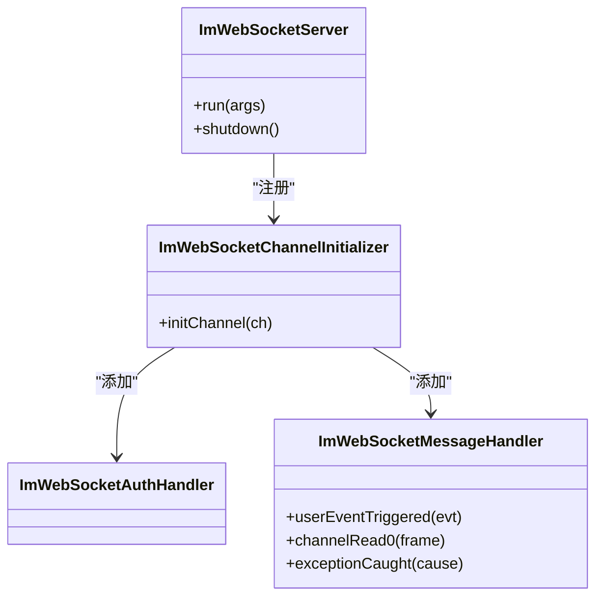
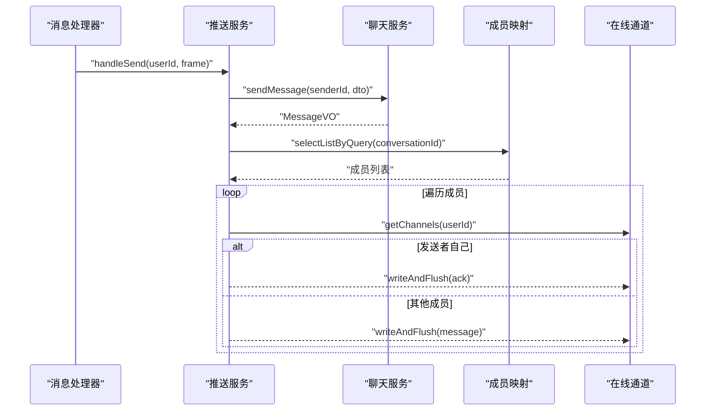
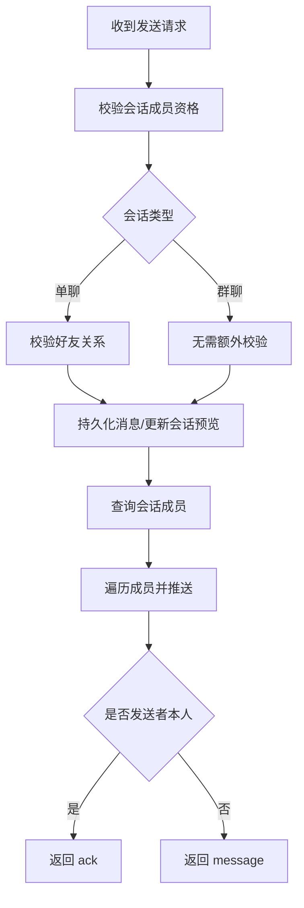
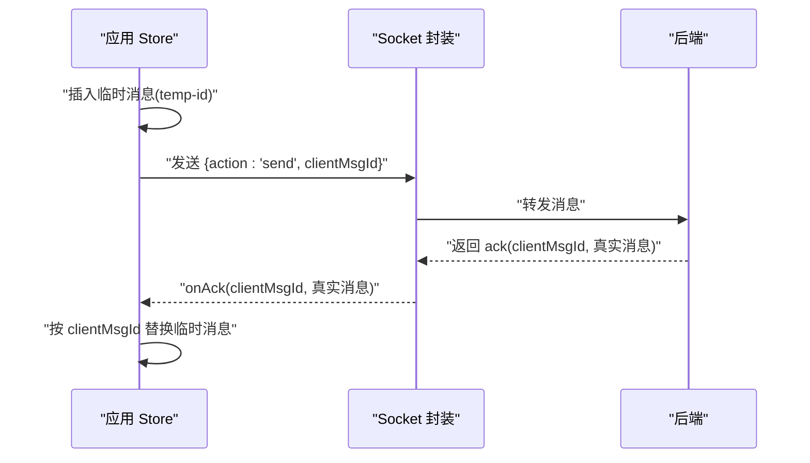
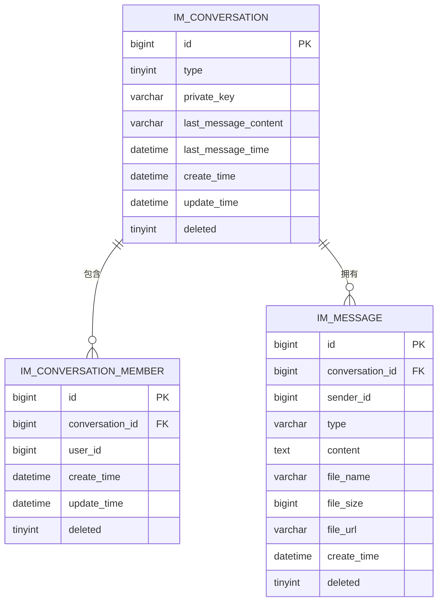
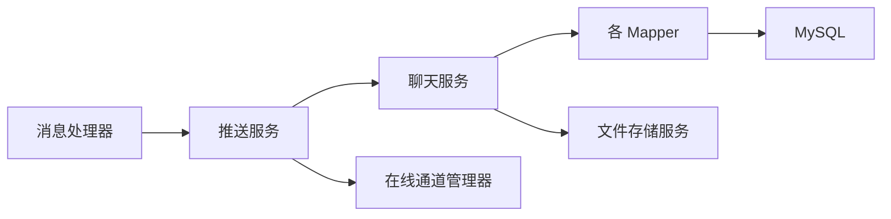

# 即时通讯系统

<cite>
**本文引用的文件**
- [ImWebSocketServer.java](file://linkx-server/src/main/java/com/linkx/server/im/ImWebSocketServer.java)
- [ImWebSocketChannelInitializer.java](file://linkx-server/src/main/java/com/linkx/server/im/ImWebSocketChannelInitializer.java)
- [ImWebSocketMessageHandler.java](file://linkx-server/src/main/java/com/linkx/server/im/ImWebSocketMessageHandler.java)
- [ImChannelManager.java](file://linkx-server/src/main/java/com/linkx/server/im/ImChannelManager.java)
- [ImMessagePushService.java](file://linkx-server/src/main/java/com/linkx/server/im/ImMessagePushService.java)
- [ImWsFrame.java](file://linkx-server/src/main/java/com/linkx/server/im/ImWsFrame.java)
- [ChatServiceImpl.java](file://linkx-server/src/main/java/com/linkx/server/service/impl/ChatServiceImpl.java)
- [ChatService.java](file://linkx-server/src/main/java/com/linkx/server/service/ChatService.java)
- [SendMessageDTO.java](file://linkx-server/src/main/java/com/linkx/server/controller/dto/SendMessageDTO.java)
- [ImMessage.java](file://linkx-server/src/main/java/com/linkx/server/entity/ImMessage.java)
- [002_add_im_tables.sql](file://linkx-server/migrations/002_add_im_tables.sql)
- [application.yml](file://linkx-server/src/main/resources/application.yml)
- [chatSocket.ts](file://linkx-client/src/utils/chatSocket.ts)
- [chat.ts](file://linkx-client/src/types/chat.ts)
- [app.ts](file://linkx-client/src/stores/app.ts)
- [ChatMessageItem.vue](file://linkx-client/src/components/chat/ChatMessageItem.vue)
</cite>

## 目录
1. [简介](#简介)
2. [项目结构](#项目结构)
3. [核心组件](#核心组件)
4. [架构总览](#架构总览)
5. [详细组件分析](#详细组件分析)
6. [依赖关系分析](#依赖关系分析)
7. [性能考虑](#性能考虑)
8. [故障排查指南](#故障排查指南)
9. [结论](#结论)
10. [附录：消息协议与客户端集成示例](#附录消息协议与客户端集成示例)

## 简介
本文件为 LinkX 即时通讯系统的实现文档，围绕基于 Netty WebSocket 的高性能实时通信架构展开，覆盖以下关键主题：
- 前端 Socket 连接管理、心跳与重连策略
- 后端 WebSocket 服务器配置、认证与消息处理链路
- 会话管理与消息路由（单聊/群聊）
- 消息乐观更新与确认机制
- 数据持久化策略与离线消息能力设计建议
- 完整消息协议定义与客户端集成要点

## 项目结构
本项目采用前后端分离的模块化组织方式：
- 后端（Spring Boot + MyBatis-Flex + Netty）
  - IM 模块：Netty 启动、通道初始化、鉴权、消息处理器、推送服务、在线用户映射
  - 业务层：聊天与会话、成员、消息等 CRUD 与校验
  - 数据层：MySQL 表结构与实体映射
- 前端（Vue 3 + TypeScript + Electron）
  - 状态管理：会话、消息、登录态、主题等
  - 网络层：HTTP API 与 WebSocket 封装
  - UI 组件：聊天面板、气泡渲染等

图表来源
- [ImWebSocketServer.java:1-82](file://linkx-server/src/main/java/com/linkx/server/im/ImWebSocketServer.java#L1-L82)
- [ImWebSocketChannelInitializer.java:1-38](file://linkx-server/src/main/java/com/linkx/server/im/ImWebSocketChannelInitializer.java#L1-L38)
- [ImWebSocketMessageHandler.java:1-62](file://linkx-server/src/main/java/com/linkx/server/im/ImWebSocketMessageHandler.java#L1-L62)
- [ImMessagePushService.java:1-136](file://linkx-server/src/main/java/com/linkx/server/im/ImMessagePushService.java#L1-L136)
- [ImChannelManager.java:1-41](file://linkx-server/src/main/java/com/linkx/server/im/ImChannelManager.java#L1-L41)
- [ChatServiceImpl.java:1-379](file://linkx-server/src/main/java/com/linkx/server/service/impl/ChatServiceImpl.java#L1-L379)
- [ImMessage.java:1-52](file://linkx-server/src/main/java/com/linkx/server/entity/ImMessage.java#L1-L52)
- [002_add_im_tables.sql:1-45](file://linkx-server/migrations/002_add_im_tables.sql#L1-L45)
- [chatSocket.ts:1-144](file://linkx-client/src/utils/chatSocket.ts#L1-L144)
- [chat.ts:1-57](file://linkx-client/src/types/chat.ts#L1-L57)
- [app.ts:1-800](file://linkx-client/src/stores/app.ts#L1-L800)
- [ChatMessageItem.vue:1-176](file://linkx-client/src/components/chat/ChatMessageItem.vue#L1-L176)

章节来源
- [ImWebSocketServer.java:1-82](file://linkx-server/src/main/java/com/linkx/server/im/ImWebSocketServer.java#L1-L82)
- [ImWebSocketChannelInitializer.java:1-38](file://linkx-server/src/main/java/com/linkx/server/im/ImWebSocketChannelInitializer.java#L1-L38)
- [ImWebSocketMessageHandler.java:1-62](file://linkx-server/src/main/java/com/linkx/server/im/ImWebSocketMessageHandler.java#L1-L62)
- [ImMessagePushService.java:1-136](file://linkx-server/src/main/java/com/linkx/server/im/ImMessagePushService.java#L1-L136)
- [ImChannelManager.java:1-41](file://linkx-server/src/main/java/com/linkx/server/im/ImChannelManager.java#L1-L41)
- [ChatServiceImpl.java:1-379](file://linkx-server/src/main/java/com/linkx/server/service/impl/ChatServiceImpl.java#L1-L379)
- [ImMessage.java:1-52](file://linkx-server/src/main/java/com/linkx/server/entity/ImMessage.java#L1-L52)
- [002_add_im_tables.sql:1-45](file://linkx-server/migrations/002_add_im_tables.sql#L1-L45)
- [chatSocket.ts:1-144](file://linkx-client/src/utils/chatSocket.ts#L1-L144)
- [chat.ts:1-57](file://linkx-client/src/types/chat.ts#L1-L57)
- [app.ts:1-800](file://linkx-client/src/stores/app.ts#L1-L800)
- [ChatMessageItem.vue:1-176](file://linkx-client/src/components/chat/ChatMessageItem.vue#L1-L176)

## 核心组件
- 前端
  - 连接管理：自动重连、指数退避、心跳保活、错误回调
  - 消息处理：解析服务端帧、区分 message/ack/error/pong
  - 乐观更新：发送前插入临时消息，收到 ack 后替换为真实消息
  - 会话与消息状态：会话列表、历史分页、未读计数、置顶/免打扰
- 后端
  - Netty 服务器：独立端口、握手路径、管道编排
  - 鉴权：从 URL token 解析用户并绑定 Channel
  - 消息路由：按会话成员分发，发送者返回 ack，接收者返回 message
  - 业务校验：会话权限、好友关系、消息类型与载荷校验
  - 持久化：消息落库、会话最后消息预览与时间更新

章节来源
- [chatSocket.ts:1-144](file://linkx-client/src/utils/chatSocket.ts#L1-L144)
- [app.ts:1-800](file://linkx-client/src/stores/app.ts#L1-L800)
- [ImWebSocketServer.java:1-82](file://linkx-server/src/main/java/com/linkx/server/im/ImWebSocketServer.java#L1-L82)
- [ImWebSocketChannelInitializer.java:1-38](file://linkx-server/src/main/java/com/linkx/server/im/ImWebSocketChannelInitializer.java#L1-L38)
- [ImWebSocketMessageHandler.java:1-62](file://linkx-server/src/main/java/com/linkx/server/im/ImWebSocketMessageHandler.java#L1-L62)
- [ImMessagePushService.java:1-136](file://linkx-server/src/main/java/com/linkx/server/im/ImMessagePushService.java#L1-L136)
- [ChatServiceImpl.java:1-379](file://linkx-server/src/main/java/com/linkx/server/service/impl/ChatServiceImpl.java#L1-L379)

## 架构总览
下图展示了从前端发起消息到后端持久化与广播的全链路流程。

图表来源
- [ImWebSocketServer.java:1-82](file://linkx-server/src/main/java/com/linkx/server/im/ImWebSocketServer.java#L1-L82)
- [ImWebSocketChannelInitializer.java:1-38](file://linkx-server/src/main/java/com/linkx/server/im/ImWebSocketChannelInitializer.java#L1-L38)
- [ImWebSocketMessageHandler.java:1-62](file://linkx-server/src/main/java/com/linkx/server/im/ImWebSocketMessageHandler.java#L1-L62)
- [ImMessagePushService.java:1-136](file://linkx-server/src/main/java/com/linkx/server/im/ImMessagePushService.java#L1-L136)
- [ChatServiceImpl.java:1-379](file://linkx-server/src/main/java/com/linkx/server/service/impl/ChatServiceImpl.java#L1-L379)
- [002_add_im_tables.sql:1-45](file://linkx-server/migrations/002_add_im_tables.sql#L1-L45)
- [chatSocket.ts:1-144](file://linkx-client/src/utils/chatSocket.ts#L1-L144)
- [app.ts:1-800](file://linkx-client/src/stores/app.ts#L1-L800)

## 详细组件分析

### 前端 Socket 连接管理
- 连接与重连
  - 使用环境变量或默认地址建立 ws 连接，URL 附带 token 参数
  - 断开后按指数退避策略重连，最大间隔限制
  - 提供显式断开接口，停止重连
- 心跳保活
  - 周期性发送 action=ping，服务端回 pong
- 消息帧处理
  - 解析服务端帧，根据 action 分发：message、ack、error、pong
  - 将 message 与 ack 分别回调给上层 store 处理

图表来源
- [chatSocket.ts:1-144](file://linkx-client/src/utils/chatSocket.ts#L1-L144)

章节来源
- [chatSocket.ts:1-144](file://linkx-client/src/utils/chatSocket.ts#L1-L144)
- [chat.ts:1-57](file://linkx-client/src/types/chat.ts#L1-L57)

### 后端 WebSocket 服务器与通道初始化
- 服务器启动
  - 读取配置中的 IM WebSocket 端口与路径，若未启用则跳过
  - 使用 NIO 事件循环组，绑定端口并注册 ChannelInitializer
- 通道初始化
  - 添加 HTTP 编解码、分块写、聚合器
  - 加入鉴权处理器与 WebSocket 协议处理器
  - 加入消息处理器

图表来源
- [ImWebSocketServer.java:1-82](file://linkx-server/src/main/java/com/linkx/server/im/ImWebSocketServer.java#L1-L82)
- [ImWebSocketChannelInitializer.java:1-38](file://linkx-server/src/main/java/com/linkx/server/im/ImWebSocketChannelInitializer.java#L1-L38)
- [ImWebSocketMessageHandler.java:1-62](file://linkx-server/src/main/java/com/linkx/server/im/ImWebSocketMessageHandler.java#L1-L62)

章节来源
- [ImWebSocketServer.java:1-82](file://linkx-server/src/main/java/com/linkx/server/im/ImWebSocketServer.java#L1-L82)
- [ImWebSocketChannelInitializer.java:1-38](file://linkx-server/src/main/java/com/linkx/server/im/ImWebSocketChannelInitializer.java#L1-L38)
- [ImWebSocketMessageHandler.java:1-62](file://linkx-server/src/main/java/com/linkx/server/im/ImWebSocketMessageHandler.java#L1-L62)

### 消息处理器与推送服务
- 消息处理器
  - 握手完成后记录日志
  - 校验用户是否已认证，未认证直接关闭
  - 解析 JSON 帧，校验 action，支持 ping/send
  - 异常统一捕获并返回 error 帧
- 推送服务
  - handleSend：组装 DTO，调用聊天服务保存消息，再广播
  - pushToConversationMembers：查询会话成员，按视角构造 MessageVO，发送者返回 ack，其他人返回 message
  - sendError/buildPong：通用错误与心跳响应

图表来源
- [ImWebSocketMessageHandler.java:1-62](file://linkx-server/src/main/java/com/linkx/server/im/ImWebSocketMessageHandler.java#L1-L62)
- [ImMessagePushService.java:1-136](file://linkx-server/src/main/java/com/linkx/server/im/ImMessagePushService.java#L1-L136)
- [ChatServiceImpl.java:1-379](file://linkx-server/src/main/java/com/linkx/server/service/impl/ChatServiceImpl.java#L1-L379)

章节来源
- [ImWebSocketMessageHandler.java:1-62](file://linkx-server/src/main/java/com/linkx/server/im/ImWebSocketMessageHandler.java#L1-L62)
- [ImMessagePushService.java:1-136](file://linkx-server/src/main/java/com/linkx/server/im/ImMessagePushService.java#L1-L136)

### 会话管理与消息路由（单聊/群聊）
- 会话创建与权限
  - 单聊通过唯一键 private_key 确定会话，确保双方互为好友
  - 发送前校验会话存在性与成员资格
- 消息路由
  - 根据 conversationId 查询所有成员
  - 对每个成员的在线 ChannelGroup 进行广播
  - 发送者返回 ack，其他成员返回 message

图表来源
- [ChatServiceImpl.java:1-379](file://linkx-server/src/main/java/com/linkx/server/service/impl/ChatServiceImpl.java#L1-L379)
- [ImMessagePushService.java:1-136](file://linkx-server/src/main/java/com/linkx/server/im/ImMessagePushService.java#L1-L136)

章节来源
- [ChatServiceImpl.java:1-379](file://linkx-server/src/main/java/com/linkx/server/service/impl/ChatServiceImpl.java#L1-L379)
- [ImMessagePushService.java:1-136](file://linkx-server/src/main/java/com/linkx/server/im/ImMessagePushService.java#L1-L136)

### 消息乐观更新机制
- 前端在发送前插入一条“临时”消息（id 以 temp- 开头），立即刷新 UI
- 收到 ack 时，用服务端返回的真实消息替换临时消息；若本地不存在则追加
- 同时更新会话 lastMessage 与时间戳

图表来源
- [app.ts:1-800](file://linkx-client/src/stores/app.ts#L1-L800)
- [chatSocket.ts:1-144](file://linkx-client/src/utils/chatSocket.ts#L1-L144)
- [ImMessagePushService.java:1-136](file://linkx-server/src/main/java/com/linkx/server/im/ImMessagePushService.java#L1-L136)

章节来源
- [app.ts:1-800](file://linkx-client/src/stores/app.ts#L1-L800)
- [chatSocket.ts:1-144](file://linkx-client/src/utils/chatSocket.ts#L1-L144)

### 数据持久化策略
- 消息实体包含会话 ID、发送者、类型、内容、文件信息、时间与逻辑删除字段
- 发送成功后更新会话的最后消息预览与时间，便于会话列表展示
- 表结构包含会话、成员、消息三张核心表，并提供必要索引

图表来源
- [ImMessage.java:1-52](file://linkx-server/src/main/java/com/linkx/server/entity/ImMessage.java#L1-L52)
- [002_add_im_tables.sql:1-45](file://linkx-server/migrations/002_add_im_tables.sql#L1-L45)

章节来源
- [ImMessage.java:1-52](file://linkx-server/src/main/java/com/linkx/server/entity/ImMessage.java#L1-L52)
- [002_add_im_tables.sql:1-45](file://linkx-server/migrations/002_add_im_tables.sql#L1-L45)
- [ChatServiceImpl.java:1-379](file://linkx-server/src/main/java/com/linkx/server/service/impl/ChatServiceImpl.java#L1-L379)

## 依赖关系分析
- 组件耦合
  - 消息处理器依赖推送服务与对象序列化器
  - 推送服务依赖聊天服务、成员映射与在线通道管理器
  - 聊天服务依赖多个 Mapper 与文件存储
- 外部依赖
  - MySQL 用于持久化
  - Redis 用于缓存（当前代码中未直接使用，可用作离线消息队列）
  - MinIO 用于文件存储

图表来源
- [ImWebSocketMessageHandler.java:1-62](file://linkx-server/src/main/java/com/linkx/server/im/ImWebSocketMessageHandler.java#L1-L62)
- [ImMessagePushService.java:1-136](file://linkx-server/src/main/java/com/linkx/server/im/ImMessagePushService.java#L1-L136)
- [ImChannelManager.java:1-41](file://linkx-server/src/main/java/com/linkx/server/im/ImChannelManager.java#L1-L41)
- [ChatServiceImpl.java:1-379](file://linkx-server/src/main/java/com/linkx/server/service/impl/ChatServiceImpl.java#L1-L379)

章节来源
- [ImWebSocketMessageHandler.java:1-62](file://linkx-server/src/main/java/com/linkx/server/im/ImWebSocketMessageHandler.java#L1-L62)
- [ImMessagePushService.java:1-136](file://linkx-server/src/main/java/com/linkx/server/im/ImMessagePushService.java#L1-L136)
- [ImChannelManager.java:1-41](file://linkx-server/src/main/java/com/linkx/server/im/ImChannelManager.java#L1-L41)
- [ChatServiceImpl.java:1-379](file://linkx-server/src/main/java/com/linkx/server/service/impl/ChatServiceImpl.java#L1-L379)

## 性能考虑
- 连接与线程模型
  - Netty 使用 NIO 事件循环，boss/worker 分组，适合高并发长连接
- 消息广播优化
  - 推送服务按成员遍历 ChannelGroup，避免无效通道写入
  - 建议在热点会话场景下引入内存缓存或分区广播
- 心跳与重连
  - 前端心跳周期适中，避免频繁占用带宽
  - 指数退避重连降低瞬时风暴风险
- 数据库与索引
  - 消息表按会话+时间排序查询，已有复合索引
  - 会话预览字段减少二次查询开销
- 文件传输
  - 大文件走对象存储，仅传递 URL，避免阻塞消息通道

[本节为通用指导，不直接分析具体文件]

## 故障排查指南
- 常见错误码
  - 401：未认证（缺少 token 或 token 无效）
  - 400：参数缺失或格式错误（如缺少 action、无效 ID）
  - 403：无权访问会话或非好友
  - 404：会话不存在
  - 500：消息处理失败或序列化失败
- 定位步骤
  - 检查前端 onOpen/onError/onClose 回调与 isOffline 状态
  - 查看后端日志：握手完成、消息处理异常、序列化失败
  - 核对 application.yml 中 IM 端口与路径配置
  - 验证数据库表结构与索引是否存在

章节来源
- [ImWebSocketMessageHandler.java:1-62](file://linkx-server/src/main/java/com/linkx/server/im/ImWebSocketMessageHandler.java#L1-L62)
- [ImMessagePushService.java:1-136](file://linkx-server/src/main/java/com/linkx/server/im/ImMessagePushService.java#L1-L136)
- [application.yml:1-54](file://linkx-server/src/main/resources/application.yml#L1-L54)

## 结论
LinkX 即时通讯系统通过 Netty 实现了高性能的 WebSocket 通信，结合前端乐观更新与 ack 确认机制，提供了良好的用户体验。后端在会话权限、消息类型与载荷校验方面较为完善，数据持久化策略清晰。后续可在离线消息、消息去重、批量推送与监控告警等方面进一步增强。

[本节为总结性内容，不直接分析具体文件]

## 附录：消息协议与客户端集成示例

### 消息协议定义
- 通用帧结构
  - action：字符串，标识动作类型
  - clientMsgId：客户端消息 ID（用于 ack 匹配）
  - conversationId：会话 ID
  - msgType：消息类型（text/image/file）
  - content：文本内容或图片/文件 URL
  - fileName：文件名
  - fileSize：文件大小
  - fileUrl：文件/图片 URL
  - code/message：错误码与错误信息
  - data：消息体（MessageItem）
- 客户端发送
  - action=send，携带上述字段
- 服务端返回
  - action=message：推送给非发送者的消息
  - action=ack：返回给发送者的确认，包含 clientMsgId 与真实消息
  - action=error：错误响应
  - action=pong：心跳响应

章节来源
- [ImWsFrame.java:1-20](file://linkx-server/src/main/java/com/linkx/server/im/ImWsFrame.java#L1-L20)
- [chat.ts:1-57](file://linkx-client/src/types/chat.ts#L1-L57)
- [ImMessagePushService.java:1-136](file://linkx-server/src/main/java/com/linkx/server/im/ImMessagePushService.java#L1-L136)

### 客户端集成示例（要点）
- 连接与认证
  - 使用 connectChatSocket 传入回调，自动附加 token
- 发送消息
  - 生成 clientMsgId，先插入临时消息，再通过 sendChatMessage 发送
- 处理响应
  - onAck 替换临时消息；onMessage 追加新消息并更新会话预览
- 心跳与重连
  - 自动心跳与指数退避重连，保持连接稳定

章节来源
- [chatSocket.ts:1-144](file://linkx-client/src/utils/chatSocket.ts#L1-L144)
- [app.ts:1-800](file://linkx-client/src/stores/app.ts#L1-L800)
- [ChatMessageItem.vue:1-176](file://linkx-client/src/components/chat/ChatMessageItem.vue#L1-L176)