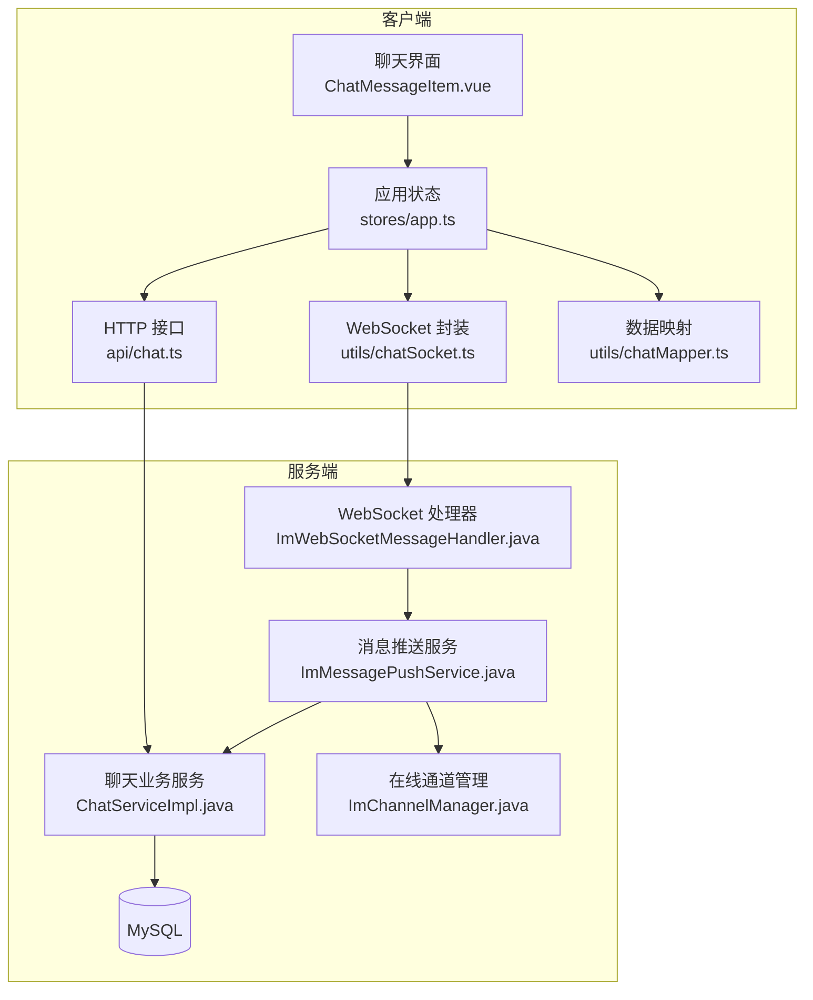
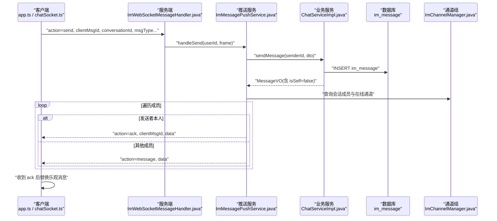
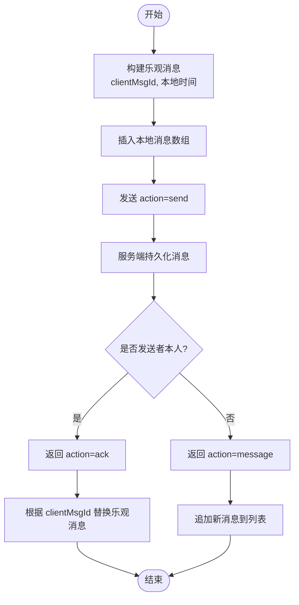
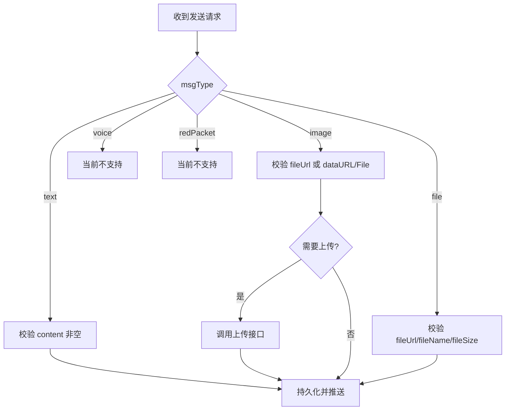
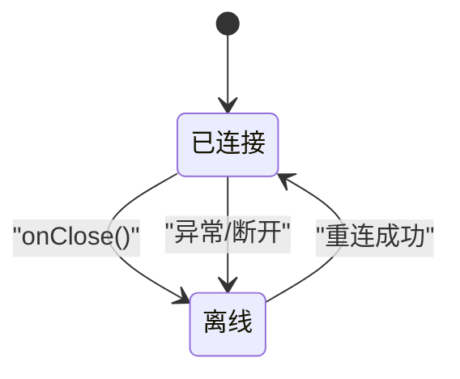
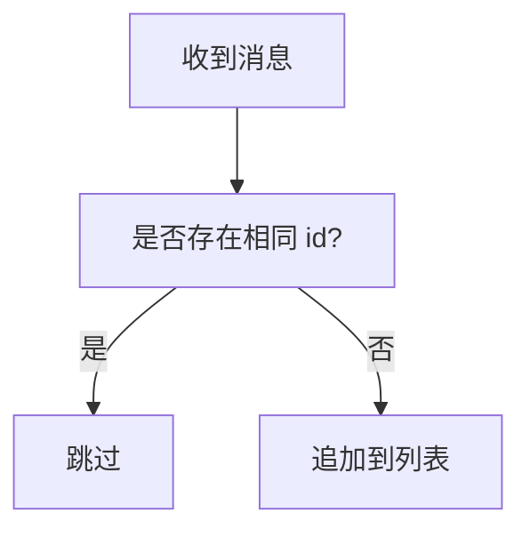
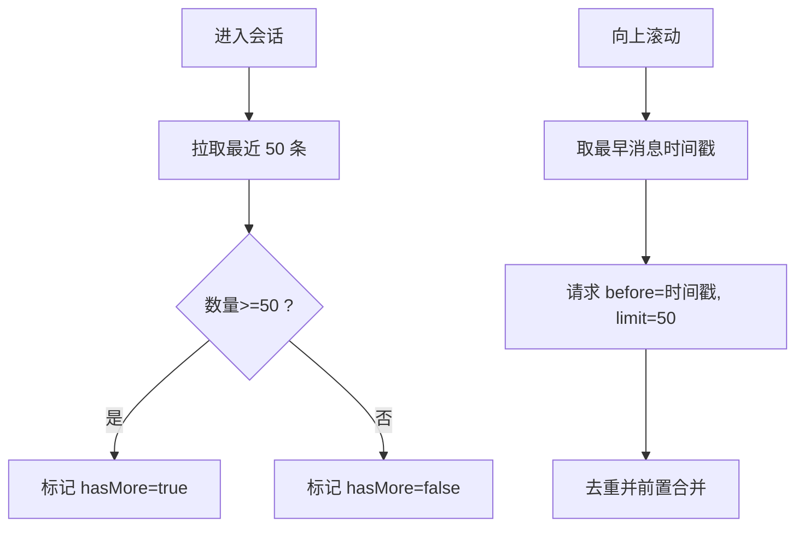
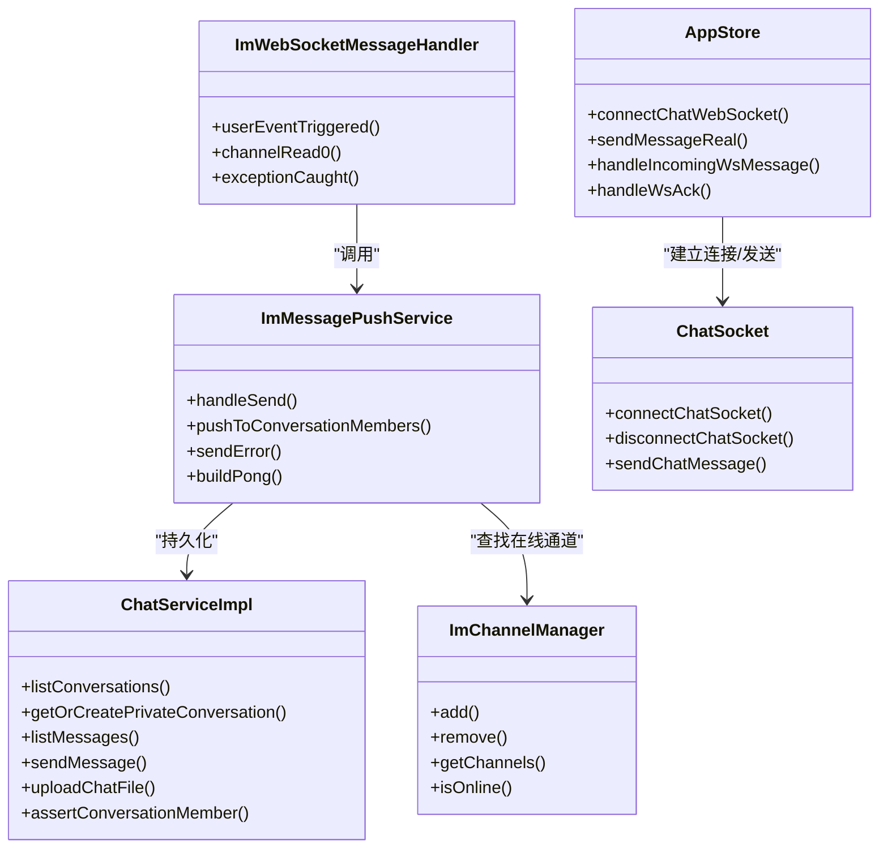
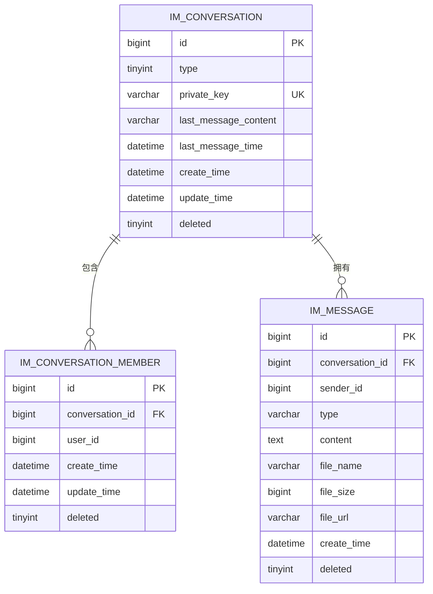
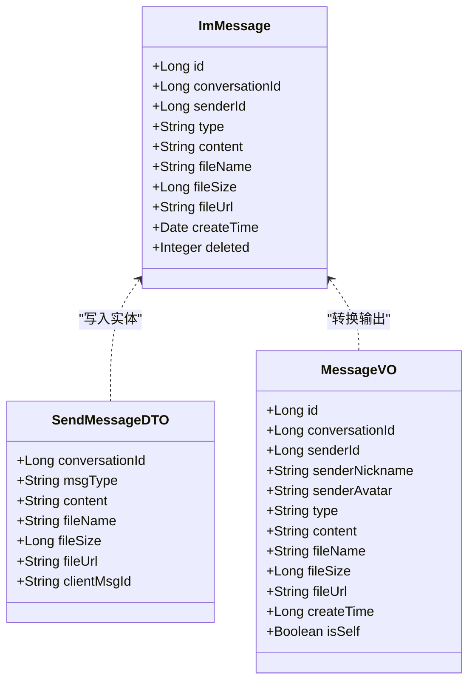

# 消息处理系统

<cite>
**本文引用的文件**   
- [ImWebSocketMessageHandler.java](file://linkx-server/src/main/java/com/linkx/server/im/ImWebSocketMessageHandler.java)
- [ImMessagePushService.java](file://linkx-server/src/main/java/com/linkx/server/im/ImMessagePushService.java)
- [ImChannelManager.java](file://linkx-server/src/main/java/com/linkx/server/im/ImChannelManager.java)
- [ChatService.java](file://linkx-server/src/main/java/com/linkx/server/service/ChatService.java)
- [ChatServiceImpl.java](file://linkx-server/src/main/java/com/linkx/server/service/impl/ChatServiceImpl.java)
- [ImMessage.java](file://linkx-server/src/main/java/com/linkx/server/entity/ImMessage.java)
- [002_add_im_tables.sql](file://linkx-server/migrations/002_add_im_tables.sql)
- [SendMessageDTO.java](file://linkx-server/src/main/java/com/linkx/server/controller/dto/SendMessageDTO.java)
- [MessageVO.java](file://linkx-server/src/main/java/com/linkx/server/controller/vo/MessageVO.java)
- [chatSocket.ts](file://linkx-client/src/utils/chatSocket.ts)
- [chatMapper.ts](file://linkx-client/src/utils/chatMapper.ts)
- [app.ts](file://linkx-client/src/stores/app.ts)
- [chat.ts（类型定义）](file://linkx-client/src/types/chat.ts)
- [chat.ts（API）](file://linkx-client/src/api/chat.ts)
- [ChatMessageItem.vue](file://linkx-client/src/components/chat/ChatMessageItem.vue)
</cite>

## 目录
1. [简介](#简介)
2. [项目结构](#项目结构)
3. [核心组件](#核心组件)
4. [架构总览](#架构总览)
5. [详细组件分析](#详细组件分析)
6. [依赖关系分析](#依赖关系分析)
7. [性能与优化](#性能与优化)
8. [故障排查指南](#故障排查指南)
9. [结论](#结论)
10. [附录：数据模型与流程图](#附录数据模型与流程图)

## 简介
本文件为 LinkX 消息处理系统的实现文档，覆盖消息生命周期管理、乐观更新机制、消息确认流程与持久化策略；说明文本、图片、文件等消息类型的处理逻辑；阐述消息状态同步与离线处理；并给出消息去重、历史查询与性能优化方案。文末提供完整的数据模型定义与关键流程图。

## 项目结构
- 服务端采用 Spring Boot + Netty WebSocket 架构，负责会话管理、消息路由、持久化与推送。
- 客户端基于 Vue3 + Pinia + TypeScript，通过 HTTP 拉取会话与历史，通过 WebSocket 实时收发消息。
- 数据库使用 MySQL，IM 相关表由 Flyway 风格迁移脚本创建与维护。

**图示来源**
- [ImWebSocketMessageHandler.java:1-62](file://linkx-server/src/main/java/com/linkx/server/im/ImWebSocketMessageHandler.java#L1-L62)
- [ImMessagePushService.java:1-136](file://linkx-server/src/main/java/com/linkx/server/im/ImMessagePushService.java#L1-L136)
- [ImChannelManager.java:1-41](file://linkx-server/src/main/java/com/linkx/server/im/ImChannelManager.java#L1-L41)
- [ChatServiceImpl.java:1-379](file://linkx-server/src/main/java/com/linkx/server/service/impl/ChatServiceImpl.java#L1-L379)
- [chatSocket.ts:1-144](file://linkx-client/src/utils/chatSocket.ts#L1-L144)
- [app.ts:1-800](file://linkx-client/src/stores/app.ts#L1-L800)
- [chat.ts（API）:1-28](file://linkx-client/src/api/chat.ts#L1-L28)
- [chatMapper.ts:1-57](file://linkx-client/src/utils/chatMapper.ts#L1-L57)

**章节来源**
- [ImWebSocketMessageHandler.java:1-62](file://linkx-server/src/main/java/com/linkx/server/im/ImWebSocketMessageHandler.java#L1-L62)
- [ImMessagePushService.java:1-136](file://linkx-server/src/main/java/com/linkx/server/im/ImMessagePushService.java#L1-L136)
- [ImChannelManager.java:1-41](file://linkx-server/src/main/java/com/linkx/server/im/ImChannelManager.java#L1-L41)
- [ChatServiceImpl.java:1-379](file://linkx-server/src/main/java/com/linkx/server/service/impl/ChatServiceImpl.java#L1-L379)
- [chatSocket.ts:1-144](file://linkx-client/src/utils/chatSocket.ts#L1-L144)
- [app.ts:1-800](file://linkx-client/src/stores/app.ts#L1-L800)
- [chat.ts（API）:1-28](file://linkx-client/src/api/chat.ts#L1-L28)
- [chatMapper.ts:1-57](file://linkx-client/src/utils/chatMapper.ts#L1-L57)

## 核心组件
- WebSocket 接入层：负责握手、鉴权、心跳与消息分发。
- 消息推送服务：将消息持久化后广播给会话成员，区分发送者与其他成员。
- 聊天业务服务：会话与消息的增删改查、权限校验、预览生成、分页历史。
- 在线通道管理：维护用户到 ChannelGroup 的映射，支持在线判断与批量推送。
- 客户端连接封装：自动重连、心跳、帧解析与错误上报。
- 应用状态管理：会话列表、消息缓存、乐观插入、ACK 替换、未读计数与离线态。

**章节来源**
- [ImWebSocketMessageHandler.java:1-62](file://linkx-server/src/main/java/com/linkx/server/im/ImWebSocketMessageHandler.java#L1-L62)
- [ImMessagePushService.java:1-136](file://linkx-server/src/main/java/com/linkx/server/im/ImMessagePushService.java#L1-L136)
- [ImChannelManager.java:1-41](file://linkx-server/src/main/java/com/linkx/server/im/ImChannelManager.java#L1-L41)
- [ChatService.java:1-25](file://linkx-server/src/main/java/com/linkx/server/service/ChatService.java#L1-L25)
- [ChatServiceImpl.java:1-379](file://linkx-server/src/main/java/com/linkx/server/service/impl/ChatServiceImpl.java#L1-L379)
- [chatSocket.ts:1-144](file://linkx-client/src/utils/chatSocket.ts#L1-L144)
- [app.ts:1-800](file://linkx-client/src/stores/app.ts#L1-L800)

## 架构总览
下图展示了从客户端发起“发送”到服务端落库与推送的全链路流程，以及 ACK 返回后的乐观消息替换过程。

**图示来源**
- [ImWebSocketMessageHandler.java:27-54](file://linkx-server/src/main/java/com/linkx/server/im/ImWebSocketMessageHandler.java#L27-L54)
- [ImMessagePushService.java:30-73](file://linkx-server/src/main/java/com/linkx/server/im/ImMessagePushService.java#L30-L73)
- [ChatServiceImpl.java:171-204](file://linkx-server/src/main/java/com/linkx/server/service/impl/ChatServiceImpl.java#L171-L204)
- [ImChannelManager.java:19-34](file://linkx-server/src/main/java/com/linkx/server/im/ImChannelManager.java#L19-L34)
- [app.ts:637-749](file://linkx-client/src/stores/app.ts#L637-L749)
- [chatSocket.ts:52-78](file://linkx-client/src/utils/chatSocket.ts#L52-L78)

## 详细组件分析

### 消息生命周期与确认流程
- 客户端在发送前构造临时消息（乐观插入），分配 clientMsgId，立即渲染。
- 服务端接收 action=send，校验与会话权限，持久化消息，按成员推送：
  - 对发送者返回 action=ack，携带服务端 id 与时间戳。
  - 对其他成员返回 action=message。
- 客户端收到 ack 后，以 clientMsgId 定位并替换乐观消息，保证最终一致性。

**图示来源**
- [app.ts:637-749](file://linkx-client/src/stores/app.ts#L637-L749)
- [ImMessagePushService.java:45-73](file://linkx-server/src/main/java/com/linkx/server/im/ImMessagePushService.java#L45-L73)
- [ChatServiceImpl.java:171-204](file://linkx-server/src/main/java/com/linkx/server/service/impl/ChatServiceImpl.java#L171-L204)

**章节来源**
- [app.ts:478-523](file://linkx-client/src/stores/app.ts#L478-L523)
- [ImMessagePushService.java:30-73](file://linkx-server/src/main/java/com/linkx/server/im/ImMessagePushService.java#L30-L73)
- [ChatServiceImpl.java:171-204](file://linkx-server/src/main/java/com/linkx/server/service/impl/ChatServiceImpl.java#L171-L204)

### 消息类型处理逻辑
- 文本：content 非空，直接存储与展示。
- 图片：优先使用上传后的 fileUrl，若无则回退 content；前端支持 dataURL 转 File 上传。
- 文件：必须包含 fileUrl、fileName、fileSize；前端先调用上传接口获取 URL 再发送。
- 语音/红包：当前真实会话暂不支持（会抛出错误提示），仅演示路径存在。

**图示来源**
- [ChatServiceImpl.java:333-369](file://linkx-server/src/main/java/com/linkx/server/service/impl/ChatServiceImpl.java#L333-L369)
- [app.ts:696-748](file://linkx-client/src/stores/app.ts#L696-L748)

**章节来源**
- [ChatServiceImpl.java:333-369](file://linkx-server/src/main/java/com/linkx/server/service/impl/ChatServiceImpl.java#L333-L369)
- [app.ts:696-748](file://linkx-client/src/stores/app.ts#L696-L748)

### 消息状态同步与离线处理
- 在线态：WebSocket 打开时置 isOffline=false；关闭时置 isOffline=true。
- 断线重连：指数退避重试，最长间隔限制；心跳周期 25s，服务端响应 pong。
- 未读计数：当新消息来自非当前会话且未静音时，会话 unread+1。
- 历史加载：首屏默认 50 条，超过则标记 hasMore；向上翻页基于 before 时间戳分页。

**图示来源**
- [chatSocket.ts:33-50](file://linkx-client/src/utils/chatSocket.ts#L33-L50)
- [app.ts:448-476](file://linkx-client/src/stores/app.ts#L448-L476)
- [app.ts:364-414](file://linkx-client/src/stores/app.ts#L364-L414)

**章节来源**
- [chatSocket.ts:33-50](file://linkx-client/src/utils/chatSocket.ts#L33-L50)
- [app.ts:448-476](file://linkx-client/src/stores/app.ts#L448-L476)
- [app.ts:364-414](file://linkx-client/src/stores/app.ts#L364-L414)

### 消息去重算法
- 服务端推送时对同一条消息不会重复推送至同一用户。
- 客户端在收到 message 时，若本地已存在相同 id 则跳过追加；ACK 替换时同样避免重复插入。

**图示来源**
- [app.ts:478-501](file://linkx-client/src/stores/app.ts#L478-L501)
- [app.ts:503-523](file://linkx-client/src/stores/app.ts#L503-L523)

**章节来源**
- [app.ts:478-501](file://linkx-client/src/stores/app.ts#L478-L501)
- [app.ts:503-523](file://linkx-client/src/stores/app.ts#L503-L523)

### 消息压缩传输
- 当前实现未启用二进制或压缩协议，消息体为 JSON 文本。
- 建议后续可引入 Protobuf 或 gzip 压缩，结合大附件走独立下载流以降低主通道负载。

[本节为通用建议，不直接分析具体文件]

### 消息历史查询
- 首次进入会话拉取最近 50 条；hasMore 控制是否继续上拉。
- 上拉参数 before 为最早一条消息的时间戳，服务端据此过滤更早记录。
- 结果按 create_time 升序拼接，保持时间顺序。

**图示来源**
- [app.ts:364-414](file://linkx-client/src/stores/app.ts#L364-L414)
- [ChatServiceImpl.java:135-168](file://linkx-server/src/main/java/com/linkx/server/service/impl/ChatServiceImpl.java#L135-L168)

**章节来源**
- [app.ts:364-414](file://linkx-client/src/stores/app.ts#L364-L414)
- [ChatServiceImpl.java:135-168](file://linkx-server/src/main/java/com/linkx/server/service/impl/ChatServiceImpl.java#L135-L168)

### 前端消息渲染与交互
- 单条消息行组件根据 type 分发到对应气泡子组件（文本、图片、文件、语音、红包、数据卡片）。
- 支持右键菜单、播放语音、打开文件/图片、点击红包、查看资料卡等事件向上传递。

**章节来源**
- [ChatMessageItem.vue:1-176](file://linkx-client/src/components/chat/ChatMessageItem.vue#L1-L176)

## 依赖关系分析
- 控制器与服务层解耦：WebSocket 处理器仅做动作分发，业务集中在 ChatService。
- 推送服务依赖成员表与通道管理器，确保只推送在线成员。
- 客户端通过统一 API 模块访问后端，WebSocket 与 HTTP 职责清晰。

**图示来源**
- [ImWebSocketMessageHandler.java:1-62](file://linkx-server/src/main/java/com/linkx/server/im/ImWebSocketMessageHandler.java#L1-L62)
- [ImMessagePushService.java:1-136](file://linkx-server/src/main/java/com/linkx/server/im/ImMessagePushService.java#L1-L136)
- [ChatServiceImpl.java:1-379](file://linkx-server/src/main/java/com/linkx/server/service/impl/ChatServiceImpl.java#L1-L379)
- [ImChannelManager.java:1-41](file://linkx-server/src/main/java/com/linkx/server/im/ImChannelManager.java#L1-L41)
- [chatSocket.ts:1-144](file://linkx-client/src/utils/chatSocket.ts#L1-L144)
- [app.ts:1-800](file://linkx-client/src/stores/app.ts#L1-L800)

**章节来源**
- [ImWebSocketMessageHandler.java:1-62](file://linkx-server/src/main/java/com/linkx/server/im/ImWebSocketMessageHandler.java#L1-L62)
- [ImMessagePushService.java:1-136](file://linkx-server/src/main/java/com/linkx/server/im/ImMessagePushService.java#L1-L136)
- [ChatServiceImpl.java:1-379](file://linkx-server/src/main/java/com/linkx/server/service/impl/ChatServiceImpl.java#L1-L379)
- [ImChannelManager.java:1-41](file://linkx-server/src/main/java/com/linkx/server/im/ImChannelManager.java#L1-L41)
- [chatSocket.ts:1-144](file://linkx-client/src/utils/chatSocket.ts#L1-L144)
- [app.ts:1-800](file://linkx-client/src/stores/app.ts#L1-L800)

## 性能与优化
- 分页与限流：历史消息默认 50 条，上限 100，避免一次性加载过多。
- 索引设计：im_message 按 (conversation_id, create_time) 组合索引提升分页查询效率。
- 推送批量化：按用户聚合 ChannelGroup 进行批量写，减少 I/O 次数。
- 预览字段：会话表维护 last_message_content/time，列表页无需二次查询消息。
- 前端去重与增量：基于 id 去重与 hasMore 控制，降低重复渲染与网络开销。
- 建议优化方向：
  - 引入二进制序列化（如 Protobuf）与可选 gzip 压缩。
  - 大文件分片上传与断点续传。
  - 消息幂等键（clientMsgId）在服务端做去重，防止网络抖动导致重复入队。
  - 热点会话的消息推送可考虑本地缓存与扇出优化。

**章节来源**
- [ChatServiceImpl.java:135-168](file://linkx-server/src/main/java/com/linkx/server/service/impl/ChatServiceImpl.java#L135-L168)
- [002_add_im_tables.sql:31-44](file://linkx-server/migrations/002_add_im_tables.sql#L31-L44)
- [ImMessagePushService.java:45-73](file://linkx-server/src/main/java/com/linkx/server/im/ImMessagePushService.java#L45-L73)

## 故障排查指南
- 认证失败：WebSocket 未携带 token 或 token 过期，服务端返回 401 并关闭连接。
- 非法 action：缺少 action 或不支持的 action，返回 400。
- 序列化异常：JSON 序列化失败返回 500 错误帧。
- 权限不足：非会话成员或好友关系不满足，抛出 403。
- 文件上传失败：前端捕获错误并移除乐观消息，需检查存储配置与大小限制。
- 心跳超时：客户端 25s 发送 ping，长时间无 pong 触发重连。

**章节来源**
- [ImWebSocketMessageHandler.java:27-54](file://linkx-server/src/main/java/com/linkx/server/im/ImWebSocketMessageHandler.java#L27-L54)
- [ImMessagePushService.java:75-90](file://linkx-server/src/main/java/com/linkx/server/im/ImMessagePushService.java#L75-L90)
- [ChatServiceImpl.java:229-250](file://linkx-server/src/main/java/com/linkx/server/service/impl/ChatServiceImpl.java#L229-L250)
- [app.ts:696-748](file://linkx-client/src/stores/app.ts#L696-L748)
- [chatSocket.ts:33-50](file://linkx-client/src/utils/chatSocket.ts#L33-L50)

## 结论
LinkX 消息系统以 WebSocket 为核心，结合乐观更新与 ACK 确认，实现了低延迟、一致性的即时通信体验。服务端通过清晰的层次划分与索引优化保障稳定性与可扩展性。未来可在压缩、幂等、分片与大文件场景进一步演进。

## 附录：数据模型与流程图

### 数据模型（ER）

**图示来源**
- [002_add_im_tables.sql:6-44](file://linkx-server/migrations/002_add_im_tables.sql#L6-L44)

### 类图（服务端核心）

**图示来源**
- [ImMessage.java:1-52](file://linkx-server/src/main/java/com/linkx/server/entity/ImMessage.java#L1-L52)
- [SendMessageDTO.java:1-26](file://linkx-server/src/main/java/com/linkx/server/controller/dto/SendMessageDTO.java#L1-L26)
- [MessageVO.java:1-32](file://linkx-server/src/main/java/com/linkx/server/controller/vo/MessageVO.java#L1-L32)

### 客户端类型与帧格式
- 发送帧：action=send，携带 clientMsgId、conversationId、msgType、content/fileUrl 等。
- 接收帧：action=message/ack/pong/error，ack 附带 clientMsgId 用于替换乐观消息。

**章节来源**
- [chat.ts（类型定义）:37-54](file://linkx-client/src/types/chat.ts#L37-L54)
- [chatSocket.ts:52-78](file://linkx-client/src/utils/chatSocket.ts#L52-L78)