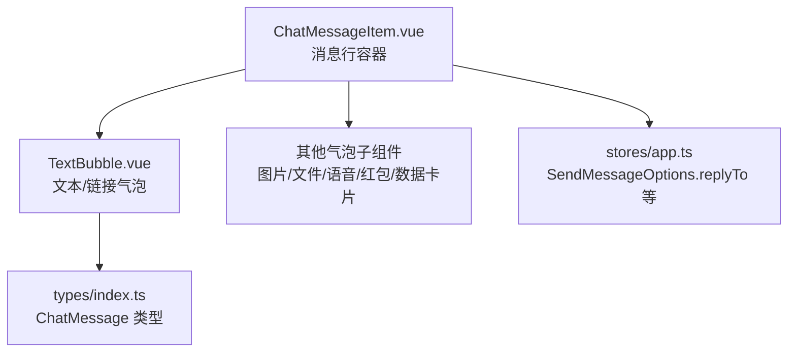
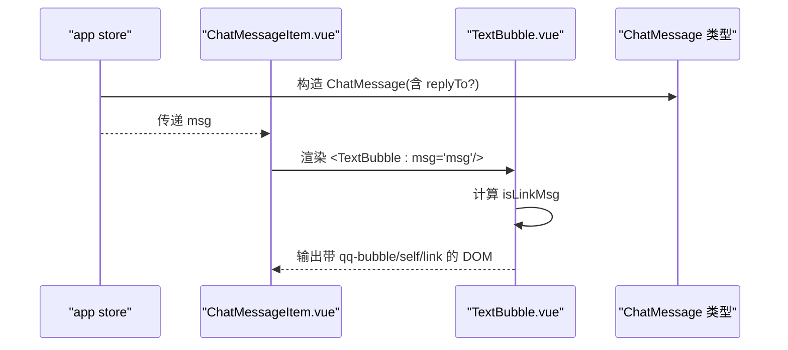
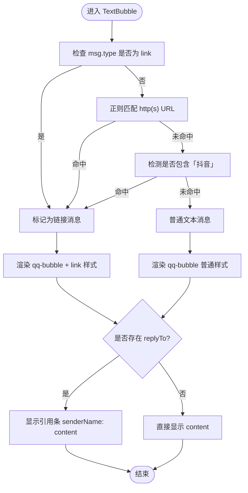
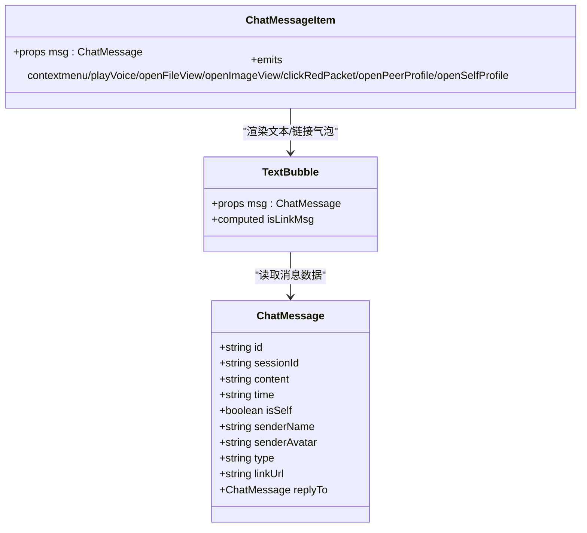

# 文本消息

<cite>
**本文引用的文件**
- [TextBubble.vue](file://linkx-client/src/components/chat/bubbles/TextBubble.vue)
- [ChatMessageItem.vue](file://linkx-client/src/components/chat/ChatMessageItem.vue)
- [index.ts](file://linkx-client/src/types/index.ts)
- [app.ts](file://linkx-client/src/stores/app.ts)
</cite>

## 目录
1. [简介](#简介)
2. [项目结构](#项目结构)
3. [核心组件](#核心组件)
4. [架构总览](#架构总览)
5. [详细组件分析](#详细组件分析)
6. [依赖关系分析](#依赖关系分析)
7. [性能与可访问性](#性能与可访问性)
8. [常见问题排查](#常见问题排查)
9. [结论](#结论)
10. [附录：样式类名规范与扩展指南](#附录样式类名规范与扩展指南)

## 简介
本文件为 LinkX 文本消息组件的技术文档，聚焦于 TextBubble.vue 的实现原理与使用方式。内容涵盖：
- 文本渲染逻辑与链接自动识别（HTTP/HTTPS URL、抖音关键字）
- 回复引用展示
- props 接口定义与响应式行为
- 样式类名规范（qq-bubble、self、link）
- 文本消息数据结构定义、内容格式化规则与自定义样式配置方法
- 实际使用示例与常见问题解决方案

## 项目结构
文本消息的渲染由“消息行容器”与“气泡子组件”协作完成：
- ChatMessageItem.vue：根据消息类型分发到对应气泡子组件，并处理头像、事件向上传递等布局与交互。
- TextBubble.vue：负责纯文本或链接样式的渲染、链接检测与回复引用条展示。
- types/index.ts：定义 ChatMessage 等全局业务类型。
- stores/app.ts：定义发送消息时的可选参数（如 replyTo 引用），以及会话状态管理。

图表来源
- [ChatMessageItem.vue:82-89](file://linkx-client/src/components/chat/ChatMessageItem.vue#L82-L89)
- [TextBubble.vue:13-31](file://linkx-client/src/components/chat/bubbles/TextBubble.vue#L13-L31)
- [index.ts:44-83](file://linkx-client/src/types/index.ts#L44-L83)
- [app.ts:47-60](file://linkx-client/src/stores/app.ts#L47-L60)

章节来源
- [ChatMessageItem.vue:1-96](file://linkx-client/src/components/chat/ChatMessageItem.vue#L1-L96)
- [TextBubble.vue:1-33](file://linkx-client/src/components/chat/bubbles/TextBubble.vue#L1-L33)
- [index.ts:44-83](file://linkx-client/src/types/index.ts#L44-L83)
- [app.ts:47-60](file://linkx-client/src/stores/app.ts#L47-L60)

## 核心组件
- TextBubble.vue
  - 接收一个 msg 属性，类型为 ChatMessage。
  - 计算属性 isLinkMsg 用于判断是否为链接类消息：当 type 为 link、content 包含 http(s) URL 或包含“抖音”关键字时生效。
  - 模板中通过 class 绑定动态添加 self 与 link 样式；若存在 replyTo，则显示引用条。
- ChatMessageItem.vue
  - 作为消息行容器，按 msg.type 分发到不同气泡组件，默认回退到 TextBubble。
  - 提供头像、右键菜单、播放语音、打开文件/图片、红包、资料卡等事件向上传递。

章节来源
- [TextBubble.vue:13-31](file://linkx-client/src/components/chat/bubbles/TextBubble.vue#L13-L31)
- [ChatMessageItem.vue:82-89](file://linkx-client/src/components/chat/ChatMessageItem.vue#L82-L89)

## 架构总览
文本消息从数据到渲染的关键路径如下：
- 数据层：ChatMessage 定义消息结构与字段（含 replyTo 引用）。
- 状态层：sendMessage 支持传入 replyTo 等选项，构造最终消息对象。
- 视图层：ChatMessageItem 将消息分发给 TextBubble；TextBubble 根据 isLinkMsg 和 replyTo 渲染样式与引用条。

图表来源
- [app.ts:47-60](file://linkx-client/src/stores/app.ts#L47-L60)
- [index.ts:44-83](file://linkx-client/src/types/index.ts#L44-L83)
- [ChatMessageItem.vue:82-89](file://linkx-client/src/components/chat/ChatMessageItem.vue#L82-L89)
- [TextBubble.vue:13-31](file://linkx-client/src/components/chat/bubbles/TextBubble.vue#L13-L31)

## 详细组件分析

### TextBubble.vue 实现要点
- Props 接口
  - msg: ChatMessage（必需）
- 计算属性
  - isLinkMsg：判定条件包括 type === 'link'、content 匹配 http(s) URL、content 包含“抖音”。
- 模板渲染
  - 外层容器使用类名 qq-bubble，并通过 msg.isSelf 动态添加 self 类以区分左右侧样式。
  - 当 isLinkMsg 为真时，额外添加 link 类以启用链接样式。
  - 若 msg.replyTo 存在，则渲染引用条，内容为 “发送者昵称: 引用内容”。
  - 正文段落使用 qq-bubble-text 类，保留换行与断词。
  - 当是链接消息时，在右侧显示链接图标。

图表来源
- [TextBubble.vue:16-19](file://linkx-client/src/components/chat/bubbles/TextBubble.vue#L16-L19)
- [TextBubble.vue:24-31](file://linkx-client/src/components/chat/bubbles/TextBubble.vue#L24-L31)

章节来源
- [TextBubble.vue:13-31](file://linkx-client/src/components/chat/bubbles/TextBubble.vue#L13-L31)

### ChatMessageItem.vue 的分发与事件
- 根据 msg.type 选择具体气泡组件，未匹配时默认使用 TextBubble。
- 对外暴露 contextmenu、playVoice、openFileView、openImageView、clickRedPacket、openPeerProfile、openSelfProfile 等事件，供父组件统一处理。
- 单聊场景下，对方头像可点击打开资料卡；自己侧头像点击打开个人资料。

章节来源
- [ChatMessageItem.vue:82-95](file://linkx-client/src/components/chat/ChatMessageItem.vue#L82-L95)

### 数据类型与引用回复
- ChatMessage 类型
  - 基础字段：id、sessionId、content、time、isSelf、senderName、senderAvatar、type、linkUrl 等。
  - 扩展字段：文件、图片、语音、红包、数据卡片相关字段。
  - 引用回复：replyTo?: ChatMessage，表示被引用的原消息。
- 发送消息选项
  - SendMessageOptions 支持传入 replyTo，以便在发送时携带引用信息。

章节来源
- [index.ts:44-83](file://linkx-client/src/types/index.ts#L44-L83)
- [app.ts:47-60](file://linkx-client/src/stores/app.ts#L47-L60)

## 依赖关系分析
- TextBubble.vue 依赖：
  - naive-ui 的 NIcon 与 @vicons/ionicons5 的 LinkOutline 图标。
  - ChatMessage 类型定义。
  - Vue 的 computed 与 defineProps。
- ChatMessageItem.vue 依赖：
  - 各气泡子组件（TextBubble、ImageBubble、FileBubble、VoiceBubble、RedPacketBubble、DataCardBubble）。
  - Avatar 通用头像组件。
  - app store 获取当前会话信息。

图表来源
- [index.ts:44-83](file://linkx-client/src/types/index.ts#L44-L83)
- [TextBubble.vue:13-31](file://linkx-client/src/components/chat/bubbles/TextBubble.vue#L13-L31)
- [ChatMessageItem.vue:82-95](file://linkx-client/src/components/chat/ChatMessageItem.vue#L82-L95)

章节来源
- [TextBubble.vue:1-33](file://linkx-client/src/components/chat/bubbles/TextBubble.vue#L1-33)
- [ChatMessageItem.vue:1-96](file://linkx-client/src/components/chat/ChatMessageItem.vue#L1-96)
- [index.ts:44-83](file://linkx-client/src/types/index.ts#L44-L83)

## 性能与可访问性
- 计算属性 isLinkMsg 仅在 msg 变化时重新计算，避免重复正则匹配开销。
- 链接检测采用一次性正则匹配与字符串包含判断，复杂度低，适合高频渲染的消息列表。
- 建议：
  - 对超长文本进行截断或折叠，减少重排。
  - 链接点击可通过外部路由或系统浏览器打开，避免页面内跳转导致的滚动抖动。
  - 为链接区域增加键盘可访问性与焦点指示，提升无障碍体验。

[本节为通用指导，不直接分析具体文件]

## 常见问题排查
- 链接未识别
  - 确认 content 是否包含 http(s) 前缀，或 type 是否为 link。
  - 若需识别更多平台关键字，可在 isLinkMsg 中扩展检测逻辑。
- 引用条不显示
  - 检查 msg.replyTo 是否存在且包含 senderName 与 content。
  - 确保上层在发送消息时正确传入 replyTo。
- 样式异常
  - 确认外层容器是否正确应用 qq-bubble、self、link 类名。
  - 检查全局样式是否覆盖默认样式。

章节来源
- [TextBubble.vue:16-31](file://linkx-client/src/components/chat/bubbles/TextBubble.vue#L16-L31)
- [ChatMessageItem.vue:82-95](file://linkx-client/src/components/chat/ChatMessageItem.vue#L82-L95)
- [app.ts:47-60](file://linkx-client/src/stores/app.ts#L47-L60)

## 结论
TextBubble.vue 以最小依赖实现了文本与链接的统一渲染，并通过 isLinkMsg 与 replyTo 提供了良好的可扩展性与可读性。配合 ChatMessageItem.vue 的类型分发机制，整体链路清晰、易于维护与扩展。

[本节为总结，不直接分析具体文件]

## 附录：样式类名规范与扩展指南
- 类名约定
  - qq-bubble：气泡容器基础样式。
  - self：自身消息侧样式（右对齐、背景色等）。
  - link：链接消息样式（调整文本排版与图标显示）。
  - qq-bubble-reply：引用条样式。
  - qq-bubble-text：正文段落样式。
  - qq-link-ico：链接图标样式。
- 自定义样式
  - 通过覆盖上述类名的 CSS 变量或具体样式即可定制主题。
  - 如需新增平台关键字识别，可在 isLinkMsg 的计算逻辑中添加新的包含判断或正则表达式。
- 使用示例（概念说明）
  - 在消息列表中渲染文本消息：
    - 将 ChatMessage 对象作为 msg 传入 ChatMessageItem.vue。
    - 若需要引用回复，在 sendMessage 时传入 replyTo 选项。
  - 自定义链接样式：
    - 在 link 类名下调整文本颜色、背景或图标位置。
  - 自定义引用条样式：
    - 在 qq-bubble-reply 类名下调整字体大小、边框与溢出处理。

章节来源
- [ChatMessageItem.vue:122-176](file://linkx-client/src/components/chat/ChatMessageItem.vue#L122-L176)
- [TextBubble.vue:24-31](file://linkx-client/src/components/chat/bubbles/TextBubble.vue#L24-L31)
- [app.ts:47-60](file://linkx-client/src/stores/app.ts#L47-L60)