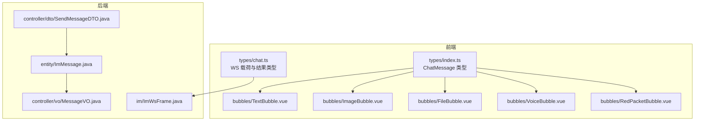
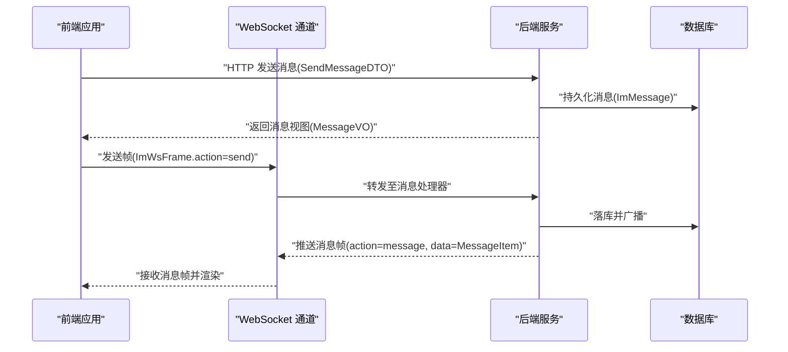
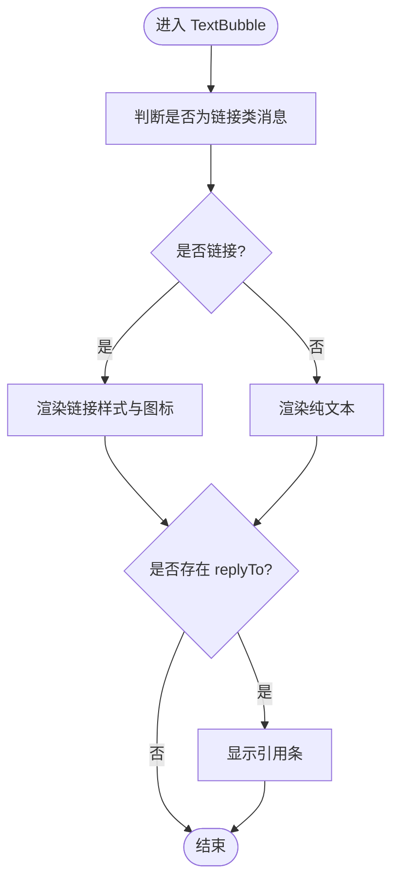
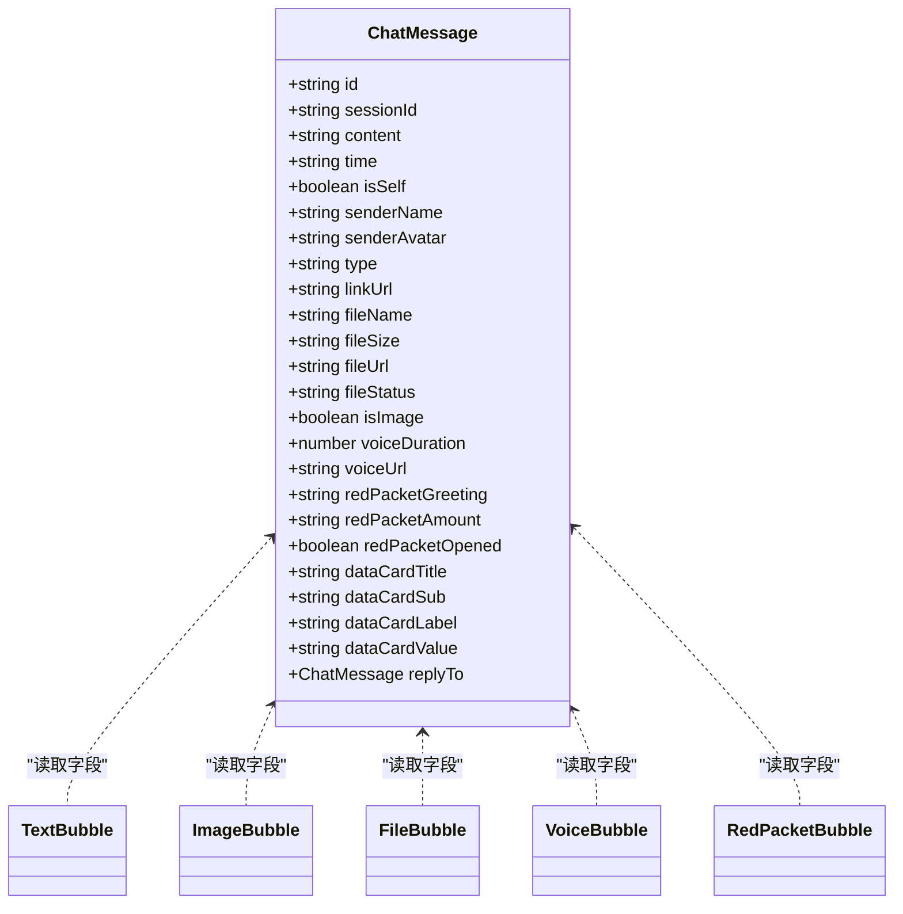

# 消息类型支持

<cite>
**本文引用的文件**
- [linkx-client/src/types/index.ts](file://linkx-client/src/types/index.ts)
- [linkx-client/src/types/chat.ts](file://linkx-client/src/types/chat.ts)
- [linkx-client/src/components/chat/bubbles/TextBubble.vue](file://linkx-client/src/components/chat/bubbles/TextBubble.vue)
- [linkx-client/src/components/chat/bubbles/ImageBubble.vue](file://linkx-client/src/components/chat/bubbles/ImageBubble.vue)
- [linkx-client/src/components/chat/bubbles/FileBubble.vue](file://linkx-client/src/components/chat/bubbles/FileBubble.vue)
- [linkx-client/src/components/chat/bubbles/VoiceBubble.vue](file://linkx-client/src/components/chat/bubbles/VoiceBubble.vue)
- [linkx-client/src/components/chat/bubbles/RedPacketBubble.vue](file://linkx-client/src/components/chat/bubbles/RedPacketBubble.vue)
- [linkx-server/src/main/java/com/linkx/server/controller/dto/SendMessageDTO.java](file://linkx-server/src/main/java/com/linkx/server/controller/dto/SendMessageDTO.java)
- [linkx-server/src/main/java/com/linkx/server/entity/ImMessage.java](file://linkx-server/src/main/java/com/linkx/server/entity/ImMessage.java)
- [linkx-server/src/main/java/com/linkx/server/im/ImWsFrame.java](file://linkx-server/src/main/java/com/linkx/server/im/ImWsFrame.java)
- [linkx-server/src/main/java/com/linkx/server/controller/vo/MessageVO.java](file://linkx-server/src/main/java/com/linkx/server/controller/vo/MessageVO.java)
</cite>

## 目录
1. [简介](#简介)
2. [项目结构](#项目结构)
3. [核心组件](#核心组件)
4. [架构总览](#架构总览)
5. [详细组件分析](#详细组件分析)
6. [依赖分析](#依赖分析)
7. [性能考虑](#性能考虑)
8. [故障排查指南](#故障排查指南)
9. [结论](#结论)
10. [附录](#附录)

## 简介
本文件面向 LinkX 的消息类型支持系统，系统性梳理文本、图片、文件、语音、红包等消息类型的实现架构、渲染组件与业务逻辑。文档覆盖：
- 各消息类型的处理流程、UI 展示与用户交互
- 消息类型扩展机制与自定义消息开发指南
- 前后端消息序列化协议（HTTP 与 WebSocket）
- 各消息类型的 API 规范、组件使用示例与样式定制方案

## 项目结构
前端采用 Vue 3 + TypeScript，消息气泡以独立组件形式组织在 chat/bubbles 目录下；后端基于 Spring Boot，提供 HTTP 接口与 WebSocket 通道，消息实体与传输帧定义清晰。

图表来源
- [linkx-client/src/types/index.ts:44-83](file://linkx-client/src/types/index.ts#L44-L83)
- [linkx-client/src/types/chat.ts:37-54](file://linkx-client/src/types/chat.ts#L37-L54)
- [linkx-client/src/components/chat/bubbles/TextBubble.vue:1-33](file://linkx-client/src/components/chat/bubbles/TextBubble.vue#L1-L33)
- [linkx-client/src/components/chat/bubbles/ImageBubble.vue:1-19](file://linkx-client/src/components/chat/bubbles/ImageBubble.vue#L1-L19)
- [linkx-client/src/components/chat/bubbles/FileBubble.vue:1-32](file://linkx-client/src/components/chat/bubbles/FileBubble.vue#L1-L32)
- [linkx-client/src/components/chat/bubbles/VoiceBubble.vue:1-33](file://linkx-client/src/components/chat/bubbles/VoiceBubble.vue#L1-L33)
- [linkx-client/src/components/chat/bubbles/RedPacketBubble.vue:1-25](file://linkx-client/src/components/chat/bubbles/RedPacketBubble.vue#L1-L25)
- [linkx-server/src/main/java/com/linkx/server/controller/dto/SendMessageDTO.java:1-26](file://linkx-server/src/main/java/com/linkx/server/controller/dto/SendMessageDTO.java#L1-L26)
- [linkx-server/src/main/java/com/linkx/server/entity/ImMessage.java:1-52](file://linkx-server/src/main/java/com/linkx/server/entity/ImMessage.java#L1-L52)
- [linkx-server/src/main/java/com/linkx/server/im/ImWsFrame.java:1-20](file://linkx-server/src/main/java/com/linkx/server/im/ImWsFrame.java#L1-L20)
- [linkx-server/src/main/java/com/linkx/server/controller/vo/MessageVO.java:1-32](file://linkx-server/src/main/java/com/linkx/server/controller/vo/MessageVO.java#L1-L32)

章节来源
- [linkx-client/src/types/index.ts:44-83](file://linkx-client/src/types/index.ts#L44-L83)
- [linkx-client/src/types/chat.ts:37-54](file://linkx-client/src/types/chat.ts#L37-L54)
- [linkx-server/src/main/java/com/linkx/server/entity/ImMessage.java:25-27](file://linkx-server/src/main/java/com/linkx/server/entity/ImMessage.java#L25-L27)

## 核心组件
- ChatMessage 类型：统一描述单条消息的通用字段与按类型扩展字段，是前端渲染与状态管理的核心契约。
- 消息气泡组件：TextBubble、ImageBubble、FileBubble、VoiceBubble、RedPacketBubble 分别负责对应消息类型的 UI 呈现与基础交互。
- 后端消息模型：ImMessage 为持久化实体，SendMessageDTO 为 HTTP 入参，MessageVO 为 HTTP 出参，ImWsFrame 为 WebSocket 帧。

章节来源
- [linkx-client/src/types/index.ts:44-83](file://linkx-client/src/types/index.ts#L44-L83)
- [linkx-client/src/components/chat/bubbles/TextBubble.vue:1-33](file://linkx-client/src/components/chat/bubbles/TextBubble.vue#L1-L33)
- [linkx-client/src/components/chat/bubbles/ImageBubble.vue:1-19](file://linkx-client/src/components/chat/bubbles/ImageBubble.vue#L1-L19)
- [linkx-client/src/components/chat/bubbles/FileBubble.vue:1-32](file://linkx-client/src/components/chat/bubbles/FileBubble.vue#L1-L32)
- [linkx-client/src/components/chat/bubbles/VoiceBubble.vue:1-33](file://linkx-client/src/components/chat/bubbles/VoiceBubble.vue#L1-L33)
- [linkx-client/src/components/chat/bubbles/RedPacketBubble.vue:1-25](file://linkx-client/src/components/chat/bubbles/RedPacketBubble.vue#L1-L25)
- [linkx-server/src/main/java/com/linkx/server/entity/ImMessage.java:25-44](file://linkx-server/src/main/java/com/linkx/server/entity/ImMessage.java#L25-L44)
- [linkx-server/src/main/java/com/linkx/server/controller/dto/SendMessageDTO.java:8-25](file://linkx-server/src/main/java/com/linkx/server/controller/dto/SendMessageDTO.java#L8-L25)
- [linkx-server/src/main/java/com/linkx/server/controller/vo/MessageVO.java:10-31](file://linkx-server/src/main/java/com/linkx/server/controller/vo/MessageVO.java#L10-L31)
- [linkx-server/src/main/java/com/linkx/server/im/ImWsFrame.java:6-19](file://linkx-server/src/main/java/com/linkx/server/im/ImWsFrame.java#L6-L19)

## 架构总览
下图展示了从客户端到服务端再到数据库的端到端消息流转路径，以及 WebSocket 实时推送的关键节点。

图表来源
- [linkx-server/src/main/java/com/linkx/server/controller/dto/SendMessageDTO.java:8-25](file://linkx-server/src/main/java/com/linkx/server/controller/dto/SendMessageDTO.java#L8-L25)
- [linkx-server/src/main/java/com/linkx/server/entity/ImMessage.java:25-44](file://linkx-server/src/main/java/com/linkx/server/entity/ImMessage.java#L25-L44)
- [linkx-server/src/main/java/com/linkx/server/controller/vo/MessageVO.java:10-31](file://linkx-server/src/main/java/com/linkx/server/controller/vo/MessageVO.java#L10-L31)
- [linkx-server/src/main/java/com/linkx/server/im/ImWsFrame.java:6-19](file://linkx-server/src/main/java/com/linkx/server/im/ImWsFrame.java#L6-L19)
- [linkx-client/src/types/chat.ts:37-54](file://linkx-client/src/types/chat.ts#L37-L54)

## 详细组件分析

### 文本消息（text / link）
- 数据契约：ChatMessage.type 包含 text 与 link；content 承载文本或链接 URL；replyTo 用于引用回复预览。
- 渲染逻辑：TextBubble 根据 type 与 content 自动识别链接类消息，附加链接图标与样式；同时支持引用条显示。
- 交互要点：点击链接由上层路由或浏览器行为处理；引用信息来自 replyTo 字段。

图表来源
- [linkx-client/src/components/chat/bubbles/TextBubble.vue:15-31](file://linkx-client/src/components/chat/bubbles/TextBubble.vue#L15-L31)
- [linkx-client/src/types/index.ts:44-83](file://linkx-client/src/types/index.ts#L44-L83)

章节来源
- [linkx-client/src/components/chat/bubbles/TextBubble.vue:1-33](file://linkx-client/src/components/chat/bubbles/TextBubble.vue#L1-L33)
- [linkx-client/src/types/index.ts:44-83](file://linkx-client/src/types/index.ts#L44-L83)

### 图片消息（image）
- 数据契约：ChatMessage.type=image，content 存储图片 URL 或 DataURL；isImage 可作为辅助标记。
- 渲染逻辑：ImageBubble 直接渲染 img 标签，父组件可接管点击事件进行大图预览。
- 交互要点：建议配合懒加载与占位图提升体验。

章节来源
- [linkx-client/src/components/chat/bubbles/ImageBubble.vue:1-19](file://linkx-client/src/components/chat/bubbles/ImageBubble.vue#L1-L19)
- [linkx-client/src/types/index.ts:44-83](file://linkx-client/src/types/index.ts#L44-L83)

### 文件消息（file）
- 数据契约：ChatMessage.type=file，扩展字段包括 fileName、fileSize、fileUrl、fileStatus。
- 渲染逻辑：FileBubble 展示文件名、大小与底部状态条（如“已发送/已下载”）。
- 交互要点：点击卡片触发下载或打开操作，状态由 fileStatus 驱动。

章节来源
- [linkx-client/src/components/chat/bubbles/FileBubble.vue:1-32](file://linkx-client/src/components/chat/bubbles/FileBubble.vue#L1-L32)
- [linkx-client/src/types/index.ts:44-83](file://linkx-client/src/types/index.ts#L44-L83)

### 语音消息（voice）
- 数据契约：ChatMessage.type=voice，voiceDuration 表示时长（秒），voiceUrl 为音频地址。
- 渲染逻辑：VoiceBubble 显示麦克风图标与格式化后的时长；playing 控制播放态高亮。
- 交互要点：点击播放/暂停，更新 playing 与当前播放时间。

章节来源
- [linkx-client/src/components/chat/bubbles/VoiceBubble.vue:1-33](file://linkx-client/src/components/chat/bubbles/VoiceBubble.vue#L1-L33)
- [linkx-client/src/types/index.ts:44-83](file://linkx-client/src/types/index.ts#L44-L83)

### 红包消息（redPacket）
- 数据契约：ChatMessage.type=redPacket，扩展字段包括 redPacketGreeting、redPacketAmount、redPacketOpened。
- 渲染逻辑：RedPacketBubble 展示祝福语与领取状态，opened 时降低不透明度。
- 交互要点：点击触发领取流程，成功后更新 opened 状态。

章节来源
- [linkx-client/src/components/chat/bubbles/RedPacketBubble.vue:1-25](file://linkx-client/src/components/chat/bubbles/RedPacketBubble.vue#L1-L25)
- [linkx-client/src/types/index.ts:44-83](file://linkx-client/src/types/index.ts#L44-L83)

### 数据卡片（dataCard）
- 数据契约：ChatMessage.type=dataCard，扩展字段包括 dataCardTitle、dataCardSub、dataCardLabel、dataCardValue。
- 渲染建议：可按标题、副标题、键值对布局展示，便于嵌入第三方数据卡片。
- 交互要点：可结合点击跳转或展开详情。

章节来源
- [linkx-client/src/types/index.ts:44-83](file://linkx-client/src/types/index.ts#L44-L83)

## 依赖分析
- 前端类型依赖：所有气泡组件均依赖 ChatMessage 类型定义，确保渲染一致性与可扩展性。
- 后端模型依赖：ImMessage 作为持久化实体，被 DTO/VO 复用；WebSocket 帧 ImWsFrame 与前端 WsSendPayload/WsIncomingFrame 语义对齐。
- 耦合与内聚：
  - 前端通过类型解耦 UI 与数据，新增消息类型仅需扩展 ChatMessage 与对应气泡组件。
  - 后端通过实体与 VO/DTO 分层，避免将内部结构直接暴露给外部。

图表来源
- [linkx-client/src/types/index.ts:44-83](file://linkx-client/src/types/index.ts#L44-L83)
- [linkx-client/src/components/chat/bubbles/TextBubble.vue:1-33](file://linkx-client/src/components/chat/bubbles/TextBubble.vue#L1-L33)
- [linkx-client/src/components/chat/bubbles/ImageBubble.vue:1-19](file://linkx-client/src/components/chat/bubbles/ImageBubble.vue#L1-L19)
- [linkx-client/src/components/chat/bubbles/FileBubble.vue:1-32](file://linkx-client/src/components/chat/bubbles/FileBubble.vue#L1-L32)
- [linkx-client/src/components/chat/bubbles/VoiceBubble.vue:1-33](file://linkx-client/src/components/chat/bubbles/VoiceBubble.vue#L1-L33)
- [linkx-client/src/components/chat/bubbles/RedPacketBubble.vue:1-25](file://linkx-client/src/components/chat/bubbles/RedPacketBubble.vue#L1-L25)

## 性能考虑
- 图片与文件：优先使用懒加载与缩略图策略，减少首屏压力；大文件下载建议使用分片与断点续传。
- 语音消息：按需加载音频流，避免一次性加载长音频；播放列表管理需去重与释放资源。
- 消息列表渲染：对长列表使用虚拟滚动，仅渲染可视区域消息项。
- 网络与缓存：对静态资源启用强缓存；对频繁读取的会话元数据使用本地缓存。

## 故障排查指南
- 消息类型不一致：检查 ChatMessage.type 与后端 ImMessage.type 是否匹配，确保枚举常量一致。
- WebSocket 帧缺失字段：确认 ImWsFrame 与前端 WsSendPayload/WsIncomingFrame 字段对齐，避免解析失败。
- 文件下载失败：核对 fileUrl 有效性、跨域与鉴权头；检查 fileStatus 状态机是否正确推进。
- 语音播放异常：校验 voiceUrl 可达性与 MIME 类型；注意浏览器自动播放策略限制。
- 红包状态不同步：领取后需同步更新 redPacketOpened 并广播最新状态。

章节来源
- [linkx-server/src/main/java/com/linkx/server/entity/ImMessage.java:25-27](file://linkx-server/src/main/java/com/linkx/server/entity/ImMessage.java#L25-L27)
- [linkx-server/src/main/java/com/linkx/server/im/ImWsFrame.java:6-19](file://linkx-server/src/main/java/com/linkx/server/im/ImWsFrame.java#L6-L19)
- [linkx-client/src/types/chat.ts:37-54](file://linkx-client/src/types/chat.ts#L37-L54)

## 结论
LinkX 的消息类型体系以 ChatMessage 为核心契约，通过模块化气泡组件实现多类型渲染；后端以 ImMessage 为中心，配合 DTO/VO 与 WebSocket 帧完成端到端通信。该设计具备良好的扩展性，新增消息类型只需扩展类型定义与对应组件，并在后端补齐持久化与传输支持即可。

## 附录

### 消息类型扩展机制与自定义开发指南
- 前端步骤
  - 在 ChatMessage.type 字面量中新增类型标识。
  - 在 ChatMessage 中添加必要的扩展字段。
  - 新建气泡组件，读取 ChatMessage 字段进行渲染与交互。
  - 在消息列表渲染处注册新组件分支。
- 后端步骤
  - 在 ImMessage 中补充必要字段（如需要）。
  - 在 SendMessageDTO 与 MessageVO 中保持字段一致性。
  - 在 WebSocket 帧 ImWsFrame 中增加相应字段（如需要）。
  - 完善消息落库、广播与反序列化处理。

章节来源
- [linkx-client/src/types/index.ts:44-83](file://linkx-client/src/types/index.ts#L44-L83)
- [linkx-server/src/main/java/com/linkx/server/controller/dto/SendMessageDTO.java:8-25](file://linkx-server/src/main/java/com/linkx/server/controller/dto/SendMessageDTO.java#L8-L25)
- [linkx-server/src/main/java/com/linkx/server/entity/ImMessage.java:25-44](file://linkx-server/src/main/java/com/linkx/server/entity/ImMessage.java#L25-L44)
- [linkx-server/src/main/java/com/linkx/server/controller/vo/MessageVO.java:10-31](file://linkx-server/src/main/java/com/linkx/server/controller/vo/MessageVO.java#L10-L31)
- [linkx-server/src/main/java/com/linkx/server/im/ImWsFrame.java:6-19](file://linkx-server/src/main/java/com/linkx/server/im/ImWsFrame.java#L6-L19)

### 消息序列化协议（HTTP 与 WebSocket）
- HTTP 发送消息（入参）
  - 字段：conversationId、msgType、content、fileName、fileSize、fileUrl、clientMsgId
  - 约束：conversationId 必填，msgType 非空
- HTTP 返回消息（出参）
  - 字段：id、conversationId、senderId、senderNickname、senderAvatar、type、content、fileName、fileSize、fileUrl、createTime、isSelf
- WebSocket 帧
  - 发送帧：action=send、clientMsgId、conversationId、msgType、content、fileName、fileSize、fileUrl
  - 接收帧：action=message/ack/pong/error、clientMsgId、code、message、data=MessageItem

章节来源
- [linkx-server/src/main/java/com/linkx/server/controller/dto/SendMessageDTO.java:8-25](file://linkx-server/src/main/java/com/linkx/server/controller/dto/SendMessageDTO.java#L8-L25)
- [linkx-server/src/main/java/com/linkx/server/controller/vo/MessageVO.java:10-31](file://linkx-server/src/main/java/com/linkx/server/controller/vo/MessageVO.java#L10-L31)
- [linkx-server/src/main/java/com/linkx/server/im/ImWsFrame.java:6-19](file://linkx-server/src/main/java/com/linkx/server/im/ImWsFrame.java#L6-L19)
- [linkx-client/src/types/chat.ts:37-54](file://linkx-client/src/types/chat.ts#L37-L54)

### 组件使用示例与样式定制方案
- 使用示例
  - 文本消息：传入 ChatMessage，若 type=link 或 content 含 http(s) URL，将自动渲染链接样式。
  - 图片消息：content 为图片 URL/DataURL，点击可由父组件接管预览。
  - 文件消息：展示 fileName、fileSize 与 fileStatus，点击触发下载。
  - 语音消息：voiceDuration 控制时长显示，playing 控制播放态。
  - 红包消息：redPacketOpened 控制已领取样式。
- 样式定制
  - 文本/语音/红包气泡：通过 self 类区分左右侧，link/playing/opened 等类名控制特殊态。
  - 文件卡片：qq-file-card 主容器，qq-file-main 与 qq-file-bar 分区布局。
  - 图片消息：qq-bubble-image 控制尺寸与圆角。

章节来源
- [linkx-client/src/components/chat/bubbles/TextBubble.vue:22-31](file://linkx-client/src/components/chat/bubbles/TextBubble.vue#L22-L31)
- [linkx-client/src/components/chat/bubbles/ImageBubble.vue:13-18](file://linkx-client/src/components/chat/bubbles/ImageBubble.vue#L13-L18)
- [linkx-client/src/components/chat/bubbles/FileBubble.vue:15-31](file://linkx-client/src/components/chat/bubbles/FileBubble.vue#L15-L31)
- [linkx-client/src/components/chat/bubbles/VoiceBubble.vue:26-32](file://linkx-client/src/components/chat/bubbles/VoiceBubble.vue#L26-L32)
- [linkx-client/src/components/chat/bubbles/RedPacketBubble.vue:13-24](file://linkx-client/src/components/chat/bubbles/RedPacketBubble.vue#L13-L24)