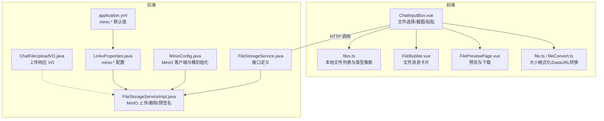
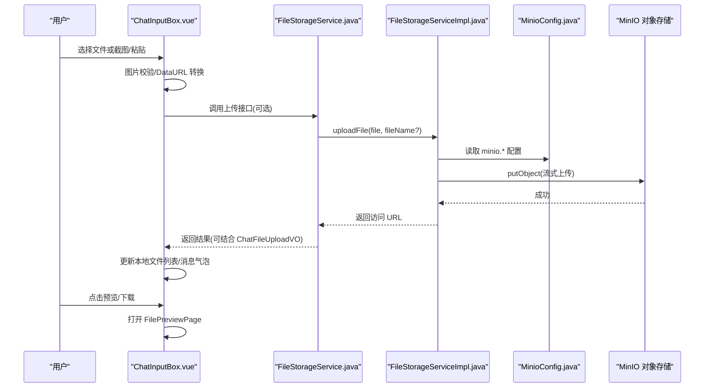
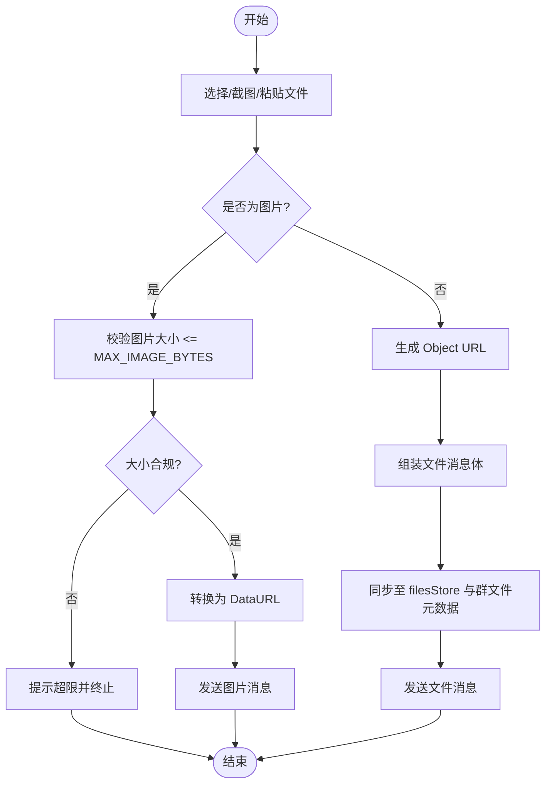
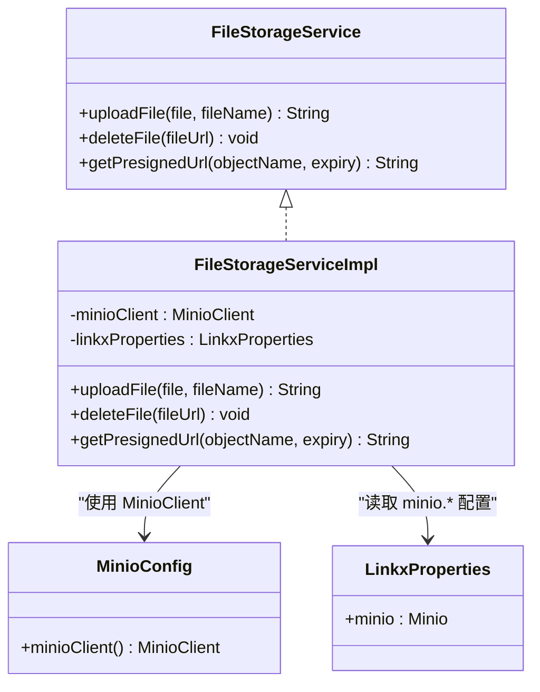
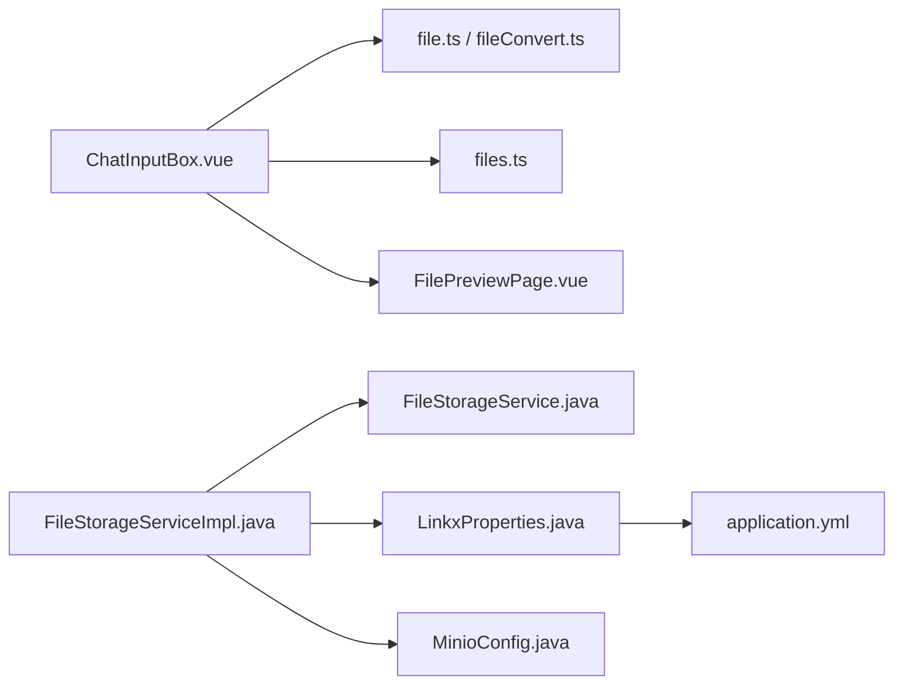

# 文件传输系统

<cite>
**本文引用的文件**   
- [ChatInputBox.vue](file://linkx-client/src/components/chat/ChatInputBox.vue)
- [FileBubble.vue](file://linkx-client/src/components/chat/bubbles/FileBubble.vue)
- [FilePreviewPage.vue](file://linkx-client/src/components/overlay/pages/FilePreviewPage.vue)
- [files.ts](file://linkx-client/src/stores/files.ts)
- [file.ts](file://linkx-client/src/utils/file.ts)
- [fileConvert.ts](file://linkx-client/src/utils/fileConvert.ts)
- [ChatFileUploadVO.java](file://linkx-server/src/main/java/com/linkx/server/controller/vo/ChatFileUploadVO.java)
- [FileStorageService.java](file://linkx-server/src/main/java/com/linkx/server/service/FileStorageService.java)
- [FileStorageServiceImpl.java](file://linkx-server/src/main/java/com/linkx/server/service/impl/FileStorageServiceImpl.java)
- [MinioConfig.java](file://linkx-server/src/main/java/com/linkx/server/config/MinioConfig.java)
- [LinkxProperties.java](file://linkx-server/src/main/java/com/linkx/server/config/LinkxProperties.java)
- [application.yml](file://linkx-server/src/main/resources/application.yml)
</cite>

## 目录
1. [简介](#简介)
2. [项目结构](#项目结构)
3. [核心组件](#核心组件)
4. [架构总览](#架构总览)
5. [详细组件分析](#详细组件分析)
6. [依赖关系分析](#依赖关系分析)
7. [性能与扩展性](#性能与扩展性)
8. [故障排查指南](#故障排查指南)
9. [结论](#结论)
10. [附录](#附录)

## 简介
本文件为 LinkX 文件传输系统的实现文档，聚焦于前后端协作的文件上传、下载、预览与存储能力。当前实现覆盖：
- 前端：文件选择与处理、图片本地预览、截图发送、粘贴文件自动发送、文件列表管理与类型推断、基础预览页。
- 后端：基于 MinIO 的对象存储集成、文件大小校验、按日期组织对象路径、删除与预签名 URL（简化版公开访问）。
- 安全与权限：通过配置项控制跨域与安全策略；当前未实现分片上传与断点续传，但提供了可扩展的接口设计。

## 项目结构
围绕“文件传输”的关键代码分布如下：
- 前端
  - 聊天输入与发送入口：ChatInputBox.vue
  - 文件消息气泡展示：FileBubble.vue
  - 全屏覆盖层中的文件预览：FilePreviewPage.vue
  - 本地文件列表 Store：files.ts
  - 工具函数：file.ts、fileConvert.ts
- 后端
  - 文件服务接口与实现：FileStorageService.java、FileStorageServiceImpl.java
  - MinIO 客户端配置与桶初始化：MinioConfig.java
  - 配置属性与默认值：LinkxProperties.java、application.yml
  - 聊天文件上传 VO：ChatFileUploadVO.java

图表来源
- [ChatInputBox.vue:1-749](file://linkx-client/src/components/chat/ChatInputBox.vue#L1-L749)
- [files.ts:1-79](file://linkx-client/src/stores/files.ts#L1-L79)
- [FileBubble.vue:1-32](file://linkx-client/src/components/chat/bubbles/FileBubble.vue#L1-L32)
- [FilePreviewPage.vue:1-44](file://linkx-client/src/components/overlay/pages/FilePreviewPage.vue#L1-L44)
- [file.ts:1-30](file://linkx-client/src/utils/file.ts#L1-L30)
- [fileConvert.ts:1-12](file://linkx-client/src/utils/fileConvert.ts#L1-L12)
- [FileStorageService.java:1-45](file://linkx-server/src/main/java/com/linkx/server/service/FileStorageService.java#L1-L45)
- [FileStorageServiceImpl.java:1-116](file://linkx-server/src/main/java/com/linkx/server/service/impl/FileStorageServiceImpl.java#L1-L116)
- [MinioConfig.java:1-49](file://linkx-server/src/main/java/com/linkx/server/config/MinioConfig.java#L1-L49)
- [LinkxProperties.java:1-65](file://linkx-server/src/main/java/com/linkx/server/config/LinkxProperties.java#L1-L65)
- [application.yml:1-54](file://linkx-server/src/main/resources/application.yml#L1-L54)
- [ChatFileUploadVO.java:1-15](file://linkx-server/src/main/java/com/linkx/server/controller/vo/ChatFileUploadVO.java#L1-L15)

章节来源
- [ChatInputBox.vue:1-749](file://linkx-client/src/components/chat/ChatInputBox.vue#L1-L749)
- [files.ts:1-79](file://linkx-client/src/stores/files.ts#L1-L79)
- [FileBubble.vue:1-32](file://linkx-client/src/components/chat/bubbles/FileBubble.vue#L1-L32)
- [FilePreviewPage.vue:1-44](file://linkx-client/src/components/overlay/pages/FilePreviewPage.vue#L1-L44)
- [file.ts:1-30](file://linkx-client/src/utils/file.ts#L1-L30)
- [fileConvert.ts:1-12](file://linkx-client/src/utils/fileConvert.ts#L1-L12)
- [FileStorageService.java:1-45](file://linkx-server/src/main/java/com/linkx/server/service/FileStorageService.java#L1-L45)
- [FileStorageServiceImpl.java:1-116](file://linkx-server/src/main/java/com/linkx/server/service/impl/FileStorageServiceImpl.java#L1-L116)
- [MinioConfig.java:1-49](file://linkx-server/src/main/java/com/linkx/server/config/MinioConfig.java#L1-L49)
- [LinkxProperties.java:1-65](file://linkx-server/src/main/java/com/linkx/server/config/LinkxProperties.java#L1-L65)
- [application.yml:1-54](file://linkx-server/src/main/resources/application.yml#L1-L54)
- [ChatFileUploadVO.java:1-15](file://linkx-server/src/main/java/com/linkx/server/controller/vo/ChatFileUploadVO.java#L1-L15)

## 核心组件
- 前端文件选择与发送
  - 支持从隐藏 input 选择图片或任意文件，统一进入 handleFileSend 流程。
  - 图片走 DataURL 本地预览与发送；非图片使用 Object URL 并写入 filesStore 与群文件元数据。
  - 支持屏幕截图（getDisplayMedia）与剪贴板粘贴（image/file）自动发送。
- 文件消息展示
  - FileBubble 渲染文件名、大小与状态条，区分自己/对方样式。
- 文件预览
  - FilePreviewPage 根据 isImage 判断是否直接显示图片，并提供下载/打开链接。
- 本地文件列表
  - files.ts 维护本地文件记录，按扩展名推断类型（image/media/document/other），提供添加与删除动作，并持久化到本地存储。
- 工具函数
  - file.ts：文件大小格式化、DataURL 读取、图片大小上限常量。
  - fileConvert.ts：DataURL 转 File，便于截图/粘贴后作为标准 File 上传。
- 后端文件存储
  - FileStorageService 定义上传、删除、获取预签名 URL 的接口。
  - FileStorageServiceImpl 实现 MinIO 上传（含大小限制、按日期前缀）、删除（从 URL 解析对象名）、预签名 URL（当前返回公开地址）。
  - MinioConfig 启动时检查并创建 bucket。
  - LinkxProperties 与 application.yml 提供 minio.* 配置项（endpoint、accessKey、secretKey、bucketName、maxFileSize）。
  - ChatFileUploadVO 用于封装上传结果（url、fileName、fileSize、contentType）。

章节来源
- [ChatInputBox.vue:1-749](file://linkx-client/src/components/chat/ChatInputBox.vue#L1-L749)
- [FileBubble.vue:1-32](file://linkx-client/src/components/chat/bubbles/FileBubble.vue#L1-L32)
- [FilePreviewPage.vue:1-44](file://linkx-client/src/components/overlay/pages/FilePreviewPage.vue#L1-L44)
- [files.ts:1-79](file://linkx-client/src/stores/files.ts#L1-L79)
- [file.ts:1-30](file://linkx-client/src/utils/file.ts#L1-L30)
- [fileConvert.ts:1-12](file://linkx-client/src/utils/fileConvert.ts#L1-L12)
- [FileStorageService.java:1-45](file://linkx-server/src/main/java/com/linkx/server/service/FileStorageService.java#L1-L45)
- [FileStorageServiceImpl.java:1-116](file://linkx-server/src/main/java/com/linkx/server/service/impl/FileStorageServiceImpl.java#L1-L116)
- [MinioConfig.java:1-49](file://linkx-server/src/main/java/com/linkx/server/config/MinioConfig.java#L1-L49)
- [LinkxProperties.java:1-65](file://linkx-server/src/main/java/com/linkx/server/config/LinkxProperties.java#L1-L65)
- [application.yml:1-54](file://linkx-server/src/main/resources/application.yml#L1-L54)
- [ChatFileUploadVO.java:1-15](file://linkx-server/src/main/java/com/linkx/server/controller/vo/ChatFileUploadVO.java#L1-L15)

## 架构总览
整体采用“前端轻量处理 + 后端对象存储”的架构：前端负责用户交互、本地预览与简单转换；后端通过 MinIO 进行大文件存储与访问控制。

图表来源
- [ChatInputBox.vue:1-749](file://linkx-client/src/components/chat/ChatInputBox.vue#L1-L749)
- [FileStorageService.java:1-45](file://linkx-server/src/main/java/com/linkx/server/service/FileStorageService.java#L1-L45)
- [FileStorageServiceImpl.java:1-116](file://linkx-server/src/main/java/com/linkx/server/service/impl/FileStorageServiceImpl.java#L1-L116)
- [MinioConfig.java:1-49](file://linkx-server/src/main/java/com/linkx/server/config/MinioConfig.java#L1-L49)

## 详细组件分析

### 前端：文件选择与发送（ChatInputBox.vue）
- 功能要点
  - 隐藏 input[type=file] 触发选择，onImagePicked/onFilePicked 统一进入 handleFileSend。
  - 图片分支：校验大小（MAX_IMAGE_BYTES），转为 DataURL 发送；截图使用 getDisplayMedia 捕获视频帧绘制到 canvas，再转 DataURL。
  - 非图片分支：生成 Object URL，构造消息体并调用 sendMessage，同时写入 filesStore 与群文件元数据。
  - 粘贴事件 onPaste：识别 image/* 或 file 类型，自动发送。
- 关键流程（流程图）

图表来源
- [ChatInputBox.vue:1-749](file://linkx-client/src/components/chat/ChatInputBox.vue#L1-L749)
- [file.ts:1-30](file://linkx-client/src/utils/file.ts#L1-L30)

章节来源
- [ChatInputBox.vue:1-749](file://linkx-client/src/components/chat/ChatInputBox.vue#L1-L749)
- [file.ts:1-30](file://linkx-client/src/utils/file.ts#L1-L30)

### 前端：文件消息气泡（FileBubble.vue）
- 展示文件名、大小与状态条，区分自己/对方样式，配合消息列表渲染。
- 与 ChatInputBox 的发送流程联动，形成“发送—展示”闭环。

章节来源
- [FileBubble.vue:1-32](file://linkx-client/src/components/chat/bubbles/FileBubble.vue#L1-L32)

### 前端：文件预览（FilePreviewPage.vue）
- 根据 isImage 决定是否直接渲染图片；否则显示占位图标。
- 提供下载/打开按钮，直接以 a 标签 href 指向文件 URL。

章节来源
- [FilePreviewPage.vue:1-44](file://linkx-client/src/components/overlay/pages/FilePreviewPage.vue#L1-L44)

### 前端：本地文件列表（files.ts）
- 数据结构 LocalFileItem：id、title、size、time、type、sender、fileUrl。
- addFromChat：按扩展名推断类型（image/media/document/other），插入头部并标记时间。
- remove：按 id 删除。
- 持久化：使用 Pinia persist 插件将 items 持久化到本地存储。

章节来源
- [files.ts:1-79](file://linkx-client/src/stores/files.ts#L1-L79)

### 前端：工具函数（file.ts、fileConvert.ts）
- file.ts
  - formatFileSize：将字节数格式化为 B/KB/MB。
  - readFileAsDataUrl：使用 FileReader 读取为 Data URL。
  - MAX_IMAGE_BYTES：本地图片大小上限（2MB）。
- fileConvert.ts
  - dataUrlToFile：将 DataURL 转为 File，便于后续上传。

章节来源
- [file.ts:1-30](file://linkx-client/src/utils/file.ts#L1-L30)
- [fileConvert.ts:1-12](file://linkx-client/src/utils/fileConvert.ts#L1-L12)

### 后端：文件存储服务（FileStorageService.java、FileStorageServiceImpl.java）
- 接口定义
  - uploadFile(MultipartFile, String?): 上传并返回访问 URL。
  - deleteFile(String): 删除指定 URL 对应的对象。
  - getPresignedUrl(String, int): 获取临时访问 URL（当前简化为公开地址）。
- 实现要点
  - 空文件与大小校验：读取 linkx.minio.maxFileSize 进行限制。
  - 对象命名：若传入自定义 fileName 则使用，否则 UUID+扩展名。
  - 路径组织：按日期 yyyy/MM/dd 前缀存放。
  - 上传：使用 PutObjectArgs 流式上传，设置 contentType。
  - 删除：从 URL 中解析 endpoint/bucket/objectName，调用 removeObject。
  - 预签名：当前返回 endpoint/bucket/objectName 的公开地址，可按需扩展为真实预签名。

图表来源
- [FileStorageService.java:1-45](file://linkx-server/src/main/java/com/linkx/server/service/FileStorageService.java#L1-L45)
- [FileStorageServiceImpl.java:1-116](file://linkx-server/src/main/java/com/linkx/server/service/impl/FileStorageServiceImpl.java#L1-L116)
- [MinioConfig.java:1-49](file://linkx-server/src/main/java/com/linkx/server/config/MinioConfig.java#L1-L49)
- [LinkxProperties.java:1-65](file://linkx-server/src/main/java/com/linkx/server/config/LinkxProperties.java#L1-L65)

章节来源
- [FileStorageService.java:1-45](file://linkx-server/src/main/java/com/linkx/server/service/FileStorageService.java#L1-L45)
- [FileStorageServiceImpl.java:1-116](file://linkx-server/src/main/java/com/linkx/server/service/impl/FileStorageServiceImpl.java#L1-L116)
- [MinioConfig.java:1-49](file://linkx-server/src/main/java/com/linkx/server/config/MinioConfig.java#L1-L49)
- [LinkxProperties.java:1-65](file://linkx-server/src/main/java/com/linkx/server/config/LinkxProperties.java#L1-L65)

### 后端：配置与默认值（LinkxProperties.java、application.yml）
- LinkxProperties.Minio
  - endpoint、accessKey、secretKey、bucketName、maxFileSize。
- application.yml
  - linkx.minio.* 默认值与环境变量注入。
  - server.servlet.context-path=/api，所有 API 请求带 /api 前缀。

章节来源
- [LinkxProperties.java:1-65](file://linkx-server/src/main/java/com/linkx/server/config/LinkxProperties.java#L1-L65)
- [application.yml:1-54](file://linkx-server/src/main/resources/application.yml#L1-L54)

### 后端：上传响应 VO（ChatFileUploadVO.java）
- 字段：url、fileName、fileSize、contentType，用于封装上传结果。

章节来源
- [ChatFileUploadVO.java:1-15](file://linkx-server/src/main/java/com/linkx/server/controller/vo/ChatFileUploadVO.java#L1-L15)

## 依赖关系分析
- 前端依赖
  - ChatInputBox.vue 依赖 file.ts（大小格式化与上限）、files.ts（本地列表）、FilePreviewPage.vue（预览）。
- 后端依赖
  - FileStorageServiceImpl 依赖 MinioConfig（MinioClient）与 LinkxProperties（minio.* 配置）。
  - MinioConfig 在应用启动时检查并创建 bucket。
  - application.yml 提供运行时配置。

图表来源
- [ChatInputBox.vue:1-749](file://linkx-client/src/components/chat/ChatInputBox.vue#L1-L749)
- [file.ts:1-30](file://linkx-client/src/utils/file.ts#L1-L30)
- [fileConvert.ts:1-12](file://linkx-client/src/utils/fileConvert.ts#L1-L12)
- [files.ts:1-79](file://linkx-client/src/stores/files.ts#L1-L79)
- [FilePreviewPage.vue:1-44](file://linkx-client/src/components/overlay/pages/FilePreviewPage.vue#L1-L44)
- [FileStorageService.java:1-45](file://linkx-server/src/main/java/com/linkx/server/service/FileStorageService.java#L1-L45)
- [FileStorageServiceImpl.java:1-116](file://linkx-server/src/main/java/com/linkx/server/service/impl/FileStorageServiceImpl.java#L1-L116)
- [MinioConfig.java:1-49](file://linkx-server/src/main/java/com/linkx/server/config/MinioConfig.java#L1-L49)
- [LinkxProperties.java:1-65](file://linkx-server/src/main/java/com/linkx/server/config/LinkxProperties.java#L1-L65)
- [application.yml:1-54](file://linkx-server/src/main/resources/application.yml#L1-L54)

## 性能与扩展性
- 当前特性
  - 小文件直传：适用于图片与小体积文件，前端本地预览体验良好。
  - 流式上传：后端使用流式 putObject，避免内存峰值过高。
- 建议扩展
  - 分片上传与断点续传：在前端将大文件切分为固定大小分片，逐片上传并记录进度；后端合并分片并校验完整性。
  - 并发与限速：对上传接口增加限流与并发控制，防止资源耗尽。
  - 压缩与转码：针对图片/视频在服务端进行压缩或转码，降低带宽与存储成本。
  - 预签名直传：由后端下发预签名 URL，前端直传 MinIO，减轻服务端压力。
  - 内容安全：引入病毒扫描、敏感词检测与水印能力。

[本节为通用指导，不直接分析具体文件]

## 故障排查指南
- 上传失败
  - 检查 linkx.minio.maxFileSize 配置与实际文件大小是否匹配。
  - 确认 MinIO endpoint、accessKey、secretKey、bucketName 配置正确且网络可达。
  - 查看后端日志中“文件上传失败”的错误信息。
- 删除失败
  - 确认传入的 fileUrl 包含正确的 endpoint 与 bucket 前缀，否则会被拒绝。
  - 检查 MinIO 权限与 bucket 是否存在。
- 预览异常
  - 确认 isImage 标志与文件类型一致；非图片应提供下载链接而非直接渲染。
- 跨域问题
  - 检查 application.yml 中 linkx.cors.allowed-origins 是否包含前端地址。

章节来源
- [FileStorageServiceImpl.java:1-116](file://linkx-server/src/main/java/com/linkx/server/service/impl/FileStorageServiceImpl.java#L1-L116)
- [application.yml:1-54](file://linkx-server/src/main/resources/application.yml#L1-L54)

## 结论
当前 LinkX 文件传输系统已具备完整的前端选择/预览/展示与后端 MinIO 存储能力，满足日常聊天场景中小文件的快速收发需求。面向大文件与高可靠性的生产环境，建议逐步引入分片上传、断点续传、预签名直传、压缩转码与更完善的安全策略。

[本节为总结，不直接分析具体文件]

## 附录
- 关键配置项说明（linkx.minio.*）
  - endpoint：MinIO 服务地址
  - accessKey：访问密钥
  - secretKey：私有密钥
  - bucketName：存储桶名称
  - maxFileSize：单文件最大大小（字节）

章节来源
- [LinkxProperties.java:1-65](file://linkx-server/src/main/java/com/linkx/server/config/LinkxProperties.java#L1-L65)
- [application.yml:1-54](file://linkx-server/src/main/resources/application.yml#L1-L54)