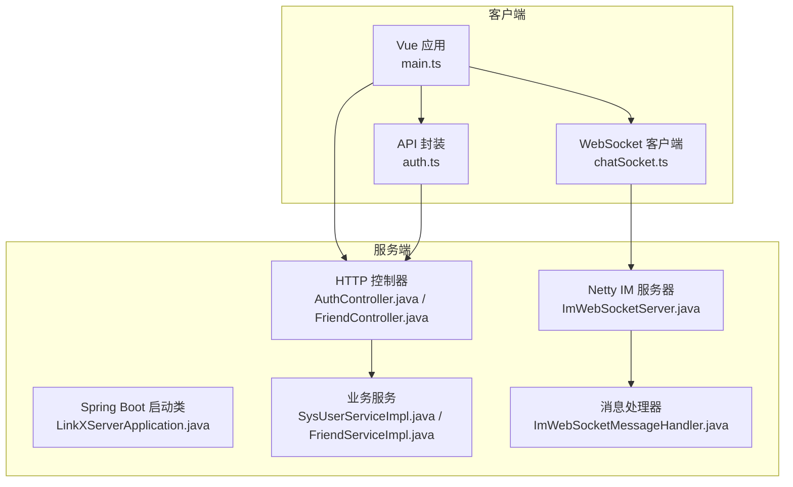
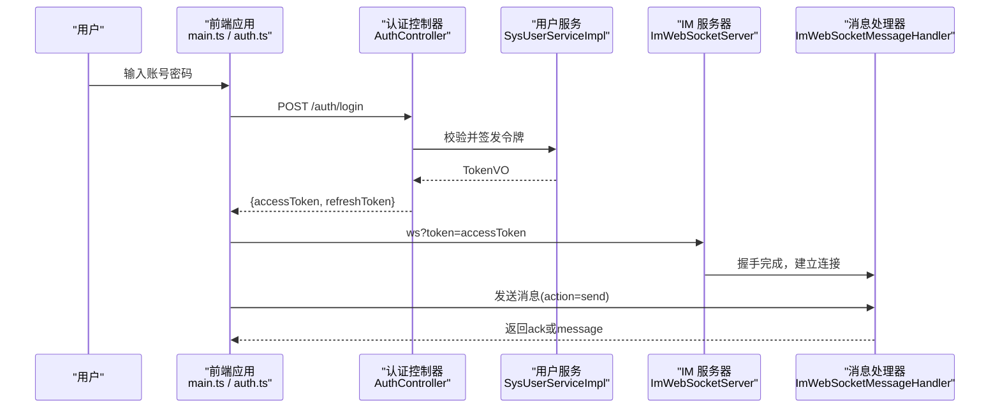
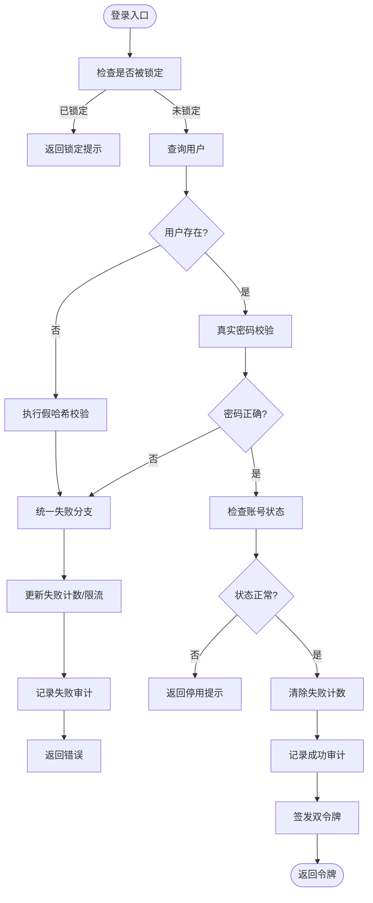
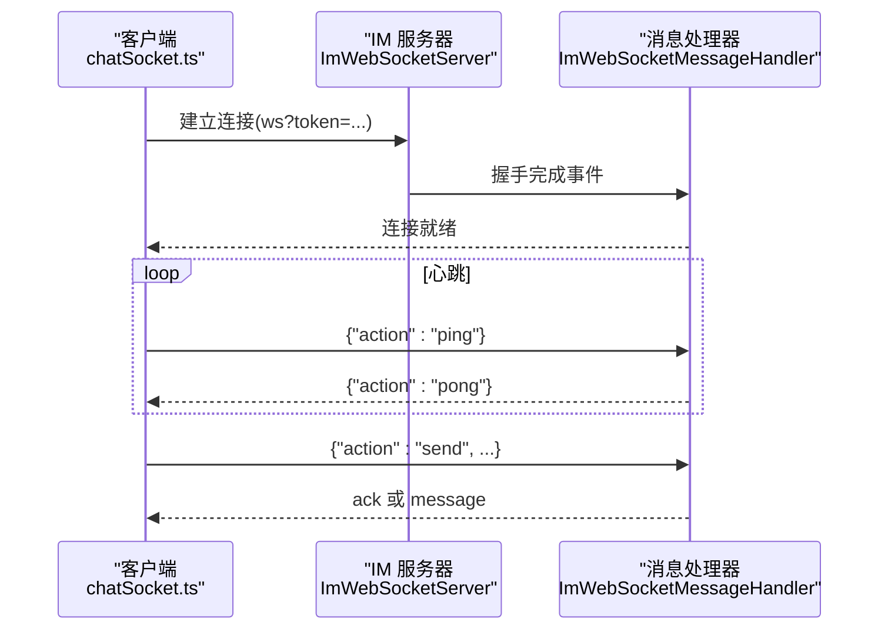
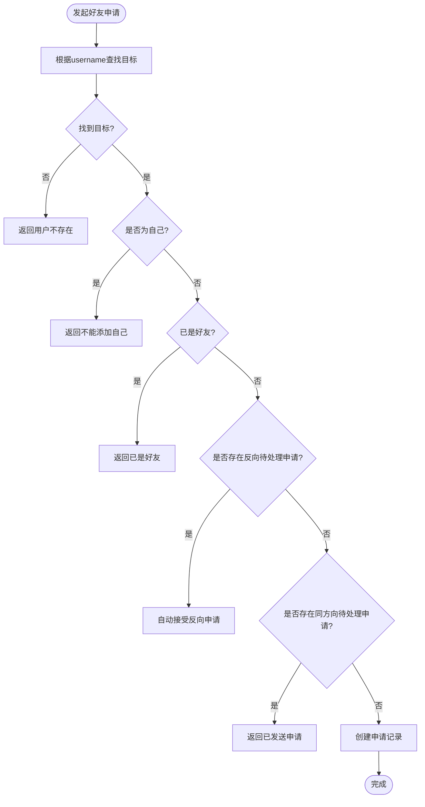
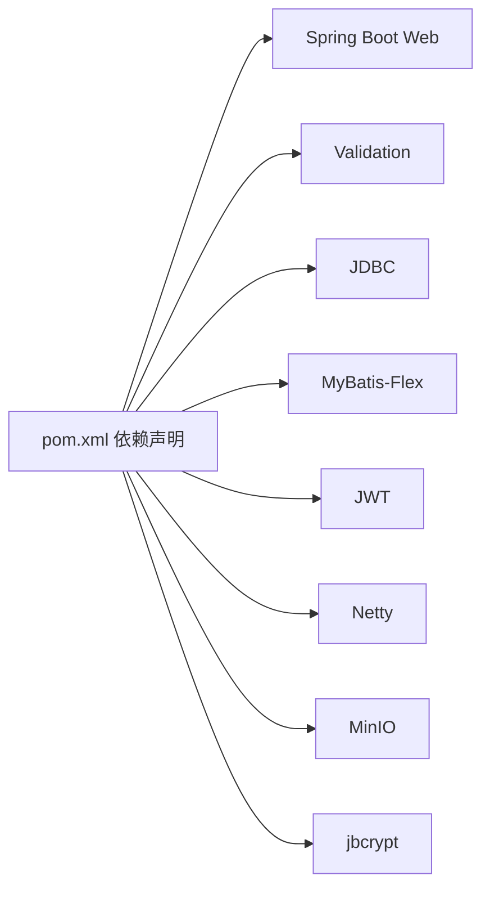

# 核心功能实现

<cite>
**本文引用的文件**
- [LinkXServerApplication.java](file://linkx-server/src/main/java/com/linkx/server/LinkXServerApplication.java)
- [pom.xml](file://linkx-server/pom.xml)
- [AuthController.java](file://linkx-server/src/main/java/com/linkx/server/controller/AuthController.java)
- [SysUserServiceImpl.java](file://linkx-server/src/main/java/com/linkx/server/service/impl/SysUserServiceImpl.java)
- [ImWebSocketServer.java](file://linkx-server/src/main/java/com/linkx/server/im/ImWebSocketServer.java)
- [ImWebSocketMessageHandler.java](file://linkx-server/src/main/java/com/linkx/server/im/ImWebSocketMessageHandler.java)
- [chatSocket.ts](file://linkx-client/src/utils/chatSocket.ts)
- [auth.ts](file://linkx-client/src/api/auth.ts)
- [main.ts](file://linkx-client/src/main.ts)
- [FriendController.java](file://linkx-server/src/main/java/com/linkx/server/controller/FriendController.java)
- [FriendServiceImpl.java](file://linkx-server/src/main/java/com/linkx/server/service/impl/FriendServiceImpl.java)
</cite>

## 目录
1. [简介](#简介)
2. [项目结构](#项目结构)
3. [核心组件](#核心组件)
4. [架构总览](#架构总览)
5. [详细组件分析](#详细组件分析)
6. [依赖关系分析](#依赖关系分析)
7. [性能考虑](#性能考虑)
8. [故障排查指南](#故障排查指南)
9. [结论](#结论)
10. [附录](#附录)

## 简介
本文件面向 LinkX 核心功能的开发者与维护者，系统化阐述用户认证、即时通讯（IM）、联系人管理、文件传输与群组管理等关键能力的实现方案。文档覆盖：
- 消息处理流程与会话管理机制
- 实时通信协议（WebSocket）与数据同步策略
- 错误处理方案与性能优化技巧
- 可扩展点与二次开发建议

为保证可读性，文档采用“由浅入深”的层次化组织，并辅以架构图、时序图与流程图帮助理解。

## 项目结构
后端采用 Spring Boot 单体架构，集成 Netty 提供独立 WebSocket IM 服务；前端基于 Vue 3 + Electron，通过 REST API 与 WebSocket 与后端交互。

图表来源
- [LinkXServerApplication.java:1-114](file://linkx-server/src/main/java/com/linkx/server/LinkXServerApplication.java#L1-L114)
- [AuthController.java:1-84](file://linkx-server/src/main/java/com/linkx/server/controller/AuthController.java#L1-L84)
- [FriendController.java:1-96](file://linkx-server/src/main/java/com/linkx/server/controller/FriendController.java#L1-L96)
- [SysUserServiceImpl.java:1-175](file://linkx-server/src/main/java/com/linkx/server/service/impl/SysUserServiceImpl.java#L1-L175)
- [FriendServiceImpl.java:1-333](file://linkx-server/src/main/java/com/linkx/server/service/impl/FriendServiceImpl.java#L1-L333)
- [ImWebSocketServer.java:1-82](file://linkx-server/src/main/java/com/linkx/server/im/ImWebSocketServer.java#L1-L82)
- [ImWebSocketMessageHandler.java:1-62](file://linkx-server/src/main/java/com/linkx/server/im/ImWebSocketMessageHandler.java#L1-L62)
- [main.ts:1-64](file://linkx-client/src/main.ts#L1-L64)
- [auth.ts:1-25](file://linkx-client/src/api/auth.ts#L1-L25)
- [chatSocket.ts:1-144](file://linkx-client/src/utils/chatSocket.ts#L1-L144)

章节来源
- [LinkXServerApplication.java:1-114](file://linkx-server/src/main/java/com/linkx/server/LinkXServerApplication.java#L1-L114)
- [pom.xml:1-145](file://linkx-server/pom.xml#L1-L145)
- [main.ts:1-64](file://linkx-client/src/main.ts#L1-L64)
- [package.json:1-62](file://linkx-client/package.json#L1-L62)

## 核心组件
- 认证与授权
  - HTTP 接口：登录、注册、刷新令牌、登出、验证码获取
  - JWT 签发与校验、限流与审计、密码安全存储
- 即时通讯（IM）
  - 独立 Netty WebSocket 服务，支持心跳 ping/pong、消息发送与 ACK
  - 客户端自动重连、指数退避、心跳保活
- 联系人管理
  - 好友搜索、申请、接受/拒绝、好友列表、删除好友
  - 双向关系维护与幂等处理
- 文件传输
  - 对象存储（MinIO）集成，头像上传与旧文件清理
- 群组管理
  - 会话与成员模型（实体层），后续扩展可结合 IM 推送能力实现群聊

章节来源
- [AuthController.java:1-84](file://linkx-server/src/main/java/com/linkx/server/controller/AuthController.java#L1-L84)
- [SysUserServiceImpl.java:1-175](file://linkx-server/src/main/java/com/linkx/server/service/impl/SysUserServiceImpl.java#L1-L175)
- [ImWebSocketServer.java:1-82](file://linkx-server/src/main/java/com/linkx/server/im/ImWebSocketServer.java#L1-L82)
- [ImWebSocketMessageHandler.java:1-62](file://linkx-server/src/main/java/com/linkx/server/im/ImWebSocketMessageHandler.java#L1-L62)
- [FriendController.java:1-96](file://linkx-server/src/main/java/com/linkx/server/controller/FriendController.java#L1-L96)
- [FriendServiceImpl.java:1-333](file://linkx-server/src/main/java/com/linkx/server/service/impl/FriendServiceImpl.java#L1-L333)

## 架构总览
系统分为三层：
- 客户端层：Vue 单页应用 + Electron 宿主，负责 UI、状态管理与网络通信
- 服务端层：Spring Boot 提供 REST API，Netty 提供 WebSocket IM 通道
- 数据层：MySQL 持久化，Redis 用于限流与缓存（可选），MinIO 用于对象存储

图表来源
- [AuthController.java:1-84](file://linkx-server/src/main/java/com/linkx/server/controller/AuthController.java#L1-L84)
- [SysUserServiceImpl.java:1-175](file://linkx-server/src/main/java/com/linkx/server/service/impl/SysUserServiceImpl.java#L1-L175)
- [ImWebSocketServer.java:1-82](file://linkx-server/src/main/java/com/linkx/server/im/ImWebSocketServer.java#L1-L82)
- [ImWebSocketMessageHandler.java:1-62](file://linkx-server/src/main/java/com/linkx/server/im/ImWebSocketMessageHandler.java#L1-L62)
- [main.ts:1-64](file://linkx-client/src/main.ts#L1-L64)
- [auth.ts:1-25](file://linkx-client/src/api/auth.ts#L1-L25)

## 详细组件分析

### 用户认证系统
- 能力概览
  - 注册：用户名唯一性检查、BCrypt 加密存储、默认头像设置
  - 登录：防时间侧信道攻击、失败次数限制、登录审计记录、成功签发双令牌
  - 刷新令牌：IP 维度限流
  - 登出：支持主动注销 refresh token
  - 验证码：可按配置开关
- 关键流程
  - 登录时若用户不存在，仍执行一次 BCrypt 校验以消耗相同时间，避免侧信道泄露
  - 登录失败累计达到阈值后触发账户锁定，防止暴力破解
  - 成功后清除失败计数并记录审计日志

图表来源
- [SysUserServiceImpl.java:60-99](file://linkx-server/src/main/java/com/linkx/server/service/impl/SysUserServiceImpl.java#L60-L99)
- [AuthController.java:48-53](file://linkx-server/src/main/java/com/linkx/server/controller/AuthController.java#L48-L53)

章节来源
- [AuthController.java:1-84](file://linkx-server/src/main/java/com/linkx/server/controller/AuthController.java#L1-L84)
- [SysUserServiceImpl.java:1-175](file://linkx-server/src/main/java/com/linkx/server/service/impl/SysUserServiceImpl.java#L1-L175)

### 即时通讯功能（WebSocket）
- 能力概览
  - 独立端口与路径的 WebSocket 服务，按配置启用
  - 握手阶段携带 accessToken 进行鉴权
  - 支持 action=ping 心跳、action=send 消息发送
  - 客户端具备自动重连、指数退避与心跳保活
- 关键流程
  - 服务端在握手完成后将用户 ID 写入 Channel 属性
  - 消息处理前校验用户是否已认证，未认证直接关闭连接
  - 客户端每 25s 发送 ping，收到 pong 保持活跃；断线后指数退避重连

图表来源
- [ImWebSocketServer.java:1-82](file://linkx-server/src/main/java/com/linkx/server/im/ImWebSocketServer.java#L1-L82)
- [ImWebSocketMessageHandler.java:1-62](file://linkx-server/src/main/java/com/linkx/server/im/ImWebSocketMessageHandler.java#L1-L62)
- [chatSocket.ts:1-144](file://linkx-client/src/utils/chatSocket.ts#L1-L144)

章节来源
- [ImWebSocketServer.java:1-82](file://linkx-server/src/main/java/com/linkx/server/im/ImWebSocketServer.java#L1-L82)
- [ImWebSocketMessageHandler.java:1-62](file://linkx-server/src/main/java/com/linkx/server/im/ImWebSocketMessageHandler.java#L1-L62)
- [chatSocket.ts:1-144](file://linkx-client/src/utils/chatSocket.ts#L1-L144)

### 联系人管理
- 能力概览
  - 用户搜索：优先精确匹配 username，其次模糊匹配 username/nickname，限制返回数量
  - 好友申请：去重、反向申请自动合并为接受、重复申请保护
  - 接受/拒绝：权限校验、状态机流转
  - 好友列表：按创建时间倒序，附带备注信息
  - 删除好友：双向关系移除
- 关键流程
  - 接受申请时创建双向关系，确保对称性
  - 删除好友时同时移除两条关系记录

图表来源
- [FriendServiceImpl.java:93-138](file://linkx-server/src/main/java/com/linkx/server/service/impl/FriendServiceImpl.java#L93-L138)
- [FriendController.java:34-41](file://linkx-server/src/main/java/com/linkx/server/controller/FriendController.java#L34-L41)

章节来源
- [FriendController.java:1-96](file://linkx-server/src/main/java/com/linkx/server/controller/FriendController.java#L1-L96)
- [FriendServiceImpl.java:1-333](file://linkx-server/src/main/java/com/linkx/server/service/impl/FriendServiceImpl.java#L1-L333)

### 文件传输（对象存储）
- 能力概览
  - 使用 MinIO 作为对象存储，提供上传、删除能力
  - 头像更新时自动清理旧文件（非默认头像）
- 关键点
  - 删除失败不影响新头像写入，保证用户体验
  - 上传路径与访问 URL 由存储服务统一管理

章节来源
- [SysUserServiceImpl.java:154-173](file://linkx-server/src/main/java/com/linkx/server/service/impl/SysUserServiceImpl.java#L154-L173)
- [pom.xml:105-110](file://linkx-server/pom.xml#L105-L110)

### 群组管理（概念与扩展）
- 当前已定义会话与成员实体，可作为群聊的基础数据模型
- 扩展建议
  - 在 IM 层增加群会话路由与广播逻辑
  - 结合聊天历史与文件共享模块，完善群相册、群文件等功能
  - 引入群公告、精华消息、群成员权限控制等特性

[本节为概念性说明，不直接分析具体代码文件]

## 依赖关系分析
- 后端技术栈
  - Spring Boot Web、Validation、JDBC、MyBatis-Flex、JWT、Netty、MinIO、jbcrypt
- 前端技术栈
  - Vue 3、Pinia、Naive UI、Axios、Electron、UnoCSS

图表来源
- [pom.xml:1-145](file://linkx-server/pom.xml#L1-L145)

章节来源
- [pom.xml:1-145](file://linkx-server/pom.xml#L1-L145)

## 性能考虑
- 认证与限流
  - 登录失败次数限制与账户锁定，降低暴力破解风险
  - 刷新令牌接口按 IP 限流，避免滥用
- 数据库查询
  - 好友列表采用批量 IN 查询减少往返
  - 搜索结果去重与限制条数，避免大结果集
- 实时通信
  - 心跳间隔 25s，兼顾存活检测与资源占用
  - 指数退避重连，最大延迟 30s，避免雪崩
- 对象存储
  - 头像更新异步清理旧文件，失败不阻塞主流程

[本节提供通用指导，不直接分析具体代码文件]

## 故障排查指南
- 认证相关
  - 登录失败过多：检查登录审计与限流配置，确认是否触发账户锁定
  - 令牌刷新失败：检查 IP 限流与 refresh token 有效性
- IM 相关
  - 连接频繁断开：检查心跳是否正常、网络稳定性与服务端端口配置
  - 消息未达：确认客户端是否收到 ack，服务端是否抛出异常
- 联系人相关
  - 申请重复：检查是否已存在同方向待处理申请
  - 无法删除好友：确认双方关系是否存在
- 文件相关
  - 头像不更新：检查旧文件删除是否抛错但不影响写入

章节来源
- [SysUserServiceImpl.java:60-99](file://linkx-server/src/main/java/com/linkx/server/service/impl/SysUserServiceImpl.java#L60-L99)
- [ImWebSocketMessageHandler.java:28-54](file://linkx-server/src/main/java/com/linkx/server/im/ImWebSocketMessageHandler.java#L28-L54)
- [FriendServiceImpl.java:161-192](file://linkx-server/src/main/java/com/linkx/server/service/impl/FriendServiceImpl.java#L161-L192)

## 结论
LinkX 的核心功能围绕“认证+IM+联系人+文件”构建，采用前后端分离与独立 IM 服务的架构，具备良好的扩展性与可维护性。建议在后续迭代中：
- 完善群组管理能力，补齐群会话、群文件与群相册
- 增强消息可靠性（如离线消息、消息去重、ACK 重试）
- 引入更细粒度的权限与审计机制
- 对热点接口与查询进行缓存与索引优化

[本节为总结性内容，不直接分析具体代码文件]

## 附录
- 客户端初始化与自动登录
  - 应用启动时读取主题并监听跨窗口主题同步
  - 若开启自动登录且本地保存了用户名与记住我标记，则尝试自动登录
- 前端 API 封装
  - 统一的认证接口封装，便于调用登录、注册、刷新与登出

章节来源
- [main.ts:33-64](file://linkx-client/src/main.ts#L33-L64)
- [auth.ts:1-25](file://linkx-client/src/api/auth.ts#L1-L25)