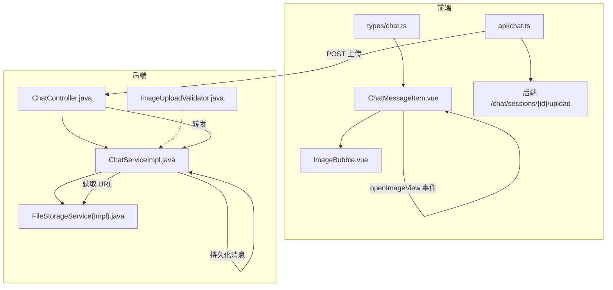
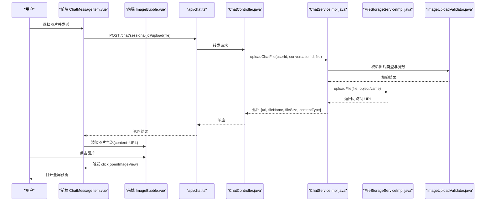
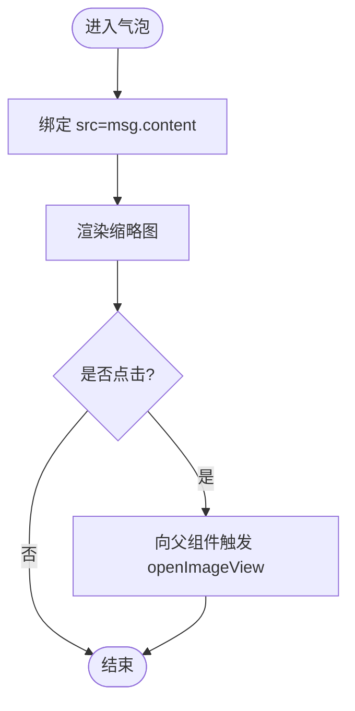
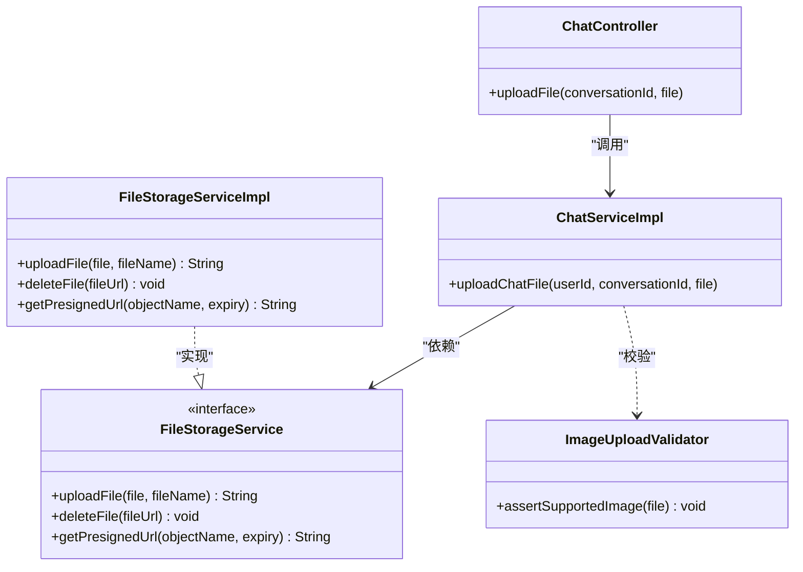
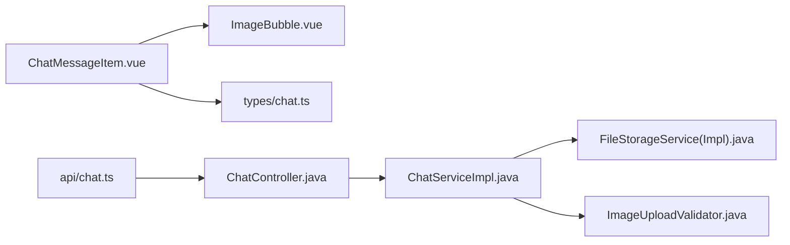

# 图片消息气泡

<cite>
**本文引用的文件**   
- [ImageBubble.vue](file://linkx-client/src/components/chat/bubbles/ImageBubble.vue)
- [ChatMessageItem.vue](file://linkx-client/src/components/chat/ChatMessageItem.vue)
- [chat.ts（类型定义）](file://linkx-client/src/types/chat.ts)
- [chat.ts（API 客户端）](file://linkx-client/src/api/chat.ts)
- [ChatController.java](file://linkx-server/src/main/java/com/linkx/server/controller/ChatController.java)
- [ChatServiceImpl.java](file://linkx-server/src/main/java/com/linkx/server/service/impl/ChatServiceImpl.java)
- [FileStorageService.java](file://linkx-server/src/main/java/com/linkx/server/service/FileStorageService.java)
- [FileStorageServiceImpl.java](file://linkx-server/src/main/java/com/linkx/server/service/impl/FileStorageServiceImpl.java)
- [ImageUploadValidator.java](file://linkx-server/src/main/java/com/linkx/server/common/ImageUploadValidator.java)
</cite>

## 目录
1. [简介](#简介)
2. [项目结构](#项目结构)
3. [核心组件](#核心组件)
4. [架构总览](#架构总览)
5. [详细组件分析](#详细组件分析)
6. [依赖关系分析](#依赖关系分析)
7. [性能与优化](#性能与优化)
8. [故障排查指南](#故障排查指南)
9. [结论](#结论)
10. [附录：配置与扩展](#附录：配置与扩展)

## 简介
本文件面向 LinkX 的图片消息气泡组件，围绕“加载、缓存、缩放、预览、上传下载、错误处理、样式与交互”等维度进行系统化说明。当前实现中，图片消息以 URL/DataURL 形式在消息体 content 字段中传递；前端通过 ImageBubble 渲染并在父级触发预览事件；服务端提供统一的聊天会话与文件上传接口，并基于对象存储返回可访问的 URL。

## 项目结构
与图片消息相关的前后端关键位置如下：
- 前端展示层
  - 图片气泡组件：负责渲染 img 标签并暴露点击事件给父组件
  - 消息行容器：根据消息类型分发到对应气泡，并向上抛出 openImageView 事件
  - 类型定义：包含 MessageItem 的 type/content/fileUrl 等字段
  - API 客户端：封装了会话列表、消息列表与文件上传接口
- 服务端
  - 控制器：提供会话、消息与文件上传接口
  - 服务实现：校验权限、落库消息、调用文件存储、构造预览文本
  - 文件存储：对接对象存储，返回公开访问 URL
  - 图片校验：对上传文件的 Content-Type 与魔数签名进行基础校验

图表来源
- [ChatMessageItem.vue:82-89](file://linkx-client/src/components/chat/ChatMessageItem.vue#L82-L89)
- [ImageBubble.vue:14-17](file://linkx-client/src/components/chat/bubbles/ImageBubble.vue#L14-L17)
- [chat.ts（类型定义）:15-28](file://linkx-client/src/types/chat.ts#L15-L28)
- [chat.ts（API 客户端）:19-27](file://linkx-client/src/api/chat.ts#L19-L27)
- [ChatController.java:55-62](file://linkx-server/src/main/java/com/linkx/server/controller/ChatController.java#L55-L62)
- [ChatServiceImpl.java:207-226](file://linkx-server/src/main/java/com/linkx/server/service/impl/ChatServiceImpl.java#L207-L226)
- [FileStorageServiceImpl.java:27-73](file://linkx-server/src/main/java/com/linkx/server/service/impl/FileStorageServiceImpl.java#L27-L73)
- [ImageUploadValidator.java:16-24](file://linkx-server/src/main/java/com/linkx/server/common/ImageUploadValidator.java#L16-L24)

章节来源
- [ChatMessageItem.vue:82-89](file://linkx-client/src/components/chat/ChatMessageItem.vue#L82-L89)
- [ImageBubble.vue:14-17](file://linkx-client/src/components/chat/bubbles/ImageBubble.vue#L14-L17)
- [chat.ts（类型定义）:15-28](file://linkx-client/src/types/chat.ts#L15-L28)
- [chat.ts（API 客户端）:19-27](file://linkx-client/src/api/chat.ts#L19-L27)
- [ChatController.java:55-62](file://linkx-server/src/main/java/com/linkx/server/controller/ChatController.java#L55-L62)
- [ChatServiceImpl.java:207-226](file://linkx-server/src/main/java/com/linkx/server/service/impl/ChatServiceImpl.java#L207-L226)
- [FileStorageServiceImpl.java:27-73](file://linkx-server/src/main/java/com/linkx/server/service/impl/FileStorageServiceImpl.java#L27-L73)
- [ImageUploadValidator.java:16-24](file://linkx-server/src/main/java/com/linkx/server/common/ImageUploadValidator.java#L16-L24)

## 核心组件
- 图片消息气泡（ImageBubble.vue）
  - 职责：接收 ChatMessage，将 msg.content 作为图片 src 渲染；对外暴露点击事件由父组件统一处理预览
  - 数据约定：content 字段为图片 URL 或 DataURL
- 消息行容器（ChatMessageItem.vue）
  - 职责：按消息类型路由到具体气泡；对 image 类型派发 openImageView 事件，供上层打开全屏预览
  - 样式：全局样式定义了 .qq-bubble-image 的最大宽高与圆角，确保气泡内缩略图尺寸可控
- 类型定义（types/chat.ts）
  - MessageItem.type 支持 'image'；content 用于承载图片地址；可选 fileUrl 用于文件类消息
- API 客户端（api/chat.ts）
  - uploadChatFile：以 multipart/form-data 上传文件，返回 { url, fileName, fileSize, contentType }

章节来源
- [ImageBubble.vue:1-19](file://linkx-client/src/components/chat/bubbles/ImageBubble.vue#L1-L19)
- [ChatMessageItem.vue:82-89](file://linkx-client/src/components/chat/ChatMessageItem.vue#L82-L89)
- [chat.ts（类型定义）:15-28](file://linkx-client/src/types/chat.ts#L15-L28)
- [chat.ts（API 客户端）:19-27](file://linkx-client/src/api/chat.ts#L19-L27)

## 架构总览
图片消息从上传到展示的端到端流程如下：

图表来源
- [chat.ts（API 客户端）:19-27](file://linkx-client/src/api/chat.ts#L19-L27)
- [ChatController.java:55-62](file://linkx-server/src/main/java/com/linkx/server/controller/ChatController.java#L55-L62)
- [ChatServiceImpl.java:207-226](file://linkx-server/src/main/java/com/linkx/server/service/impl/ChatServiceImpl.java#L207-L226)
- [FileStorageServiceImpl.java:27-73](file://linkx-server/src/main/java/com/linkx/server/service/impl/FileStorageServiceImpl.java#L27-L73)
- [ImageUploadValidator.java:16-24](file://linkx-server/src/main/java/com/linkx/server/common/ImageUploadValidator.java#L16-L24)
- [ChatMessageItem.vue:82-89](file://linkx-client/src/components/chat/ChatMessageItem.vue#L82-L89)
- [ImageBubble.vue:14-17](file://linkx-client/src/components/chat/bubbles/ImageBubble.vue#L14-L17)

## 详细组件分析

### 图片消息气泡（ImageBubble.vue）
- 渲染逻辑
  - 使用 img 标签直接绑定 msg.content 为 src
  - 外层包裹 div 并区分 isSelf 样式
- 交互行为
  - 点击事件由父组件监听并触发 openImageView，用于打开全屏预览
- 样式要点
  - 全局样式 .qq-bubble-image 限制最大宽高与圆角，保证气泡内缩略图显示一致

图表来源
- [ImageBubble.vue:14-17](file://linkx-client/src/components/chat/bubbles/ImageBubble.vue#L14-L17)
- [ChatMessageItem.vue:82-89](file://linkx-client/src/components/chat/ChatMessageItem.vue#L82-L89)

章节来源
- [ImageBubble.vue:1-19](file://linkx-client/src/components/chat/bubbles/ImageBubble.vue#L1-L19)
- [ChatMessageItem.vue:82-89](file://linkx-client/src/components/chat/ChatMessageItem.vue#L82-L89)

### 消息行容器（ChatMessageItem.vue）
- 类型分发
  - 当 msg.type === 'image' 或 msg.isImage 时，渲染 ImageBubble
- 事件透传
  - 对 ImageBubble 的 click 事件映射为 openImageView，供上层打开预览
- 样式
  - 全局样式控制图片气泡与缩略图的视觉表现

章节来源
- [ChatMessageItem.vue:82-89](file://linkx-client/src/components/chat/ChatMessageItem.vue#L82-L89)
- [ChatMessageItem.vue:160-161](file://linkx-client/src/components/chat/ChatMessageItem.vue#L160-L161)

### 类型与数据结构（types/chat.ts）
- MessageItem
  - type: 'text' | 'image' | 'file'
  - content: 文本内容或图片 URL/DataURL
  - fileUrl: 文件类消息的 URL（图片也可复用）
- WsIncomingFrame/WsSendPayload
  - 用于 WebSocket 收发消息时的载荷结构（含 msgType、fileUrl 等）

章节来源
- [chat.ts（类型定义）:15-46](file://linkx-client/src/types/chat.ts#L15-L46)

### 上传与发送流程（后端）
- 上传接口
  - ChatController.uploadFile 接收 multipart/form-data，交由 ChatService 处理
- 业务处理
  - ChatServiceImpl.uploadChatFile 生成对象名并调用 FileStorageService 上传
  - 返回包含 url、fileName、fileSize、contentType 的结果
- 文件存储
  - FileStorageServiceImpl.uploadFile 写入对象存储并拼接 endpoint/bucket/object 得到公开 URL
- 图片校验
  - ImageUploadValidator 校验 Content-Type 与常见图片魔数（JPEG/PNG/GIF/WebP）

图表来源
- [ChatController.java:55-62](file://linkx-server/src/main/java/com/linkx/server/controller/ChatController.java#L55-L62)
- [ChatServiceImpl.java:207-226](file://linkx-server/src/main/java/com/linkx/server/service/impl/ChatServiceImpl.java#L207-L226)
- [FileStorageService.java:8-44](file://linkx-server/src/main/java/com/linkx/server/service/FileStorageService.java#L8-L44)
- [FileStorageServiceImpl.java:27-73](file://linkx-server/src/main/java/com/linkx/server/service/impl/FileStorageServiceImpl.java#L27-L73)
- [ImageUploadValidator.java:16-24](file://linkx-server/src/main/java/com/linkx/server/common/ImageUploadValidator.java#L16-L24)

章节来源
- [ChatController.java:55-62](file://linkx-server/src/main/java/com/linkx/server/controller/ChatController.java#L55-L62)
- [ChatServiceImpl.java:207-226](file://linkx-server/src/main/java/com/linkx/server/service/impl/ChatServiceImpl.java#L207-L226)
- [FileStorageService.java:8-44](file://linkx-server/src/main/java/com/linkx/server/service/FileStorageService.java#L8-L44)
- [FileStorageServiceImpl.java:27-73](file://linkx-server/src/main/java/com/linkx/server/service/impl/FileStorageServiceImpl.java#L27-L73)
- [ImageUploadValidator.java:16-24](file://linkx-server/src/main/java/com/linkx/server/common/ImageUploadValidator.java#L16-L24)

## 依赖关系分析
- 前端
  - ChatMessageItem.vue 依赖 ImageBubble.vue 与 types/chat.ts
  - api/chat.ts 提供上传接口，被上层业务调用后更新消息状态
- 后端
  - ChatController 依赖 ChatService
  - ChatServiceImpl 依赖 FileStorageService 与数据库映射器
  - FileStorageServiceImpl 依赖 MinIO 客户端与配置
  - ImageUploadValidator 作为工具类被服务层调用

图表来源
- [ChatMessageItem.vue:82-89](file://linkx-client/src/components/chat/ChatMessageItem.vue#L82-L89)
- [ImageBubble.vue:14-17](file://linkx-client/src/components/chat/bubbles/ImageBubble.vue#L14-L17)
- [chat.ts（类型定义）:15-28](file://linkx-client/src/types/chat.ts#L15-L28)
- [chat.ts（API 客户端）:19-27](file://linkx-client/src/api/chat.ts#L19-L27)
- [ChatController.java:55-62](file://linkx-server/src/main/java/com/linkx/server/controller/ChatController.java#L55-L62)
- [ChatServiceImpl.java:207-226](file://linkx-server/src/main/java/com/linkx/server/service/impl/ChatServiceImpl.java#L207-L226)
- [FileStorageServiceImpl.java:27-73](file://linkx-server/src/main/java/com/linkx/server/service/impl/FileStorageServiceImpl.java#L27-L73)
- [ImageUploadValidator.java:16-24](file://linkx-server/src/main/java/com/linkx/server/common/ImageUploadValidator.java#L16-L24)

章节来源
- [ChatMessageItem.vue:82-89](file://linkx-client/src/components/chat/ChatMessageItem.vue#L82-L89)
- [ImageBubble.vue:14-17](file://linkx-client/src/components/chat/bubbles/ImageBubble.vue#L14-L17)
- [chat.ts（类型定义）:15-28](file://linkx-client/src/types/chat.ts#L15-L28)
- [chat.ts（API 客户端）:19-27](file://linkx-client/src/api/chat.ts#L19-L27)
- [ChatController.java:55-62](file://linkx-server/src/main/java/com/linkx/server/controller/ChatController.java#L55-L62)
- [ChatServiceImpl.java:207-226](file://linkx-server/src/main/java/com/linkx/server/service/impl/ChatServiceImpl.java#L207-L226)
- [FileStorageServiceImpl.java:27-73](file://linkx-server/src/main/java/com/linkx/server/service/impl/FileStorageServiceImpl.java#L27-L73)
- [ImageUploadValidator.java:16-24](file://linkx-server/src/main/java/com/linkx/server/common/ImageUploadValidator.java#L16-L24)

## 性能与优化
- 图片格式支持与压缩
  - 服务端已对 JPEG/PNG/GIF/WebP 进行魔数校验，建议前端在上传前进行压缩与转码（如 WebP），以降低带宽与存储成本
- 懒加载策略
  - 建议在滚动列表中为 img 添加 loading="lazy" 或使用 IntersectionObserver 按需加载，减少首屏压力
- 缩略图与大图分离
  - 上传成功后同时生成缩略图与原图 URL；气泡仅加载缩略图，全屏查看再加载原图
- 本地缓存
  - 利用浏览器 HTTP 缓存与 Service Worker 缓存静态资源；对重复 URL 避免重复请求
- 并发与重试
  - 上传失败时自动重试并退避；大文件分片上传与断点续传可显著提升体验
- 内存与渲染
  - 大图预览采用 Canvas 或轻量级 viewer 库，避免一次性解码超大图像导致卡顿

[本节为通用指导，不直接分析具体文件]

## 故障排查指南
- 上传失败
  - 检查文件大小是否超过服务端限制
  - 确认 Content-Type 与魔数校验是否通过
  - 查看对象存储连接与 bucket 配置是否正确
- 图片无法显示
  - 核对消息 content 是否为有效 URL/DataURL
  - 检查跨域与 CDN 访问策略
  - 确认浏览器缓存未损坏，必要时强制刷新
- 预览异常
  - 确认 openImageView 事件是否被正确捕获
  - 检查预览容器的 z-index 与遮罩层样式

章节来源
- [ChatServiceImpl.java:207-226](file://linkx-server/src/main/java/com/linkx/server/service/impl/ChatServiceImpl.java#L207-L226)
- [FileStorageServiceImpl.java:27-73](file://linkx-server/src/main/java/com/linkx/server/service/impl/FileStorageServiceImpl.java#L27-L73)
- [ImageUploadValidator.java:16-24](file://linkx-server/src/main/java/com/linkx/server/common/ImageUploadValidator.java#L16-L24)
- [ChatMessageItem.vue:82-89](file://linkx-client/src/components/chat/ChatMessageItem.vue#L82-L89)

## 结论
当前实现以“上传获得 URL -> 消息体携带 URL -> 气泡渲染缩略图 -> 点击打开预览”为主线，具备清晰的职责划分与可扩展性。后续可在前端增加懒加载与缩略图策略，在后端引入图片压缩与多分辨率输出，进一步提升性能与用户体验。

[本节为总结性内容，不直接分析具体文件]

## 附录：配置与扩展
- 自定义样式
  - 通过覆盖全局样式 .qq-bubble-image 与 .image-bubble 调整缩略图尺寸、圆角与背景
- 交互行为
  - 在 ChatMessageItem.vue 中监听 openImageView 事件，接入全屏预览弹窗或外部 Viewer
- 图片上传前处理
  - 在前端选择图片后进行压缩、裁剪与格式转换，再调用 uploadChatFile 接口
- 服务端扩展
  - 在 FileStorageServiceImpl 中集成预签名 URL 能力，支持私有桶安全访问
  - 在 ChatServiceImpl 中增加图片转码与缩略图生成流程

章节来源
- [ChatMessageItem.vue:82-89](file://linkx-client/src/components/chat/ChatMessageItem.vue#L82-L89)
- [chat.ts（API 客户端）:19-27](file://linkx-client/src/api/chat.ts#L19-L27)
- [FileStorageServiceImpl.java:108-114](file://linkx-server/src/main/java/com/linkx/server/service/impl/FileStorageServiceImpl.java#L108-L114)