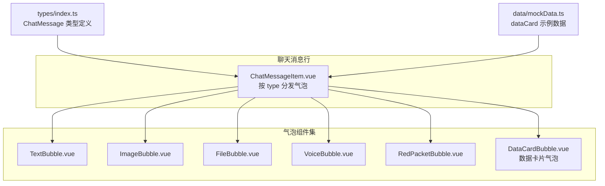
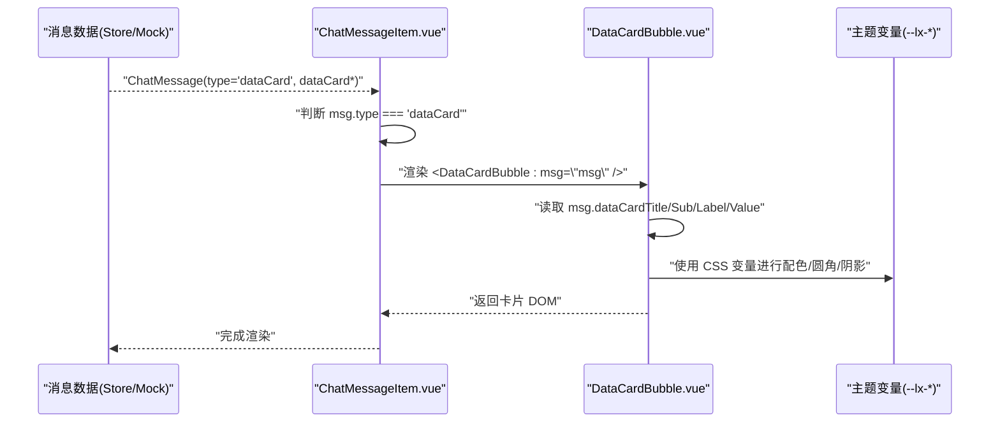
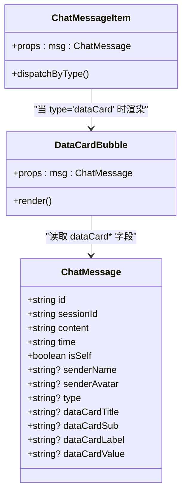
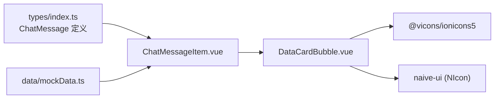

# 数据卡片消息气泡

<cite>
**本文引用的文件**   
- [DataCardBubble.vue](file://linkx-client/src/components/chat/bubbles/DataCardBubble.vue)
- [ChatMessageItem.vue](file://linkx-client/src/components/chat/ChatMessageItem.vue)
- [index.ts](file://linkx-client/src/types/index.ts)
- [mockData.ts](file://linkx-client/src/data/mockData.ts)
</cite>

## 目录
1. [简介](#简介)
2. [项目结构](#项目结构)
3. [核心组件](#核心组件)
4. [架构总览](#架构总览)
5. [详细组件分析](#详细组件分析)
6. [依赖关系分析](#依赖关系分析)
7. [性能与可访问性](#性能与可访问性)
8. [故障排查指南](#故障排查指南)
9. [结论](#结论)
10. [附录：扩展与定制指南](#附录扩展与定制指南)

## 简介
本文件面向 LinkX 客户端中的“数据卡片消息气泡”能力，聚焦于数据卡片的渲染、布局与数据绑定机制。内容涵盖：
- 卡片模板系统与字段映射
- 数据校验与默认值策略
- 动态内容生成与响应式布局
- 卡片类型扩展方法、样式定制与交互行为配置
- 自定义数据卡片组件的开发指南与最佳实践

该能力通过统一的 ChatMessage 类型扩展字段驱动，在聊天消息行中按类型分发到 DataCardBubble 进行渲染。

## 项目结构
数据卡片相关的前端实现位于 linkx-client 子项目中，关键路径如下：
- 组件层：chat/bubbles/DataCardBubble.vue
- 路由分发层：chat/ChatMessageItem.vue（根据消息 type 选择气泡）
- 类型定义：types/index.ts（ChatMessage 接口包含 dataCard* 扩展字段）
- 演示数据：data/mockData.ts（提供 dataCard 示例）

图表来源
- [ChatMessageItem.vue:1-176](file://linkx-client/src/components/chat/ChatMessageItem.vue#L1-L176)
- [DataCardBubble.vue:1-106](file://linkx-client/src/components/chat/bubbles/DataCardBubble.vue#L1-L106)
- [index.ts:44-83](file://linkx-client/src/types/index.ts#L44-L83)
- [mockData.ts:190-216](file://linkx-client/src/data/mockData.ts#L190-L216)

章节来源
- [ChatMessageItem.vue:1-176](file://linkx-client/src/components/chat/ChatMessageItem.vue#L1-L176)
- [DataCardBubble.vue:1-106](file://linkx-client/src/components/chat/bubbles/DataCardBubble.vue#L1-L106)
- [index.ts:44-83](file://linkx-client/src/types/index.ts#L44-L83)
- [mockData.ts:190-216](file://linkx-client/src/data/mockData.ts#L190-L216)

## 核心组件
- DataCardBubble.vue：负责数据卡片的模板渲染与样式展示，读取 ChatMessage 的 dataCard* 字段并输出结构化卡片 UI。
- ChatMessageItem.vue：作为消息行的容器，依据 msg.type === 'dataCard' 将渲染任务委派给 DataCardBubble。
- types/index.ts：在 ChatMessage 接口中声明 dataCardTitle、dataCardSub、dataCardLabel、dataCardValue 等可选扩展字段，并支持 type='dataCard'。
- mockData.ts：提供 dataCard 类型的示例消息，用于本地演示与调试。

章节来源
- [DataCardBubble.vue:1-106](file://linkx-client/src/components/chat/bubbles/DataCardBubble.vue#L1-L106)
- [ChatMessageItem.vue:80-90](file://linkx-client/src/components/chat/ChatMessageItem.vue#L80-L90)
- [index.ts:44-83](file://linkx-client/src/types/index.ts#L44-L83)
- [mockData.ts:190-216](file://linkx-client/src/data/mockData.ts#L190-L216)

## 架构总览
数据卡片从数据到渲染的关键流程：
- 数据源：Mock 或后端返回的 ChatMessage，type 为 'dataCard'，并携带 dataCard* 字段。
- 分发器：ChatMessageItem 根据 type 条件渲染对应气泡组件。
- 渲染器：DataCardBubble 读取 props.msg 的 dataCard* 字段，结合主题变量完成布局与样式。

图表来源
- [ChatMessageItem.vue:80-90](file://linkx-client/src/components/chat/ChatMessageItem.vue#L80-L90)
- [DataCardBubble.vue:17-36](file://linkx-client/src/components/chat/bubbles/DataCardBubble.vue#L17-L36)
- [DataCardBubble.vue:38-105](file://linkx-client/src/components/chat/bubbles/DataCardBubble.vue#L38-L105)
- [index.ts:44-83](file://linkx-client/src/types/index.ts#L44-L83)

## 详细组件分析

### 数据模型与字段契约
- 消息类型：ChatMessage.type 支持 'dataCard'。
- 数据卡片字段：
  - dataCardTitle：卡片标题
  - dataCardSub：副标题/描述
  - dataCardLabel：标签文本
  - dataCardValue：数值/结果文本
- 这些字段均为可选，组件内部提供默认文案以保障空态显示。

章节来源
- [index.ts:44-83](file://linkx-client/src/types/index.ts#L44-L83)

### 渲染与布局
- 结构划分：头部（图标 + 标题 + 副标题 + 标签）、分隔线、主体（标签 + 数值）。
- 尺寸约束：卡片宽度固定，最大气泡宽度由父级 bubble-wrapper 限制，避免在大屏下过宽。
- 主题适配：大量使用 CSS 变量（如 --lx-bg-card、--lx-radius、--lx-accent 等），便于全局换肤。
- 图标与标签：使用统一图标库与标签样式，保持视觉一致性。

图表来源
- [index.ts:44-83](file://linkx-client/src/types/index.ts#L44-L83)
- [DataCardBubble.vue:1-15](file://linkx-client/src/components/chat/bubbles/DataCardBubble.vue#L1-L15)
- [ChatMessageItem.vue:80-90](file://linkx-client/src/components/chat/ChatMessageItem.vue#L80-L90)

### 数据绑定与默认值策略
- 绑定方式：通过 Vue props 将 ChatMessage 传入 DataCardBubble，模板内直接读取 dataCard* 字段。
- 默认值策略：若字段为空，则回退到组件内置默认文案，确保 UI 不出现空白。
- 空态处理：建议对超长文本做截断与省略，避免破坏布局。

章节来源
- [DataCardBubble.vue:17-36](file://linkx-client/src/components/chat/bubbles/DataCardBubble.vue#L17-L36)

### 动态内容生成
- 数据来源：可由 Mock 数据或后端推送的 ChatMessage 提供。
- 动态更新：当收到新的 dataCard 消息时，ChatMessageItem 会重新计算并渲染 DataCardBubble。
- 可扩展点：如需更复杂的卡片（多行指标、操作按钮等），可在 DataCardBubble 内扩展插槽或新增子组件。

章节来源
- [mockData.ts:190-216](file://linkx-client/src/data/mockData.ts#L190-L216)
- [ChatMessageItem.vue:80-90](file://linkx-client/src/components/chat/ChatMessageItem.vue#L80-L90)

### 响应式设计
- 气泡最大宽度：bubble-wrapper 限制最大宽度，防止卡片在小屏溢出。
- 卡片宽度：data-card 固定宽度，配合 Flex 布局保证对齐与留白。
- 主题变量：通过 CSS 变量控制圆角、阴影、背景色，适配深色/浅色模式。

章节来源
- [ChatMessageItem.vue:118-121](file://linkx-client/src/components/chat/ChatMessageItem.vue#L118-L121)
- [DataCardBubble.vue:38-105](file://linkx-client/src/components/chat/bubbles/DataCardBubble.vue#L38-L105)

### 交互行为配置
- 当前实现：DataCardBubble 未定义点击事件，仅负责展示。
- 扩展建议：如需跳转详情、复制数值、打开应用等，可在 DataCardBubble 暴露事件，并在 ChatMessageItem 中向上冒泡至父组件处理。

章节来源
- [DataCardBubble.vue:1-15](file://linkx-client/src/components/chat/bubbles/DataCardBubble.vue#L1-L15)
- [ChatMessageItem.vue:34-43](file://linkx-client/src/components/chat/ChatMessageItem.vue#L34-L43)

## 依赖关系分析
- 组件耦合：
  - ChatMessageItem 与 DataCardBubble 为单向依赖（父→子），符合单一职责原则。
  - DataCardBubble 仅依赖类型定义与主题变量，无外部业务逻辑耦合。
- 外部依赖：
  - 图标库：@vicons/ionicons5（用于卡片图标）。
  - UI 库：naive-ui（NIcon 组件）。
- 潜在风险：
  - 若后端返回的 dataCard* 字段缺失或类型不一致，需在前端做好兜底与校验。

图表来源
- [index.ts:44-83](file://linkx-client/src/types/index.ts#L44-L83)
- [ChatMessageItem.vue:1-176](file://linkx-client/src/components/chat/ChatMessageItem.vue#L1-L176)
- [DataCardBubble.vue:1-15](file://linkx-client/src/components/chat/bubbles/DataCardBubble.vue#L1-L15)
- [mockData.ts:190-216](file://linkx-client/src/data/mockData.ts#L190-L216)

章节来源
- [ChatMessageItem.vue:1-176](file://linkx-client/src/components/chat/ChatMessageItem.vue#L1-L176)
- [DataCardBubble.vue:1-15](file://linkx-client/src/components/chat/bubbles/DataCardBubble.vue#L1-L15)
- [index.ts:44-83](file://linkx-client/src/types/index.ts#L44-L83)
- [mockData.ts:190-216](file://linkx-client/src/data/mockData.ts#L190-L216)

## 性能与可访问性
- 渲染性能：
  - 卡片结构简单，DOM 层级浅，适合高频消息场景。
  - 建议在大数据量列表中使用虚拟滚动，减少重排重绘。
- 主题与样式：
  - 使用 CSS 变量提升换肤效率，避免重复计算。
- 可访问性：
  - 为可交互元素添加 aria-label 与键盘焦点管理（后续扩展交互时建议补充）。

[本节为通用指导，无需源码引用]

## 故障排查指南
- 现象：卡片内容为空或显示默认文案
  - 检查 ChatMessage 是否包含 dataCard* 字段；确认 type 是否为 'dataCard'。
  - 参考示例数据对比字段名与大小写。
- 现象：布局异常或文字溢出
  - 检查 bubble-wrapper 的最大宽度设置；确认外层容器是否限制了宽度。
  - 对超长文本增加截断与省略处理。
- 现象：主题颜色不正确
  - 确认 CSS 变量已在全局注入；检查浏览器开发者工具中变量取值。

章节来源
- [mockData.ts:190-216](file://linkx-client/src/data/mockData.ts#L190-L216)
- [ChatMessageItem.vue:118-121](file://linkx-client/src/components/chat/ChatMessageItem.vue#L118-L121)
- [DataCardBubble.vue:38-105](file://linkx-client/src/components/chat/bubbles/DataCardBubble.vue#L38-L105)

## 结论
数据卡片消息气泡通过简洁的类型扩展与组件化设计，实现了高内聚、低耦合的可插拔渲染方案。借助主题变量与默认值策略，既保证了基础体验，又为后续扩展（复杂指标、交互动作、多列布局）预留了空间。

[本节为总结，无需源码引用]

## 附录：扩展与定制指南

### 扩展卡片类型
- 在 ChatMessage.type 中添加新枚举值（例如 'dataCardV2'）。
- 在 ChatMessageItem 中增加对应分支，渲染新的气泡组件。
- 在 types/index.ts 中为新类型补充扩展字段。

章节来源
- [index.ts:44-83](file://linkx-client/src/types/index.ts#L44-L83)
- [ChatMessageItem.vue:80-90](file://linkx-client/src/components/chat/ChatMessageItem.vue#L80-L90)

### 样式定制
- 修改 CSS 变量（--lx-bg-card、--lx-radius、--lx-accent 等）实现全局换肤。
- 调整 data-card 的宽度、间距与阴影，适配不同屏幕密度。

章节来源
- [DataCardBubble.vue:38-105](file://linkx-client/src/components/chat/bubbles/DataCardBubble.vue#L38-L105)

### 交互行为配置
- 在 DataCardBubble 中定义 click 事件，向父组件 emit('click')。
- 在 ChatMessageItem 中监听并转发到上层业务逻辑（如打开详情页、复制链接等）。

章节来源
- [ChatMessageItem.vue:34-43](file://linkx-client/src/components/chat/ChatMessageItem.vue#L34-L43)
- [DataCardBubble.vue:1-15](file://linkx-client/src/components/chat/bubbles/DataCardBubble.vue#L1-L15)

### 自定义数据卡片组件开发指南
- 新建气泡组件（如 CustomCardBubble.vue），遵循以下约定：
  - Props：接收 msg: ChatMessage，按需读取扩展字段。
  - 模板：使用主题变量，保持与现有气泡一致的视觉风格。
  - 事件：如需交互，定义并向上 emit 事件。
- 注册与分发：
  - 在 ChatMessageItem 中引入新组件，并在 type 分支中渲染。
- 数据验证与兜底：
  - 对必填字段进行非空校验，缺失时使用默认文案或隐藏区域。
  - 对数值型字段进行格式化（单位、千分位、精度）。

章节来源
- [ChatMessageItem.vue:80-90](file://linkx-client/src/components/chat/ChatMessageItem.vue#L80-L90)
- [DataCardBubble.vue:17-36](file://linkx-client/src/components/chat/bubbles/DataCardBubble.vue#L17-L36)

### 最佳实践
- 类型先行：先完善 types/index.ts 的字段定义，再实现组件。
- 默认值优先：确保空态下的可读性与可用性。
- 主题一致：复用 CSS 变量，避免硬编码颜色与尺寸。
- 事件最小化：仅在必要时暴露事件，降低耦合度。
- 可测试性：为关键渲染路径编写单元测试与端到端用例。

[本节为通用指导，无需源码引用]