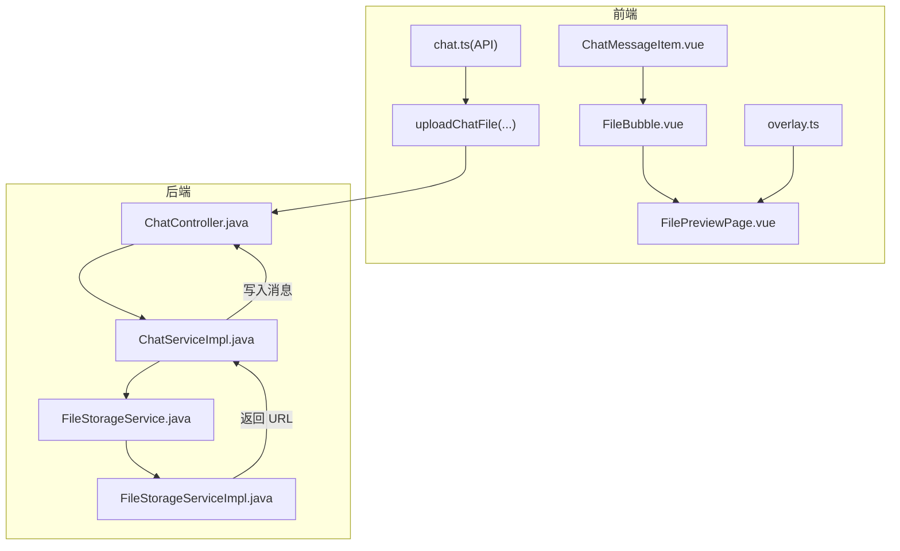
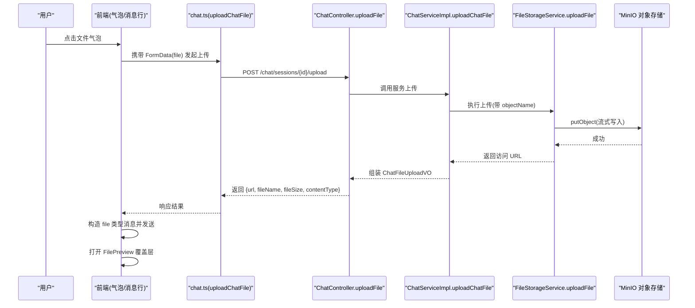
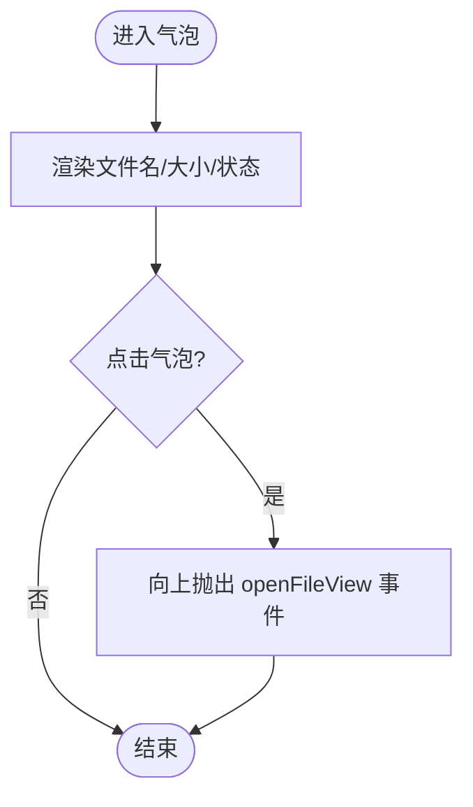
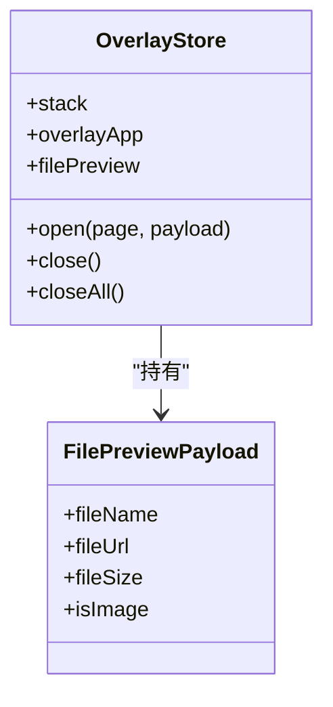
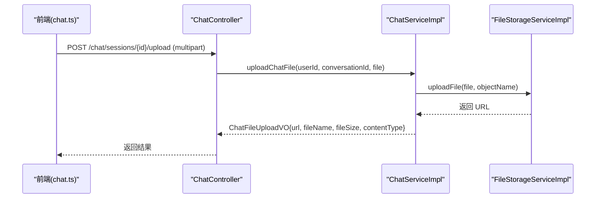
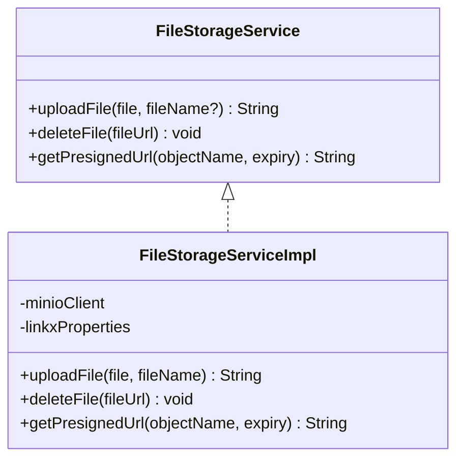
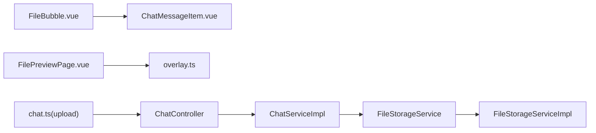

# 文件消息气泡

<cite>
**本文引用的文件**   
- [FileBubble.vue](file://linkx-client/src/components/chat/bubbles/FileBubble.vue)
- [ChatMessageItem.vue](file://linkx-client/src/components/chat/ChatMessageItem.vue)
- [chat.ts（客户端类型）](file://linkx-client/src/types/chat.ts)
- [chat.ts（客户端 API）](file://linkx-client/src/api/chat.ts)
- [FilePreviewPage.vue](file://linkx-client/src/components/overlay/pages/FilePreviewPage.vue)
- [overlay.ts（覆盖层 Store）](file://linkx-client/src/stores/overlay.ts)
- [file.ts（工具函数）](file://linkx-client/src/utils/file.ts)
- [ChatController.java](file://linkx-server/src/main/java/com/linkx/server/controller/ChatController.java)
- [ChatServiceImpl.java](file://linkx-server/src/main/java/com/linkx/server/service/impl/ChatServiceImpl.java)
- [FileStorageService.java](file://linkx-server/src/main/java/com/linkx/server/service/FileStorageService.java)
- [FileStorageServiceImpl.java](file://linkx-server/src/main/java/com/linkx/server/service/impl/FileStorageServiceImpl.java)
</cite>

## 目录
1. [简介](#简介)
2. [项目结构](#项目结构)
3. [核心组件](#核心组件)
4. [架构总览](#架构总览)
5. [详细组件分析](#详细组件分析)
6. [依赖关系分析](#依赖关系分析)
7. [性能考虑](#性能考虑)
8. [故障排查指南](#故障排查指南)
9. [结论](#结论)
10. [附录](#附录)

## 简介
本文件围绕 LinkX 的“文件消息气泡”能力，系统性梳理前端展示、上传下载流程、预览与安全校验、以及后端存储与接口契约。文档面向不同技术背景的读者，提供从概览到代码级细节的分层说明，并给出可操作的优化建议与排错指引。

## 项目结构
围绕文件消息气泡的关键路径包括：
- 前端展示：消息行分发到 FileBubble 气泡；点击后打开 FilePreview 覆盖层进行预览或下载。
- 前端数据：通过 chat API 上传文件，返回 URL 后以 file 类型消息发送。
- 后端接口：ChatController 暴露会话与文件上传接口；ChatServiceImpl 编排业务逻辑；FileStorageService 抽象对象存储实现。
- 类型定义：前后端对文件消息字段保持一致约定（文件名、大小、URL、类型等）。

图表来源
- [ChatMessageItem.vue:82-89](file://linkx-client/src/components/chat/ChatMessageItem.vue#L82-L89)
- [FileBubble.vue:15-31](file://linkx-client/src/components/chat/bubbles/FileBubble.vue#L15-L31)
- [FilePreviewPage.vue:15-37](file://linkx-client/src/components/overlay/pages/FilePreviewPage.vue#L15-L37)
- [overlay.ts:49-74](file://linkx-client/src/stores/overlay.ts#L49-L74)
- [chat.ts(API):19-27](file://linkx-client/src/api/chat.ts#L19-L27)
- [ChatController.java:55-62](file://linkx-server/src/main/java/com/linkx/server/controller/ChatController.java#L55-L62)
- [ChatServiceImpl.java:207-226](file://linkx-server/src/main/java/com/linkx/server/service/impl/ChatServiceImpl.java#L207-L226)
- [FileStorageService.java:8-44](file://linkx-server/src/main/java/com/linkx/server/service/FileStorageService.java#L8-L44)
- [FileStorageServiceImpl.java:27-73](file://linkx-server/src/main/java/com/linkx/server/service/impl/FileStorageServiceImpl.java#L27-L73)

章节来源
- [ChatMessageItem.vue:82-89](file://linkx-client/src/components/chat/ChatMessageItem.vue#L82-L89)
- [FileBubble.vue:15-31](file://linkx-client/src/components/chat/bubbles/FileBubble.vue#L15-L31)
- [FilePreviewPage.vue:15-37](file://linkx-client/src/components/overlay/pages/FilePreviewPage.vue#L15-L37)
- [overlay.ts:49-74](file://linkx-client/src/stores/overlay.ts#L49-L74)
- [chat.ts(API):19-27](file://linkx-client/src/api/chat.ts#L19-L27)
- [ChatController.java:55-62](file://linkx-server/src/main/java/com/linkx/server/controller/ChatController.java#L55-L62)
- [ChatServiceImpl.java:207-226](file://linkx-server/src/main/java/com/linkx/server/service/impl/ChatServiceImpl.java#L207-L226)
- [FileStorageService.java:8-44](file://linkx-server/src/main/java/com/linkx/server/service/FileStorageService.java#L8-L44)
- [FileStorageServiceImpl.java:27-73](file://linkx-server/src/main/java/com/linkx/server/service/impl/FileStorageServiceImpl.java#L27-L73)

## 核心组件
- 文件消息气泡（FileBubble.vue）
  - 负责渲染文件名、文件大小与状态条；点击触发父组件事件以打开预览。
- 消息行分发（ChatMessageItem.vue）
  - 根据消息类型选择对应气泡；为 file 类型绑定点击事件，向上传递 openFileView。
- 文件预览页（FilePreviewPage.vue）
  - 根据是否图片决定显示图片或直接显示占位；提供下载/打开按钮。
- 覆盖层状态（overlay.ts）
  - 管理 overlay 页面栈与文件预览载荷（文件名、URL、大小、是否图片）。
- 文件工具（file.ts）
  - 提供文件大小格式化与 Data URL 读取工具，用于本地预览与持久化策略。
- 聊天 API（chat.ts）
  - 封装会话与消息列表、文件上传接口；上传使用 multipart/form-data。
- 后端控制器与服务（ChatController.java、ChatServiceImpl.java）
  - 处理会话与消息查询、文件上传；上传成功后返回包含 URL、文件名、大小、类型的 VO。
- 存储服务（FileStorageService.java、FileStorageServiceImpl.java）
  - 抽象上传/删除/预签名 URL；实现基于 MinIO 的对象存储，含大小限制与错误处理。

章节来源
- [FileBubble.vue:15-31](file://linkx-client/src/components/chat/bubbles/FileBubble.vue#L15-L31)
- [ChatMessageItem.vue:82-89](file://linkx-client/src/components/chat/ChatMessageItem.vue#L82-L89)
- [FilePreviewPage.vue:15-37](file://linkx-client/src/components/overlay/pages/FilePreviewPage.vue#L15-L37)
- [overlay.ts:12-17](file://linkx-client/src/stores/overlay.ts#L12-L17)
- [file.ts:7-11](file://linkx-client/src/utils/file.ts#L7-L11)
- [chat.ts(API):19-27](file://linkx-client/src/api/chat.ts#L19-L27)
- [ChatController.java:55-62](file://linkx-server/src/main/java/com/linkx/server/controller/ChatController.java#L55-L62)
- [ChatServiceImpl.java:207-226](file://linkx-server/src/main/java/com/linkx/server/service/impl/ChatServiceImpl.java#L207-L226)
- [FileStorageService.java:8-44](file://linkx-server/src/main/java/com/linkx/server/service/FileStorageService.java#L8-L44)
- [FileStorageServiceImpl.java:27-73](file://linkx-server/src/main/java/com/linkx/server/service/impl/FileStorageServiceImpl.java#L27-L73)

## 架构总览
下图展示了从前端点击文件气泡到后端存储与返回 URL 的完整调用链，以及预览页面的数据流。

图表来源
- [chat.ts(API):19-27](file://linkx-client/src/api/chat.ts#L19-L27)
- [ChatController.java:55-62](file://linkx-server/src/main/java/com/linkx/server/controller/ChatController.java#L55-L62)
- [ChatServiceImpl.java:207-226](file://linkx-server/src/main/java/com/linkx/server/service/impl/ChatServiceImpl.java#L207-L226)
- [FileStorageService.java:17-27](file://linkx-server/src/main/java/com/linkx/server/service/FileStorageService.java#L17-L27)
- [FileStorageServiceImpl.java:27-73](file://linkx-server/src/main/java/com/linkx/server/service/impl/FileStorageServiceImpl.java#L27-L73)

## 详细组件分析

### 文件消息气泡（FileBubble.vue）
- 功能要点
  - 展示文件名、文件大小与状态条；点击气泡触发父组件 openFileView 事件。
  - 图标采用通用文档图标，样式类名支持主题色与渐变背景。
- 交互与事件
  - 由 ChatMessageItem 在 type=file 时渲染该气泡，并绑定 click 事件。
- 可扩展点
  - 当前未实现分片进度与断点续传；可在外层包裹进度条与重试逻辑。
  - 可根据 MIME 或扩展名切换不同图标与颜色。

图表来源
- [FileBubble.vue:15-31](file://linkx-client/src/components/chat/bubbles/FileBubble.vue#L15-L31)
- [ChatMessageItem.vue:82-89](file://linkx-client/src/components/chat/ChatMessageItem.vue#L82-L89)

章节来源
- [FileBubble.vue:15-31](file://linkx-client/src/components/chat/bubbles/FileBubble.vue#L15-L31)
- [ChatMessageItem.vue:82-89](file://linkx-client/src/components/chat/ChatMessageItem.vue#L82-L89)

### 消息行分发（ChatMessageItem.vue）
- 功能要点
  - 按消息类型渲染不同气泡；对 file 类型绑定点击事件，向上传递 openFileView。
- 设计模式
  - 条件渲染 + 事件冒泡，保持子组件无状态、父组件集中处理交互。

章节来源
- [ChatMessageItem.vue:82-89](file://linkx-client/src/components/chat/ChatMessageItem.vue#L82-L89)

### 文件预览（FilePreviewPage.vue + overlay.ts）
- 功能要点
  - 若 isImage 为真则直接展示图片；否则显示占位符；提供下载/打开链接。
  - 通过 overlay store 的 filePreview 载荷驱动预览内容。
- 交互流程
  - 父组件设置 filePreview（文件名、URL、大小、是否图片），打开 'file-preview' 页面。

图表来源
- [overlay.ts:12-17](file://linkx-client/src/stores/overlay.ts#L12-L17)
- [overlay.ts:49-74](file://linkx-client/src/stores/overlay.ts#L49-L74)
- [FilePreviewPage.vue:15-37](file://linkx-client/src/components/overlay/pages/FilePreviewPage.vue#L15-L37)

章节来源
- [FilePreviewPage.vue:15-37](file://linkx-client/src/components/overlay/pages/FilePreviewPage.vue#L15-L37)
- [overlay.ts:12-17](file://linkx-client/src/stores/overlay.ts#L12-L17)
- [overlay.ts:49-74](file://linkx-client/src/stores/overlay.ts#L49-L74)

### 文件工具（file.ts）
- 功能要点
  - formatFileSize：将字节数格式化为人类可读字符串（B/KB/MB）。
  - readFileAsDataUrl：将本地 File 读取为 Data URL，便于图片本地预览与持久化。
  - MAX_IMAGE_BYTES：本地图片消息大小上限（2MB），超过不应写入 localStorage。
- 使用场景
  - 在构建文件消息元信息时格式化大小；在本地预览图片时使用 Data URL。

章节来源
- [file.ts:7-11](file://linkx-client/src/utils/file.ts#L7-L11)
- [file.ts:19-26](file://linkx-client/src/utils/file.ts#L19-L26)
- [file.ts:29-30](file://linkx-client/src/utils/file.ts#L29-L30)

### 上传与消息发送（chat.ts + ChatController + ChatServiceImpl）
- 前端上传
  - 使用 FormData 提交 file 字段，Content-Type 设置为 multipart/form-data，超时时间较长以适应大文件。
- 后端处理
  - ChatController 接收 conversationId 与 file，调用 ChatServiceImpl。
  - ChatServiceImpl 校验会话成员权限，生成 objectName（chat/会话ID/时间戳+扩展名），委托 FileStorageService 上传。
  - FileStorageServiceImpl 校验大小、写入 MinIO，返回公开访问 URL。
- 消息落库
  - 上传成功后，服务端组装 ChatFileUploadVO（url、fileName、fileSize、contentType），上层再将其作为 file 类型消息发送。

图表来源
- [chat.ts(API):19-27](file://linkx-client/src/api/chat.ts#L19-L27)
- [ChatController.java:55-62](file://linkx-server/src/main/java/com/linkx/server/controller/ChatController.java#L55-L62)
- [ChatServiceImpl.java:207-226](file://linkx-server/src/main/java/com/linkx/server/service/impl/ChatServiceImpl.java#L207-L226)
- [FileStorageServiceImpl.java:27-73](file://linkx-server/src/main/java/com/linkx/server/service/impl/FileStorageServiceImpl.java#L27-L73)

章节来源
- [chat.ts(API):19-27](file://linkx-client/src/api/chat.ts#L19-L27)
- [ChatController.java:55-62](file://linkx-server/src/main/java/com/linkx/server/controller/ChatController.java#L55-L62)
- [ChatServiceImpl.java:207-226](file://linkx-server/src/main/java/com/linkx/server/service/impl/ChatServiceImpl.java#L207-L226)
- [FileStorageServiceImpl.java:27-73](file://linkx-server/src/main/java/com/linkx/server/service/impl/FileStorageServiceImpl.java#L27-L73)

### 类型与契约（chat.ts 客户端类型）
- MessageItem
  - 关键字段：type='file'、content、fileName、fileSize、fileUrl、isSelf、createTime。
- ChatFileUploadResult
  - 上传返回：url、fileName、fileSize、contentType。
- WsSendPayload / WsIncomingFrame
  - 用于 WebSocket 发送/接收消息帧，包含 file 相关字段。

章节来源
- [chat.ts（客户端类型）:15-35](file://linkx-client/src/types/chat.ts#L15-L35)
- [chat.ts（客户端类型）:37-54](file://linkx-client/src/types/chat.ts#L37-L54)

### 后端存储接口与实现（FileStorageService + FileStorageServiceImpl）
- 接口能力
  - uploadFile：上传文件并返回访问 URL。
  - deleteFile：删除对象。
  - getPresignedUrl：获取临时访问 URL（当前简化实现返回公开 URL）。
- 实现要点
  - 大小限制：依据配置的最大文件大小校验。
  - 命名策略：按日期组织路径前缀，objectName 支持传入或自动生成。
  - 错误处理：捕获 MinIO/IO 异常并包装为运行时异常。

图表来源
- [FileStorageService.java:8-44](file://linkx-server/src/main/java/com/linkx/server/service/FileStorageService.java#L8-L44)
- [FileStorageServiceImpl.java:22-115](file://linkx-server/src/main/java/com/linkx/server/service/impl/FileStorageServiceImpl.java#L22-L115)

章节来源
- [FileStorageService.java:8-44](file://linkx-server/src/main/java/com/linkx/server/service/FileStorageService.java#L8-L44)
- [FileStorageServiceImpl.java:27-73](file://linkx-server/src/main/java/com/linkx/server/service/impl/FileStorageServiceImpl.java#L27-L73)
- [FileStorageServiceImpl.java:76-105](file://linkx-server/src/main/java/com/linkx/server/service/impl/FileStorageServiceImpl.java#L76-L105)
- [FileStorageServiceImpl.java:109-114](file://linkx-server/src/main/java/com/linkx/server/service/impl/FileStorageServiceImpl.java#L109-L114)

## 依赖关系分析
- 前端耦合
  - ChatMessageItem 依赖 FileBubble、ImageBubble 等；FileBubble 仅依赖 UI 图标与消息模型。
  - FilePreviewPage 依赖 overlay store 的 filePreview 载荷。
- 前后端契约
  - 上传接口：POST /chat/sessions/{conversationId}/upload，表单字段 file。
  - 返回结构：ChatFileUploadVO（url、fileName、fileSize、contentType）。
- 外部依赖
  - MinIO 对象存储：用于文件持久化与访问。

图表来源
- [FileBubble.vue:15-31](file://linkx-client/src/components/chat/bubbles/FileBubble.vue#L15-L31)
- [ChatMessageItem.vue:82-89](file://linkx-client/src/components/chat/ChatMessageItem.vue#L82-L89)
- [FilePreviewPage.vue:15-37](file://linkx-client/src/components/overlay/pages/FilePreviewPage.vue#L15-L37)
- [overlay.ts:49-74](file://linkx-client/src/stores/overlay.ts#L49-L74)
- [chat.ts(API):19-27](file://linkx-client/src/api/chat.ts#L19-L27)
- [ChatController.java:55-62](file://linkx-server/src/main/java/com/linkx/server/controller/ChatController.java#L55-L62)
- [ChatServiceImpl.java:207-226](file://linkx-server/src/main/java/com/linkx/server/service/impl/ChatServiceImpl.java#L207-L226)
- [FileStorageService.java:8-44](file://linkx-server/src/main/java/com/linkx/server/service/FileStorageService.java#L8-L44)
- [FileStorageServiceImpl.java:27-73](file://linkx-server/src/main/java/com/linkx/server/service/impl/FileStorageServiceImpl.java#L27-L73)

章节来源
- [chat.ts(API):19-27](file://linkx-client/src/api/chat.ts#L19-L27)
- [ChatController.java:55-62](file://linkx-server/src/main/java/com/linkx/server/controller/ChatController.java#L55-L62)
- [ChatServiceImpl.java:207-226](file://linkx-server/src/main/java/com/linkx/server/service/impl/ChatServiceImpl.java#L207-L226)
- [FileStorageService.java:8-44](file://linkx-server/src/main/java/com/linkx/server/service/FileStorageService.java#L8-L44)
- [FileStorageServiceImpl.java:27-73](file://linkx-server/src/main/java/com/linkx/server/service/impl/FileStorageServiceImpl.java#L27-L73)

## 性能考虑
- 上传阶段
  - 当前为整包上传，适合中小文件；超大文件建议引入分片上传与并发合并，结合断点续传提升稳定性与吞吐。
- 预览阶段
  - 图片优先使用浏览器原生加载；非图片类型避免在内存中解码大文件，必要时在服务端生成缩略图或转码。
- 网络与缓存
  - 利用浏览器缓存与 CDN 加速静态资源；对私有桶启用预签名 URL 缩短直连链路。
- 前端渲染
  - 长列表虚拟滚动；延迟加载大图；按需初始化预览器。
- 后端存储
  - 合理设置 MinIO 分块大小与并发；对热点文件开启缓存；监控对象大小分布与请求延迟。

[本节为通用指导，不直接分析具体文件]

## 故障排查指南
- 上传失败
  - 检查文件大小是否超过服务端限制；确认 Content-Type 与 multipart/form-data 是否正确。
  - 查看后端日志中的 MinIO/IO 异常堆栈，定位网络或权限问题。
- 预览不可用
  - 确认返回的 fileUrl 是否可达；对于私有桶需使用预签名 URL。
  - 检查 isImage 标志是否与真实 MIME 一致，避免误判导致无法预览。
- 权限与鉴权
  - 确保会话成员校验通过；JWT 有效且 userId 解析正确。
- 错误码与提示
  - 自定义异常统一返回错误码与消息；前端据此展示友好提示。

章节来源
- [FileStorageServiceImpl.java:69-72](file://linkx-server/src/main/java/com/linkx/server/service/impl/FileStorageServiceImpl.java#L69-L72)
- [FileStorageServiceImpl.java:102-105](file://linkx-server/src/main/java/com/linkx/server/service/impl/FileStorageServiceImpl.java#L102-L105)
- [ChatController.java:64-70](file://linkx-server/src/main/java/com/linkx/server/controller/ChatController.java#L64-L70)

## 结论
文件消息气泡在现有实现中已具备完整的“上传—存储—预览—下载”闭环，前后端契约清晰、职责分层明确。后续可在分片上传、断点续传、安全校验与性能优化方面持续增强，以提升大文件体验与系统健壮性。

[本节为总结性内容，不直接分析具体文件]

## 附录

### 关键 API 与数据结构
- 上传接口
  - 方法：POST
  - 路径：/chat/sessions/{conversationId}/upload
  - 请求体：multipart/form-data，字段 file
  - 响应：ChatFileUploadVO（url、fileName、fileSize、contentType）
- 消息类型
  - type：'text' | 'image' | 'file'
  - file 消息关键字段：fileName、fileSize、fileUrl、isSelf、createTime

章节来源
- [ChatController.java:55-62](file://linkx-server/src/main/java/com/linkx/server/controller/ChatController.java#L55-L62)
- [ChatFileUploadVO.java:8-14](file://linkx-server/src/main/java/com/linkx/server/controller/vo/ChatFileUploadVO.java#L8-L14)
- [chat.ts（客户端类型）:15-35](file://linkx-client/src/types/chat.ts#L15-L35)