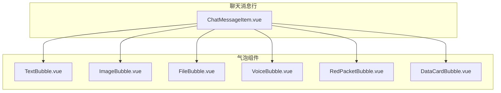
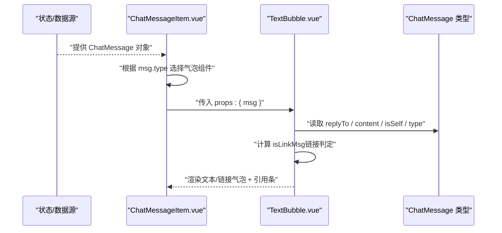
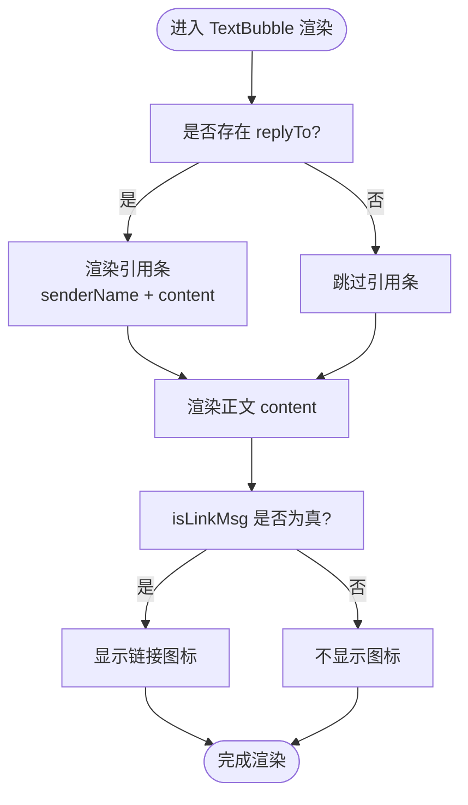
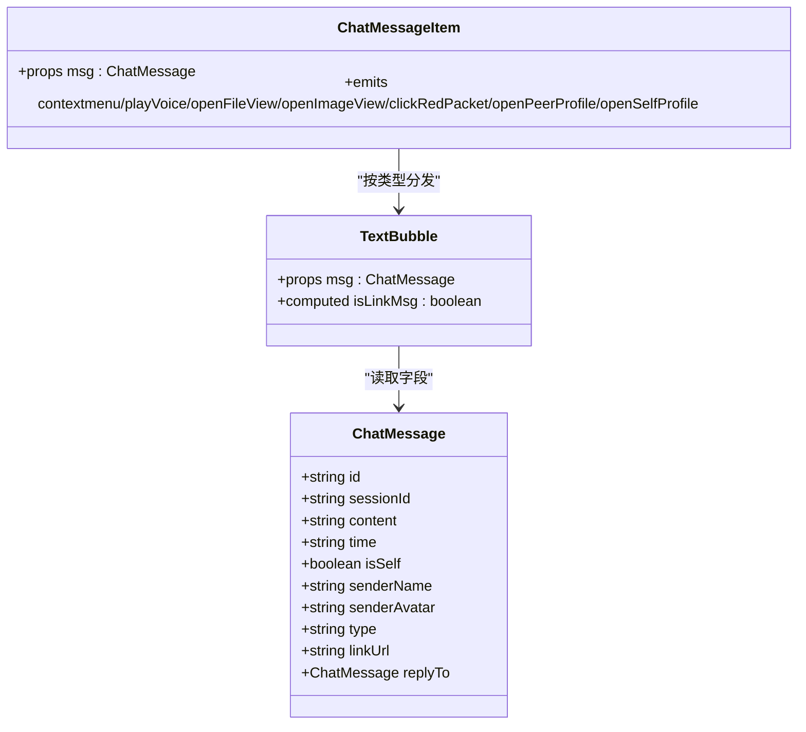

# 文本消息气泡

<cite>
**本文引用的文件**   
- [TextBubble.vue](file://linkx-client/src/components/chat/bubbles/TextBubble.vue)
- [ChatMessageItem.vue](file://linkx-client/src/components/chat/ChatMessageItem.vue)
- [index.ts](file://linkx-client/src/types/index.ts)
</cite>

## 目录
1. [简介](#简介)
2. [项目结构](#项目结构)
3. [核心组件](#核心组件)
4. [架构总览](#架构总览)
5. [详细组件分析](#详细组件分析)
6. [依赖关系分析](#依赖关系分析)
7. [性能与可访问性](#性能与可访问性)
8. [故障排查指南](#故障排查指南)
9. [结论](#结论)
10. [附录：扩展与自定义指南](#附录扩展与自定义指南)

## 简介
本文件面向 LinkX 前端中的“文本消息气泡”组件，系统性说明其渲染逻辑、链接识别机制、回复引用显示与样式处理。文档覆盖组件属性定义、计算属性实现、模板结构与样式设计，并给出文本格式化、链接检测算法、响应式设计与用户体验优化的实践建议，以及自定义文本样式和扩展功能的开发指南。

## 项目结构
文本消息气泡位于聊天模块的 bubbles 子目录中，由 ChatMessageItem 根据消息类型分发到具体气泡组件进行渲染。

图表来源
- [ChatMessageItem.vue:82-88](file://linkx-client/src/components/chat/ChatMessageItem.vue#L82-L88)

章节来源
- [ChatMessageItem.vue:1-96](file://linkx-client/src/components/chat/ChatMessageItem.vue#L1-L96)

## 核心组件
- 文本消息气泡 TextBubble.vue：负责纯文本或链接样式的展示，支持回复引用预览。
- 消息行容器 ChatMessageItem.vue：按消息类型分发到对应气泡组件，并提供全局气泡样式。
- 数据类型 index.ts：定义 ChatMessage 接口，包含 type、content、replyTo 等字段，用于驱动渲染与交互。

章节来源
- [TextBubble.vue:1-33](file://linkx-client/src/components/chat/bubbles/TextBubble.vue#L1-L33)
- [ChatMessageItem.vue:1-96](file://linkx-client/src/components/chat/ChatMessageItem.vue#L1-L96)
- [index.ts:44-83](file://linkx-client/src/types/index.ts#L44-L83)

## 架构总览
文本消息从数据模型到视图渲染的关键路径如下：

图表来源
- [ChatMessageItem.vue:82-88](file://linkx-client/src/components/chat/ChatMessageItem.vue#L82-L88)
- [TextBubble.vue:13-31](file://linkx-client/src/components/chat/bubbles/TextBubble.vue#L13-L31)
- [index.ts:44-83](file://linkx-client/src/types/index.ts#L44-L83)

## 详细组件分析

### 组件属性与数据模型
- 入参
  - msg: ChatMessage
    - id, sessionId, content, time, isSelf
    - type: 'text' | 'image' | 'file' | 'link' | 'system' | 'voice' | 'redPacket' | 'dataCard'
    - linkUrl（可选）
    - replyTo?: ChatMessage（引用原消息）
- 作用域
  - 仅接收父级传入的 msg，不持有内部状态。

章节来源
- [TextBubble.vue:13](file://linkx-client/src/components/chat/bubbles/TextBubble.vue#L13)
- [index.ts:44-83](file://linkx-client/src/types/index.ts#L44-L83)

### 计算属性与链接识别算法
- 计算属性 isLinkMsg
  - 判定条件（满足其一即为链接类消息）：
    - msg.type === 'link'
    - content 匹配 http(s) URL 正则
    - content 包含特定关键词（如“抖音”）
- 复杂度
  - 时间复杂度 O(n)，n 为 content 长度；正则一次扫描，关键字包含一次扫描。
- 可扩展点
  - 将正则与关键词策略抽取为配置项，便于后续接入更多平台关键词或更严格的 URL 校验。

章节来源
- [TextBubble.vue:16-19](file://linkx-client/src/components/chat/bubbles/TextBubble.vue#L16-L19)

### 模板结构与渲染流程
- 外层容器
  - 根节点 class 动态绑定：
    - self：当 msg.isSelf 为真时，应用“自己侧”样式
    - link：当 isLinkMsg 为真时，应用“链接”样式
- 回复引用条
  - 当存在 msg.replyTo 时，显示引用条，内容为发送者名称与内容摘要
- 正文
  - 使用段落标签承载 msg.content，保留换行与断词
- 链接图标
  - 当 isLinkMsg 为真时，在气泡右侧显示链接图标

图表来源
- [TextBubble.vue:24-31](file://linkx-client/src/components/chat/bubbles/TextBubble.vue#L24-L31)

章节来源
- [TextBubble.vue:22-32](file://linkx-client/src/components/chat/bubbles/TextBubble.vue#L22-L32)

### 样式设计与响应式
- 气泡基础样式
  - 背景、圆角、内边距、字号、行高、颜色、阴影等通过 CSS 变量统一控制
- 自己侧样式
  - 通过 .qq-bubble.self 切换背景色，形成左右区分
- 链接样式
  - 当 .qq-bubble.link 时，正文取消多余外边距并强制长链接换行
- 正文排版
  - 使用 pre-wrap 保留换行，break-word 避免溢出
- 引用条样式
  - 小字号、浅色背景、左侧强调线、单行省略
- 响应式
  - 气泡宽度受父容器限制，结合 max-width 与百分比适配不同屏幕

章节来源
- [ChatMessageItem.vue:122-175](file://linkx-client/src/components/chat/ChatMessageItem.vue#L122-L175)

### 事件与交互
- 当前文本气泡无点击事件
- 右键菜单、语音播放、图片/文件打开、红包、资料卡等事件由父级 ChatMessageItem 统一派发，文本气泡不参与

章节来源
- [ChatMessageItem.vue:35-43](file://linkx-client/src/components/chat/ChatMessageItem.vue#L35-L43)
- [ChatMessageItem.vue:82-88](file://linkx-client/src/components/chat/ChatMessageItem.vue#L82-L88)

## 依赖关系分析
- 组件间依赖
  - ChatMessageItem 作为路由分发器，依据 msg.type 选择 TextBubble 等具体气泡组件
- 类型依赖
  - TextBubble 依赖 ChatMessage 类型，确保 replyTo、type、content 等字段可用
- 样式依赖
  - 气泡通用样式集中在 ChatMessageItem 的全局 style 块中，避免重复定义

图表来源
- [index.ts:44-83](file://linkx-client/src/types/index.ts#L44-L83)
- [TextBubble.vue:13-31](file://linkx-client/src/components/chat/bubbles/TextBubble.vue#L13-L31)
- [ChatMessageItem.vue:82-88](file://linkx-client/src/components/chat/ChatMessageItem.vue#L82-L88)

章节来源
- [ChatMessageItem.vue:82-88](file://linkx-client/src/components/chat/ChatMessageItem.vue#L82-L88)
- [index.ts:44-83](file://linkx-client/src/types/index.ts#L44-L83)

## 性能与可访问性
- 性能
  - 链接检测为线性扫描，建议在超长文本场景下考虑缓存 isLinkMsg 结果或使用 Web Worker 进行复杂正则解析
  - 避免在高频滚动中执行昂贵计算，必要时对 content 做截断或懒加载
- 可访问性
  - 链接气泡可考虑增加 aria-label 提示“包含链接”，提升读屏体验
  - 引用条文本过长时使用 title 或 tooltip 展示完整内容

[本节为通用指导，无需源码引用]

## 故障排查指南
- 链接未识别
  - 检查 content 是否以 http/https 开头，或是否包含目标关键词
  - 确认 type 是否为 'link'
- 引用条不显示
  - 确认 replyTo 对象是否存在且包含 senderName 与 content
- 样式异常
  - 检查 .qq-bubble.self 与 .qq-bubble.link 是否被正确绑定
  - 确认全局样式未被覆盖

章节来源
- [TextBubble.vue:16-19](file://linkx-client/src/components/chat/bubbles/TextBubble.vue#L16-L19)
- [TextBubble.vue:24-31](file://linkx-client/src/components/chat/bubbles/TextBubble.vue#L24-L31)
- [ChatMessageItem.vue:122-175](file://linkx-client/src/components/chat/ChatMessageItem.vue#L122-L175)

## 结论
文本消息气泡以最小职责聚焦于“文本/链接”的呈现与“引用条”的展示，配合 ChatMessageItem 的类型分发与全局样式，实现了清晰、可维护的渲染链路。通过计算属性实现的链接识别具备良好扩展性，可在不改动模板的前提下快速接入新的链接策略。

[本节为总结，无需源码引用]

## 附录：扩展与自定义指南

### 自定义文本样式
- 修改主题变量
  - 通过 CSS 变量调整气泡背景、文字颜色、圆角等，保持与整体主题一致
- 覆盖链接样式
  - 针对 .qq-bubble.link 下的正文与图标进行二次定制，例如添加下划线或悬停效果

章节来源
- [ChatMessageItem.vue:122-175](file://linkx-client/src/components/chat/ChatMessageItem.vue#L122-L175)

### 扩展链接检测策略
- 新增关键词
  - 在 isLinkMsg 的计算逻辑中加入新的平台关键词判断
- 增强 URL 校验
  - 引入更严格的 URL 正则或第三方库，减少误判
- 配置化
  - 将正则与关键词抽离为配置文件，便于多环境或多主题差异化

章节来源
- [TextBubble.vue:16-19](file://linkx-client/src/components/chat/bubbles/TextBubble.vue#L16-L19)

### 增强引用信息
- 丰富引用条内容
  - 若 replyTo 携带更多元信息（如时间、类型），可在引用条中补充显示
- 交互增强
  - 点击引用条跳转到原消息位置（需上层提供定位能力）

章节来源
- [TextBubble.vue:26-28](file://linkx-client/src/components/chat/bubbles/TextBubble.vue#L26-L28)
- [index.ts:81-82](file://linkx-client/src/types/index.ts#L81-L82)