# 消息类型支持

<cite>
**本文引用的文件**   
- [chat.ts](file://linkx-client/src/types/chat.ts)
- [index.ts](file://linkx-client/src/types/index.ts)
- [ChatMessageItem.vue](file://linkx-client/src/components/chat/ChatMessageItem.vue)
- [TextBubble.vue](file://linkx-client/src/components/chat/bubbles/TextBubble.vue)
- [ImageBubble.vue](file://linkx-client/src/components/chat/bubbles/ImageBubble.vue)
- [VoiceBubble.vue](file://linkx-client/src/components/chat/bubbles/VoiceBubble.vue)
- [FileBubble.vue](file://linkx-client/src/components/chat/bubbles/FileBubble.vue)
- [RedPacketBubble.vue](file://linkx-client/src/components/chat/bubbles/RedPacketBubble.vue)
- [DataCardBubble.vue](file://linkx-client/src/components/chat/bubbles/DataCardBubble.vue)
- [chatMapper.ts](file://linkx-client/src/utils/chatMapper.ts)
- [SendMessageDTO.java](file://linkx-server/src/main/java/com/linkx/server/controller/dto/SendMessageDTO.java)
- [ImMessage.java](file://linkx-server/src/main/java/com/linkx/server/entity/ImMessage.java)
- [MessageVO.java](file://linkx-server/src/main/java/com/linkx/server/controller/vo/MessageVO.java)
</cite>

## 目录
1. [引言](#引言)
2. [项目结构](#项目结构)
3. [核心组件](#核心组件)
4. [架构总览](#架构总览)
5. [详细组件分析](#详细组件分析)
6. [依赖关系分析](#依赖关系分析)
7. [性能与体验优化](#性能与体验优化)
8. [故障排查指南](#故障排查指南)
9. [结论](#结论)
10. [附录：扩展自定义消息类型](#附录：扩展自定义消息类型)

## 引言
本文件面向 LinkX 的消息类型支持系统，系统性梳理文本、图片、语音、文件、红包等消息类型的渲染组件、数据处理与业务逻辑。文档覆盖消息类型定义、组件设计模式、数据格式转换与扩展机制，并提供每种消息类型的特殊处理逻辑、用户体验优化与兼容性考虑，以及自定义消息类型的开发指南和最佳实践。

## 项目结构
前端采用 Vue 3 + TypeScript，消息类型通过统一的 ChatMessage 接口描述，具体类型由 type 字段区分；各类型气泡以独立子组件实现，由父组件根据 type 分发渲染。后端使用 Java（Spring）提供发送消息的 DTO 与持久化实体，并通过 VO 返回给前端。

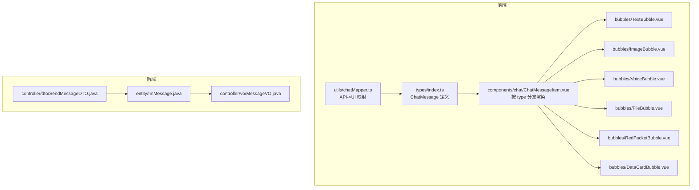

图表来源
- [index.ts:44-83](file://linkx-client/src/types/index.ts#L44-L83)
- [ChatMessageItem.vue:81-88](file://linkx-client/src/components/chat/ChatMessageItem.vue#L81-L88)
- [TextBubble.vue:1-33](file://linkx-client/src/components/chat/bubbles/TextBubble.vue#L1-L33)
- [ImageBubble.vue:1-19](file://linkx-client/src/components/chat/bubbles/ImageBubble.vue#L1-L19)
- [VoiceBubble.vue:1-33](file://linkx-client/src/components/chat/bubbles/VoiceBubble.vue#L1-L33)
- [FileBubble.vue:1-32](file://linkx-client/src/components/chat/bubbles/FileBubble.vue#L1-L32)
- [RedPacketBubble.vue:1-25](file://linkx-client/src/components/chat/bubbles/RedPacketBubble.vue#L1-L25)
- [DataCardBubble.vue:1-200](file://linkx-client/src/components/chat/bubbles/DataCardBubble.vue#L1-L200)
- [chatMapper.ts:28-50](file://linkx-client/src/utils/chatMapper.ts#L28-L50)
- [SendMessageDTO.java:1-26](file://linkx-server/src/main/java/com/linkx/server/controller/dto/SendMessageDTO.java#L1-L26)
- [ImMessage.java:25-47](file://linkx-server/src/main/java/com/linkx/server/entity/ImMessage.java#L25-L47)
- [MessageVO.java:10-31](file://linkx-server/src/main/java/com/linkx/server/controller/vo/MessageVO.java#L10-L31)

章节来源
- [index.ts:44-83](file://linkx-client/src/types/index.ts#L44-L83)
- [ChatMessageItem.vue:81-88](file://linkx-client/src/components/chat/ChatMessageItem.vue#L81-L88)
- [chatMapper.ts:28-50](file://linkx-client/src/utils/chatMapper.ts#L28-L50)
- [SendMessageDTO.java:1-26](file://linkx-server/src/main/java/com/linkx/server/controller/dto/SendMessageDTO.java#L1-L26)
- [ImMessage.java:25-47](file://linkx-server/src/main/java/com/linkx/server/entity/ImMessage.java#L25-L47)
- [MessageVO.java:10-31](file://linkx-server/src/main/java/com/linkx/server/controller/vo/MessageVO.java#L10-L31)

## 核心组件
- 统一消息模型：ChatMessage 在前端作为所有消息的统一表示，包含通用字段与按类型扩展的可选字段。
- 类型分发器：ChatMessageItem 根据 msg.type 将渲染委托到对应气泡组件。
- 数据映射：chatMapper 负责将后端 MessageItem/MessageVO 转换为前端 ChatMessage，并补齐展示所需字段。
- 后端契约：SendMessageDTO 定义发送消息的请求体；ImMessage 为持久化实体；MessageVO 为对外响应视图对象。

章节来源
- [index.ts:44-83](file://linkx-client/src/types/index.ts#L44-L83)
- [ChatMessageItem.vue:81-88](file://linkx-client/src/components/chat/ChatMessageItem.vue#L81-L88)
- [chatMapper.ts:28-50](file://linkx-client/src/utils/chatMapper.ts#L28-L50)
- [SendMessageDTO.java:1-26](file://linkx-server/src/main/java/com/linkx/server/controller/dto/SendMessageDTO.java#L1-L26)
- [ImMessage.java:25-47](file://linkx-server/src/main/java/com/linkx/server/entity/ImMessage.java#L25-L47)
- [MessageVO.java:10-31](file://linkx-server/src/main/java/com/linkx/server/controller/vo/MessageVO.java#L10-L31)

## 架构总览
下图展示了从后端到前端的端到端消息流转：客户端构造发送请求（含类型与内容），服务端落库并返回消息视图对象，前端将其映射为 ChatMessage 并由 ChatMessageItem 分发至相应气泡组件渲染。

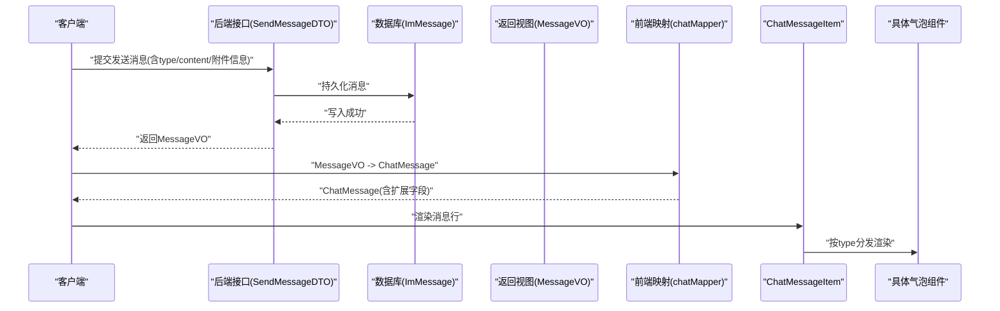

图表来源
- [SendMessageDTO.java:1-26](file://linkx-server/src/main/java/com/linkx/server/controller/dto/SendMessageDTO.java#L1-L26)
- [ImMessage.java:25-47](file://linkx-server/src/main/java/com/linkx/server/entity/ImMessage.java#L25-L47)
- [MessageVO.java:10-31](file://linkx-server/src/main/java/com/linkx/server/controller/vo/MessageVO.java#L10-L31)
- [chatMapper.ts:28-50](file://linkx-client/src/utils/chatMapper.ts#L28-L50)
- [ChatMessageItem.vue:81-88](file://linkx-client/src/components/chat/ChatMessageItem.vue#L81-L88)

## 详细组件分析

### 文本消息（text / link）
- 类型识别：当 type 为 text 或 link，或 content 包含 http(s) URL 或特定关键词时，文本气泡会显示链接样式图标。
- 引用回复：若存在 replyTo，则显示引用条。
- 交互：点击行为可由上层统一处理（如打开外链）。

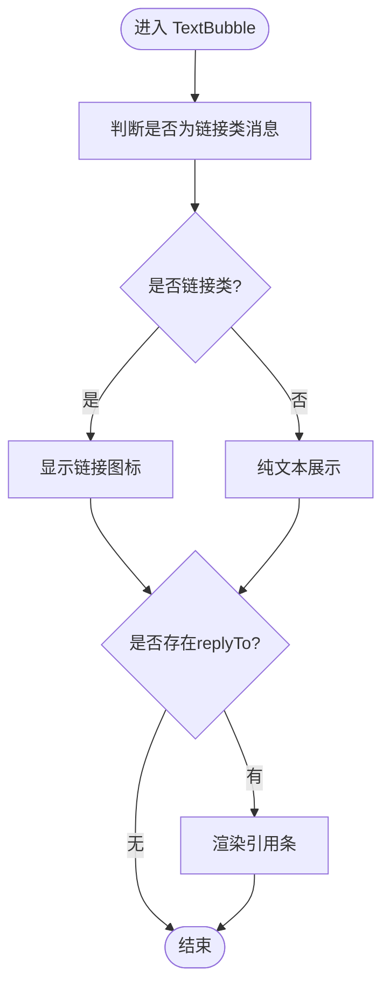

图表来源
- [TextBubble.vue:15-31](file://linkx-client/src/components/chat/bubbles/TextBubble.vue#L15-L31)
- [index.ts:44-83](file://linkx-client/src/types/index.ts#L44-L83)

章节来源
- [TextBubble.vue:15-31](file://linkx-client/src/components/chat/bubbles/TextBubble.vue#L15-L31)
- [index.ts:44-83](file://linkx-client/src/types/index.ts#L44-L83)

### 图片消息（image）
- 数据来源：content 存储图片 URL 或 DataURL；isImage 标记用于兼容历史数据。
- 交互：点击由父组件触发图片预览。

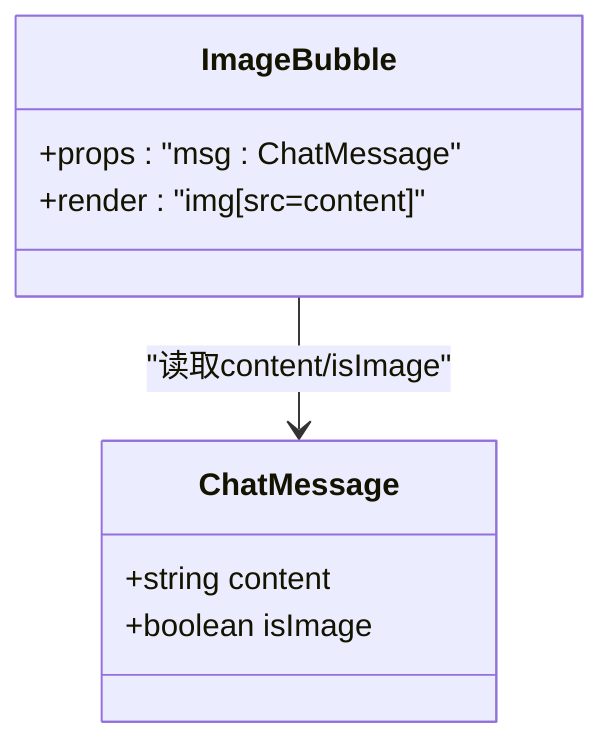

图表来源
- [ImageBubble.vue:10-18](file://linkx-client/src/components/chat/bubbles/ImageBubble.vue#L10-L18)
- [index.ts:44-83](file://linkx-client/src/types/index.ts#L44-L83)

章节来源
- [ImageBubble.vue:10-18](file://linkx-client/src/components/chat/bubbles/ImageBubble.vue#L10-L18)
- [index.ts:44-83](file://linkx-client/src/types/index.ts#L44-L83)

### 语音消息（voice）
- 展示：麦克风图标 + 时长格式化（小于 60 秒显示“秒”，否则“分'秒”）。
- 状态：playing 为 true 时高亮播放态。
- 交互：点击触发播放事件，由父组件管理播放状态。

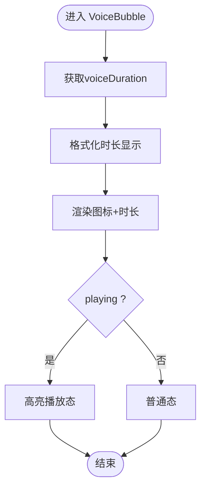

图表来源
- [VoiceBubble.vue:14-32](file://linkx-client/src/components/chat/bubbles/VoiceBubble.vue#L14-L32)
- [index.ts:44-83](file://linkx-client/src/types/index.ts#L44-L83)

章节来源
- [VoiceBubble.vue:14-32](file://linkx-client/src/components/chat/bubbles/VoiceBubble.vue#L14-L32)
- [index.ts:44-83](file://linkx-client/src/types/index.ts#L44-L83)

### 文件消息（file）
- 展示：文件名、大小与底部状态条（已发送/已接收/已下载等）。
- 交互：点击可打开文件预览或下载。
- 数据：fileName、fileSize、fileUrl、fileStatus 等扩展字段。

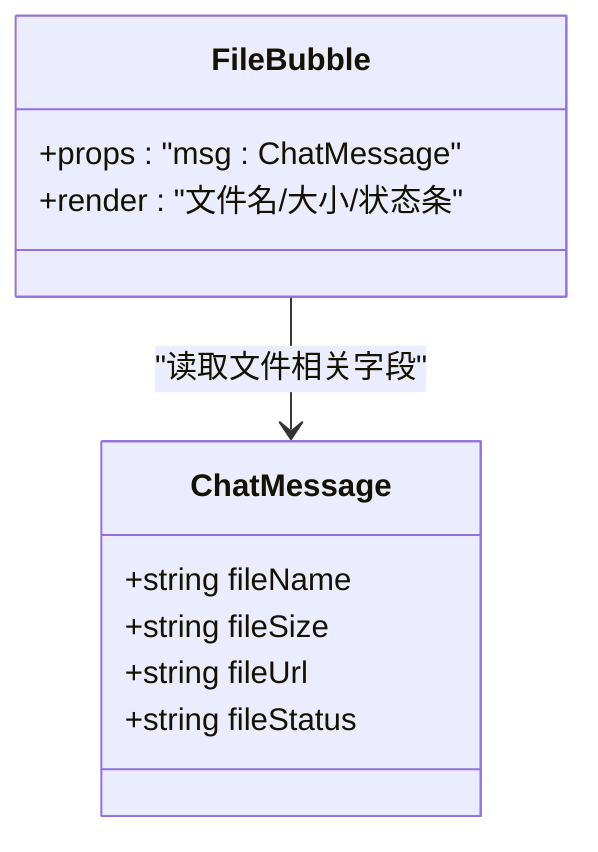

图表来源
- [FileBubble.vue:12-31](file://linkx-client/src/components/chat/bubbles/FileBubble.vue#L12-L31)
- [index.ts:44-83](file://linkx-client/src/types/index.ts#L44-L83)

章节来源
- [FileBubble.vue:12-31](file://linkx-client/src/components/chat/bubbles/FileBubble.vue#L12-L31)
- [index.ts:44-83](file://linkx-client/src/types/index.ts#L44-L83)

### 红包消息（redPacket）
- 展示：祝福语、领取状态；opened 时降低不透明度。
- 交互：点击触发领取流程，由父组件处理后续动作。

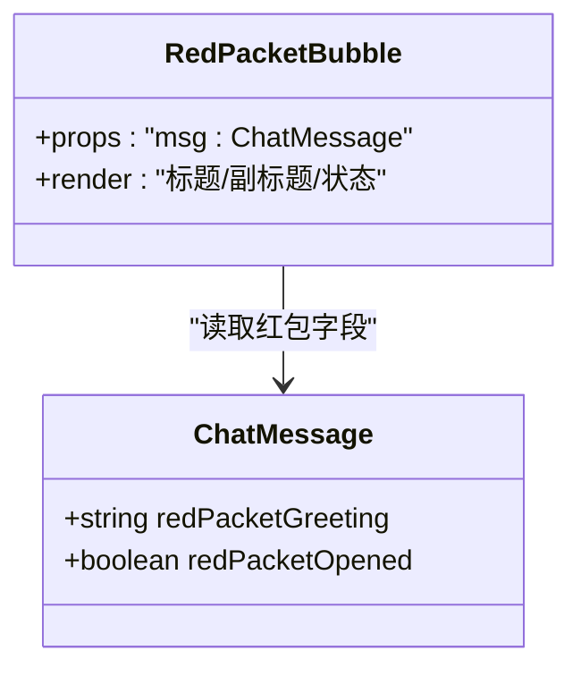

图表来源
- [RedPacketBubble.vue:10-24](file://linkx-client/src/components/chat/bubbles/RedPacketBubble.vue#L10-L24)
- [index.ts:44-83](file://linkx-client/src/types/index.ts#L44-L83)

章节来源
- [RedPacketBubble.vue:10-24](file://linkx-client/src/components/chat/bubbles/RedPacketBubble.vue#L10-L24)
- [index.ts:44-83](file://linkx-client/src/types/index.ts#L44-L83)

### 数据卡片消息（dataCard）
- 用途：承载结构化数据（如知流等场景），包含标题、副标题、标签、值等。
- 渲染：由 DataCardBubble 组件负责布局与展示。

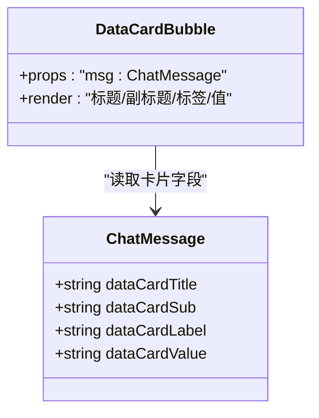

图表来源
- [DataCardBubble.vue:1-200](file://linkx-client/src/components/chat/bubbles/DataCardBubble.vue#L1-L200)
- [index.ts:44-83](file://linkx-client/src/types/index.ts#L44-L83)

章节来源
- [DataCardBubble.vue:1-200](file://linkx-client/src/components/chat/bubbles/DataCardBubble.vue#L1-L200)
- [index.ts:44-83](file://linkx-client/src/types/index.ts#L44-L83)

### 消息分发器（ChatMessageItem）
- 职责：根据 msg.type 选择对应气泡组件，并透传事件（右键菜单、播放语音、打开文件/图片、红包、资料卡等）。
- 头像：单聊非群且非“我的手机”会话时，对方头像可点击打开资料卡。

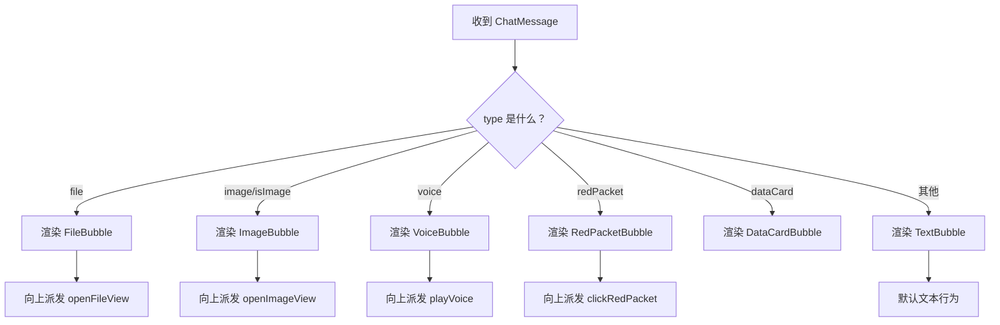

图表来源
- [ChatMessageItem.vue:81-88](file://linkx-client/src/components/chat/ChatMessageItem.vue#L81-L88)

章节来源
- [ChatMessageItem.vue:81-88](file://linkx-client/src/components/chat/ChatMessageItem.vue#L81-L88)

### 数据映射（chatMapper）
- conversationToSession：将后端会话项转为前端会话列表项。
- messageToChatMessage：将后端消息项转为前端 ChatMessage，并按类型填充 content、fileSize、fileStatus、isImage 等。
- messagePreviewFromItem：生成会话列表中的消息摘要。

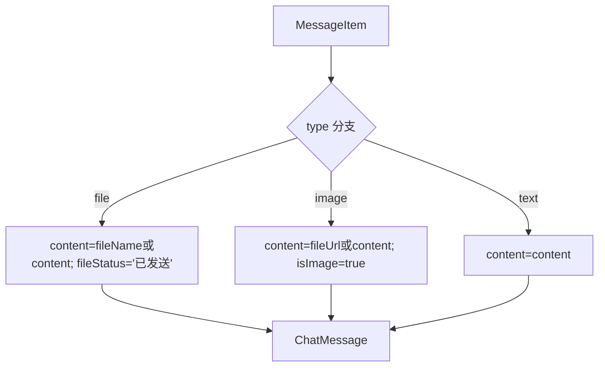

图表来源
- [chatMapper.ts:28-50](file://linkx-client/src/utils/chatMapper.ts#L28-L50)

章节来源
- [chatMapper.ts:28-50](file://linkx-client/src/utils/chatMapper.ts#L28-L50)

## 依赖关系分析
- 前端类型层：ChatMessage 是所有气泡组件的共同契约，确保一致的数据访问方式。
- 组件耦合：ChatMessageItem 与气泡组件之间通过 props 解耦，新增类型只需增加一个子组件并在分发处注册。
- 前后端契约：后端通过 SendMessageDTO 接收发送请求，ImMessage 持久化，MessageVO 返回；前端 chatMapper 负责适配差异。

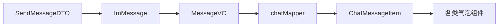

图表来源
- [SendMessageDTO.java:1-26](file://linkx-server/src/main/java/com/linkx/server/controller/dto/SendMessageDTO.java#L1-L26)
- [ImMessage.java:25-47](file://linkx-server/src/main/java/com/linkx/server/entity/ImMessage.java#L25-L47)
- [MessageVO.java:10-31](file://linkx-server/src/main/java/com/linkx/server/controller/vo/MessageVO.java#L10-L31)
- [chatMapper.ts:28-50](file://linkx-client/src/utils/chatMapper.ts#L28-L50)
- [ChatMessageItem.vue:81-88](file://linkx-client/src/components/chat/ChatMessageItem.vue#L81-L88)

章节来源
- [SendMessageDTO.java:1-26](file://linkx-server/src/main/java/com/linkx/server/controller/dto/SendMessageDTO.java#L1-L26)
- [ImMessage.java:25-47](file://linkx-server/src/main/java/com/linkx/server/entity/ImMessage.java#L25-L47)
- [MessageVO.java:10-31](file://linkx-server/src/main/java/com/linkx/server/controller/vo/MessageVO.java#L10-L31)
- [chatMapper.ts:28-50](file://linkx-client/src/utils/chatMapper.ts#L28-L50)
- [ChatMessageItem.vue:81-88](file://linkx-client/src/components/chat/ChatMessageItem.vue#L81-L88)

## 性能与体验优化
- 图片懒加载与占位：对大图建议延迟加载与占位图，避免首屏阻塞。
- 语音播放互斥：全局仅允许同时播放一条语音，避免并发音频冲突。
- 文件进度反馈：在文件上传/下载过程中提供进度条与重试能力，提升用户感知。
- 文本链接检测：对长链接进行截断与省略，保持气泡宽度稳定。
- 红包视觉反馈：已领取状态降低不透明度，明确交互结果。

[本节为通用指导，无需代码来源]

## 故障排查指南
- 类型不一致：若出现气泡不渲染，检查 ChatMessage.type 是否在分发器中注册，并确保 ChatMessage 扩展字段存在。
- 图片无法显示：确认 content/fileUrl 是否为有效 URL，注意跨域与权限问题。
- 语音时长异常：检查 voiceDuration 是否为数字，格式化函数需处理空值与负数。
- 文件状态未更新：核对 fileStatus 字段赋值时机，确保与上传/下载回调同步。
- 红包状态不同步：确认 opened 状态在服务端与前端保持一致，必要时增加刷新机制。

[本节为通用指导，无需代码来源]

## 结论
LinkX 的消息类型支持系统通过统一的 ChatMessage 契约与组件化气泡设计，实现了良好的可扩展性与可维护性。借助 chatMapper 完成前后端数据适配，新增消息类型仅需扩展类型枚举、补充映射逻辑与新增气泡组件，即可快速接入。

[本节为总结，无需代码来源]

## 附录：扩展自定义消息类型
- 步骤一：在 ChatMessage 的类型联合中添加新类型标识，并定义必要的扩展字段。
- 步骤二：在 ChatMessageItem 的分发逻辑中注册新类型，指向新的气泡组件。
- 步骤三：实现新气泡组件，遵循只读 props 与事件冒泡原则，复杂交互向父组件派发事件。
- 步骤四：在 chatMapper 中为新类型补充 content 与展示字段的映射规则。
- 步骤五：如需后端持久化，扩展 ImMessage 字段或在 content 中以 JSON 形式承载结构化数据，并在 MessageVO 中暴露必要字段。
- 最佳实践：
  - 保持向后兼容：新增字段均为可选，旧客户端可安全忽略。
  - 最小化 payload：仅在必要时携带额外字段，避免消息体积膨胀。
  - 明确交互边界：气泡组件仅负责展示与轻量交互，复杂操作交由父组件或页面级控制器处理。
  - 错误兜底：对缺失字段提供默认值与降级展示，保证界面可用性。

[本节为概念性指导，无需代码来源]