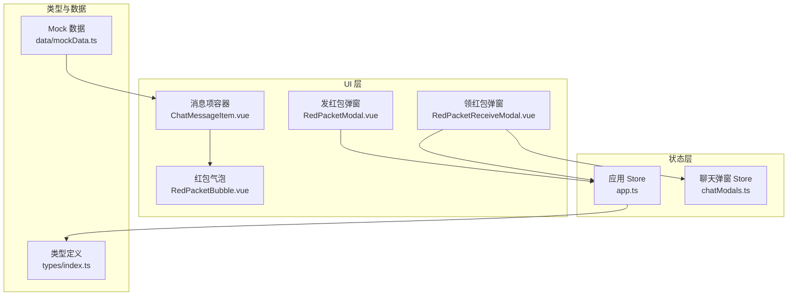
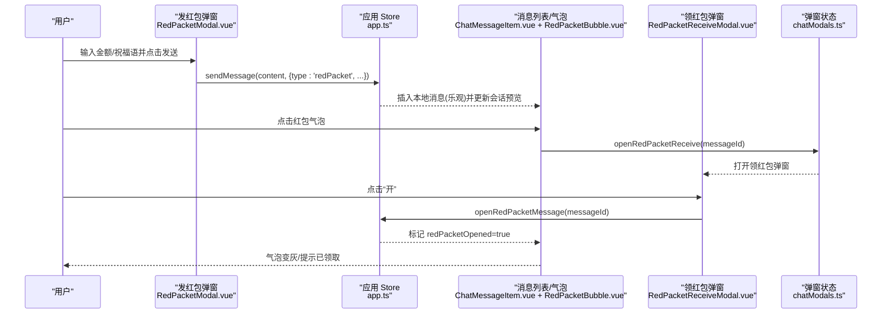
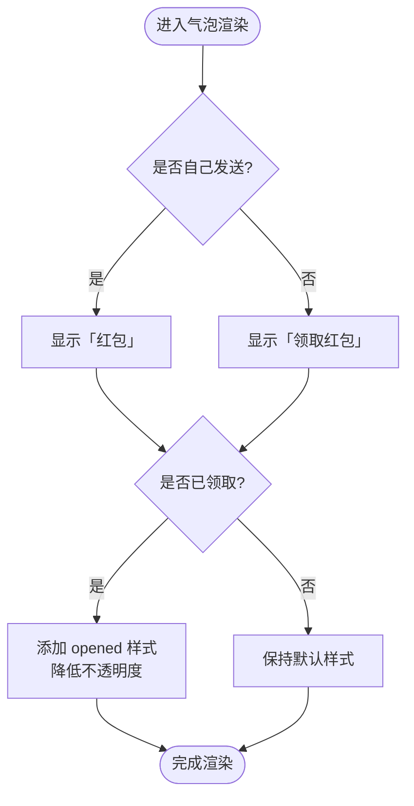
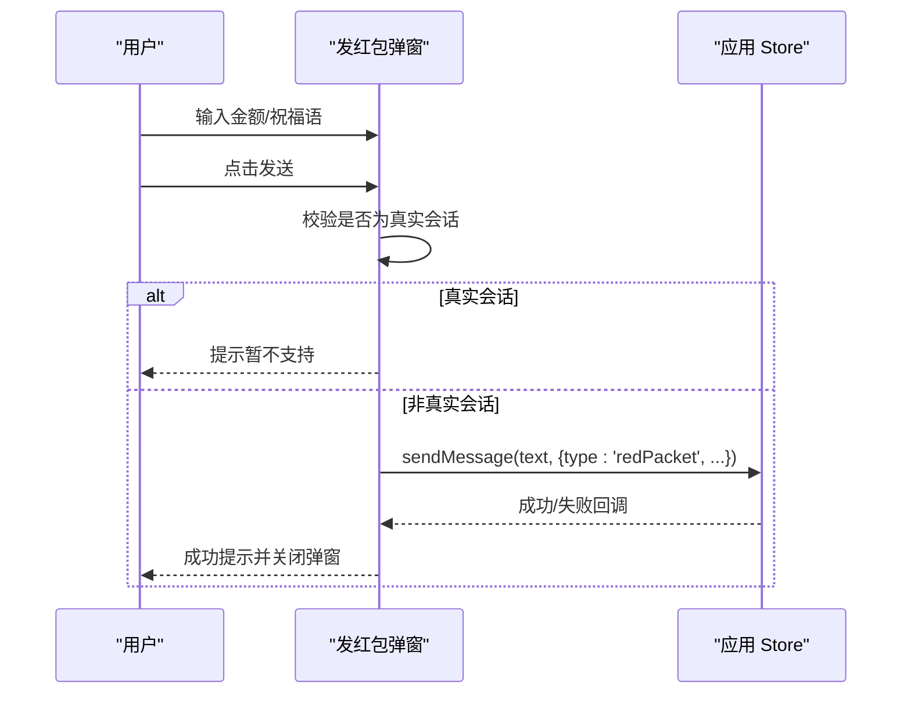
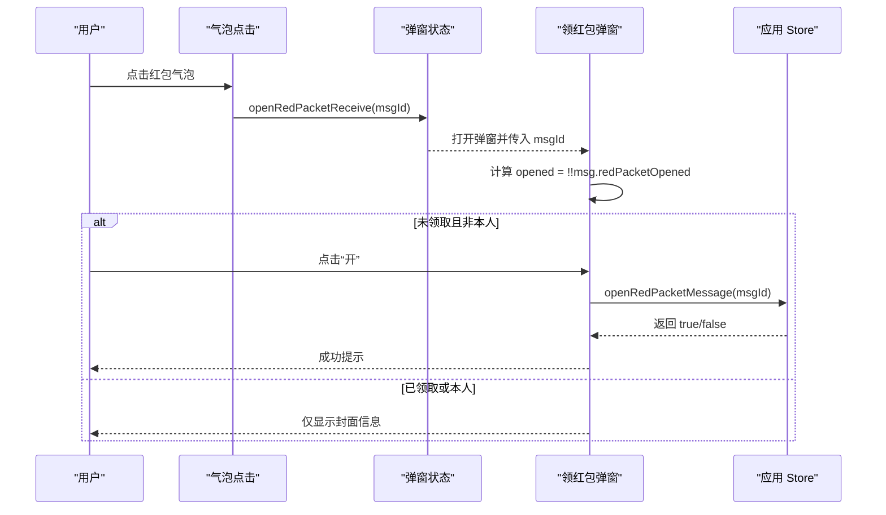
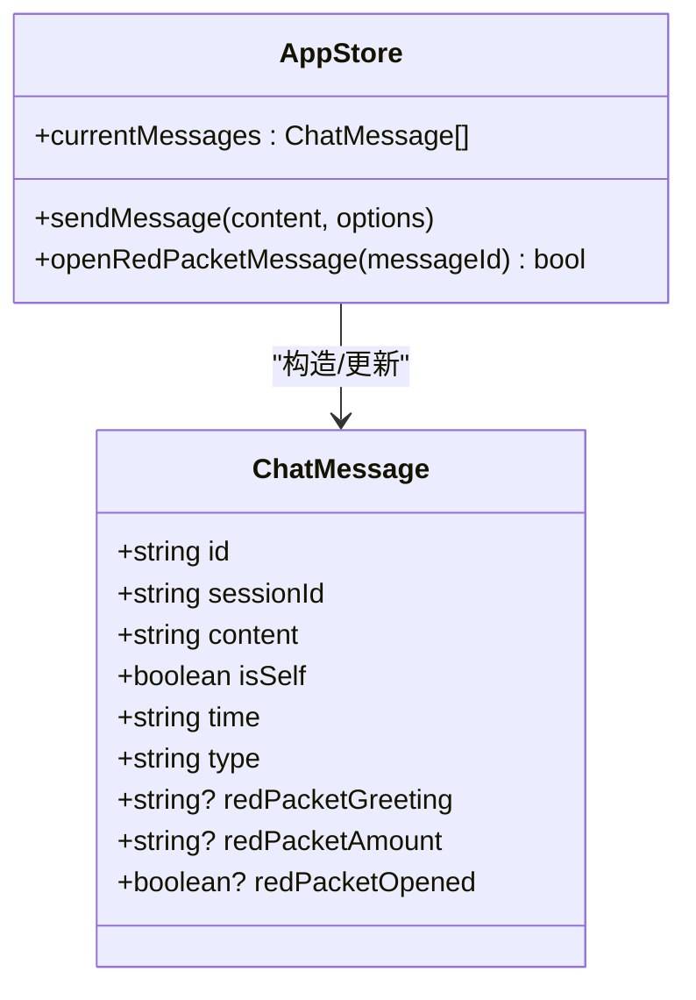
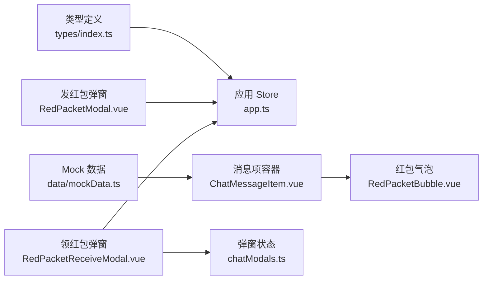

# 红包消息气泡

<cite>
**本文引用的文件**   
- [RedPacketBubble.vue](file://linkx-client/src/components/chat/bubbles/RedPacketBubble.vue)
- [RedPacketModal.vue](file://linkx-client/src/components/chat/RedPacketModal.vue)
- [RedPacketReceiveModal.vue](file://linkx-client/src/components/chat/RedPacketReceiveModal.vue)
- [ChatMessageItem.vue](file://linkx-client/src/components/chat/ChatMessageItem.vue)
- [app.ts](file://linkx-client/src/stores/app.ts)
- [chatModals.ts](file://linkx-client/src/stores/chatModals.ts)
- [index.ts](file://linkx-client/src/types/index.ts)
- [mockData.ts](file://linkx-client/src/data/mockData.ts)
</cite>

## 目录
1. [简介](#简介)
2. [项目结构](#项目结构)
3. [核心组件](#核心组件)
4. [架构总览](#架构总览)
5. [详细组件分析](#详细组件分析)
6. [依赖关系分析](#依赖关系分析)
7. [性能与体验优化](#性能与体验优化)
8. [故障排查指南](#故障排查指南)
9. [结论](#结论)
10. [附录：扩展与自定义](#附录扩展与自定义)

## 简介
本文件面向 LinkX 前端工程中的“红包消息气泡”能力，系统性说明红包消息的数据模型、展示与交互流程、动画与样式、状态管理与业务规则。内容覆盖：
- 红包数据结构与字段含义
- 发送红包的 UI 弹窗与校验逻辑
- 领取红包的弹窗、点击流程与状态更新
- 气泡渲染与已领取视觉反馈
- 会话预览文案与消息列表集成
- 可扩展点与自定义建议（样式、类型、业务规则）

## 项目结构
红包功能涉及以下关键文件与职责：
- 气泡渲染：红包卡片在聊天消息项中按类型渲染
- 发送弹窗：输入金额与祝福语，提交后以红包类型消息发送
- 领取弹窗：根据当前会话的消息数据打开封面，点击“开”触发领取
- Store 层：负责消息构造、乐观插入、状态标记、会话预览文案生成
- 类型定义：统一 ChatMessage 的红包扩展字段
- Mock 数据：提供示例红包消息用于演示

图表来源
- [RedPacketBubble.vue:1-25](file://linkx-client/src/components/chat/bubbles/RedPacketBubble.vue#L1-L25)
- [RedPacketModal.vue:1-138](file://linkx-client/src/components/chat/RedPacketModal.vue#L1-L138)
- [RedPacketReceiveModal.vue:1-133](file://linkx-client/src/components/chat/RedPacketReceiveModal.vue#L1-L133)
- [ChatMessageItem.vue:160-175](file://linkx-client/src/components/chat/ChatMessageItem.vue#L160-L175)
- [app.ts:47-90](file://linkx-client/src/stores/app.ts#L47-L90)
- [app.ts:617-800](file://linkx-client/src/stores/app.ts#L617-L800)
- [app.ts:840-852](file://linkx-client/src/stores/app.ts#L840-L852)
- [chatModals.ts:134-151](file://linkx-client/src/stores/chatModals.ts#L134-L151)
- [index.ts:44-83](file://linkx-client/src/types/index.ts#L44-L83)
- [mockData.ts:160-170](file://linkx-client/src/data/mockData.ts#L160-L170)

章节来源
- [RedPacketBubble.vue:1-25](file://linkx-client/src/components/chat/bubbles/RedPacketBubble.vue#L1-L25)
- [RedPacketModal.vue:1-138](file://linkx-client/src/components/chat/RedPacketModal.vue#L1-L138)
- [RedPacketReceiveModal.vue:1-133](file://linkx-client/src/components/chat/RedPacketReceiveModal.vue#L1-L133)
- [ChatMessageItem.vue:160-175](file://linkx-client/src/components/chat/ChatMessageItem.vue#L160-L175)
- [app.ts:47-90](file://linkx-client/src/stores/app.ts#L47-L90)
- [app.ts:617-800](file://linkx-client/src/stores/app.ts#L617-L800)
- [app.ts:840-852](file://linkx-client/src/stores/app.ts#L840-L852)
- [chatModals.ts:134-151](file://linkx-client/src/stores/chatModals.ts#L134-L151)
- [index.ts:44-83](file://linkx-client/src/types/index.ts#L44-L83)
- [mockData.ts:160-170](file://linkx-client/src/data/mockData.ts#L160-L170)

## 核心组件
- 红包气泡 RedPacketBubble.vue
  - 根据消息对象渲染红包卡片；当 redPacketOpened 为真时降低不透明度，表示已领取
  - 显示祝福语或 fallback 文本；根据 isSelf 与 opened 状态切换提示文案
- 发红包弹窗 RedPacketModal.vue
  - 表单包含金额与祝福语；提交时调用 appStore.sendMessage，携带 type='redPacket' 及扩展字段
  - 真实会话限制：当前实现会阻止真实会话发送语音与红包
- 领红包弹窗 RedPacketReceiveModal.vue
  - 通过 chatModalsStore 控制开关与目标消息 id；从 appStore.currentMessages 定位红包消息
  - 未领取且非本人发送时显示“开”按钮；点击后调用 appStore.openRedPacketMessage 标记已领取并提示成功
- 消息项容器 ChatMessageItem.vue
  - 根据消息类型选择不同气泡组件；对红包类型使用红包气泡，并附带 opened 样式类
- Store 层 app.ts
  - sendMessageLocal/sendMessageReal 构建红包消息对象，设置 redPacketGreeting/redPacketAmount/redPacketOpened=false
  - messagePreview 针对红包类型生成会话预览文案
  - openRedPacketMessage 将指定消息标记为已领取
- 弹窗状态 chatModals.ts
  - 管理 redPacketOpen、redPacketReceiveOpen、redPacketReceiveMsgId 等开关与目标消息 id
- 类型定义 types/index.ts
  - ChatMessage 增加红包相关字段：redPacketGreeting、redPacketAmount、redPacketOpened
- Mock 数据 data/mockData.ts
  - 提供一条不可领取的他人红包消息样例，便于演示气泡与弹窗

章节来源
- [RedPacketBubble.vue:1-25](file://linkx-client/src/components/chat/bubbles/RedPacketBubble.vue#L1-L25)
- [RedPacketModal.vue:1-138](file://linkx-client/src/components/chat/RedPacketModal.vue#L1-L138)
- [RedPacketReceiveModal.vue:1-133](file://linkx-client/src/components/chat/RedPacketReceiveModal.vue#L1-L133)
- [ChatMessageItem.vue:160-175](file://linkx-client/src/components/chat/ChatMessageItem.vue#L160-L175)
- [app.ts:47-90](file://linkx-client/src/stores/app.ts#L47-L90)
- [app.ts:617-800](file://linkx-client/src/stores/app.ts#L617-L800)
- [app.ts:840-852](file://linkx-client/src/stores/app.ts#L840-L852)
- [chatModals.ts:134-151](file://linkx-client/src/stores/chatModals.ts#L134-L151)
- [index.ts:44-83](file://linkx-client/src/types/index.ts#L44-L83)
- [mockData.ts:160-170](file://linkx-client/src/data/mockData.ts#L160-L170)

## 架构总览
下图展示了红包消息从发送到领取的关键流程与组件协作关系。

图表来源
- [RedPacketModal.vue:38-56](file://linkx-client/src/components/chat/RedPacketModal.vue#L38-L56)
- [app.ts:617-800](file://linkx-client/src/stores/app.ts#L617-L800)
- [ChatMessageItem.vue:160-175](file://linkx-client/src/components/chat/ChatMessageItem.vue#L160-L175)
- [RedPacketBubble.vue:14-23](file://linkx-client/src/components/chat/bubbles/RedPacketBubble.vue#L14-L23)
- [chatModals.ts:144-151](file://linkx-client/src/stores/chatModals.ts#L144-L151)
- [RedPacketReceiveModal.vue:42-48](file://linkx-client/src/components/chat/RedPacketReceiveModal.vue#L42-L48)
- [app.ts:840-852](file://linkx-client/src/stores/app.ts#L840-L852)

## 详细组件分析

### 红包气泡 RedPacketBubble.vue
- 渲染逻辑
  - 外层容器根据 msg.isSelf 与 msg.redPacketOpened 动态绑定 class，已领取时降低不透明度
  - 标题优先使用红包祝福语，否则回退到 content
  - 副标题根据是否已领取与是否自己发送显示不同文案
- 样式要点
  - 使用 CSS 变量与主题体系保持一致
  - opened 类控制 opacity，形成“已领取”的视觉弱化效果

图表来源
- [RedPacketBubble.vue:14-23](file://linkx-client/src/components/chat/bubbles/RedPacketBubble.vue#L14-L23)
- [ChatMessageItem.vue:160-175](file://linkx-client/src/components/chat/ChatMessageItem.vue#L160-L175)

章节来源
- [RedPacketBubble.vue:1-25](file://linkx-client/src/components/chat/bubbles/RedPacketBubble.vue#L1-L25)
- [ChatMessageItem.vue:160-175](file://linkx-client/src/components/chat/ChatMessageItem.vue#L160-L175)

### 发红包弹窗 RedPacketModal.vue
- 交互流程
  - 打开弹窗后填写金额与祝福语
  - 点击“塞钱进红包”时进行基础校验：真实会话不支持红包，直接提示并返回
  - 调用 appStore.sendMessage，传入 type='redPacket' 与扩展字段
- 错误处理
  - 真实会话拦截：抛出错误并由上层捕获提示
  - 发送失败：catch 分支提示失败

图表来源
- [RedPacketModal.vue:38-56](file://linkx-client/src/components/chat/RedPacketModal.vue#L38-L56)
- [app.ts:617-635](file://linkx-client/src/stores/app.ts#L617-L635)

章节来源
- [RedPacketModal.vue:1-138](file://linkx-client/src/components/chat/RedPacketModal.vue#L1-L138)
- [app.ts:617-635](file://linkx-client/src/stores/app.ts#L617-L635)

### 领红包弹窗 RedPacketReceiveModal.vue
- 数据来源
  - 通过 chatModalsStore 获取 redPacketReceiveOpen 与 redPacketReceiveMsgId
  - 从 appStore.currentMessages 查找对应消息
- 交互流程
  - 若未领取且非本人发送，显示“开”按钮
  - 点击“开”后调用 appStore.openRedPacketMessage 标记已领取，并弹出成功提示
- 状态计算
  - opened 由 computed 派生自消息的 redPacketOpened 字段

图表来源
- [chatModals.ts:144-151](file://linkx-client/src/stores/chatModals.ts#L144-L151)
- [RedPacketReceiveModal.vue:28-48](file://linkx-client/src/components/chat/RedPacketReceiveModal.vue#L28-L48)
- [app.ts:840-852](file://linkx-client/src/stores/app.ts#L840-L852)

章节来源
- [RedPacketReceiveModal.vue:1-133](file://linkx-client/src/components/chat/RedPacketReceiveModal.vue#L1-L133)
- [chatModals.ts:134-151](file://linkx-client/src/stores/chatModals.ts#L134-L151)
- [app.ts:840-852](file://linkx-client/src/stores/app.ts#L840-L852)

### 消息项容器 ChatMessageItem.vue
- 红包气泡的挂载点
  - 根据消息 type 选择不同气泡组件
  - 对红包类型传递 opened 样式类，配合气泡内部样式呈现已领取态

章节来源
- [ChatMessageItem.vue:160-175](file://linkx-client/src/components/chat/ChatMessageItem.vue#L160-L175)

### 状态与业务逻辑（app.ts）
- 发送路径
  - sendMessageLocal/sendMessageReal 均支持 type='redPacket'，并在构造消息时填充红包扩展字段
  - 会话预览文案 messagePreview 对红包类型生成特定摘要
- 领取路径
  - openRedPacketMessage 在当前会话消息中定位目标消息，确保类型为红包且未领取，然后置为已领取

图表来源
- [app.ts:617-800](file://linkx-client/src/stores/app.ts#L617-L800)
- [app.ts:840-852](file://linkx-client/src/stores/app.ts#L840-L852)
- [index.ts:44-83](file://linkx-client/src/types/index.ts#L44-L83)

章节来源
- [app.ts:47-90](file://linkx-client/src/stores/app.ts#L47-L90)
- [app.ts:617-800](file://linkx-client/src/stores/app.ts#L617-L800)
- [app.ts:840-852](file://linkx-client/src/stores/app.ts#L840-L852)
- [index.ts:44-83](file://linkx-client/src/types/index.ts#L44-L83)

### 数据类型与示例数据
- ChatMessage 红包字段
  - redPacketGreeting：红包祝福语
  - redPacketAmount：红包金额（字符串形式）
  - redPacketOpened：是否已领取
- Mock 数据
  - 提供一条来自他人的红包消息，用于演示气泡与领取弹窗

章节来源
- [index.ts:44-83](file://linkx-client/src/types/index.ts#L44-L83)
- [mockData.ts:160-170](file://linkx-client/src/data/mockData.ts#L160-L170)

## 依赖关系分析
- 组件依赖
  - RedPacketBubble.vue 依赖 ChatMessageItem.vue 的样式与类型上下文
  - RedPacketModal.vue 与 RedPacketReceiveModal.vue 依赖 app.ts 与 chatModals.ts
- Store 依赖
  - app.ts 提供消息构造、预览文案与状态更新
  - chatModals.ts 集中管理弹窗开关与目标消息 id
- 类型与数据
  - types/index.ts 定义 ChatMessage 红包字段
  - mockData.ts 提供示例红包消息

图表来源
- [index.ts:44-83](file://linkx-client/src/types/index.ts#L44-L83)
- [app.ts:617-800](file://linkx-client/src/stores/app.ts#L617-L800)
- [mockData.ts:160-170](file://linkx-client/src/data/mockData.ts#L160-L170)
- [ChatMessageItem.vue:160-175](file://linkx-client/src/components/chat/ChatMessageItem.vue#L160-L175)
- [RedPacketBubble.vue:1-25](file://linkx-client/src/components/chat/bubbles/RedPacketBubble.vue#L1-L25)
- [RedPacketModal.vue:1-138](file://linkx-client/src/components/chat/RedPacketModal.vue#L1-L138)
- [RedPacketReceiveModal.vue:1-133](file://linkx-client/src/components/chat/RedPacketReceiveModal.vue#L1-L133)
- [chatModals.ts:134-151](file://linkx-client/src/stores/chatModals.ts#L134-L151)

章节来源
- [index.ts:44-83](file://linkx-client/src/types/index.ts#L44-L83)
- [app.ts:617-800](file://linkx-client/src/stores/app.ts#L617-L800)
- [mockData.ts:160-170](file://linkx-client/src/data/mockData.ts#L160-L170)
- [ChatMessageItem.vue:160-175](file://linkx-client/src/components/chat/ChatMessageItem.vue#L160-L175)
- [RedPacketBubble.vue:1-25](file://linkx-client/src/components/chat/bubbles/RedPacketBubble.vue#L1-L25)
- [RedPacketModal.vue:1-138](file://linkx-client/src/components/chat/RedPacketModal.vue#L1-L138)
- [RedPacketReceiveModal.vue:1-133](file://linkx-client/src/components/chat/RedPacketReceiveModal.vue#L1-L133)
- [chatModals.ts:134-151](file://linkx-client/src/stores/chatModals.ts#L134-L151)

## 性能与体验优化
- 渲染性能
  - 红包气泡结构简单，无复杂计算，开销极低
  - 已领取状态通过 CSS opacity 表现，避免重排重绘
- 交互体验
  - 发送前对真实会话进行快速拦截，减少无效请求
  - 领取成功后即时更新状态，气泡立即呈现“已领取”视觉效果
- 可优化方向
  - 如需更丰富的动画，可在气泡容器上叠加过渡动画（如缩放、淡入），注意移动端性能
  - 对于大量历史消息场景，可对红包气泡做懒加载或虚拟滚动优化

[本节为通用指导，无需源码引用]

## 故障排查指南
- 真实会话无法发送红包
  - 现象：点击发送后提示“真实会话暂不支持红包”
  - 原因：app.ts 中对真实会话的语音与红包类型做了限制
  - 解决：如需支持，需在 app.ts 的发送逻辑中放开限制并补充后端协议
- 领取后未生效
  - 现象：点击“开”后气泡仍显示未领取
  - 排查：确认 openRedPacketMessage 是否被调用、目标消息是否存在且类型为红包、是否已被标记为已领取
- 弹窗无法打开
  - 现象：点击气泡无反应
  - 排查：检查 chatModalsStore 的 openRedPacketReceive 是否被触发、redPacketReceiveMsgId 是否正确、当前会话消息中是否存在该 id

章节来源
- [app.ts:617-635](file://linkx-client/src/stores/app.ts#L617-L635)
- [app.ts:840-852](file://linkx-client/src/stores/app.ts#L840-L852)
- [chatModals.ts:144-151](file://linkx-client/src/stores/chatModals.ts#L144-L151)

## 结论
LinkX 的红包消息气泡实现了从发送、展示到领取的完整闭环。其核心在于：
- 统一的 ChatMessage 红包字段定义
- 简洁清晰的组件分层：气泡、发送弹窗、领取弹窗
- Store 层的消息构造与状态更新
- 基于 CSS 的轻量视觉反馈

当前版本在真实会话中限制了红包发送，属于业务策略。后续可按需扩展至服务端协议与持久化存储。

[本节为总结性内容，无需源码引用]

## 附录：扩展与自定义
- 样式自定义
  - 修改红包气泡的容器样式与 opened 类的 opacity，即可调整外观与已领取态
  - 参考路径：[ChatMessageItem.vue:160-175](file://linkx-client/src/components/chat/ChatMessageItem.vue#L160-L175)、[RedPacketBubble.vue:14-23](file://linkx-client/src/components/chat/bubbles/RedPacketBubble.vue#L14-L23)
- 类型扩展
  - 在 ChatMessage 中新增红包扩展字段（如领取时间、领取人列表等），并在发送与领取逻辑中同步维护
  - 参考路径：[index.ts:44-83](file://linkx-client/src/types/index.ts#L44-L83)
- 业务规则扩展
  - 移除真实会话限制：在 app.ts 的发送逻辑中放开对 redPacket 的限制，并对接后端 WebSocket 协议
  - 引入服务端领取记录：在 openRedPacketMessage 处增加网络请求，落库后再更新本地状态
  - 参考路径：[app.ts:617-635](file://linkx-client/src/stores/app.ts#L617-L635)、[app.ts:840-852](file://linkx-client/src/stores/app.ts#L840-L852)
- 动画增强
  - 在气泡容器上添加 CSS transition 或 Vue 过渡，实现打开/领取时的动效
  - 建议在移动端谨慎使用复杂动画，保证流畅度

章节来源
- [ChatMessageItem.vue:160-175](file://linkx-client/src/components/chat/ChatMessageItem.vue#L160-L175)
- [RedPacketBubble.vue:14-23](file://linkx-client/src/components/chat/bubbles/RedPacketBubble.vue#L14-L23)
- [index.ts:44-83](file://linkx-client/src/types/index.ts#L44-L83)
- [app.ts:617-635](file://linkx-client/src/stores/app.ts#L617-L635)
- [app.ts:840-852](file://linkx-client/src/stores/app.ts#L840-L852)