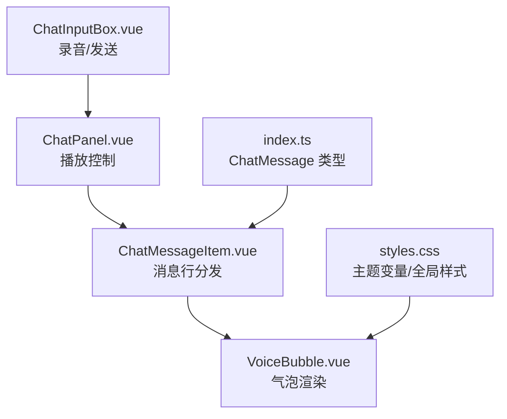
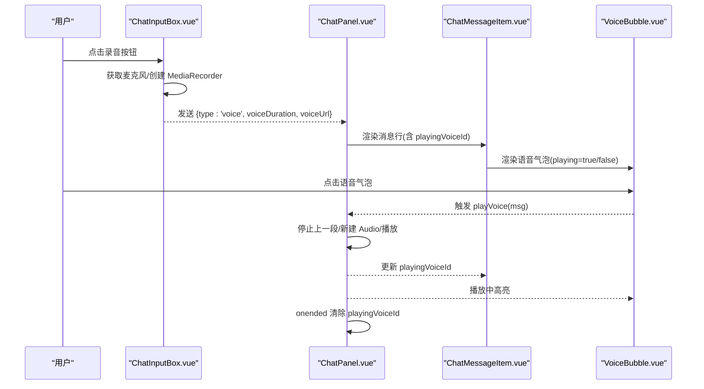
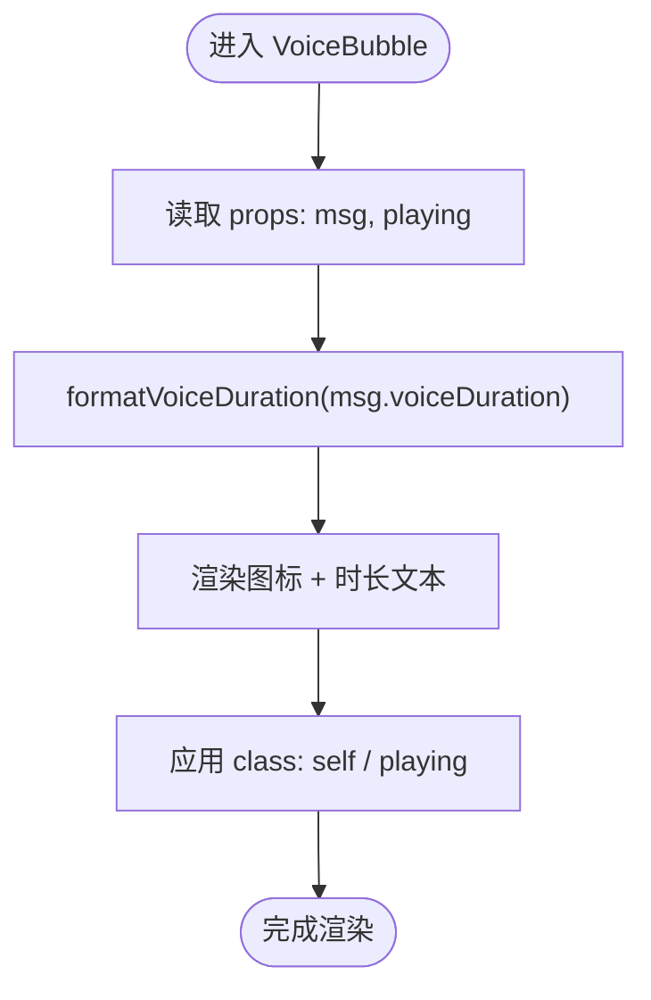
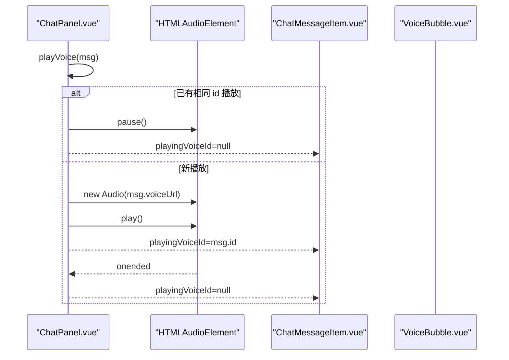
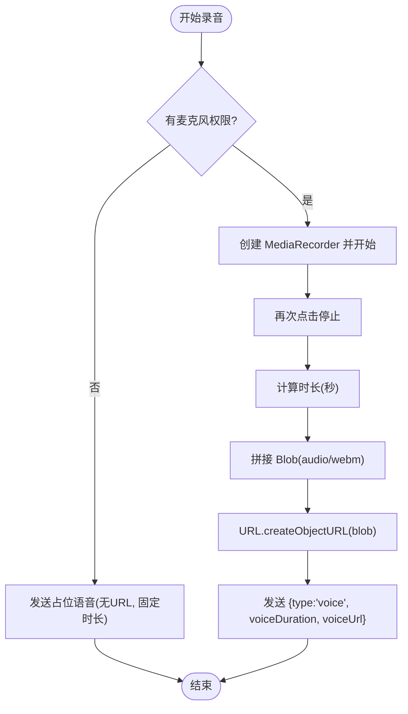
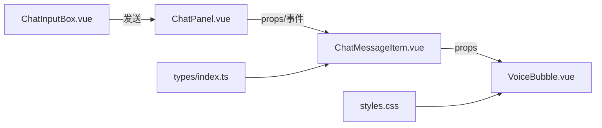

# 语音消息气泡

<cite>
**本文引用的文件**   
- [VoiceBubble.vue](file://linkx-client/src/components/chat/bubbles/VoiceBubble.vue)
- [ChatMessageItem.vue](file://linkx-client/src/components/chat/ChatMessageItem.vue)
- [ChatPanel.vue](file://linkx-client/src/components/ChatPanel.vue)
- [ChatInputBox.vue](file://linkx-client/src/components/chat/ChatInputBox.vue)
- [index.ts（类型定义）](file://linkx-client/src/types/index.ts)
- [chat.ts（聊天类型与协议）](file://linkx-client/src/types/chat.ts)
- [styles.css（全局样式与主题变量）](file://linkx-client/src/assets/styles.css)
</cite>

## 目录
1. [简介](#简介)
2. [项目结构](#项目结构)
3. [核心组件](#核心组件)
4. [架构总览](#架构总览)
5. [详细组件分析](#详细组件分析)
6. [依赖关系分析](#依赖关系分析)
7. [性能考虑](#性能考虑)
8. [故障排查指南](#故障排查指南)
9. [结论](#结论)
10. [附录：配置与自定义](#附录：配置与自定义)

## 简介
本文件为 LinkX 语音消息气泡组件的实现文档，聚焦以下能力：
- 录制：基于浏览器媒体 API 的录音、时长计算与降级策略
- 播放：单例音频实例管理、播放/暂停切换、结束清理
- 进度控制：当前播放态高亮、播放结束状态复位
- 波形显示：当前实现未内置波形绘制，提供扩展点与实现建议
- 上传下载：本地 Blob URL 发送；远程 URL 播放路径
- 错误恢复：权限失败降级、播放异常提示、资源释放
- 自定义样式与行为：通过 CSS 变量与组件 props 进行外观与交互定制

## 项目结构
语音消息相关的前端代码主要分布在以下位置：
- 气泡展示：bubbles/VoiceBubble.vue
- 消息行分发：components/chat/ChatMessageItem.vue
- 播放控制：components/ChatPanel.vue
- 录制与发送：components/chat/ChatInputBox.vue
- 数据模型：types/index.ts、types/chat.ts
- 样式与主题：assets/styles.css

图表来源
- [ChatInputBox.vue:284-350](file://linkx-client/src/components/chat/ChatInputBox.vue#L284-L350)
- [ChatPanel.vue:212-229](file://linkx-client/src/components/ChatPanel.vue#L212-L229)
- [ChatMessageItem.vue:82-89](file://linkx-client/src/components/chat/ChatMessageItem.vue#L82-L89)
- [VoiceBubble.vue:1-33](file://linkx-client/src/components/chat/bubbles/VoiceBubble.vue#L1-L33)
- [index.ts:44-83](file://linkx-client/src/types/index.ts#L44-L83)
- [styles.css:1-112](file://linkx-client/src/assets/styles.css#L1-L112)

章节来源
- [ChatInputBox.vue:284-350](file://linkx-client/src/components/chat/ChatInputBox.vue#L284-L350)
- [ChatPanel.vue:212-229](file://linkx-client/src/components/ChatPanel.vue#L212-L229)
- [ChatMessageItem.vue:82-89](file://linkx-client/src/components/chat/ChatMessageItem.vue#L82-L89)
- [VoiceBubble.vue:1-33](file://linkx-client/src/components/chat/bubbles/VoiceBubble.vue#L1-L33)
- [index.ts:44-83](file://linkx-client/src/types/index.ts#L44-L83)
- [styles.css:1-112](file://linkx-client/src/assets/styles.css#L1-L112)

## 核心组件
- VoiceBubble.vue：负责语音气泡的图标与时长显示，并在播放中附加 playing 类以高亮。
- ChatMessageItem.vue：根据消息 type 分发到对应气泡子组件，并透传点击事件与播放态。
- ChatPanel.vue：维护单一 HTMLAudioElement 实例，处理播放/暂停、结束回调与卸载清理。
- ChatInputBox.vue：实现录音流程（MediaRecorder）、时长计算、Blob URL 生成与发送；无权限时降级发送占位语音。
- 类型定义：ChatMessage 包含 voiceDuration、voiceUrl 等字段，用于驱动 UI 与播放逻辑。
- 样式：全局 CSS 变量与气泡基础样式，支持明暗主题与 accent 色高亮。

章节来源
- [VoiceBubble.vue:1-33](file://linkx-client/src/components/chat/bubbles/VoiceBubble.vue#L1-L33)
- [ChatMessageItem.vue:82-89](file://linkx-client/src/components/chat/ChatMessageItem.vue#L82-L89)
- [ChatPanel.vue:212-229](file://linkx-client/src/components/ChatPanel.vue#L212-L229)
- [ChatInputBox.vue:284-350](file://linkx-client/src/components/chat/ChatInputBox.vue#L284-L350)
- [index.ts:44-83](file://linkx-client/src/types/index.ts#L44-L83)
- [styles.css:124-175](file://linkx-client/src/assets/styles.css#L124-L175)

## 架构总览
语音消息在“录制—发送—展示—播放”链路中的职责划分如下：
- 录制与发送：ChatInputBox.vue 使用 MediaRecorder 采集音频，生成 audio/webm Blob，构造 voiceUrl 并通过 sendMessage 发送。
- 展示：ChatMessageItem.vue 将 type=voice 的消息交由 VoiceBubble.vue 渲染，传入 playing 标志控制高亮。
- 播放：ChatPanel.vue 持有唯一 Audio 实例，按消息 id 切换播放/暂停，结束时清除 playing 状态。
- 数据模型：ChatMessage.voiceDuration、voiceUrl 驱动 UI 与播放源。
- 样式：VoiceBubble.vue 结合 .voice-bubble.playing 与主题变量实现高亮。

图表来源
- [ChatInputBox.vue:284-350](file://linkx-client/src/components/chat/ChatInputBox.vue#L284-L350)
- [ChatPanel.vue:212-229](file://linkx-client/src/components/ChatPanel.vue#L212-L229)
- [ChatMessageItem.vue:82-89](file://linkx-client/src/components/chat/ChatMessageItem.vue#L82-L89)
- [VoiceBubble.vue:26-32](file://linkx-client/src/components/chat/bubbles/VoiceBubble.vue#L26-L32)

## 详细组件分析

### 语音气泡 VoiceBubble.vue
- 功能要点
  - 接收 msg 与 playing 两个 props，渲染麦克风图标与格式化后的时长。
  - 模板中通过 :class="{ self: msg.isSelf, playing }" 控制自身侧与播放态样式。
  - 时长格式化：小于 60 秒显示 “秒”，否则显示 “分'秒"”。
- 可访问性与交互
  - 作为可点击气泡，由父级 ChatMessageItem.vue 转发 click 至 ChatPanel.vue 的 playVoice。
- 可扩展点
  - 可在模板内追加波形容器与 Canvas/SVG 绘制节点，配合父级传入的 currentTime/totalTime 实现进度条与波形同步。

图表来源
- [VoiceBubble.vue:12-23](file://linkx-client/src/components/chat/bubbles/VoiceBubble.vue#L12-L23)
- [VoiceBubble.vue:26-32](file://linkx-client/src/components/chat/bubbles/VoiceBubble.vue#L26-L32)

章节来源
- [VoiceBubble.vue:1-33](file://linkx-client/src/components/chat/bubbles/VoiceBubble.vue#L1-L33)

### 消息行 ChatMessageItem.vue
- 功能要点
  - 根据 msg.type 分发到 FileBubble/ImageBubble/VoiceBubble/RedPacketBubble/DataCardBubble/TextBubble。
  - 对 voice 类型，传入 :playing="playingVoiceId === msg.id"，并将 @click 映射为 @play-voice。
- 设计模式
  - 条件渲染 + 事件透传，保持气泡组件纯展示与低耦合。

章节来源
- [ChatMessageItem.vue:82-89](file://linkx-client/src/components/chat/ChatMessageItem.vue#L82-L89)

### 播放控制 ChatPanel.vue
- 功能要点
  - 使用局部变量 voiceAudio 保存当前播放的 HTMLAudioElement 实例，保证同一时间仅播放一条语音。
  - playVoice(msg)：若无 voiceUrl 则提示时长；若已正在播放同一条则暂停；否则停止上一条并新建 Audio 播放。
  - onended 回调中清除 playingVoiceId，使气泡回到非播放态。
  - onUnmounted 中确保组件销毁时停止播放，避免后台继续发声。
- 交互细节
  - 通过 playingVoiceId 向子组件传递播放态，驱动 VoiceBubble.vue 的高亮样式。

图表来源
- [ChatPanel.vue:212-229](file://linkx-client/src/components/ChatPanel.vue#L212-L229)
- [ChatPanel.vue:243-245](file://linkx-client/src/components/ChatPanel.vue#L243-L245)

章节来源
- [ChatPanel.vue:212-229](file://linkx-client/src/components/ChatPanel.vue#L212-L229)
- [ChatPanel.vue:243-245](file://linkx-client/src/components/ChatPanel.vue#L243-L245)

### 录制与发送 ChatInputBox.vue
- 功能要点
  - toggleVoiceRecord()：首次点击尝试 getUserMedia + MediaRecorder.start；再次点击 stop 并组装 Blob(audio/webm)，生成 Object URL 作为 voiceUrl 发送。
  - 时长计算：recordStart 记录开始时间，stop 时取差值四舍五入为秒，最小为 1 秒。
  - 权限失败降级：捕获异常后发送无 voiceUrl 的占位语音（固定时长），并提示成功。
  - 资源释放：onUnmounted 停止所有轨道，避免占用设备。
- 数据流
  - 发送 payload 包含 type='voice'、voiceDuration、voiceUrl（可选）。

图表来源
- [ChatInputBox.vue:284-350](file://linkx-client/src/components/chat/ChatInputBox.vue#L284-L350)
- [ChatInputBox.vue:104-106](file://linkx-client/src/components/chat/ChatInputBox.vue#L104-L106)

章节来源
- [ChatInputBox.vue:284-350](file://linkx-client/src/components/chat/ChatInputBox.vue#L284-L350)
- [ChatInputBox.vue:104-106](file://linkx-client/src/components/chat/ChatInputBox.vue#L104-L106)

### 数据模型与协议
- ChatMessage（类型定义）
  - 关键字段：type、voiceDuration、voiceUrl、isSelf 等，驱动气泡渲染与播放逻辑。
- 协议与载荷（chat.ts）
  - WsSendPayload 与 WsIncomingFrame 定义了消息发送与接收的结构，当前语音类型未在 ws 载荷中显式声明，但前端发送与展示均围绕 ChatMessage 进行。

章节来源
- [index.ts:44-83](file://linkx-client/src/types/index.ts#L44-L83)
- [chat.ts:37-54](file://linkx-client/src/types/chat.ts#L37-L54)

### 样式与主题
- 全局变量
  - styles.css 定义 --lx-accent、--lx-bg-card 等设计令牌，支持明暗主题切换。
- 气泡样式
  - .qq-bubble 基础样式、.voice-bubble 布局与间距、.voice-bubble.playing 高亮色。
- 自定义建议
  - 通过覆盖 CSS 变量或新增 class 实现不同尺寸、圆角、阴影与动效。

章节来源
- [styles.css:1-112](file://linkx-client/src/assets/styles.css#L1-L112)
- [ChatMessageItem.vue:162-164](file://linkx-client/src/components/chat/ChatMessageItem.vue#L162-L164)

## 依赖关系分析
- 组件耦合
  - ChatMessageItem.vue 依赖 VoiceBubble.vue 进行渲染，同时依赖 ChatPanel.vue 提供的 playingVoiceId 与 playVoice 事件。
  - ChatPanel.vue 不直接依赖 VoiceBubble.vue，通过 props 与事件解耦。
  - ChatInputBox.vue 独立于播放逻辑，仅负责录制与发送。
- 外部依赖
  - 浏览器 API：navigator.mediaDevices.getUserMedia、MediaRecorder、HTMLAudioElement。
  - Vue/Pinia：响应式状态与组合式 API。
- 潜在循环依赖
  - 当前未见循环引用，组件间通过事件与 props 单向通信。

图表来源
- [ChatInputBox.vue:284-350](file://linkx-client/src/components/chat/ChatInputBox.vue#L284-L350)
- [ChatPanel.vue:212-229](file://linkx-client/src/components/ChatPanel.vue#L212-L229)
- [ChatMessageItem.vue:82-89](file://linkx-client/src/components/chat/ChatMessageItem.vue#L82-L89)
- [VoiceBubble.vue:1-33](file://linkx-client/src/components/chat/bubbles/VoiceBubble.vue#L1-L33)
- [index.ts:44-83](file://linkx-client/src/types/index.ts#L44-L83)
- [styles.css:124-175](file://linkx-client/src/assets/styles.css#L124-L175)

## 性能考虑
- 单例音频实例
  - 使用单一 HTMLAudioElement 避免并发播放导致的资源竞争与卡顿。
- 对象 URL 生命周期
  - 录音生成的 Object URL 仅在会话内有效，建议在合适时机释放（如离开页面或会话切换时）。
- 长语音优化
  - 对于超长语音，建议增加分段加载或懒加载策略，减少首帧延迟。
- 波形绘制
  - 如需波形，建议使用离线解码（AudioContext.decodeAudioData）或后端预生成频谱数据，避免主线程阻塞。

[本节为通用指导，无需源码引用]

## 故障排查指南
- 无法播放语音
  - 现象：控制台报错或提示“无法播放语音”。
  - 排查：检查 voiceUrl 是否有效、网络可达性、浏览器自动播放策略限制。
  - 参考：[ChatPanel.vue:212-229](file://linkx-client/src/components/ChatPanel.vue#L212-L229)
- 录音权限被拒绝
  - 现象：点击录音无反应或提示失败。
  - 处理：当前实现会降级发送占位语音；请引导用户授权麦克风。
  - 参考：[ChatInputBox.vue:284-350](file://linkx-client/src/components/chat/ChatInputBox.vue#L284-L350)
- 录音结束后仍占用麦克风
  - 现象：其他应用无法使用麦克风。
  - 处理：确认 onUnmounted 中已停止所有轨道；必要时主动调用 stopTracks。
  - 参考：[ChatInputBox.vue:104-106](file://linkx-client/src/components/chat/ChatInputBox.vue#L104-L106)
- 播放态不同步
  - 现象：气泡高亮与实际播放不一致。
  - 处理：检查 playingVoiceId 是否在 onended 中正确清空，以及重复点击是否执行了 pause。
  - 参考：[ChatPanel.vue:212-229](file://linkx-client/src/components/ChatPanel.vue#L212-L229)

章节来源
- [ChatPanel.vue:212-229](file://linkx-client/src/components/ChatPanel.vue#L212-L229)
- [ChatInputBox.vue:284-350](file://linkx-client/src/components/chat/ChatInputBox.vue#L284-L350)
- [ChatInputBox.vue:104-106](file://linkx-client/src/components/chat/ChatInputBox.vue#L104-L106)

## 结论
当前语音消息气泡实现了基础的录制、发送与播放闭环，具备清晰的组件边界与良好的解耦。后续可在以下方向增强：
- 进度控制：在父级维护 currentTime/totalTime，向下传递给 VoiceBubble 实现进度条与波形同步。
- 波形显示：引入 Web Audio API 或后端频谱图，提升可视化体验。
- 上传下载：对接服务端存储，将本地 Blob URL 替换为持久化 URL，并提供断点续传与重试。
- 错误恢复：完善网络异常、格式不支持、跨域等场景的用户提示与回退策略。

[本节为总结性内容，无需源码引用]

## 附录：配置与自定义
- 外观定制
  - 通过 CSS 变量调整主题色、圆角、阴影与背景。
  - 修改 .voice-bubble 与 .voice-bubble.playing 的样式以改变图标颜色与高亮效果。
- 行为配置
  - 在 ChatPanel.vue 中扩展 playVoice 逻辑，接入统一的播放器服务或第三方播放器。
  - 在 ChatInputBox.vue 中调整录音格式（audio/webm）与时长阈值。
- 扩展点
  - 在 VoiceBubble.vue 中插入波形容器与 Canvas/SVG，配合父级传入的进度状态实现可视化。
  - 在 ChatMessageItem.vue 中增加长按操作（复制、删除、转发等）以丰富交互。

章节来源
- [styles.css:1-112](file://linkx-client/src/assets/styles.css#L1-L112)
- [ChatMessageItem.vue:162-164](file://linkx-client/src/components/chat/ChatMessageItem.vue#L162-L164)
- [ChatPanel.vue:212-229](file://linkx-client/src/components/ChatPanel.vue#L212-L229)
- [ChatInputBox.vue:284-350](file://linkx-client/src/components/chat/ChatInputBox.vue#L284-L350)
- [VoiceBubble.vue:1-33](file://linkx-client/src/components/chat/bubbles/VoiceBubble.vue#L1-L33)