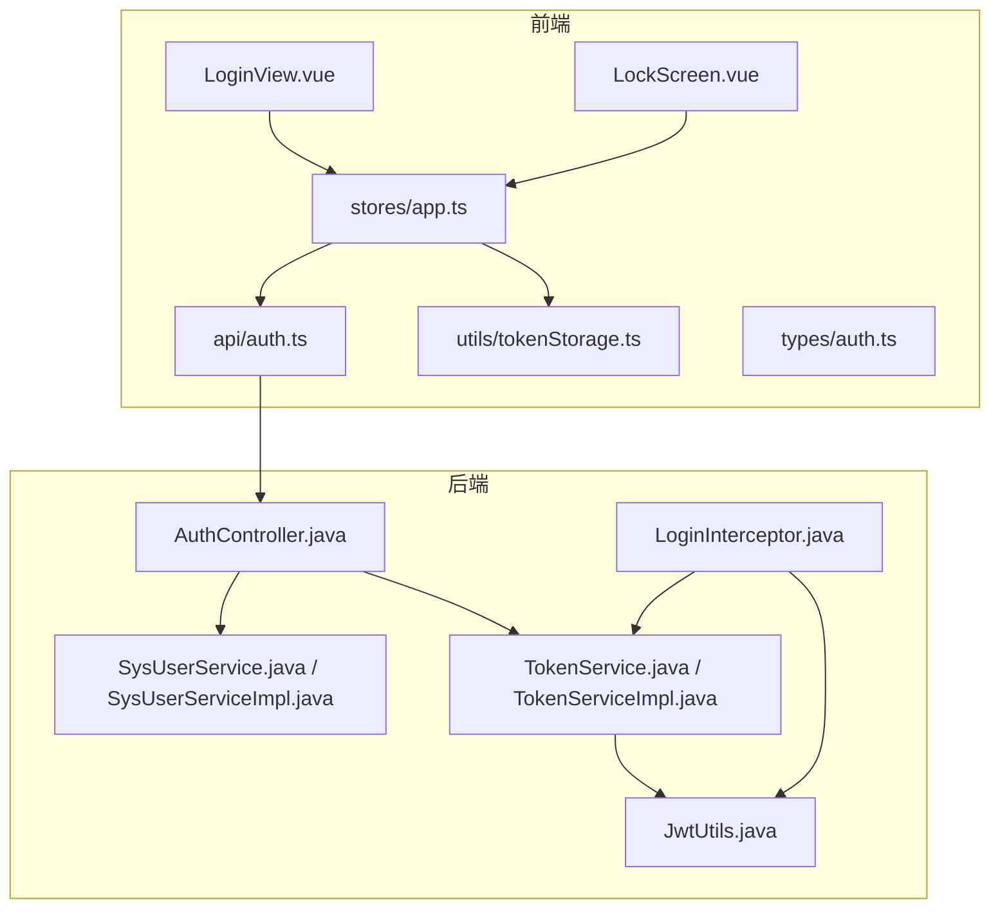
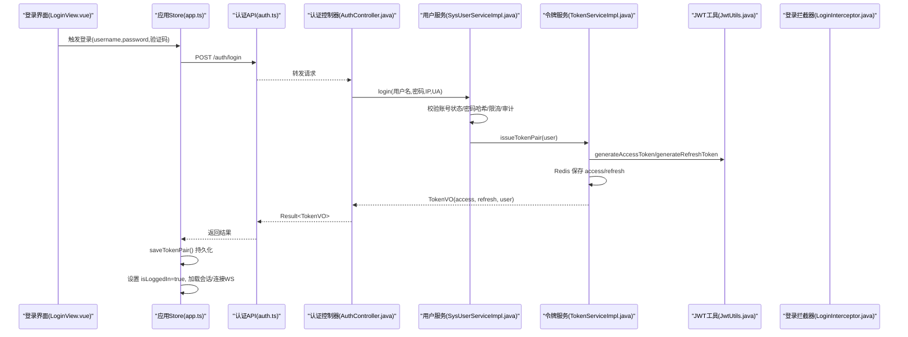
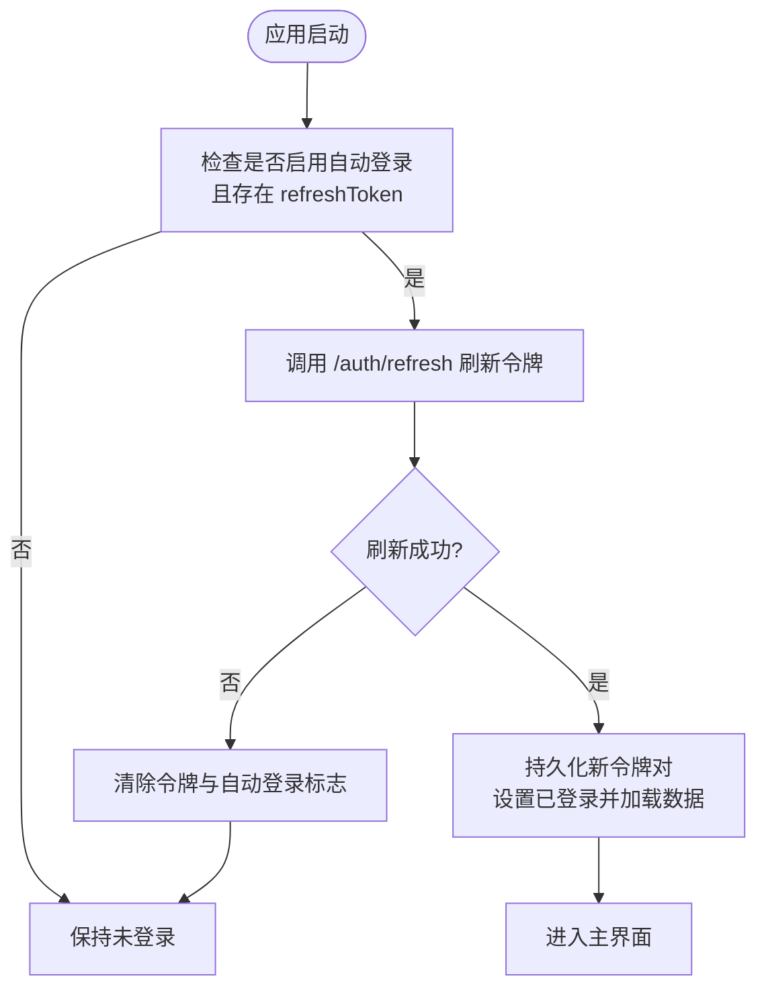
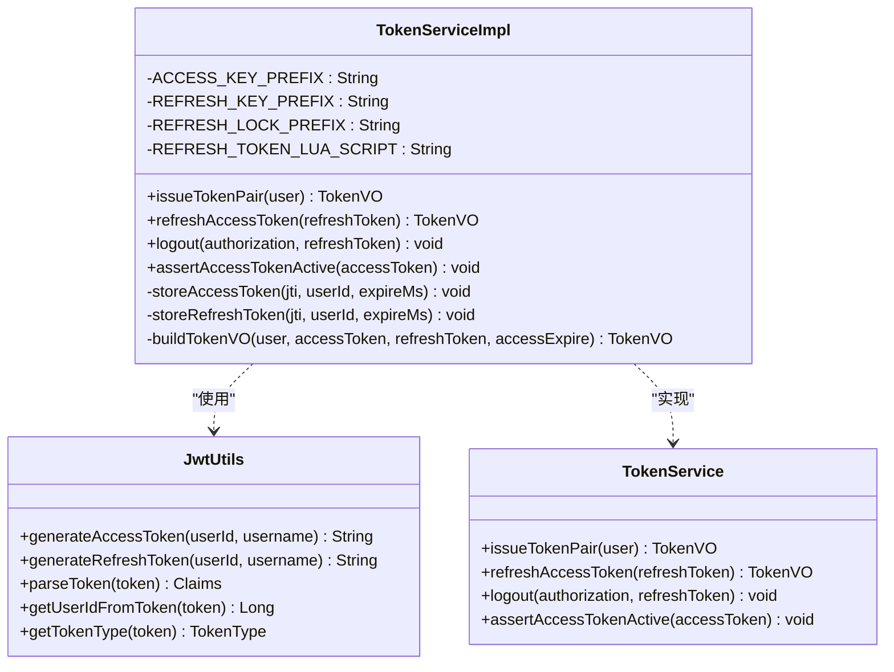
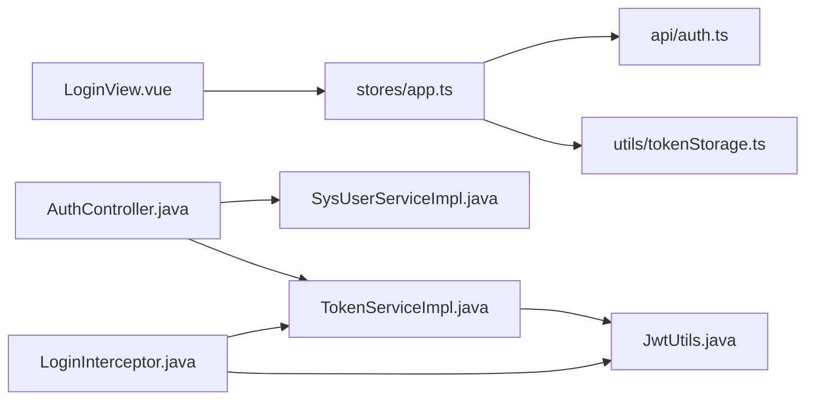

# 用户认证系统

<cite>
**本文引用的文件**   
- [linkx-client/src/api/auth.ts](file://linkx-client/src/api/auth.ts)
- [linkx-client/src/components/LoginView.vue](file://linkx-client/src/components/LoginView.vue)
- [linkx-client/src/components/LockScreen.vue](file://linkx-client/src/components/LockScreen.vue)
- [linkx-client/src/stores/app.ts](file://linkx-client/src/stores/app.ts)
- [linkx-client/src/utils/tokenStorage.ts](file://linkx-client/src/utils/tokenStorage.ts)
- [linkx-client/src/types/auth.ts](file://linkx-client/src/types/auth.ts)
- [linkx-server/src/main/java/com/linkx/server/controller/AuthController.java](file://linkx-server/src/main/java/com/linkx/server/controller/AuthController.java)
- [linkx-server/src/main/java/com/linkx/server/service/SysUserService.java](file://linkx-server/src/main/java/com/linkx/server/service/SysUserService.java)
- [linkx-server/src/main/java/com/linkx/server/service/TokenService.java](file://linkx-server/src/main/java/com/linkx/server/service/TokenService.java)
- [linkx-server/src/main/java/com/linkx/server/service/impl/SysUserServiceImpl.java](file://linkx-server/src/main/java/com/linkx/server/service/impl/SysUserServiceImpl.java)
- [linkx-server/src/main/java/com/linkx/server/service/impl/TokenServiceImpl.java](file://linkx-server/src/main/java/com/linkx/server/service/impl/TokenServiceImpl.java)
- [linkx-server/src/main/java/com/linkx/server/common/JwtUtils.java](file://linkx-server/src/main/java/com/linkx/server/common/JwtUtils.java)
- [linkx-server/src/main/java/com/linkx/server/config/interceptor/LoginInterceptor.java](file://linkx-server/src/main/java/com/linkx/server/config/interceptor/LoginInterceptor.java)
</cite>

## 目录
1. [简介](#简介)
2. [项目结构](#项目结构)
3. [核心组件](#核心组件)
4. [架构总览](#架构总览)
5. [详细组件分析](#详细组件分析)
6. [依赖关系分析](#依赖关系分析)
7. [性能与安全考虑](#性能与安全考虑)
8. [故障排查指南](#故障排查指南)
9. [结论](#结论)

## 简介
本文件面向 LinkX 的用户认证子系统，系统性阐述基于 JWT 的令牌认证机制、前后端登录注册流程、自动登录与锁屏保护实现细节。文档覆盖前端 Pinia Store 中的认证状态管理、后端 Spring Boot 认证控制器、JWT 工具类与令牌服务、以及前后端令牌存储与同步策略，并提供关键操作的调用路径与错误处理要点。

## 项目结构
认证相关代码横跨前后端：
- 前端（Electron + Vue）：提供登录界面、锁屏界面、Pinia 状态管理、HTTP API 封装与令牌持久化。
- 后端（Spring Boot）：提供认证接口、用户服务、令牌签发与刷新、拦截器校验、JWT 工具类。

图表来源
- [linkx-client/src/components/LoginView.vue:1-120](file://linkx-client/src/components/LoginView.vue#L1-L120)
- [linkx-client/src/components/LockScreen.vue:1-60](file://linkx-client/src/components/LockScreen.vue#L1-L60)
- [linkx-client/src/stores/app.ts:935-1045](file://linkx-client/src/stores/app.ts#L935-L1045)
- [linkx-client/src/api/auth.ts:1-25](file://linkx-client/src/api/auth.ts#L1-L25)
- [linkx-client/src/utils/tokenStorage.ts:1-79](file://linkx-client/src/utils/tokenStorage.ts#L1-L79)
- [linkx-client/src/types/auth.ts:1-47](file://linkx-client/src/types/auth.ts#L1-L47)
- [linkx-server/src/main/java/com/linkx/server/controller/AuthController.java:1-84](file://linkx-server/src/main/java/com/linkx/server/controller/AuthController.java#L1-L84)
- [linkx-server/src/main/java/com/linkx/server/service/SysUserService.java:1-34](file://linkx-server/src/main/java/com/linkx/server/service/SysUserService.java#L1-L34)
- [linkx-server/src/main/java/com/linkx/server/service/impl/SysUserServiceImpl.java:1-175](file://linkx-server/src/main/java/com/linkx/server/service/impl/SysUserServiceImpl.java#L1-L175)
- [linkx-server/src/main/java/com/linkx/server/service/TokenService.java:1-16](file://linkx-server/src/main/java/com/linkx/server/service/TokenService.java#L1-L16)
- [linkx-server/src/main/java/com/linkx/server/service/impl/TokenServiceImpl.java:1-204](file://linkx-server/src/main/java/com/linkx/server/service/impl/TokenServiceImpl.java#L1-L204)
- [linkx-server/src/main/java/com/linkx/server/common/JwtUtils.java:1-76](file://linkx-server/src/main/java/com/linkx/server/common/JwtUtils.java#L1-L76)
- [linkx-server/src/main/java/com/linkx/server/config/interceptor/LoginInterceptor.java:1-53](file://linkx-server/src/main/java/com/linkx/server/config/interceptor/LoginInterceptor.java#L1-L53)

章节来源
- [linkx-client/src/components/LoginView.vue:1-120](file://linkx-client/src/components/LoginView.vue#L1-L120)
- [linkx-client/src/components/LockScreen.vue:1-60](file://linkx-client/src/components/LockScreen.vue#L1-L60)
- [linkx-client/src/stores/app.ts:935-1045](file://linkx-client/src/stores/app.ts#L935-L1045)
- [linkx-client/src/api/auth.ts:1-25](file://linkx-client/src/api/auth.ts#L1-L25)
- [linkx-client/src/utils/tokenStorage.ts:1-79](file://linkx-client/src/utils/tokenStorage.ts#L1-L79)
- [linkx-client/src/types/auth.ts:1-47](file://linkx-client/src/types/auth.ts#L1-L47)
- [linkx-server/src/main/java/com/linkx/server/controller/AuthController.java:1-84](file://linkx-server/src/main/java/com/linkx/server/controller/AuthController.java#L1-L84)
- [linkx-server/src/main/java/com/linkx/server/service/SysUserService.java:1-34](file://linkx-server/src/main/java/com/linkx/server/service/SysUserService.java#L1-L34)
- [linkx-server/src/main/java/com/linkx/server/service/impl/SysUserServiceImpl.java:1-175](file://linkx-server/src/main/java/com/linkx/server/service/impl/SysUserServiceImpl.java#L1-L175)
- [linkx-server/src/main/java/com/linkx/server/service/TokenService.java:1-16](file://linkx-server/src/main/java/com/linkx/server/service/TokenService.java#L1-L16)
- [linkx-server/src/main/java/com/linkx/server/service/impl/TokenServiceImpl.java:1-204](file://linkx-server/src/main/java/com/linkx/server/service/impl/TokenServiceImpl.java#L1-L204)
- [linkx-server/src/main/java/com/linkx/server/common/JwtUtils.java:1-76](file://linkx-server/src/main/java/com/linkx/server/common/JwtUtils.java#L1-L76)
- [linkx-server/src/main/java/com/linkx/server/config/interceptor/LoginInterceptor.java:1-53](file://linkx-server/src/main/java/com/linkx/server/config/interceptor/LoginInterceptor.java#L1-L53)

## 核心组件
- 前端认证 API 层：封装验证码获取、登录、注册、刷新、登出等 HTTP 请求。
- 前端登录视图：表单校验、验证码交互、记住账号与自动登录选项。
- 前端锁屏视图：PIN 校验与解锁控制。
- 前端 Pinia Store：统一维护登录态、用户资料、自动登录恢复、锁屏状态、登出清理等。
- 前端令牌存储：优先使用 Electron 安全存储，不可用时回退到 localStorage，并支持键前缀隔离。
- 后端认证控制器：对外暴露 /auth 系列接口，集成验证码校验、限流、审计。
- 后端用户服务：注册、登录、资料更新；含密码哈希、防侧信道、失败次数限制与审计记录。
- 后端令牌服务：签发 Access/Refresh 对、Redis 持久化、原子性刷新、分布式锁、注销吊销。
- JWT 工具类：生成/解析令牌、提取用户信息、类型判断。
- 登录拦截器：全局鉴权，校验 Authorization 头、拒绝 Refresh 令牌访问业务接口、注入 userId。

章节来源
- [linkx-client/src/api/auth.ts:1-25](file://linkx-client/src/api/auth.ts#L1-L25)
- [linkx-client/src/components/LoginView.vue:1-120](file://linkx-client/src/components/LoginView.vue#L1-L120)
- [linkx-client/src/components/LockScreen.vue:1-60](file://linkx-client/src/components/LockScreen.vue#L1-L60)
- [linkx-client/src/stores/app.ts:935-1045](file://linkx-client/src/stores/app.ts#L935-L1045)
- [linkx-client/src/utils/tokenStorage.ts:1-79](file://linkx-client/src/utils/tokenStorage.ts#L1-L79)
- [linkx-server/src/main/java/com/linkx/server/controller/AuthController.java:1-84](file://linkx-server/src/main/java/com/linkx/server/controller/AuthController.java#L1-L84)
- [linkx-server/src/main/java/com/linkx/server/service/SysUserService.java:1-34](file://linkx-server/src/main/java/com/linkx/server/service/SysUserService.java#L1-L34)
- [linkx-server/src/main/java/com/linkx/server/service/impl/SysUserServiceImpl.java:1-175](file://linkx-server/src/main/java/com/linkx/server/service/impl/SysUserServiceImpl.java#L1-L175)
- [linkx-server/src/main/java/com/linkx/server/service/TokenService.java:1-16](file://linkx-server/src/main/java/com/linkx/server/service/TokenService.java#L1-L16)
- [linkx-server/src/main/java/com/linkx/server/service/impl/TokenServiceImpl.java:1-204](file://linkx-server/src/main/java/com/linkx/server/service/impl/TokenServiceImpl.java#L1-L204)
- [linkx-server/src/main/java/com/linkx/server/common/JwtUtils.java:1-76](file://linkx-server/src/main/java/com/linkx/server/common/JwtUtils.java#L1-L76)
- [linkx-server/src/main/java/com/linkx/server/config/interceptor/LoginInterceptor.java:1-53](file://linkx-server/src/main/java/com/linkx/server/config/interceptor/LoginInterceptor.java#L1-L53)

## 架构总览
下图展示从前端登录到后端签发令牌、再到后续受保护接口的完整链路。

图表来源
- [linkx-client/src/components/LoginView.vue:77-109](file://linkx-client/src/components/LoginView.vue#L77-L109)
- [linkx-client/src/stores/app.ts:973-1003](file://linkx-client/src/stores/app.ts#L973-L1003)
- [linkx-client/src/api/auth.ts:8-10](file://linkx-client/src/api/auth.ts#L8-L10)
- [linkx-server/src/main/java/com/linkx/server/controller/AuthController.java:48-53](file://linkx-server/src/main/java/com/linkx/server/controller/AuthController.java#L48-L53)
- [linkx-server/src/main/java/com/linkx/server/service/impl/SysUserServiceImpl.java:60-99](file://linkx-server/src/main/java/com/linkx/server/service/impl/SysUserServiceImpl.java#L60-L99)
- [linkx-server/src/main/java/com/linkx/server/service/impl/TokenServiceImpl.java:47-64](file://linkx-server/src/main/java/com/linkx/server/service/impl/TokenServiceImpl.java#L47-L64)
- [linkx-server/src/main/java/com/linkx/server/common/JwtUtils.java:31-56](file://linkx-server/src/main/java/com/linkx/server/common/JwtUtils.java#L31-L56)

## 详细组件分析

### 前端认证 API 层
- 职责：封装 /auth/captcha、/auth/login、/auth/register、/auth/refresh、/auth/logout 五个接口，统一返回类型 ApiResult<T>。
- 关键点：
  - 登录/注册携带验证码 ID 与内容，由后端根据配置决定是否校验。
  - 刷新接口仅接受 refreshToken。
  - 登出可选携带 refreshToken，便于服务端主动吊销。

章节来源
- [linkx-client/src/api/auth.ts:1-25](file://linkx-client/src/api/auth.ts#L1-L25)
- [linkx-client/src/types/auth.ts:1-47](file://linkx-client/src/types/auth.ts#L1-L47)

### 前端登录视图
- 职责：渲染登录表单、验证码图片、记住账号与自动登录复选框，发起登录并处理错误提示。
- 关键点：
  - 首屏异步加载验证码，避免阻塞交互。
  - 本地校验用户名/密码格式与验证码非空。
  - 登录成功后通过 Store 的 login 方法完成令牌持久化与会话初始化。
  - 注册弹窗复用验证码能力，注册成功后回到登录页。

章节来源
- [linkx-client/src/components/LoginView.vue:1-175](file://linkx-client/src/components/LoginView.vue#L1-L175)

### 前端锁屏视图
- 职责：在已设置 PIN 的情况下要求输入 PIN 以解锁应用。
- 关键点：
  - 未设置 PIN 时给出提示。
  - 校验通过后调用 Store 的 unlock 关闭锁屏遮罩。

章节来源
- [linkx-client/src/components/LockScreen.vue:1-60](file://linkx-client/src/components/LockScreen.vue#L1-L60)

### 前端 Pinia Store（app.ts）
- 职责：集中管理登录态、用户资料、自动登录恢复、锁屏、社交数据加载与 WebSocket 连接。
- 关键动作：
  - login：调用后端登录接口，成功则持久化令牌对、写入用户资料、标记已登录并拉取会话与连接 WS。
  - tryAutoLogin：启动时若开启自动登录且存在 refreshToken，则调用刷新接口恢复会话。
  - logout：清理本地状态与 UI，删除令牌，再尝试通知后端吊销。
  - setLockPin/verifyLockPin/lock/unlock：配合锁屏功能。
- 持久化：除令牌外，其他关键状态经 sanitize 后持久化，避免敏感字段泄露。

图表来源
- [linkx-client/src/stores/app.ts:1008-1045](file://linkx-client/src/stores/app.ts#L1008-L1045)

章节来源
- [linkx-client/src/stores/app.ts:935-1045](file://linkx-client/src/stores/app.ts#L935-L1045)

### 前端令牌存储（tokenStorage.ts）
- 职责：统一存取 accessToken 与 refreshToken，优先使用 Electron 安全存储，不可用时回退到 localStorage。
- 关键点：
  - 使用固定键名前缀隔离，避免与其他数据混淆。
  - 提供 hasRefreshToken/saveTokenPair/clearTokens 等便捷方法。
  - 读取时先查 localStorage 回退键，再查安全存储，保证兼容性与平滑迁移。

章节来源
- [linkx-client/src/utils/tokenStorage.ts:1-79](file://linkx-client/src/utils/tokenStorage.ts#L1-L79)

### 后端认证控制器（AuthController）
- 职责：暴露 /auth 系列接口，整合验证码校验、限流、用户服务与令牌服务。
- 关键点：
  - 登录/注册在启用验证码时进行校验。
  - 刷新接口按 IP 做速率限制。
  - 登出支持从请求头或请求体中获取 refreshToken 进行吊销。

章节来源
- [linkx-server/src/main/java/com/linkx/server/controller/AuthController.java:1-84](file://linkx-server/src/main/java/com/linkx/server/controller/AuthController.java#L1-L84)

### 后端用户服务（SysUserService / SysUserServiceImpl）
- 职责：注册、登录、资料更新。
- 关键点：
  - 注册：限流、唯一性检查、BCrypt 哈希存储。
  - 登录：防侧信道（无论用户是否存在均执行耗时操作）、账号状态检查、失败计数与审计记录、成功后签发令牌对。
  - 资料更新：按需更新字段并落库。

章节来源
- [linkx-server/src/main/java/com/linkx/server/service/SysUserService.java:1-34](file://linkx-server/src/main/java/com/linkx/server/service/SysUserService.java#L1-L34)
- [linkx-server/src/main/java/com/linkx/server/service/impl/SysUserServiceImpl.java:1-175](file://linkx-server/src/main/java/com/linkx/server/service/impl/SysUserServiceImpl.java#L1-L175)

### 后端令牌服务（TokenService / TokenServiceImpl）
- 职责：签发/刷新/吊销令牌，维护 Redis 中的活跃令牌映射。
- 关键点：
  - 签发：生成 Access/Refresh 令牌对，分别存入 Redis，附带过期时间。
  - 刷新：解析并校验类型，使用 Lua 脚本原子性验证并删除旧 refreshToken，防止并发重复发放；使用分布式锁限制刷新频率。
  - 吊销：支持从 Authorization 头或原始 refreshToken 中吊销对应条目。
  - 断言：校验 Access 令牌是否在 Redis 中存在，用于拦截器鉴权。

图表来源
- [linkx-server/src/main/java/com/linkx/server/service/TokenService.java:1-16](file://linkx-server/src/main/java/com/linkx/server/service/TokenService.java#L1-L16)
- [linkx-server/src/main/java/com/linkx/server/service/impl/TokenServiceImpl.java:1-204](file://linkx-server/src/main/java/com/linkx/server/service/impl/TokenServiceImpl.java#L1-L204)
- [linkx-server/src/main/java/com/linkx/server/common/JwtUtils.java:1-76](file://linkx-server/src/main/java/com/linkx/server/common/JwtUtils.java#L1-L76)

章节来源
- [linkx-server/src/main/java/com/linkx/server/service/TokenService.java:1-16](file://linkx-server/src/main/java/com/linkx/server/service/TokenService.java#L1-L16)
- [linkx-server/src/main/java/com/linkx/server/service/impl/TokenServiceImpl.java:1-204](file://linkx-server/src/main/java/com/linkx/server/service/impl/TokenServiceImpl.java#L1-L204)
- [linkx-server/src/main/java/com/linkx/server/common/JwtUtils.java:1-76](file://linkx-server/src/main/java/com/linkx/server/common/JwtUtils.java#L1-L76)

### 登录拦截器（LoginInterceptor）
- 职责：对所有受保护接口进行前置鉴权。
- 关键点：
  - 跳过 OPTIONS 预检请求。
  - 从 Authorization 头提取令牌，去除 Bearer 前缀。
  - 拒绝 Refresh 令牌访问业务接口。
  - 调用令牌服务断言 Access 令牌有效，并将 userId 注入请求属性供后续使用。

章节来源
- [linkx-server/src/main/java/com/linkx/server/config/interceptor/LoginInterceptor.java:1-53](file://linkx-server/src/main/java/com/linkx/server/config/interceptor/LoginInterceptor.java#L1-L53)

## 依赖关系分析
- 前端依赖链：LoginView.vue -> stores/app.ts -> api/auth.ts -> utils/tokenStorage.ts
- 后端依赖链：AuthController -> SysUserService -> TokenService -> JwtUtils；所有受保护接口经由 LoginInterceptor 校验。

图表来源
- [linkx-client/src/components/LoginView.vue:1-120](file://linkx-client/src/components/LoginView.vue#L1-L120)
- [linkx-client/src/stores/app.ts:935-1045](file://linkx-client/src/stores/app.ts#L935-L1045)
- [linkx-client/src/api/auth.ts:1-25](file://linkx-client/src/api/auth.ts#L1-L25)
- [linkx-client/src/utils/tokenStorage.ts:1-79](file://linkx-client/src/utils/tokenStorage.ts#L1-L79)
- [linkx-server/src/main/java/com/linkx/server/controller/AuthController.java:1-84](file://linkx-server/src/main/java/com/linkx/server/controller/AuthController.java#L1-L84)
- [linkx-server/src/main/java/com/linkx/server/service/impl/SysUserServiceImpl.java:1-175](file://linkx-server/src/main/java/com/linkx/server/service/impl/SysUserServiceImpl.java#L1-L175)
- [linkx-server/src/main/java/com/linkx/server/service/impl/TokenServiceImpl.java:1-204](file://linkx-server/src/main/java/com/linkx/server/service/impl/TokenServiceImpl.java#L1-L204)
- [linkx-server/src/main/java/com/linkx/server/common/JwtUtils.java:1-76](file://linkx-server/src/main/java/com/linkx/server/common/JwtUtils.java#L1-L76)
- [linkx-server/src/main/java/com/linkx/server/config/interceptor/LoginInterceptor.java:1-53](file://linkx-server/src/main/java/com/linkx/server/config/interceptor/LoginInterceptor.java#L1-L53)

## 性能与安全考虑
- 令牌刷新并发控制：使用 Redis 分布式锁与 Lua 原子脚本，避免重复发放与竞态条件。
- 防侧信道攻击：登录时对不存在的用户也执行相同耗时的哈希比较，减少时序泄露风险。
- 限流与审计：注册与登录均有限流策略，失败登录记录审计日志，便于风控与追溯。
- 安全存储：前端优先使用 Electron 安全存储，降低明文令牌泄露风险；不可用时回退到 localStorage 并通过键前缀隔离。
- 最小权限：Access 令牌仅用于访问业务接口，Refresh 令牌不得直接访问业务接口，拦截器会拒绝。

[本节为通用指导，无需具体文件引用]

## 故障排查指南
- 登录失败
  - 现象：提示“用户名或密码错误”或“登录失败次数过多”。
  - 排查：确认验证码是否正确、账号是否被锁定、网络是否正常。
  - 参考路径：[SysUserServiceImpl.login:60-99](file://linkx-server/src/main/java/com/linkx/server/service/impl/SysUserServiceImpl.java#L60-L99)、[AuthController.login:48-53](file://linkx-server/src/main/java/com/linkx/server/controller/AuthController.java#L48-L53)
- 自动登录卡住
  - 现象：启动后长时间处于加载中。
  - 排查：检查是否存在有效的 refreshToken；若刷新失败，会自动清除并关闭自动登录标志。
  - 参考路径：[app.ts.tryAutoLogin:1008-1045](file://linkx-client/src/stores/app.ts#L1008-L1045)
- 刷新频繁
  - 现象：提示“Token 刷新过于频繁”。
  - 排查：避免短时间内多次刷新；检查客户端刷新逻辑是否合理。
  - 参考路径：[TokenServiceImpl.refreshAccessToken:67-117](file://linkx-server/src/main/java/com/linkx/server/service/impl/TokenServiceImpl.java#L67-L117)
- 业务接口 401
  - 现象：访问受保护接口返回未登录或过期。
  - 排查：确认 Authorization 头是否携带正确的 Access 令牌；检查 Redis 中该令牌是否仍有效。
  - 参考路径：[LoginInterceptor.preHandle:22-51](file://linkx-server/src/main/java/com/linkx/server/config/interceptor/LoginInterceptor.java#L22-L51)、[TokenServiceImpl.assertAccessTokenActive:126-136](file://linkx-server/src/main/java/com/linkx/server/service/impl/TokenServiceImpl.java#L126-L136)
- 锁屏无法解锁
  - 现象：提示“请先在设置中设置锁屏 PIN”或“PIN 错误”。
  - 排查：确认是否已设置 PIN；重新输入正确 PIN。
  - 参考路径：[LockScreen.vue:16-31](file://linkx-client/src/components/LockScreen.vue#L16-L31)、[app.ts.verifyLockPin:1059-1065](file://linkx-client/src/stores/app.ts#L1059-L1065)

章节来源
- [linkx-server/src/main/java/com/linkx/server/service/impl/SysUserServiceImpl.java:60-99](file://linkx-server/src/main/java/com/linkx/server/service/impl/SysUserServiceImpl.java#L60-L99)
- [linkx-server/src/main/java/com/linkx/server/controller/AuthController.java:48-53](file://linkx-server/src/main/java/com/linkx/server/controller/AuthController.java#L48-L53)
- [linkx-client/src/stores/app.ts:1008-1045](file://linkx-client/src/stores/app.ts#L1008-L1045)
- [linkx-server/src/main/java/com/linkx/server/service/impl/TokenServiceImpl.java:67-117](file://linkx-server/src/main/java/com/linkx/server/service/impl/TokenServiceImpl.java#L67-L117)
- [linkx-server/src/main/java/com/linkx/server/config/interceptor/LoginInterceptor.java:22-51](file://linkx-server/src/main/java/com/linkx/server/config/interceptor/LoginInterceptor.java#L22-L51)
- [linkx-client/src/components/LockScreen.vue:16-31](file://linkx-client/src/components/LockScreen.vue#L16-L31)
- [linkx-client/src/stores/app.ts:1059-1065](file://linkx-client/src/stores/app.ts#L1059-L1065)

## 结论
LinkX 认证系统采用前后端分离的 JWT 方案，结合 Redis 实现令牌的短期活跃管理与原子性刷新，具备完善的限流、审计与安全防护措施。前端通过 Pinia Store 统一管理认证状态与自动登录恢复，并在 Electron 环境下优先使用安全存储以降低令牌泄露风险。整体设计兼顾安全性、可用性与可维护性，适合企业级即时通讯场景。