# 群组聊天功能

<cite>
**本文引用的文件**   
- [CreateGroupModal.vue](file://linkx-client/src/components/chat/CreateGroupModal.vue)
- [AddGroupMembersModal.vue](file://linkx-client/src/components/chat/AddGroupMembersModal.vue)
- [GroupInfoDrawer.vue](file://linkx-client/src/components/chat/GroupInfoDrawer.vue)
- [GroupAnnouncementModal.vue](file://linkx-client/src/components/chat/GroupAnnouncementModal.vue)
- [groupMeta.ts](file://linkx-client/src/stores/groupMeta.ts)
- [app.ts](file://linkx-client/src/stores/app.ts)
- [ChatController.java](file://linkx-server/src/main/java/com/linkx/server/controller/ChatController.java)
- [ChatService.java](file://linkx-server/src/main/java/com/linkx/server/service/ChatService.java)
- [ChatServiceImpl.java](file://linkx-server/src/main/java/com/linkx/server/service/impl/ChatServiceImpl.java)
- [ImConversation.java](file://linkx-server/src/main/java/com/linkx/server/entity/ImConversation.java)
- [ImConversationMember.java](file://linkx-server/src/main/java/com/linkx/server/entity/ImConversationMember.java)
- [ImConversationMapper.java](file://linkx-server/src/main/java/com/linkx/server/mapper/ImConversationMapper.java)
- [ImConversationMemberMapper.java](file://linkx-server/src/main/java/com/linkx/server/mapper/ImConversationMemberMapper.java)
- [groupDemo.ts](file://linkx-client/src/data/groupDemo.ts)
</cite>

## 目录
1. [简介](#简介)
2. [项目结构](#项目结构)
3. [核心组件](#核心组件)
4. [架构总览](#架构总览)
5. [详细组件分析](#详细组件分析)
6. [依赖关系分析](#依赖关系分析)
7. [性能与一致性](#性能与一致性)
8. [故障排查指南](#故障排查指南)
9. [结论](#结论)
10. [附录：关键流程时序图](#附录关键流程时序图)

## 简介
本文件面向 LinkX 的“群组聊天”能力，围绕以下目标展开：
- 群组创建流程：从前端选择成员到本地会话与消息初始化。
- 成员管理：邀请成员、成员列表展示与去重策略。
- 群设置与公告：置顶、免打扰、备注、公告编辑与持久化。
- 元数据存储与同步：群元数据（公告、精华、成员、备注、文件、相册）的懒加载与持久化。
- 权限控制与会话访问：后端会话成员校验与权限断言。
- 群组相关消息处理：系统消息插入、预览更新、未读计数与离线状态联动。

## 项目结构
群组功能由前端 UI 组件、Pinia Store 与后端 REST/IM 服务共同实现。前端负责交互与本地状态，后端提供会话与消息的基础能力与权限校验。

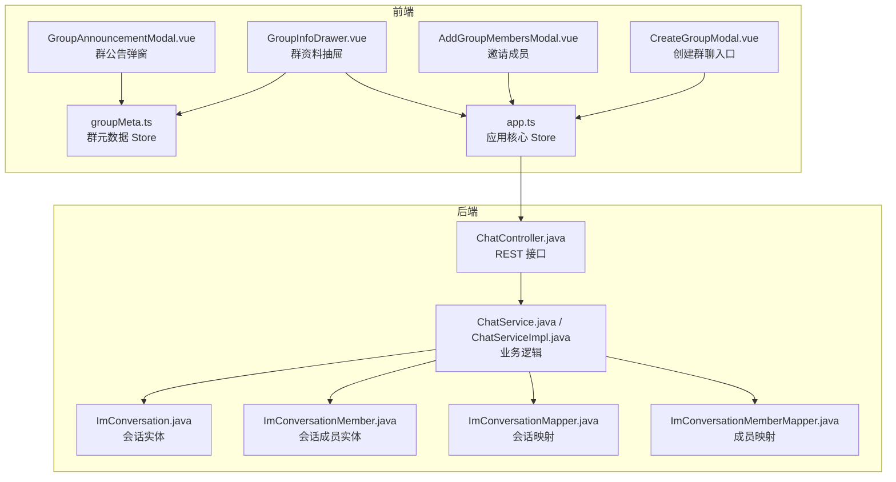

图表来源
- [CreateGroupModal.vue:1-140](file://linkx-client/src/components/chat/CreateGroupModal.vue#L1-L140)
- [AddGroupMembersModal.vue:1-103](file://linkx-client/src/components/chat/AddGroupMembersModal.vue#L1-L103)
- [GroupInfoDrawer.vue:1-127](file://linkx-client/src/components/chat/GroupInfoDrawer.vue#L1-L127)
- [GroupAnnouncementModal.vue:1-66](file://linkx-client/src/components/chat/GroupAnnouncementModal.vue#L1-L66)
- [groupMeta.ts:104-289](file://linkx-client/src/stores/groupMeta.ts#L104-L289)
- [app.ts:264-333](file://linkx-client/src/stores/app.ts#L264-L333)
- [ChatController.java:22-72](file://linkx-server/src/main/java/com/linkx/server/controller/ChatController.java#L22-L72)
- [ChatService.java:11-25](file://linkx-server/src/main/java/com/linkx/server/service/ChatService.java#L11-L25)
- [ChatServiceImpl.java:38-238](file://linkx-server/src/main/java/com/linkx/server/service/impl/ChatServiceImpl.java#L38-L238)
- [ImConversation.java:20-48](file://linkx-server/src/main/java/com/linkx/server/entity/ImConversation.java#L20-L48)
- [ImConversationMember.java:20-41](file://linkx-server/src/main/java/com/linkx/server/entity/ImConversationMember.java#L20-L41)
- [ImConversationMapper.java:7-10](file://linkx-server/src/main/java/com/linkx/server/mapper/ImConversationMapper.java#L7-L10)
- [ImConversationMemberMapper.java:7-10](file://linkx-server/src/main/java/com/linkx/server/mapper/ImConversationMemberMapper.java#L7-L10)

章节来源
- [CreateGroupModal.vue:1-140](file://linkx-client/src/components/chat/CreateGroupModal.vue#L1-L140)
- [AddGroupMembersModal.vue:1-103](file://linkx-client/src/components/chat/AddGroupMembersModal.vue#L1-L103)
- [GroupInfoDrawer.vue:1-127](file://linkx-client/src/components/chat/GroupInfoDrawer.vue#L1-L127)
- [GroupAnnouncementModal.vue:1-66](file://linkx-client/src/components/chat/GroupAnnouncementModal.vue#L1-L66)
- [groupMeta.ts:104-289](file://linkx-client/src/stores/groupMeta.ts#L104-L289)
- [app.ts:264-333](file://linkx-client/src/stores/app.ts#L264-L333)
- [ChatController.java:22-72](file://linkx-server/src/main/java/com/linkx/server/controller/ChatController.java#L22-L72)
- [ChatService.java:11-25](file://linkx-server/src/main/java/com/linkx/server/service/ChatService.java#L11-L25)
- [ChatServiceImpl.java:38-238](file://linkx-server/src/main/java/com/linkx/server/service/impl/ChatServiceImpl.java#L38-L238)
- [ImConversation.java:20-48](file://linkx-server/src/main/java/com/linkx/server/entity/ImConversation.java#L20-L48)
- [ImConversationMember.java:20-41](file://linkx-server/src/main/java/com/linkx/server/entity/ImConversationMember.java#L20-L41)
- [ImConversationMapper.java:7-10](file://linkx-server/src/main/java/com/linkx/server/mapper/ImConversationMapper.java#L7-L10)
- [ImConversationMemberMapper.java:7-10](file://linkx-server/src/main/java/com/linkx/server/mapper/ImConversationMemberMapper.java#L7-L10)

## 核心组件
- 创建群聊模态框：支持搜索、分组折叠、已选成员预览，确认后调用应用 Store 创建群会话并写入系统欢迎消息。
- 添加成员模态框：按联系人搜索与多选，确认后调用应用 Store 邀请成员入群，并在群内插入系统消息。
- 群资料抽屉：展示群头像、成员网格、公告摘要、备注、置顶/免打扰开关、清空聊天记录、退出群聊等。
- 群公告弹窗：查看与编辑群公告，保存后更新群元数据并提示成功。
- 群元数据 Store：按 sessionId 维护公告、精华、成员、备注、文件、相册，并提供懒加载默认值与持久化。
- 应用核心 Store：提供 createGroup、inviteGroupMembers、leaveGroup、toggleSessionPin、toggleSessionMute、clearSessionMessages 等方法，并与 WebSocket 和后端 API 协同。

章节来源
- [CreateGroupModal.vue:120-140](file://linkx-client/src/components/chat/CreateGroupModal.vue#L120-L140)
- [AddGroupMembersModal.vue:82-103](file://linkx-client/src/components/chat/AddGroupMembersModal.vue#L82-L103)
- [GroupInfoDrawer.vue:69-127](file://linkx-client/src/components/chat/GroupInfoDrawer.vue#L69-L127)
- [GroupAnnouncementModal.vue:58-66](file://linkx-client/src/components/chat/GroupAnnouncementModal.vue#L58-L66)
- [groupMeta.ts:104-289](file://linkx-client/src/stores/groupMeta.ts#L104-L289)
- [app.ts:264-333](file://linkx-client/src/stores/app.ts#L264-L333)

## 架构总览
群组功能的整体交互路径如下：
- 前端 UI 触发操作（创建/邀请/设置/公告）。
- 通过 Pinia Store 聚合业务逻辑，必要时调用后端 REST 或 WebSocket。
- 后端对会话成员进行权限校验，保证只有合法成员可访问会话与消息。
- 前端在本地维护群元数据与消息列表，并通过持久化保障刷新后的可用性。

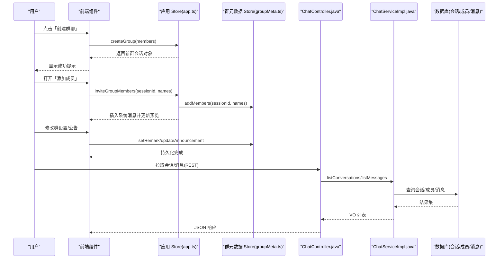

图表来源
- [CreateGroupModal.vue:120-140](file://linkx-client/src/components/chat/CreateGroupModal.vue#L120-L140)
- [AddGroupMembersModal.vue:82-103](file://linkx-client/src/components/chat/AddGroupMembersModal.vue#L82-L103)
- [GroupInfoDrawer.vue:69-127](file://linkx-client/src/components/chat/GroupInfoDrawer.vue#L69-L127)
- [GroupAnnouncementModal.vue:58-66](file://linkx-client/src/components/chat/GroupAnnouncementModal.vue#L58-L66)
- [groupMeta.ts:104-289](file://linkx-client/src/stores/groupMeta.ts#L104-L289)
- [app.ts:264-333](file://linkx-client/src/stores/app.ts#L264-L333)
- [ChatController.java:30-53](file://linkx-server/src/main/java/com/linkx/server/controller/ChatController.java#L30-L53)
- [ChatServiceImpl.java:54-168](file://linkx-server/src/main/java/com/linkx/server/service/impl/ChatServiceImpl.java#L54-L168)

## 详细组件分析

### 群组创建流程
- 用户在「创建群聊」中选择至少一名好友，确认后将成员信息传入应用 Store 的 createGroup。
- 应用 Store 生成唯一会话 ID、计算群名与头像颜色，插入一条系统欢迎消息，并将新会话置于列表顶部。
- 若为真实会话模式，后续可通过后端接口创建会话与成员记录；当前演示以本地为主。

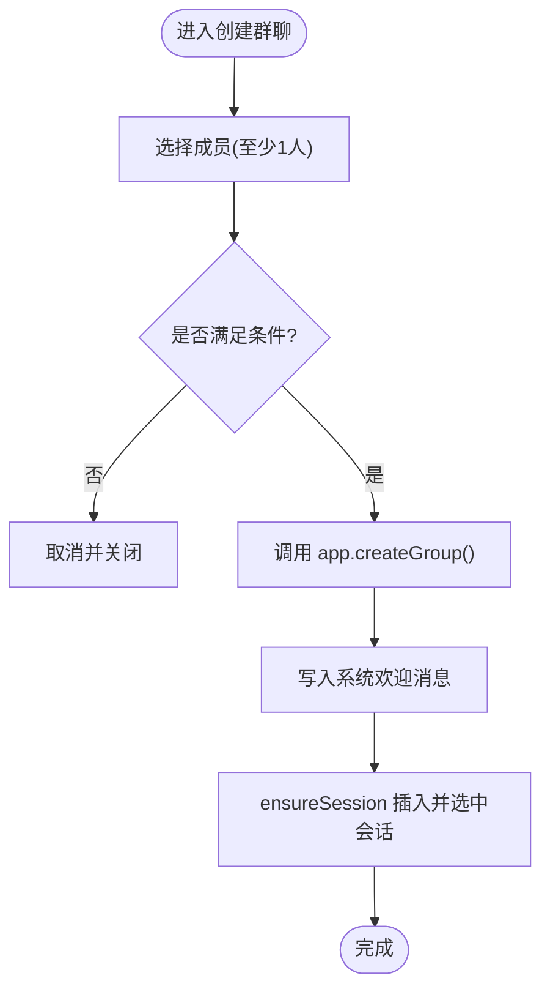

图表来源
- [CreateGroupModal.vue:120-140](file://linkx-client/src/components/chat/CreateGroupModal.vue#L120-L140)
- [app.ts:264-296](file://linkx-client/src/stores/app.ts#L264-L296)

章节来源
- [CreateGroupModal.vue:120-140](file://linkx-client/src/components/chat/CreateGroupModal.vue#L120-L140)
- [app.ts:264-296](file://linkx-client/src/stores/app.ts#L264-L296)

### 成员管理与邀请
- 「添加成员」弹窗支持搜索与多选，确认后调用应用 Store 的 inviteGroupMembers。
- 应用 Store 先更新 groupMeta 的成员列表（按姓名去重），再在当前会话中插入系统邀请消息，并更新会话预览与时间。
- 群资料抽屉中的成员网格来自 groupMeta 的成员列表，支持邀请按钮快速打开邀请弹窗。

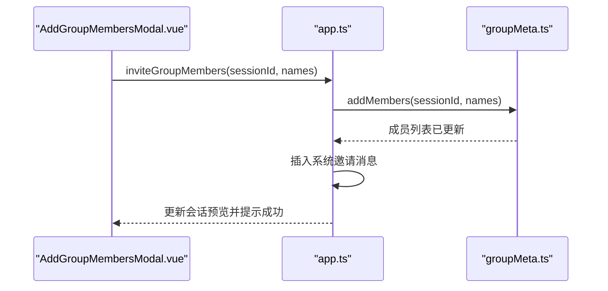

图表来源
- [AddGroupMembersModal.vue:82-103](file://linkx-client/src/components/chat/AddGroupMembersModal.vue#L82-L103)
- [app.ts:586-607](file://linkx-client/src/stores/app.ts#L586-L607)
- [groupMeta.ts:207-218](file://linkx-client/src/stores/groupMeta.ts#L207-L218)

章节来源
- [AddGroupMembersModal.vue:82-103](file://linkx-client/src/components/chat/AddGroupMembersModal.vue#L82-L103)
- [app.ts:586-607](file://linkx-client/src/stores/app.ts#L586-L607)
- [groupMeta.ts:207-218](file://linkx-client/src/stores/groupMeta.ts#L207-L218)

### 群设置与群公告
- 群资料抽屉提供置顶、免打扰、清空聊天记录、退出群聊等操作，均通过应用 Store 的方法执行。
- 群备注输入失焦时保存到 groupMeta 的 remarks 映射，并持久化。
- 群公告弹窗支持查看与编辑，保存时调用 groupMeta.updateAnnouncement，更新内容与时间戳。

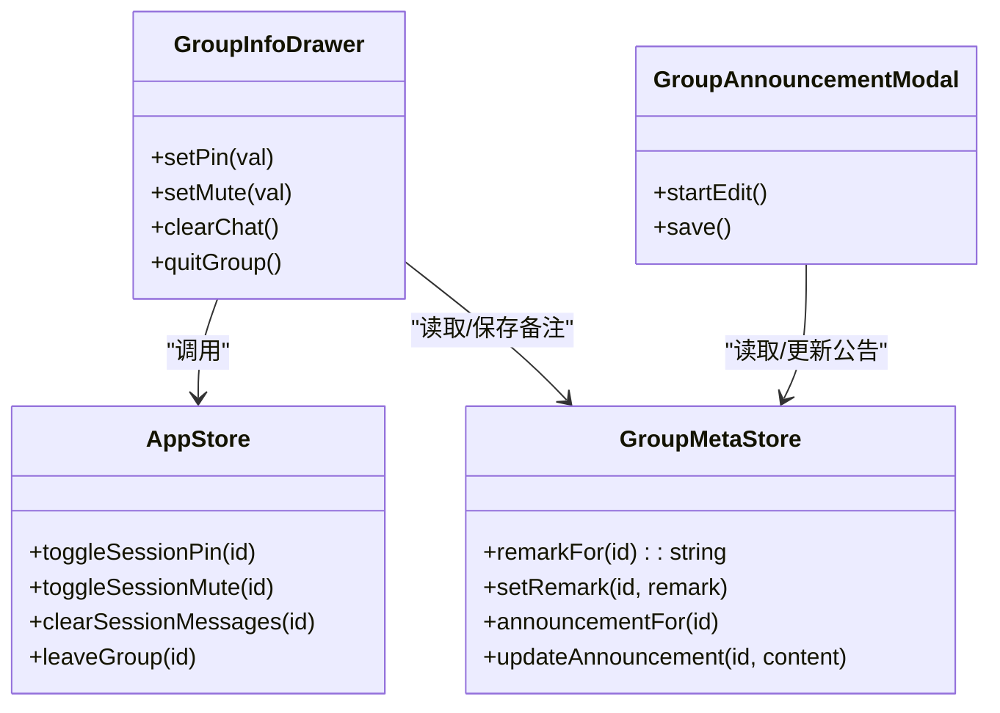

图表来源
- [GroupInfoDrawer.vue:69-127](file://linkx-client/src/components/chat/GroupInfoDrawer.vue#L69-L127)
- [GroupAnnouncementModal.vue:58-66](file://linkx-client/src/components/chat/GroupAnnouncementModal.vue#L58-L66)
- [groupMeta.ts:157-168](file://linkx-client/src/stores/groupMeta.ts#L157-L168)
- [groupMeta.ts:147-151](file://linkx-client/src/stores/groupMeta.ts#L147-L151)
- [app.ts:543-573](file://linkx-client/src/stores/app.ts#L543-L573)

章节来源
- [GroupInfoDrawer.vue:69-127](file://linkx-client/src/components/chat/GroupInfoDrawer.vue#L69-L127)
- [GroupAnnouncementModal.vue:58-66](file://linkx-client/src/components/chat/GroupAnnouncementModal.vue#L58-L66)
- [groupMeta.ts:157-168](file://linkx-client/src/stores/groupMeta.ts#L157-L168)
- [groupMeta.ts:147-151](file://linkx-client/src/stores/groupMeta.ts#L147-L151)
- [app.ts:543-573](file://linkx-client/src/stores/app.ts#L543-L573)

### 群组元数据存储与同步机制
- groupMeta 使用 Record<string, ...> 按 sessionId 组织公告、精华、成员、备注、文件、相册，首次访问时懒加载默认值。
- 所有群元数据通过 persist 配置持久化到本地存储，键名为 linkx-group-meta，覆盖全部子字段。
- 群公告默认文案来源于 groupDemo.ts 的全量与摘要模板。

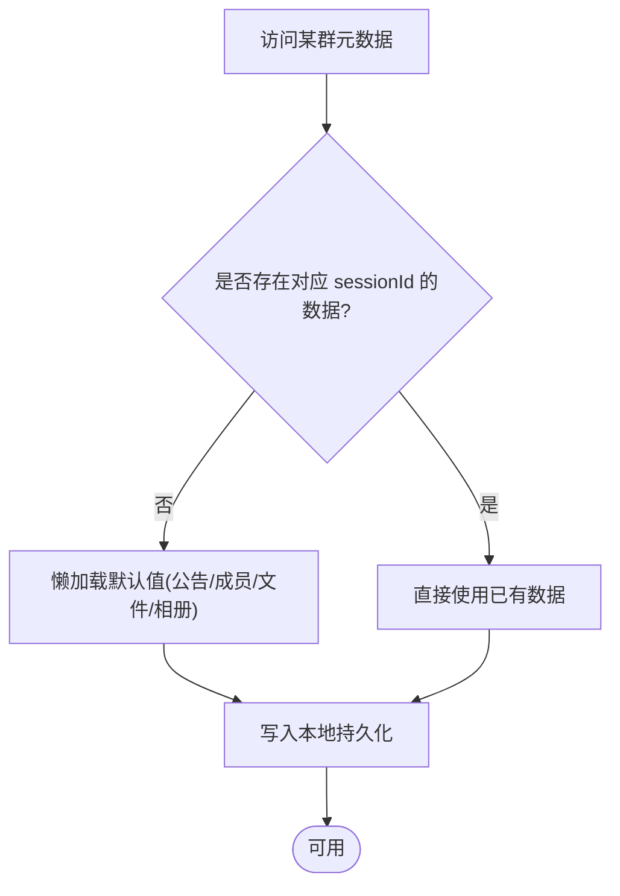

图表来源
- [groupMeta.ts:104-113](file://linkx-client/src/stores/groupMeta.ts#L104-L113)
- [groupMeta.ts:120-130](file://linkx-client/src/stores/groupMeta.ts#L120-L130)
- [groupMeta.ts:195-200](file://linkx-client/src/stores/groupMeta.ts#L195-L200)
- [groupMeta.ts:224-229](file://linkx-client/src/stores/groupMeta.ts#L224-L229)
- [groupMeta.ts:256-261](file://linkx-client/src/stores/groupMeta.ts#L256-L261)
- [groupMeta.ts:284-288](file://linkx-client/src/stores/groupMeta.ts#L284-L288)
- [groupDemo.ts:7-16](file://linkx-client/src/data/groupDemo.ts#L7-L16)

章节来源
- [groupMeta.ts:104-113](file://linkx-client/src/stores/groupMeta.ts#L104-L113)
- [groupMeta.ts:120-130](file://linkx-client/src/stores/groupMeta.ts#L120-L130)
- [groupMeta.ts:195-200](file://linkx-client/src/stores/groupMeta.ts#L195-L200)
- [groupMeta.ts:224-229](file://linkx-client/src/stores/groupMeta.ts#L224-L229)
- [groupMeta.ts:256-261](file://linkx-client/src/stores/groupMeta.ts#L256-L261)
- [groupMeta.ts:284-288](file://linkx-client/src/stores/groupMeta.ts#L284-L288)
- [groupDemo.ts:7-16](file://linkx-client/src/data/groupDemo.ts#L7-L16)

### 权限控制与会话访问
- 后端通过 ChatServiceImpl.assertConversationMember 校验用户是否为会话成员，非成员将抛出无权限异常。
- 单聊场景额外校验好友关系，确保仅好友间可发起聊天。
- 会话类型常量定义在 ImConversation 中，区分私聊与群聊。

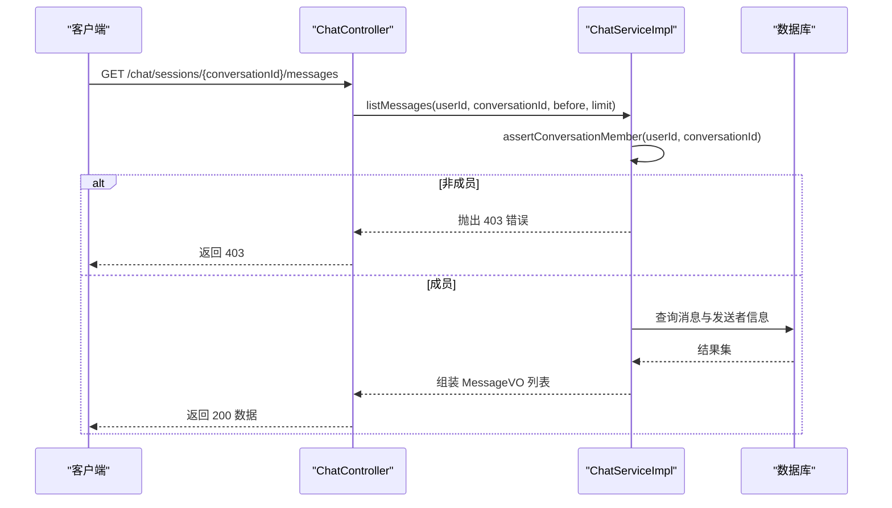

图表来源
- [ChatController.java:44-53](file://linkx-server/src/main/java/com/linkx/server/controller/ChatController.java#L44-L53)
- [ChatServiceImpl.java:135-168](file://linkx-server/src/main/java/com/linkx/server/service/impl/ChatServiceImpl.java#L135-L168)
- [ChatServiceImpl.java:229-238](file://linkx-server/src/main/java/com/linkx/server/service/impl/ChatServiceImpl.java#L229-L238)
- [ImConversation.java:25-27](file://linkx-server/src/main/java/com/linkx/server/entity/ImConversation.java#L25-L27)

章节来源
- [ChatController.java:44-53](file://linkx-server/src/main/java/com/linkx/server/controller/ChatController.java#L44-L53)
- [ChatServiceImpl.java:135-168](file://linkx-server/src/main/java/com/linkx/server/service/impl/ChatServiceImpl.java#L135-L168)
- [ChatServiceImpl.java:229-238](file://linkx-server/src/main/java/com/linkx/server/service/impl/ChatServiceImpl.java#L229-L238)
- [ImConversation.java:25-27](file://linkx-server/src/main/java/com/linkx/server/entity/ImConversation.java#L25-L27)

### 群组相关消息的处理逻辑
- 创建群聊与邀请成员时，应用 Store 会插入类型为 system 的系统消息，用于提示操作结果。
- 系统消息不影响普通消息的排序与分页，但会影响会话预览与时间。
- 当收到 WebSocket 推送的新消息时，应用 Store 会去重插入并更新会话预览与未读数（免打扰除外）。

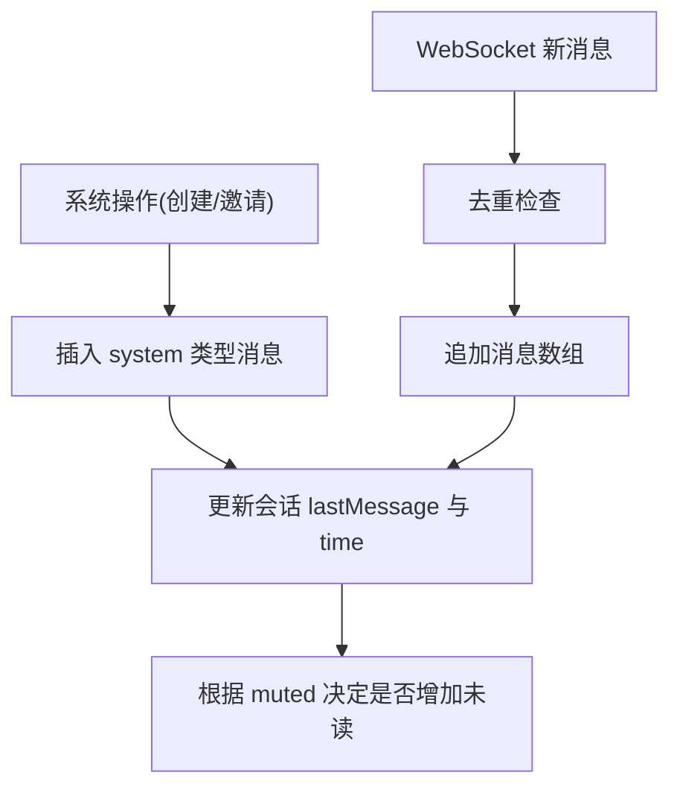

图表来源
- [app.ts:284-296](file://linkx-client/src/stores/app.ts#L284-L296)
- [app.ts:586-607](file://linkx-client/src/stores/app.ts#L586-L607)
- [app.ts:479-501](file://linkx-client/src/stores/app.ts#L479-L501)

章节来源
- [app.ts:284-296](file://linkx-client/src/stores/app.ts#L284-L296)
- [app.ts:586-607](file://linkx-client/src/stores/app.ts#L586-L607)
- [app.ts:479-501](file://linkx-client/src/stores/app.ts#L479-L501)

## 依赖关系分析
- 前端组件依赖 Pinia Store 暴露的方法与状态，群元数据 Store 被多个组件共享。
- 应用 Store 同时依赖群元数据 Store 与后端 API/WebSocket，承担跨模块协调职责。
- 后端控制器与服务层解耦，服务层通过 Mapper 访问数据库实体，严格进行成员权限校验。

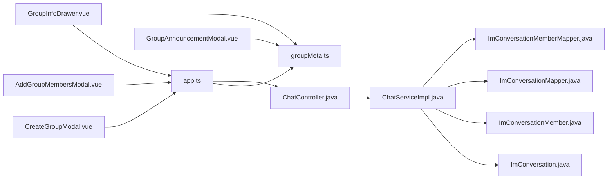

图表来源
- [CreateGroupModal.vue:120-140](file://linkx-client/src/components/chat/CreateGroupModal.vue#L120-L140)
- [AddGroupMembersModal.vue:82-103](file://linkx-client/src/components/chat/AddGroupMembersModal.vue#L82-L103)
- [GroupInfoDrawer.vue:69-127](file://linkx-client/src/components/chat/GroupInfoDrawer.vue#L69-L127)
- [GroupAnnouncementModal.vue:58-66](file://linkx-client/src/components/chat/GroupAnnouncementModal.vue#L58-L66)
- [groupMeta.ts:104-289](file://linkx-client/src/stores/groupMeta.ts#L104-L289)
- [app.ts:264-333](file://linkx-client/src/stores/app.ts#L264-L333)
- [ChatController.java:22-72](file://linkx-server/src/main/java/com/linkx/server/controller/ChatController.java#L22-L72)
- [ChatServiceImpl.java:38-238](file://linkx-server/src/main/java/com/linkx/server/service/impl/ChatServiceImpl.java#L38-L238)
- [ImConversation.java:20-48](file://linkx-server/src/main/java/com/linkx/server/entity/ImConversation.java#L20-L48)
- [ImConversationMember.java:20-41](file://linkx-server/src/main/java/com/linkx/server/entity/ImConversationMember.java#L20-L41)
- [ImConversationMapper.java:7-10](file://linkx-server/src/main/java/com/linkx/server/mapper/ImConversationMapper.java#L7-L10)
- [ImConversationMemberMapper.java:7-10](file://linkx-server/src/main/java/com/linkx/server/mapper/ImConversationMemberMapper.java#L7-L10)

章节来源
- [CreateGroupModal.vue:120-140](file://linkx-client/src/components/chat/CreateGroupModal.vue#L120-L140)
- [AddGroupMembersModal.vue:82-103](file://linkx-client/src/components/chat/AddGroupMembersModal.vue#L82-L103)
- [GroupInfoDrawer.vue:69-127](file://linkx-client/src/components/chat/GroupInfoDrawer.vue#L69-L127)
- [GroupAnnouncementModal.vue:58-66](file://linkx-client/src/components/chat/GroupAnnouncementModal.vue#L58-L66)
- [groupMeta.ts:104-289](file://linkx-client/src/stores/groupMeta.ts#L104-L289)
- [app.ts:264-333](file://linkx-client/src/stores/app.ts#L264-L333)
- [ChatController.java:22-72](file://linkx-server/src/main/java/com/linkx/server/controller/ChatController.java#L22-L72)
- [ChatServiceImpl.java:38-238](file://linkx-server/src/main/java/com/linkx/server/service/impl/ChatServiceImpl.java#L38-L238)
- [ImConversation.java:20-48](file://linkx-server/src/main/java/com/linkx/server/entity/ImConversation.java#L20-L48)
- [ImConversationMember.java:20-41](file://linkx-server/src/main/java/com/linkx/server/entity/ImConversationMember.java#L20-L41)
- [ImConversationMapper.java:7-10](file://linkx-server/src/main/java/com/linkx/server/mapper/ImConversationMapper.java#L7-L10)
- [ImConversationMemberMapper.java:7-10](file://linkx-server/src/main/java/com/linkx/server/mapper/ImConversationMemberMapper.java#L7-L10)

## 性能与一致性
- 懒加载与去重：群元数据按需初始化，避免首屏过大；成员添加按姓名去重，减少冗余。
- 持久化：群元数据与应用关键状态均持久化，刷新后可恢复最近会话与群信息。
- 幂等性：邀请成员按姓名去重；消息接收去重避免重复渲染。
- 批量操作：群文件与相册采用批量插入，提升写入效率。
- 建议：
  - 对于大型群成员列表，考虑分页或虚拟滚动以减少 DOM 压力。
  - 对频繁更新的群公告与备注，可增加防抖保存策略。
  - 后端消息分页限制已做上限保护，建议在客户端也限制最大历史条数。

[本节为通用指导，不直接分析具体文件]

## 故障排查指南
- 无法访问会话或消息：检查后端权限断言是否通过，确认用户是否为会话成员。
- 邀请成员无效：确认 groupMeta.addMembers 的去重逻辑，避免重复添加相同姓名成员。
- 公告未保存：检查 groupMeta.updateAnnouncement 是否被调用，以及持久化配置是否正确。
- 会话预览未更新：确认系统消息插入后是否更新了会话 lastMessage 与 time。
- 退出群聊失败：确认 leaveGroup 是否调用了 deleteSession，且当前会话切换正确。

章节来源
- [ChatServiceImpl.java:229-238](file://linkx-server/src/main/java/com/linkx/server/service/impl/ChatServiceImpl.java#L229-L238)
- [groupMeta.ts:207-218](file://linkx-client/src/stores/groupMeta.ts#L207-L218)
- [groupMeta.ts:147-151](file://linkx-client/src/stores/groupMeta.ts#L147-L151)
- [app.ts:586-607](file://linkx-client/src/stores/app.ts#L586-L607)
- [app.ts:610-612](file://linkx-client/src/stores/app.ts#L610-L612)

## 结论
LinkX 的群组聊天功能在前端通过模块化组件与 Pinia Store 协作，实现了完整的群组创建、成员管理、群设置与公告编辑流程；在后端通过严格的会话成员权限校验，保障了数据安全与一致性。结合懒加载与持久化策略，系统在用户体验与数据可靠性之间取得了良好平衡。

[本节为总结，不直接分析具体文件]

## 附录：关键流程时序图

### 创建群聊（前端主流程）
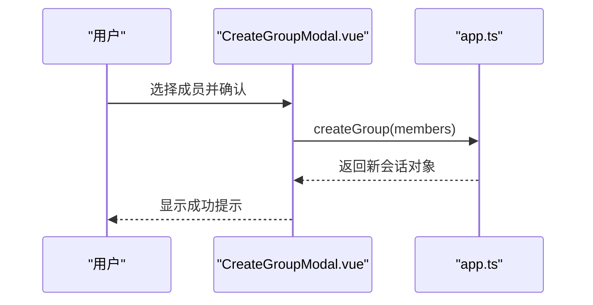

图表来源
- [CreateGroupModal.vue:120-140](file://linkx-client/src/components/chat/CreateGroupModal.vue#L120-L140)
- [app.ts:264-296](file://linkx-client/src/stores/app.ts#L264-L296)

### 邀请成员（含元数据更新）
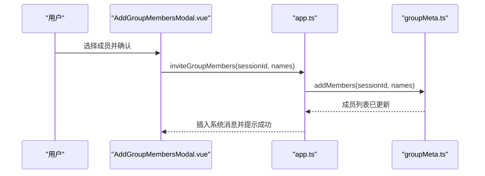

图表来源
- [AddGroupMembersModal.vue:82-103](file://linkx-client/src/components/chat/AddGroupMembersModal.vue#L82-L103)
- [app.ts:586-607](file://linkx-client/src/stores/app.ts#L586-L607)
- [groupMeta.ts:207-218](file://linkx-client/src/stores/groupMeta.ts#L207-L218)

### 群公告编辑与保存
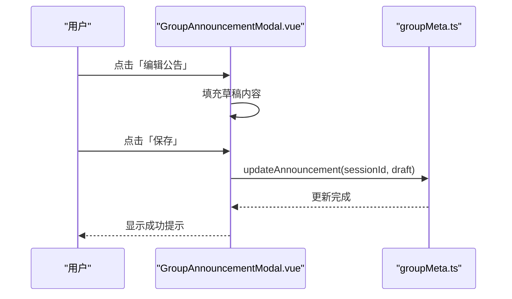

图表来源
- [GroupAnnouncementModal.vue:53-66](file://linkx-client/src/components/chat/GroupAnnouncementModal.vue#L53-L66)
- [groupMeta.ts:147-151](file://linkx-client/src/stores/groupMeta.ts#L147-L151)