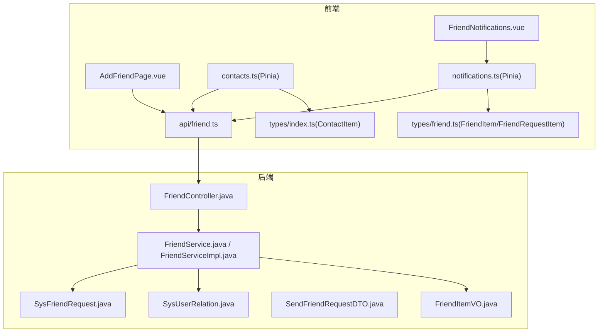
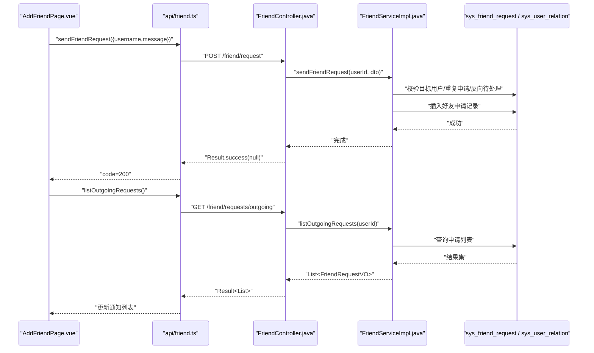
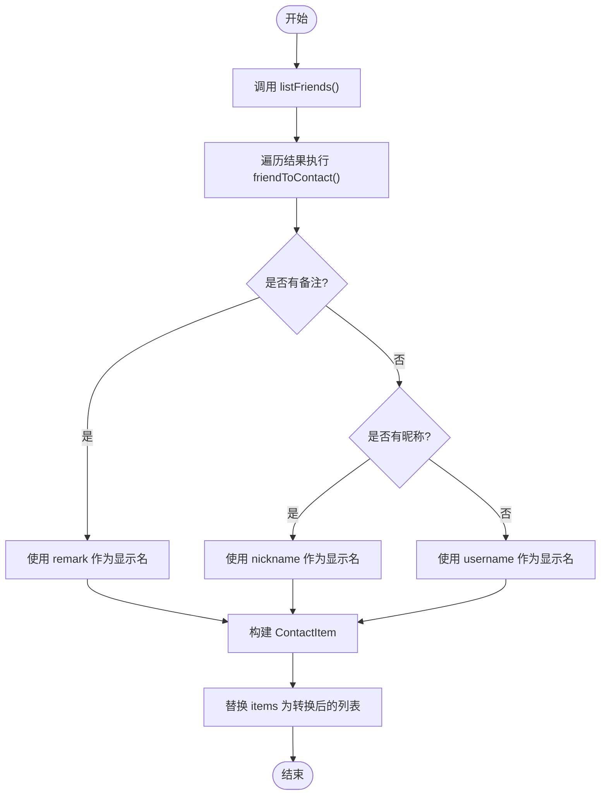
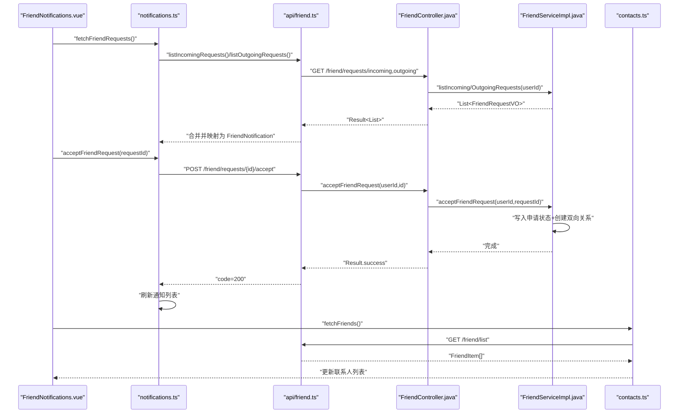
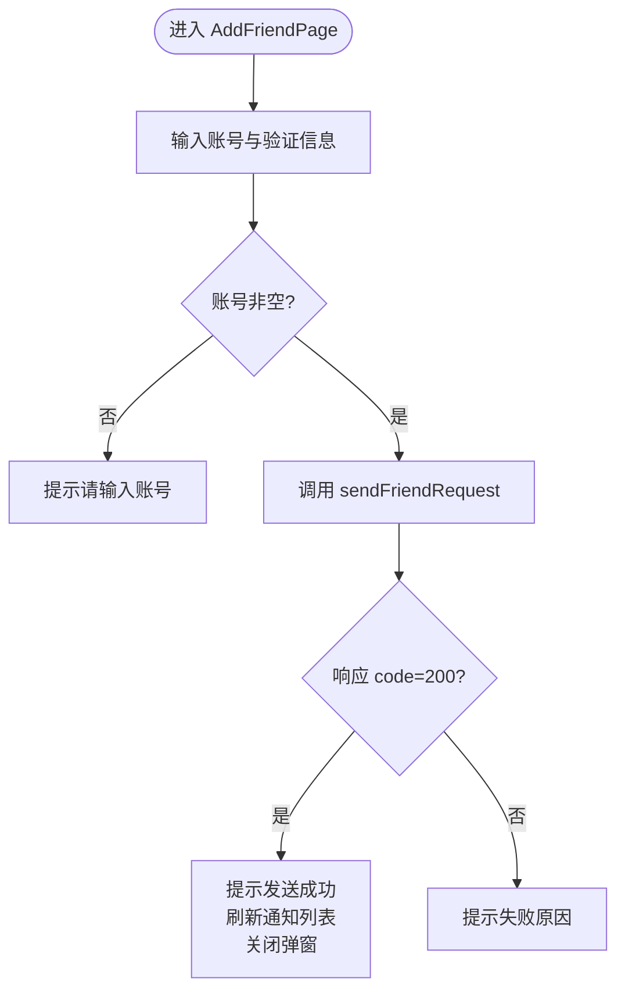
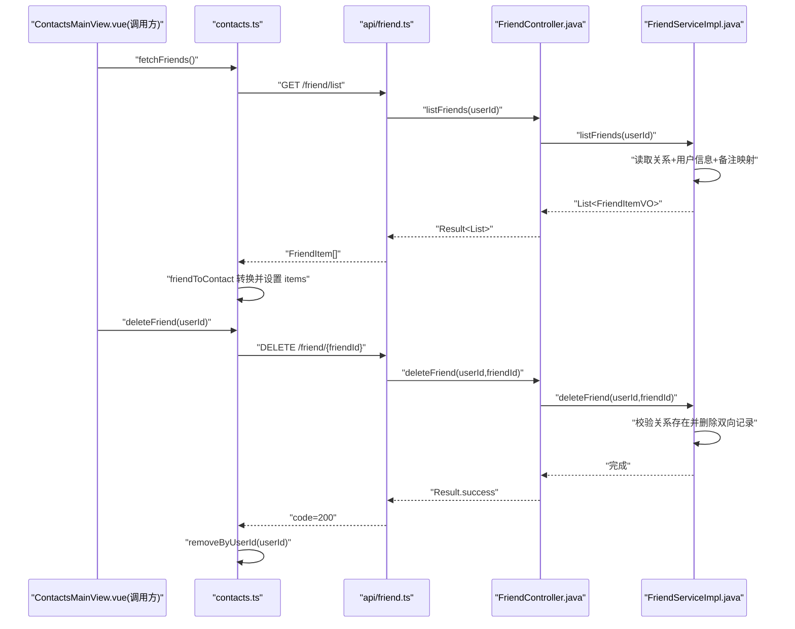
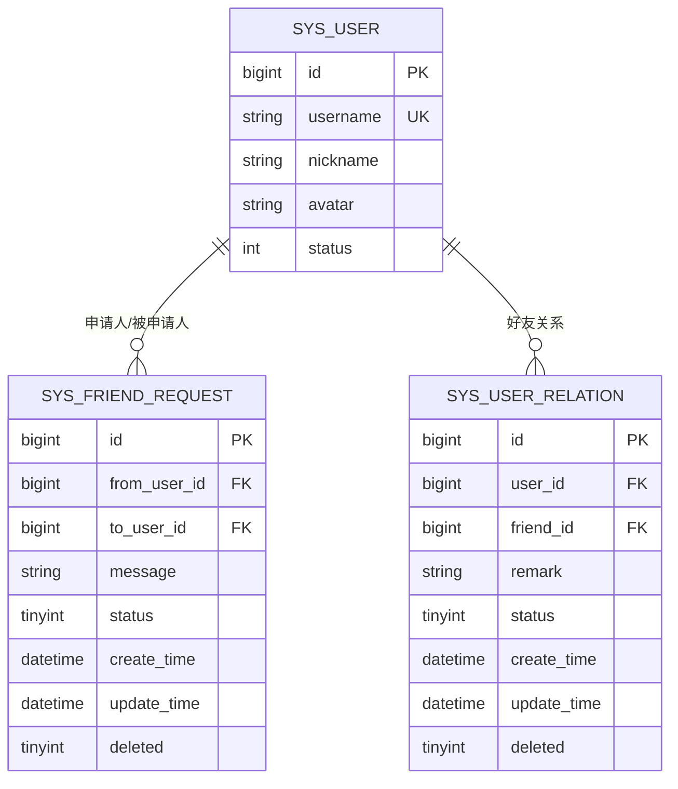
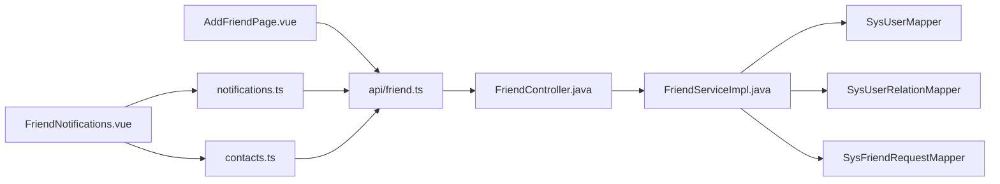

# 好友管理功能

<cite>
**本文引用的文件**
- [contacts.ts](file://linkx-client/src/stores/contacts.ts)
- [friend.ts](file://linkx-client/src/api/friend.ts)
- [notifications.ts](file://linkx-client/src/stores/notifications.ts)
- [AddFriendPage.vue](file://linkx-client/src/components/overlay/pages/AddFriendPage.vue)
- [FriendNotifications.vue](file://linkx-client/src/components/contacts/FriendNotifications.vue)
- [index.ts](file://linkx-client/src/types/index.ts)
- [friend.ts](file://linkx-client/src/types/friend.ts)
- [FriendController.java](file://linkx-server/src/main/java/com/linkx/server/controller/FriendController.java)
- [FriendService.java](file://linkx-server/src/main/java/com/linkx/server/service/FriendService.java)
- [FriendServiceImpl.java](file://linkx-server/src/main/java/com/linkx/server/service/impl/FriendServiceImpl.java)
- [SysFriendRequest.java](file://linkx-server/src/main/java/com/linkx/server/entity/SysFriendRequest.java)
- [SysUserRelation.java](file://linkx-server/src/main/java/com/linkx/server/entity/SysUserRelation.java)
- [SendFriendRequestDTO.java](file://linkx-server/src/main/java/com/linkx/server/controller/dto/SendFriendRequestDTO.java)
- [FriendItemVO.java](file://linkx-server/src/main/java/com/linkx/server/controller/vo/FriendItemVO.java)
- [001_add_user_profile_and_friend_tables.sql](file://linkx-server/migrations/001_add_user_profile_and_friend_tables.sql)
</cite>

## 目录
1. [简介](#简介)
2. [项目结构](#项目结构)
3. [核心组件](#核心组件)
4. [架构总览](#架构总览)
5. [详细组件分析](#详细组件分析)
6. [依赖关系分析](#依赖关系分析)
7. [性能考虑](#性能考虑)
8. [故障排查指南](#故障排查指南)
9. [结论](#结论)
10. [附录](#附录)

## 简介
本文件面向 LinkX 的“好友管理”功能，系统性梳理从前端到后端的完整实现：包括好友申请发送、接受/拒绝处理、好友列表查询与删除、联系人状态管理与数据转换（friendToContact）、以及前后端 API 交互流程。文档同时覆盖数据持久化模型、冲突解决策略（如重复申请、双向关系一致性）与错误处理机制，帮助读者快速理解并扩展该模块。

## 项目结构
- 前端
  - Pinia Store：联系人状态与通知状态分别由 contacts.ts 与 notifications.ts 维护。
  - API 层：统一封装在 friend.ts，提供搜索、申请、同意/拒绝、列表、删除等接口调用。
  - 页面组件：AddFriendPage.vue 负责发起好友申请；FriendNotifications.vue 负责展示与处理好友通知。
  - 类型定义：types/index.ts 中的 ContactItem 用于前端联系人展示；types/friend.ts 定义后端返回的 FriendItem、FriendRequestItem 等。
- 后端
  - Controller：FriendController 暴露 REST 接口，进行鉴权与参数校验。
  - Service：FriendService 接口与 FriendServiceImpl 实现业务逻辑，含搜索、申请、同意/拒绝、列表、删除等。
  - 实体与迁移：SysFriendRequest、SysUserRelation 对应数据库表，迁移脚本创建并维护索引。

图表来源
- [AddFriendPage.vue:1-66](file://linkx-client/src/components/overlay/pages/AddFriendPage.vue#L1-L66)
- [FriendNotifications.vue:1-256](file://linkx-client/src/components/contacts/FriendNotifications.vue#L1-L256)
- [contacts.ts:1-128](file://linkx-client/src/stores/contacts.ts#L1-L128)
- [notifications.ts:1-176](file://linkx-client/src/stores/notifications.ts#L1-L176)
- [friend.ts](file://linkx-client/src/api/friend.ts)
- [index.ts:86-96](file://linkx-client/src/types/index.ts#L86-L96)
- [friend.ts:1-38](file://linkx-client/src/types/friend.ts#L1-L38)
- [FriendController.java:1-96](file://linkx-server/src/main/java/com/linkx/server/controller/FriendController.java#L1-L96)
- [FriendService.java:1-28](file://linkx-server/src/main/java/com/linkx/server/service/FriendService.java#L1-L28)
- [FriendServiceImpl.java:1-333](file://linkx-server/src/main/java/com/linkx/server/service/impl/FriendServiceImpl.java#L1-L333)
- [SysFriendRequest.java:1-55](file://linkx-server/src/main/java/com/linkx/server/entity/SysFriendRequest.java#L1-L55)
- [SysUserRelation.java:1-71](file://linkx-server/src/main/java/com/linkx/server/entity/SysUserRelation.java#L1-L71)
- [SendFriendRequestDTO.java:1-17](file://linkx-server/src/main/java/com/linkx/server/controller/dto/SendFriendRequestDTO.java#L1-L17)
- [FriendItemVO.java:1-23](file://linkx-server/src/main/java/com/linkx/server/controller/vo/FriendItemVO.java#L1-L23)

章节来源
- [contacts.ts:1-128](file://linkx-client/src/stores/contacts.ts#L1-L128)
- [notifications.ts:1-176](file://linkx-client/src/stores/notifications.ts#L1-L176)
- [friend.ts](file://linkx-client/src/api/friend.ts)
- [AddFriendPage.vue:1-66](file://linkx-client/src/components/overlay/pages/AddFriendPage.vue#L1-L66)
- [FriendNotifications.vue:1-256](file://linkx-client/src/components/contacts/FriendNotifications.vue#L1-L256)
- [FriendController.java:1-96](file://linkx-server/src/main/java/com/linkx/server/controller/FriendController.java#L1-L96)
- [FriendServiceImpl.java:1-333](file://linkx-server/src/main/java/com/linkx/server/service/impl/FriendServiceImpl.java#L1-L333)
- [001_add_user_profile_and_friend_tables.sql:50-79](file://linkx-server/migrations/001_add_user_profile_and_friend_tables.sql#L50-L79)

## 核心组件
- 前端联系人 Store（contacts.ts）
  - 职责：维护本地联系人列表 items、加载态 loading；提供添加、删除、按用户 ID 删除、同步会话、拉取后端好友列表、重置等方法。
  - 关键转换：friendToContact 将后端 FriendItem 转换为前端 ContactItem，优先使用 remark，其次 nickname，最后 username 作为显示名。
  - 持久化：通过 persist 配置仅持久化 items 字段，键名为 linkx-contacts。
- 前端通知 Store（notifications.ts）
  - 职责：维护好友请求通知列表 friendNotifs、群邀请通知 groupNotifs；提供拉取、同意/拒绝、清空等操作。
  - 数据映射：mapRequestItem 将后端 FriendRequestItem 映射为前端 FriendNotification，包含方向、状态、时间格式化等。
- 前端 API 封装（api/friend.ts）
  - 提供 searchUsers、sendFriendRequest、listIncomingRequests、listOutgoingRequests、acceptFriendRequest、rejectFriendRequest、listFriends、deleteFriend 等函数，统一基于 apiClient 调用后端 REST。
- 前端页面组件
  - AddFriendPage.vue：表单输入账号与验证信息，提交 sendFriendRequest，成功后刷新通知并关闭弹窗。
  - FriendNotifications.vue：展示待处理通知，支持同意/拒绝操作，同意后刷新好友列表并尝试加入会话。
- 后端控制器与服务
  - FriendController：鉴权、参数校验、路由转发至服务层。
  - FriendServiceImpl：实现搜索、申请、同意/拒绝、列表、删除等核心逻辑，含并发与一致性保护。
- 数据模型与迁移
  - SysFriendRequest：好友申请记录，含状态机（待处理/已同意/已拒绝）。
  - SysUserRelation：双向好友关系，含备注、状态、时间戳与逻辑删除。
  - 迁移脚本：创建 sys_user_relation 与 sys_friend_request 表及必要索引。

章节来源
- [contacts.ts:13-24](file://linkx-client/src/stores/contacts.ts#L13-L24)
- [contacts.ts:26-127](file://linkx-client/src/stores/contacts.ts#L26-L127)
- [notifications.ts:68-87](file://linkx-client/src/stores/notifications.ts#L68-L87)
- [notifications.ts:89-176](file://linkx-client/src/stores/notifications.ts#L89-L176)
- [friend.ts](file://linkx-client/src/api/friend.ts)
- [AddFriendPage.vue:17-44](file://linkx-client/src/components/overlay/pages/AddFriendPage.vue#L17-L44)
- [FriendNotifications.vue:26-58](file://linkx-client/src/components/contacts/FriendNotifications.vue#L26-L58)
- [FriendController.java:26-86](file://linkx-server/src/main/java/com/linkx/server/controller/FriendController.java#L26-L86)
- [FriendServiceImpl.java:92-138](file://linkx-server/src/main/java/com/linkx/server/service/impl/FriendServiceImpl.java#L92-L138)
- [SysFriendRequest.java:24-55](file://linkx-server/src/main/java/com/linkx/server/entity/SysFriendRequest.java#L24-L55)
- [SysUserRelation.java:40-71](file://linkx-server/src/main/java/com/linkx/server/entity/SysUserRelation.java#L40-L71)
- [001_add_user_profile_and_friend_tables.sql:50-79](file://linkx-server/migrations/001_add_user_profile_and_friend_tables.sql#L50-L79)

## 架构总览
下图展示了好友管理的端到端流程：前端页面触发操作，调用 API 层，进入后端控制器与服务层，最终读写数据库实体。

图表来源
- [AddFriendPage.vue:17-44](file://linkx-client/src/components/overlay/pages/AddFriendPage.vue#L17-L44)
- [friend.ts:16-26](file://linkx-client/src/api/friend.ts#L16-L26)
- [FriendController.java:34-53](file://linkx-server/src/main/java/com/linkx/server/controller/FriendController.java#L34-L53)
- [FriendServiceImpl.java:92-138](file://linkx-server/src/main/java/com/linkx/server/service/impl/FriendServiceImpl.java#L92-L138)
- [001_add_user_profile_and_friend_tables.sql:66-79](file://linkx-server/migrations/001_add_user_profile_and_friend_tables.sql#L66-L79)

## 详细组件分析

### 联系人状态管理与数据转换（contacts.ts）
- 状态与计算属性
  - items：联系人数组，group 为“我的好友”的项视为真实好友。
  - friends：过滤出“我的好友”子集。
  - searchUsers：本地关键字模糊匹配。
- 动作方法
  - addContact/addByName/remove/removeByUserId：本地增删改。
  - deleteFriend：调用后端删除接口，成功后移除本地条目。
  - syncFriendFromSession：根据会话信息去重添加联系人。
  - fetchFriends：拉取后端好友列表，并通过 friendToContact 转换。
- 数据转换 friendToContact
  - 显示名优先级：remark → nickname → username。
  - 生成 avatarText 与固定 avatarColor，保留 avatarUrl。
  - 输出 ContactItem 结构，兼容前端展示与后续扩展。

图表来源
- [contacts.ts:103-115](file://linkx-client/src/stores/contacts.ts#L103-L115)
- [contacts.ts:13-24](file://linkx-client/src/stores/contacts.ts#L13-L24)
- [friend.ts:36-38](file://linkx-client/src/api/friend.ts#L36-L38)
- [index.ts:86-96](file://linkx-client/src/types/index.ts#L86-L96)
- [friend.ts:8-14](file://linkx-client/src/types/friend.ts#L8-L14)

章节来源
- [contacts.ts:26-127](file://linkx-client/src/stores/contacts.ts#L26-L127)
- [contacts.ts:13-24](file://linkx-client/src/stores/contacts.ts#L13-L24)
- [friend.ts:36-38](file://linkx-client/src/api/friend.ts#L36-L38)
- [index.ts:86-96](file://linkx-client/src/types/index.ts#L86-L96)
- [friend.ts:8-14](file://linkx-client/src/types/friend.ts#L8-L14)

### 好友通知与申请处理（notifications.ts + FriendNotifications.vue）
- 通知拉取
  - fetchFriendRequests 并行获取 incoming 与 outgoing 列表，合并并按 createTime 倒序排序。
  - mapRequestItem 将后端 FriendRequestItem 映射为前端 FriendNotification，包含方向、状态、时间格式化等。
- 同意/拒绝
  - acceptFriendRequest/rejectFriendRequest 调用后端接口，成功后刷新通知列表。
  - FriendNotifications.vue 在同意成功后，刷新好友列表并尝试加入会话。
- 状态映射
  - status 0→等待验证，1→已同意，2→已拒绝。

图表来源
- [FriendNotifications.vue:26-58](file://linkx-client/src/components/contacts/FriendNotifications.vue#L26-L58)
- [notifications.ts:105-144](file://linkx-client/src/stores/notifications.ts#L105-L144)
- [friend.ts:20-34](file://linkx-client/src/api/friend.ts#L20-L34)
- [FriendController.java:43-71](file://linkx-server/src/main/java/com/linkx/server/controller/FriendController.java#L43-L71)
- [FriendServiceImpl.java:161-176](file://linkx-server/src/main/java/com/linkx/server/service/impl/FriendServiceImpl.java#L161-L176)
- [contacts.ts:103-115](file://linkx-client/src/stores/contacts.ts#L103-L115)

章节来源
- [notifications.ts:68-87](file://linkx-client/src/stores/notifications.ts#L68-L87)
- [notifications.ts:105-144](file://linkx-client/src/stores/notifications.ts#L105-L144)
- [FriendNotifications.vue:26-58](file://linkx-client/src/components/contacts/FriendNotifications.vue#L26-L58)
- [friend.ts:20-34](file://linkx-client/src/api/friend.ts#L20-L34)
- [FriendController.java:43-71](file://linkx-server/src/main/java/com/linkx/server/controller/FriendController.java#L43-L71)
- [FriendServiceImpl.java:161-176](file://linkx-server/src/main/java/com/linkx/server/service/impl/FriendServiceImpl.java#L161-L176)
- [contacts.ts:103-115](file://linkx-client/src/stores/contacts.ts#L103-L115)

### 好友申请发送（AddFriendPage.vue + api/friend.ts + FriendController + FriendServiceImpl）
- 前端
  - AddFriendPage.vue 收集账号与验证信息，调用 sendFriendRequest。
  - 成功后刷新通知列表并关闭弹窗。
- 后端
  - FriendController 接收 DTO，校验用户名长度与消息长度。
  - FriendServiceImpl.sendFriendRequest 校验目标用户存在、非本人、非已好友；若存在反向待处理申请则自动同意；否则插入新申请。

图表来源
- [AddFriendPage.vue:17-44](file://linkx-client/src/components/overlay/pages/AddFriendPage.vue#L17-L44)
- [friend.ts:16-18](file://linkx-client/src/api/friend.ts#L16-L18)
- [FriendController.java:34-41](file://linkx-server/src/main/java/com/linkx/server/controller/FriendController.java#L34-L41)
- [SendFriendRequestDTO.java:7-16](file://linkx-server/src/main/java/com/linkx/server/controller/dto/SendFriendRequestDTO.java#L7-L16)
- [FriendServiceImpl.java:92-138](file://linkx-server/src/main/java/com/linkx/server/service/impl/FriendServiceImpl.java#L92-L138)

章节来源
- [AddFriendPage.vue:17-44](file://linkx-client/src/components/overlay/pages/AddFriendPage.vue#L17-L44)
- [friend.ts:16-18](file://linkx-client/src/api/friend.ts#L16-L18)
- [FriendController.java:34-41](file://linkx-server/src/main/java/com/linkx/server/controller/FriendController.java#L34-L41)
- [SendFriendRequestDTO.java:7-16](file://linkx-server/src/main/java/com/linkx/server/controller/dto/SendFriendRequestDTO.java#L7-L16)
- [FriendServiceImpl.java:92-138](file://linkx-server/src/main/java/com/linkx/server/service/impl/FriendServiceImpl.java#L92-L138)

### 好友列表与删除（contacts.ts + FriendController + FriendServiceImpl）
- 列表
  - contacts.ts 的 fetchFriends 调用 listFriends，后端返回 FriendItem[]，前端通过 friendToContact 转换。
- 删除
  - contacts.ts 的 deleteFriend 调用后端删除接口，成功后按 userId 移除本地条目。
  - 后端 FriendServiceImpl.deleteFriend 校验双方关系存在，删除双向关系记录。

图表来源
- [contacts.ts:103-115](file://linkx-client/src/stores/contacts.ts#L103-L115)
- [contacts.ts:71-77](file://linkx-client/src/stores/contacts.ts#L71-L77)
- [friend.ts:36-42](file://linkx-client/src/api/friend.ts#L36-L42)
- [FriendController.java:73-86](file://linkx-server/src/main/java/com/linkx/server/controller/FriendController.java#L73-L86)
- [FriendServiceImpl.java:194-243](file://linkx-server/src/main/java/com/linkx/server/service/impl/FriendServiceImpl.java#L194-L243)

章节来源
- [contacts.ts:103-115](file://linkx-client/src/stores/contacts.ts#L103-L115)
- [contacts.ts:71-77](file://linkx-client/src/stores/contacts.ts#L71-L77)
- [friend.ts:36-42](file://linkx-client/src/api/friend.ts#L36-L42)
- [FriendController.java:73-86](file://linkx-server/src/main/java/com/linkx/server/controller/FriendController.java#L73-L86)
- [FriendServiceImpl.java:194-243](file://linkx-server/src/main/java/com/linkx/server/service/impl/FriendServiceImpl.java#L194-L243)

### 数据模型与持久化（后端实体与迁移）
- 好友申请表 sys_friend_request
  - 字段：id、from_user_id、to_user_id、message、status、create_time、update_time、deleted。
  - 状态：0=待处理，1=已同意，2=已拒绝。
- 好友关系表 sys_user_relation
  - 字段：id、user_id、friend_id、remark、status、create_time、update_time、deleted。
  - 唯一约束：(user_id, friend_id)，避免重复关系。
- 索引优化
  - idx_to_user_status、idx_from_user、idx_user_id、idx_friend_id 提升查询性能。

图表来源
- [SysFriendRequest.java:24-55](file://linkx-server/src/main/java/com/linkx/server/entity/SysFriendRequest.java#L24-L55)
- [SysUserRelation.java:40-71](file://linkx-server/src/main/java/com/linkx/server/entity/SysUserRelation.java#L40-L71)
- [001_add_user_profile_and_friend_tables.sql:50-79](file://linkx-server/migrations/001_add_user_profile_and_friend_tables.sql#L50-L79)

章节来源
- [SysFriendRequest.java:24-55](file://linkx-server/src/main/java/com/linkx/server/entity/SysFriendRequest.java#L24-L55)
- [SysUserRelation.java:40-71](file://linkx-server/src/main/java/com/linkx/server/entity/SysUserRelation.java#L40-L71)
- [001_add_user_profile_and_friend_tables.sql:50-79](file://linkx-server/migrations/001_add_user_profile_and_friend_tables.sql#L50-L79)

## 依赖关系分析
- 前端依赖
  - AddFriendPage.vue 依赖 api/friend.ts 与 notifications.ts。
  - FriendNotifications.vue 依赖 notifications.ts 与 contacts.ts。
  - contacts.ts 依赖 api/friend.ts 与 types/index.ts。
  - notifications.ts 依赖 api/friend.ts 与 types/friend.ts。
- 后端依赖
  - FriendController 依赖 JwtUtils、AuthUtils、FriendService。
  - FriendServiceImpl 依赖 SysUserMapper、SysUserRelationMapper、SysFriendRequestMapper。
  - VO/DTO 用于接口契约与序列化。

图表来源
- [AddFriendPage.vue:1-66](file://linkx-client/src/components/overlay/pages/AddFriendPage.vue#L1-L66)
- [FriendNotifications.vue:1-256](file://linkx-client/src/components/contacts/FriendNotifications.vue#L1-L256)
- [notifications.ts:1-176](file://linkx-client/src/stores/notifications.ts#L1-L176)
- [contacts.ts:1-128](file://linkx-client/src/stores/contacts.ts#L1-L128)
- [friend.ts](file://linkx-client/src/api/friend.ts)
- [FriendController.java:1-96](file://linkx-server/src/main/java/com/linkx/server/controller/FriendController.java#L1-L96)
- [FriendServiceImpl.java:1-333](file://linkx-server/src/main/java/com/linkx/server/service/impl/FriendServiceImpl.java#L1-L333)

章节来源
- [AddFriendPage.vue:1-66](file://linkx-client/src/components/overlay/pages/AddFriendPage.vue#L1-L66)
- [FriendNotifications.vue:1-256](file://linkx-client/src/components/contacts/FriendNotifications.vue#L1-L256)
- [notifications.ts:1-176](file://linkx-client/src/stores/notifications.ts#L1-L176)
- [contacts.ts:1-128](file://linkx-client/src/stores/contacts.ts#L1-L128)
- [friend.ts](file://linkx-client/src/api/friend.ts)
- [FriendController.java:1-96](file://linkx-server/src/main/java/com/linkx/server/controller/FriendController.java#L1-L96)
- [FriendServiceImpl.java:1-333](file://linkx-server/src/main/java/com/linkx/server/service/impl/FriendServiceImpl.java#L1-L333)

## 性能考虑
- 前端
  - 本地搜索使用字符串包含匹配，适合小规模联系人列表；当联系人规模增长时，可引入前缀树或分词索引。
  - 通知列表合并与排序在内存中完成，建议对 createTime 做规范化存储与比较。
- 后端
  - 搜索接口限制返回数量（SEARCH_LIMIT），避免大结果集。
  - 关系与申请查询使用索引列（to_user_id、status、from_user_id、user_id、friend_id），提升查询效率。
  - 批量组装 VO 时使用 Map 减少多次查询开销。

[本节为通用性能建议，不直接分析具体文件]

## 故障排查指南
- 常见错误码与提示
  - 搜索关键词过短：抛出异常提示至少2个字符。
  - 用户不存在：发送申请时目标用户不存在。
  - 不能添加自己为好友：自加检测。
  - 对方已是你的好友：重复好友关系检测。
  - 已发送好友申请，请等待对方处理：重复申请检测。
  - 无权处理该好友申请：权限校验失败。
  - 该申请已处理：状态非待处理。
  - 对方不是你的好友：删除时关系不存在。
  - 无效的申请 ID：ID 解析失败。
- 定位步骤
  - 检查前端 API 响应结构与错误消息。
  - 核对后端日志与异常堆栈，确认事务是否回滚。
  - 验证数据库记录状态与索引命中情况。

章节来源
- [FriendServiceImpl.java:40-81](file://linkx-server/src/main/java/com/linkx/server/service/impl/FriendServiceImpl.java#L40-L81)
- [FriendServiceImpl.java:92-138](file://linkx-server/src/main/java/com/linkx/server/service/impl/FriendServiceImpl.java#L92-L138)
- [FriendServiceImpl.java:161-192](file://linkx-server/src/main/java/com/linkx/server/service/impl/FriendServiceImpl.java#L161-L192)
- [FriendServiceImpl.java:235-243](file://linkx-server/src/main/java/com/linkx/server/service/impl/FriendServiceImpl.java#L235-L243)
- [FriendController.java:88-94](file://linkx-server/src/main/java/com/linkx/server/controller/FriendController.java#L88-L94)

## 结论
LinkX 的好友管理功能在前端通过 Pinia Store 集中管理状态，结合清晰的 API 封装与组件交互，实现了完整的生命周期管理。后端以 Controller-Service-Mapper 分层设计，配合严格的校验与事务控制，确保数据一致性与幂等性。通过合理的索引设计与结果集限制，整体具备较好的可扩展性与性能表现。

[本节为总结性内容，不直接分析具体文件]

## 附录
- 前端类型参考
  - ContactItem：联系人展示结构。
  - FriendItem/FriendRequestItem：后端返回的数据结构。
- 后端 VO/DTO 参考
  - SendFriendRequestDTO：发送申请请求体。
  - FriendItemVO：好友列表项视图对象。

章节来源
- [index.ts:86-96](file://linkx-client/src/types/index.ts#L86-L96)
- [friend.ts:1-38](file://linkx-client/src/types/friend.ts#L1-L38)
- [SendFriendRequestDTO.java:7-16](file://linkx-server/src/main/java/com/linkx/server/controller/dto/SendFriendRequestDTO.java#L7-L16)
- [FriendItemVO.java:8-22](file://linkx-server/src/main/java/com/linkx/server/controller/vo/FriendItemVO.java#L8-L22)