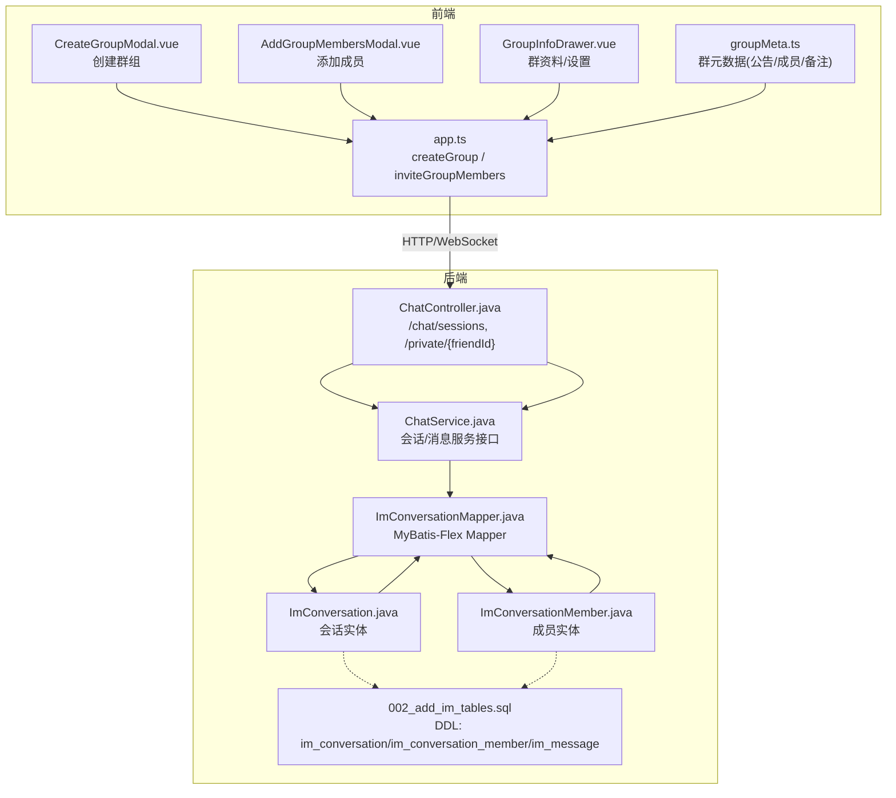
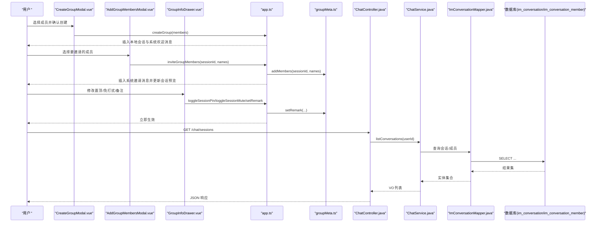
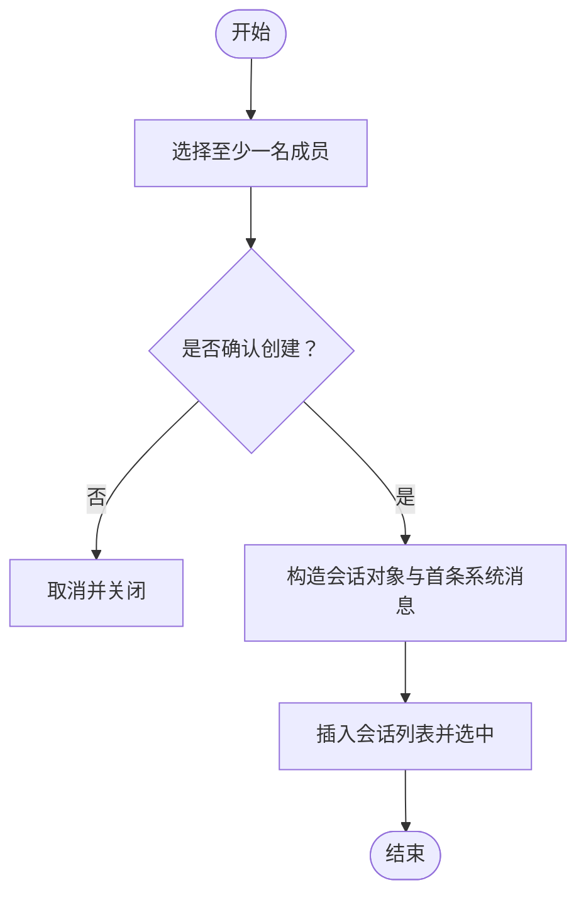
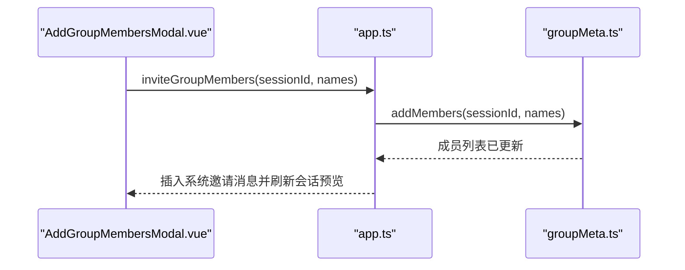
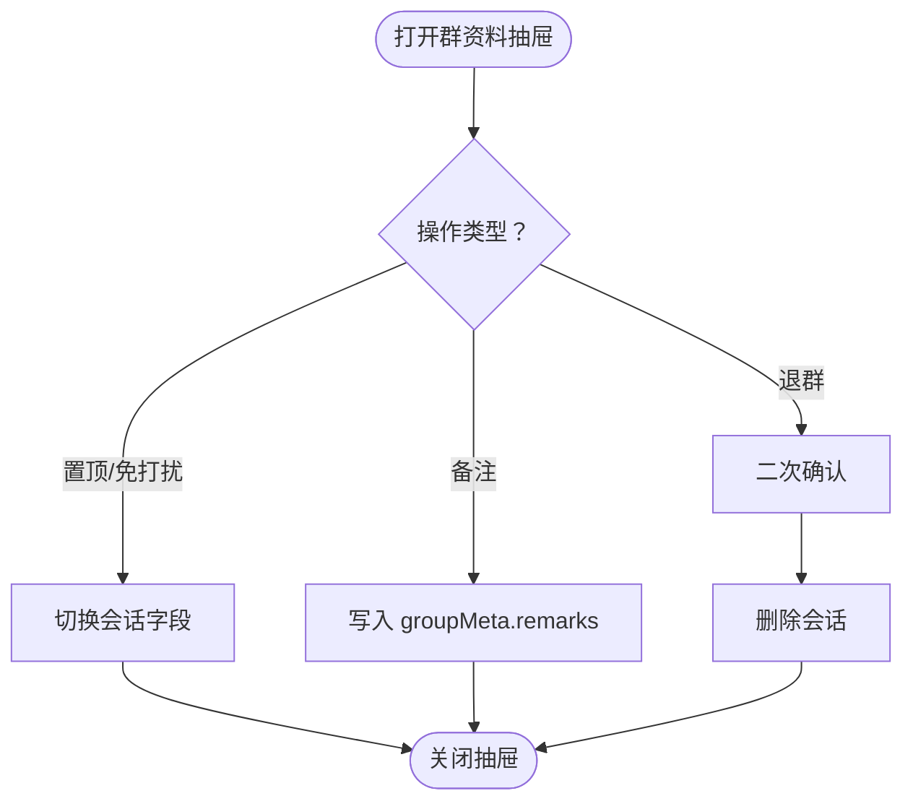
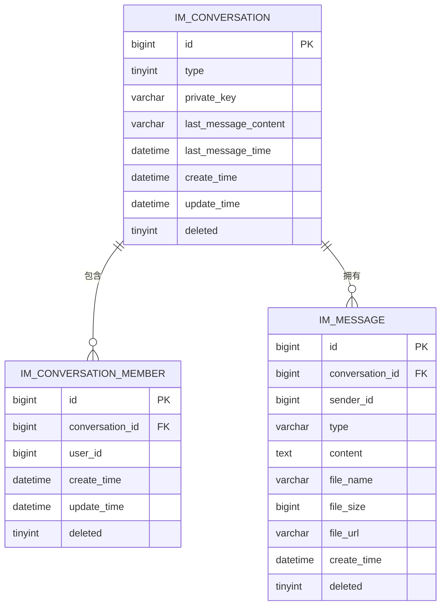
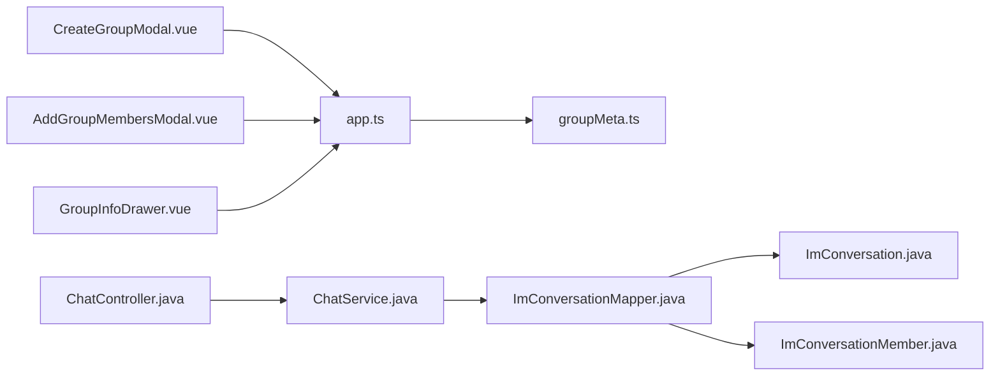

# 群组管理功能

<cite>
**本文引用的文件**   
- [ImConversation.java](file://linkx-server/src/main/java/com/linkx/server/entity/ImConversation.java)
- [ImConversationMember.java](file://linkx-server/src/main/java/com/linkx/server/entity/ImConversationMember.java)
- [002_add_im_tables.sql](file://linkx-server/migrations/002_add_im_tables.sql)
- [ChatController.java](file://linkx-server/src/main/java/com/linkx/server/controller/ChatController.java)
- [ChatService.java](file://linkx-server/src/main/java/com/linkx/server/service/ChatService.java)
- [ImConversationMapper.java](file://linkx-server/src/main/java/com/linkx/server/mapper/ImConversationMapper.java)
- [CreateGroupModal.vue](file://linkx-client/src/components/chat/CreateGroupModal.vue)
- [AddGroupMembersModal.vue](file://linkx-client/src/components/chat/AddGroupMembersModal.vue)
- [GroupInfoDrawer.vue](file://linkx-client/src/components/chat/GroupInfoDrawer.vue)
- [app.ts](file://linkx-client/src/stores/app.ts)
- [groupMeta.ts](file://linkx-client/src/stores/groupMeta.ts)
</cite>

## 目录
1. [简介](#简介)
2. [项目结构](#项目结构)
3. [核心组件](#核心组件)
4. [架构总览](#架构总览)
5. [详细组件分析](#详细组件分析)
6. [依赖关系分析](#依赖关系分析)
7. [性能与一致性](#性能与一致性)
8. [故障排查指南](#故障排查指南)
9. [结论](#结论)
10. [附录：数据模型与接口](#附录数据模型与接口)

## 简介
本文件面向 LinkX 的“群组管理”能力，围绕群组的完整生命周期展开，包括：
- 群组创建、成员邀请、权限与设置（置顶、免打扰、备注）
- 群组通知系统（前端侧滑抽屉、公告、精华、成员变更的系统消息）
- 数据结构设计（会话、成员、消息表）
- 数据同步与一致性策略（本地乐观更新 + WebSocket 确认替换）

文档以“从用户操作到后端持久化”的全链路视角，结合前后端代码路径，给出可追溯的实现说明。

## 项目结构
群组相关的前端交互集中在聊天模块的弹窗与抽屉组件中，状态由 Pinia Store 统一管理；后端提供会话与成员的持久化实体与基础 API。

图表来源
- [CreateGroupModal.vue:1-140](file://linkx-client/src/components/chat/CreateGroupModal.vue#L1-L140)
- [AddGroupMembersModal.vue:1-103](file://linkx-client/src/components/chat/AddGroupMembersModal.vue#L1-L103)
- [GroupInfoDrawer.vue:1-127](file://linkx-client/src/components/chat/GroupInfoDrawer.vue#L1-L127)
- [app.ts:264-333](file://linkx-client/src/stores/app.ts#L264-L333)
- [app.ts:586-612](file://linkx-client/src/stores/app.ts#L586-L612)
- [groupMeta.ts:104-218](file://linkx-client/src/stores/groupMeta.ts#L104-L218)
- [ChatController.java:22-72](file://linkx-server/src/main/java/com/linkx/server/controller/ChatController.java#L22-L72)
- [ChatService.java:11-25](file://linkx-server/src/main/java/com/linkx/server/service/ChatService.java#L11-L25)
- [ImConversation.java:16-47](file://linkx-server/src/main/java/com/linkx/server/entity/ImConversation.java#L16-L47)
- [ImConversationMember.java:16-40](file://linkx-server/src/main/java/com/linkx/server/entity/ImConversationMember.java#L16-L40)
- [ImConversationMapper.java:1-10](file://linkx-server/src/main/java/com/linkx/server/mapper/ImConversationMapper.java#L1-L10)
- [002_add_im_tables.sql:6-29](file://linkx-server/migrations/002_add_im_tables.sql#L6-L29)

章节来源
- [CreateGroupModal.vue:1-140](file://linkx-client/src/components/chat/CreateGroupModal.vue#L1-L140)
- [AddGroupMembersModal.vue:1-103](file://linkx-client/src/components/chat/AddGroupMembersModal.vue#L1-L103)
- [GroupInfoDrawer.vue:1-127](file://linkx-client/src/components/chat/GroupInfoDrawer.vue#L1-L127)
- [app.ts:264-333](file://linkx-client/src/stores/app.ts#L264-L333)
- [app.ts:586-612](file://linkx-client/src/stores/app.ts#L586-L612)
- [groupMeta.ts:104-218](file://linkx-client/src/stores/groupMeta.ts#L104-L218)
- [ChatController.java:22-72](file://linkx-server/src/main/java/com/linkx/server/controller/ChatController.java#L22-L72)
- [ChatService.java:11-25](file://linkx-server/src/main/java/com/linkx/server/service/ChatService.java#L11-L25)
- [ImConversation.java:16-47](file://linkx-server/src/main/java/com/linkx/server/entity/ImConversation.java#L16-L47)
- [ImConversationMember.java:16-40](file://linkx-server/src/main/java/com/linkx/server/entity/ImConversationMember.java#L16-L40)
- [ImConversationMapper.java:1-10](file://linkx-server/src/main/java/com/linkx/server/mapper/ImConversationMapper.java#L1-L10)
- [002_add_im_tables.sql:6-29](file://linkx-server/migrations/002_add_im_tables.sql#L6-L29)

## 核心组件
- 前端交互层
  - 创建群组：CreateGroupModal.vue 负责选择好友并触发 app.ts 的 createGroup
  - 添加成员：AddGroupMembersModal.vue 负责选择联系人并调用 app.ts 的 inviteGroupMembers
  - 群资料与设置：GroupInfoDrawer.vue 展示成员、公告、置顶/免打扰、备注、退群等
- 前端状态层
  - app.ts：会话列表、消息、WebSocket 收发、群组创建/邀请/退群等核心动作
  - groupMeta.ts：群公告、精华、成员、备注、文件、相册等元数据（按 sessionId 懒加载）
- 后端持久化层
  - 实体：ImConversation（会话）、ImConversationMember（成员）
  - 映射：ImConversationMapper（基于 MyBatis-Flex）
  - 迁移：002_add_im_tables.sql（会话、成员、消息表结构）
  - 控制器与服务：ChatController、ChatService（当前暴露会话列表、私聊打开、消息拉取与上传等）

章节来源
- [CreateGroupModal.vue:1-140](file://linkx-client/src/components/chat/CreateGroupModal.vue#L1-L140)
- [AddGroupMembersModal.vue:1-103](file://linkx-client/src/components/chat/AddGroupMembersModal.vue#L1-L103)
- [GroupInfoDrawer.vue:1-127](file://linkx-client/src/components/chat/GroupInfoDrawer.vue#L1-L127)
- [app.ts:264-333](file://linkx-client/src/stores/app.ts#L264-L333)
- [app.ts:586-612](file://linkx-client/src/stores/app.ts#L586-L612)
- [groupMeta.ts:104-218](file://linkx-client/src/stores/groupMeta.ts#L104-L218)
- [ImConversation.java:16-47](file://linkx-server/src/main/java/com/linkx/server/entity/ImConversation.java#L16-L47)
- [ImConversationMember.java:16-40](file://linkx-server/src/main/java/com/linkx/server/entity/ImConversationMember.java#L16-L40)
- [ImConversationMapper.java:1-10](file://linkx-server/src/main/java/com/linkx/server/mapper/ImConversationMapper.java#L1-L10)
- [002_add_im_tables.sql:6-29](file://linkx-server/migrations/002_add_im_tables.sql#L6-L29)
- [ChatController.java:22-72](file://linkx-server/src/main/java/com/linkx/server/controller/ChatController.java#L22-L72)
- [ChatService.java:11-25](file://linkx-server/src/main/java/com/linkx/server/service/ChatService.java#L11-L25)

## 架构总览
群组管理的端到端流程如下：
- 前端通过弹窗/抽屉收集用户意图（创建、邀请、设置）
- 通过 app.ts 聚合业务逻辑，必要时调用后端 HTTP 或 WebSocket
- 后端通过 ChatController 暴露 REST 接口，ChatService 编排业务，持久化到数据库
- 前端使用 groupMeta.ts 维护群元数据，配合 app.ts 实现 UI 即时反馈

图表来源
- [CreateGroupModal.vue:120-135](file://linkx-client/src/components/chat/CreateGroupModal.vue#L120-L135)
- [AddGroupMembersModal.vue:82-97](file://linkx-client/src/components/chat/AddGroupMembersModal.vue#L82-L97)
- [GroupInfoDrawer.vue:69-121](file://linkx-client/src/components/chat/GroupInfoDrawer.vue#L69-L121)
- [app.ts:264-296](file://linkx-client/src/stores/app.ts#L264-L296)
- [app.ts:586-607](file://linkx-client/src/stores/app.ts#L586-L607)
- [groupMeta.ts:207-218](file://linkx-client/src/stores/groupMeta.ts#L207-L218)
- [ChatController.java:30-34](file://linkx-server/src/main/java/com/linkx/server/controller/ChatController.java#L30-L34)
- [ChatService.java:13-14](file://linkx-server/src/main/java/com/linkx/server/service/ChatService.java#L13-L14)
- [ImConversationMapper.java:7-9](file://linkx-server/src/main/java/com/linkx/server/mapper/ImConversationMapper.java#L7-L9)
- [002_add_im_tables.sql:6-29](file://linkx-server/migrations/002_add_im_tables.sql#L6-L29)

## 详细组件分析

### 群组创建流程
- 入口：CreateGroupModal.vue 左侧选择好友，右侧预览已选成员，点击确定后调用 app.ts 的 createGroup
- 行为：
  - 生成唯一 id、时间戳与群名（优先传入名，否则拼接成员名或默认“群聊（N人）”）
  - 写入首条系统消息“系统：XXX 发起了群聊”
  - 将新会话插入会话列表顶部并选中
- 示例路径
  - 选择与确认：[CreateGroupModal.vue:120-135](file://linkx-client/src/components/chat/CreateGroupModal.vue#L120-L135)
  - 创建会话与系统消息：[app.ts:264-296](file://linkx-client/src/stores/app.ts#L264-L296)

图表来源
- [CreateGroupModal.vue:120-135](file://linkx-client/src/components/chat/CreateGroupModal.vue#L120-L135)
- [app.ts:264-296](file://linkx-client/src/stores/app.ts#L264-L296)

章节来源
- [CreateGroupModal.vue:120-135](file://linkx-client/src/components/chat/CreateGroupModal.vue#L120-L135)
- [app.ts:264-296](file://linkx-client/src/stores/app.ts#L264-L296)

### 成员邀请机制
- 入口：AddGroupMembersModal.vue 选择联系人并确认邀请
- 行为：
  - 调用 app.ts 的 inviteGroupMembers(sessionId, names)
  - 在 groupMeta.ts 中按姓名去重添加成员
  - 插入系统消息“系统：XXX 邀请了 YYY 加入群聊”，并更新会话预览
- 示例路径
  - 选择与确认：[AddGroupMembersModal.vue:82-97](file://linkx-client/src/components/chat/AddGroupMembersModal.vue#L82-L97)
  - 邀请处理与系统消息：[app.ts:586-607](file://linkx-client/src/stores/app.ts#L586-L607)
  - 成员去重添加：[groupMeta.ts:207-218](file://linkx-client/src/stores/groupMeta.ts#L207-L218)

图表来源
- [AddGroupMembersModal.vue:82-97](file://linkx-client/src/components/chat/AddGroupMembersModal.vue#L82-L97)
- [app.ts:586-607](file://linkx-client/src/stores/app.ts#L586-L607)
- [groupMeta.ts:207-218](file://linkx-client/src/stores/groupMeta.ts#L207-L218)

章节来源
- [AddGroupMembersModal.vue:82-97](file://linkx-client/src/components/chat/AddGroupMembersModal.vue#L82-L97)
- [app.ts:586-607](file://linkx-client/src/stores/app.ts#L586-L607)
- [groupMeta.ts:207-218](file://linkx-client/src/stores/groupMeta.ts#L207-L218)

### 群组信息更新机制（置顶/免打扰/备注/退群）
- 入口：GroupInfoDrawer.vue
- 行为：
  - 置顶/免打扰：直接切换 app.ts 中的会话字段
  - 备注：写入 groupMeta.ts 的 remarks 映射
  - 退群：等价于删除该会话（本地）
- 示例路径
  - 置顶/免打扰：[GroupInfoDrawer.vue:69-79](file://linkx-client/src/components/chat/GroupInfoDrawer.vue#L69-L79)
  - 备注保存：[GroupInfoDrawer.vue:51-57](file://linkx-client/src/components/chat/GroupInfoDrawer.vue#L51-L57)
  - 退群确认与执行：[GroupInfoDrawer.vue:107-121](file://linkx-client/src/components/chat/GroupInfoDrawer.vue#L107-L121)
  - 对应动作：[app.ts:542-552](file://linkx-client/src/stores/app.ts#L542-L552), [app.ts:609-612](file://linkx-client/src/stores/app.ts#L609-L612)

图表来源
- [GroupInfoDrawer.vue:69-79](file://linkx-client/src/components/chat/GroupInfoDrawer.vue#L69-L79)
- [GroupInfoDrawer.vue:51-57](file://linkx-client/src/components/chat/GroupInfoDrawer.vue#L51-L57)
- [GroupInfoDrawer.vue:107-121](file://linkx-client/src/components/chat/GroupInfoDrawer.vue#L107-L121)
- [app.ts:542-552](file://linkx-client/src/stores/app.ts#L542-L552)
- [app.ts:609-612](file://linkx-client/src/stores/app.ts#L609-L612)

章节来源
- [GroupInfoDrawer.vue:69-79](file://linkx-client/src/components/chat/GroupInfoDrawer.vue#L69-L79)
- [GroupInfoDrawer.vue:51-57](file://linkx-client/src/components/chat/GroupInfoDrawer.vue#L51-L57)
- [GroupInfoDrawer.vue:107-121](file://linkx-client/src/components/chat/GroupInfoDrawer.vue#L107-L121)
- [app.ts:542-552](file://linkx-client/src/stores/app.ts#L542-L552)
- [app.ts:609-612](file://linkx-client/src/stores/app.ts#L609-L612)

### 群组通知系统（前端侧）
- 系统消息：创建群、邀请成员、加入群等场景均会插入 type=system 的消息，用于在会话中展示事件
- 群公告：groupMeta.ts 提供 announcementFor/announcementShort/updateAnnouncement，支持短摘要与全文
- 示例路径
  - 创建群系统消息：[app.ts:284-293](file://linkx-client/src/stores/app.ts#L284-L293)
  - 邀请系统消息：[app.ts:589-601](file://linkx-client/src/stores/app.ts#L589-L601)
  - 公告读取与短摘要：[groupMeta.ts:120-140](file://linkx-client/src/stores/groupMeta.ts#L120-L140)

章节来源
- [app.ts:284-293](file://linkx-client/src/stores/app.ts#L284-L293)
- [app.ts:589-601](file://linkx-client/src/stores/app.ts#L589-L601)
- [groupMeta.ts:120-140](file://linkx-client/src/stores/groupMeta.ts#L120-L140)

### 后端数据模型与持久化
- 会话表 im_conversation
  - 关键字段：id、type(1单聊/2群聊)、private_key、last_message_content、last_message_time、create_time、update_time、deleted
- 成员表 im_conversation_member
  - 关键字段：id、conversation_id、user_id、create_time、update_time、deleted
  - 约束：(conversation_id, user_id) 唯一索引，避免重复成员
- 消息表 im_message
  - 关键字段：id、conversation_id、sender_id、type、content、file_*、create_time、deleted
- 示例路径
  - 实体定义：[ImConversation.java:16-47](file://linkx-server/src/main/java/com/linkx/server/entity/ImConversation.java#L16-L47), [ImConversationMember.java:16-40](file://linkx-server/src/main/java/com/linkx/server/entity/ImConversationMember.java#L16-L40)
  - 映射器：[ImConversationMapper.java:7-9](file://linkx-server/src/main/java/com/linkx/server/mapper/ImConversationMapper.java#L7-L9)
  - 建表脚本：[002_add_im_tables.sql:6-29](file://linkx-server/migrations/002_add_im_tables.sql#L6-L29)

图表来源
- [ImConversation.java:16-47](file://linkx-server/src/main/java/com/linkx/server/entity/ImConversation.java#L16-L47)
- [ImConversationMember.java:16-40](file://linkx-server/src/main/java/com/linkx/server/entity/ImConversationMember.java#L16-L40)
- [002_add_im_tables.sql:6-44](file://linkx-server/migrations/002_add_im_tables.sql#L6-L44)

章节来源
- [ImConversation.java:16-47](file://linkx-server/src/main/java/com/linkx/server/entity/ImConversation.java#L16-L47)
- [ImConversationMember.java:16-40](file://linkx-server/src/main/java/com/linkx/server/entity/ImConversationMember.java#L16-L40)
- [ImConversationMapper.java:7-9](file://linkx-server/src/main/java/com/linkx/server/mapper/ImConversationMapper.java#L7-L9)
- [002_add_im_tables.sql:6-44](file://linkx-server/migrations/002_add_im_tables.sql#L6-L44)

### 后端接口与权限校验
- 会话列表：GET /chat/sessions
- 私聊会话打开：POST /chat/private/{friendId}
- 历史消息：GET /chat/sessions/{conversationId}/messages
- 文件上传：POST /chat/sessions/{conversationId}/upload
- 权限校验：通过 JwtUtils 提取 userId，并在需要时进行会话成员校验（ChatService.assertConversationMember）
- 示例路径
  - 控制器路由与鉴权：[ChatController.java:30-62](file://linkx-server/src/main/java/com/linkx/server/controller/ChatController.java#L30-L62)
  - 服务接口定义：[ChatService.java:11-25](file://linkx-server/src/main/java/com/linkx/server/service/ChatService.java#L11-L25)

章节来源
- [ChatController.java:30-62](file://linkx-server/src/main/java/com/linkx/server/controller/ChatController.java#L30-L62)
- [ChatService.java:11-25](file://linkx-server/src/main/java/com/linkx/server/service/ChatService.java#L11-L25)

## 依赖关系分析
- 前端组件依赖 Pinia Store（app.ts、groupMeta.ts），Store 之间通过 import/useStore 组合
- 后端 Controller 依赖 Service，Service 依赖 Mapper，Mapper 依赖数据库实体与 DDL
- 关键耦合点
  - CreateGroupModal.vue → app.ts.createGroup
  - AddGroupMembersModal.vue → app.ts.inviteGroupMembers → groupMeta.ts.addMembers
  - GroupInfoDrawer.vue → app.ts.toggleSessionPin/toggleSessionMute/clearSessionMessages/leaveGroup
  - ChatController → ChatService → ImConversationMapper → 数据库

图表来源
- [CreateGroupModal.vue:120-135](file://linkx-client/src/components/chat/CreateGroupModal.vue#L120-L135)
- [AddGroupMembersModal.vue:82-97](file://linkx-client/src/components/chat/AddGroupMembersModal.vue#L82-L97)
- [GroupInfoDrawer.vue:69-121](file://linkx-client/src/components/chat/GroupInfoDrawer.vue#L69-L121)
- [app.ts:264-296](file://linkx-client/src/stores/app.ts#L264-L296)
- [app.ts:586-607](file://linkx-client/src/stores/app.ts#L586-L607)
- [groupMeta.ts:207-218](file://linkx-client/src/stores/groupMeta.ts#L207-L218)
- [ChatController.java:30-62](file://linkx-server/src/main/java/com/linkx/server/controller/ChatController.java#L30-L62)
- [ChatService.java:11-25](file://linkx-server/src/main/java/com/linkx/server/service/ChatService.java#L11-L25)
- [ImConversationMapper.java:7-9](file://linkx-server/src/main/java/com/linkx/server/mapper/ImConversationMapper.java#L7-L9)
- [ImConversation.java:16-47](file://linkx-server/src/main/java/com/linkx/server/entity/ImConversation.java#L16-L47)
- [ImConversationMember.java:16-40](file://linkx-server/src/main/java/com/linkx/server/entity/ImConversationMember.java#L16-L40)

章节来源
- [CreateGroupModal.vue:120-135](file://linkx-client/src/components/chat/CreateGroupModal.vue#L120-L135)
- [AddGroupMembersModal.vue:82-97](file://linkx-client/src/components/chat/AddGroupMembersModal.vue#L82-L97)
- [GroupInfoDrawer.vue:69-121](file://linkx-client/src/components/chat/GroupInfoDrawer.vue#L69-L121)
- [app.ts:264-296](file://linkx-client/src/stores/app.ts#L264-L296)
- [app.ts:586-607](file://linkx-client/src/stores/app.ts#L586-L607)
- [groupMeta.ts:207-218](file://linkx-client/src/stores/groupMeta.ts#L207-L218)
- [ChatController.java:30-62](file://linkx-server/src/main/java/com/linkx/server/controller/ChatController.java#L30-L62)
- [ChatService.java:11-25](file://linkx-server/src/main/java/com/linkx/server/service/ChatService.java#L11-L25)
- [ImConversationMapper.java:7-9](file://linkx-server/src/main/java/com/linkx/server/mapper/ImConversationMapper.java#L7-L9)
- [ImConversation.java:16-47](file://linkx-server/src/main/java/com/linkx/server/entity/ImConversation.java#L16-L47)
- [ImConversationMember.java:16-40](file://linkx-server/src/main/java/com/linkx/server/entity/ImConversationMember.java#L16-L40)

## 性能与一致性
- 前端性能
  - 懒加载：groupMeta.ts 对群公告、精华、成员、文件、相册按需初始化，减少初始渲染开销
  - 去重与增量：邀请成员按姓名去重；消息加载采用分页 with beforeId 游标
- 一致性策略
  - 乐观更新：创建群、邀请成员、发送消息均在本地先插入系统消息或临时消息，保证 UI 即时反馈
  - 服务端确认：真实会话通过 WebSocket 发送消息，收到 ack 后用服务端消息替换本地临时消息，确保最终一致
  - 幂等性：im_conversation_member 的唯一索引 (conversation_id, user_id) 防止重复成员
- 参考路径
  - 懒加载与去重：[groupMeta.ts:195-218](file://linkx-client/src/stores/groupMeta.ts#L195-L218)
  - 乐观消息与替换：[app.ts:654-748](file://linkx-client/src/stores/app.ts#L654-L748)
  - 唯一约束：[002_add_im_tables.sql:26-28](file://linkx-server/migrations/002_add_im_tables.sql#L26-L28)

章节来源
- [groupMeta.ts:195-218](file://linkx-client/src/stores/groupMeta.ts#L195-L218)
- [app.ts:654-748](file://linkx-client/src/stores/app.ts#L654-L748)
- [002_add_im_tables.sql:26-28](file://linkx-server/migrations/002_add_im_tables.sql#L26-L28)

## 故障排查指南
- 常见问题
  - 无法创建群：检查是否选择了至少一名成员；确认 app.ts.createGroup 返回的会话是否正确插入
  - 邀请无效：确认 selected 非空且 currentSessionId 存在；查看 groupMeta.ts.addMembers 是否成功去重添加
  - 置顶/免打扰未生效：确认 GroupInfoDrawer.vue 触发的 toggleSessionPin/toggleSessionMute 是否命中当前会话
  - 备注未保存：确认 @blur 事件触发 saveRemark，并检查 groupMeta.ts.setRemark 是否写入
  - 退出群失败：确认 leaveGroup 调用 deleteSession 后当前会话指针是否回退到有效会话
- 定位路径
  - 创建群：[CreateGroupModal.vue:120-135](file://linkx-client/src/components/chat/CreateGroupModal.vue#L120-L135), [app.ts:264-296](file://linkx-client/src/stores/app.ts#L264-L296)
  - 邀请成员：[AddGroupMembersModal.vue:82-97](file://linkx-client/src/components/chat/AddGroupMembersModal.vue#L82-L97), [groupMeta.ts:207-218](file://linkx-client/src/stores/groupMeta.ts#L207-L218)
  - 设置与备注：[GroupInfoDrawer.vue:69-79](file://linkx-client/src/components/chat/GroupInfoDrawer.vue#L69-L79), [GroupInfoDrawer.vue:51-57](file://linkx-client/src/components/chat/GroupInfoDrawer.vue#L51-L57)
  - 退群：[GroupInfoDrawer.vue:107-121](file://linkx-client/src/components/chat/GroupInfoDrawer.vue#L107-L121), [app.ts:609-612](file://linkx-client/src/stores/app.ts#L609-L612)

章节来源
- [CreateGroupModal.vue:120-135](file://linkx-client/src/components/chat/CreateGroupModal.vue#L120-L135)
- [app.ts:264-296](file://linkx-client/src/stores/app.ts#L264-L296)
- [AddGroupMembersModal.vue:82-97](file://linkx-client/src/components/chat/AddGroupMembersModal.vue#L82-L97)
- [groupMeta.ts:207-218](file://linkx-client/src/stores/groupMeta.ts#L207-L218)
- [GroupInfoDrawer.vue:69-79](file://linkx-client/src/components/chat/GroupInfoDrawer.vue#L69-L79)
- [GroupInfoDrawer.vue:51-57](file://linkx-client/src/components/chat/GroupInfoDrawer.vue#L51-L57)
- [GroupInfoDrawer.vue:107-121](file://linkx-client/src/components/chat/GroupInfoDrawer.vue#L107-L121)
- [app.ts:609-612](file://linkx-client/src/stores/app.ts#L609-L612)

## 结论
LinkX 的群组管理在前端以组件+Store 的方式实现了完整的生命周期闭环：创建、邀请、设置与通知。后端提供了会话与成员的持久化基础能力，并通过唯一索引保障成员关系的一致性。前端采用乐观更新与 WebSocket 确认替换的策略，兼顾体验与一致性。后续可在现有基础上扩展更多群权限（如管理员/群主角色）、群公告/文件的后端持久化与多端同步。

## 附录：数据模型与接口
- 数据模型
  - 会话：im_conversation（类型、最后消息预览与时间、软删除）
  - 成员：im_conversation_member（会话-用户唯一约束）
  - 消息：im_message（会话、发送者、内容、附件、时间、软删除）
- 接口（部分）
  - GET /chat/sessions：获取会话列表
  - POST /chat/private/{friendId}：打开或创建私聊会话
  - GET /chat/sessions/{conversationId}/messages：分页拉取历史消息
  - POST /chat/sessions/{conversationId}/upload：上传聊天文件
- 参考路径
  - 接口定义：[ChatController.java:30-62](file://linkx-server/src/main/java/com/linkx/server/controller/ChatController.java#L30-L62)
  - 服务接口：[ChatService.java:11-25](file://linkx-server/src/main/java/com/linkx/server/service/ChatService.java#L11-L25)
  - 数据模型：[ImConversation.java:16-47](file://linkx-server/src/main/java/com/linkx/server/entity/ImConversation.java#L16-L47), [ImConversationMember.java:16-40](file://linkx-server/src/main/java/com/linkx/server/entity/ImConversationMember.java#L16-L40), [002_add_im_tables.sql:6-44](file://linkx-server/migrations/002_add_im_tables.sql#L6-L44)

章节来源
- [ChatController.java:30-62](file://linkx-server/src/main/java/com/linkx/server/controller/ChatController.java#L30-L62)
- [ChatService.java:11-25](file://linkx-server/src/main/java/com/linkx/server/service/ChatService.java#L11-L25)
- [ImConversation.java:16-47](file://linkx-server/src/main/java/com/linkx/server/entity/ImConversation.java#L16-L47)
- [ImConversationMember.java:16-40](file://linkx-server/src/main/java/com/linkx/server/entity/ImConversationMember.java#L16-L40)
- [002_add_im_tables.sql:6-44](file://linkx-server/migrations/002_add_im_tables.sql#L6-L44)