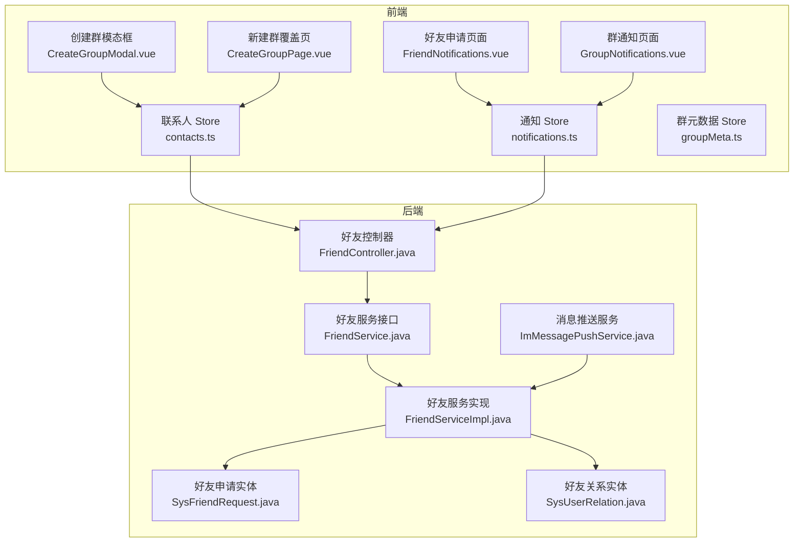
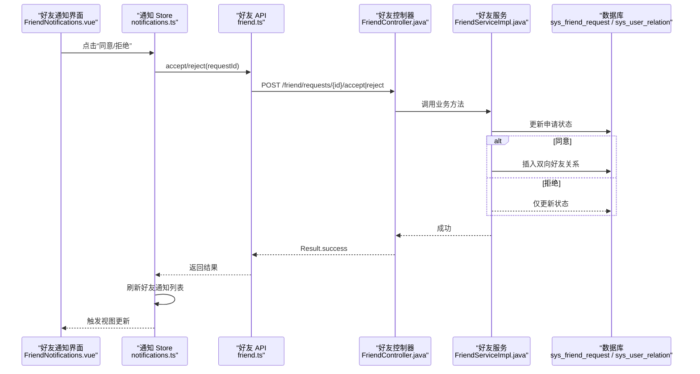
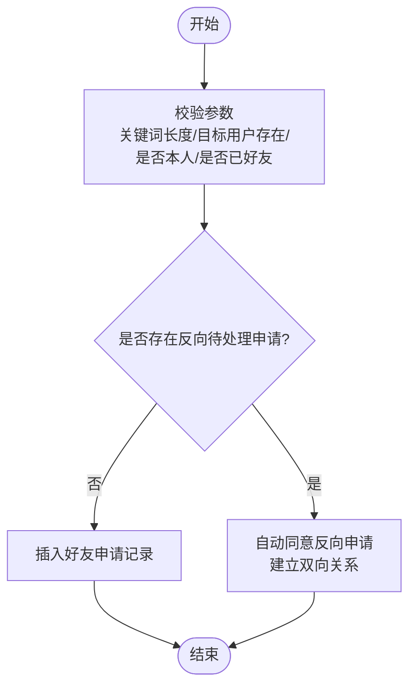
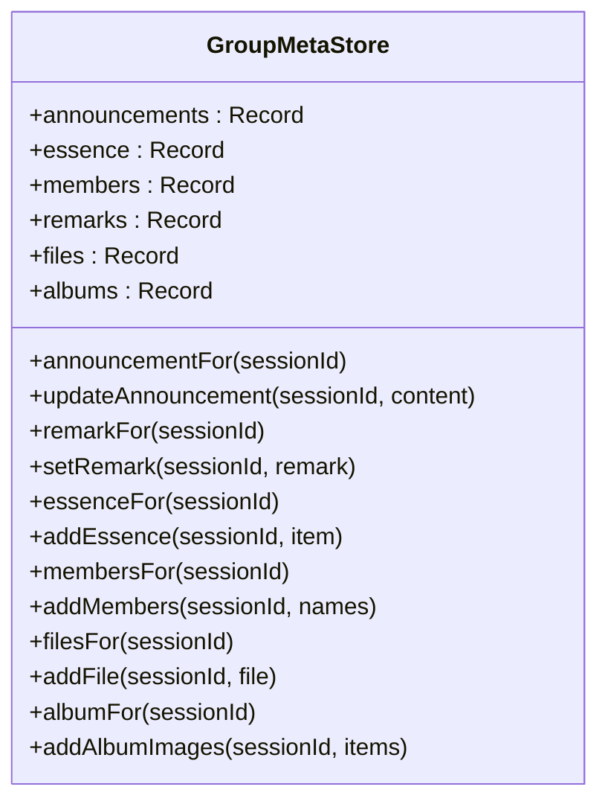
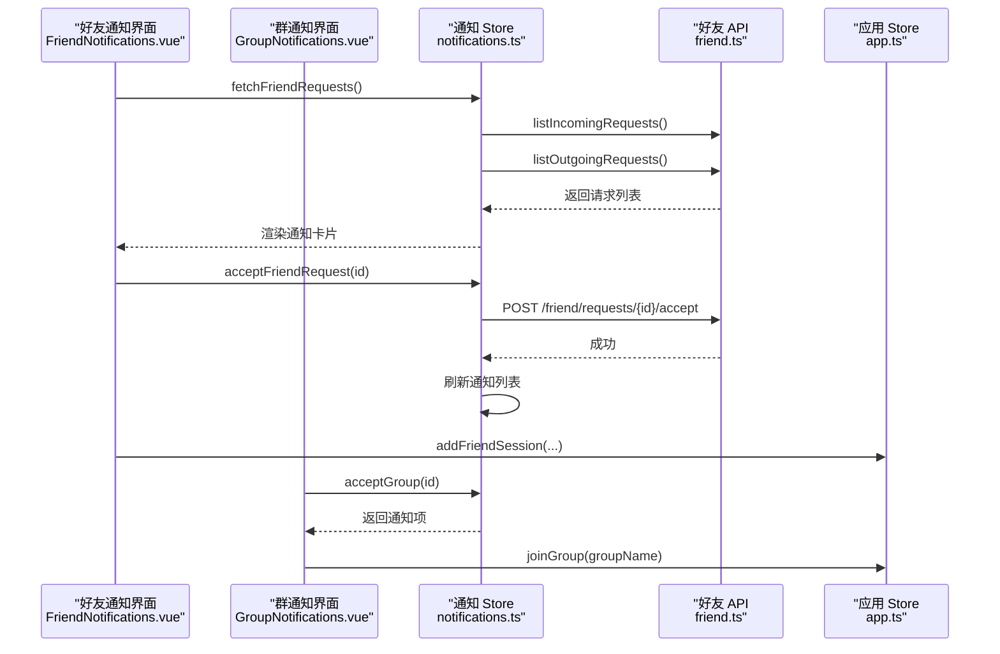
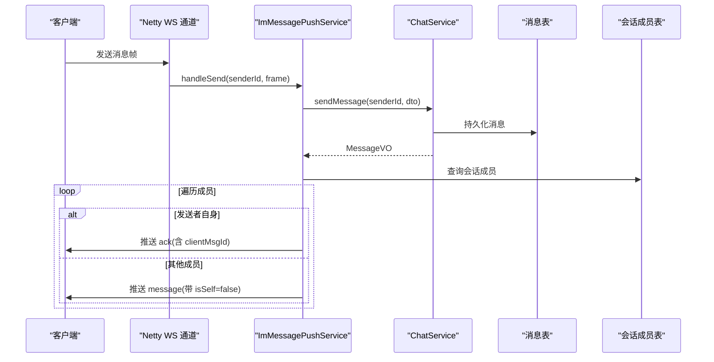
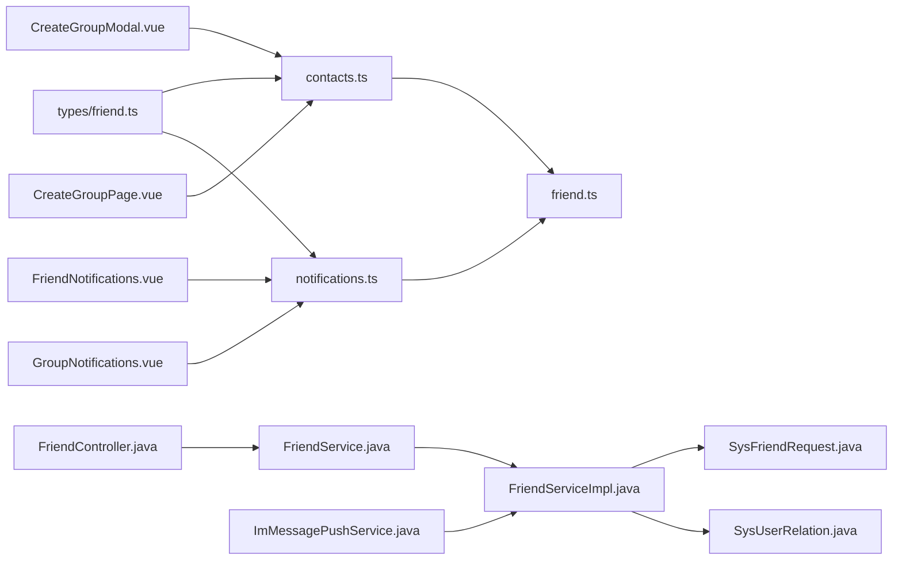

# 联系人管理系统

<cite>
**本文引用的文件**
- [linkx-client/src/stores/contacts.ts](file://linkx-client/src/stores/contacts.ts)
- [linkx-client/src/api/friend.ts](file://linkx-client/src/api/friend.ts)
- [linkx-server/src/main/java/com/linkx/server/controller/FriendController.java](file://linkx-server/src/main/java/com/linkx/server/controller/FriendController.java)
- [linkx-server/src/main/java/com/linkx/server/service/FriendService.java](file://linkx-server/src/main/java/com/linkx/server/service/FriendService.java)
- [linkx-server/src/main/java/com/linkx/server/service/impl/FriendServiceImpl.java](file://linkx-server/src/main/java/com/linkx/server/service/impl/FriendServiceImpl.java)
- [linkx-server/src/main/java/com/linkx/server/entity/SysFriendRequest.java](file://linkx-server/src/main/java/com/linkx/server/entity/SysFriendRequest.java)
- [linkx-server/src/main/java/com/linkx/server/entity/SysUserRelation.java](file://linkx-server/src/main/java/com/linkx/server/entity/SysUserRelation.java)
- [linkx-client/src/types/friend.ts](file://linkx-client/src/types/friend.ts)
- [linkx-client/src/stores/groupMeta.ts](file://linkx-client/src/stores/groupMeta.ts)
- [linkx-client/src/components/overlay/pages/CreateGroupPage.vue](file://linkx-client/src/components/overlay/pages/CreateGroupPage.vue)
- [linkx-client/src/components/chat/CreateGroupModal.vue](file://linkx-client/src/components/chat/CreateGroupModal.vue)
- [linkx-client/src/stores/notifications.ts](file://linkx-client/src/stores/notifications.ts)
- [linkx-client/src/components/contacts/FriendNotifications.vue](file://linkx-client/src/components/contacts/FriendNotifications.vue)
- [linkx-client/src/components/contacts/GroupNotifications.vue](file://linkx-client/src/components/contacts/GroupNotifications.vue)
- [linkx-server/src/main/java/com/linkx/server/im/ImMessagePushService.java](file://linkx-server/src/main/java/com/linkx/server/im/ImMessagePushService.java)
</cite>

## 目录
1. [简介](#简介)
2. [项目结构](#项目结构)
3. [核心组件](#核心组件)
4. [架构总览](#架构总览)
5. [详细组件分析](#详细组件分析)
6. [依赖关系分析](#依赖关系分析)
7. [性能考虑](#性能考虑)
8. [故障排查指南](#故障排查指南)
9. [结论](#结论)
10. [附录](#附录)

## 简介
本文件为 LinkX 联系人管理系统的实现文档，聚焦以下能力：
- 好友关系管理：搜索用户、发送/处理好友申请、双向关系建立与删除、好友列表同步。
- 群组管理：创建群聊、邀请成员、群元数据（公告、精华、成员、备注、文件、相册）的本地管理与持久化。
- 通知系统：好友申请与群邀请的通知展示、审批流程、状态更新与消息推送机制。
- 前端状态管理：联系人列表、通知、群元数据的响应式状态设计与数据同步策略。
- 后端服务：REST API 控制器与服务层实现、实体模型与事务性操作。

## 项目结构
本项目采用前后端分离架构：
- 前端（Vue + Pinia + Naive UI）：负责联系人列表、好友申请、群组创建与管理、通知展示与交互。
- 后端（Spring Boot + MyBatis-Flex + Netty WebSocket）：提供好友关系与聊天消息等 REST/WS 接口，维护数据库与在线通道。

图表来源
- [linkx-client/src/stores/contacts.ts:1-128](file://linkx-client/src/stores/contacts.ts#L1-L128)
- [linkx-client/src/stores/notifications.ts:1-176](file://linkx-client/src/stores/notifications.ts#L1-L176)
- [linkx-client/src/stores/groupMeta.ts:1-289](file://linkx-client/src/stores/groupMeta.ts#L1-L289)
- [linkx-client/src/components/contacts/FriendNotifications.vue:1-256](file://linkx-client/src/components/contacts/FriendNotifications.vue#L1-L256)
- [linkx-client/src/components/contacts/GroupNotifications.vue:1-232](file://linkx-client/src/components/contacts/GroupNotifications.vue#L1-L232)
- [linkx-client/src/components/chat/CreateGroupModal.vue:1-483](file://linkx-client/src/components/chat/CreateGroupModal.vue#L1-L483)
- [linkx-client/src/components/overlay/pages/CreateGroupPage.vue:1-82](file://linkx-client/src/components/overlay/pages/CreateGroupPage.vue#L1-L82)
- [linkx-server/src/main/java/com/linkx/server/controller/FriendController.java:1-96](file://linkx-server/src/main/java/com/linkx/server/controller/FriendController.java#L1-L96)
- [linkx-server/src/main/java/com/linkx/server/service/FriendService.java:1-28](file://linkx-server/src/main/java/com/linkx/server/service/FriendService.java#L1-L28)
- [linkx-server/src/main/java/com/linkx/server/service/impl/FriendServiceImpl.java:1-333](file://linkx-server/src/main/java/com/linkx/server/service/impl/FriendServiceImpl.java#L1-L333)
- [linkx-server/src/main/java/com/linkx/server/entity/SysFriendRequest.java:1-55](file://linkx-server/src/main/java/com/linkx/server/entity/SysFriendRequest.java#L1-L55)
- [linkx-server/src/main/java/com/linkx/server/entity/SysUserRelation.java:1-71](file://linkx-server/src/main/java/com/linkx/server/entity/SysUserRelation.java#L1-L71)
- [linkx-server/src/main/java/com/linkx/server/im/ImMessagePushService.java:1-136](file://linkx-server/src/main/java/com/linkx/server/im/ImMessagePushService.java#L1-L136)

章节来源
- [linkx-client/src/stores/contacts.ts:1-128](file://linkx-client/src/stores/contacts.ts#L1-L128)
- [linkx-client/src/stores/notifications.ts:1-176](file://linkx-client/src/stores/notifications.ts#L1-L176)
- [linkx-client/src/stores/groupMeta.ts:1-289](file://linkx-client/src/stores/groupMeta.ts#L1-L289)
- [linkx-client/src/components/contacts/FriendNotifications.vue:1-256](file://linkx-client/src/components/contacts/FriendNotifications.vue#L1-L256)
- [linkx-client/src/components/contacts/GroupNotifications.vue:1-232](file://linkx-client/src/components/contacts/GroupNotifications.vue#L1-L232)
- [linkx-client/src/components/chat/CreateGroupModal.vue:1-483](file://linkx-client/src/components/chat/CreateGroupModal.vue#L1-L483)
- [linkx-client/src/components/overlay/pages/CreateGroupPage.vue:1-82](file://linkx-client/src/components/overlay/pages/CreateGroupPage.vue#L1-L82)
- [linkx-server/src/main/java/com/linkx/server/controller/FriendController.java:1-96](file://linkx-server/src/main/java/com/linkx/server/controller/FriendController.java#L1-L96)
- [linkx-server/src/main/java/com/linkx/server/service/FriendService.java:1-28](file://linkx-server/src/main/java/com/linkx/server/service/FriendService.java#L1-L28)
- [linkx-server/src/main/java/com/linkx/server/service/impl/FriendServiceImpl.java:1-333](file://linkx-server/src/main/java/com/linkx/server/service/impl/FriendServiceImpl.java#L1-L333)
- [linkx-server/src/main/java/com/linkx/server/entity/SysFriendRequest.java:1-55](file://linkx-server/src/main/java/com/linkx/server/entity/SysFriendRequest.java#L1-L55)
- [linkx-server/src/main/java/com/linkx/server/entity/SysUserRelation.java:1-71](file://linkx-server/src/main/java/com/linkx/server/entity/SysUserRelation.java#L1-L71)
- [linkx-server/src/main/java/com/linkx/server/im/ImMessagePushService.java:1-136](file://linkx-server/src/main/java/com/linkx/server/im/ImMessagePushService.java#L1-L136)

## 核心组件
- 联系人 Store（contacts.ts）
  - 职责：维护联系人列表、从会话同步联系人、拉取后端好友列表、删除好友。
  - 关键点：将后端 FriendItem 映射为前端 ContactItem；按 group 过滤“我的好友”；支持本地持久化。
- 通知 Store（notifications.ts）
  - 职责：聚合好友请求（incoming/outgoing）、转换状态与时间格式、调用 API 同意/拒绝、刷新列表。
  - 关键点：并行获取 incoming/outgoing 请求，合并排序；群通知为本地演示数据。
- 群元数据 Store（groupMeta.ts）
  - 职责：按 sessionId 懒加载并持久化群公告、精华、成员、备注、文件、相册。
  - 关键点：默认值填充、去重添加成员、新增记录插入头部。
- 好友控制器与服务（FriendController/FriendService/FriendServiceImpl）
  - 职责：搜索用户、发送/查询/处理好友申请、建立双向好友关系、删除好友。
  - 关键点：幂等处理反向申请自动同意；事务性写入关系；批量查询优化。
- 消息推送服务（ImMessagePushService）
  - 职责：基于 Netty 向会话成员推送消息或 ACK；构造不同视角的消息体。
  - 关键点：根据 senderId 区分 ack/message；序列化异常兜底。

章节来源
- [linkx-client/src/stores/contacts.ts:1-128](file://linkx-client/src/stores/contacts.ts#L1-L128)
- [linkx-client/src/stores/notifications.ts:1-176](file://linkx-client/src/stores/notifications.ts#L1-L176)
- [linkx-client/src/stores/groupMeta.ts:1-289](file://linkx-client/src/stores/groupMeta.ts#L1-L289)
- [linkx-server/src/main/java/com/linkx/server/controller/FriendController.java:1-96](file://linkx-server/src/main/java/com/linkx/server/controller/FriendController.java#L1-L96)
- [linkx-server/src/main/java/com/linkx/server/service/FriendService.java:1-28](file://linkx-server/src/main/java/com/linkx/server/service/FriendService.java#L1-L28)
- [linkx-server/src/main/java/com/linkx/server/service/impl/FriendServiceImpl.java:1-333](file://linkx-server/src/main/java/com/linkx/server/service/impl/FriendServiceImpl.java#L1-L333)
- [linkx-server/src/main/java/com/linkx/server/im/ImMessagePushService.java:1-136](file://linkx-server/src/main/java/com/linkx/server/im/ImMessagePushService.java#L1-L136)

## 架构总览
下图展示了好友申请与通知处理的端到端流程，包括前端 Store、API 层、后端控制器与服务层、实体与数据库。

图表来源
- [linkx-client/src/components/contacts/FriendNotifications.vue:1-256](file://linkx-client/src/components/contacts/FriendNotifications.vue#L1-L256)
- [linkx-client/src/stores/notifications.ts:1-176](file://linkx-client/src/stores/notifications.ts#L1-L176)
- [linkx-client/src/api/friend.ts:1-43](file://linkx-client/src/api/friend.ts#L1-L43)
- [linkx-server/src/main/java/com/linkx/server/controller/FriendController.java:1-96](file://linkx-server/src/main/java/com/linkx/server/controller/FriendController.java#L1-L96)
- [linkx-server/src/main/java/com/linkx/server/service/impl/FriendServiceImpl.java:1-333](file://linkx-server/src/main/java/com/linkx/server/service/impl/FriendServiceImpl.java#L1-L333)
- [linkx-server/src/main/java/com/linkx/server/entity/SysFriendRequest.java:1-55](file://linkx-server/src/main/java/com/linkx/server/entity/SysFriendRequest.java#L1-L55)
- [linkx-server/src/main/java/com/linkx/server/entity/SysUserRelation.java:1-71](file://linkx-server/src/main/java/com/linkx/server/entity/SysUserRelation.java#L1-L71)

## 详细组件分析

### 好友关系管理
- 搜索用户
  - 前端通过 friend.ts 调用 GET /friend/search，后端校验关键词长度，优先精确匹配 username，其次模糊匹配 username/nickname，限制返回数量。
- 发送好友申请
  - 前端调用 POST /friend/request，后端校验目标用户存在、非本人、未已是好友；若存在反向待处理申请则自动同意；否则插入新申请。
- 列出与处理申请
  - 前端并行拉取 incoming/outgoing，转换为统一通知项；同意时更新状态并建立双向关系；拒绝仅更新状态。
- 好友列表与删除
  - 前端 contacts.ts 拉取 /friend/list 并映射为 ContactItem；删除时调用 DELETE /friend/{friendId}，后端移除双向关系。

图表来源
- [linkx-server/src/main/java/com/linkx/server/service/impl/FriendServiceImpl.java:92-138](file://linkx-server/src/main/java/com/linkx/server/service/impl/FriendServiceImpl.java#L92-L138)
- [linkx-server/src/main/java/com/linkx/server/entity/SysFriendRequest.java:1-55](file://linkx-server/src/main/java/com/linkx/server/entity/SysFriendRequest.java#L1-L55)

章节来源
- [linkx-client/src/api/friend.ts:1-43](file://linkx-client/src/api/friend.ts#L1-L43)
- [linkx-client/src/stores/contacts.ts:1-128](file://linkx-client/src/stores/contacts.ts#L1-L128)
- [linkx-client/src/stores/notifications.ts:1-176](file://linkx-client/src/stores/notifications.ts#L1-L176)
- [linkx-client/src/components/contacts/FriendNotifications.vue:1-256](file://linkx-client/src/components/contacts/FriendNotifications.vue#L1-L256)
- [linkx-server/src/main/java/com/linkx/server/controller/FriendController.java:1-96](file://linkx-server/src/main/java/com/linkx/server/controller/FriendController.java#L1-L96)
- [linkx-server/src/main/java/com/linkx/server/service/impl/FriendServiceImpl.java:1-333](file://linkx-server/src/main/java/com/linkx/server/service/impl/FriendServiceImpl.java#L1-L333)
- [linkx-server/src/main/java/com/linkx/server/entity/SysFriendRequest.java:1-55](file://linkx-server/src/main/java/com/linkx/server/entity/SysFriendRequest.java#L1-L55)
- [linkx-server/src/main/java/com/linkx/server/entity/SysUserRelation.java:1-71](file://linkx-server/src/main/java/com/linkx/server/entity/SysUserRelation.java#L1-L71)

### 群组管理
- 创建群聊
  - 覆盖页 CreateGroupPage.vue：输入群名与邀请成员（逗号分隔），解析为成员对象，若无成员则默认加入当前用户，调用 appStore.createGroup 后跳转聊天页。
  - 模态框 CreateGroupModal.vue：从最近聊天与通讯录选择成员，右侧预览，确认后调用 createGroup 并提示成功。
- 群元数据管理
  - groupMeta.ts 按 sessionId 懒加载公告、精华、成员、备注、文件、相册，并提供增改方法与持久化配置。

图表来源
- [linkx-client/src/stores/groupMeta.ts:1-289](file://linkx-client/src/stores/groupMeta.ts#L1-L289)

章节来源
- [linkx-client/src/components/overlay/pages/CreateGroupPage.vue:1-82](file://linkx-client/src/components/overlay/pages/CreateGroupPage.vue#L1-L82)
- [linkx-client/src/components/chat/CreateGroupModal.vue:1-483](file://linkx-client/src/components/chat/CreateGroupModal.vue#L1-L483)
- [linkx-client/src/stores/groupMeta.ts:1-289](file://linkx-client/src/stores/groupMeta.ts#L1-L289)

### 好友申请处理与通知系统
- 通知展示
  - FriendNotifications.vue：展示好友通知卡片，支持同意/拒绝与清空；成功后刷新好友列表并尝试添加单聊会话。
  - GroupNotifications.vue：展示群邀请通知，支持同意/拒绝与清空；同意后调用 joinGroup 进入群聊。
- 通知状态与数据流
  - notifications.ts：并行拉取 incoming/outgoing，映射为统一通知项，支持同意/拒绝后刷新列表；群通知为本地演示数据。

图表来源
- [linkx-client/src/components/contacts/FriendNotifications.vue:1-256](file://linkx-client/src/components/contacts/FriendNotifications.vue#L1-L256)
- [linkx-client/src/components/contacts/GroupNotifications.vue:1-232](file://linkx-client/src/components/contacts/GroupNotifications.vue#L1-L232)
- [linkx-client/src/stores/notifications.ts:1-176](file://linkx-client/src/stores/notifications.ts#L1-L176)
- [linkx-client/src/api/friend.ts:1-43](file://linkx-client/src/api/friend.ts#L1-L43)

章节来源
- [linkx-client/src/components/contacts/FriendNotifications.vue:1-256](file://linkx-client/src/components/contacts/FriendNotifications.vue#L1-L256)
- [linkx-client/src/components/contacts/GroupNotifications.vue:1-232](file://linkx-client/src/components/contacts/GroupNotifications.vue#L1-L232)
- [linkx-client/src/stores/notifications.ts:1-176](file://linkx-client/src/stores/notifications.ts#L1-L176)
- [linkx-client/src/api/friend.ts:1-43](file://linkx-client/src/api/friend.ts#L1-L43)

### 消息推送机制（WebSocket）
- 发送消息流程
  - 客户端通过 WS 发送消息帧，服务端 ImMessagePushService.handleSend 调用 ChatService.sendMessage 落库，再 pushToConversationMembers 遍历会话成员，按视角封装 MessageVO，对发送者回发 ack，对其他成员广播 message。
- 错误与心跳
  - sendError 用于推送错误帧；buildPong 用于心跳响应。

图表来源
- [linkx-server/src/main/java/com/linkx/server/im/ImMessagePushService.java:1-136](file://linkx-server/src/main/java/com/linkx/server/im/ImMessagePushService.java#L1-L136)

章节来源
- [linkx-server/src/main/java/com/linkx/server/im/ImMessagePushService.java:1-136](file://linkx-server/src/main/java/com/linkx/server/im/ImMessagePushService.java#L1-L136)

## 依赖关系分析
- 前端依赖
  - contacts.ts 依赖 friend.ts API 与 types/friend.ts 类型定义。
  - notifications.ts 依赖 friend.ts API 与 types/friend.ts 类型定义。
  - 通知界面依赖各自 Store 与 app.ts（会话与会话切换）。
- 后端依赖
  - FriendController 依赖 JwtUtils/AuthUtils 鉴权，注入 FriendService。
  - FriendServiceImpl 依赖 SysUserMapper、SysUserRelationMapper、SysFriendRequestMapper 进行数据访问。
  - ImMessagePushService 依赖 ChatService、ImConversationMemberMapper、ImChannelManager、ObjectMapper。

图表来源
- [linkx-client/src/stores/contacts.ts:1-128](file://linkx-client/src/stores/contacts.ts#L1-L128)
- [linkx-client/src/stores/notifications.ts:1-176](file://linkx-client/src/stores/notifications.ts#L1-L176)
- [linkx-client/src/api/friend.ts:1-43](file://linkx-client/src/api/friend.ts#L1-L43)
- [linkx-client/src/types/friend.ts:1-38](file://linkx-client/src/types/friend.ts#L1-L38)
- [linkx-client/src/components/contacts/FriendNotifications.vue:1-256](file://linkx-client/src/components/contacts/FriendNotifications.vue#L1-L256)
- [linkx-client/src/components/contacts/GroupNotifications.vue:1-232](file://linkx-client/src/components/contacts/GroupNotifications.vue#L1-L232)
- [linkx-client/src/components/chat/CreateGroupModal.vue:1-483](file://linkx-client/src/components/chat/CreateGroupModal.vue#L1-L483)
- [linkx-client/src/components/overlay/pages/CreateGroupPage.vue:1-82](file://linkx-client/src/components/overlay/pages/CreateGroupPage.vue#L1-L82)
- [linkx-server/src/main/java/com/linkx/server/controller/FriendController.java:1-96](file://linkx-server/src/main/java/com/linkx/server/controller/FriendController.java#L1-L96)
- [linkx-server/src/main/java/com/linkx/server/service/FriendService.java:1-28](file://linkx-server/src/main/java/com/linkx/server/service/FriendService.java#L1-L28)
- [linkx-server/src/main/java/com/linkx/server/service/impl/FriendServiceImpl.java:1-333](file://linkx-server/src/main/java/com/linkx/server/service/impl/FriendServiceImpl.java#L1-L333)
- [linkx-server/src/main/java/com/linkx/server/entity/SysFriendRequest.java:1-55](file://linkx-server/src/main/java/com/linkx/server/entity/SysFriendRequest.java#L1-L55)
- [linkx-server/src/main/java/com/linkx/server/entity/SysUserRelation.java:1-71](file://linkx-server/src/main/java/com/linkx/server/entity/SysUserRelation.java#L1-L71)
- [linkx-server/src/main/java/com/linkx/server/im/ImMessagePushService.java:1-136](file://linkx-server/src/main/java/com/linkx/server/im/ImMessagePushService.java#L1-L136)

章节来源
- [同上各文件路径:1-128](file://linkx-client/src/stores/contacts.ts#L1-L128)

## 性能考虑
- 并发拉取
  - 通知 Store 使用 Promise.all 并行获取 incoming/outgoing，减少首屏等待。
- 批量查询与映射
  - 后端在列出好友与请求时，先收集 ID 集合，再进行 IN 查询，避免 N+1 问题。
- 幂等与冲突
  - 发送申请前检查重复与反向待处理；接受申请时建立双向关系前先判断是否已存在，避免重复插入。
- 前端持久化
  - 联系人、群元数据、部分通知使用 Pinia persist 插件，降低重复初始化成本。

[本节为通用指导，不直接分析具体文件]

## 故障排查指南
- 好友申请无效
  - 检查控制器中 parseRequestId 的异常抛出；确认传入 ID 是否为有效数字。
- 权限与鉴权失败
  - 确认 AuthUtils.requireUserId 能正确解析 JWT；检查拦截器配置。
- 消息推送失败
  - 查看 ImMessagePushService 的序列化异常兜底逻辑；确认 Channel 活跃状态与成员映射。
- 前端状态不一致
  - 在同意/拒绝后确保调用 fetchFriendRequests 刷新列表；检查 contacts.ts 的 deleteFriend 是否正确移除本地条目。

章节来源
- [linkx-server/src/main/java/com/linkx/server/controller/FriendController.java:88-95](file://linkx-server/src/main/java/com/linkx/server/controller/FriendController.java#L88-L95)
- [linkx-server/src/main/java/com/linkx/server/im/ImMessagePushService.java:75-84](file://linkx-server/src/main/java/com/linkx/server/im/ImMessagePushService.java#L75-L84)
- [linkx-client/src/stores/notifications.ts:128-144](file://linkx-client/src/stores/notifications.ts#L128-L144)
- [linkx-client/src/stores/contacts.ts:71-77](file://linkx-client/src/stores/contacts.ts#L71-L77)

## 结论
LinkX 联系人管理系统在前端以 Pinia Store 为核心组织状态，在后端以 Controller/Service/Mapper 分层实现业务逻辑，并通过 WebSocket 完成实时消息推送。系统在关键路径上实现了幂等与冲突规避，结合批量查询与持久化策略，兼顾了用户体验与性能。后续可进一步扩展群管理的后端能力与通知的实时推送机制。

[本节为总结性内容，不直接分析具体文件]

## 附录
- 数据类型参考
  - 前端类型定义位于 types/friend.ts，包含用户搜索、好友项、好友申请项与发送申请载荷。
- 代码片段路径（示例）
  - 好友添加：[linkx-client/src/api/friend.ts:16-18](file://linkx-client/src/api/friend.ts#L16-L18)
  - 申请审批：[linkx-client/src/stores/notifications.ts:128-144](file://linkx-client/src/stores/notifications.ts#L128-L144)
  - 群组创建（覆盖页）：[linkx-client/src/components/overlay/pages/CreateGroupPage.vue:30-58](file://linkx-client/src/components/overlay/pages/CreateGroupPage.vue#L30-L58)
  - 群组创建（模态框）：[linkx-client/src/components/chat/CreateGroupModal.vue:120-135](file://linkx-client/src/components/chat/CreateGroupModal.vue#L120-L135)
  - 消息推送：[linkx-server/src/main/java/com/linkx/server/im/ImMessagePushService.java:30-43](file://linkx-server/src/main/java/com/linkx/server/im/ImMessagePushService.java#L30-L43)

章节来源
- [linkx-client/src/types/friend.ts:1-38](file://linkx-client/src/types/friend.ts#L1-L38)
- [linkx-client/src/api/friend.ts:1-43](file://linkx-client/src/api/friend.ts#L1-L43)
- [linkx-client/src/stores/notifications.ts:1-176](file://linkx-client/src/stores/notifications.ts#L1-L176)
- [linkx-client/src/components/overlay/pages/CreateGroupPage.vue:1-82](file://linkx-client/src/components/overlay/pages/CreateGroupPage.vue#L1-L82)
- [linkx-client/src/components/chat/CreateGroupModal.vue:1-483](file://linkx-client/src/components/chat/CreateGroupModal.vue#L1-L483)
- [linkx-server/src/main/java/com/linkx/server/im/ImMessagePushService.java:1-136](file://linkx-server/src/main/java/com/linkx/server/im/ImMessagePushService.java#L1-L136)