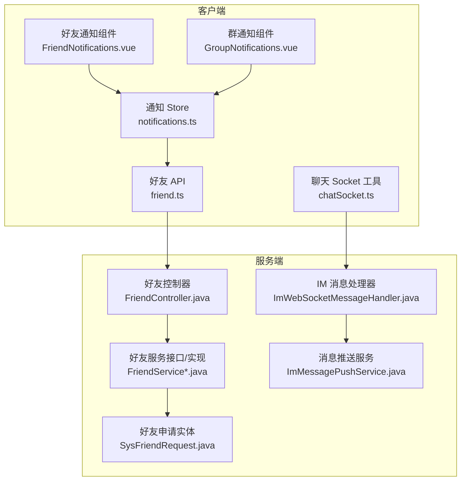
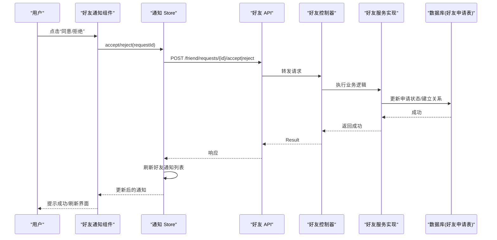
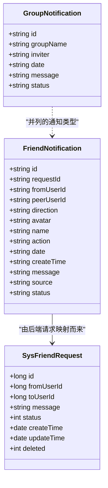
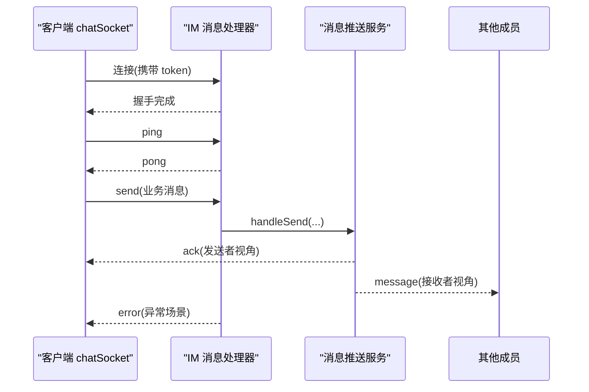
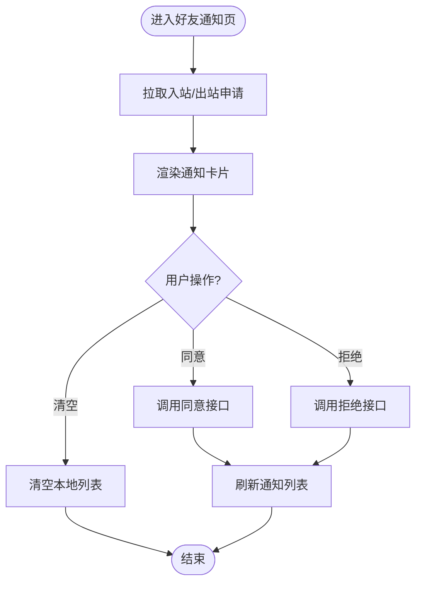
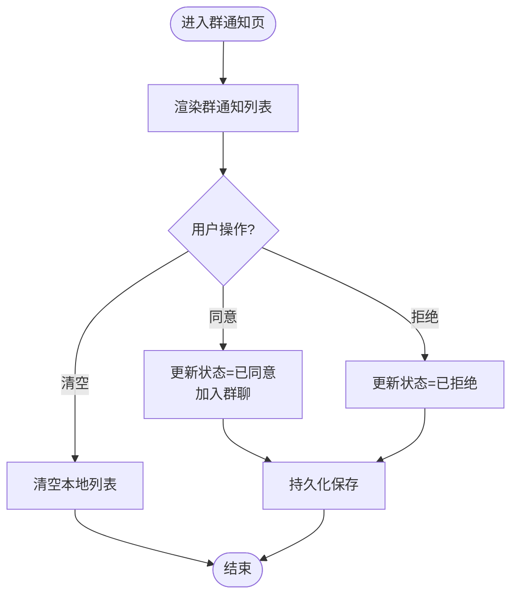
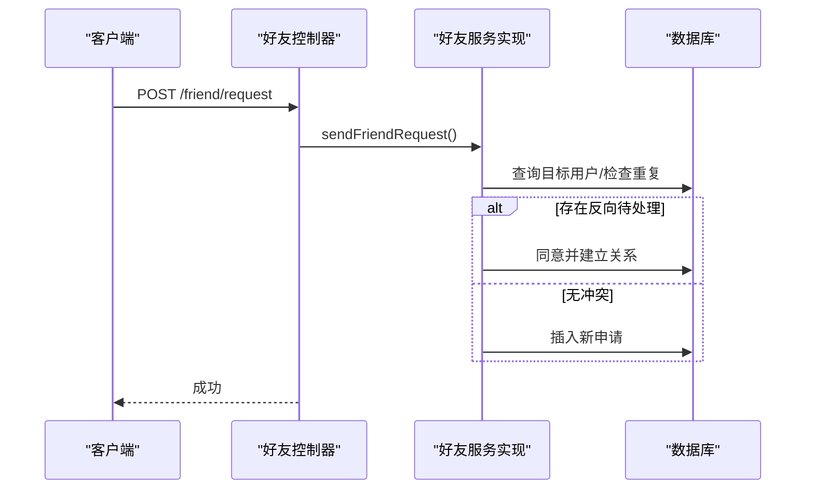
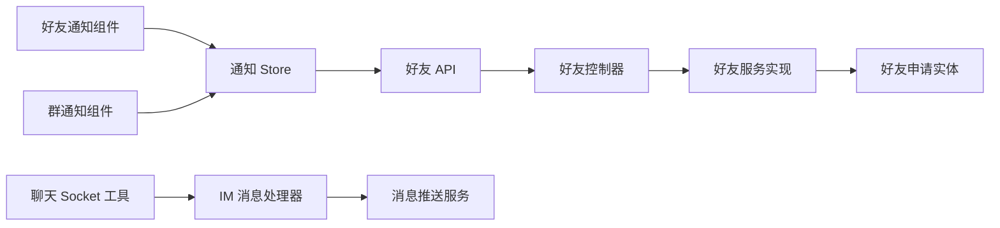

# 通知系统

<cite>
**本文引用的文件**   
- [linkx-client/src/stores/notifications.ts](file://linkx-client/src/stores/notifications.ts)
- [linkx-client/src/components/contacts/FriendNotifications.vue](file://linkx-client/src/components/contacts/FriendNotifications.vue)
- [linkx-client/src/components/contacts/GroupNotifications.vue](file://linkx-client/src/components/contacts/GroupNotifications.vue)
- [linkx-client/src/api/friend.ts](file://linkx-client/src/api/friend.ts)
- [linkx-client/src/types/friend.ts](file://linkx-client/src/types/friend.ts)
- [linkx-client/src/utils/chatSocket.ts](file://linkx-client/src/utils/chatSocket.ts)
- [linkx-server/src/main/java/com/linkx/server/controller/FriendController.java](file://linkx-server/src/main/java/com/linkx/server/controller/FriendController.java)
- [linkx-server/src/main/java/com/linkx/server/service/FriendService.java](file://linkx-server/src/main/java/com/linkx/server/service/FriendService.java)
- [linkx-server/src/main/java/com/linkx/server/service/impl/FriendServiceImpl.java](file://linkx-server/src/main/java/com/linkx/server/service/impl/FriendServiceImpl.java)
- [linkx-server/src/main/java/com/linkx/server/entity/SysFriendRequest.java](file://linkx-server/src/main/java/com/linkx/server/entity/SysFriendRequest.java)
- [linkx-server/src/main/java/com/linkx/server/im/ImWebSocketMessageHandler.java](file://linkx-server/src/main/java/com/linkx/server/im/ImWebSocketMessageHandler.java)
- [linkx-server/src/main/java/com/linkx/server/im/ImMessagePushService.java](file://linkx-server/src/main/java/com/linkx/server/im/ImMessagePushService.java)
</cite>

## 目录
1. [简介](#简介)
2. [项目结构](#项目结构)
3. [核心组件](#核心组件)
4. [架构总览](#架构总览)
5. [详细组件分析](#详细组件分析)
6. [依赖分析](#依赖分析)
7. [性能考虑](#性能考虑)
8. [故障排查指南](#故障排查指南)
9. [结论](#结论)
10. [附录](#附录)

## 简介
本文件面向 LinkX 通知系统的实现，聚焦“好友申请通知”和“群组通知”的完整链路：从数据模型、后端接口与持久化、前端状态管理、UI 交互到实时推送机制。文档同时给出关键流程的时序图与流程图，帮助读者快速理解并扩展该子系统。

## 项目结构
- 客户端（Vue + Pinia）
  - 通知 Store：集中管理好友与群通知的数据、状态与操作
  - 联系人页面组件：分别渲染好友通知与群通知，处理用户操作
  - API 层：封装好友相关 HTTP 接口调用
  - WebSocket 工具：负责聊天消息的实时收发（为后续通知推送提供通道基础）
- 服务端（Spring Boot + Netty）
  - 控制器与服务：好友申请增删改查、同意/拒绝等
  - 实体与映射：好友申请表结构与持久化
  - IM 通道：WebSocket 握手、消息分发与错误帧返回

图表来源
- [linkx-client/src/components/contacts/FriendNotifications.vue:1-256](file://linkx-client/src/components/contacts/FriendNotifications.vue#L1-L256)
- [linkx-client/src/components/contacts/GroupNotifications.vue:1-232](file://linkx-client/src/components/contacts/GroupNotifications.vue#L1-L232)
- [linkx-client/src/stores/notifications.ts:1-176](file://linkx-client/src/stores/notifications.ts#L1-L176)
- [linkx-client/src/api/friend.ts:1-43](file://linkx-client/src/api/friend.ts#L1-L43)
- [linkx-server/src/main/java/com/linkx/server/controller/FriendController.java:1-96](file://linkx-server/src/main/java/com/linkx/server/controller/FriendController.java#L1-L96)
- [linkx-server/src/main/java/com/linkx/server/service/FriendService.java:1-28](file://linkx-server/src/main/java/com/linkx/server/service/FriendService.java#L1-L28)
- [linkx-server/src/main/java/com/linkx/server/service/impl/FriendServiceImpl.java:1-333](file://linkx-server/src/main/java/com/linkx/server/service/impl/FriendServiceImpl.java#L1-L333)
- [linkx-server/src/main/java/com/linkx/server/entity/SysFriendRequest.java:1-55](file://linkx-server/src/main/java/com/linkx/server/entity/SysFriendRequest.java#L1-L55)
- [linkx-server/src/main/java/com/linkx/server/im/ImWebSocketMessageHandler.java:1-62](file://linkx-server/src/main/java/com/linkx/server/im/ImWebSocketMessageHandler.java#L1-L62)
- [linkx-server/src/main/java/com/linkx/server/im/ImMessagePushService.java:1-136](file://linkx-server/src/main/java/com/linkx/server/im/ImMessagePushService.java#L1-L136)

章节来源
- [linkx-client/src/stores/notifications.ts:1-176](file://linkx-client/src/stores/notifications.ts#L1-L176)
- [linkx-client/src/components/contacts/FriendNotifications.vue:1-256](file://linkx-client/src/components/contacts/FriendNotifications.vue#L1-L256)
- [linkx-client/src/components/contacts/GroupNotifications.vue:1-232](file://linkx-client/src/components/contacts/GroupNotifications.vue#L1-L232)
- [linkx-client/src/api/friend.ts:1-43](file://linkx-client/src/api/friend.ts#L1-L43)
- [linkx-client/src/types/friend.ts:1-38](file://linkx-client/src/types/friend.ts#L1-L38)
- [linkx-server/src/main/java/com/linkx/server/controller/FriendController.java:1-96](file://linkx-server/src/main/java/com/linkx/server/controller/FriendController.java#L1-L96)
- [linkx-server/src/main/java/com/linkx/server/service/impl/FriendServiceImpl.java:1-333](file://linkx-server/src/main/java/com/linkx/server/service/impl/FriendServiceImpl.java#L1-L333)
- [linkx-server/src/main/java/com/linkx/server/entity/SysFriendRequest.java:1-55](file://linkx-server/src/main/java/com/linkx/server/entity/SysFriendRequest.java#L1-L55)
- [linkx-server/src/main/java/com/linkx/server/im/ImWebSocketMessageHandler.java:1-62](file://linkx-server/src/main/java/com/linkx/server/im/ImWebSocketMessageHandler.java#L1-L62)
- [linkx-server/src/main/java/com/linkx/server/im/ImMessagePushService.java:1-136](file://linkx-server/src/main/java/com/linkx/server/im/ImMessagePushService.java#L1-L136)

## 核心组件
- 通知 Store（Pinia）
  - 维护好友通知与群通知列表、加载态
  - 提供拉取、同意/拒绝、清空等操作；对群通知进行本地持久化
- 好友通知组件
  - 展示待验证的好友请求，支持同意/拒绝与清空
  - 成功后刷新通讯录并创建会话
- 群通知组件
  - 展示群邀请，支持同意/拒绝与清空
  - 同意后加入群聊
- 好友 API
  - 封装搜索、发送申请、拉取入站/出站申请、同意/拒绝、列表、删除好友等接口
- 类型定义
  - 好友申请项、发送申请载荷等
- IM 通道（为后续通知推送预留）
  - 心跳、重连、错误帧处理、消息帧解析

章节来源
- [linkx-client/src/stores/notifications.ts:1-176](file://linkx-client/src/stores/notifications.ts#L1-L176)
- [linkx-client/src/components/contacts/FriendNotifications.vue:1-256](file://linkx-client/src/components/contacts/FriendNotifications.vue#L1-L256)
- [linkx-client/src/components/contacts/GroupNotifications.vue:1-232](file://linkx-client/src/components/contacts/GroupNotifications.vue#L1-L232)
- [linkx-client/src/api/friend.ts:1-43](file://linkx-client/src/api/friend.ts#L1-L43)
- [linkx-client/src/types/friend.ts:1-38](file://linkx-client/src/types/friend.ts#L1-L38)
- [linkx-client/src/utils/chatSocket.ts:1-144](file://linkx-client/src/utils/chatSocket.ts#L1-L144)

## 架构总览
下图展示了“好友申请通知”的端到端流程：前端组件触发操作 → Store 调用 API → 后端校验与持久化 → 返回结果 → 前端更新状态与 UI。

图表来源
- [linkx-client/src/components/contacts/FriendNotifications.vue:26-58](file://linkx-client/src/components/contacts/FriendNotifications.vue#L26-L58)
- [linkx-client/src/stores/notifications.ts:128-144](file://linkx-client/src/stores/notifications.ts#L128-L144)
- [linkx-client/src/api/friend.ts:28-34](file://linkx-client/src/api/friend.ts#L28-L34)
- [linkx-server/src/main/java/com/linkx/server/controller/FriendController.java:55-71](file://linkx-server/src/main/java/com/linkx/server/controller/FriendController.java#L55-L71)
- [linkx-server/src/main/java/com/linkx/server/service/impl/FriendServiceImpl.java:161-192](file://linkx-server/src/main/java/com/linkx/server/service/impl/FriendServiceImpl.java#L161-L192)
- [linkx-server/src/main/java/com/linkx/server/entity/SysFriendRequest.java:28-55](file://linkx-server/src/main/java/com/linkx/server/entity/SysFriendRequest.java#L28-L55)

## 详细组件分析

### 数据结构设计
- 好友通知（前端）
  - 字段包括唯一标识、请求 ID、双方用户 ID、方向、头像、昵称、动作文案、日期、创建时间、留言、来源、状态等
  - 状态采用中文语义：“等待验证”“已同意”“已拒绝”
- 群通知（前端）
  - 字段包括唯一标识、群名、邀请人、日期、消息、状态
- 后端实体
  - 好友申请实体包含自增雪花主键、双方用户 ID、留言、状态、创建/更新时间、逻辑删除标记
  - 状态常量：待处理、已同意、已拒绝

图表来源
- [linkx-client/src/stores/notifications.ts:11-35](file://linkx-client/src/stores/notifications.ts#L11-L35)
- [linkx-server/src/main/java/com/linkx/server/entity/SysFriendRequest.java:24-55](file://linkx-server/src/main/java/com/linkx/server/entity/SysFriendRequest.java#L24-L55)

章节来源
- [linkx-client/src/stores/notifications.ts:11-35](file://linkx-client/src/stores/notifications.ts#L11-L35)
- [linkx-server/src/main/java/com/linkx/server/entity/SysFriendRequest.java:24-55](file://linkx-server/src/main/java/com/linkx/server/entity/SysFriendRequest.java#L24-L55)

### 实时消息推送机制（为通知预留）
当前聊天模块通过 WebSocket 实现消息推送与 ACK，具备心跳、重连、错误帧处理等能力。通知系统可复用此通道，在好友申请或群邀请变更时向目标用户推送“通知事件”，前端据此增量更新通知列表。

图表来源
- [linkx-client/src/utils/chatSocket.ts:52-78](file://linkx-client/src/utils/chatSocket.ts#L52-L78)
- [linkx-server/src/main/java/com/linkx/server/im/ImWebSocketMessageHandler.java:27-54](file://linkx-server/src/main/java/com/linkx/server/im/ImWebSocketMessageHandler.java#L27-L54)
- [linkx-server/src/main/java/com/linkx/server/im/ImMessagePushService.java:30-73](file://linkx-server/src/main/java/com/linkx/server/im/ImMessagePushService.java#L30-L73)

章节来源
- [linkx-client/src/utils/chatSocket.ts:1-144](file://linkx-client/src/utils/chatSocket.ts#L1-L144)
- [linkx-server/src/main/java/com/linkx/server/im/ImWebSocketMessageHandler.java:1-62](file://linkx-server/src/main/java/com/linkx/server/im/ImWebSocketMessageHandler.java#L1-L62)
- [linkx-server/src/main/java/com/linkx/server/im/ImMessagePushService.java:1-136](file://linkx-server/src/main/java/com/linkx/server/im/ImMessagePushService.java#L1-L136)

### 通知状态管理与用户界面交互

#### 好友申请通知
- 拉取流程
  - 组件挂载时调用 Store 拉取入站/出站申请，合并并按创建时间倒序排序
- 同意/拒绝流程
  - 仅允许对“入站且等待验证”的申请进行操作
  - 成功后刷新通知列表，并在同意后自动创建会话
- 清空通知
  - 清空本地好友通知列表

图表来源
- [linkx-client/src/components/contacts/FriendNotifications.vue:22-63](file://linkx-client/src/components/contacts/FriendNotifications.vue#L22-L63)
- [linkx-client/src/stores/notifications.ts:105-122](file://linkx-client/src/stores/notifications.ts#L105-L122)
- [linkx-client/src/stores/notifications.ts:128-144](file://linkx-client/src/stores/notifications.ts#L128-L144)
- [linkx-client/src/stores/notifications.ts:157-163](file://linkx-client/src/stores/notifications.ts#L157-L163)

章节来源
- [linkx-client/src/components/contacts/FriendNotifications.vue:1-256](file://linkx-client/src/components/contacts/FriendNotifications.vue#L1-L256)
- [linkx-client/src/stores/notifications.ts:104-169](file://linkx-client/src/stores/notifications.ts#L104-L169)

#### 群组通知
- 本地状态
  - 初始含一条示例群邀请，状态为“等待验证”
- 同意/拒绝
  - 同意：更新状态为“已同意”，并调用应用 Store 的“加入群聊”方法
  - 拒绝：更新状态为“已拒绝”
- 持久化
  - 群通知列表配置了持久化键，重启后保留

图表来源
- [linkx-client/src/components/contacts/GroupNotifications.vue:26-45](file://linkx-client/src/components/contacts/GroupNotifications.vue#L26-L45)
- [linkx-client/src/stores/notifications.ts:146-163](file://linkx-client/src/stores/notifications.ts#L146-L163)
- [linkx-client/src/stores/notifications.ts:171-175](file://linkx-client/src/stores/notifications.ts#L171-L175)

章节来源
- [linkx-client/src/components/contacts/GroupNotifications.vue:1-232](file://linkx-client/src/components/contacts/GroupNotifications.vue#L1-L232)
- [linkx-client/src/stores/notifications.ts:146-175](file://linkx-client/src/stores/notifications.ts#L146-L175)

### 后端实现要点
- 控制器
  - 暴露搜索、发送申请、入站/出站列表、同意/拒绝、好友列表、删除好友等 REST 接口
- 服务实现
  - 发送申请前校验目标用户存在、非本人、非重复好友、重复申请
  - 若存在反向待处理申请，则直接同意并建立双向关系
  - 同意时写入双向好友关系；拒绝仅更新状态
- 实体
  - 使用雪花 ID、时间戳与逻辑删除字段

图表来源
- [linkx-server/src/main/java/com/linkx/server/controller/FriendController.java:34-41](file://linkx-server/src/main/java/com/linkx/server/controller/FriendController.java#L34-L41)
- [linkx-server/src/main/java/com/linkx/server/service/impl/FriendServiceImpl.java:92-138](file://linkx-server/src/main/java/com/linkx/server/service/impl/FriendServiceImpl.java#L92-L138)
- [linkx-server/src/main/java/com/linkx/server/entity/SysFriendRequest.java:28-55](file://linkx-server/src/main/java/com/linkx/server/entity/SysFriendRequest.java#L28-L55)

章节来源
- [linkx-server/src/main/java/com/linkx/server/controller/FriendController.java:1-96](file://linkx-server/src/main/java/com/linkx/server/controller/FriendController.java#L1-L96)
- [linkx-server/src/main/java/com/linkx/server/service/impl/FriendServiceImpl.java:1-333](file://linkx-server/src/main/java/com/linkx/server/service/impl/FriendServiceImpl.java#L1-L333)
- [linkx-server/src/main/java/com/linkx/server/entity/SysFriendRequest.java:1-55](file://linkx-server/src/main/java/com/linkx/server/entity/SysFriendRequest.java#L1-L55)

## 依赖分析
- 前端
  - 组件依赖通知 Store
  - 通知 Store 依赖好友 API 与类型定义
  - 聊天 Socket 工具独立于通知模块，但可作为通知推送通道的基础
- 后端
  - 控制器依赖服务接口与实现
  - 服务实现依赖实体与 Mapper
  - IM 处理器与推送服务用于消息通道

图表来源
- [linkx-client/src/components/contacts/FriendNotifications.vue:1-20](file://linkx-client/src/components/contacts/FriendNotifications.vue#L1-L20)
- [linkx-client/src/components/contacts/GroupNotifications.vue:1-20](file://linkx-client/src/components/contacts/GroupNotifications.vue#L1-L20)
- [linkx-client/src/stores/notifications.ts:1-10](file://linkx-client/src/stores/notifications.ts#L1-L10)
- [linkx-client/src/api/friend.ts:1-10](file://linkx-client/src/api/friend.ts#L1-L10)
- [linkx-server/src/main/java/com/linkx/server/controller/FriendController.java:1-20](file://linkx-server/src/main/java/com/linkx/server/controller/FriendController.java#L1-L20)
- [linkx-server/src/main/java/com/linkx/server/service/impl/FriendServiceImpl.java:1-20](file://linkx-server/src/main/java/com/linkx/server/service/impl/FriendServiceImpl.java#L1-L20)
- [linkx-server/src/main/java/com/linkx/server/entity/SysFriendRequest.java:1-20](file://linkx-server/src/main/java/com/linkx/server/entity/SysFriendRequest.java#L1-L20)
- [linkx-client/src/utils/chatSocket.ts:1-20](file://linkx-client/src/utils/chatSocket.ts#L1-L20)
- [linkx-server/src/main/java/com/linkx/server/im/ImWebSocketMessageHandler.java:1-20](file://linkx-server/src/main/java/com/linkx/server/im/ImWebSocketMessageHandler.java#L1-L20)
- [linkx-server/src/main/java/com/linkx/server/im/ImMessagePushService.java:1-20](file://linkx-server/src/main/java/com/linkx/server/im/ImMessagePushService.java#L1-L20)

章节来源
- [linkx-client/src/stores/notifications.ts:1-10](file://linkx-client/src/stores/notifications.ts#L1-L10)
- [linkx-client/src/api/friend.ts:1-10](file://linkx-client/src/api/friend.ts#L1-L10)
- [linkx-server/src/main/java/com/linkx/server/controller/FriendController.java:1-20](file://linkx-server/src/main/java/com/linkx/server/controller/FriendController.java#L1-L20)
- [linkx-server/src/main/java/com/linkx/server/service/impl/FriendServiceImpl.java:1-20](file://linkx-server/src/main/java/com/linkx/server/service/impl/FriendServiceImpl.java#L1-L20)
- [linkx-server/src/main/java/com/linkx/server/entity/SysFriendRequest.java:1-20](file://linkx-server/src/main/java/com/linkx/server/entity/SysFriendRequest.java#L1-L20)
- [linkx-client/src/utils/chatSocket.ts:1-20](file://linkx-client/src/utils/chatSocket.ts#L1-L20)
- [linkx-server/src/main/java/com/linkx/server/im/ImWebSocketMessageHandler.java:1-20](file://linkx-server/src/main/java/com/linkx/server/im/ImWebSocketMessageHandler.java#L1-L20)
- [linkx-server/src/main/java/com/linkx/server/im/ImMessagePushService.java:1-20](file://linkx-server/src/main/java/com/linkx/server/im/ImMessagePushService.java#L1-L20)

## 性能考虑
- 批量拉取与排序
  - 入站/出站申请并行拉取，合并后再按创建时间排序，减少往返次数
- 幂等与去重
  - 发送申请前检测重复与反向待处理，避免冗余数据与无效操作
- 本地持久化
  - 群通知列表持久化，降低冷启动时的网络开销
- 实时通道
  - 心跳与指数退避重连保障稳定性，错误帧统一处理

[本节为通用建议，不直接分析具体文件]

## 故障排查指南
- 未登录或 Token 失效
  - 客户端会收到未登录错误并停止重连；需重新登录
- 参数校验失败
  - 如缺少 action、无效 ID 等，服务端返回错误帧；前端应提示用户
- 业务异常
  - 如无权处理申请、申请已处理等，前端根据响应码与消息提示

章节来源
- [linkx-client/src/utils/chatSocket.ts:88-121](file://linkx-client/src/utils/chatSocket.ts#L88-L121)
- [linkx-server/src/main/java/com/linkx/server/im/ImWebSocketMessageHandler.java:27-54](file://linkx-server/src/main/java/com/linkx/server/im/ImWebSocketMessageHandler.java#L27-L54)
- [linkx-server/src/main/java/com/linkx/server/im/ImMessagePushService.java:75-90](file://linkx-server/src/main/java/com/linkx/server/im/ImMessagePushService.java#L75-L90)

## 结论
LinkX 通知系统在现有聊天实时通道基础上，已具备完善的好友申请通知与群通知能力。前端通过 Store 统一管理状态与交互，后端以事务保证一致性。未来可在 IM 通道中引入“通知事件”，实现跨设备同步与增量更新，进一步提升用户体验。

[本节为总结性内容，不直接分析具体文件]

## 附录

### 关键代码片段路径（不含代码内容）
- 好友申请同意/拒绝
  - [linkx-client/src/components/contacts/FriendNotifications.vue:26-58](file://linkx-client/src/components/contacts/FriendNotifications.vue#L26-L58)
  - [linkx-client/src/stores/notifications.ts:128-144](file://linkx-client/src/stores/notifications.ts#L128-L144)
  - [linkx-client/src/api/friend.ts:28-34](file://linkx-client/src/api/friend.ts#L28-L34)
  - [linkx-server/src/main/java/com/linkx/server/controller/FriendController.java:55-71](file://linkx-server/src/main/java/com/linkx/server/controller/FriendController.java#L55-L71)
  - [linkx-server/src/main/java/com/linkx/server/service/impl/FriendServiceImpl.java:161-192](file://linkx-server/src/main/java/com/linkx/server/service/impl/FriendServiceImpl.java#L161-L192)
- 群通知同意/拒绝与持久化
  - [linkx-client/src/components/contacts/GroupNotifications.vue:26-45](file://linkx-client/src/components/contacts/GroupNotifications.vue#L26-L45)
  - [linkx-client/src/stores/notifications.ts:146-175](file://linkx-client/src/stores/notifications.ts#L146-L175)
- 实时通道（心跳/重连/错误帧）
  - [linkx-client/src/utils/chatSocket.ts:33-50](file://linkx-client/src/utils/chatSocket.ts#L33-L50)
  - [linkx-client/src/utils/chatSocket.ts:109-121](file://linkx-client/src/utils/chatSocket.ts#L109-L121)
  - [linkx-server/src/main/java/com/linkx/server/im/ImWebSocketMessageHandler.java:27-54](file://linkx-server/src/main/java/com/linkx/server/im/ImWebSocketMessageHandler.java#L27-L54)
  - [linkx-server/src/main/java/com/linkx/server/im/ImMessagePushService.java:75-90](file://linkx-server/src/main/java/com/linkx/server/im/ImMessagePushService.java#L75-L90)