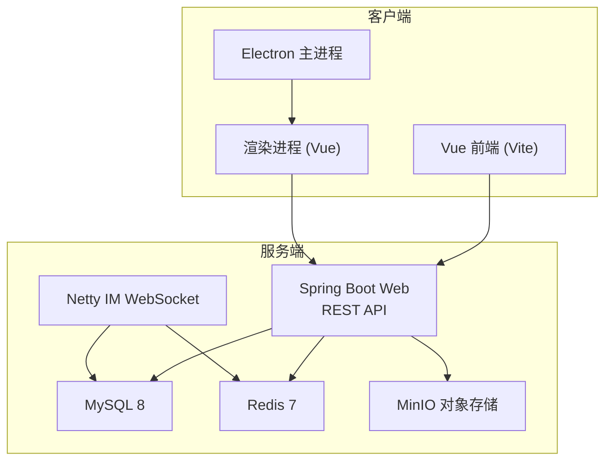
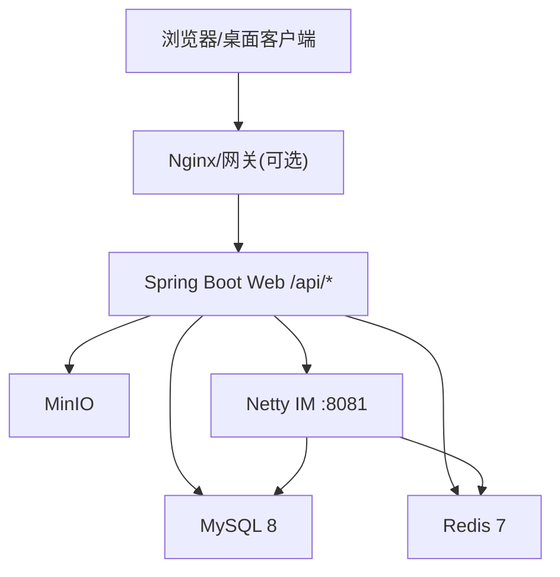
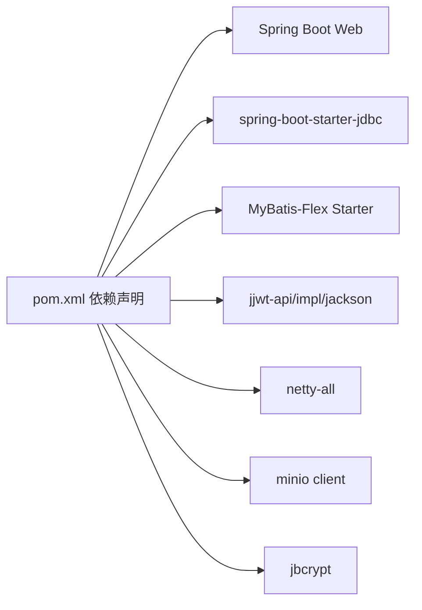

# 部署与运维

<cite>
**本文引用的文件列表**
- [pom.xml](file://linkx-server/pom.xml)
- [application.yml](file://linkx-server/src/main/resources/application.yml)
- [application-local.yml.example](file://linkx-server/src/main/resources/application-local.yml.example)
- [docker-compose.yml](file://linkx-server/docker-compose.yml)
- [init.sql](file://linkx-server/init.sql)
- [WebMvcConfig.java](file://linkx-server/src/main/java/com/linkx/server/config/WebMvcConfig.java)
- [SecurityHeadersFilter.java](file://linkx-server/src/main/java/com/linkx/server/config/SecurityHeadersFilter.java)
- [MinioConfig.java](file://linkx-server/src/main/java/com/linkx/server/config/MinioConfig.java)
- [package.json](file://linkx-client/package.json)
- [vite.config.ts](file://linkx-client/vite.config.ts)
- [main.ts](file://linkx-client/electron/main.ts)
- [preload.cjs](file://linkx-client/electron/preload.cjs)
</cite>

## 目录
1. [简介](#简介)
2. [项目结构](#项目结构)
3. [核心组件](#核心组件)
4. [架构总览](#架构总览)
5. [详细组件分析](#详细组件分析)
6. [依赖关系分析](#依赖关系分析)
7. [性能考虑](#性能考虑)
8. [故障排查指南](#故障排查指南)
9. [结论](#结论)
10. [附录](#附录)

## 简介
本指南面向运维工程师，提供 LinkX 在生产环境的完整部署与运维手册。内容涵盖：
- 后端服务（Spring Boot + Netty IM）的容器化、环境变量、安全与跨域配置、对象存储集成
- 前端与桌面客户端（Vue + Electron）的打包发布流程与多平台构建策略
- 服务器资源规划、数据库备份恢复、监控日志方案与日常维护建议

## 项目结构
仓库采用前后端分离与桌面客户端组合的结构：
- linkx-server：后端单体应用，包含 REST API、IM WebSocket、认证鉴权、对象存储等能力
- linkx-client：前端 SPA 与 Electron 桌面客户端，支持 Windows/macOS/Linux 打包分发

图表来源
- [application.yml:1-54](file://linkx-server/src/main/resources/application.yml#L1-L54)
- [docker-compose.yml:1-48](file://linkx-server/docker-compose.yml#L1-L48)
- [vite.config.ts:1-76](file://linkx-client/vite.config.ts#L1-L76)
- [main.ts:1-445](file://linkx-client/electron/main.ts#L1-L445)

章节来源
- [pom.xml:1-145](file://linkx-server/pom.xml#L1-L145)
- [application.yml:1-54](file://linkx-server/src/main/resources/application.yml#L1-L54)
- [docker-compose.yml:1-48](file://linkx-server/docker-compose.yml#L1-L48)
- [package.json:1-62](file://linkx-client/package.json#L1-L62)
- [vite.config.ts:1-76](file://linkx-client/vite.config.ts#L1-L76)
- [main.ts:1-445](file://linkx-client/electron/main.ts#L1-L445)

## 核心组件
- 后端服务
  - Spring Boot Web：HTTP 接口、CORS、拦截器、安全响应头
  - Netty IM：WebSocket 通道与消息处理
  - 数据层：MyBatis-Flex + MySQL；缓存与会话：Redis
  - 对象存储：MinIO（启动时自动创建桶）
- 客户端
  - Vue + Vite 构建前端静态资源
  - Electron 主进程管理窗口、托盘、全局快捷键、开机自启、安全存储
  - preload.cjs 暴露 IPC 桥接给渲染进程

章节来源
- [WebMvcConfig.java:1-47](file://linkx-server/src/main/java/com/linkx/server/config/WebMvcConfig.java#L1-L47)
- [SecurityHeadersFilter.java:1-70](file://linkx-server/src/main/java/com/linkx/server/config/SecurityHeadersFilter.java#L1-L70)
- [MinioConfig.java:1-49](file://linkx-server/src/main/java/com/linkx/server/config/MinioConfig.java#L1-L49)
- [main.ts:1-445](file://linkx-client/electron/main.ts#L1-L445)
- [preload.cjs:1-31](file://linkx-client/electron/preload.cjs#L1-L31)

## 架构总览
生产环境推荐将后端服务以容器方式运行，并依赖外部化的 MySQL、Redis、MinIO。前端静态资源由 Nginx 或 CDN 托管，Electron 安装包通过 CI/CD 产出并分发。

图表来源
- [application.yml:1-54](file://linkx-server/src/main/resources/application.yml#L1-L54)
- [docker-compose.yml:1-48](file://linkx-server/docker-compose.yml#L1-L48)

## 详细组件分析

### 后端服务部署与环境变量
- 端口与上下文路径
  - HTTP 服务端口与上下文路径在配置中定义，默认端口 8080，上下文路径 /api
- 数据库连接
  - JDBC URL、用户名、密码通过环境变量注入，默认指向本地 MySQL
- Redis 连接
  - host/port/password/database 均支持环境变量覆盖
- JWT 与安全
  - JWT secret 必须通过环境变量设置，禁止硬编码
  - 可启用 HTTPS 强制与安全响应头
- CORS 白名单
  - 允许的前端域名通过配置项设置，生产需严格限定
- MinIO 对象存储
  - endpoint/access-key/secret-key/bucket-name/max-file-size 均可通过环境变量覆盖
  - 启动时会检查并自动创建 bucket

章节来源
- [application.yml:1-54](file://linkx-server/src/main/resources/application.yml#L1-L54)
- [application-local.yml.example:1-33](file://linkx-server/src/main/resources/application-local.yml.example#L1-L33)
- [MinioConfig.java:1-49](file://linkx-server/src/main/java/com/linkx/server/config/MinioConfig.java#L1-L49)

### 容器编排与初始化
- Docker Compose 提供 MySQL、Redis、MinIO 的本地/测试环境一键拉起
- MySQL 使用 utf8mb4 字符集与排序规则，并通过 init.sql 和 migrations 目录进行初始化
- Redis 开启持久化与密码保护
- MinIO 开放控制台端口便于管理

章节来源
- [docker-compose.yml:1-48](file://linkx-server/docker-compose.yml#L1-L48)
- [init.sql:1-131](file://linkx-server/init.sql#L1-L131)

### 安全与跨域
- 登录拦截器排除公开接口，其余接口均需鉴权
- 安全响应头过滤器支持 HTTPS 强制、HSTS、点击劫持防护、缓存控制等
- CORS 允许来源可通过配置精确控制

章节来源
- [WebMvcConfig.java:1-47](file://linkx-server/src/main/java/com/linkx/server/config/WebMvcConfig.java#L1-L47)
- [SecurityHeadersFilter.java:1-70](file://linkx-server/src/main/java/com/linkx/server/config/SecurityHeadersFilter.java#L1-L70)

### 前端与桌面客户端打包发布
- 前端构建
  - 使用 Vite 构建，支持分包优化与 SourceMap
  - 开发模式与 Electron 模式通过 mode 切换
- Electron 主进程
  - 管理主窗口、子窗口、托盘、全局快捷键、开机自启
  - 使用 preload.cjs 暴露安全的 IPC 接口
  - 支持主题同步、置顶、最大化状态广播
- 多平台打包
  - 基于 electron-builder 输出 NSIS(dmg)/AppImage 等目标格式

章节来源
- [vite.config.ts:1-76](file://linkx-client/vite.config.ts#L1-L76)
- [main.ts:1-445](file://linkx-client/electron/main.ts#L1-L445)
- [preload.cjs:1-31](file://linkx-client/electron/preload.cjs#L1-31)
- [package.json:1-62](file://linkx-client/package.json#L1-62)

## 依赖关系分析
后端关键依赖与版本由 Maven POM 管理，包括 Spring Boot、JDBC、MyBatis-Flex、JWT、Netty、MinIO、BCrypt 等。

图表来源
- [pom.xml:1-145](file://linkx-server/pom.xml#L1-L145)

章节来源
- [pom.xml:1-145](file://linkx-server/pom.xml#L1-L145)

## 性能考虑
- 数据库
  - 使用 utf8mb4 字符集，合理索引（会话时间、用户ID等）已在初始化脚本中体现
  - 建议为高频查询字段建立复合索引，定期统计信息更新
- 缓存
  - Redis 用于会话与限流等场景，建议开启持久化与内存淘汰策略
- 对象存储
  - MinIO 大文件上传受 max-file-size 限制，可按业务调整
- 网络与安全
  - 生产建议前置反向代理并启用 HTTPS，减少明文传输风险
- 进程与线程
  - Netty IM 与 Spring Web 共享 JVM，需根据 CPU 与内存合理分配堆大小与线程池参数

[本节为通用指导，不直接分析具体文件]

## 故障排查指南
- 无法访问 HTTPS 或返回 403
  - 检查是否启用 require-https，以及反向代理是否正确传递 X-Forwarded-Proto
- 跨域失败
  - 核对 allowed-origins 是否包含实际前端域名
- 登录被锁定或验证码异常
  - 检查 auth 相关配置项与 Redis 连通性
- 文件上传失败
  - 校验 MinIO endpoint/credentials/bucket 配置，确认 bucket 已存在
- 桌面客户端无法加载 preload
  - 确认 dist-electron/preload/preload.cjs 是否存在且路径正确
- 窗口功能异常（置顶、最大化、托盘）
  - 检查主进程 IPC 注册与事件监听是否正常

章节来源
- [SecurityHeadersFilter.java:1-70](file://linkx-server/src/main/java/com/linkx/server/config/SecurityHeadersFilter.java#L1-L70)
- [WebMvcConfig.java:1-47](file://linkx-server/src/main/java/com/linkx/server/config/WebMvcConfig.java#L1-L47)
- [MinioConfig.java:1-49](file://linkx-server/src/main/java/com/linkx/server/config/MinioConfig.java#L1-L49)
- [main.ts:1-445](file://linkx-client/electron/main.ts#L1-L445)
- [preload.cjs:1-31](file://linkx-client/electron/preload.cjs#L1-31)

## 结论
LinkX 采用前后端分离与桌面客户端的组合架构，具备完善的鉴权、IM、对象存储与跨域能力。通过环境变量与容器编排实现灵活部署，结合安全响应头与 HTTPS 强化生产安全性。配合合理的资源规划、备份策略与监控体系，可满足企业级即时通讯与协同平台的稳定运行需求。

[本节为总结性内容，不直接分析具体文件]

## 附录

### 生产环境部署步骤（后端）
- 准备基础环境
  - 安装 JDK 21、Docker/Docker Compose
- 准备数据库与缓存
  - 使用 docker-compose 启动 MySQL、Redis、MinIO
  - 执行 init.sql 完成库表初始化
- 准备配置文件
  - 复制 application-local.yml.example 为 application-local.yml，按需修改本地开发参数
  - 生产环境通过环境变量覆盖敏感配置（数据库、Redis、JWT、MinIO、HTTPS 开关等）
- 构建与运行
  - 使用 Maven 构建 Spring Boot 包
  - 以容器或宿主进程方式启动，确保端口 8080（HTTP）、8081（IM）可用
- 反向代理与域名
  - 配置 Nginx 反代 /api 到后端，开启 HTTPS 与 HSTS
  - 将前端静态资源托管至同一域名或独立 CDN

章节来源
- [application.yml:1-54](file://linkx-server/src/main/resources/application.yml#L1-L54)
- [application-local.yml.example:1-33](file://linkx-server/src/main/resources/application-local.yml.example#L1-L33)
- [docker-compose.yml:1-48](file://linkx-server/docker-compose.yml#L1-L48)
- [init.sql:1-131](file://linkx-server/init.sql#L1-L131)

### 环境变量清单（示例）
- 数据库
  - DB_HOST、DB_PORT、DB_USERNAME、DB_PASSWORD
- Redis
  - REDIS_HOST、REDIS_PORT、REDIS_PASSWORD
- JWT
  - JWT_SECRET（长度与复杂度需满足安全要求）
- 安全
  - REQUIRE_HTTPS（true/false）
- MinIO
  - MINIO_ENDPOINT、MINIO_ACCESS_KEY、MINIO_SECRET_KEY、MINIO_BUCKET_NAME
- 其他
  - SPRING_PROFILES_ACTIVE（local/dev/prod）

章节来源
- [application.yml:1-54](file://linkx-server/src/main/resources/application.yml#L1-L54)

### 前端与桌面客户端打包发布流程
- 安装依赖
  - 在项目根目录执行依赖安装
- 构建前端
  - 执行构建命令生成 dist 静态资源
- 构建 Electron
  - 使用 electron-builder 针对 Windows/macOS/Linux 分别打包
- 产物分发
  - Windows：NSIS 安装包
  - macOS：DMG 安装包
  - Linux：AppImage 包

章节来源
- [package.json:1-62](file://linkx-client/package.json#L1-62)
- [vite.config.ts:1-76](file://linkx-client/vite.config.ts#L1-L76)
- [main.ts:1-445](file://linkx-client/electron/main.ts#L1-L445)

### 自动化部署策略（CI/CD 建议）
- 触发条件
  - 推送 tag 或合并到主干分支
- 构建阶段
  - 后端：Maven 构建并生成镜像或 Jar
  - 前端：Vite 构建静态资源
  - 桌面：electron-builder 多平台打包
- 发布阶段
  - 后端：推送到镜像仓库或制品库，Kubernetes/Docker Compose 滚动升级
  - 前端：上传至对象存储或 CDN
  - 桌面：上传至发布页并提供下载链接

[本节为通用实践建议，不直接分析具体文件]

### 服务器资源规划（参考）
- 小型团队（<100 在线）
  - 2C4G 或 4C8G 主机，SSD 磁盘
- 中型团队（100-500 在线）
  - 4C16G 主机，SSD 磁盘，独立 MySQL/Redis/MinIO 实例
- 大型团队（>500 在线）
  - 微服务拆分或水平扩展，独立数据库集群与缓存集群，对象存储集群

[本节为通用指导，不直接分析具体文件]

### 数据库备份与恢复
- 备份
  - 使用 mysqldump 对 linkx 库进行全量/增量备份
  - 保留历史备份并按周期清理
- 恢复
  - 停止写入后导入备份文件
  - 验证关键表结构与数据完整性

章节来源
- [init.sql:1-131](file://linkx-server/init.sql#L1-L131)

### 监控与日志
- 应用日志
  - 收集 Spring Boot 与 Netty 日志，集中到日志系统
- 指标监控
  - 关注 JVM、数据库连接池、Redis 命中率、MinIO 吞吐
- 告警
  - 错误率、延迟、资源使用阈值告警

[本节为通用指导，不直接分析具体文件]