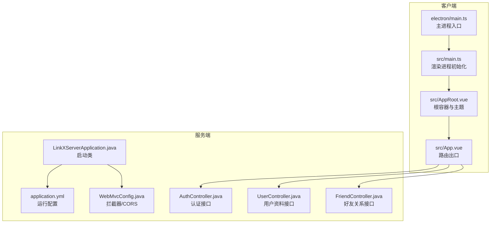
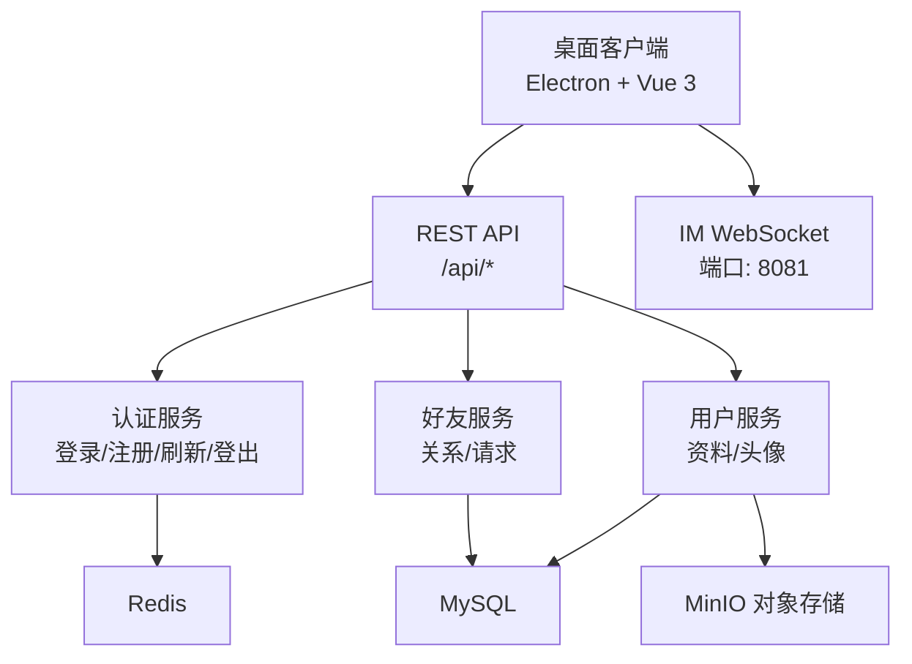
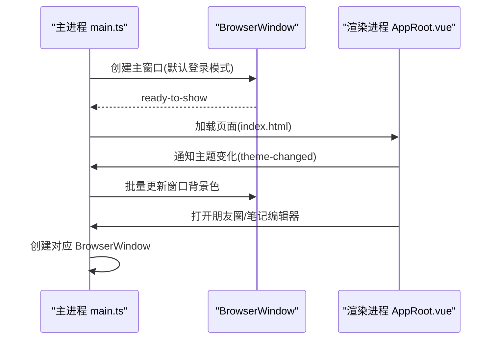
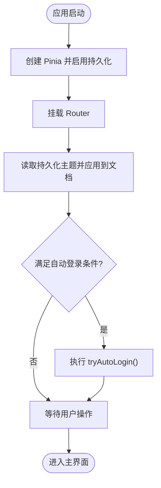
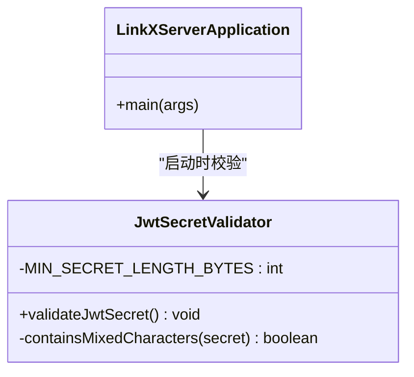
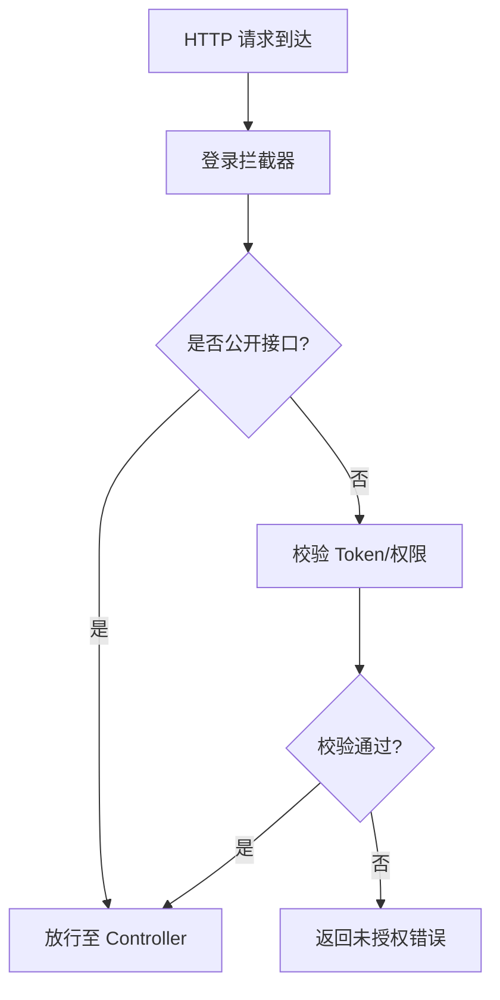
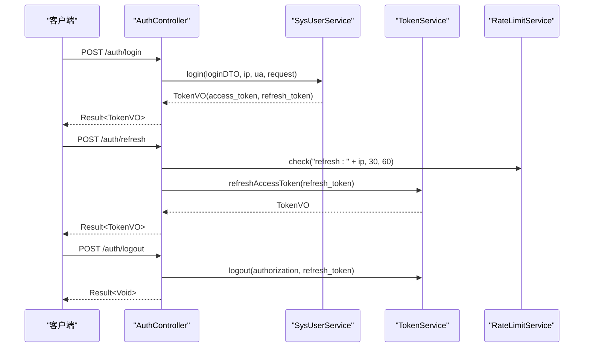
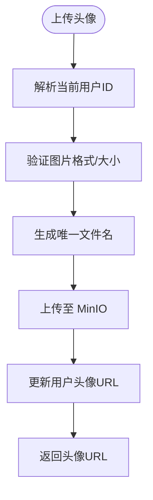
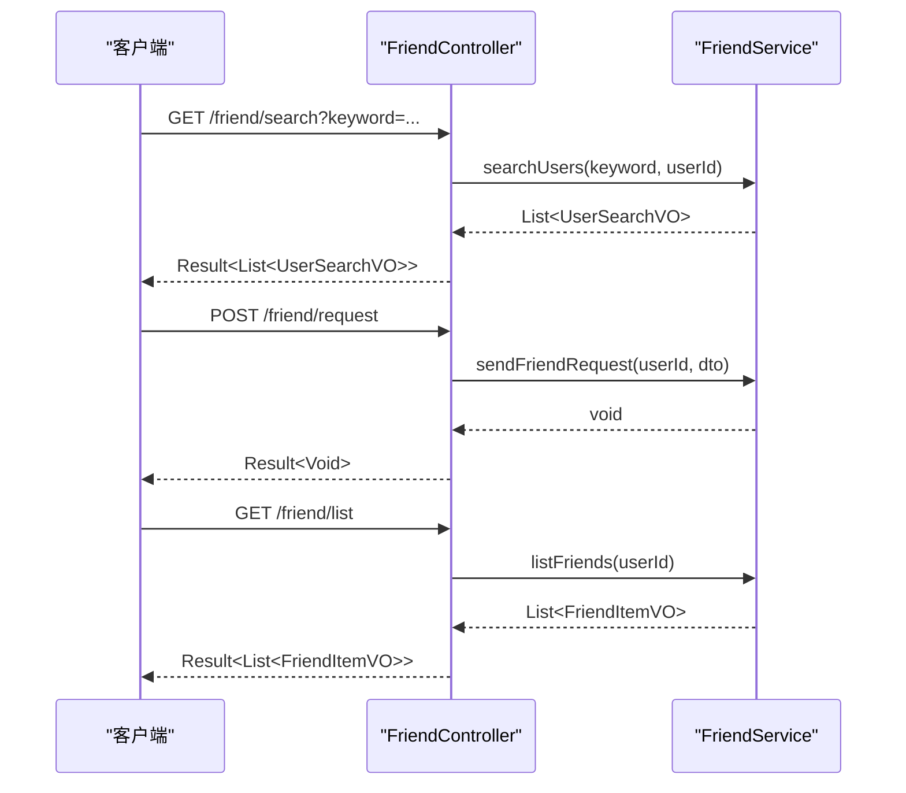
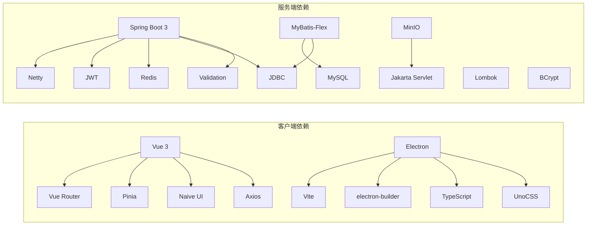

# 项目概述

<cite>
**本文引用的文件**
- [linkx-client/package.json](file://linkx-client/package.json)
- [linkx-client/electron/main.ts](file://linkx-client/electron/main.ts)
- [linkx-client/src/main.ts](file://linkx-client/src/main.ts)
- [linkx-client/src/AppRoot.vue](file://linkx-client/src/AppRoot.vue)
- [linkx-client/src/App.vue](file://linkx-client/src/App.vue)
- [linkx-server/pom.xml](file://linkx-server/pom.xml)
- [linkx-server/src/main/java/com/linkx/server/LinkXServerApplication.java](file://linkx-server/src/main/java/com/linkx/server/LinkXServerApplication.java)
- [linkx-server/src/main/resources/application.yml](file://linkx-server/src/main/resources/application.yml)
- [linkx-server/src/main/java/com/linkx/server/config/WebMvcConfig.java](file://linkx-server/src/main/java/com/linkx/server/config/WebMvcConfig.java)
- [linkx-server/src/main/java/com/linkx/server/controller/AuthController.java](file://linkx-server/src/main/java/com/linkx/server/controller/AuthController.java)
- [linkx-server/src/main/java/com/linkx/server/controller/UserController.java](file://linkx-server/src/main/java/com/linkx/server/controller/UserController.java)
- [linkx-server/src/main/java/com/linkx/server/controller/FriendController.java](file://linkx-server/src/main/java/com/linkx/server/controller/FriendController.java)
</cite>

## 目录
1. [简介](#简介)
2. [项目结构](#项目结构)
3. [核心组件](#核心组件)
4. [架构总览](#架构总览)
5. [详细组件分析](#详细组件分析)
6. [依赖分析](#依赖分析)
7. [性能考虑](#性能考虑)
8. [故障排查指南](#故障排查指南)
9. [结论](#结论)
10. [附录](#附录)

## 简介
LinkX 是一款企业级即时通讯与协同平台桌面应用，采用“Electron + Vue 3”构建跨平台客户端，配合“Spring Boot + Netty”后端服务提供 REST API 与 IM WebSocket 能力。项目目标是为团队提供安全、高效、可定制的桌面端沟通与协作体验，支持多窗口、系统托盘、全局快捷键、主题同步、本地安全存储等原生能力，并通过统一的认证鉴权与消息通道实现实时通信。

核心价值主张：
- 跨平台一致体验：Windows/macOS/Linux 统一界面与交互
- 企业级安全：JWT 鉴权、登录审计、验证码与限流、MinIO 对象存储
- 高性能实时通信：Netty 驱动的 WebSocket 通道
- 可扩展的模块化设计：前后端职责清晰、配置化部署

## 项目结构
仓库采用前后端分离的多模块组织方式：
- linkx-client：基于 Electron + Vite + Vue 3 的桌面客户端
- linkx-server：基于 Spring Boot 3 的后端单体服务（含 MyBatis-Flex、Redis、Netty、MinIO）

图表来源
- [linkx-client/electron/main.ts:1-445](file://linkx-client/electron/main.ts#L1-L445)
- [linkx-client/src/main.ts:1-64](file://linkx-client/src/main.ts#L1-L64)
- [linkx-client/src/AppRoot.vue:1-105](file://linkx-client/src/AppRoot.vue#L1-L105)
- [linkx-client/src/App.vue:1-26](file://linkx-client/src/App.vue#L1-L26)
- [linkx-server/src/main/java/com/linkx/server/LinkXServerApplication.java:1-114](file://linkx-server/src/main/java/com/linkx/server/LinkXServerApplication.java#L1-L114)
- [linkx-server/src/main/resources/application.yml:1-54](file://linkx-server/src/main/resources/application.yml#L1-L54)
- [linkx-server/src/main/java/com/linkx/server/config/WebMvcConfig.java:1-47](file://linkx-server/src/main/java/com/linkx/server/config/WebMvcConfig.java#L1-L47)
- [linkx-server/src/main/java/com/linkx/server/controller/AuthController.java:1-84](file://linkx-server/src/main/java/com/linkx/server/controller/AuthController.java#L1-L84)
- [linkx-server/src/main/java/com/linkx/server/controller/UserController.java:1-145](file://linkx-server/src/main/java/com/linkx/server/controller/UserController.java#L1-L145)
- [linkx-server/src/main/java/com/linkx/server/controller/FriendController.java:1-96](file://linkx-server/src/main/java/com/linkx/server/controller/FriendController.java#L1-L96)

章节来源
- [linkx-client/package.json:1-62](file://linkx-client/package.json#L1-L62)
- [linkx-client/electron/main.ts:1-445](file://linkx-client/electron/main.ts#L1-L445)
- [linkx-client/src/main.ts:1-64](file://linkx-client/src/main.ts#L1-L64)
- [linkx-client/src/AppRoot.vue:1-105](file://linkx-client/src/AppRoot.vue#L1-L105)
- [linkx-client/src/App.vue:1-26](file://linkx-client/src/App.vue#L1-L26)
- [linkx-server/pom.xml:1-145](file://linkx-server/pom.xml#L1-L145)
- [linkx-server/src/main/java/com/linkx/server/LinkXServerApplication.java:1-114](file://linkx-server/src/main/java/com/linkx/server/LinkXServerApplication.java#L1-L114)
- [linkx-server/src/main/resources/application.yml:1-54](file://linkx-server/src/main/resources/application.yml#L1-L54)
- [linkx-server/src/main/java/com/linkx/server/config/WebMvcConfig.java:1-47](file://linkx-server/src/main/java/com/linkx/server/config/WebMvcConfig.java#L1-L47)
- [linkx-server/src/main/java/com/linkx/server/controller/AuthController.java:1-84](file://linkx-server/src/main/java/com/linkx/server/controller/AuthController.java#L1-L84)
- [linkx-server/src/main/java/com/linkx/server/controller/UserController.java:1-145](file://linkx-server/src/main/java/com/linkx/server/controller/UserController.java#L1-L145)
- [linkx-server/src/main/java/com/linkx/server/controller/FriendController.java:1-96](file://linkx-server/src/main/java/com/linkx/server/controller/FriendController.java#L1-L96)

## 核心组件
- 客户端主进程（Electron）
  - 负责窗口生命周期管理、系统托盘、全局快捷键、IPC 桥接、安全存储封装、多窗口（主窗口、朋友圈、笔记编辑器）创建与状态同步
- 客户端渲染进程（Vue 3）
  - 应用初始化、Pinia 状态管理与持久化、Naive UI 主题覆盖、路由切换、锁屏与设置弹窗挂载
- 服务端启动与安全校验
  - Spring Boot 启动、MyBatis-Flex Mapper 扫描、异步任务启用、JWT Secret 强度校验
- Web 层配置
  - 登录拦截器注册、CORS 白名单策略、统一响应体封装
- 业务控制器
  - 认证（登录/注册/刷新/登出）、用户资料（查询/更新/头像上传）、好友关系（搜索/申请/接受/拒绝/列表/删除）

章节来源
- [linkx-client/electron/main.ts:1-445](file://linkx-client/electron/main.ts#L1-L445)
- [linkx-client/src/main.ts:1-64](file://linkx-client/src/main.ts#L1-L64)
- [linkx-client/src/AppRoot.vue:1-105](file://linkx-client/src/AppRoot.vue#L1-L105)
- [linkx-client/src/App.vue:1-26](file://linkx-client/src/App.vue#L1-L26)
- [linkx-server/src/main/java/com/linkx/server/LinkXServerApplication.java:1-114](file://linkx-server/src/main/java/com/linkx/server/LinkXServerApplication.java#L1-L114)
- [linkx-server/src/main/java/com/linkx/server/config/WebMvcConfig.java:1-47](file://linkx-server/src/main/java/com/linkx/server/config/WebMvcConfig.java#L1-L47)
- [linkx-server/src/main/java/com/linkx/server/controller/AuthController.java:1-84](file://linkx-server/src/main/java/com/linkx/server/controller/AuthController.java#L1-L84)
- [linkx-server/src/main/java/com/linkx/server/controller/UserController.java:1-145](file://linkx-server/src/main/java/com/linkx/server/controller/UserController.java#L1-L145)
- [linkx-server/src/main/java/com/linkx/server/controller/FriendController.java:1-96](file://linkx-server/src/main/java/com/linkx/server/controller/FriendController.java#L1-L96)

## 架构总览
整体采用“前端桌面应用 + 后端单体服务”的分层架构：
- 前端通过 HTTP 调用 REST API 完成认证、用户资料、好友关系等业务；IM 消息通过独立 WebSocket 端口进行实时推送
- 后端使用 Spring Boot 提供 Web 服务，集成 Redis 做缓存与限流，MySQL 持久化数据，MinIO 作为对象存储，Netty 承载 IM 通道
- 安全方面：JWT 双令牌（访问令牌+刷新令牌）、登录拦截器、可选验证码、速率限制、HTTPS 强制开关

图表来源
- [linkx-server/src/main/resources/application.yml:1-54](file://linkx-server/src/main/resources/application.yml#L1-L54)
- [linkx-server/pom.xml:1-145](file://linkx-server/pom.xml#L1-L145)
- [linkx-client/electron/main.ts:1-445](file://linkx-client/electron/main.ts#L1-L445)

## 详细组件分析

### 客户端主进程（Electron）
- 窗口与模式控制：登录模式与主模式尺寸/可调整性切换，最大化状态广播
- 系统托盘与全局快捷键：最小化到托盘、双击显示主窗口、快捷键显隐主窗口
- IPC 能力：窗口控制、置顶、开机自启、安全存储（加密读写）
- 多窗口：朋友圈、笔记编辑器独立窗口，开发/生产环境加载路径区分
- 主题联动：监听主题变更并批量更新所有窗口背景色

图表来源
- [linkx-client/electron/main.ts:1-445](file://linkx-client/electron/main.ts#L1-L445)
- [linkx-client/src/AppRoot.vue:1-105](file://linkx-client/src/AppRoot.vue#L1-L105)

章节来源
- [linkx-client/electron/main.ts:1-445](file://linkx-client/electron/main.ts#L1-L445)

### 客户端渲染进程（Vue 3）
- 应用初始化：创建 Pinia 实例并启用持久化插件，挂载 Router，读取持久化主题并应用到 DOM
- 自动登录：根据保存的登录信息尝试自动登录，避免无 token 时卡死
- 主题系统：根据当前主题选择 Naive UI 暗色主题或跟随系统亮色，计算主题覆盖项，同步 HTML data-theme 并通知主进程
- 路由出口：App.vue 作为 RouterView 容器，统一样式占满视口

图表来源
- [linkx-client/src/main.ts:1-64](file://linkx-client/src/main.ts#L1-L64)
- [linkx-client/src/AppRoot.vue:1-105](file://linkx-client/src/AppRoot.vue#L1-L105)
- [linkx-client/src/App.vue:1-26](file://linkx-client/src/App.vue#L1-L26)

章节来源
- [linkx-client/src/main.ts:1-64](file://linkx-client/src/main.ts#L1-L64)
- [linkx-client/src/AppRoot.vue:1-105](file://linkx-client/src/AppRoot.vue#L1-L105)
- [linkx-client/src/App.vue:1-26](file://linkx-client/src/App.vue#L1-L26)

### 服务端启动与安全校验
- 启动类：启用 @MapperScan、@EnableConfigurationProperties、@EnableAsync，输出启动成功日志
- JWT 密钥校验：在应用启动阶段检查密钥长度与复杂度，不满足要求则抛出异常阻止启动，保障签名安全

图表来源
- [linkx-server/src/main/java/com/linkx/server/LinkXServerApplication.java:1-114](file://linkx-server/src/main/java/com/linkx/server/LinkXServerApplication.java#L1-L114)

章节来源
- [linkx-server/src/main/java/com/linkx/server/LinkXServerApplication.java:1-114](file://linkx-server/src/main/java/com/linkx/server/LinkXServerApplication.java#L1-L114)

### Web 层配置（拦截器与 CORS）
- 登录拦截器：对除公开接口外的所有路径进行鉴权拦截
- CORS 策略：允许指定来源或默认 localhost/127.0.0.1 开发地址，支持凭证携带与预检请求

图表来源
- [linkx-server/src/main/java/com/linkx/server/config/WebMvcConfig.java:1-47](file://linkx-server/src/main/java/com/linkx/server/config/WebMvcConfig.java#L1-L47)

章节来源
- [linkx-server/src/main/java/com/linkx/server/config/WebMvcConfig.java:1-47](file://linkx-server/src/main/java/com/linkx/server/config/WebMvcConfig.java#L1-L47)

### 认证流程（登录/注册/刷新/登出）
- 登录：可选验证码校验 -> 用户服务登录 -> 生成访问令牌与刷新令牌 -> 返回令牌
- 注册：可选验证码校验 -> 用户服务注册
- 刷新：基于 IP 的速率限制 -> 刷新访问令牌
- 登出：支持传入刷新令牌进行失效处理

图表来源
- [linkx-server/src/main/java/com/linkx/server/controller/AuthController.java:1-84](file://linkx-server/src/main/java/com/linkx/server/controller/AuthController.java#L1-L84)

章节来源
- [linkx-server/src/main/java/com/linkx/server/controller/AuthController.java:1-84](file://linkx-server/src/main/java/com/linkx/server/controller/AuthController.java#L1-L84)

### 用户资料与头像上传
- 获取当前用户资料：从请求上下文解析 userId -> 查询用户 -> 返回 UserProfileVO
- 更新用户资料：校验 DTO -> 更新 -> 返回最新资料
- 上传头像：类型校验 -> 生成文件名 -> 上传至 MinIO -> 更新用户头像字段

图表来源
- [linkx-server/src/main/java/com/linkx/server/controller/UserController.java:1-145](file://linkx-server/src/main/java/com/linkx/server/controller/UserController.java#L1-L145)

章节来源
- [linkx-server/src/main/java/com/linkx/server/controller/UserController.java:1-145](file://linkx-server/src/main/java/com/linkx/server/controller/UserController.java#L1-L145)

### 好友关系管理
- 搜索用户：按关键词检索
- 发送好友申请：携带必要参数
- 接收/发送列表：分页或全量展示
- 接受/拒绝申请：幂等操作
- 好友列表与删除：维护关系数据

图表来源
- [linkx-server/src/main/java/com/linkx/server/controller/FriendController.java:1-96](file://linkx-server/src/main/java/com/linkx/server/controller/FriendController.java#L1-L96)

章节来源
- [linkx-server/src/main/java/com/linkx/server/controller/FriendController.java:1-96](file://linkx-server/src/main/java/com/linkx/server/controller/FriendController.java#L1-L96)

## 依赖分析
- 客户端依赖
  - 运行时：Vue 3、Vue Router、Pinia、Naive UI、Axios
  - 开发时：Vite、TypeScript、UnoCSS、vite-plugin-electron、electron-builder
- 服务端依赖
  - Spring Boot 3、Validation、JDBC、MyBatis-Flex、Redis、MySQL、JWT、Netty、Lombok、BCrypt、MinIO、Jakarta Servlet

图表来源
- [linkx-client/package.json:1-62](file://linkx-client/package.json#L1-L62)
- [linkx-server/pom.xml:1-145](file://linkx-server/pom.xml#L1-L145)

章节来源
- [linkx-client/package.json:1-62](file://linkx-client/package.json#L1-L62)
- [linkx-server/pom.xml:1-145](file://linkx-server/pom.xml#L1-L145)

## 性能考虑
- 前端
  - 按需引入 Naive UI 组件，避免全量引入拖慢启动
  - 使用 UnoCSS 原子化样式减少 CSS 体积
  - 异步懒加载设置弹窗，减小首屏包体积
  - 主题同步与跨窗口联动采用局部更新，避免重绘开销
- 后端
  - 使用 Redis 做验证码、限流与缓存，降低数据库压力
  - MinIO 对象存储解耦大文件传输，提升接口响应速度
  - Netty 高并发处理 IM 消息，WebSocket 长连接复用
  - 合理配置 CORS 与拦截器，减少无效请求处理

[本节为通用指导，无需源码引用]

## 故障排查指南
- 启动失败（JWT Secret 校验）
  - 现象：应用启动时报错提示密钥为空或长度不足
  - 排查：确认环境变量 JWT_SECRET 已设置且长度至少 32 字节，包含多种字符类型
  - 参考：启动类中的密钥校验逻辑
- 登录被拦截（401/403）
  - 现象：访问受保护接口返回未登录或无权限
  - 排查：确认 Authorization 头携带有效 Access Token，或 Refresh Token 未过期；检查 CORS 配置是否包含前端域名
  - 参考：登录拦截器与 CORS 配置
- 文件上传失败
  - 现象：头像上传报错或无法访问
  - 排查：确认 MinIO 服务可用、凭据正确、桶存在；检查文件大小与类型限制
  - 参考：用户资料控制器中的上传流程
- 主题不同步
  - 现象：主窗口与子窗口主题不一致
  - 排查：确认渲染进程已通知主进程主题变化，主进程是否正确批量更新窗口背景色
  - 参考：主进程主题监听与批量更新逻辑

章节来源
- [linkx-server/src/main/java/com/linkx/server/LinkXServerApplication.java:1-114](file://linkx-server/src/main/java/com/linkx/server/LinkXServerApplication.java#L1-L114)
- [linkx-server/src/main/java/com/linkx/server/config/WebMvcConfig.java:1-47](file://linkx-server/src/main/java/com/linkx/server/config/WebMvcConfig.java#L1-L47)
- [linkx-server/src/main/java/com/linkx/server/controller/UserController.java:1-145](file://linkx-server/src/main/java/com/linkx/server/controller/UserController.java#L1-L145)
- [linkx-client/electron/main.ts:1-445](file://linkx-client/electron/main.ts#L1-L445)

## 结论
LinkX 以清晰的职责划分与成熟的技术栈构建了企业级即时通讯桌面应用。前端通过 Electron 提供丰富的原生能力，结合 Vue 3 与 Naive UI 打造流畅的用户体验；后端以 Spring Boot 为核心，整合 Redis、MySQL、MinIO 与 Netty，形成稳定可靠的 REST 与 IM 服务能力。通过完善的鉴权、限流与对象存储方案，项目在安全性与扩展性上具备良好基础，适合在企业环境中部署与持续演进。

[本节为总结性内容，无需源码引用]

## 附录
- 部署与环境要求
  - 后端运行环境：Java 21、MySQL、Redis、MinIO（可选用于对象存储）
  - 关键环境变量：DB_HOST/DB_PORT/DB_USERNAME/DB_PASSWORD、REDIS_HOST/REDIS_PORT/REDIS_PASSWORD、JWT_SECRET、MINIO_ENDPOINT/MINIO_ACCESS_KEY/MINIO_SECRET_KEY/MINIO_BUCKET_NAME、REQUIRE_HTTPS、CAPTCHA_ENABLED
  - 端口规划：HTTP API 默认 8080（上下文路径 /api），IM WebSocket 默认 8081
  - 客户端打包：支持 Windows NSIS、macOS DMG、Linux AppImage

章节来源
- [linkx-server/src/main/resources/application.yml:1-54](file://linkx-server/src/main/resources/application.yml#L1-L54)
- [linkx-client/package.json:1-62](file://linkx-client/package.json#L1-L62)