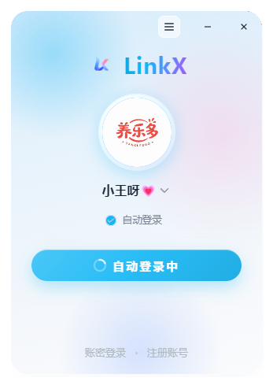
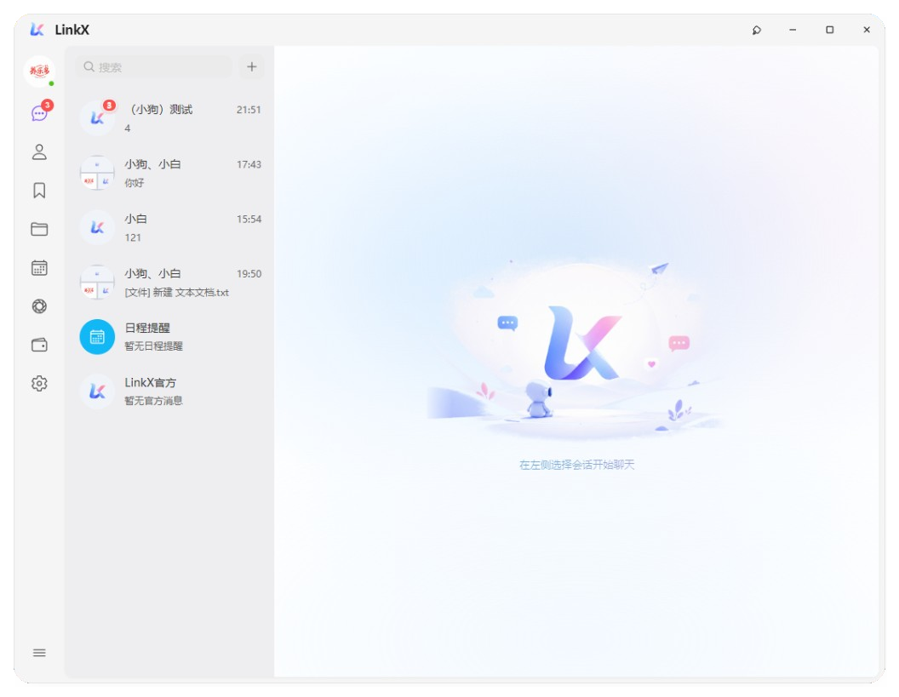
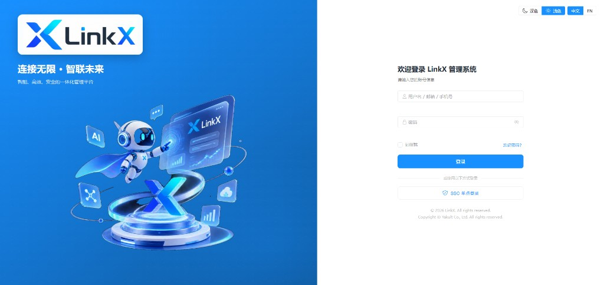
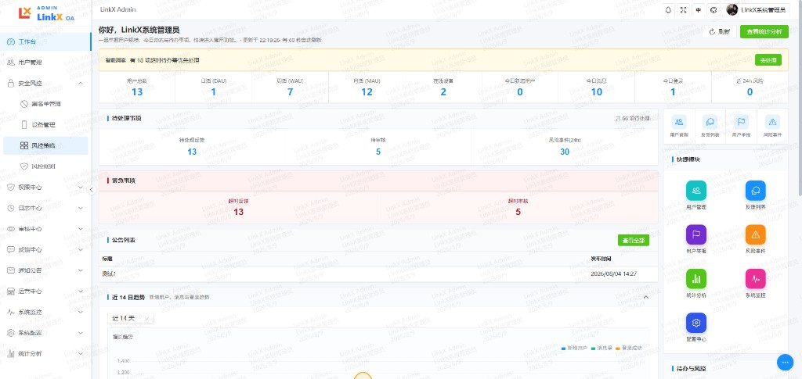
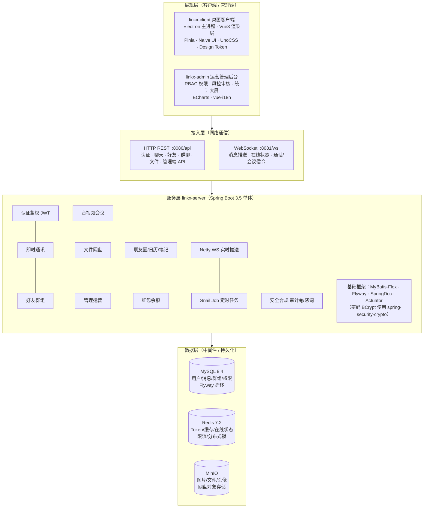
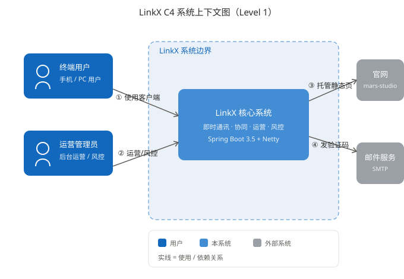
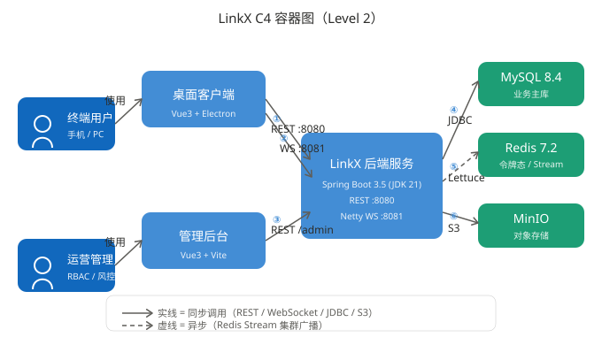
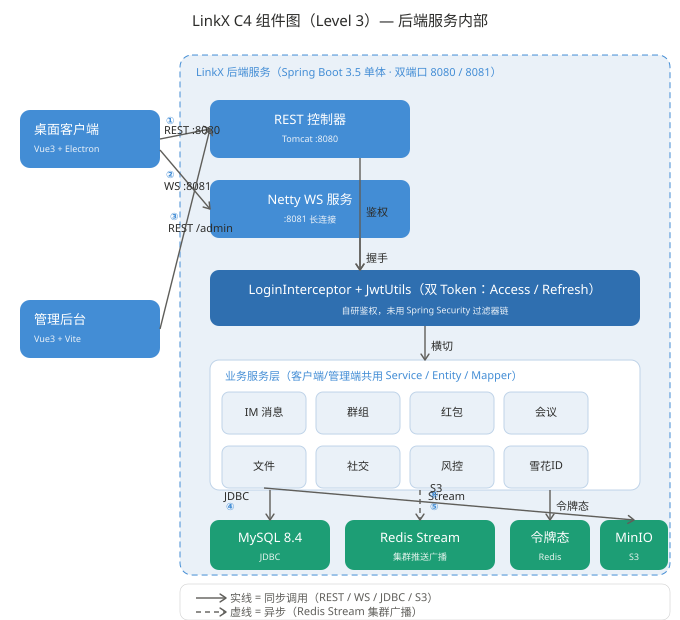
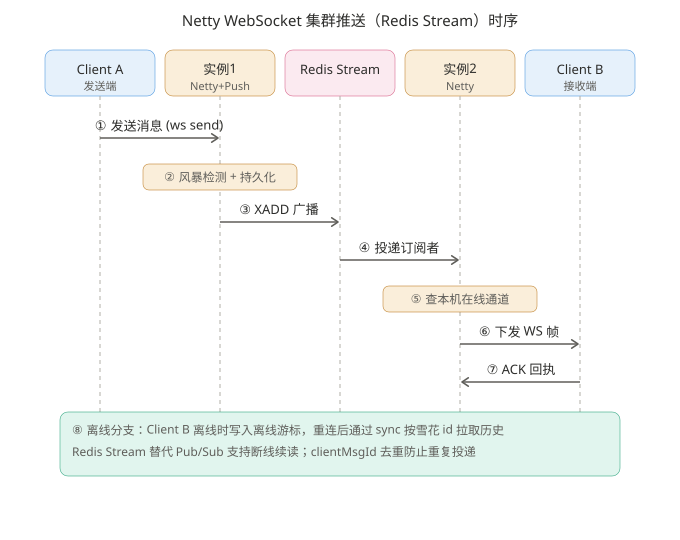

<!-- 作者：yangleduo -->
<div align="center" style="padding: 32px 0;">


# LinkX

**企业级即时通讯与协同平台**

[](https://openjdk.org/)
[](https://spring.io/projects/spring-boot)
[](https://vuejs.org/)
[](https://www.electronjs.org/)
[](https://mybatis-flex.com/)
[](https://netty.io/)
[](https://snailjob.opensnail.com/)
[](https://min.io/)
[](https://redis.io/)
[](https://www.mysql.com/)
[](./LICENSE)

**官网** https://mars-studio.asia

**代码仓库** https://gitee.com/yangleduo7788/link-x · [GitHub 镜像](https://github.com/Yangleduo00337788/LINK-X)

</div>

## 目录

- [一、项目介绍](#一项目介绍)
- [二、界面预览](#二界面预览)
- [三、项目特性](#三项目特性)
- [四、技术架构](#四技术架构)
- [五、环境要求](#五环境要求)
- [六、快速上手](#六快速上手)
- [七、目录结构](#七目录结构)
- [八、配置说明](#八配置说明)
  - [8.4 消息落库加密](#84-消息落库加密)
  - [8.5 客户端 UI 与样式规范](#85-客户端-ui-与样式规范)
- [九、构建与部署](#九构建与部署)
- [十、常见问题](#十常见问题)
- [十一、贡献指南](#十一贡献指南)
- [十二、更新日志](#十二更新日志)
- [十三、许可证](#十三许可证)

---

## 一、项目介绍

LinkX 是一套**前后端分离**的企业级即时通讯（IM）解决方案，由桌面客户端、运营管理后台与单体后端服务组成，适用于团队内部沟通、协同办公与后台运营场景。

| 子工程 | 定位 | 技术栈 |
|--------|------|--------|
| `linkx-website` | 产品官网（文档、法律页、帮助中心） | 静态 HTML/CSS/JS，托管于 Cloudflare Pages |
| `linkx-client` | 跨平台桌面 IM 客户端 | Vue 3、Electron、Pinia、Naive UI、UnoCSS、统一 Design Token |
| `linkx-admin` | Web 运营管理后台 | Vue 3、Vite、ECharts、RBAC |
| `linkx-server` | 业务与实时消息服务 | Spring Boot 3.5、Netty、MyBatis-Flex |

**通信方式：**

| 通道 | 默认地址 | 用途 |
|------|----------|------|
| REST API | `http://localhost:8080/api` | 认证、聊天、好友、群聊、文件等业务接口 |
| WebSocket | `ws://localhost:8081/ws` | 即时消息推送、在线状态、通话信令 |

---

## 二、界面预览

### 客户端

<div align="center">



**图 1 · 客户端登录页**

<br />



**图 2 · 客户端主界面**

</div>

### 管理端

<div align="center">



**图 3 · 管理端登录页**

<br />



**图 4 · 管理端工作台**

</div>

---

## 三、项目特性

- **即时消息**：单聊 / 群聊；文本、图片、文件、语音；支持引用、编辑、撤回、转发
- **实时推送**：HTTP 拉取历史 + Netty WebSocket 实时下发
- **音视频会议**：WebRTC 单聊通话；多人 Mesh 会议（无 SFU）
- **社交协作**：朋友圈、日历、笔记与收藏
- **灵伴 Agent**：LLM 对话与代操模式（导航、发消息等）；管理端可配置全局开关与群 AI 策略
- **客户端更新**：启动自动检查更新、后台静默下载；管理端版本发布驱动更新说明与「本次更新」弹窗
- **文件能力**：聊天文件、群文件 / 群相册、个人网盘（MinIO 对象存储）
- **统一 UI 体系**：Design Token（`--lx-*`）、公共组件（`LxButton` / `LxIconButton` / `LxGroupCard`）、全站样式与窗控交互收拢
- **账户安全**：双 Token 鉴权、图形验证码、登录风控、敏感词过滤、操作审计
- **管理运营**：用户 / 角色 / 权限、内容审核、风控策略、统计大屏、系统监控

---

## 四、技术架构



**核心技术栈与版本：**

<details>
<summary>点击展开完整依赖版本</summary>

#### 运行环境

| 工具 | 版本 |
|------|------|
| JDK | 21 |
| Maven | 3.8+ |
| Node.js | 18+（推荐 20 / 22） |
| Docker | 用于本地中间件 |

#### 中间件（docker-compose）

| 组件 | 版本 |
|------|------|
| MySQL | 8.4.0 |
| Redis | 7.2.4 |
| MinIO | RELEASE.2024-05-10T01-41-38Z |

#### linkx-server

| 依赖 | 版本 |
|------|------|
| Spring Boot | 3.5.0 |
| MyBatis-Flex | 1.9.3 |
| Spring Security | 6.4.5 |
| Netty | 4.1.115.Final |
| JJWT | 0.12.5 |
| MinIO SDK | 8.5.7 |
| SpringDoc OpenAPI | 2.8.9 |

#### linkx-client（package-lock）

| 依赖 | 版本 |
|------|------|
| Vue | 3.5.39 |
| Vite | 5.4.21 |
| Electron | 33.4.11 |
| Pinia | 2.3.1 |
| Naive UI | 2.44.1 |
| UnoCSS | 0.59.4 |

#### linkx-admin（package-lock）

| 依赖 | 版本 |
|------|------|
| Vue | 3.5.40 |
| Vite | 8.1.5 |
| ECharts | 6.1.0 |
| vue-i18n | 9.14.4 |
| Naive UI | 2.44.1 |

</details>

---

## 四-B、架构可视化（分层架构图）

> 以下架构图由设计工具按 C4 模型生成，源文件见 [`assets/architecture/`](./assets/architecture/)。
> 采用三级（上下文 / 容器 / 组件）分层；实线表示同步调用，虚线表示异步（Redis Stream 集群广播）。若托管平台不渲染 SVG，可直接打开对应的 `.svg` 文件查看。
> 另有总览与分端架构图：`overview.svg`、`client-architecture.svg`、`admin-architecture.svg`（与 C4 图互补，可直接打开查看）。

### 系统上下文图（C4 Level 1）

> 描述 LinkX 与终端用户、运营管理员及官网 / 邮件服务等外部系统的边界关系。



### 容器图（C4 Level 2）

> 拆出桌面客户端、管理后台两个应用容器与后端服务、MySQL / Redis / MinIO 三类数据容器，标注协议（REST :8080 / WS :8081 / JDBC / S3）与同步·异步语义。



### 组件图（C4 Level 3 · 后端服务内部）

> 聚焦后端服务单体内部：Tomcat REST 与 Netty WS 双入口、自研双 Token 鉴权（未用 Spring Security 过滤器链）、业务服务层、Redis Stream 集群推送、雪花 ID 及三类数据存储依赖。



### 附：Netty WebSocket 集群推送（Redis Stream）时序

> 跨实例消息广播 + 雪花 id 离线游标的完整时序，对应组件图中「Redis Stream 集群推送」与「业务服务层 · IM 消息」。




## 五、环境要求

### 5.1 前置条件

开始之前，请确认本机已安装：

| 序号 | 依赖 | 说明 |
|------|------|------|
| 1 | JDK 21 | 后端编译与运行；IDE 模块 SDK 须指向 JDK 21 |
| 2 | Maven 3.8+ | 后端构建 |
| 3 | Node.js 18+ | 前端与管理端 |
| 4 | Docker | 本地启动 MySQL / Redis / MinIO |
| 5 | Git | 拉取代码 |

### 5.2 端口占用

| 端口 | 服务 |
|------|------|
| 3306 | MySQL |
| 6379 | Redis |
| 9000 / 9001 | MinIO API / Console |
| 8080 | 后端 HTTP API |
| 8081 | IM WebSocket |
| 5173 | 客户端 Web 开发（Vite 默认） |
| 5174 | 管理端开发 |

### 5.3 约束与限制

- 后端配置通过 `.env.local` / `.env.prod` 注入，**禁止**将密钥写入 `application.yml`
- `JWT_SECRET` 长度须 ≥ 32 字符，否则启动校验失败
- `CORS_ALLOWED_ORIGINS` 须配置明确 Origin 白名单，不允许使用 `*`
- Electron 渲染进程不开启 `nodeIntegration`，仅通过 Preload 暴露有限 API

---

## 六、快速上手

> 以下步骤可在约 10 分钟内完成本地联调环境搭建。

### 6.1 获取代码

```bash
git clone https://gitee.com/yangleduo7788/link-x.git
cd link-x
```

### 6.2 启动中间件

```bash
cd linkx-server
docker-compose up -d
```

等待 MySQL、Redis、MinIO 健康检查通过后继续。

### 6.3 配置后端

```bash
# Windows
copy .env.local.example .env.local

# Linux / macOS
cp .env.local.example .env.local
```

编辑 `.env.local`，**至少填写**下表字段：

| 变量 | 必填 | 说明 |
|------|:----:|------|
| `JWT_SECRET` | ✓ | 签名密钥，≥ 32 字符。生成：`openssl rand -base64 32` |
| `DB_PASSWORD` | ✓ | MySQL 密码，与 docker-compose 保持一致 |
| `REDIS_PASSWORD` | ✓ | Redis 密码，与 docker-compose 保持一致 |
| `MINIO_ACCESS_KEY` | ✓ | MinIO 访问密钥 |
| `MINIO_SECRET_KEY` | ✓ | MinIO 秘密密钥 |
| `CORS_ALLOWED_ORIGINS` | ✓ | 例：`http://localhost:5173,http://127.0.0.1:5174` |

### 6.4 启动后端

**方式 A：IDE（推荐开发调试）**

1. 用 IntelliJ IDEA 打开 `linkx-server` 目录（或根目录并加载 Maven 模块）
2. `Project Structure` → `SDK` 选择 **JDK 21**
3. 运行 `com.linkx.server.LinkXServerApplication`

**方式 B：命令行**

```bash
cd linkx-server
mvn spring-boot:run
```

启动成功后访问：

| 端点 | 地址 |
|------|------|
| API 根路径 | http://localhost:8080/api |
| Swagger 文档 | http://localhost:8080/api/swagger-ui.html |
| 健康检查 | http://localhost:8080/api/actuator/health |
| WebSocket | ws://localhost:8081/ws |

### 6.5 启动桌面客户端

```bash
cd linkx-client
copy .env.example .env        # Windows；Linux/macOS 用 cp
npm install
npm run electron:dev          # Electron 桌面模式
```

纯浏览器调试：`npm run dev`

### 6.6 启动管理后台（可选）

```bash
cd linkx-admin
npm install
npm run dev
```

浏览器打开 http://127.0.0.1:5174 ，使用具备 `admin` 或 `super_admin` 角色的账号登录。

---

## 七、目录结构

```text
link-x/
├── assets/                    # 仓库级资源（Logo、界面预览图）
│   ├── logo.png
│   ├── client-login.png       # 客户端登录页
│   ├── client-ui.png          # 客户端主界面
│   ├── admin-login.png        # 管理端登录页
│   └── admin-ui.png           # 管理端工作台
├── scripts/                   # 仓库级工具脚本（如作者信息戳记）
├── linkx-website/             # 产品官网（Cloudflare Pages → mars-studio.asia）→ README.md
│   ├── index.html             # 首页
│   ├── docs.html / changelog.html / join.html / blog.html
│   ├── legal/                 # 隐私政策、服务协议
│   ├── help/                  # 帮助中心
│   └── assets/                # 图片、字体、图标
├── linkx-client/               # 桌面客户端 → README.md
│   ├── electron/                # Electron 主进程、Preload
│   ├── installer/               # 自定义图形安装 / 卸载向导（Vue）
│   ├── build/                   # 应用图标、许可协议 RTF（electron-builder）
│   ├── shared/                  # 主进程与渲染进程共用（API 基址、法律页 URL）
│   ├── scripts/                 # 开发 / 打包 / 样式迁移辅助脚本
│   └── src/                     # Vue 渲染进程
│       ├── api/                 # 接口封装
│       ├── assets/styles.css    # 全局 Design Token（--lx-*）
│       ├── styles/              # ui-components.css、notifyFeed.css 等
│       ├── theme/vars.ts        # Token 脚本侧引用（lxVar、lxColorHex）
│       ├── components/          # 业务组件
│       │   └── ui/              # LxButton、LxIconButton、LxGroupCard
│       ├── stores/              # Pinia 状态
│       ├── i18n/                # 国际化
│       └── views/               # 路由级页面
├── linkx-admin/               # 管理后台 → README.md
│   └── src/
│       ├── views/             # 页面
│       ├── router/            # 路由
│       └── stores/            # 状态
└── linkx-server/              # 后端服务 → README.md
    ├── docker/                # 数据库初始化脚本
    ├── docker-compose.yml     # 本地中间件编排
    ├── pom.xml
    └── src/main/
        ├── java/com/linkx/server/
        │   ├── controller/    # REST 接口
        │   ├── service/       # 业务逻辑
        │   ├── mapper/        # 数据访问
        │   └── im/            # Netty WebSocket
        └── resources/
            ├── application.yml
            └── db/migration/  # Flyway 版本脚本
```

---

## 八、配置说明

### 8.1 客户端环境变量

文件：`linkx-client/.env`（参考 `.env.example`）

```properties
VITE_API_BASE_URL=http://localhost:8080/api
VITE_WS_BASE_URL=ws://localhost:8081
```

### 8.1-B 管理端环境变量

文件：`linkx-admin/.env`（参考 `.env.example`，开发可选）

```properties
VITE_API_BASE_URL=/api
# 可选：大文件上传直连接后端
# VITE_API_DIRECT_URL=http://localhost:8080/api
```

开发模式下 Vite 将 `/api` 代理至 `http://127.0.0.1:8080`，一般无需修改。详见 `linkx-admin/README.md`。

### 8.2 后端环境变量

| 文件 | 场景 |
|------|------|
| `.env.local` | 本地开发（`SPRING_PROFILES_ACTIVE=local`） |
| `.env.prod` | 生产部署 |
| `.env.docker` | 容器化部署 |

模板文件：`.env.local.example`、`.env.prod.example`、`.env.docker.example`

主配置文件仅保留一份 `application.yml`，所有业务参数通过环境变量占位符 `${VAR}` 注入。

### 8.3 认证机制

| 项目 | 说明 |
|------|------|
| Access Token | 默认有效期 2 小时 |
| Refresh Token | 默认有效期 7 天，Redis 存储，支持吊销 |
| 自动登录 | 客户端勾选后使用 Refresh Token 静默换票 |
| 安全存储 | Electron 下 Token / 锁屏 PIN 使用 OS 级 `safeStorage` 加密 |
| 401 处理 | 前端自动 Refresh 并重试原请求 |

### 8.4 消息落库加密

IM 消息在写入 MySQL 前由服务端使用 **AES-256-GCM** 加密，读取时在应用层解密后供业务逻辑使用（敏感词、举报、审计等管理端能力不受影响）。

| 说明 | 内容 |
|------|------|
| 加密范围 | `im_message.content`、`im_message.quote_content`；`moments_post.content`、`moments_post.location`；`moments_comment.content` |
| 默认状态 | **关闭**（`MESSAGE_CONTENT_ENCRYPT_ENABLED=false`），现有部署无需改动即可升级 |
| 客户端改动 | **无需**；仍依赖 HTTPS / WSS 传输，落库加密对客户端透明 |
| 非 E2EE | 服务端持有密钥，**不是**端到端加密；丢失 KEK 将导致历史密文无法恢复 |

#### 环境变量

| 变量 | 必填 | 默认值 | 说明 |
|------|------|--------|------|
| `MESSAGE_CONTENT_ENCRYPT_ENABLED` | 开启时 | `false` | 是否启用消息落库加密 |
| `MESSAGE_KEK` | 开启时 | — | 当前主密钥，**须与 `JWT_SECRET` 独立** |
| `MESSAGE_KEK_KEY_ID` | 否 | `default` | 当前密钥标识，写入密文前缀 `lxenc:v1:{keyId}:...` |
| `MESSAGE_KEK_LEGACY_MAP` | 轮换时 | — | 历史密钥 JSON，如 `{"default":"<旧KEK>"}`，仅用于解密 |
| `MESSAGE_SEARCH_SCAN_LIMIT` | 否 | `500` | 开启加密后消息搜索内存扫描上限（条） |
| `MESSAGE_REENCRYPT_BATCH_SIZE` | 否 | `500` | 历史明文补加密每批条数 |
| `MESSAGE_KEY_ROTATE_BATCH_SIZE` | 否 | `500` | KEK 轮换重加密每批条数 |

模板见 `linkx-server/.env.local.example`、`.env.prod.example`、`.env.docker.example`。

#### 密钥生成与首次启用

```bash
# 生成 32 字节随机密钥（推荐）
openssl rand -base64 32
```

在 `linkx-server/.env.local` 或 `.env.prod` 中配置：

```env
MESSAGE_CONTENT_ENCRYPT_ENABLED=true
MESSAGE_KEK=<上一步生成的值>
MESSAGE_KEK_KEY_ID=default
```

重启后端。启动日志应出现 `[消息加密] 已加载密钥 keyIds=[default]`。

**注意：**

- `MESSAGE_KEK` 支持 **Base64（解码后 32 字节）** 或 **UTF-8 明文（≥32 字符）**；过短会启动失败。
- 务必将 KEK **离线备份**（密码管理器 / 密钥管理系统）；**丢失 KEK = 永久无法解密历史消息**。
- 首次开启后，Snail Job 任务 `message_content_reencrypt` 会分批将历史明文转为密文；可在日志中关注 `remaining` 直至为 0。

#### KEK 轮换流程

1. 生成新密钥：`openssl rand -base64 32`
2. 更新环境变量（**先不要删除旧 KEK**）：

```env
MESSAGE_KEK=<新密钥>
MESSAGE_KEK_KEY_ID=v2
MESSAGE_KEK_LEGACY_MAP={"default":"<旧 MESSAGE_KEK 的值>"}
```

3. 重启服务；Snail Job `message_content_key_rotate` 会将旧 `keyId` 密文重加密为 `v2`。
4. 确认日志中 `remaining=0` 后，可从 `MESSAGE_KEK_LEGACY_MAP` 移除已轮换完毕的条目。

#### 相关 Snail Job

| 任务名 | 周期 | 作用 |
|--------|------|------|
| `message_content_reencrypt` | 每 5 分钟 | 历史明文 → 密文 |
| `message_content_key_rotate` | 每 5 分钟 | 旧 keyId 密文 → 当前 keyId |

### 8.5 客户端 UI 与样式规范

客户端已建立统一的设计 Token 与公共组件体系。新增或改版页面须遵循下列约定，避免散落硬编码样式导致视觉不一致。

| 层级 | 路径 | 说明 |
|------|------|------|
| Design Token | `linkx-client/src/assets/styles.css` | 定义 `--lx-*` 颜色、间距、圆角、字号、阴影、动效等 |
| 脚本侧引用 | `linkx-client/src/theme/vars.ts` | `lxVar`、`lxColorHex`、`lxChatWallpaperBg` 等，供 JS / 内联样式使用 |
| 公共样式 | `linkx-client/src/styles/ui-components.css` | `.lx-btn`、`.lx-action-btn`、`.lx-win-caption-btn` 等 |
| 公共组件 | `linkx-client/src/components/ui/` | `LxButton`、`LxIconButton`、`LxGroupCard`（统一从此处导出） |
| 样式入口 | `linkx-client/src/main.ts` | 须同时 `import` `assets/styles.css` 与 `styles/ui-components.css` |

**开发约定：**

| 序号 | 约定 |
|------|------|
| 1 | 按钮优先使用 `LxButton` / `LxIconButton`，或已有 `.lx-btn` / `.lx-action-btn` 类名 |
| 2 | 颜色、间距、圆角优先使用 `var(--lx-*)`；场景色（渐变、文件色标等）须沉淀为 Token |
| 3 | 调整全局主色、圆角、窗控悬停时，改 `styles.css` + `ui-components.css`，并同步 `theme/vars.ts` 中的 hex 镜像 |
| 4 | Electron 窗控与状态栏置顶统一使用 `.lx-win-caption-btn`（圆角块悬停，关闭键红底白字） |
| 5 | 用户可见文案走 `src/i18n/`，禁止在组件内硬编码中文（管理端同理） |

**样式迁移：** Token 迁移已完成；历史 `migrate-*.mjs` 脚本已移除，日常开发无需额外步骤。

---

## 九、构建与部署

### 9.1 后端

```bash
cd linkx-server
mvn test                         # 运行单元测试（消息加密等）
mvn -DskipTests package          # 产出 target/linkx-server-*.jar
java -jar target/linkx-server-1.0.0-SNAPSHOT.jar
```

### 9.2 桌面客户端

#### 打包前：配置 `.env.electron`

打包使用 `vite build --mode electron`，会读取 **`linkx-client/.env.electron`**（不会自动加载 `.env.production`）。

首次打包前，可复制示例并填入线上地址：

```bash
cd linkx-client
copy .env.electron.example .env.electron   # PowerShell 也可用 Copy-Item
```

`.env.electron` 示例：

```env
# 后端 API（含 /api）
VITE_API_BASE_URL=https://你的域名/api

# IM WebSocket
VITE_WS_BASE_URL=wss://你的域名:8081

# 官网（法律文档、帮助中心，客户端外链默认指向此处）
VITE_LEGAL_PAGE_BASE_URL=https://mars-studio.asia
VITE_HELP_PAGE_BASE_URL=https://mars-studio.asia/help

# 可选：媒体公网 Origin
# VITE_MINIO_PUBLIC_ORIGIN=https://media.你的域名
```

未配置 API/WS 时，安装包会回退到 `127.0.0.1:8080` / `8081`，仅适合本机联调。

发新版前请同步修改 `package.json` 中的 `version` 字段。

#### 打包命令

```bash
cd linkx-client
npm install
npm run electron:build
```

安装包输出路径：

```text
linkx-client/release/installer/LinkX-Installer-{version}.exe
```

例如：`release/installer/LinkX-Installer-1.0.1.exe`

`electron:build` 由 `scripts/electron-build.mjs` 统一执行，会自动完成：

1. 生成安装向导资源（图标、`installer-sidebar.bmp`、`installer-header.bmp`、`license.rtf`）
2. TypeScript 类型检查（`vue-tsc`）
3. Vite 构建主应用（`--mode electron`）
4. electron-builder 产出 `LinkX.exe`（`win-unpacked` 目录）
5. 快照至 `.installer-payload`，再打包**自定义图形安装程序**（`LinkX-Installer`）
6. 清理中间产物，仅保留 `release/installer/LinkX-Installer-*.exe`

单独生成安装向导资源（Logo 变更时使用，不打包）：

```bash
npm run installer:assets
```

其他相关命令：

| 命令 | 说明 |
|------|------|
| `npm run installer:dev` | 开发调试安装向导界面 |
| `npm run installer:build` | 仅打安装程序（需已有 `.installer-payload`） |
| `npm run clean:release` | 清理 `release/` 等构建产物 |
| `npm run electron:dev` | 开发模式运行客户端（非安装包） |
| `npm run electron:install` | 下载/校验 Electron 运行时（国内镜像，43+ 首次开发前可能需要） |

#### 输出产物

| 路径 | 说明 |
|------|------|
| `linkx-client/release/installer/LinkX-Installer-1.0.1.exe` | 对外分发的 Windows 安装包 |
| `linkx-client/.installer-payload/` | 打包中间目录（完成后会被脚本清理） |

#### macOS / Linux 桌面包

```bash
cd linkx-client
npm run electron:build:mac      # 产出 macOS DMG
npm run electron:build:linux    # 产出 Linux AppImage
```

同样须先配置 `.env.electron`。当前对外主要分发 Windows 图形安装包（`LinkX-Installer`）；macOS / Linux 为 electron-builder 标准产物，无自定义安装向导。

#### 安装包行为（当前配置）

- **图形安装**：Vue 自定义安装向导、许可协议勾选、可选安装路径、桌面/开始菜单快捷方式
- **协议链接**：注册页、关于页、安装向导中的服务协议/隐私政策在浏览器打开 [https://mars-studio.asia/legal/](https://mars-studio.asia/legal/)
- **帮助文档**：左下角菜单与关于页中的「帮助中心」打开 [https://mars-studio.asia/help/](https://mars-studio.asia/help/)
- **安装完成**：可选安装后自动启动 LinkX
- **官网源码**：`linkx-website/`（部署至 Cloudflare Pages 自定义域 `mars-studio.asia`）

相关配置：

- 主应用打包：`linkx-client/package.json` → `build`
- 安装程序打包：`linkx-client/electron-builder.installer.yml`
- 官网与法律页 URL：`linkx-client/shared/legalPage.ts`（默认 `https://mars-studio.asia`）
- 帮助中心 URL：`linkx-client/shared/helpPage.ts`（默认 `https://mars-studio.asia/help`）

#### 国内网络打包（已内置）

脚本默认使用 npmmirror，一般**无需**再手动设置环境变量：

| 变量 | 默认值 | 用途 |
|------|--------|------|
| `ELECTRON_MIRROR` | `https://npmmirror.com/mirrors/electron/` | 下载 Electron 运行时 |
| `ELECTRON_BUILDER_BINARIES_MIRROR` | `https://npmmirror.com/mirrors/electron-builder-binaries/` | 下载 electron-builder 工具链 |
| `CSC_IDENTITY_AUTO_DISCOVERY` | `false` | 未配置证书时不尝试代码签名 |

若需覆盖镜像，可在打包前自行 `export` / `$env:` 设置上述变量。

#### 本地打包常见问题与处理

| 现象 | 原因 | 处理方法 |
|------|------|----------|
| 安装后连不上服务器 | 未配置 `.env.electron` 或地址错误 | 检查 `VITE_API_BASE_URL` / `VITE_WS_BASE_URL` 后重新打包 |
| `vue-tsc --noEmit` 报大量 TS 错误 | 前端类型问题 | 先执行 `npx vue-tsc --noEmit` 定位；修完后再打包 |
| 下载 `electron-v*-win32-x64.zip` 失败 | 默认从 GitHub 拉 Electron | `npm run electron:install` 或 `npm run electron:build`（已配 `.npmrc` / `ELECTRON_MIRROR`） |
| `electron:dev` 报 `fetch failed` / `Unable to resolve electron` | Electron 43+ 首次运行才下载二进制 | 执行 `npm run electron:install` 后重试 `npm run electron:dev` |
| 下载 electron-builder 工具链失败 | 默认走 GitHub | 使用 `npm run electron:build`（已配 `ELECTRON_BUILDER_BINARIES_MIRROR`） |
| 解压 winCodeSign 报错「客户端没有所需的特权」 | 7z 内含符号链接 | 项目已设 `signAndEditExecutable: false`；或开启 Windows 开发人员模式 |
| 安装向导许可页中文乱码 | 许可文件编码问题 | 使用 `build/license.rtf`（由 `installer:assets` 生成） |
| 安装时 SmartScreen「未知发布者」 | 安装包未签名 | 内测可点「更多信息 → 仍要运行」；正式分发需代码签名证书 |
| `electron:dev` 测不了安装向导 | 开发模式不走安装程序 | 必须 `electron:build` 产出 exe 后安装测试 |

#### 代码签名（可选，正式分发建议）

当前为**未签名**配置（`win.signExecutable: false`、`signAndEditExecutable: false`），适合开发与内测。

正式对外发布需向 CA 购买 **Code Signing** 或 **EV Code Signing** 证书。配置示例：

```powershell
$env:CSC_LINK="D:\certs\linkx.pfx"
$env:CSC_KEY_PASSWORD="证书密码"
$env:CSC_IDENTITY_AUTO_DISCOVERY="true"
```

并在 `package.json` 的 `build.win` 中将 `signExecutable`、`signAndEditExecutable` 设为 `true` 后重新 `npm run electron:build`。

#### 安装包测试速查

```powershell
# 图形安装（向导、协议、路径、快捷方式）
.\release\installer\LinkX-Installer-1.0.1.exe
```

打包检查清单：

```text
□ Node.js 18+ 已安装
□ linkx-client/.env.electron 已配置线上 API / WS
□ npm run electron:build 成功
□ 管理端「版本发布」已上传安装包并填写 releaseNotes（或使用 publish-release.mjs）
□ 安装后注册页/关于页协议链接可打开 https://mars-studio.asia/legal/
□ 帮助中心链接可打开 https://mars-studio.asia/help/
□ 启动客户端可自动检查更新；升级后展示「本次更新」弹窗
```

#### 版本发布（管理端 / 脚本）

1. **管理端**：登录 `linkx-admin` →「版本发布」→ 新建草稿 → 填写版本号、渠道（`stable`）、平台（`windows`）、**更新说明**、下载地址与 SHA-256 → 发布。
2. **脚本**（可选）：打包后执行 `node linkx-client/scripts/publish-release.mjs --file release/installer/LinkX-Installer-{version}.exe`，自动上传并调用管理端 API 发布。
3. **官网**：更新 `linkx-website/shared/changelog-data.js` 版本说明；确认 `shared/site-config.js` 的 `apiBaseUrl` 指向线上后端；部署至 Cloudflare Pages（下载走 `/app/installer`，无需再写 OSS 外链）。
4. **客户端 API**：`GET /app/version?current=&channel=&platform=` 返回 `hasUpdate`、`releaseNotes`（升级提示）与 `currentReleaseNotes`（本次更新弹窗）；官网下载使用 `GET /app/installer?platform=windows`。

### 9.3 产品官网（Cloudflare Pages）

官网源码位于 `linkx-website/`，为纯静态站点，**无需构建**，部署至 Cloudflare Pages 并绑定自定义域 `mars-studio.asia`。

| 页面 | 线上地址 |
|------|----------|
| 首页 | https://mars-studio.asia/ |
| 文档 | https://mars-studio.asia/docs.html |
| 隐私政策 | https://mars-studio.asia/legal/privacy.html |
| 服务协议 | https://mars-studio.asia/legal/service.html |
| 帮助中心 | https://mars-studio.asia/help/ |

在线文档 `docs.html` 涵盖灵伴 Agent、版本与自动更新、消息落库加密（非 E2EE）、部署与 FAQ，与仓库 README 对齐。

部署步骤：Cloudflare Dashboard → Workers 和 Pages → 上传 `linkx-website` 目录内全部文件 → 绑定自定义域。

本地预览：

```bash
cd linkx-website
npx serve .
```

更新官网后重新上传部署；客户端通过 `VITE_LEGAL_PAGE_BASE_URL` / `VITE_HELP_PAGE_BASE_URL` 自动指向线上地址，**无需重新打包**（除非修改了这两个环境变量）。

### 9.4 管理后台

```bash
cd linkx-admin
npm run build                    # 静态资源输出至 dist/
```

### 9.5 常用命令速查

| 子工程 | 命令 | 说明 |
|--------|------|------|
| server | `mvn spring-boot:run` | 开发启动 |
| server | `docker-compose up -d` | 启动中间件 |
| server | `docker-compose down` | 停止中间件 |
| client | `npm run electron:dev` | Electron 热更新开发 |
| client | `npm run electron:build` | 打 Windows 安装包（`release/installer/`） |
| client | `npm run electron:build:mac` | 打 macOS DMG |
| client | `npm run electron:build:linux` | 打 Linux AppImage |
| client | `npm run installer:assets` | 仅生成安装向导图标/侧边栏/许可协议等资源 |
| client | `npm run installer:dev` | 开发调试安装向导 |
| client | `npm run clean:release` | 清理 release 构建产物 |
| client | `npm run dev` | Web 开发 |
| admin | `npm run dev` | 管理端开发（:5174） |
| admin | `npm run lint` | ESLint 检查 |

---

## 十、常见问题

### Q1：IDE 提示 `JDK isn't specified for module 'linkx-server'`

**原因：** 模块未绑定 JDK，或 Maven 未重新导入。

**处理：**

1. `File` → `Project Structure` → `Project SDK` 选择 **JDK 21**
2. `Modules` → `linkx-server` → `Module SDK` 选 **Project SDK**
3. Maven 面板点击 **Reload All Maven Projects**

### Q2：后端启动报 `JWT_SECRET` 相关错误

**原因：** 未配置或密钥长度不足 32 字符。

**处理：** 在 `.env.local` 中设置 `JWT_SECRET`，可用 `openssl rand -base64 32` 生成。

### Q3：前端无法连接后端 / WebSocket

**检查项：**

1. 后端是否已启动（8080 / 8081 端口）
2. `linkx-client/.env` 中 `VITE_API_BASE_URL`、`VITE_WS_BASE_URL` 是否正确
3. `.env.local` 中 `CORS_ALLOWED_ORIGINS` 是否包含前端 Origin

### Q4：管理端登录失败

**检查项：**

1. 后端 Flyway 迁移是否执行完成
2. 账号是否具备 `admin` 或 `super_admin` 角色
3. 浏览器访问地址是否为 http://127.0.0.1:5174

### Q5：数据库结构如何变更

**规范：** 在 `linkx-server/src/main/resources/db/migration/` 新增 `V{n}__描述.sql`，由 Flyway 自动迁移。**禁止**直接修改生产库表结构。

### Q6：`npm run electron:build` 失败怎么办

**优先确认：** 是否在 `linkx-client` 目录执行、是否已 `npm install`。

**按报错对照处理：**

1. **`vue-tsc` 类型错误** — 先 `npx vue-tsc --noEmit` 修完再打包。
2. **安装后连不上服务器** — 检查 `linkx-client/.env.electron` 中的 `VITE_API_BASE_URL` / `VITE_WS_BASE_URL`。
3. **下载 Electron / GitHub 相关超时** — 执行 `npm run electron:install`，或使用 `npm run electron:build` / `npm run electron:dev`（已配置 `.npmrc` 国内镜像）；勿单独跑未带镜像的 `electron-builder`。
4. **`winCodeSign` 符号链接权限错误** — 项目已默认 `signAndEditExecutable: false`；若你改过配置又出现此错，改回该选项或开启 Windows 开发人员模式。
5. **打包成功但安装有 SmartScreen 警告** — 未签名属正常；正式发版需购买代码签名证书。

完整说明见 **[九、构建与部署 → 9.2 桌面客户端](#92-桌面客户端)**。

### Q7：客户端按钮样式异常（灰底黑边框、窗控无悬停）

**原因：** `ui-components.css` 未正确加载。该文件不可放在 `styles.css` 末尾 `@import`（Vite 会报错并跳过），须在 `main.ts` 中显式引入。

**处理：**

1. 确认 `linkx-client/src/main.ts` 包含：
   ```ts
   import './assets/styles.css'
   import './styles/ui-components.css'
   ```
2. 重启 `npm run electron:dev`，控制台不应再出现 `@import must precede` 报错。

### Q8：开启消息加密后启动失败或历史消息乱码

**常见原因：**

1. **`MESSAGE_CONTENT_ENCRYPT_ENABLED=true` 但未配置 `MESSAGE_KEK`** — 补全密钥后重启。
2. **KEK 过短** — 须 Base64 解码后 32 字节，或 UTF-8 明文 ≥32 字符；推荐 `openssl rand -base64 32`。
3. **轮换后旧消息无法解密** — 检查 `MESSAGE_KEK_LEGACY_MAP` 是否包含对应 `keyId` 的旧 KEK；在 `remaining=0` 前勿删除 legacy 条目。
4. **误用 `JWT_SECRET` 作为 `MESSAGE_KEK`** — 两者应独立配置，轮换 JWT 不影响消息密文。

完整配置见 **[八、配置说明 → 8.4 消息落库加密](#84-消息落库加密)**。

---

## 十一、贡献指南

欢迎通过 Issue 反馈问题，或通过 Pull Request 提交代码。完整说明见 **[CONTRIBUTING.md](./CONTRIBUTING.md)**。

### 11.1 快速流程

```text
同步 master → 创建分支 → 开发自测 → 提交 PR → Review → 合并
```

### 11.2 分支与提交

| 项 | 规范 |
|----|------|
| 分支命名 | `feat/`、`fix/`、`docs/`、`refactor/` + 简述 |
| 提交格式 | `type(scope): 中文描述`，如 `feat(client): 支持群公告置顶` |
| scope | `client` / `admin` / `server` |

### 11.3 提交前检查

| 子工程 | 最低验证 |
|--------|----------|
| server | `mvn test` 或至少 `mvn -DskipTests compile` |
| client | `npm run electron:dev` 或 `npm run dev` 可启动 |
| admin | `npm run dev` 可启动 |
| 数据库 | 新增 Flyway 脚本 `V{n}__*.sql`，禁止手改生产库 |

### 11.4 问题反馈

- 功能建议 / 缺陷：[Gitee Issues](https://gitee.com/yangleduo7788/link-x/issues)
- 安全问题：请勿公开 Issue，联系仓库维护者

---

## 十二、更新日志

版本变更记录见 **[CHANGELOG.md](./CHANGELOG.md)**。

### 文档同步清单

调整**版本规划**或**正式发布**时，请同步以下位置（当前稳定版仍为 **1.0.1**，规划版本见下表）：

| 位置 | 何时更新 |
|------|----------|
| `CHANGELOG.md` | 版本规划、发版说明（权威来源） |
| `README.md`（本节版本概览） | 规划或发版摘要 |
| `linkx-website/shared/changelog-data.js` | 官网版本日志、`roadmap`、各平台 release |
| `linkx-website/shared/site-config.js` | 官网下载对接的后端 `apiBaseUrl`（**部署生产时**） |
| `linkx-website/changelog.html` / `changelog.js` | 版本日志页结构或渲染逻辑变更时 |
| `linkx-website/docs.html` / `docs.js` | 产品概述中的平台与规划说明 |
| `linkx-website/main.js` / `shared/app-download.js` | 首页下载按钮与版本号拉取逻辑 |
| `linkx-client/package.json`、`src/utils/appVersion.ts` | **仅发版时** bump 客户端构建版本 |
| `linkx-admin` / `linkx-client` / `linkx-website` 各 README | 子工程版本规划或发版流程说明 |
| 管理端「版本发布」 | 安装包、`releaseNotes`、平台与 SHA-256 |

### 当前版本概览

| 版本 | 日期 | 摘要 |
|------|------|------|
| **1.2.0** | 计划中 | 灵伴知识库与 Agent 策略、本地搜索与消息同步优化、短视频推荐与运营后台 |
| **1.1.0** | 计划中 | Linux 桌面端、Android 移动端 |
| Unreleased | — | 当前开发目标 **1.1.0** |
| **1.0.1** | 2026-08-29 | 灵伴 Agent 代操、Design Token、Electron 43、启动自动更新与版本发布链路 |
| **1.0.0** | 2026-08-12 | 首个稳定基线：IM 核心链路、WebRTC 会议、管理端 RBAC、双 Token 鉴权 |

<details>
<summary>1.0.1 主要能力（点击展开）</summary>

- **客户端**：灵伴 Agent 代操、启动静默下载更新、「本次更新」弹窗、Design Token 与公共 UI 组件、Playwright E2E
- **管理端**：版本发布（releaseNotes / 安装包）、灵伴 Agent 全局开关
- **服务端**：`/app/version` 增加 `currentReleaseNotes`；消息落库加密（可选）

</details>

<details>
<summary>1.0.0 主要能力（点击展开）</summary>

- **客户端**：单聊 / 群聊、消息状态与已读回执、朋友圈、日历、笔记、网盘、Electron 桌面端、统一 Design Token 与公共 UI 组件
- **管理端**：用户权限、风控审核、统计大屏、系统监控
- **服务端**：REST + Netty WebSocket、MinIO 存储、Flyway 迁移、敏感词与审计

</details>

---

## 十三、许可证

本项目采用 **[MIT License](./LICENSE)** 开源协议。

| 项目 | 信息 |
|------|------|
| 官网 | https://mars-studio.asia |
| 代码托管 | Gitee：https://gitee.com/yangleduo7788/link-x · GitHub：https://github.com/Yangleduo00337788/LINK-X |
| 许可证 | MIT — 可自由使用、修改与分发，须保留版权声明 |

使用、复制、修改或分发本软件时，请在副本中保留 `LICENSE` 文件及版权声明。

---

<div align="center">

**LinkX** — 让团队沟通更高效

</div>
