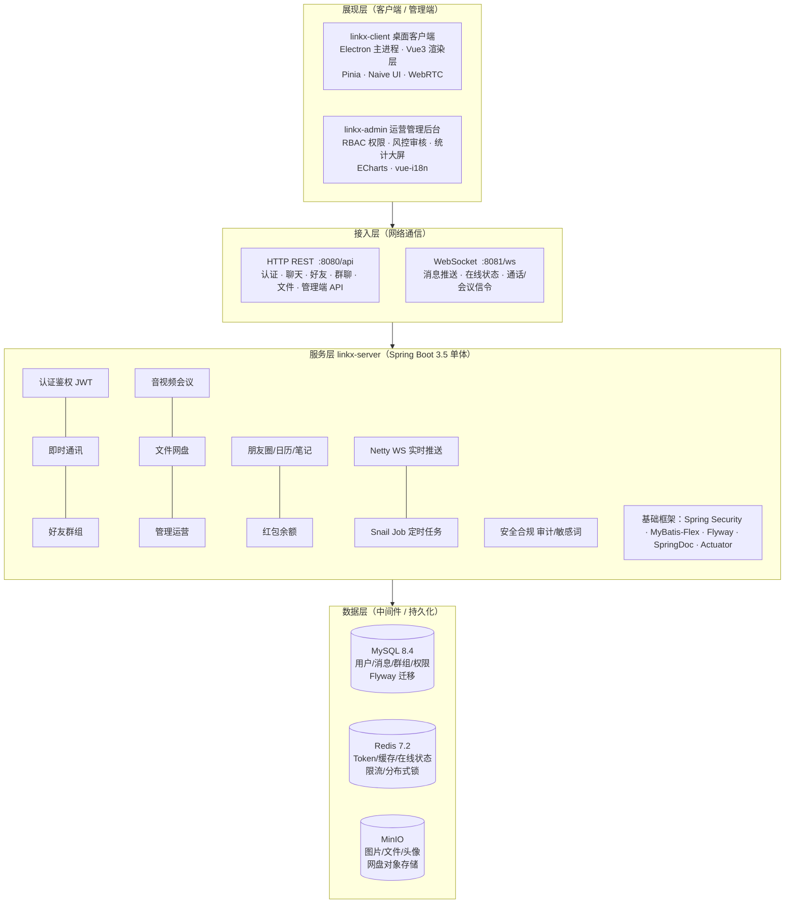

<!-- 作者：yangleduo -->
<div align="center">

<div style="line-height:1;">

<h1 style="margin:-10px 0 10px;padding:0;border:0;font-size:2em;line-height:1;">LinkX</h1>
</div>

[](https://openjdk.org/)
[](https://spring.io/projects/spring-boot)
[](https://vuejs.org/)
[](https://www.electronjs.org/)
[](https://mybatis-flex.com/)
[](https://netty.io/)
[](https://snailjob.opensnail.com/)
[](https://min.io/)
[](https://redis.io/)
[](https://www.mysql.com/)
[](https://gitee.com/yangleduo7788/link-x)

**企业级即时通讯与协同平台**

https://gitee.com/yangleduo7788/link-x

</div>

## 目录

- [一、项目介绍](#一项目介绍)
- [二、界面预览](#二界面预览)
- [三、项目特性](#三项目特性)
- [四、技术架构](#四技术架构)
- [五、环境要求](#五环境要求)
- [六、快速上手](#六快速上手)
- [七、目录结构](#七目录结构)
- [八、配置说明](#八配置说明)
- [九、构建与部署](#九构建与部署)
- [十、常见问题](#十常见问题)
- [十一、贡献指南](#十一贡献指南)
- [十二、更新日志](#十二更新日志)
- [十三、许可证](#十三许可证)

---

## 一、项目介绍

LinkX 是一套**前后端分离**的企业级即时通讯（IM）解决方案，由桌面客户端、运营管理后台与单体后端服务组成，适用于团队内部沟通、协同办公与后台运营场景。

| 子工程 | 定位 | 技术栈 |
|--------|------|--------|
| `linkx-client` | 跨平台桌面 IM 客户端 | Vue 3、Electron、Pinia、Naive UI |
| `linkx-admin` | Web 运营管理后台 | Vue 3、Vite、ECharts、RBAC |
| `linkx-server` | 业务与实时消息服务 | Spring Boot 3.5、Netty、MyBatis-Flex |

**通信方式：**

| 通道 | 默认地址 | 用途 |
|------|----------|------|
| REST API | `http://localhost:8080/api` | 认证、聊天、好友、群聊、文件等业务接口 |
| WebSocket | `ws://localhost:8081/ws` | 即时消息推送、在线状态、通话信令 |

---

## 二、界面预览

### 客户端

<div align="center">


**图 1 · 客户端登录页**

<br />


**图 2 · 客户端主界面**

</div>

### 管理端

<div align="center">


**图 3 · 管理端工作台**

</div>

---

## 三、项目特性

- **即时消息**：单聊 / 群聊；文本、图片、文件、语音；支持引用、编辑、撤回、转发
- **实时推送**：HTTP 拉取历史 + Netty WebSocket 实时下发
- **音视频会议**：WebRTC 单聊通话；多人 Mesh 会议（无 SFU）
- **社交协作**：朋友圈、日历、笔记与收藏
- **文件能力**：聊天文件、群文件 / 群相册、个人网盘（MinIO 对象存储）
- **账户安全**：双 Token 鉴权、图形验证码、登录风控、敏感词过滤、操作审计
- **管理运营**：用户 / 角色 / 权限、内容审核、风控策略、统计大屏、系统监控

---

## 四、技术架构



**核心技术栈与版本：**

<details>
<summary>点击展开完整依赖版本</summary>

#### 运行环境

| 工具 | 版本 |
|------|------|
| JDK | 21 |
| Maven | 3.8+ |
| Node.js | 18+（推荐 20 / 22） |
| Docker | 用于本地中间件 |

#### 中间件（docker-compose）

| 组件 | 版本 |
|------|------|
| MySQL | 8.4.0 |
| Redis | 7.2.4 |
| MinIO | RELEASE.2024-05-10T01-41-38Z |

#### linkx-server

| 依赖 | 版本 |
|------|------|
| Spring Boot | 3.5.0 |
| MyBatis-Flex | 1.9.3 |
| Spring Security | 6.4.5 |
| Netty | 4.1.115.Final |
| JJWT | 0.12.5 |
| MinIO SDK | 8.5.7 |
| SpringDoc OpenAPI | 2.8.9 |

#### linkx-client（package-lock）

| 依赖 | 版本 |
|------|------|
| Vue | 3.5.39 |
| Vite | 5.4.21 |
| Electron | 33.4.11 |
| Pinia | 2.3.1 |
| Naive UI | 2.44.1 |

#### linkx-admin（package-lock）

| 依赖 | 版本 |
|------|------|
| Vue | 3.5.40 |
| Vite | 8.1.5 |
| ECharts | 6.1.0 |
| vue-i18n | 9.14.4 |
| Naive UI | 2.44.1 |

</details>

---

## 五、环境要求

### 5.1 前置条件

开始之前，请确认本机已安装：

| 序号 | 依赖 | 说明 |
|------|------|------|
| 1 | JDK 21 | 后端编译与运行；IDE 模块 SDK 须指向 JDK 21 |
| 2 | Maven 3.8+ | 后端构建 |
| 3 | Node.js 18+ | 前端与管理端 |
| 4 | Docker | 本地启动 MySQL / Redis / MinIO |
| 5 | Git | 拉取代码 |

### 5.2 端口占用

| 端口 | 服务 |
|------|------|
| 3306 | MySQL |
| 6379 | Redis |
| 9000 / 9001 | MinIO API / Console |
| 8080 | 后端 HTTP API |
| 8081 | IM WebSocket |
| 5173 | 客户端 Web 开发（Vite 默认） |
| 5174 | 管理端开发 |

### 5.3 约束与限制

- 后端配置通过 `.env.local` / `.env.prod` 注入，**禁止**将密钥写入 `application.yml`
- `JWT_SECRET` 长度须 ≥ 32 字符，否则启动校验失败
- `CORS_ALLOWED_ORIGINS` 须配置明确 Origin 白名单，不允许使用 `*`
- Electron 渲染进程不开启 `nodeIntegration`，仅通过 Preload 暴露有限 API

---

## 六、快速上手

> 以下步骤可在约 10 分钟内完成本地联调环境搭建。

### 6.1 获取代码

```bash
git clone https://gitee.com/yangleduo7788/link-x.git
cd link-x
```

### 6.2 启动中间件

```bash
cd linkx-server
docker-compose up -d
```

等待 MySQL、Redis、MinIO 健康检查通过后继续。

### 6.3 配置后端

```bash
# Windows
copy .env.local.example .env.local

# Linux / macOS
cp .env.local.example .env.local
```

编辑 `.env.local`，**至少填写**下表字段：

| 变量 | 必填 | 说明 |
|------|:----:|------|
| `JWT_SECRET` | ✓ | 签名密钥，≥ 32 字符。生成：`openssl rand -base64 32` |
| `DB_PASSWORD` | ✓ | MySQL 密码，与 docker-compose 保持一致 |
| `REDIS_PASSWORD` | ✓ | Redis 密码，与 docker-compose 保持一致 |
| `MINIO_ACCESS_KEY` | ✓ | MinIO 访问密钥 |
| `MINIO_SECRET_KEY` | ✓ | MinIO 秘密密钥 |
| `CORS_ALLOWED_ORIGINS` | ✓ | 例：`http://localhost:5173,http://127.0.0.1:5174` |

### 6.4 启动后端

**方式 A：IDE（推荐开发调试）**

1. 用 IntelliJ IDEA 打开 `linkx-server` 目录（或根目录并加载 Maven 模块）
2. `Project Structure` → `SDK` 选择 **JDK 21**
3. 运行 `com.linkx.server.LinkXServerApplication`

**方式 B：命令行**

```bash
cd linkx-server
mvn spring-boot:run
```

启动成功后访问：

| 端点 | 地址 |
|------|------|
| API 根路径 | http://localhost:8080/api |
| Swagger 文档 | http://localhost:8080/api/swagger-ui.html |
| 健康检查 | http://localhost:8080/api/actuator/health |
| WebSocket | ws://localhost:8081/ws |

### 6.5 启动桌面客户端

```bash
cd linkx-client
copy .env.example .env        # Windows；Linux/macOS 用 cp
npm install
npm run electron:dev          # Electron 桌面模式
```

纯浏览器调试：`npm run dev`

### 6.6 启动管理后台（可选）

```bash
cd linkx-admin
npm install
npm run dev
```

浏览器打开 http://127.0.0.1:5174 ，使用具备 `admin` 或 `super_admin` 角色的账号登录。

---

## 七、目录结构

```text
link-x/
├── assets/                    # 仓库级资源（Logo、界面预览图）
│   ├── logo.png
│   ├── client-login.png       # 客户端登录页
│   ├── client-ui.png          # 客户端主界面
│   └── admin-ui.png           # 管理端工作台
├── linkx-client/              # 桌面客户端
│   ├── electron/              # Electron 主进程、Preload
│   ├── build/                 # 应用图标（electron-builder）
│   ├── scripts/               # 开发脚本
│   └── src/                   # Vue 渲染进程
│       ├── api/               # 接口封装
│       ├── components/        # 业务组件
│       └── stores/            # Pinia 状态
├── linkx-admin/               # 管理后台
│   └── src/
│       ├── views/             # 页面
│       ├── router/            # 路由
│       └── stores/            # 状态
└── linkx-server/              # 后端服务
    ├── docker/                # 数据库初始化脚本
    ├── docker-compose.yml     # 本地中间件编排
    ├── pom.xml
    └── src/main/
        ├── java/com/linkx/server/
        │   ├── controller/    # REST 接口
        │   ├── service/       # 业务逻辑
        │   ├── mapper/        # 数据访问
        │   └── im/            # Netty WebSocket
        └── resources/
            ├── application.yml
            └── db/migration/  # Flyway 版本脚本
```

---

## 八、配置说明

### 8.1 客户端环境变量

文件：`linkx-client/.env`（参考 `.env.example`）

```properties
VITE_API_BASE_URL=http://localhost:8080/api
VITE_WS_BASE_URL=ws://localhost:8081
```

### 8.2 后端环境变量

| 文件 | 场景 |
|------|------|
| `.env.local` | 本地开发（`SPRING_PROFILES_ACTIVE=local`） |
| `.env.prod` | 生产部署 |
| `.env.docker` | 容器化部署 |

模板文件：`.env.local.example`、`.env.prod.example`、`.env.docker.example`

主配置文件仅保留一份 `application.yml`，所有业务参数通过环境变量占位符 `${VAR}` 注入。

### 8.3 认证机制

| 项目 | 说明 |
|------|------|
| Access Token | 默认有效期 2 小时 |
| Refresh Token | 默认有效期 7 天，Redis 存储，支持吊销 |
| 自动登录 | 客户端勾选后使用 Refresh Token 静默换票 |
| 安全存储 | Electron 下 Token / 锁屏 PIN 使用 OS 级 `safeStorage` 加密 |
| 401 处理 | 前端自动 Refresh 并重试原请求 |

---

## 九、构建与部署

### 9.1 后端

```bash
cd linkx-server
mvn -DskipTests package          # 产出 target/linkx-server-*.jar
java -jar target/linkx-server-1.0.0-SNAPSHOT.jar
```

### 9.2 桌面客户端

#### 打包命令

```bash
cd linkx-client
npm install
npm run electron:build           # 安装包输出至 release/LinkX-Setup-{version}.exe
```

`electron:build` 由 `scripts/electron-build.mjs` 统一执行，会自动完成：

1. 生成 NSIS 安装资源（`build/installer-sidebar.bmp`、`installer-header.bmp`、`license.rtf`）
2. TypeScript 类型检查（`vue-tsc`）
3. Vite 构建（`--mode electron`）
4. electron-builder 打 Windows NSIS 安装包

单独生成安装向导资源（不打包）：

```bash
npm run installer:assets
```

#### 输出产物

| 路径 | 说明 |
|------|------|
| `linkx-client/release/LinkX-Setup-1.0.0.exe` | NSIS 安装包（对外分发） |
| `linkx-client/release/win-unpacked/` | 免安装目录（调试用） |

#### 安装包行为（当前配置）

- **图形安装**：中文向导、LinkX Logo 侧边栏、许可协议页、可选安装路径、桌面/开始菜单快捷方式
- **安装完成**：自动启动 LinkX
- **应用内更新**：静默安装（`/S`），完成后由 NSIS 脚本自动拉起新版本

相关配置见 `linkx-client/package.json` → `build.nsis`、`build/installer.nsh`。

#### 国内网络打包（已内置）

脚本默认使用 npmmirror，一般**无需**再手动设置环境变量：

| 变量 | 默认值 | 用途 |
|------|--------|------|
| `ELECTRON_MIRROR` | `https://npmmirror.com/mirrors/electron/` | 下载 Electron 运行时 |
| `ELECTRON_BUILDER_BINARIES_MIRROR` | `https://npmmirror.com/mirrors/electron-builder-binaries/` | 下载 NSIS、winCodeSign 等工具 |
| `CSC_IDENTITY_AUTO_DISCOVERY` | `false` | 未配置证书时不尝试代码签名 |

若需覆盖镜像，可在打包前自行 export / `$env:` 设置上述变量。

#### 本地打包常见问题与处理

| 现象 | 原因 | 处理方法 |
|------|------|----------|
| `vue-tsc --noEmit` 报大量 TS 错误 | 前端类型问题 | 先执行 `npx vue-tsc --noEmit` 定位；修完后再打包 |
| 下载 `electron-v*-win32-x64.zip` 失败，DNS 解析 `github.com` / `release-assets.githubusercontent.com` 失败 | 默认从 GitHub 拉 Electron | 使用 `npm run electron:build`（已配 `ELECTRON_MIRROR`）；或手动设置 `$env:ELECTRON_MIRROR="https://npmmirror.com/mirrors/electron/"` |
| 下载 `winCodeSign-*.7z` 失败 | electron-builder 工具链默认走 GitHub | 使用 `npm run electron:build`（已配 `ELECTRON_BUILDER_BINARIES_MIRROR`） |
| 解压 winCodeSign 报错 `Cannot create symbolic link` /「客户端没有所需的特权」 | 7z 内含符号链接，普通用户无权限创建 | **当前方案**：`package.json` 中 `win.signAndEditExecutable: false` 跳过 winCodeSign；**备选**：开启 Windows **开发人员模式**，或以管理员运行终端后再打包 |
| 安装向导协议页中文乱码 | NSIS 对 `.txt` 许可文件按 ANSI 解析，UTF-8 中文会显示为乱码 | 使用 `build/license.rtf`（Unicode RTF，由 `installer:assets` 自动生成）；修改后需重新 `npm run electron:build` |
| `makensis` 报错 `MUI_BGCOLOR already defined` | `installer.nsh` 的 `customHeader` 与 electron-builder 内置 MUI 宏重复定义 | 勿在 `customHeader` 中重复 `!define MUI_BGCOLOR` 等；仅保留 `customInstall` / `customFinish` |
| 安装时 SmartScreen 提示「未知发布者」 | 安装包未做代码签名 | 内测可点「更多信息 → 仍要运行」；正式对外分发需购买 Code Signing 证书（见下方） |
| `electron:dev` 里测不了安装向导 | 开发模式不走 NSIS | 必须用 `electron:build` 产出 exe 后双击安装测试 |

#### 代码签名（可选，正式分发建议）

当前为**未签名**配置（`win.sign: null`、`signAndEditExecutable: false`），适合开发与内测。

正式对外发布需向 CA 购买 **Code Signing** 或 **EV Code Signing** 证书（需付费，无完全免费的等价替代）。配置示例：

```powershell
$env:CSC_LINK="D:\certs\linkx.pfx"      # 或 CI 中用 base64
$env:CSC_KEY_PASSWORD="证书密码"
$env:CSC_IDENTITY_AUTO_DISCOVERY="true"
```

并在 `package.json` 的 `build.win` 中移除 `sign: null`，将 `signAndEditExecutable` 设为 `true` 后重新 `npm run electron:build`。

#### 安装包测试速查

```powershell
# 图形安装（向导、协议、路径、快捷方式、安装后自启）
.\release\LinkX-Setup-1.0.0.exe

# 静默安装（模拟应用内更新）
.\release\LinkX-Setup-1.0.0.exe /S
```

### 9.3 管理后台

```bash
cd linkx-admin
npm run build                    # 静态资源输出至 dist/
```

### 9.4 常用命令速查

| 子工程 | 命令 | 说明 |
|--------|------|------|
| server | `mvn spring-boot:run` | 开发启动 |
| server | `docker-compose up -d` | 启动中间件 |
| server | `docker-compose down` | 停止中间件 |
| client | `npm run electron:dev` | Electron 热更新开发 |
| client | `npm run electron:build` | 打 Windows 安装包（`release/`） |
| client | `npm run installer:assets` | 仅生成 NSIS 侧边栏/协议等资源 |
| client | `npm run dev` | Web 开发 |
| admin | `npm run dev` | 管理端开发（:5174） |
| admin | `npm run lint` | ESLint 检查 |

---

## 十、常见问题

### Q1：IDE 提示 `JDK isn't specified for module 'linkx-server'`

**原因：** 模块未绑定 JDK，或 Maven 未重新导入。

**处理：**

1. `File` → `Project Structure` → `Project SDK` 选择 **JDK 21**
2. `Modules` → `linkx-server` → `Module SDK` 选 **Project SDK**
3. Maven 面板点击 **Reload All Maven Projects**

### Q2：后端启动报 `JWT_SECRET` 相关错误

**原因：** 未配置或密钥长度不足 32 字符。

**处理：** 在 `.env.local` 中设置 `JWT_SECRET`，可用 `openssl rand -base64 32` 生成。

### Q3：前端无法连接后端 / WebSocket

**检查项：**

1. 后端是否已启动（8080 / 8081 端口）
2. `linkx-client/.env` 中 `VITE_API_BASE_URL`、`VITE_WS_BASE_URL` 是否正确
3. `.env.local` 中 `CORS_ALLOWED_ORIGINS` 是否包含前端 Origin

### Q4：管理端登录失败

**检查项：**

1. 后端 Flyway 迁移是否执行完成
2. 账号是否具备 `admin` 或 `super_admin` 角色
3. 浏览器访问地址是否为 http://127.0.0.1:5174

### Q5：数据库结构如何变更

**规范：** 在 `linkx-server/src/main/resources/db/migration/` 新增 `V{n}__描述.sql`，由 Flyway 自动迁移。**禁止**直接修改生产库表结构。

### Q6：`npm run electron:build` 失败怎么办

**优先确认：** 是否在 `linkx-client` 目录执行、是否已 `npm install`。

**按报错对照处理：**

1. **`vue-tsc` 类型错误** — 先 `npx vue-tsc --noEmit` 修完再打包。
2. **下载 Electron / GitHub 相关超时** — 使用项目自带的 `npm run electron:build`（已配置国内镜像）；勿单独跑未带镜像的 `electron-builder`。
3. **`winCodeSign` 符号链接权限错误** — 项目已默认 `signAndEditExecutable: false`；若你改过配置又出现此错，改回该选项或开启 Windows 开发人员模式。
4. **打包成功但安装有 SmartScreen 警告** — 未签名属正常；正式发版需购买代码签名证书。

完整说明见 **[九、构建与部署 → 9.2 桌面客户端](#92-桌面客户端)**。

---

## 十一、贡献指南

欢迎通过 Issue 反馈问题，或通过 Pull Request 提交代码。完整说明见 **[CONTRIBUTING.md](./CONTRIBUTING.md)**。

### 11.1 快速流程

```text
同步 master → 创建分支 → 开发自测 → 提交 PR → Review → 合并
```

### 11.2 分支与提交

| 项 | 规范 |
|----|------|
| 分支命名 | `feat/`、`fix/`、`docs/`、`refactor/` + 简述 |
| 提交格式 | `type(scope): 中文描述`，如 `feat(client): 支持群公告置顶` |
| scope | `client` / `admin` / `server` |

### 11.3 提交前检查

| 子工程 | 最低验证 |
|--------|----------|
| server | `mvn -DskipTests compile` |
| client | `npm run electron:dev` 或 `npm run dev` 可启动 |
| admin | `npm run dev` 可启动 |
| 数据库 | 新增 Flyway 脚本 `V{n}__*.sql`，禁止手改生产库 |

### 11.4 问题反馈

- 功能建议 / 缺陷：[Gitee Issues](https://gitee.com/yangleduo7788/link-x/issues)
- 安全问题：请勿公开 Issue，联系仓库维护者

---

## 十二、更新日志

版本变更记录见 **[CHANGELOG.md](./CHANGELOG.md)**。

### 当前版本概览

| 版本 | 日期 | 摘要 |
|------|------|------|
| Unreleased | — | README 规范重构；仓库精简（移除 CI / 测试 / 独立文档目录） |
| **1.0.0** | 2026-08-09 | 首个稳定基线：IM 核心链路、WebRTC 会议、管理端 RBAC、双 Token 鉴权 |

<details>
<summary>1.0.0 主要能力（点击展开）</summary>

- **客户端**：单聊 / 群聊、消息状态与已读回执、朋友圈、日历、笔记、网盘、Electron 桌面端
- **管理端**：用户权限、风控审核、统计大屏、系统监控
- **服务端**：REST + Netty WebSocket、MinIO 存储、Flyway 迁移、敏感词与审计

</details>

---

## 十三、许可证

本项目为**私有仓库**，未经授权不得对外分发。

| 项目 | 信息 |
|------|------|
| 代码托管 | https://gitee.com/yangleduo7788/link-x |
| 许可证 | Private（保留所有权利） |

---

<div align="center">

**LinkX** — 让团队沟通更高效

</div>
